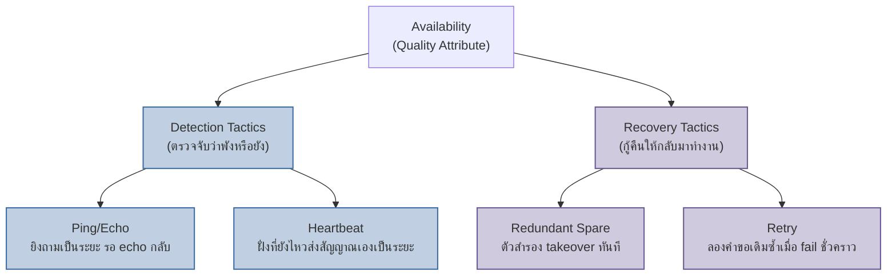

เชฟมืออาชีพไม่ได้เรียนรู้ "สูตรอาหารฝรั่งเศส" หรือ "สูตรอาหารไทย" เป็นก้อนใหญ่ก้อนเดียว แต่เรียนรู้เทคนิคย่อยทีละอย่าง เช่น การ blanching ผักให้สีสดโดยไม่สุกเกิน หรือการ deglaze กระทะเพื่อดึงรสที่ติดก้นออกมา เทคนิคเดียวกันนี้เอาไปใช้ได้ทั้งในครัวฝรั่งเศสและครัวไทย เพราะมันแก้ปัญหาเฉพาะจุดหนึ่งเท่านั้น ไม่ได้ผูกติดกับสไตล์อาหารใดสไตล์หนึ่งเลย สถาปัตยกรรมซอฟต์แวร์ก็มีเทคนิคย่อยแบบนี้อยู่เหมือนกัน

เทคนิคย่อยเหล่านี้ในโลกสถาปัตยกรรมซอฟต์แวร์เรียกว่า <mark class="hl-term">**Architecture Tactics**</mark> — การตัดสินใจออกแบบขนาดเล็กที่มุ่งแก้ quality attribute (ility) ตัวใดตัวหนึ่งโดยเฉพาะเจาะจง ต่างจาก architectural pattern/style (เช่น microservices, layered architecture, event-driven architecture) ที่เป็นโครงสร้างระดับใหญ่ครอบคลุมทั้งระบบ tactic คือหน่วยที่ **เล็กกว่า** และ **เจาะจงกว่า** pattern มาก — pattern หนึ่งตัวมักประกอบขึ้นจาก tactic หลายตัวรวมกัน ไม่ใช่ในทางกลับกัน

## Tactic กับ Pattern อยู่คนละชั้น ไม่ใช่คำพ้องความหมาย

ตัวอย่างที่เห็นภาพชัดที่สุดคือ Availability — pattern อย่าง "multi-region deployment พร้อม automatic failover" (แบบที่เห็นใน ADR ของหัวข้อ Quality Attributes ก่อนหน้าในโมดูลนี้) จริงๆ แล้วไม่ใช่กลไกเดียว แต่ประกอบขึ้นจาก tactic ย่อยหลายตัวทำงานร่วมกัน: ต้องมีทางรู้ว่า region ไหน fail ไปแล้ว (detection tactic), ต้องมีทางสลับ traffic ไปยัง region ที่ยังทำงานอยู่ได้ (recovery tactic), และอาจต้องมีทางกันไม่ให้ fault ของ region หนึ่งลามไปกระทบ region อื่น (prevention tactic) — พูดสั้นๆ คือ pattern บอกแค่ "ภาพใหญ่จะเป็นยังไง" ส่วน tactic บอกว่า "กลไกจริงที่ทำให้ภาพใหญ่นั้นเกิดขึ้นได้จริงคืออะไร"

นี่คือเหตุผลที่วิศวกรระดับ senior เวลาคุยเรื่องสถาปัตยกรรมมักไม่หยุดอยู่แค่ชื่อ pattern แต่จะถามต่อทันทีว่า "แล้วกลไกตรวจจับ failure ใช้อะไร" หรือ "ตอน failover เกิดอะไรขึ้นจริงๆ ในระดับ mechanism" เพราะชื่อ pattern เพียงอย่างเดียวไม่บอกว่าระบบจะรอดจริงหรือเปล่า

## รายชื่อ Tactic ที่เจอบ่อย แยกตาม Quality Attribute

แต่ละ quality attribute มีชุด tactic เฉพาะตัวของมันเอง ตัวอย่างที่เจอบ่อยที่สุดในงานจริง:

**Availability**
- **Ping/Echo** — ฝั่งตรวจสอบยิง request เบาๆ ถามฝั่งเป้าหมายเป็นระยะว่า "ยังไหวอยู่ไหม" แล้วรอ echo กลับมาภายในเวลาที่กำหนด
- **Heartbeat** — ฝั่งที่ยังทำงานอยู่เป็นคนส่งสัญญาณ "ฉันยังไหว" ออกไปเองเป็นระยะ โดยไม่ต้องมีใครมาถาม ถ้าสัญญาณหายไปเกินเวลาที่กำหนด ถือว่า fail แล้ว
- **Redundant Spare** — มีตัวสำรอง (standby) พร้อม takeover งานแทนตัวหลักทันทีเมื่อตัวหลัก fail

**Performance**
- **Increase Resources** — เพิ่มทรัพยากรดิบตรงๆ (scale up เพิ่ม CPU/RAM ต่อเครื่อง หรือ scale out เพิ่มจำนวนเครื่อง)
- **Manage Resource Demand** — ควบคุมปริมาณงานที่เข้ามาแทนที่จะเพิ่มทรัพยากรรับมือ เช่น rate limiting จำกัดจำนวน request ต่อวินาที หรือจัดลำดับความสำคัญ (prioritize) ให้ request สำคัญได้ประมวลผลก่อน

**Modifiability**
- **Encapsulate** — ซ่อนรายละเอียดการ implement ไว้หลัง interface เดียว ผู้เรียกใช้เห็นแค่ contract ไม่เห็นว่าข้างในทำงานยังไง เปลี่ยน implementation ได้โดยไม่กระทบผู้เรียก
- **Use an Intermediary** — แทรกชั้นกลาง (adapter, facade, gateway) คั่นระหว่างสองส่วนที่ต้องคุยกัน เพื่อให้สลับฝั่งใดฝั่งหนึ่งได้โดยไม่ต้องแก้อีกฝั่ง

## แตก Availability ออกเป็น Detection Tactic กับ Recovery Tactic

tactic ของ quality attribute เดียวกันยังแบ่งเป็นหมวดย่อยตามว่ามันทำหน้าที่อะไรในลำดับการรับมือ failure ได้อีกชั้นหนึ่ง — สำหรับ Availability แบ่งกว้างๆ ได้เป็น <mark class="hl-term">Detection Tactic</mark> (ตรวจจับว่าพังหรือยัง) กับ Recovery Tactic (กู้คืนให้กลับมาทำงานได้) สองหมวดนี้ต้องมีครบทั้งคู่ระบบถึงจะ available จริง มี detection แต่ไม่มี recovery ก็แค่รู้ว่าพังแต่แก้ไม่ได้ มี recovery แต่ไม่มี detection ก็ไม่รู้ด้วยซ้ำว่าต้อง trigger เมื่อไหร่



## Tactic เดียวอยู่ในหลาย Pattern ได้พร้อมกัน

นี่คือจุดที่หลายคนเข้าใจผิดตอนเริ่มเรียนเรื่องนี้ — คิดว่า heartbeat เป็น "ของ" microservices เพราะเจอบ่อยในบริบทนั้น แต่ความจริงแล้ว <mark class="hl-insight">tactic ตัวเดียวใช้ได้ในหลาย pattern พร้อมกัน เพราะมันทำงานอยู่ในชั้นที่ต่ำกว่าและเป็นอิสระจากภาพใหญ่ระดับ pattern — pattern ถูกประกอบขึ้นจาก tactic ไม่ใช่ tactic ถูกผูกติดกับ pattern ใดตัวหนึ่งเป็นการเฉพาะ</mark> heartbeat ใช้ตรวจจับ failure ได้ทั้งในระบบ microservices ที่มี node เป็นร้อย และในระบบ monolith ธรรมดาที่มีแค่ตัวหลักกับตัวสำรองสองเครื่อง

```demo
component: StepThroughDiagram
props: {"steps":[{"label":"1. Tactic เดียว: Heartbeat","detail":"นิยาม: node ที่ยังทำงานอยู่ส่งสัญญาณ 'ฉันยังไหว' ออกไปเป็นระยะ เช่นทุก 2 วินาที ถ้าฝั่งตรวจสอบไม่เห็นสัญญาณภายในเวลาที่กำหนด ถือว่า node นั้น fail แล้ว"},{"label":"2. ใช้ใน Microservices Pattern","detail":"แต่ละ service ส่ง heartbeat เข้า service registry เช่น Consul หรือ Eureka ถ้า service ไหนหยุดส่ง registry จะเอา service นั้นออกจาก load balancer ทันที คนละ pattern ระดับใหญ่ (distributed system เป็นสิบเป็นร้อย node) แต่ tactic ที่ใช้ตรวจจับความพังคือ heartbeat ตัวเดียวกัน"},{"label":"3. ใช้ใน Monolith + Hot Standby Pattern","detail":"monolith ตัวหลัก (active) ส่ง heartbeat ให้ตัวสำรอง (standby) รู้ว่ายังทำงานอยู่ ถ้า standby ไม่ได้รับสัญญาณ มันจะ promote ตัวเองขึ้นมาเป็น active แทน pattern ระดับใหญ่ต่างกันสุดขั้ว (แค่ 2 เครื่อง ไม่มี distributed system เลย) แต่กลไกตรวจจับความพังก็ยังเป็น heartbeat ตัวเดียวกันเป๊ะ"},{"label":"4. สรุป","detail":"Heartbeat ไม่ใช่ของ 'microservices' หรือของ 'monolith' โดยเฉพาะ มันเป็น tactic ที่อยู่ต่ำกว่าระดับ pattern และเลือกหยิบมาใช้ได้ไม่ว่าระบบจะเลือก pattern ระดับใหญ่แบบไหนก็ตาม"}]}
```

## เชื่อมกับ ATAM: Tactic คือกลไกที่ทำให้ Trade-off จับต้องได้

หัวข้อ ATAM (Architecture Tradeoff Analysis Method) ก่อนหน้าในโมดูลนี้สอนให้เขียน trade-off เป็นประโยคแบบ "เลือก X เพื่อ Availability แลกกับ Y ที่ลดลง" — ประโยคแบบนี้ถูกต้องในระดับการตัดสินใจ แต่ยังเป็นนามธรรมอยู่ดีถ้าไม่มีใครตอบต่อได้ว่า "X" ที่ว่านั้นทำงานยังไงจริงๆ <mark class="hl-warning">ทีมที่หยุดแค่พูดว่า "เราเลือก microservices เพื่อ availability" โดยตอบไม่ได้ว่ากลไกตรวจจับและกู้คืน failure ใช้ tactic อะไรบ้าง คือทีมที่ยังไม่ได้ตัดสินใจอะไรจริงจังเลย — แค่เลือกชื่อ pattern ที่ฟังดูน่าเชื่อถือเฉยๆ</mark>

tactic คือสิ่งที่เติมเต็มช่องว่างนั้น เพราะ<mark class="hl-insight">มันแปลง trade-off จากคำพูดลอยๆ ให้กลายเป็นกลไกที่ชี้ตัวได้ วัดผลได้ และถกเถียงเรื่องต้นทุนได้อย่างเป็นรูปธรรม</mark> เช่นแทนที่จะพูดว่า "เราแลก consistency เพื่อ availability" ทีมที่ลงลึกถึงระดับ tactic จะพูดได้ว่า "เราใช้ Heartbeat ตรวจจับ node fail ภายใน 6 วินาที แล้วให้ Redundant Spare promote ตัวเองขึ้นมาแทน ซึ่งระหว่างช่วง 6 วินาทีนั้น request บางส่วนจะ fail ไปก่อน" — ประโยคหลังนี้เอาไปเขียนเป็น scenario แบบ ATAM ได้ตรงๆ และเอาไปทดสอบได้จริงว่าทำสำเร็จหรือไม่

| Tactic | Quality Attribute ที่เสิร์ฟ | ต้นทุนที่ต้องแลก |
|---|---|---|
| Ping/Echo | Availability — ตรวจจับ failure โดยฝั่งตรวจสอบเป็นฝ่ายถาม | มี traffic ตรวจสอบเพิ่มตลอดเวลา แม้ตอนที่ทุกอย่างปกติดี |
| Heartbeat | Availability — ตรวจจับ failure โดยฝั่งที่ยังไหวส่งสัญญาณเอง | ต้อง tuning timeout ให้พอดี สั้นไปจะ false positive ยาวไปจะรู้ตัวช้า |
| Redundant Spare | Availability — กู้คืนเร็วด้วยตัวสำรองที่พร้อม takeover | ต้นทุน infra เพิ่มเท่าตัวหรือมากกว่า เพราะเครื่องสำรองไม่ได้ใช้งานส่วนใหญ่ของเวลา |
| Increase Resources | Performance — throughput และ latency ดีขึ้นตรงๆ | ค่าใช้จ่าย infra สูงขึ้นตรงๆ และไม่แก้ปัญหาถ้า bottleneck จริงอยู่ที่ design ไม่ใช่ resource |
| Manage Resource Demand | Performance — ปกป้องระบบไม่ให้ล่มตอนโหลดพุ่ง | บาง request ถูกปฏิเสธหรือหน่วงไว้ กระทบ user experience ของบางกลุ่ม |
| Encapsulate | Modifiability — แก้ implementation ได้โดยไม่กระทบผู้เรียกใช้ | เพิ่ม layer ของ abstraction ทำให้ trace โค้ดข้ามชั้นยากขึ้นเล็กน้อย |
| Use an Intermediary | Modifiability — สลับ dependency ฝั่งใดฝั่งหนึ่งได้โดยไม่แก้อีกฝั่ง | เพิ่ม indirection หนึ่งชั้น อาจกระทบ performance เล็กน้อยและเพิ่มความซับซ้อนตอน debug |

## มุมมองตอนสัมภาษณ์งาน

คำถามสัมภาษณ์: "ระบบมี uptime แค่ 99% อยากได้ 99.99% จะทำยังไง" คำตอบระดับ junior มักตอบทันทีว่า "เพิ่ม server สำรอง" หรือ "ทำ load balancer" โดยไม่ถามต่อว่า downtime ที่เกิดขึ้นตอนนี้มาจากขั้นตอนไหนของการรับมือ failure คำตอบระดับ senior จะย้อนถามก่อนว่าปัญหาปัจจุบันอยู่ที่ detection หรือ recovery — ถ้าระบบพังแล้ว "ไม่รู้ตัว" อยู่นานหลายนาทีกว่าจะมีคนสังเกตเห็น (ขาด detection tactic อย่าง heartbeat หรือ ping/echo) การเพิ่ม redundant spare เข้าไปก็ช่วยได้ไม่เต็มที่ เพราะตัวสำรองจะไม่ถูก trigger ให้ทำงานจนกว่าจะมีคน manual failover เอง สิ่งที่ต้องแก้ก่อนคือ tactic ฝั่ง detection ไม่ใช่ recovery การตอบแบบนี้แสดงให้เห็นว่าเข้าใจว่า Availability ไม่ใช่ตัวเลขก้อนเดียวที่แก้ด้วยการซื้อเครื่องเพิ่ม แต่ประกอบด้วย tactic ย่อยหลายจุดที่ต้องวินิจฉัยให้ตรงจุดที่ขาดจริงก่อนลงมือแก้

## ADR ตัวอย่าง

> **Title:** เลือกใช้ Heartbeat + Redundant Spare เป็น Tactic หลักสำหรับ Availability ของ Payment Service
> **Status:** Accepted
> **Context:** ต่อยอดจาก ADR ก่อนหน้าที่จัดลำดับความสำคัญให้ Availability สูงกว่า Feature velocity และ Cost สำหรับระบบ Payment Gateway แต่ ADR นั้นระบุแค่ระดับ pattern (multi-region deployment) ทีมยังไม่เคยตกลงกันชัดเจนว่ากลไกตรวจจับและกู้คืน failure ระดับ tactic จะใช้อะไร ทำให้ตอน incident จริงเกิดความสับสนว่าใครควรเป็นคน trigger failover และ trigger เมื่อไหร่
> **Decision:** ใช้ Heartbeat เป็น detection tactic โดยตัวหลักส่งสัญญาณทุก 2 วินาที และถือว่า fail เมื่อขาดสัญญาณติดกันเกิน 6 วินาที จากนั้นใช้ Redundant Spare เป็น recovery tactic โดยตัวสำรอง promote ตัวเองเป็น active อัตโนมัติทันทีที่ตรวจพบว่า heartbeat ขาดหาย แทนที่จะใช้ Ping/Echo ซึ่งต้องให้ฝั่งตรวจสอบเป็นคนยิงถามเอง เพราะ Payment Service มี node จำนวนน้อยและอยากให้ฝั่งที่ยังทำงานอยู่เป็นคนประกาศสถานะตัวเองเชิงรุกแทน
> **Consequences:** ระบบตรวจจับ failure และ failover ได้อัตโนมัติภายในเวลาที่คาดการณ์ได้ชัดเจน (สูงสุด 6 วินาที) แต่ระหว่างช่วงเวลานั้น request ที่เข้ามาพอดีอาจ fail ไปก่อนที่ตัวสำรองจะ promote เสร็จ ทีมต้องเพิ่ม retry tactic ฝั่ง client เพื่อรองรับช่วงเปลี่ยนผ่านนี้ และต้อง tuning ค่า timeout 6 วินาทีอย่างระมัดระวัง เพราะสั้นไปจะเกิด false failover บ่อยเกินจำเป็น
