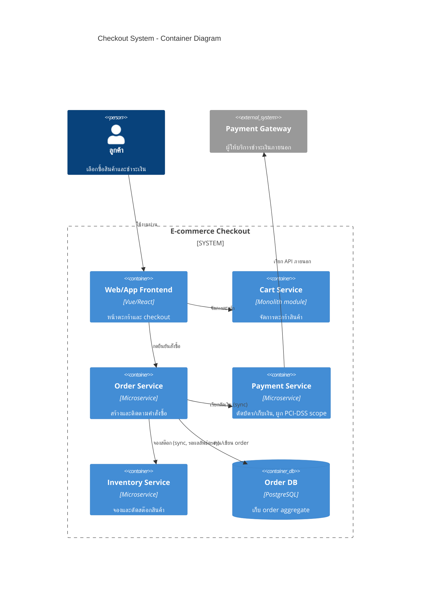

ลองนึกภาพซูเปอร์มาร์เก็ตขนาดใหญ่ ตอนเริ่มเปิดร้านใหม่ๆ เจ้าของร้านให้พนักงานแคชเชียร์คนเดียวทำทุกอย่าง — สแกนสินค้า รับเงิน เช็คสต๊อกในคลัง พิมพ์ใบเสร็จ ทั้งหมดที่เคาน์เตอร์เดียว เพราะร้านเล็ก ลูกค้าไม่เยอะ ทำแบบนี้เร็วและง่ายที่สุด แต่พอร้านขยายมีสาขาเป็นร้อย มีลูกค้าเช็คเอาท์พร้อมกันหลักหมื่นคนต่อวินาทีในช่วงลดราคาใหญ่ การให้ "คนเดียวทำทุกอย่าง" เริ่มพัง — คิวเช็คสต๊อกช้าเพราะคลังสินค้าเป็นคอขวด ระบบรับเงินล่มก็ลากทั้งร้านล่มไปด้วย นี่คือสถานการณ์เดียวกับที่ทีมวิศวกรรมของระบบ e-commerce ต้องเจอเวลาต้องออกแบบ **Checkout System**

โจทย์นี้เป็นโจทย์คลาสสิกที่รวมทุก pillar ของโมดูล System Architecture เข้าด้วยกัน ตั้งแต่การเลือก **Architectural Style** (โมดูล 13) ไปจนถึงการตัดขอบเขตด้วย **Domain-Driven Design** (โมดูล 15) มาดูกันว่าถ้าต้องออกแบบระบบ checkout ของ e-commerce จริงๆ จะคิดยังไง

## Requirement คร่าวๆ

- ผู้ใช้กด "สั่งซื้อ" จากตะกร้าสินค้า (Cart) → ต้องจองสต๊อกสินค้าไว้ก่อน (Inventory Reservation) → ตัดเงิน/บัตรเครดิต (Payment) → ยืนยันคำสั่งซื้อ (Order Confirmation)
- ทุกขั้นตอนต้อง**ไม่ขายเกินจำนวนสต๊อกที่มี** (oversell) และ**ไม่เก็บเงินซ้ำ** — สองเรื่องนี้พลาดไม่ได้เด็ดขาด
- รองรับ flash sale ที่ traffic พุ่งขึ้นหลักสิบเท่าในไม่กี่นาที (เช่น 11.11, Black Friday)
- ทีมพัฒนาต้องส่ง feature ใหม่ได้เร็ว โดยไม่ต้อง deploy ทั้งระบบทุกครั้งที่แก้จุดเล็กๆ

## เลือก Architectural Style: เริ่มจาก Monolith แล้วค่อยแยก

ย้อนกลับไปโมดูล 13 เรื่อง Architectural Styles — บทเรียนสำคัญคือ**ไม่มี style ไหนถูกเสมอ** ต้องเลือกให้เหมาะกับขนาดและ stage ของระบบ

ตอนเริ่มต้น ทีมเล็กๆ ควรสร้าง checkout เป็น **Monolith** ก่อน — โค้ด Cart, Order, Payment, Inventory อยู่ใน codebase เดียว deploy พร้อมกัน เพราะทีมยังเล็ก ยังไม่มี traffic มาก การแยกเป็น microservices ตั้งแต่วันแรกจะเพิ่มความซับซ้อนโดยไม่จำเป็น (ต้องดูแล network call, distributed transaction, deployment pipeline หลายชุด ทั้งที่ยังไม่มีปัญหาเรื่อง scale จริง)

แต่พอระบบโตขึ้น จุดที่ควรเริ่มแยกออกมาก่อนคือ **Payment** — เหตุผลมีสามข้อ:

1. **อัตราการเปลี่ยนแปลงต่างกัน (rate of change)** — โค้ด payment ต้องแก้บ่อยเพื่อรองรับผู้ให้บริการชำระเงินใหม่ๆ (บัตรเครดิต, mobile banking, QR payment) แยกแล้ว deploy ได้เองโดยไม่กระทบ Cart หรือหน้าเว็บ
2. **Compliance และความปลอดภัย** — ระบบที่แตะข้อมูลบัตรเครดิตต้องผ่านมาตรฐาน PCI-DSS การแยกเป็น service ต่างหากทำให้ scope การ audit เล็กลง ไม่ต้อง audit ทั้ง monolith
3. **Scaling ที่ไม่เท่ากัน** — ช่วง flash sale คนดูสินค้า (browse) เยอะกว่าคนจ่ายเงินจริงหลายเท่า ถ้า Payment ยังฝังอยู่ใน monolith จะ scale ทั้งก้อนตาม traffic การดูสินค้า ทั้งที่ Payment ไม่จำเป็นต้อง scale เท่านั้น แยกออกมาแล้ว scale ได้อิสระตามภาระงานจริงของแต่ละส่วน

ส่วน Inventory ก็มักแยกตามมาไม่นาน เพราะต้องรองรับการอ่าน-เขียนถี่มากจากทั้งหน้าเว็บ (แสดง stock คงเหลือ) และจาก order flow (จองสต๊อก) — ในขณะที่ Cart ยังอยู่ใกล้ frontend และเปลี่ยนน้อยกว่า อาจแยกทีหลังสุดหรือคงไว้ใน monolith ก็ได้ ขึ้นอยู่กับทีมและขนาดจริง ส่วน **Order เองก็มักถูกแยกออกมาพร้อมๆ กับ Payment** เพราะเมื่อ Payment และ Inventory กลายเป็น service แยก ต้องมี "ตัวกลาง" คอยเรียกทั้งสองตามลำดับและจัดการ failure ข้าม service — หน้าที่นี้ตกเป็นของ Order Service โดยธรรมชาติ ทำให้ Order จบสถานะเป็น microservice ไปด้วย ในขณะที่ Cart ยังคงอยู่ใน monolith เดิม

เมื่อ service แยกออกมาตามนี้ คำถามที่ตามมาคือทีมควรแยกตามไหม — คำตอบจาก **Team Topologies** (โมดูล 20) คือควร: ถ้าทีมเดียวยังต้องดูแลทั้ง Cart, Order, Payment, Inventory พร้อมกัน cognitive load จะสูงเกินไปเมื่อแต่ละส่วนมี rate of change และ compliance requirement ต่างกันมาก การแยกทีม stream-aligned ตาม bounded context เหล่านี้ (เช่น ทีม Payment แยกจากทีม Cart/Order) ตาม Inverse Conway Maneuver จะทำให้ boundary ทางเทคนิคที่ออกแบบไว้ไม่ถูกกัดกร่อนกลับไปเป็น distributed monolith ในภายหลัง



## หา Bounded Context ด้วย DDD

จากโมดูล 15 เรื่อง Domain-Driven Design — สิ่งแรกที่ต้องทำก่อนตัดสินใจเรื่อง service boundary คือหา **Bounded Context** ให้เจอ เพราะ service boundary ที่ดีควรตามรอย bounded context ไม่ใช่ตามใจทีมหรือตามไฟล์ที่มีอยู่

ในโดเมน checkout แบ่ง bounded context หลักได้ 4 ก้อน:

- **Cart Context** — ภาษาที่ใช้คือ "item", "quantity", "add to cart" คำว่า "Order" ยังไม่มีอยู่ในหัวของ context นี้เลย เพราะตะกร้ายังไม่ใช่คำสั่งซื้อจริง
- **Order Context** — เมื่อลูกค้ากดยืนยัน ตะกร้าจะถูกแปลงเป็น "Order" — ที่นี่ **Order** คือ aggregate root เก็บ order line, สถานะ (pending, confirmed, cancelled) การเปลี่ยนแปลงทั้งหมดต้องผ่าน Order aggregate เท่านั้น เพื่อรักษาความถูกต้องของ invariant เช่น "order ที่ยืนยันแล้วห้ามลบ item ออก"
- **Payment Context** — มี ubiquitous language ของตัวเอง เช่น "charge", "authorization", "capture", "refund" คำว่า "Payment" ในที่นี้ไม่ได้แปลว่าเงินไหลจริง แต่หมายถึง transaction record ที่ผูกกับ payment gateway ภายนอก — **Payment** เป็น aggregate ที่แยกจาก Order เพราะมี lifecycle และ invariant ของตัวเอง (เช่น "authorize แล้วต้อง capture ภายใน 7 วัน")
- **Inventory Context** — คำว่า "stock" ใน context นี้ไม่เหมือน "stock" ที่นักบัญชีพูดถึง (มูลค่าคงคลัง) แต่หมายถึงจำนวนที่ขายได้จริง ณ ขณะนี้ **StockItem** เป็น aggregate ที่ควบคุม invariant สำคัญที่สุดของทั้งระบบ: "reserved quantity ห้ามเกิน available quantity" — ถ้า invariant นี้พัง ระบบจะขายของเกินสต๊อกทันที

จุดที่มักออกแบบผิดคือเอา Order กับ Payment มารวมเป็น aggregate เดียวกัน เพราะดูเหมือนเป็นเรื่องเดียวกัน (จ่ายเงินเพื่อสั่งของ) แต่จริงๆ แล้วทั้งสองมี **rate of change** และ **consistency requirement** ต่างกันมาก การแยก aggregate ทำให้แต่ละฝั่งพัฒนาและ scale ได้อิสระ แต่ก็แลกมาด้วยความซับซ้อนเรื่องการประสานงานข้าม aggregate ที่ต้องจัดการเอง

## ตารางเปรียบเทียบ Trade-off

| ประเด็น | Monolith (เริ่มต้น) | Microservices (แยก Payment/Inventory) |
|---|---|---|
| ความเร็วในการพัฒนาช่วงแรก | เร็วกว่า — ทีมเล็ก แก้จุดเดียวจบ | ช้ากว่า — ต้องดูแล API contract ระหว่าง service |
| Deploy | Deploy พร้อมกันทั้งก้อน เสี่ยง regression ข้าม feature | Deploy อิสระต่อ service ความเสี่ยงเฉพาะจุด |
| Scaling | Scale ทั้งก้อนตาม traffic ที่หนักสุด | Scale แยกตามภาระงานจริงของแต่ละ service |
| Consistency ระหว่างส่วน | ง่าย — ใช้ DB transaction เดียวได้ | ยาก — ต้องใช้ saga/event เพื่อความสอดคล้องข้าม service |
| PCI-DSS compliance scope | ทั้ง monolith ต้องผ่าน audit | เฉพาะ Payment service เท่านั้น |
| เหมาะกับ | ทีมเล็ก, ระบบยังไม่ใหญ่ | ทีมโตแล้ว, traffic สูง, ต้องแยก compliance scope |

## ตัดสินใจเรื่อง Consistency: จุดไหนต้อง Strong จุดไหนรอได้

นี่คือจุดที่โมดูล 16 (Quality Attributes & Trade-off) เข้ามาเกี่ยวข้องโดยตรง — ไม่ใช่ทุก aggregate ต้องการ consistency ระดับเดียวกัน

- **Payment ต้อง Strong Consistency เสมอ** — เก็บเงินซ้ำ หรือเก็บเงินไม่สำเร็จแต่บันทึกว่าสำเร็จ คือความเสียหายที่ยอมรับไม่ได้ ต้องยืนยันผลแบบ synchronous ก่อนตอบกลับลูกค้า
- **Inventory ยอมรับ Eventual Consistency ได้ในบางจุด** — เช่น จำนวน stock ที่แสดงหน้าเว็บอาจ delay ไม่กี่วินาทีได้ (คลาดเคลื่อนนิดหน่อยไม่ทำให้ธุรกิจพัง) แต่ตอน**จองสต๊อกจริง**ตอน checkout ต้องเช็คแบบ strong เพื่อกัน oversell — นี่คือตัวอย่างว่า consistency requirement ไม่ใช่คุณสมบัติของทั้งระบบ แต่เป็นคุณสมบัติที่ต้องพิจารณาแยกตาม use case ในแต่ละ context

```demo
component: StepThroughDiagram
props: {"steps":[{"label":"1. เลือก Style","detail":"เริ่มจาก Monolith เพราะทีมเล็กและ traffic ยังต่ำ พอระบบโตค่อยแยก Payment ออกก่อน (compliance + scaling ต่างกัน) ตามด้วย Inventory (อ่าน-เขียนถี่มาก)"},{"label":"2. หา Bounded Context","detail":"แบ่งโดเมนเป็น Cart, Order, Payment, Inventory แต่ละก้อนมี ubiquitous language และ aggregate ของตัวเอง — Order aggregate คุม order line/สถานะ, Payment aggregate คุม charge/authorization, StockItem aggregate คุม reserved vs available"},{"label":"3. ตัดสินใจเรื่อง Consistency","detail":"Payment ต้อง strong consistency เสมอ (ห้ามเก็บเงินซ้ำ) ส่วนการแสดงผล stock บนหน้าเว็บยอมรับ eventual consistency ได้ แต่ตอนจองสต๊อกจริงต้อง strong เพื่อกัน oversell"},{"label":"4. สรุป Architecture","detail":"Order Service เป็นตัวกลางเรียก Inventory (จองสต๊อกแบบ sync) และ Payment (ตัดเงินแบบ sync) ตามลำดับ ถ้าขั้นไหนล้มเหลวต้อง rollback ขั้นก่อนหน้า (คืนสต๊อกที่จองไว้) ด้วยรูปแบบ compensating transaction แบบเดียวกับ Saga pattern ที่เรียนไปแล้วในโมดูล Microservices & API Design — Cart ยังอยู่ใกล้ frontend แยกออกทีหลังสุดหรือไม่แยกเลยก็ได้"}]}
```

## ADR ตัวอย่าง

> **Title:** แยก Payment Service ออกจาก Checkout Monolith
> **Status:** Accepted
> **Context:** ระบบ checkout เดิมเป็น monolith เดียว เมื่อ traffic ช่วง flash sale พุ่งสูง การ scale ทั้งก้อนตามภาระงาน browse สินค้าทำให้ต้นทุน infra สูงเกินจำเป็น อีกทั้ง PCI-DSS audit ต้องครอบคลุมทั้ง codebase ทำให้ scope การตรวจสอบใหญ่และช้า
> **Decision:** แยก Payment ออกเป็น microservice ของตัวเอง สื่อสารกับ Order Service ผ่าน synchronous API เพื่อรักษา strong consistency ของการตัดเงิน ส่วน Cart และ Order ยังคงอยู่ร่วมกันใน monolith เดิมไปก่อน
> **Consequences:** Scaling และ deploy ของ Payment ทำได้อิสระ ลด PCI-DSS audit scope ให้เหลือเฉพาะ service นี้ แต่ทีมต้องเพิ่ม logic จัดการ failure ข้าม service ด้วยรูปแบบ compensating transaction (Saga pattern ที่เรียนไปแล้วในโมดูล Microservices & API Design) เช่น rollback การจองสต๊อกถ้าตัดเงินไม่สำเร็จ และดูแล network latency ระหว่าง service เพิ่มขึ้น
