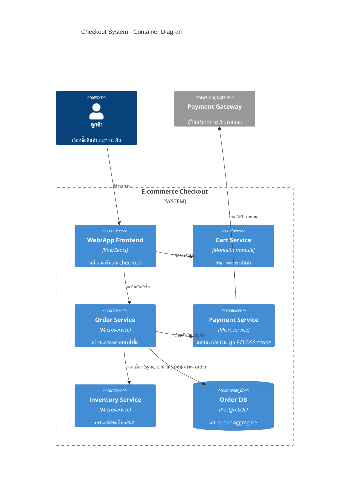
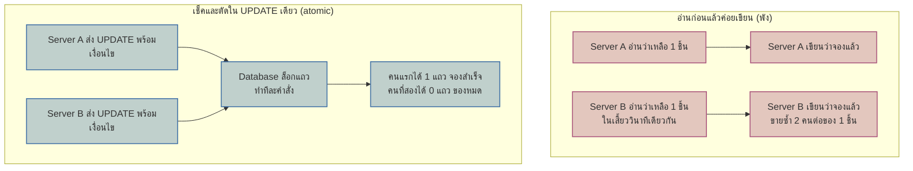
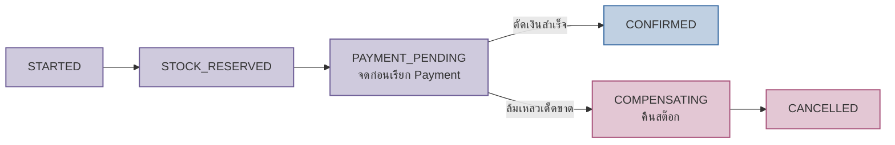
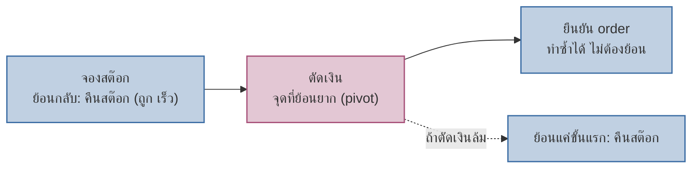
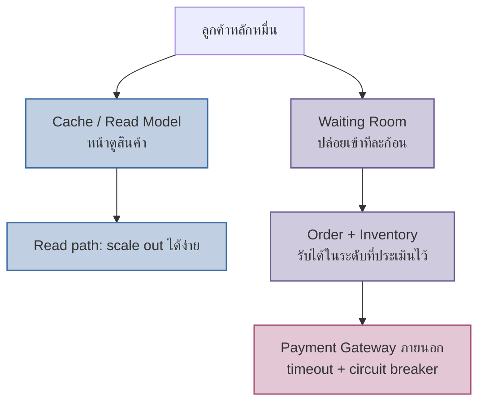

ลองนึกภาพซูเปอร์มาร์เก็ตขนาดใหญ่ ตอนเริ่มเปิดร้านใหม่ๆ เจ้าของร้านให้พนักงานแคชเชียร์คนเดียวทำทุกอย่าง — สแกนสินค้า รับเงิน เช็คสต๊อกในคลัง พิมพ์ใบเสร็จ ทั้งหมดที่เคาน์เตอร์เดียว เพราะร้านเล็ก ลูกค้าไม่เยอะ ทำแบบนี้เร็วและง่ายที่สุด แต่พอร้านขยายมีสาขาเป็นร้อย มีลูกค้าเช็คเอาท์พร้อมกันหลักหมื่นคนต่อวินาทีในช่วงลดราคาใหญ่ การให้ "คนเดียวทำทุกอย่าง" เริ่มพัง — คิวเช็คสต๊อกช้าเพราะคลังสินค้าเป็นคอขวด ระบบรับเงินล่มก็ลากทั้งร้านล่มไปด้วย นี่คือสถานการณ์เดียวกับที่ทีมวิศวกรรมของระบบ e-commerce ต้องเจอเวลาต้องออกแบบ <mark class="hl-term">**Checkout System**</mark>

โจทย์นี้เป็นโจทย์คลาสสิกที่รวมทุก pillar ของโมดูล System Architecture เข้าด้วยกัน ตั้งแต่การเลือก **Architectural Style** (โมดูล 13) ไปจนถึงการตัดขอบเขตด้วย **Domain-Driven Design** (โมดูล 15) มาดูกันว่าถ้าต้องออกแบบระบบ checkout ของ e-commerce จริงๆ จะคิดยังไง

## Requirement คร่าวๆ

- ผู้ใช้กด "สั่งซื้อ" จากตะกร้าสินค้า (Cart) → ต้องจองสต๊อกสินค้าไว้ก่อน (Inventory Reservation) → ตัดเงิน/บัตรเครดิต (Payment) → ยืนยันคำสั่งซื้อ (Order Confirmation)
- ทุกขั้นตอนต้อง**ไม่ขายเกินจำนวนสต๊อกที่มี** (oversell) และ**ไม่เก็บเงินซ้ำ** — สองเรื่องนี้พลาดไม่ได้เด็ดขาด
- รองรับ flash sale ที่ traffic พุ่งขึ้นหลักสิบเท่าในไม่กี่นาที (เช่น 11.11, Black Friday)
- ทีมพัฒนาต้องส่ง feature ใหม่ได้เร็ว โดยไม่ต้อง deploy ทั้งระบบทุกครั้งที่แก้จุดเล็กๆ

## เลือก Architectural Style: เริ่มจาก Monolith แล้วค่อยแยก

ย้อนกลับไปโมดูล 13 เรื่อง Architectural Styles — บทเรียนสำคัญคือ<mark class="hl-insight">**ไม่มี style ไหนถูกเสมอ** ต้องเลือกให้เหมาะกับขนาดและ stage ของระบบ</mark>

ตอนเริ่มต้น ทีมเล็กๆ ควรสร้าง checkout เป็น **Monolith** ก่อน — โค้ด Cart, Order, Payment, Inventory อยู่ใน codebase เดียว deploy พร้อมกัน เพราะทีมยังเล็ก ยังไม่มี traffic มาก การแยกเป็น microservices ตั้งแต่วันแรกจะเพิ่มความซับซ้อนโดยไม่จำเป็น (ต้องดูแล network call, distributed transaction, deployment pipeline หลายชุด ทั้งที่ยังไม่มีปัญหาเรื่อง scale จริง)

แต่พอระบบโตขึ้น จุดที่ควรเริ่มแยกออกมาก่อนคือ **Payment** — เหตุผลมีสามข้อ:

1. **อัตราการเปลี่ยนแปลงต่างกัน (rate of change)** — โค้ด payment ต้องแก้บ่อยเพื่อรองรับผู้ให้บริการชำระเงินใหม่ๆ (บัตรเครดิต, mobile banking, QR payment) แยกแล้ว deploy ได้เองโดยไม่กระทบ Cart หรือหน้าเว็บ
2. **Compliance และความปลอดภัย** — ระบบที่แตะข้อมูลบัตรเครดิตต้องผ่านมาตรฐาน PCI-DSS การแยกเป็น service ต่างหากทำให้ scope การ audit เล็กลง ไม่ต้อง audit ทั้ง monolith
3. **Scaling ที่ไม่เท่ากัน** — ช่วง flash sale คนดูสินค้า (browse) เยอะกว่าคนจ่ายเงินจริงหลายเท่า ถ้า Payment ยังฝังอยู่ใน monolith จะ scale ทั้งก้อนตาม traffic การดูสินค้า ทั้งที่ Payment ไม่จำเป็นต้อง scale เท่านั้น แยกออกมาแล้ว scale ได้อิสระตามภาระงานจริงของแต่ละส่วน

ส่วน Inventory ก็มักแยกตามมาไม่นาน เพราะต้องรองรับการอ่าน-เขียนถี่มากจากทั้งหน้าเว็บ (แสดง stock คงเหลือ) และจาก order flow (จองสต๊อก) — ในขณะที่ Cart ยังอยู่ใกล้ frontend และเปลี่ยนน้อยกว่า อาจแยกทีหลังสุดหรือคงไว้ใน monolith ก็ได้ ขึ้นอยู่กับทีมและขนาดจริง ส่วน **Order เองก็มักถูกแยกออกมาพร้อมๆ กับ Payment** เพราะเมื่อ Payment และ Inventory กลายเป็น service แยก ต้องมี "ตัวกลาง" คอยเรียกทั้งสองตามลำดับและจัดการ failure ข้าม service — หน้าที่นี้ตกเป็นของ Order Service โดยธรรมชาติ ทำให้ Order จบสถานะเป็น microservice ไปด้วย ในขณะที่ Cart ยังคงอยู่ใน monolith เดิม

เมื่อ service แยกออกมาตามนี้ คำถามที่ตามมาคือทีมควรแยกตามไหม — คำตอบจาก **Team Topologies** (โมดูล 20) คือควร: ถ้าทีมเดียวยังต้องดูแลทั้ง Cart, Order, Payment, Inventory พร้อมกัน cognitive load จะสูงเกินไปเมื่อแต่ละส่วนมี rate of change และ compliance requirement ต่างกันมาก การแยกทีม stream-aligned ตาม bounded context เหล่านี้ (เช่น ทีม Payment แยกจากทีม Cart/Order) ตาม Inverse Conway Maneuver จะทำให้ boundary ทางเทคนิคที่ออกแบบไว้ไม่ถูกกัดกร่อนกลับไปเป็น distributed monolith ในภายหลัง


```mermaid
C4Container
    title Checkout System - Container Diagram

    Person(customer, "ลูกค้า", "เลือกซื้อสินค้าและชำระเงิน")

    System_Boundary(checkout, "E-commerce Checkout") {
        Container(web, "Web/App Frontend", "Vue/React", "หน้าตะกร้าและ checkout")
        Container(cartSvc, "Cart Service", "Monolith module", "จัดการตะกร้าสินค้า")
        Container(orderSvc, "Order Service", "Microservice", "สร้างและติดตามคำสั่งซื้อ")
        Container(paymentSvc, "Payment Service", "Microservice", "ตัดบัตร/เก็บเงิน, ผูก PCI-DSS scope")
        Container(inventorySvc, "Inventory Service", "Microservice", "จองและตัดสต๊อกสินค้า")
        ContainerDb(orderDb, "Order DB", "PostgreSQL", "เก็บ order aggregate")
    }

    System_Ext(paymentGateway, "Payment Gateway", "ผู้ให้บริการชำระเงินภายนอก")

    Rel(customer, web, "ใช้งานผ่าน")
    Rel(web, cartSvc, "จัดการตะกร้า")
    Rel(web, orderSvc, "กดยืนยันสั่งซื้อ")
    Rel(orderSvc, inventorySvc, "จองสต๊อก (sync, รอผลลัพธ์ตรงๆ)")
    Rel(orderSvc, paymentSvc, "เรียกตัดเงิน (sync)")
    Rel(paymentSvc, paymentGateway, "เรียก API ภายนอก")
    Rel(orderSvc, orderDb, "อ่าน/เขียน order")
```

## หา Bounded Context ด้วย DDD

จากโมดูล 15 เรื่อง Domain-Driven Design — สิ่งแรกที่ต้องทำก่อนตัดสินใจเรื่อง service boundary คือหา <mark class="hl-term">**Bounded Context**</mark> ให้เจอ เพราะ service boundary ที่ดีควรตามรอย bounded context ไม่ใช่ตามใจทีมหรือตามไฟล์ที่มีอยู่

ในโดเมน checkout แบ่ง bounded context หลักได้ 4 ก้อน:

- **Cart Context** — ภาษาที่ใช้คือ "item", "quantity", "add to cart" คำว่า "Order" ยังไม่มีอยู่ในหัวของ context นี้เลย เพราะตะกร้ายังไม่ใช่คำสั่งซื้อจริง
- **Order Context** — เมื่อลูกค้ากดยืนยัน ตะกร้าจะถูกแปลงเป็น "Order" — ที่นี่ **Order** คือ aggregate root เก็บ order line, สถานะ (pending, confirmed, cancelled) การเปลี่ยนแปลงทั้งหมดต้องผ่าน Order aggregate เท่านั้น เพื่อรักษาความถูกต้องของ invariant เช่น "order ที่ยืนยันแล้วห้ามลบ item ออก"
- **Payment Context** — มี ubiquitous language ของตัวเอง เช่น "charge", "authorization", "capture", "refund" คำว่า "Payment" ในที่นี้ไม่ได้แปลว่าเงินไหลจริง แต่หมายถึง transaction record ที่ผูกกับ payment gateway ภายนอก — **Payment** เป็น aggregate ที่แยกจาก Order เพราะมี lifecycle และ invariant ของตัวเอง (เช่น "authorize แล้วต้อง capture ภายใน 7 วัน")
- **Inventory Context** — คำว่า "stock" ใน context นี้ไม่เหมือน "stock" ที่นักบัญชีพูดถึง (มูลค่าคงคลัง) แต่หมายถึงจำนวนที่ขายได้จริง ณ ขณะนี้ **StockItem** เป็น aggregate ที่ควบคุม invariant สำคัญที่สุดของทั้งระบบ: "reserved quantity ห้ามเกิน available quantity" — ถ้า invariant นี้พัง ระบบจะขายของเกินสต๊อกทันที

<mark class="hl-warning">จุดที่มักออกแบบผิดคือเอา Order กับ Payment มารวมเป็น aggregate เดียวกัน เพราะดูเหมือนเป็นเรื่องเดียวกัน (จ่ายเงินเพื่อสั่งของ)</mark> แต่จริงๆ แล้วทั้งสองมี **rate of change** และ **consistency requirement** ต่างกันมาก การแยก aggregate ทำให้แต่ละฝั่งพัฒนาและ scale ได้อิสระ แต่ก็แลกมาด้วยความซับซ้อนเรื่องการประสานงานข้าม aggregate ที่ต้องจัดการเอง

```demo
component: JourneyDiagram
props: {"nodes":[{"icon":"person","label":"ลูกค้า"},{"icon":"building","label":"Cart"},{"icon":"building","label":"Order Service"},{"icon":"building","label":"Inventory Service"},{"icon":"building","label":"Payment Service"}],"travelerIcon":"envelope","steps":[{"activeNode":0,"caption":"ลูกค้ากดสั่งซื้อจากตะกร้า"},{"activeNode":1,"caption":"Cart ส่งต่อไปยัง Order Service เพื่อสร้างคำสั่งซื้อ"},{"activeNode":2,"caption":"Order Service เรียก Inventory Service จองสต๊อกแบบ sync รอผลลัพธ์ก่อน"},{"activeNode":3,"caption":"Inventory จองสำเร็จ ตอบกลับ Order Service"},{"activeNode":2,"caption":"Order Service เรียก Payment Service ตัดเงินแบบ sync ต้องได้ผลลัพธ์ชัดเจนก่อนยืนยัน order"},{"activeNode":4,"caption":"Payment ตัดเงินสำเร็จ Order Service ยืนยันคำสั่งซื้อกลับไปหาลูกค้า"}]}
```

## ตารางเปรียบเทียบ Trade-off

| ประเด็น | Monolith (เริ่มต้น) | Microservices (แยก Payment/Inventory) |
|---|---|---|
| ความเร็วในการพัฒนาช่วงแรก | เร็วกว่า — ทีมเล็ก แก้จุดเดียวจบ | ช้ากว่า — ต้องดูแล API contract ระหว่าง service |
| Deploy | Deploy พร้อมกันทั้งก้อน เสี่ยง regression ข้าม feature | Deploy อิสระต่อ service ความเสี่ยงเฉพาะจุด |
| Scaling | Scale ทั้งก้อนตาม traffic ที่หนักสุด | Scale แยกตามภาระงานจริงของแต่ละ service |
| Consistency ระหว่างส่วน | ง่าย — ใช้ DB transaction เดียวได้ | ยาก — ต้องใช้ saga/event เพื่อความสอดคล้องข้าม service |
| PCI-DSS compliance scope | ทั้ง monolith ต้องผ่าน audit | เฉพาะ Payment service เท่านั้น |
| เหมาะกับ | ทีมเล็ก, ระบบยังไม่ใหญ่ | ทีมโตแล้ว, traffic สูง, ต้องแยก compliance scope |

## ตัดสินใจเรื่อง Consistency: จุดไหนต้อง Strong จุดไหนรอได้

นี่คือจุดที่โมดูล 16 (Quality Attributes & Trade-off) เข้ามาเกี่ยวข้องโดยตรง — ไม่ใช่ทุก aggregate ต้องการ consistency ระดับเดียวกัน

- **Payment ต้อง Strong Consistency เสมอ** — เก็บเงินซ้ำ หรือเก็บเงินไม่สำเร็จแต่บันทึกว่าสำเร็จ คือความเสียหายที่ยอมรับไม่ได้ ต้องยืนยันผลแบบ synchronous ก่อนตอบกลับลูกค้า
- **Inventory ยอมรับ Eventual Consistency ได้ในบางจุด** — เช่น จำนวน stock ที่แสดงหน้าเว็บอาจ delay ไม่กี่วินาทีได้ (คลาดเคลื่อนนิดหน่อยไม่ทำให้ธุรกิจพัง) แต่ตอน**จองสต๊อกจริง**ตอน checkout ต้องเช็คแบบ strong เพื่อกัน oversell — นี่คือตัวอย่างว่า consistency requirement ไม่ใช่คุณสมบัติของทั้งระบบ แต่เป็นคุณสมบัติที่ต้องพิจารณาแยกตาม use case ในแต่ละ context

```demo
component: StepThroughDiagram
props: {"steps":[{"label":"1. เลือก Style","detail":"เริ่มจาก Monolith เพราะทีมเล็กและ traffic ยังต่ำ พอระบบโตค่อยแยก Payment ออกก่อน (compliance + scaling ต่างกัน) ตามด้วย Inventory (อ่าน-เขียนถี่มาก)"},{"label":"2. หา Bounded Context","detail":"แบ่งโดเมนเป็น Cart, Order, Payment, Inventory แต่ละก้อนมี ubiquitous language และ aggregate ของตัวเอง — Order aggregate คุม order line/สถานะ, Payment aggregate คุม charge/authorization, StockItem aggregate คุม reserved vs available"},{"label":"3. ตัดสินใจเรื่อง Consistency","detail":"Payment ต้อง strong consistency เสมอ (ห้ามเก็บเงินซ้ำ) ส่วนการแสดงผล stock บนหน้าเว็บยอมรับ eventual consistency ได้ แต่ตอนจองสต๊อกจริงต้อง strong เพื่อกัน oversell"},{"label":"4. สรุป Architecture","detail":"Order Service เป็นตัวกลางเรียก Inventory (จองสต๊อกแบบ sync) และ Payment (ตัดเงินแบบ sync) ตามลำดับ ถ้าขั้นไหนล้มเหลวต้อง rollback ขั้นก่อนหน้า (คืนสต๊อกที่จองไว้) ด้วยรูปแบบ compensating transaction แบบเดียวกับ Saga pattern ที่เรียนไปแล้วในโมดูล Microservices & API Design — Cart ยังอยู่ใกล้ frontend แยกออกทีหลังสุดหรือไม่แยกเลยก็ได้"}]}
```

## คำถามเจาะลึกที่มักถูกถามต่อ

พออธิบาย architecture ของ checkout จบ คนสัมภาษณ์หรือเพื่อนร่วมทีมมักไม่หยุดแค่ "เลือก style อะไร" แต่จะถามต่อว่า "แล้วข้างในมันทำงานยังไง ถ้าพังจะเกิดอะไรขึ้น" สี่คำถามด้านล่างคือคำถามต่อยอดที่เจอบ่อยที่สุด แต่ละข้อไล่ให้ครบว่า ใช้ความรู้อะไรจากโมดูลไหน แก้ปัญหายังไง มีขั้นตอนอะไรบ้าง และข้างใต้จริงๆ มีอะไรทำงานอยู่

### Q1: กดสั่งซื้อพร้อมกันหมื่นคน แต่สินค้าเหลือ 100 ชิ้น ระบบกัน "ขายเกินสต๊อก" ได้ยังไง

**ใช้ความรู้อะไร:** โมดูล 15 (Aggregate — `StockItem` เป็นเจ้าของกติกา "reserved ห้ามเกิน available") บวกโมดูล 16 (จุดจองสต๊อกต้องเป็น Strong Consistency ตามที่ตัดสินใจไว้ข้างบน)

**นึกภาพก่อน:** ลองนึกถึงตู้ขายตั๋วหนังที่มีตั๋ว 100 ใบและพนักงานคนเดียว ต่อให้คนต่อคิว 10,000 คน พนักงานก็ขายได้ทีละใบ ครบ 100 ใบก็บอกว่า "หมดแล้ว" ไม่มีทางขายเกิน แต่ระบบจริงไม่ได้มีพนักงานคนเดียว — มี server หลายเครื่องรับคำสั่งพร้อมกัน ถ้าทุกเครื่องอ่านเจอ "เหลือ 1 ชิ้น" ในเสี้ยววินาทีเดียวกัน แล้วต่างคนต่างขาย ก็จะได้ 5 order สำหรับของ 1 ชิ้น ปัญหานี้เรียกว่า **race condition** (แข่งกันทำงานจนผลผิด)

**แก้ปัญหายังไง:** เลิก "อ่านก่อนแล้วค่อยเขียน" เป็นสองจังหวะ แล้วรวมเป็นคำสั่งเดียวที่แบ่งแยกไม่ได้ <mark class="hl-term">**atomic operation**</mark> คือเช็คเงื่อนไขและตัดสต๊อกให้เสร็จในก้าวเดียวกัน:

```sql
UPDATE stock_item
SET reserved = reserved + 1
WHERE sku = 'SKU-123'
  AND reserved + 1 <= available;
```

จากนั้นดูว่ามีกี่แถวถูกแก้ ถ้าได้ 1 แถว แปลว่าจองสำเร็จ ถ้าได้ 0 แถว แปลว่าเงื่อนไขไม่ผ่าน (ของหมดแล้ว) <mark class="hl-insight">หัวใจคือให้ database เป็นคนตัดสินว่าใครได้ ไม่ใช่ให้ application อ่านค่ามาคิดเองแล้วค่อยเขียนกลับ เพราะระหว่าง "อ่าน" กับ "เขียน" มีช่องว่างให้คนอื่นแทรกได้เสมอ</mark>

**ข้างใต้ทำงานยังไง:** ระหว่างที่ database รันคำสั่ง UPDATE มันจะ **ล็อกแถวนั้น** ไว้ (row-level lock) คำสั่งจากทุกเครื่องที่มุ่งไปแถวเดียวกันจึงถูกเรียงเข้าคิวทีละคำสั่งที่ระดับ database เอง โดยที่ application ไม่ต้องเขียนโค้ดคุมคิวเลย


```mermaid
flowchart TB
    subgraph Bad["อ่านก่อนแล้วค่อยเขียน (พัง)"]
        A1["Server A อ่านว่าเหลือ 1 ชิ้น"] --> A2["Server A เขียนว่าจองแล้ว"]
        B1["Server B อ่านว่าเหลือ 1 ชิ้น<br/>ในเสี้ยววินาทีเดียวกัน"] --> B2["Server B เขียนว่าจองแล้ว<br/>ขายซ้ำ 2 คนต่อของ 1 ชิ้น"]
    end
    subgraph Good["เช็คและตัดใน UPDATE เดียว (atomic)"]
        C1["Server A ส่ง UPDATE พร้อมเงื่อนไข"] --> C2["Database ล็อกแถว<br/>ทำทีละคำสั่ง"]
        D1["Server B ส่ง UPDATE พร้อมเงื่อนไข"] --> C2
        C2 --> C3["คนแรกได้ 1 แถว จองสำเร็จ<br/>คนที่สองได้ 0 แถว ของหมด"]
    end

    classDef bad fill:#a8527a52,stroke:#a8527a,stroke-width:1.5px
    classDef good fill:#3d6ea552,stroke:#3d6ea5,stroke-width:1.5px
    class A1,A2,B1,B2 bad
    class C1,C2,C3,D1 good
```

```demo
component: JourneyDiagram
props: {"nodes":[{"icon":"person","label":"ลูกค้า 10,000 คน"},{"icon":"building","label":"Inventory Service"},{"icon":"notebook","label":"แถว StockItem (เหลือ 100)"}],"travelerIcon":"envelope","steps":[{"activeNode":0,"caption":"ลูกค้าหมื่นคนกด 'สั่งซื้อ' พร้อมกัน สินค้าเหลือ 100 ชิ้น"},{"activeNode":1,"caption":"Inventory Service ทุกเครื่องยิงคำสั่ง UPDATE แบบมีเงื่อนไขไปที่แถวเดิมพร้อมกัน ไม่ต้องอ่านค่าก่อน"},{"activeNode":2,"caption":"Database ล็อกแถวนี้ ทำทีละคำสั่ง — คำสั่งที่เหลือรอคิวที่ระดับ database เอง"},{"activeNode":2,"caption":"100 คำสั่งแรกผ่านเงื่อนไข ได้ 1 แถวถูกแก้ จองสำเร็จ ตัวเลข reserved เพิ่มขึ้นทีละ 1"},{"activeNode":1,"caption":"คำสั่งที่ 101 เป็นต้นไปได้ 0 แถว Inventory Service ตอบกลับว่า 'สินค้าหมด' ไม่มีการขายเกินแม้แต่ชิ้นเดียว"}]}
```

**ถ้าพังหรือมีข้อควรระวังอะไร:**

- **แถวเดียวถูกรุมจนช้า (hot row)** — ช่วง flash sale หมื่นคำสั่งต่อแถวเดียวต้องต่อคิวยาว latency พุ่งได้ วิธีแก้ที่นิยมคือแบ่งสต๊อกเป็นหลาย "ถัง" (เช่น 10 ถังถังละ 10 ชิ้น) เพื่อกระจายการล็อก หรือใส่คิวคุมจำนวนคนเข้ามา (ดู Q4)
- <mark class="hl-warning">จองแล้วแต่ลูกค้าไม่จ่าย สต๊อกจะค้างถูกล็อกไว้ตลอดกาล</mark> — ต้องตั้ง **เวลาหมดอายุของการจอง (TTL)** เช่น 15 นาที แล้วมีงานเบื้องหลังคืนสต๊อกให้อัตโนมัติเมื่อเลยเวลา ไม่งั้นของจะ "หมด" ทั้งที่ไม่มีใครซื้อจริง

### Q2: ถ้า Payment ตัดเงินสำเร็จแล้ว แต่ Order Service crash ก่อนบันทึกผล จะเกิดอะไรขึ้น แก้ยังไง

**ใช้ความรู้อะไร:** โมดูล 13 (Orchestration — Order Service เป็นวาทยกรที่เรียก service อื่นตามลำดับ) บวกโมดูล 15 (Order กับ Payment เป็นคนละ Aggregate จึงไม่มี transaction เดียวคลุมทั้งคู่) บวก Saga และ Idempotency ที่เรียนไปแล้วในโมดูล Microservices & API Design กับโมดูล Reliability ของ System Design

**ปัญหาคืออะไร:** ถ้าระบบเป็น monolith ที่ใช้ database เดียว เราใส่ทั้ง "ตัดเงิน" และ "บันทึก order" ไว้ใน transaction เดียวได้ พังก็ย้อนกลับพร้อมกัน แต่พอ Payment กับ Order แยก service แยก database กัน **ไม่มี transaction ที่คลุมข้ามสอง service ได้** ลองนึกภาพช่วงเสี้ยววินาทีที่ Payment ตัดเงินเสร็จแล้ว แต่ Order Service ตายก่อนจดว่า "จ่ายแล้ว" — ลูกค้าเงินหาย แต่ order ยังเป็น pending

**แก้ปัญหายังไง:** หลักคือ "จดก่อนทำ" Order Service บันทึกสถานะของ flow ลง database ตัวเอง *ก่อน* จะเรียกข้าม service เสมอ ข้อมูลชุดนี้เรียกว่า <mark class="hl-term">**saga state**</mark> (สถานะการเดินทางของ order ว่าตอนนี้อยู่ขั้นไหน) พร้อมแนบ **idempotency key** (หมายเลขกำกับการกระทำ ส่งซ้ำกี่รอบผลก็เหมือนครั้งเดียว) ไปกับทุกคำสั่งที่ส่งให้ Payment <mark class="hl-insight">เมื่อ crash แล้ว restart กลับมา ระบบไม่ต้อง "เดา" ว่าค้างตรงไหน แค่เปิดสมุดจดที่เขียนไว้ก่อนหน้าแล้วถาม Payment ต่อด้วยหมายเลขเดิม</mark>


```mermaid
flowchart LR
    S["STARTED"] --> R["STOCK_RESERVED"]
    R --> P["PAYMENT_PENDING<br/>จดก่อนเรียก Payment"]
    P -->|"ตัดเงินสำเร็จ"| C["CONFIRMED"]
    P -->|"ล้มเหลวเด็ดขาด"| X["COMPENSATING<br/>คืนสต๊อก"]
    X --> F["CANCELLED"]

    classDef progress fill:#6b5b9552,stroke:#6b5b95,stroke-width:1.5px
    classDef success fill:#3d6ea552,stroke:#3d6ea5,stroke-width:1.5px
    classDef failure fill:#a8527a52,stroke:#a8527a,stroke-width:1.5px
    class S,R,P progress
    class C success
    class X,F failure
```

```demo
component: StepThroughDiagram
props: {"steps":[{"label":"1. จดสถานะก่อนเรียกข้าม service","detail":"Order Service บันทึกแถวใน saga state table: state = PAYMENT_PENDING พร้อม idempotency key เช่น order-789-pay ลง database ของตัวเองก่อนเรียก Payment — 'จดก่อนทำ' เพื่อให้หลัง crash ยังรู้ว่าค้างอยู่ตรงไหน"},{"label":"2. เรียก Payment Service พร้อม idempotency key","detail":"Payment ตัดเงินสำเร็จ แล้วเก็บคู่ (key, ผลลัพธ์ CAPTURED) ไว้ฝั่งตัวเอง จากนั้นกำลังจะตอบกลับ Order Service"},{"label":"3. Order Service crash ก่อนได้รับคำตอบ","detail":"เงินถูกตัดแล้ว แต่ Order ยังไม่รู้ ใน database ของ Order ยังเป็น PAYMENT_PENDING — นี่คือช่องว่างที่ต้องปิดให้ได้ เพราะไม่มี transaction เดียวคลุมสอง service"},{"label":"4. Recovery process เจอ saga ที่ค้างเกินเวลา","detail":"หลัง restart มีงานเบื้องหลังคอยสแกนหา saga ที่อยู่ใน PAYMENT_PENDING นานเกิน timeout (เช่น 2 นาที) แล้วเริ่มกระบวนการกู้สถานะ"},{"label":"5. ถาม Payment ด้วย key เดิม","detail":"เรียก Payment ด้วย idempotency key เดิม order-789-pay — Payment เห็น key ซ้ำ จึง 'ไม่ตัดเงินอีก' แต่ส่งผล CAPTURED ที่เก็บไว้กลับมาแทน"},{"label":"6. เดินหน้าต่อ หรือย้อนกลับ ตามผลที่ได้","detail":"ถ้าผลคือ CAPTURED เปลี่ยนสถานะเป็น CONFIRMED ปิด order ถ้า Payment ไม่เคยได้รับคำสั่ง เรียกซ้ำได้อย่างปลอดภัย และถ้าล้มเหลวเด็ดขาด ให้ compensate คือคืนสต๊อกที่จองไว้แล้วยกเลิก order"}]}
```

**ข้างใต้ทำงานยังไง:** มีของสามอย่างทำงานร่วมกัน หนึ่งคือ **saga state table** (เช่นคอลัมน์ order_id, state, idempotency_key, retry_count, updated_at) สองคือ **idempotency store ฝั่ง Payment** ที่จำว่าเคยเห็น key ไหนแล้วและได้ผลอะไร สามคือ **timeout scanner** งานเบื้องหลังที่คอยหา saga ที่ค้างนานผิดปกติ และเป็นตาข่ายชั้นสุดท้ายมักมี **reconciliation รายวัน** เทียบยอดที่ระบบเราบันทึกกับรายงานจาก payment gateway จริง เผื่อมีอะไรหลุดผ่านทุกชั้น

**ถ้าพังหรือมีข้อควรระวังอะไร:**

- <mark class="hl-warning">ถ้าไม่มี idempotency key การ retry คือการเก็บเงินซ้ำ</mark> — นี่คือกรณีที่แย่ที่สุด เพราะลูกค้าโดนตัดเงินสองรอบจากความพยายามกู้ระบบของเราเอง
- ถ้าไม่มี timeout scanner saga ที่ค้างจะค้างตลอดไปโดยไม่มีใครรู้ ต้องมี alert เมื่อจำนวน saga ค้างเกินเกณฑ์
- ถ้า compensation เองล้มเหลว (เช่นคืนสต๊อกไม่สำเร็จ) ต้อง retry แบบ exponential backoff แล้วส่งเข้าคิวให้คนตรวจสอบเมื่อลองหลายรอบแล้วยังไม่ผ่าน ห้ามเงียบหายไปเฉยๆ

### Q3: ทำไมลำดับเป็น "จองสต๊อก แล้วค่อยตัดเงิน" ไม่ทำกลับกัน

**ใช้ความรู้อะไร:** โมดูล 16 (ทุกการตัดสินใจคือ trade-off — ที่นี่คือเปรียบ "ต้นทุนการย้อนกลับ" ของแต่ละขั้น) บวกหลักการออกแบบ Saga ที่ว่า ขั้นที่ย้อนกลับง่ายควรทำก่อน ขั้นที่ย้อนกลับยากควรทำทีหลังสุด

**นึกภาพก่อน:** ลองนึกถึงร้านอาหารดังที่คนแน่นทุกวัน ถ้าจ่ายเงินหน้าร้านก่อนแล้วค่อยรู้ว่าโต๊ะเต็ม ต้องไปขอเงินคืน ทั้งช้าและวุ่นวาย แต่ถ้าโทรจองโต๊ะก่อนแล้วค่อยจ่ายตอนได้โต๊ะจริง ถ้าไม่ได้โต๊ะก็แค่ยกเลิกการจอง ไม่เสียอะไรเลย

**แก้ปัญหายังไง:** ทุกขั้นใน saga ต้องมี "คำสั่งชดเชย" (compensation) คู่กันไว้ ถ้าขั้นถัดไปล้ม เราต้องย้อนขั้นก่อนหน้า ดังนั้นก่อนจัดลำดับให้ถามว่า "ขั้นนี้ย้อนกลับได้ง่ายแค่ไหน" ในเคสนี้ ขั้น "จองสต๊อก" ย้อนกลับด้วยการลดเลข reserved กลับ — ทำได้ทันที ไม่มีค่าใช้จ่าย ไม่มีใครเห็น ส่วนขั้น "ตัดเงิน" ย้อนกลับด้วยการ *คืนเงิน* ผ่าน payment gateway ซึ่งช้า (บัตรบางใบใช้หลายวันกว่าเงินจะกลับ) บางเจ้าเสียค่าธรรมเนียม และลูกค้าเห็นรายการเงินหลุดไปแล้ว <mark class="hl-insight">จึงจัดให้ขั้นที่ย้อนยากที่สุด (ตัดเงิน) อยู่ท้ายสุด เรียกขั้นนี้ว่า <mark class="hl-term">**pivot transaction**</mark> คือจุดที่ผ่านไปแล้วไม่ควรต้องย้อนกลับอีก ขั้นก่อนหน้าทั้งหมดจึงยังถอยได้ในราคาถูก</mark>


```mermaid
flowchart LR
    A["จองสต๊อก<br/>ย้อนกลับ: คืนสต๊อก (ถูก เร็ว)"] --> B["ตัดเงิน<br/>จุดที่ย้อนยาก (pivot)"]
    B --> C["ยืนยัน order<br/>ทำซ้ำได้ ไม่ต้องย้อน"]
    B -.->|"ถ้าตัดเงินล้ม"| A2["ย้อนแค่ขั้นแรก: คืนสต๊อก"]

    classDef cheap fill:#3d6ea552,stroke:#3d6ea5,stroke-width:1.5px
    classDef pivot fill:#a8527a52,stroke:#a8527a,stroke-width:1.5px
    class A,A2,C cheap
    class B pivot
```

```demo
component: ComparisonDiagram
props: {"left":{"title":"จองสต๊อก แล้วค่อยตัดเงิน (ที่เคสนี้เลือก)","points":["ถ้าตัดเงินล้ม แค่ 'คืนสต๊อก' ย้อนได้ทันทีไม่มีค่าใช้จ่าย","ขั้นที่เสี่ยงที่สุด (ตัดเงินจริง) อยู่ท้ายสุด ขั้นก่อนหน้าถอยได้หมด","ลูกค้าไม่เห็นรายการตัดเงินที่ต้องขอคืนทีหลัง","ต้องมี TTL คืนสต๊อกอัตโนมัติ เผื่อลูกค้าจองแล้วไม่จ่าย"]},"right":{"title":"ตัดเงิน แล้วค่อยจองสต๊อก","points":["ถ้าจองสต๊อกล้ม (ของหมดแล้ว) ต้อง 'คืนเงิน' ผ่าน payment gateway","การคืนเงินช้า หลายวันกว่าเงินกลับเข้าบัตร บางเจ้ามีค่าธรรมเนียม","ลูกค้าเห็นเงินหลุดจากบัตรทั้งที่ไม่ได้ของ เสียความเชื่อมั่น","ขั้นที่ย้อนยากที่สุดถูกทำก่อน ขั้นหลังจึงมีความเสี่ยงสูงกว่า"]},"note":"หลักจำง่ายๆ: ทำขั้นที่ย้อนกลับถูกและง่ายก่อน ทำขั้นที่ย้อนกลับแพงหรือย้อนไม่ได้ทีหลังสุด"}
```

**ข้างใต้ทำงานยังไง:** ใน saga แต่ละขั้นถูกกำหนดเป็นคู่ "คำสั่งทำ" กับ "คำสั่งชดเชย" (จองสต๊อก คู่กับ คืนสต๊อก, ตัดเงิน คู่กับ คืนเงิน) ตัวคุม flow จดใน saga state ว่าขั้นไหนทำสำเร็จไปแล้วบ้าง เมื่อมีขั้นล้ม มันจะสั่งคำสั่งชดเชยของขั้นที่สำเร็จแล้ว **ย้อนจากหลังไปหน้า** ทีละขั้น และเพราะการชดเชยเองก็อาจถูกสั่งซ้ำได้ (เช่นระบบ restart กลางทาง) คำสั่งชดเชยทุกตัวจึงต้องเป็น idempotent เหมือนกัน เช่น การคืนสต๊อกอ้างจากรหัสการจองใบนั้น ถ้าใบจองถูกคืนไปแล้วก็ไม่คืนซ้ำ และการคืนเงินส่ง idempotency key ไปกับ payment gateway ด้วยเสมอ

**ถ้าพังหรือมีข้อควรระวังอะไร:** ข้อแลกเปลี่ยนของลำดับนี้คือสต๊อกถูกล็อกไว้ระหว่างรอลูกค้าจ่าย ถ้ามีคนจองแล้วปล่อยค้างเยอะช่วง flash sale ของจะดู "หมด" ทั้งที่ยังไม่ขายจริง จึงต้องคู่กับ TTL ของการจอง (ตามที่เล่าใน Q1) และตั้งเวลาให้สั้นพอที่จะไม่กันของนานเกินเหตุ

### Q4: Flash sale ทำให้ traffic พุ่ง 10 เท่าในไม่กี่นาที ส่วนไหนของระบบจะพังก่อน แล้วแก้ยังไง

**ใช้ความรู้อะไร:** โมดูล 16 (Scalability เป็น quality attribute — ต้องหาคอขวดก่อน ไม่ใช่ scale ทุกอย่างมั่วๆ) บวกโมดูล 18 (Container Orchestration และ autoscaling) บวกโมดูล 19 (CQRS — แยก Read Model ให้หน้าดูสินค้า)

**นึกภาพก่อน:** ร้านอาหารช่วงพีค เพิ่มโต๊ะได้ (ตรงกับ scale out เพิ่ม server) แต่ถ้าครัวมีเตาเท่าเดิม ต่อให้มีโต๊ะเยอะแค่ไหนอาหารก็ออกได้เท่าเดิม สิ่งที่ต้องทำคือรู้ว่า "เตา" ของระบบเราคืออะไร แล้วจำกัดจำนวนคนที่เข้ามาสั่งพร้อมกันให้เท่าที่เตารับไหว

**คิดแบบหาคอขวด:** traffic 10 เท่าไม่ได้พุ่งเท่ากันทุกจุด คนที่แค่ "ดูสินค้า" พุ่งเป็นร้อยเท่า แต่คนที่ "กดจ่ายจริง" พุ่งน้อยกว่ามาก จึงแยกคิดเป็นสองเส้นทาง เส้นทางอ่าน (ดูสินค้า แสดงสต๊อก) ไม่มี state และยอมรับข้อมูลช้าไปไม่กี่วินาทีได้ตามที่ตกลงไว้ ส่วนเส้นทางเขียน (จองสต๊อก ตัดเงิน) ทุกจุดมีเพดานเป็นของตัวเอง เช่น แถว StockItem ที่ถูกรุม, connection pool ของ database, และที่แย่ที่สุดคือ **เพดานของ payment gateway ภายนอก** ที่เรา scale เองไม่ได้เลย


```mermaid
flowchart TB
    U["ลูกค้าหลักหมื่น"] --> CDN["Cache / Read Model<br/>หน้าดูสินค้า"]
    U --> WR["Waiting Room<br/>ปล่อยเข้าทีละก้อน"]
    CDN --> RP["Read path: scale out ได้ง่าย"]
    WR --> OS["Order + Inventory<br/>รับได้ในระดับที่ประเมินไว้"]
    OS --> PG["Payment Gateway ภายนอก<br/>timeout + circuit breaker"]

    classDef read fill:#3d6ea552,stroke:#3d6ea5,stroke-width:1.5px
    classDef write fill:#6b5b9552,stroke:#6b5b95,stroke-width:1.5px
    classDef limit fill:#a8527a52,stroke:#a8527a,stroke-width:1.5px
    class CDN,RP read
    class WR,OS write
    class PG limit
```

**แก้ปัญหายังไง:** แก้เป็นสามชั้น

1. **ลดภาระเส้นทางอ่าน** — หน้าดูสินค้าอ่านจาก cache หรือ Read Model ที่เตรียมไว้ (เทคนิคเดียวกับ CQRS ในโมดูล 19) ไม่ไปถล่ม database ที่ใช้จองสต๊อก
2. **scale out ส่วนที่ไม่มี state** ด้วย Kubernetes — ข้างใต้ตัว autoscaler (HPA) ทำงานเป็นวง: ทุกประมาณ 15 วินาที (ค่าเริ่มต้น) มันอ่านตัวเลข เช่น CPU หรือจำนวน request แล้วคำนวณว่าต้องมีกี่ Pod ขอให้ scheduler สร้างเพิ่ม จากนั้นต้องรอ pull image, เริ่ม container และผ่าน readiness check กว่าจะรับ traffic ได้ รวมเวลาแล้วเป็นหลักสิบวินาทีถึงนาที <mark class="hl-warning">ถ้า traffic พุ่งเต็มที่ภายในไม่กี่นาที การ scale แบบรอให้เห็น load แล้วค่อยเพิ่ม (reactive) จะตามไม่ทัน</mark> เพราะ flash sale เรารู้เวลาเปิดขายล่วงหน้าอยู่แล้ว จึงตั้ง **scheduled scaling** เพิ่ม Pod รอไว้ก่อนเปิดขาย
3. **ครอบเส้นทางเขียนด้วย <mark class="hl-term">Waiting Room</mark>** (ห้องรอ) — จำกัดจำนวน checkout ที่ทำพร้อมกันให้เท่าที่ Inventory และ Payment รับไหว คนที่เกินเข้าคิวและเห็นลำดับของตัวเอง แทนที่จะปล่อยให้ทุกคนถล่มจนระบบล่มทั้งหมด พร้อมใส่ timeout และ circuit breaker ที่ทางออกไป payment gateway เพื่อไม่ให้ gateway ที่ช้ากลายเป็นตัวลากทั้งระบบค้างตามไปด้วย

```demo
component: JourneyDiagram
props: {"nodes":[{"icon":"person","label":"ลูกค้าหลักหมื่น"},{"icon":"gate","label":"Waiting Room"},{"icon":"building","label":"Checkout (Order + Inventory)"},{"icon":"building","label":"Payment Gateway (มีเพดาน)"}],"travelerIcon":"envelope","steps":[{"activeNode":0,"caption":"Flash sale เปิด ลูกค้าหลักหมื่นเข้ามาพร้อมกันในเวลาไม่กี่นาที"},{"activeNode":1,"caption":"Waiting Room ปล่อยเข้า checkout ทีละก้อนตามที่ระบบรับไหว (เช่น 200 คนพร้อมกัน) ที่เหลือรออยู่ในคิวและเห็นลำดับของตัวเอง"},{"activeNode":2,"caption":"Checkout ทำงานในระดับที่ประเมินไว้ล่วงหน้า Inventory ไม่ถูกถล่มจนล่ม และแถวสต๊อกไม่ถูกรุมเกินไป"},{"activeNode":3,"caption":"เรียก Payment Gateway ผ่าน timeout และ circuit breaker ถ้า gateway ช้าหรือล่ม จะตัดวงจรแล้วตอบลูกค้าทันที แทนที่จะรอค้างจนคิวทั้งระบบพัง"},{"activeNode":1,"caption":"พอมีที่ว่าง Waiting Room ปล่อยคนถัดไปเข้ามา — ทุกคนได้ผลลัพธ์ชัดเจน (ซื้อได้หรือของหมด) ระบบไม่ล่มทั้งหมด"}]}
```

**ข้างใต้ทำงานยังไง:** Waiting Room คือคิวที่มีตัวนับ "จำนวน checkout ที่กำลังทำอยู่ตอนนี้" ผู้ใช้ที่เข้ามาจะได้ตั๋วคิว (token ที่ลงลายเซ็นไว้ กันการปลอม) พร้อมลำดับของตัวเอง ตัวควบคุมจะปล่อยคนถัดไปเข้าไปก็ต่อเมื่อตัวนับต่ำกว่าเพดานที่ตั้งไว้ คนที่ถูกปล่อยจะได้ token เข้า checkout ที่มีอายุจำกัด และ checkout ตรวจ token ทุก request ที่ทางเข้า ถ้าไม่มี token หรือหมดอายุก็ถูกส่งกลับไปห้องรอ ไม่มีทางลัดข้ามคิวได้

| ส่วนที่ล่มก่อน | ทำไม | ทางแก้ |
|---|---|---|
| หน้าดูสินค้า / แสดงสต๊อก | traffic พุ่งเป็นร้อยเท่า ถ้าอ่านจาก database เดียวกับที่จองสต๊อกจะลากทั้งระบบ | Cache / Read Model แยก ยอมรับข้อมูลช้าไม่กี่วินาที |
| Order / Cart API | ไม่มี state scale out ได้ แต่ autoscaling ตามหลัง traffic | Scheduled scaling เพิ่ม Pod ก่อนเปิดขาย |
| แถว StockItem | ทุกคำสั่งจองรุมแถวเดียว (hot row) ต้องต่อคิวยาว | แบ่งสต๊อกเป็นหลายถัง และคุมจำนวนคนด้วย Waiting Room |
| Payment Gateway ภายนอก | เพดานอยู่ที่ผู้ให้บริการ เรา scale เองไม่ได้ | Waiting Room + timeout + circuit breaker กันไม่ให้ลากทั้งระบบ |

**ถ้าพังหรือมีข้อควรระวังอะไร:** Waiting Room ทำให้ลูกค้าบางส่วนต้องรอ ซึ่งเป็นการแลกความเร็วบางส่วนกับความเสถียรของทั้งระบบ ต้องตั้งจำนวนคนที่ปล่อยเข้าให้พอดี ถ้าน้อยเกินไปสต๊อกที่มีขายไม่ทัน ถ้ามากเกินไปก็กลับไปถล่มระบบเหมือนเดิม และเป็นตัวเลขที่ควรได้จากการทดสอบโหลดจริง ไม่ใช่การเดา

## ADR ตัวอย่าง

> **Title:** แยก Payment Service ออกจาก Checkout Monolith
> **Status:** Accepted
> **Context:** ระบบ checkout เดิมเป็น monolith เดียว เมื่อ traffic ช่วง flash sale พุ่งสูง การ scale ทั้งก้อนตามภาระงาน browse สินค้าทำให้ต้นทุน infra สูงเกินจำเป็น อีกทั้ง PCI-DSS audit ต้องครอบคลุมทั้ง codebase ทำให้ scope การตรวจสอบใหญ่และช้า
> **Decision:** แยก Payment ออกเป็น microservice ของตัวเอง สื่อสารกับ Order Service ผ่าน synchronous API เพื่อรักษา strong consistency ของการตัดเงิน ส่วน Cart และ Order ยังคงอยู่ร่วมกันใน monolith เดิมไปก่อน
> **Consequences:** Scaling และ deploy ของ Payment ทำได้อิสระ ลด PCI-DSS audit scope ให้เหลือเฉพาะ service นี้ แต่ทีมต้องเพิ่ม logic จัดการ failure ข้าม service ด้วยรูปแบบ compensating transaction (Saga pattern ที่เรียนไปแล้วในโมดูล Microservices & API Design) เช่น rollback การจองสต๊อกถ้าตัดเงินไม่สำเร็จ และดูแล network latency ระหว่าง service เพิ่มขึ้น
