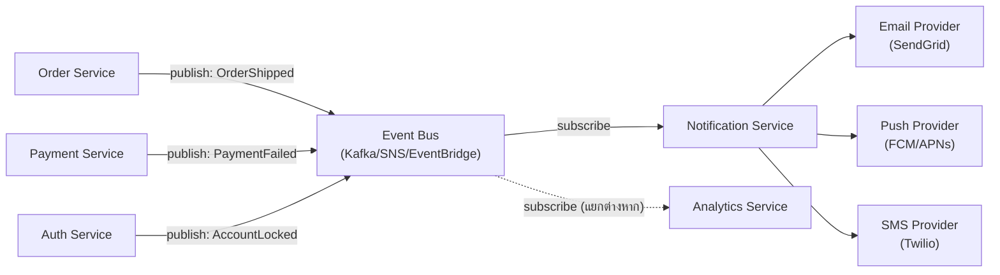

ลองนึกภาพห้องส่งข่าวของสถานีวิทยุ — เวลามีเหตุการณ์เกิดขึ้น (ไฟไหม้, อุบัติเหตุ, ผลบอล) นักข่าวภาคสนามไม่ได้โทรหาทุกช่องทุกช่อง ทุกหนังสือพิมพ์ ทุกเว็บข่าวเองทีละที่ เขาแค่**ส่งข่าวเข้าศูนย์กลาง** แล้วศูนย์กลางนั้นจะกระจายข่าวต่อไปยังทุกช่องทางเองโดยอัตโนมัติ — วิทยุ, ทีวี, เว็บ, แอปมือถือ — นักข่าวภาคสนามไม่ต้องรู้ด้วยซ้ำว่าปลายทางมีกี่ช่องทาง

ระบบ **Notification Platform** ในบริษัท e-commerce หรือ fintech ก็ทำงานแบบเดียวกันเป๊ะ — เวลามีเหตุการณ์เกิดขึ้นในระบบ (สินค้าจัดส่งแล้ว, การชำระเงินล้มเหลว, บัญชีถูกล็อก) จะต้องมีคนแจ้งผู้ใช้ผ่านหลายช่องทาง (email, push notification, SMS) โดยที่ service ต้นทางไม่ต้องรู้เรื่องช่องทางเหล่านั้นเลยแม้แต่น้อย

## Requirement คร่าวๆ

- Service ต่างๆ ในระบบ (Order, Payment, Auth ฯลฯ) เกิด event แล้วต้องมีคนส่งแจ้งเตือนผู้ใช้ได้ โดยที่ Order Service ไม่ต้องรู้จัก Twilio หรือ SendGrid เลย
- รองรับหลายช่องทาง: Email, Push Notification, SMS — และเพิ่มช่องทางใหม่ในอนาคตได้โดยไม่กระทบ service ต้นทาง
- ปริมาณ event ไม่สม่ำเสมอ — บางช่วงเงียบมาก (กลางดึก) บางช่วงพุ่งสูงมาก (flash sale, batch job ตอนเช้า)
- แจ้งเตือนพลาดได้บ้าง (ส่งช้าไม่กี่วินาทีไม่ตาย) แต่ต้อง**ไม่ทำให้ Order/Payment service ช้าลง**เพราะรอส่ง notification

## Event-Driven Architecture: จุดเชื่อมที่หลวมโดยตั้งใจ

จากโมดูล 13 — ถ้าให้ Order Service เรียก Notification Service ตรงๆ แบบ synchronous (เหมือนนักข่าวโทรหาทุกช่องเอง) จะเกิดปัญหาสองอย่าง: หนึ่ง Order Service ต้องรู้จักทุก client ที่ต้องแจ้ง (tight coupling) สอง ถ้า Notification Service ช้าหรือล่ม จะดึง Order Service ให้ช้าตามไปด้วย (cascading failure) ทั้งที่การแจ้งเตือนไม่ได้อยู่ใน critical path ของการสั่งซื้อ

คำตอบคือ **Event-Driven Architecture** — Order Service แค่ **publish event** เข้า event bus (เช่น "OrderShipped", "PaymentFailed") แล้วจบหน้าที่ทันที ไม่ต้องรอใครตอบ ส่วน Notification Service เป็นแค่หนึ่งใน**หลาย subscriber** ที่ฟัง event เหล่านี้อยู่ (อาจมี Analytics Service ฟัง event เดียวกันด้วยก็ได้ โดยไม่ต้องแก้อะไรที่ Order Service เลย) — นี่คือความแตกต่างสำคัญจาก synchronous call: ผู้ส่งไม่รู้จักและไม่สนใจว่าใครเป็นผู้รับ



ข้อดีที่ชัดเจนคือ **decoupling** — เพิ่มช่องทางแจ้งเตือนใหม่ (เช่น LINE Notify) แค่เพิ่ม provider ใน Notification Service เดียว ไม่ต้องแตะ Order/Payment/Auth เลยสักบรรทัด แต่ก็แลกมาด้วยความซับซ้อนเรื่อง **eventual consistency** — ผู้ใช้อาจได้รับแจ้งเตือนช้ากว่าเหตุการณ์จริงไม่กี่วินาทีถึงนาที ซึ่งยอมรับได้สำหรับโดเมนนี้ (ต่างจาก Payment ที่ต้องการ strong consistency แบบที่เห็นในเคส e-commerce checkout)

ข้อควรระวังของ event-driven คือมันแก้ปัญหาหนึ่งแล้วสร้างคำถามใหม่เสมอ — พอ service ต้นทางไม่ต้องรู้จักผู้รับแล้ว จะรู้ได้อย่างไรว่า event ที่ publish ไปถูกประมวลผลจริง ถ้า Notification Service ล่มไปตอนที่ event เข้ามาพอดี event นั้นจะหายไปเลยหรือไม่ นี่คือเหตุผลที่ event bus ที่เลือกใช้ต้องรองรับการ**เก็บ event ไว้จนกว่าจะมีคน consume สำเร็จ** (เช่น Kafka ที่เก็บ log ไว้ระยะหนึ่ง หรือ SQS ที่ลบ message ก็ต่อเมื่อ consumer ยืนยันแล้วเท่านั้น) ไม่ใช่แค่ fire-and-forget เฉยๆ

## Reliability: เมื่อ Provider ภายนอกล่มหรือ Event ซ้ำ

Event-driven architecture แก้ปัญหา coupling ได้ก็จริง แต่สร้างคำถามใหม่ที่ต้องตอบให้ชัด — ถ้า event bus ส่ง event ซ้ำ (at-least-once delivery ซึ่งเป็นค่าเริ่มต้นของ message broker ส่วนใหญ่) หรือถ้า email provider ภายนอกอย่าง SendGrid ล่มชั่วคราวระหว่างที่ Notification Service กำลังยิง request จะเกิดอะไรขึ้น

คำตอบมาตรฐานคือสองกลไกที่ทำงานร่วมกัน ทั้งคู่ต่อยอดจากโมดูล Reliability ของ System Design โดยตรง: หนึ่ง **Idempotency** — ทุก event ต้องมี unique event ID กำกับ ถ้า Notification Service เห็น event ID ที่เคยประมวลผลไปแล้ว ให้ข้ามทันที ป้องกันไม่ให้ผู้ใช้ได้รับอีเมลซ้ำสองสามฉบับจาก event เดียวกัน สอง **Retry with backoff + Dead-Letter Queue** — ถ้ายิง request ไป provider แล้วล้มเหลว ให้ retry แบบ exponential backoff สักสองสามครั้ง ถ้ายังไม่สำเร็จให้ย้าย event นั้นไปเก็บใน dead-letter queue แยกต่างหาก เพื่อให้ทีมตรวจสอบทีหลังได้ โดยไม่บล็อกการประมวลผล event อื่นที่เข้ามาต่อคิว

สองกลไกนี้คือสิ่งที่ทำให้ "ยอมรับ eventual consistency ได้" ในทางปฏิบัติจริง ไม่ใช่แค่ยอมรับความช้า แต่ต้องออกแบบให้ระบบ**พังบางส่วนได้โดยไม่พังทั้งหมด** — provider ตัวหนึ่งล่มไม่ควรทำให้ event ของ provider อื่นค้างตามไปด้วย

## Trade-off เรื่อง Quality Attribute: Serverless (FaaS) vs Worker Pool

นี่คือจุดที่โมดูล 16 เข้ามาเต็มๆ — เมื่อออกแบบตัว Notification Service เองว่าจะรันด้วยอะไร มีสอง option หลักที่มัก debate กัน และ**ไม่มีคำตอบเดียวที่ถูกเสมอ** ขึ้นอยู่กับว่าให้น้ำหนัก quality attribute ไหนมากกว่า

**Serverless (FaaS เช่น AWS Lambda)** — แต่ละ event ที่มาถึงจะ trigger function ใหม่ขึ้นมาประมวลผลแล้วปิดตัวเอง เหมาะกับ workload ที่ไม่สม่ำเสมออย่างมาก เพราะจ่ายเงินตาม event จริง ไม่มี event ก็ไม่มีค่าใช้จ่าย (scale to zero) แต่มีจุดอ่อนคือ **cold start** — ถ้า function ไม่ได้ถูกเรียกมาสักพัก ครั้งถัดไปจะช้ากว่าปกติเพราะต้อง initialize ใหม่ทั้งหมด

**Worker Pool (long-running process)** — มี process หรือ container ที่รันตลอดเวลา คอยดึง message จาก queue มาประมวลผล ข้อดีคือ latency สม่ำเสมอ ไม่มี cold start เพราะ process พร้อมทำงานอยู่แล้วเสมอ แต่ต้องจ่ายค่า infra ตลอด 24 ชั่วโมงแม้ตอนกลางดึกที่แทบไม่มี event เข้ามาเลย (idle cost)

การตัดสินใจนี้จริงๆ คือคำถามเดียวกับที่โมดูล 18 (Deployment & Infra Architecture) เรื่อง Cloud-Native Architecture Patterns พูดถึง — Serverless FaaS คือรูปแบบ cloud-native ที่สุดขั้วด้าน elasticity (scale to zero) ส่วน Worker Pool ที่รันบน container orchestration (เช่น Kubernetes จากโมดูล 18) ให้ control เหนือ concurrency และ resource มากกว่า เลือกได้ตามว่าให้น้ำหนัก operational simplicity หรือ latency consistency มากกว่ากัน

```demo
component: ComparisonDiagram
props: {"left":{"title":"Serverless FaaS (เช่น Lambda)","points":["Scale to zero — ไม่มี event ไม่มีค่าใช้จ่าย","จ่ายตาม event จริง (pay-per-invocation) เหมาะกับ traffic ไม่สม่ำเสมอ","มี cold start — ครั้งแรกหลังว่างนานจะช้ากว่าปกติ","ไม่ต้องดูแล infra เอง (ops overhead ต่ำ)"]},"right":{"title":"Long-running Worker Pool","points":["Latency สม่ำเสมอ ไม่มี cold start เพราะ process พร้อมอยู่แล้ว","ควบคุม concurrency และ retry logic ได้ละเอียดกว่า","ต้องจ่ายค่า infra ตลอดเวลาแม้ไม่มี event เข้า (idle cost)","ต้องดูแล scaling เอง (autoscaling group, health check)"]},"note":"เลือกจากคำถาม: notification เป็น critical path ที่ต้องเร็วสม่ำเสมอไหม? ถ้าดีเลย์ไม่กี่ร้อย ms รับได้ (เช่น email) Serverless คุ้มกว่าเพราะ traffic ไม่สม่ำเสมอ แต่ถ้าต้องการ SLA latency แน่นอน (เช่น push notification เตือน OTP) worker pool ที่ warm อยู่เสมออาจเหมาะกว่า"}
```

## ตารางเปรียบเทียบ Trade-off

| ประเด็น | Serverless (FaaS) | Worker Pool |
|---|---|---|
| ต้นทุนตอน traffic ต่ำ | ต่ำมาก (scale to zero) | คงที่ ไม่ลดตาม traffic |
| ต้นทุนตอน traffic สูงมาก | อาจแพงกว่าถ้า sustained load สูงตลอด | คุ้มกว่าถ้า utilization สูงสม่ำเสมอ |
| Latency | ไม่แน่นอน (cold start เป็นครั้งคราว) | สม่ำเสมอกว่า |
| ความซับซ้อนด้าน ops | ต่ำ — ผู้ให้บริการจัดการ infra ให้ | สูงกว่า — ต้องดูแล autoscaling, health check เอง |
| เหมาะกับ workload | Spiky/ไม่สม่ำเสมอ, ไม่ critical เรื่อง latency | สม่ำเสมอ, ต้องการ latency คงที่ |

## ADR ตัวอย่าง

> **Title:** เลือก Event-Driven ร่วมกับ Serverless FaaS สำหรับ Notification Service
> **Status:** Accepted
> **Context:** Service หลักในระบบ (Order, Payment, Auth) ต้องแจ้งเตือนผู้ใช้ผ่านหลายช่องทางโดยไม่ให้ latency ของ notification กระทบ critical path ของธุรกรรมหลัก ปริมาณ event ต่อวันไม่สม่ำเสมอมาก มีช่วงเงียบยาวนานสลับกับช่วง flash sale ที่พุ่งสูง
> **Decision:** ใช้ event-driven architecture — service ต้นทาง publish event เข้า event bus กลาง แล้วให้ Notification Service เป็น subscriber ที่รันบน serverless FaaS ประมวลผลทีละ event และยิงต่อไปยัง email/push/SMS provider
> **Consequences:** ลด coupling ระหว่าง service ต้นทางกับช่องทางแจ้งเตือนลงมาก เพิ่มช่องทางใหม่ได้โดยไม่กระทบ service เดิม ต้นทุนต่ำมากในช่วง traffic น้อย แต่ต้องยอมรับ cold start latency เป็นครั้งคราว และต้องออกแบบระบบ retry/dead-letter queue รองรับกรณี provider ภายนอกล่มชั่วคราว เพราะ consistency ของการแจ้งเตือนเป็นแบบ eventual ไม่ใช่ strong
