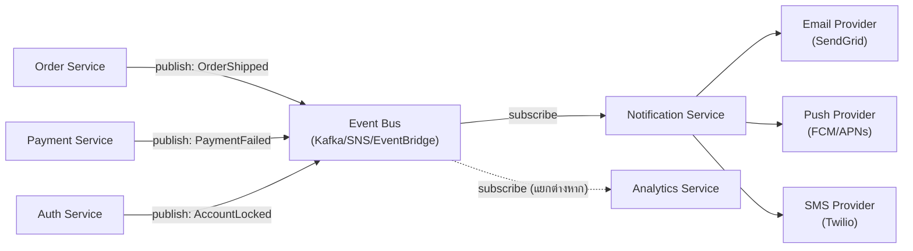
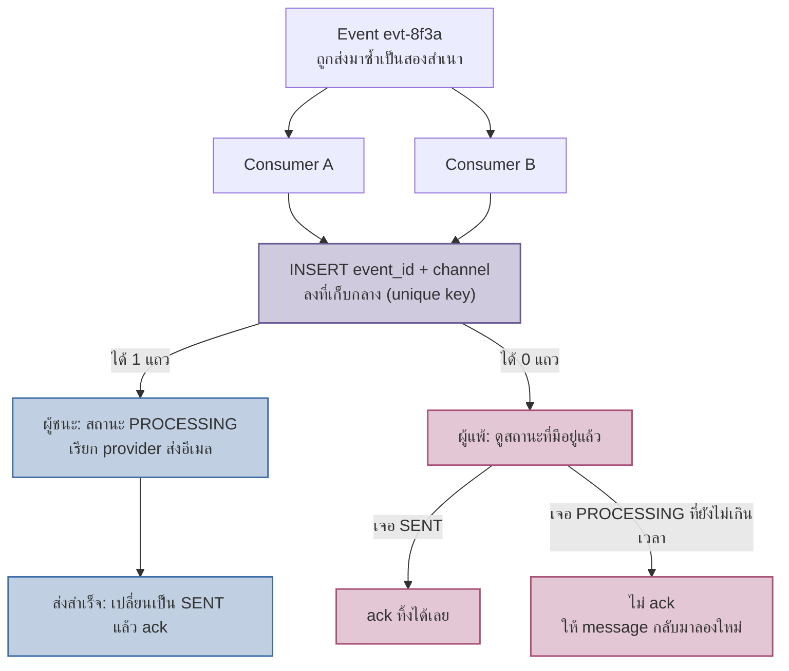
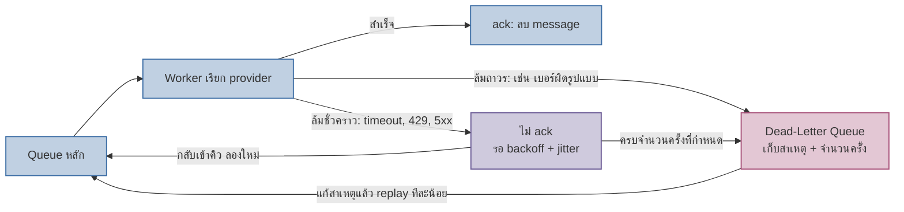
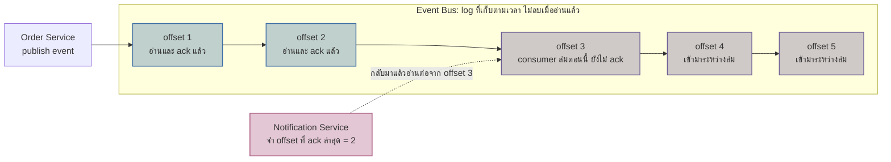
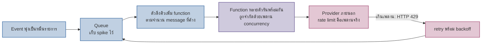
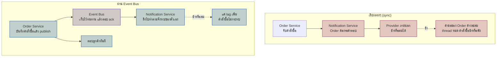
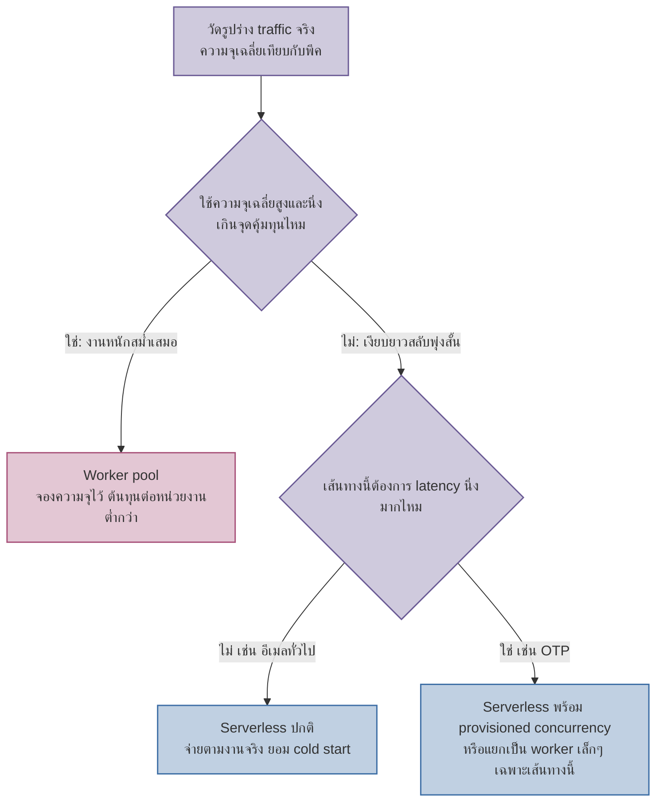
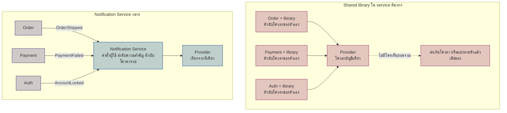

ลองนึกภาพห้องส่งข่าวของสถานีวิทยุ — เวลามีเหตุการณ์เกิดขึ้น (ไฟไหม้, อุบัติเหตุ, ผลบอล) นักข่าวภาคสนามไม่ได้โทรหาทุกช่องทุกช่อง ทุกหนังสือพิมพ์ ทุกเว็บข่าวเองทีละที่ เขาแค่**ส่งข่าวเข้าศูนย์กลาง** แล้วศูนย์กลางนั้นจะกระจายข่าวต่อไปยังทุกช่องทางเองโดยอัตโนมัติ — วิทยุ, ทีวี, เว็บ, แอปมือถือ — นักข่าวภาคสนามไม่ต้องรู้ด้วยซ้ำว่าปลายทางมีกี่ช่องทาง

ระบบ **Notification Platform** ในบริษัท e-commerce หรือ fintech ก็ทำงานแบบเดียวกันเป๊ะ — เวลามีเหตุการณ์เกิดขึ้นในระบบ (สินค้าจัดส่งแล้ว, การชำระเงินล้มเหลว, บัญชีถูกล็อก) จะต้องมีคนแจ้งผู้ใช้ผ่านหลายช่องทาง (email, push notification, SMS) โดยที่ service ต้นทางไม่ต้องรู้เรื่องช่องทางเหล่านั้นเลยแม้แต่น้อย

## Requirement คร่าวๆ

- Service ต่างๆ ในระบบ (Order, Payment, Auth ฯลฯ) เกิด event แล้วต้องมีคนส่งแจ้งเตือนผู้ใช้ได้ โดยที่ Order Service ไม่ต้องรู้จัก Twilio หรือ SendGrid เลย
- รองรับหลายช่องทาง: Email, Push Notification, SMS — และเพิ่มช่องทางใหม่ในอนาคตได้โดยไม่กระทบ service ต้นทาง
- ปริมาณ event ไม่สม่ำเสมอ — บางช่วงเงียบมาก (กลางดึก) บางช่วงพุ่งสูงมาก (flash sale, batch job ตอนเช้า)
- แจ้งเตือนพลาดได้บ้าง (ส่งช้าไม่กี่วินาทีไม่ตาย) แต่ต้อง**ไม่ทำให้ Order/Payment service ช้าลง**เพราะรอส่ง notification

## Event-Driven Architecture: จุดเชื่อมที่หลวมโดยตั้งใจ

จากโมดูล 13 — ถ้าให้ Order Service เรียก Notification Service ตรงๆ แบบ synchronous (เหมือนนักข่าวโทรหาทุกช่องเอง) จะเกิดปัญหาสองอย่าง: หนึ่ง Order Service ต้องรู้จักทุก client ที่ต้องแจ้ง (tight coupling) สอง ถ้า Notification Service ช้าหรือล่ม จะดึง Order Service ให้ช้าตามไปด้วย (cascading failure) ทั้งที่การแจ้งเตือนไม่ได้อยู่ใน critical path ของการสั่งซื้อ

คำตอบคือ <mark class="hl-term">**Event-Driven Architecture**</mark> — Order Service แค่ **publish event** เข้า event bus (เช่น "OrderShipped", "PaymentFailed") แล้วจบหน้าที่ทันที ไม่ต้องรอใครตอบ ส่วน Notification Service เป็นแค่หนึ่งใน**หลาย subscriber** ที่ฟัง event เหล่านี้อยู่ (อาจมี Analytics Service ฟัง event เดียวกันด้วยก็ได้ โดยไม่ต้องแก้อะไรที่ Order Service เลย) — <mark class="hl-insight">นี่คือความแตกต่างสำคัญจาก synchronous call: ผู้ส่งไม่รู้จักและไม่สนใจว่าใครเป็นผู้รับ</mark>


```mermaid
flowchart LR
    Order["Order Service"] -->|"publish: OrderShipped"| Bus["Event Bus\n(Kafka/SNS/EventBridge)"]
    Payment["Payment Service"] -->|"publish: PaymentFailed"| Bus
    Auth["Auth Service"] -->|"publish: AccountLocked"| Bus
    Bus -->|"subscribe"| Notif["Notification Service"]
    Bus -.->|"subscribe (แยกต่างหาก)"| Analytics["Analytics Service"]
    Notif --> Email["Email Provider\n(SendGrid)"]
    Notif --> Push["Push Provider\n(FCM/APNs)"]
    Notif --> SMS["SMS Provider\n(Twilio)"]
```

ข้อดีที่ชัดเจนคือ **decoupling** — เพิ่มช่องทางแจ้งเตือนใหม่ (เช่น LINE Notify) แค่เพิ่ม provider ใน Notification Service เดียว ไม่ต้องแตะ Order/Payment/Auth เลยสักบรรทัด แต่ก็แลกมาด้วยความซับซ้อนเรื่อง **eventual consistency** — ผู้ใช้อาจได้รับแจ้งเตือนช้ากว่าเหตุการณ์จริงไม่กี่วินาทีถึงนาที ซึ่งยอมรับได้สำหรับโดเมนนี้ (ต่างจาก Payment ที่ต้องการ strong consistency แบบที่เห็นในเคส e-commerce checkout)

ข้อควรระวังของ event-driven คือมันแก้ปัญหาหนึ่งแล้วสร้างคำถามใหม่เสมอ — พอ service ต้นทางไม่ต้องรู้จักผู้รับแล้ว จะรู้ได้อย่างไรว่า event ที่ publish ไปถูกประมวลผลจริง <mark class="hl-warning">ถ้า Notification Service ล่มไปตอนที่ event เข้ามาพอดี event นั้นจะหายไปเลยหรือไม่</mark> นี่คือเหตุผลที่ event bus ที่เลือกใช้ต้องรองรับการ**เก็บ event ไว้จนกว่าจะมีคน consume สำเร็จ** (เช่น Kafka ที่เก็บ log ไว้ระยะหนึ่ง หรือ SQS ที่ลบ message ก็ต่อเมื่อ consumer ยืนยันแล้วเท่านั้น) ไม่ใช่แค่ fire-and-forget เฉยๆ

```demo
component: JourneyDiagram
props: {"nodes":[{"icon":"building","label":"Order Service"},{"icon":"notebook","label":"Event Bus"},{"icon":"building","label":"Notification Service"},{"icon":"envelope","label":"Email/SMS/Push"}],"travelerIcon":"envelope","steps":[{"activeNode":0,"caption":"Order Service เกิด event OrderShipped แล้ว publish เข้า Event Bus ทันที ไม่รอใครตอบกลับ"},{"activeNode":1,"caption":"Event Bus เก็บ event ไว้ รอให้ subscriber มาดึงไปประมวลผล"},{"activeNode":2,"caption":"Notification Service เป็นหนึ่งใน subscriber ที่ฟัง event นี้อยู่ ดึง event ไปประมวลผล"},{"activeNode":3,"caption":"Notification Service ยิงต่อไปยัง Email/Push/SMS provider ตามช่องทางที่ผู้ใช้ตั้งไว้"},{"activeNode":2,"caption":"ถ้า provider ล้มเหลว Notification Service retry ด้วย backoff และย้ายเข้า dead-letter queue ถ้ายังไม่สำเร็จ ไม่บล็อก event อื่น"}]}
```

## Reliability: เมื่อ Provider ภายนอกล่มหรือ Event ซ้ำ

Event-driven architecture แก้ปัญหา coupling ได้ก็จริง แต่สร้างคำถามใหม่ที่ต้องตอบให้ชัด — ถ้า event bus ส่ง event ซ้ำ (at-least-once delivery ซึ่งเป็นค่าเริ่มต้นของ message broker ส่วนใหญ่) หรือถ้า email provider ภายนอกอย่าง SendGrid ล่มชั่วคราวระหว่างที่ Notification Service กำลังยิง request จะเกิดอะไรขึ้น

คำตอบมาตรฐานคือสองกลไกที่ทำงานร่วมกัน ทั้งคู่ต่อยอดจากโมดูล Reliability ของ System Design โดยตรง: หนึ่ง <mark class="hl-term">**Idempotency**</mark> — ทุก event ต้องมี unique event ID กำกับ ถ้า Notification Service เห็น event ID ที่เคยประมวลผลไปแล้ว ให้ข้ามทันที ป้องกันไม่ให้ผู้ใช้ได้รับอีเมลซ้ำสองสามฉบับจาก event เดียวกัน สอง **Retry with backoff + Dead-Letter Queue** — ถ้ายิง request ไป provider แล้วล้มเหลว ให้ retry แบบ exponential backoff สักสองสามครั้ง ถ้ายังไม่สำเร็จให้ย้าย event นั้นไปเก็บใน dead-letter queue แยกต่างหาก เพื่อให้ทีมตรวจสอบทีหลังได้ โดยไม่บล็อกการประมวลผล event อื่นที่เข้ามาต่อคิว

สองกลไกนี้คือสิ่งที่ทำให้ "ยอมรับ eventual consistency ได้" ในทางปฏิบัติจริง ไม่ใช่แค่ยอมรับความช้า แต่ต้องออกแบบให้ระบบ**พังบางส่วนได้โดยไม่พังทั้งหมด** — provider ตัวหนึ่งล่มไม่ควรทำให้ event ของ provider อื่นค้างตามไปด้วย

## Trade-off เรื่อง Quality Attribute: Serverless (FaaS) vs Worker Pool

นี่คือจุดที่โมดูล 16 เข้ามาเต็มๆ — เมื่อออกแบบตัว Notification Service เองว่าจะรันด้วยอะไร มีสอง option หลักที่มัก debate กัน และ**ไม่มีคำตอบเดียวที่ถูกเสมอ** ขึ้นอยู่กับว่าให้น้ำหนัก quality attribute ไหนมากกว่า

**Serverless (FaaS เช่น AWS Lambda)** — แต่ละ event ที่มาถึงจะ trigger function ใหม่ขึ้นมาประมวลผลแล้วปิดตัวเอง เหมาะกับ workload ที่ไม่สม่ำเสมออย่างมาก เพราะจ่ายเงินตาม event จริง ไม่มี event ก็ไม่มีค่าใช้จ่าย (scale to zero) แต่มีจุดอ่อนคือ **cold start** — ถ้า function ไม่ได้ถูกเรียกมาสักพัก ครั้งถัดไปจะช้ากว่าปกติเพราะต้อง initialize ใหม่ทั้งหมด

**Worker Pool (long-running process)** — มี process หรือ container ที่รันตลอดเวลา คอยดึง message จาก queue มาประมวลผล ข้อดีคือ latency สม่ำเสมอ ไม่มี cold start เพราะ process พร้อมทำงานอยู่แล้วเสมอ แต่ต้องจ่ายค่า infra ตลอด 24 ชั่วโมงแม้ตอนกลางดึกที่แทบไม่มี event เข้ามาเลย (idle cost)

การตัดสินใจนี้จริงๆ คือคำถามเดียวกับที่โมดูล 18 (Deployment & Infra Architecture) เรื่อง Cloud-Native Architecture Patterns พูดถึง — Serverless FaaS คือรูปแบบ cloud-native ที่สุดขั้วด้าน elasticity (scale to zero) ส่วน Worker Pool ที่รันบน container orchestration (เช่น Kubernetes จากโมดูล 18) ให้ control เหนือ concurrency และ resource มากกว่า เลือกได้ตามว่าให้น้ำหนัก operational simplicity หรือ latency consistency มากกว่ากัน

```demo
component: ComparisonDiagram
props: {"left":{"title":"Serverless FaaS (เช่น Lambda)","points":["Scale to zero — ไม่มี event ไม่มีค่าใช้จ่าย","จ่ายตาม event จริง (pay-per-invocation) เหมาะกับ traffic ไม่สม่ำเสมอ","มี cold start — ครั้งแรกหลังว่างนานจะช้ากว่าปกติ","ไม่ต้องดูแล infra เอง (ops overhead ต่ำ)"]},"right":{"title":"Long-running Worker Pool","points":["Latency สม่ำเสมอ ไม่มี cold start เพราะ process พร้อมอยู่แล้ว","ควบคุม concurrency และ retry logic ได้ละเอียดกว่า","ต้องจ่ายค่า infra ตลอดเวลาแม้ไม่มี event เข้า (idle cost)","ต้องดูแล scaling เอง (autoscaling group, health check)"]},"note":"เลือกจากคำถาม: notification เป็น critical path ที่ต้องเร็วสม่ำเสมอไหม? ถ้าดีเลย์ไม่กี่ร้อย ms รับได้ (เช่น email) Serverless คุ้มกว่าเพราะ traffic ไม่สม่ำเสมอ แต่ถ้าต้องการ SLA latency แน่นอน (เช่น push notification เตือน OTP) worker pool ที่ warm อยู่เสมออาจเหมาะกว่า"}
```

## ตารางเปรียบเทียบ Trade-off

| ประเด็น | Serverless (FaaS) | Worker Pool |
|---|---|---|
| ต้นทุนตอน traffic ต่ำ | ต่ำมาก (scale to zero) | คงที่ ไม่ลดตาม traffic |
| ต้นทุนตอน traffic สูงมาก | อาจแพงกว่าถ้า sustained load สูงตลอด | คุ้มกว่าถ้า utilization สูงสม่ำเสมอ |
| Latency | ไม่แน่นอน (cold start เป็นครั้งคราว) | สม่ำเสมอกว่า |
| ความซับซ้อนด้าน ops | ต่ำ — ผู้ให้บริการจัดการ infra ให้ | สูงกว่า — ต้องดูแล autoscaling, health check เอง |
| เหมาะกับ workload | Spiky/ไม่สม่ำเสมอ, ไม่ critical เรื่อง latency | สม่ำเสมอ, ต้องการ latency คงที่ |

## คำถามเจาะลึกที่มักถูกถามต่อ

พออธิบายว่า Notification Platform ใช้ event bus, idempotency, retry พร้อม dead-letter queue และ serverless จบ คนสัมภาษณ์หรือเพื่อนร่วมทีมมักไม่หยุดแค่ "ใช้อะไร" แต่จะถามต่อว่า "แล้วข้างในมันทำงานยังไง ถ้าพังจะเกิดอะไรขึ้น" สี่คำถามแรก (Q1–Q4) คือคำถามต่อยอดที่เจอบ่อยที่สุด แต่ละข้อไล่ให้ครบว่า ใช้ความรู้อะไรจากโมดูลไหน แก้ปัญหายังไง มีขั้นตอนอะไรบ้าง และข้างใต้จริงๆ มีอะไรทำงานอยู่ ส่วนอีกแนวที่ senior ชอบถามที่สุดคือ "ทำไมเลือกแบบนี้ ทำไมไม่เลือกอีกแบบ" สามคำถามหลัง (Q5–Q7) จึงไล่ให้เห็นทางเลือกที่ไม่ได้เลือก เหตุผลข้างใต้ ราคาที่ต้องจ่าย และเงื่อนไขที่ทำให้คำตอบเปลี่ยน

### Q1: Notification Service รู้ได้ยังไงว่า event นี้เคยส่งแจ้งเตือนไปแล้ว โดยเฉพาะตอนที่ consumer สองตัวได้ event เดียวกันมาพร้อมกัน

**ใช้ความรู้อะไร:** โมดูล Reliability ของ System Design (Idempotency) บวกโมดูล 13 (Event-Driven — message broker ส่งแบบ at-least-once จึงส่ง event เดิมซ้ำได้) บวกโมดูล 15 (Domain Event คือข้อเท็จจริงที่เกิดขึ้นแล้วและมี "ตัวตน" ของตัวเอง จึงกำกับด้วยรหัสประจำตัวได้)

**นึกภาพก่อน:** ลองนึกถึงห้องรับพัสดุที่มีสมุดลงทะเบียนเล่มเดียว ใบสั่งส่งของเลขที่ 789 มาถึงพนักงานสองคนพร้อมกันเป็นสองสำเนา ถ้าต่างคนเปิดสมุดดูก่อนว่า "ยังไม่มีเลข 789" แล้วค่อยลงชื่อและส่งของ ทั้งคู่ก็เห็นว่าว่างในเสี้ยววินาทีเดียวกัน แล้วส่งของออกไปสองชุด นี่คือ **race condition** (แข่งกันทำงานจนผลผิด) แบบเดียวกับ "อ่านก่อนแล้วค่อยเขียน" ในเคส e-commerce checkout แค่คราวนี้ของที่ซ้ำคืออีเมลหรือ SMS ที่ผู้ใช้ได้รับสองฉบับ

**แก้ปัญหายังไง:** เปลี่ยนจาก "เปิดสมุดดูก่อน แล้วค่อยลงชื่อ" เป็น "ลงชื่อเลย ถ้าชื่อนี้มีอยู่แล้วให้ปฏิเสธ" ในคำสั่งเดียว เรียกว่า <mark class="hl-term">**atomic set-if-absent**</mark> (ใส่ค่าก็ต่อเมื่อยังไม่มีค่านั้น โดยเช็คและใส่เสร็จในก้าวเดียวที่แบ่งแยกไม่ได้) ขั้นตอนคือ

1. **ผู้ส่ง event สร้าง event ID ครั้งเดียวตอนเหตุการณ์เกิด** เช่น UUID (รหัสสุ่มยาวๆ ที่ซ้ำกันแทบเป็นไปไม่ได้) แล้วแนบไปกับ message เสมอ ถ้า broker ส่ง message เดิมซ้ำ ID ก็เป็นค่าเดิม ห้ามให้ฝั่ง consumer สร้าง ID เอง เพราะ ID ที่เปลี่ยนทุกครั้งที่รับจะมองไม่ออกว่าเป็น event เดียวกัน
2. **ก่อนเรียก provider ให้ consumer "จอง" ID ในที่เก็บกลางด้วยคำสั่งเดียว** ตัวอย่างใน PostgreSQL:

```sql
INSERT INTO processed_event (event_id, channel, status, claimed_at)
VALUES ('evt-8f3a', 'email', 'PROCESSING', now())
ON CONFLICT (event_id, channel) DO NOTHING;
```

3. **ดูจำนวนแถวที่ถูกสร้าง** ได้ 1 แถว แปลว่าเราเป็นผู้ชนะ ไปส่งได้ ได้ 0 แถว แปลว่ามีคนจองไปแล้ว (ถ้าใช้ Redis ก็เทียบเท่ากับ `SET dedupe:evt-8f3a:email PROCESSING NX EX 86400` โดย NX คือตั้งค่าเมื่อยังไม่มี key นี้ และ EX คือให้หมดอายุเองตามจำนวนวินาทีที่ระบุ ผลตอบกลับเป็น OK หรือ nil ซึ่งตีความแบบเดียวกัน ตัวเลขเป็นแค่ตัวอย่าง)
4. **key ต้องเป็นคู่ event ID กับช่องทาง** ไม่ใช่ event ID เดี่ยวๆ เพราะ event หนึ่งอันสั่งส่งได้ทั้ง email, push, SMS ถ้า email สำเร็จแต่ SMS ล้ม การ retry ต้องส่งแค่ SMS ถ้า key มีแค่ event ID ระบบจะเข้าใจผิดว่า "event นี้ทำเสร็จแล้ว" แล้วข้าม SMS ไปเลย

**ข้างใต้ทำงานยังไง:** <mark class="hl-insight">ความ atomic ต้องมาจากที่เก็บข้อมูล (unique key) ไม่ใช่จากโค้ดที่เราเขียนเช็คเอง</mark> ใน database คือ unique index บนคู่ (event_id, channel) เมื่อสอง transaction พยายาม insert key เดียวกัน ตัวที่สองจะ *ต้องรอ* ให้ตัวแรกจบก่อน (commit หรือ rollback) แล้วค่อยรู้ผล ถ้าตัวแรก commit ตัวที่สองเจอ conflict และได้ 0 แถว แต่ถ้าตัวแรก rollback คำจองหายไป ตัวที่สองได้สิทธิ์แทน (นี่คือพฤติกรรมของ PostgreSQL ฐานข้อมูลอื่นมีรายละเอียดต่างกันเล็กน้อยแต่หลักเดียวกัน) ส่วน Redis ประมวลผลคำสั่งทีละคำสั่งอยู่แล้ว จึงไม่มีทางที่ SET NX สองคำสั่งจะสอดแทรกกันกลางคัน

แถวที่จองไว้ไม่ใช่แค่ "เคยเห็น" แต่เป็นเครื่องจักรสถานะเล็กๆ คือ PROCESSING (จองแล้ว กำลังส่ง) ไปเป็น SENT (provider ตอบสำเร็จแล้ว) พร้อมเวลาที่จอง (claimed_at) ที่ต้องมีสถานะเพราะคำว่า "ข้าม" มีสามความหมายที่ต่างกันมาก

- เจอ SENT — ทำเสร็จจริงแล้ว ack ทิ้ง message ได้เลย
- เจอ PROCESSING ที่ยังไม่เกินเวลาที่ให้ทำ (lease) — มีคนกำลังทำอยู่ **อย่า ack** ปล่อยให้ message กลับมาลองใหม่ทีหลัง เพราะถ้าผู้จองตายกลางทางแล้วเราทิ้ง message ไป จะไม่มีใครส่งแจ้งเตือนนี้เลย
- เจอ PROCESSING ที่เกินเวลา — ผู้จองน่าจะตายไปแล้ว ขอรับช่วงต่อด้วย UPDATE ที่มีเงื่อนไข (เป็น atomic เช่นกัน) แล้วส่งเอง

เรื่องอายุของ record ต้องเก็บไว้นานกว่าช่วงที่ event เดิมจะ "กลับมา" ได้ คือระยะที่ bus เก็บ event รวมกับช่วง retry ทั้งหมด และช่วงที่ทีมอาจ replay จาก dead-letter queue (ดู Q2) แต่ไม่ต้องเก็บตลอดกาลเพราะตารางจะโตไม่หยุด จึงใช้ TTL ของ Redis หรือ job ลบแถวเก่าใน database


```mermaid
flowchart TB
    E["Event evt-8f3a<br/>ถูกส่งมาซ้ำเป็นสองสำเนา"] --> CA["Consumer A"]
    E --> CB["Consumer B"]
    CA --> S["INSERT event_id + channel<br/>ลงที่เก็บกลาง (unique key)"]
    CB --> S
    S -->|"ได้ 1 แถว"| W["ผู้ชนะ: สถานะ PROCESSING<br/>เรียก provider ส่งอีเมล"]
    S -->|"ได้ 0 แถว"| L["ผู้แพ้: ดูสถานะที่มีอยู่แล้ว"]
    W --> D["ส่งสำเร็จ: เปลี่ยนเป็น SENT แล้ว ack"]
    L -->|"เจอ SENT"| L1["ack ทิ้งได้เลย"]
    L -->|"เจอ PROCESSING ที่ยังไม่เกินเวลา"| L2["ไม่ ack<br/>ให้ message กลับมาลองใหม่"]

    classDef win fill:#3d6ea552,stroke:#3d6ea5,stroke-width:1.5px
    classDef lose fill:#a8527a52,stroke:#a8527a,stroke-width:1.5px
    classDef store fill:#6b5b9552,stroke:#6b5b95,stroke-width:1.5px
    class W,D win
    class L,L1,L2 lose
    class S store
```

```demo
component: StepThroughDiagram
props: {"steps":[{"label":"1. Event เดียวมาถึง consumer สองตัวพร้อมกัน","detail":"เกิดได้เมื่อ broker ส่งซ้ำเพราะ ack ของรอบแรกหาย หรือรอบแรกทำนานเกินเวลาที่ broker รอ จึงส่งสำเนาที่สองให้อีกตัว ทั้งสองสำเนามี event ID เดียวกันคือ evt-8f3a"},{"label":"2. ทั้งคู่ยิง INSERT พร้อมกัน ไม่มีใคร SELECT ก่อน","detail":"Consumer A และ B ต่างส่งคำสั่ง INSERT ของคู่ (evt-8f3a, email) ไปที่เก็บกลาง ไม่มีขั้น 'เช็คว่ามีไหม' คั่นกลางให้เกิดช่องว่าง"},{"label":"3. Unique index ตัดสิน: A ได้แถว B ได้ 0 แถว","detail":"Database รับคำสั่งของ A ก่อน B ที่ key เดียวกันต้องรอให้ A จบ พอ A commit แล้ว B เจอ conflict จึงได้ 0 แถว ไม่มีโค้ดฝั่ง application คุมคิวเลย"},{"label":"4. A ส่งอีเมล ส่วน B เห็นว่า A ยังทำอยู่","detail":"A เรียก provider ส่งอีเมล B อ่านสถานะเจอ PROCESSING ที่ยังไม่เกินเวลา จึง 'ไม่ ack' ปล่อยให้ message กลับเข้าคิวรอลองใหม่ เผื่อ A ตายกลางทาง"},{"label":"5. A สำเร็จ เปลี่ยนเป็น SENT แล้ว ack","detail":"provider ตอบสำเร็จ A อัปเดตแถวเป็น SENT แล้ว ack message ของตัวเอง"},{"label":"6. B กลับมาลองใหม่ เจอ SENT แล้ว ack ทิ้ง","detail":"รอบหน้า B ได้ message เดิมกลับมา ครั้งนี้เห็น SENT จึง ack ทิ้งได้อย่างปลอดภัย ผู้ใช้ได้รับอีเมลฉบับเดียว แต่ถ้า A ตายในขั้น 4 แถวจะค้างที่ PROCESSING จนเกินเวลา แล้ว B รับช่วงส่งแทน"}]}
```

**ถ้าพังหรือมีข้อควรระวังอะไร:**

- **ห้ามเช็คด้วย SELECT แล้วค่อย INSERT แยกสองจังหวะ** — นั่นคือ race condition เดิมทุกประการ ต้องเป็นคำสั่งเดียวที่ให้ที่เก็บเป็นคนตัดสิน
- **ไม่มีลำดับ "จองแล้วส่ง" หรือ "ส่งแล้วจด" ไหนกันได้ 100%** — ถ้าทำเป็น SENT ตั้งแต่ก่อนส่งแล้ว crash แจ้งเตือนจะหายเงียบ ถ้าส่งก่อนแล้วค่อยจด crash คั่นกลางจะส่งซ้ำ การใช้ PROCESSING พร้อม lease ปิดกรณีหายเงียบได้ แต่ยังเหลือช่องแคบๆ ที่ provider รับไปแล้วแต่เรา crash ก่อนจด SENT ซึ่งจะปิดได้ก็ต่อเมื่อ provider รองรับ idempotency key ให้แนบ event ID ไป ถ้าไม่รองรับต้องยอมรับซ้ำแบบหายาก แจ้งเตือนส่วนใหญ่ยอมรับซ้ำหายากได้ดีกว่าหายเงียบ แต่ข้อความที่ซ้ำแล้วเสียหายจริง (เช่น แจ้งยอดตัดเงิน) ต้องประเมินให้เข้มขึ้น
- <mark class="hl-warning">ถ้า TTL ของ record dedupe สั้นกว่าเวลาที่ event จะกลับมาได้ ระบบจะ "ลืม" ว่าเคยส่ง แล้วส่งซ้ำตอน replay</mark> — และถ้าเก็บใน Redis ต้องรู้ว่าข้อมูลอาจหายตอน failover หรือถูกลบเมื่อหน่วยความจำเต็ม (ขึ้นกับการตั้งค่า) ถ้าต้องการความแน่นอนกว่าให้เก็บใน database
- event ID จับได้เฉพาะกรณี "message เดียวกันมาซ้ำ" ไม่ได้จับกรณีที่ต้นทาง publish สองครั้งด้วย ID ต่างกัน (เช่น Order Service retry แล้วสร้าง event ใหม่) จึงควรมี business key เช่น order-789-shipped เป็นชั้นที่สอง

### Q2: Retry with backoff และ Dead-Letter Queue ทำงานทีละขั้นยังไง ack, visibility timeout, poison message และการ replay คืออะไร

**ใช้ความรู้อะไร:** โมดูล 16 (Availability tactic แบบ Retry ในหัวข้อ Architecture Tactics ขั้นสูง — retry กู้ได้เฉพาะความล้มเหลวชั่วคราว) บวกโมดูล Reliability ของ System Design (exponential backoff และ dead-letter queue) บวกโมดูล 13 (message broker ที่รอให้ consumer ยืนยัน)

**นึกภาพก่อน:** ไรเดอร์ส่งอาหารไปถึงแล้วลูกค้าไม่รับสาย ไรเดอร์ไม่ทิ้งอาหารไว้กลางทาง และไม่โทรรัวทุกวินาที แต่รอสักพักแล้วโทรใหม่ ห่างขึ้นเรื่อยๆ พอโทรครบจำนวนครั้งที่ตกลงกันแล้วยังไม่ติด ก็ไม่โทรอีก แต่ส่งกลับเข้าตู้ "พัสดุตีกลับ" ให้ฝ่ายลูกค้าสัมพันธ์ตามต่อ ระหว่างนั้นไรเดอร์ออกไปส่งออเดอร์อื่นต่อได้ ไม่ต้องยืนรออยู่หน้าบ้านนั้น ตู้พัสดุตีกลับคือ **dead-letter queue (DLQ)** และการที่ไรเดอร์ไม่ยืนรอคือการไม่บล็อก event อื่น

**แก้ปัญหายังไง:** ก่อนไล่ขั้นตอน ขอนิยามคำสี่คำที่ใช้ตลอดข้อนี้ **ack** (acknowledge) คือ consumer บอก broker ว่า "ประมวลผลเสร็จแล้ว ลบหรือขยับผ่านได้" **visibility timeout** คือช่วงเวลาที่ message ที่ถูกหยิบไปแล้วถูกซ่อนจาก consumer ตัวอื่นชั่วคราว **consumer offset** คือตำแหน่งที่ consumer อ่านถึงใน log และ **<mark class="hl-term">poison message</mark>** คือ message ที่ประมวลผลไม่สำเร็จไม่ว่าจะลองกี่ครั้ง (เช่น payload เสียรูปแบบ หรือมี bug ที่เกิดเฉพาะข้อมูลนี้) ขั้นตอนมีดังนี้

1. Worker หยิบ message จากคิว แต่ message **ยังไม่ถูกลบ** แค่ถูก "ยืม" ไว้ชั่วคราว
2. Worker เรียก provider ถ้าสำเร็จ ก็ **ack** เพื่อบอกให้ลบ message ทิ้ง
3. ถ้าล้มเหลวแบบ **ชั่วคราว** (timeout, HTTP 429 ที่แปลว่าส่งถี่เกินโควตา, หรือ 5xx ที่แปลว่า provider ขัดข้อง) worker **ไม่ ack** แล้วให้ message กลับมาใหม่หลังหน่วงเวลา ซึ่งหน่วงนานขึ้นทุกรอบ (backoff) และสุ่มเวลาเพิ่มเล็กน้อย (jitter)
4. ถ้าล้มเหลวแบบ **ถาวร** (เช่น เบอร์โทรผิดรูปแบบ, provider ตอบ 400) ไม่ต้อง retry เพราะลองอีกกี่ครั้งผลก็เหมือนเดิม ส่งเข้า DLQ ทันทีพร้อมบันทึกสาเหตุ
5. ถ้า retry ครบจำนวนครั้งที่กำหนดแล้วยังไม่สำเร็จ ก็ย้ายเข้า DLQ เช่นกัน
6. คนหรือระบบตรวจสอบเห็น alert แก้สาเหตุ แล้ว **replay** คือส่ง message กลับเข้าคิวหลักให้ประมวลผลใหม่

**ข้างใต้ทำงานยังไง:** การ retry ทำงานต่างกันตามชนิดของ broker

- **คิวแบบ Amazon SQS** (Simple Queue Service — คิวข้อความของ AWS) — consumer ไม่ได้ถูก "ส่ง" message แต่เป็นฝ่าย *receive* เมื่อ receive แล้ว message ถูกซ่อนตาม visibility timeout ถ้า consumer ไม่ลบก่อนหมดเวลา message ก็กลับมาให้ consumer ตัวไหนก็ได้ receive ใหม่ พร้อมตัวนับจำนวนครั้งที่ถูก receive ที่เพิ่มขึ้น เมื่อตัวนับเกินค่าที่ตั้งไว้ (เรียกว่า maxReceiveCount ใน redrive policy) SQS ย้าย message เข้า DLQ ที่เราสร้างเตรียมไว้ให้เอง และ consumer ยังปรับ visibility timeout ของ message เป็นรายตัวได้ จึงใช้เป็นตัวกำหนดเวลา backoff ได้
- **log แบบ Kafka** — ไม่มีการลบทีละ message consumer จำ **offset** ของตัวเอง และ commit offset ก็คือ ack เมื่อ crash ก็เริ่มอ่านใหม่จาก offset ที่ commit ล่าสุด Kafka ไม่มี visibility timeout และตัว consumer ของ Kafka ไม่มี DLQ ในตัว ทีมจึงมักสร้าง topic สำหรับ retry และ topic ที่เป็น DLQ เอง โดย consumer publish message ที่ล้มไปยัง topic ถัดไปพร้อมข้อมูลจำนวนครั้ง แล้ว commit offset ของ topic หลักเพื่อเดินหน้าต่อ

ส่วน jitter ที่หลายคนข้าม มีเหตุผลชัดเจน ถ้า provider ล่มแล้วกลับมา แล้ว worker หลายร้อยตัวรอเวลาเท่ากันเป๊ะ (1 วินาที, 2 วินาที, 4 วินาที) ทุกตัวจะยิงพร้อมกันเป็นคลื่นลูกเดียว (thundering herd) แล้วล้ม provider ที่เพิ่งฟื้นซ้ำอีก วิธีมาตรฐานคือสุ่มเวลารอในช่วงที่ขยายขึ้นทุกรอบ:

```text
เวลารอ = สุ่มค่าระหว่าง 0 ถึง min(เพดาน, ฐาน x 2 ยกกำลังรอบที่ลอง)
ตัวอย่าง ฐาน = 1 วินาที : รอบ 1 สุ่มใน 0-2 วิ, รอบ 2 สุ่มใน 0-4 วิ, รอบ 3 สุ่มใน 0-8 วิ (ตัวเลขเป็นแค่ตัวอย่าง)
```


```mermaid
flowchart LR
    Q["Queue หลัก"] --> W["Worker เรียก provider"]
    W -->|"สำเร็จ"| ACK["ack: ลบ message"]
    W -->|"ล้มชั่วคราว: timeout, 429, 5xx"| R["ไม่ ack<br/>รอ backoff + jitter"]
    R -->|"กลับเข้าคิว ลองใหม่"| Q
    W -->|"ล้มถาวร: เช่น เบอร์ผิดรูปแบบ"| D["Dead-Letter Queue<br/>เก็บสาเหตุ + จำนวนครั้ง"]
    R -->|"ครบจำนวนครั้งที่กำหนด"| D
    D -->|"แก้สาเหตุแล้ว replay ทีละน้อย"| Q

    classDef ok fill:#3d6ea552,stroke:#3d6ea5,stroke-width:1.5px
    classDef retry fill:#6b5b9552,stroke:#6b5b95,stroke-width:1.5px
    classDef dead fill:#a8527a52,stroke:#a8527a,stroke-width:1.5px
    class Q,W,ACK ok
    class R retry
    class D dead
```

```demo
component: JourneyDiagram
props: {"nodes":[{"icon":"notebook","label":"Queue หลัก"},{"icon":"building","label":"Worker"},{"icon":"phone","label":"SMS Provider"},{"icon":"notebook","label":"Dead-Letter Queue"},{"icon":"person","label":"ทีมตรวจสอบ"}],"travelerIcon":"envelope","steps":[{"activeNode":0,"caption":"Message ส่ง SMS แจ้งเตือนรออยู่ในคิว Worker หยิบไปแล้ว message ถูกซ่อนไว้ชั่วคราว (visibility timeout) แต่ยังไม่ถูกลบ"},{"activeNode":1,"caption":"Worker เรียก provider ซึ่งเป็นครั้งที่ 1"},{"activeNode":2,"caption":"Provider ตอบ 503 (ขัดข้องชั่วคราว) Worker ไม่ ack แล้วไปทำ message อื่นต่อ ไม่ยืนรอ"},{"activeNode":0,"caption":"หลังรอตาม backoff message กลับมาให้ receive ใหม่ ตัวนับจำนวนครั้งเพิ่มเป็น 2 แล้วลองอีกรอบโดยรอนานขึ้นและสุ่มเวลาเพิ่ม"},{"activeNode":3,"caption":"ลองครบจำนวนครั้งที่ตั้งไว้แล้วยังล้ม ระบบย้าย message เข้า DLQ พร้อมสาเหตุ ส่วน event อื่นในคิวหลักไหลต่อได้ตามปกติ"},{"activeNode":4,"caption":"Alert แจ้งว่า DLQ ไม่ว่าง ทีมพบว่า provider กลับมาปกติแล้ว จึง replay message กลับเข้าคิวหลักทีละน้อย และเพราะมี idempotency (Q1) การส่งซ้ำจึงปลอดภัย"}]}
```

**ถ้าพังหรือมีข้อควรระวังอะไร:**

- <mark class="hl-warning">ถ้า visibility timeout สั้นกว่าเวลาที่ worker ใช้จริง (รวม timeout ของการเรียก provider) message จะกลับมาให้ตัวอื่นทั้งที่ตัวแรกยังทำอยู่</mark> ผลคือส่งซ้ำ เป็นเหตุผลอีกข้อที่ต้องมี idempotency ตาม Q1 และควรตั้ง timeout ของการเรียก provider ให้สั้นกว่า visibility timeout เสมอ
- **retry ทุกตัวพร้อมกันตอน provider ล่มคือการซ้ำเติม** — ยิ่ง retry ถี่ยิ่งเพิ่มโหลดให้ provider ที่กำลังแย่ (retry storm) จึงต้องมี backoff พร้อม jitter และ circuit breaker (ตัวตัดวงจรที่หยุดเรียก provider ชั่วคราวเมื่อเห็นว่าล้มติดกันหลายครั้ง) อย่าให้ retry เป็นคำตอบของทุกความล้มเหลว เพราะความล้มเหลวถาวรไม่มีวันหายจากการลองซ้ำ
- **poison message ที่ไม่มีเพดานจำนวนครั้งจะวนไม่จบ** — กิน capacity ของ worker ไปเรื่อยๆ และใน log ที่ต้องเรียงลำดับ ถ้า consumer ลองอ่าน offset เดิมซ้ำอยู่กับที่ message ที่อยู่ข้างหลังทั้งหมดใน partition นั้นจะถูกบล็อกตาม (head-of-line blocking) เพดานจำนวนครั้งกับ DLQ คือสิ่งที่ตัดวงจรนี้
- **DLQ ที่ไม่มีคนดูคือถังขยะเงียบ** — ต้องมี alert เมื่อ DLQ ไม่ว่าง และต้องรู้ว่า DLQ ก็มีระยะเก็บจำกัดเหมือนคิวทั่วไป ถ้าไม่มีใครมาจัดการทันก็หายอยู่ดี ก่อน replay ให้แก้สาเหตุให้เสร็จก่อนเสมอ ไม่งั้นก็แค่วนกลับเข้า DLQ อีกรอบ และควรทยอย replay แทนการเทกลับทีเดียว เพื่อไม่ให้ท่วม provider
- **แจ้งเตือนบางชนิดมีอายุ** — OTP (One-Time Password, รหัสผ่านใช้ครั้งเดียว) ที่ replay ออกไปหลังจากผ่านไปหลายชั่วโมงไม่มีประโยชน์และทำให้ผู้ใช้สับสน ควรใส่เวลาหมดอายุไปกับ event แล้วให้ worker ข้ามเมื่อเลยเวลา แทนที่จะส่งทุกอย่างที่ replay กลับมา

### Q3: ทำไม event bus ถึงส่ง event ซ้ำได้ แต่ถ้า Notification Service ล่มก็ไม่ทำให้ event หาย สองเรื่องนี้ไม่ขัดกันเหรอ

**ใช้ความรู้อะไร:** โมดูล 13 (Event-Driven — event bus และ message broker) บวกโมดูล 19 (Event Sourcing — log ที่ต่อท้ายอย่างเดียวและเก็บ event ไว้ให้อ่านย้อนหลังได้ เป็นหลักคิดเดียวกับ log ของ Kafka) บวกโมดูล Reliability ของ System Design (delivery guarantee)

**ปัญหาคืออะไร:** ลองนึกถึงพนักงานส่งจดหมายลงทะเบียนที่ต้องได้ใบตอบรับกลับมา ถ้าผู้รับเซ็นแล้วแต่ใบตอบรับหายระหว่างทาง พนักงานจะไม่รู้เลยว่าจดหมายถึงหรือยัง มีแค่สองทางเลือก ทางแรกคือสมมติว่าถึงแล้ว ถ้าผิด จดหมายหายไปเลย ทางที่สองคือส่งใหม่อีกฉบับ ถ้าผิด ผู้รับได้จดหมายซ้ำสองฉบับ ระบบที่ยอมให้ข้อมูลหายไม่ได้จะเลือกทางที่สอง นี่คือที่มาของ **<mark class="hl-term">at-least-once delivery</mark>** (ส่งอย่างน้อยหนึ่งครั้ง — ซ้ำได้ แต่ห้ามหาย) ส่วนทางแรกคือ at-most-once (ส่งอย่างมากหนึ่งครั้ง — ไม่ซ้ำ แต่หายได้) จุดสำคัญคือ broker มองไม่ออกว่า "consumer ตายก่อนทำ", "ทำเสร็จแล้วแต่ ack ไม่ถึง" หรือ "ack ถึงช้า" ต่างกันตรงไหน เพราะสิ่งเดียวที่มันเห็นคือ **ไม่ได้รับ ack** จึงต้องเลือกว่าจะเชื่อว่าสำเร็จหรือส่งซ้ำ

**แก้ปัญหายังไง:** แยกปัญหาเป็นสองครึ่งที่แก้คนละที่ ครึ่ง "ไม่ให้หาย" แก้ที่ broker ครึ่ง "ซ้ำแล้วไม่เป็นไร" แก้ที่ consumer

1. **Broker เขียน event ลง storage ที่ทนทานก่อนตอบ publisher ว่ารับแล้ว** คือเก็บลงดิสก์และทำสำเนาไว้หลายเครื่อง ไม่ใช่เก็บไว้ในหน่วยความจำเครื่องเดียว
2. **Event ถูกเก็บจนหมดเงื่อนไขการเก็บ ไม่ใช่จนกว่ามีใครอ่านสักคน** — Kafka เก็บ log ตามเวลาหรือขนาดที่ตั้งไว้ และไม่ลบเมื่ออ่านแล้ว consumer แต่ละกลุ่มจำ offset ของตัวเองแยกกัน (จึงทำให้ Analytics Service อ่าน event เดียวกันกับ Notification Service ได้โดยไม่กวนกัน) ส่วน SQS เก็บ message ไว้จนกว่า consumer จะลบ หรือหมดระยะเก็บที่ตั้งไว้
3. **Consumer ที่ล่มกลับมาอ่านต่อจากตำแหน่งที่ ack ล่าสุด** — event ที่เข้ามาระหว่างล่มรออยู่ครบ
4. **ส่วนที่ซ้ำ จัดการด้วย idempotency ที่ consumer** ตามที่เล่าใน Q1

**ข้างใต้ทำงานยังไง:** ลองไล่สามช่วงของเส้นทาง

- **Publisher ถึง broker** — publish ถือว่าสำเร็จเมื่อ broker ตอบ ack กลับมา ถ้าเครือข่ายหลุดก่อน publisher ได้รับ ack มันไม่รู้ว่า event ถึงหรือยัง จึง publish ซ้ำ ดังนั้นความซ้ำเกิดได้ตั้งแต่ฝั่งผู้ส่ง (Kafka มี idempotent producer ที่กันซ้ำในช่วงนี้ แต่รับประกันแค่ระหว่าง producer กับ broker เท่านั้น) และเพื่อกัน event หาย broker บางตัวมีตัวเลือกให้ publisher รอให้หลาย replica ยืนยันก่อน (เช่น acks=all ของ Kafka)
- **การเก็บใน broker** — topic ของ Kafka แบ่งเป็น partition แต่ละ partition คือ log ที่ต่อท้ายอย่างเดียว (append-only) ทุก event ได้เลขลำดับที่เรียกว่า offset และถูกทำสำเนาไปหลาย broker ส่วน SQS เก็บ message ซ้ำซ้อนไว้หลายเครื่อง
- **Consumer ล่มแล้วกลับมา** — สมมติล่มไป 2 ชั่วโมง ระหว่างนั้น event ไหลเข้ามาเก็บต่อท้าย log เรื่อยๆ committed offset ของ Notification Service ค้างอยู่ที่เดิม พอกลับมาก็อ่านต่อจากตรงนั้นและไล่ตามให้ทัน ตัวเลขที่บอกว่าค้างอยู่เท่าไหร่เรียกว่า **consumer lag** (จำนวน event ระหว่างตำแหน่งที่ ack ล่าสุดกับปลายของ log) เป็นตัวชี้วัดที่ควรตั้ง alert


```mermaid
flowchart LR
    P["Order Service<br/>publish event"] --> E1
    subgraph LOG["Event Bus: log ที่เก็บตามเวลา ไม่ลบเมื่ออ่านแล้ว"]
        E1["offset 1<br/>อ่านและ ack แล้ว"] --> E2["offset 2<br/>อ่านและ ack แล้ว"]
        E2 --> E3["offset 3<br/>consumer ล่มตอนนี้ ยังไม่ ack"]
        E3 --> E4["offset 4<br/>เข้ามาระหว่างล่ม"]
        E4 --> E5["offset 5<br/>เข้ามาระหว่างล่ม"]
    end
    C["Notification Service<br/>จำ offset ที่ ack ล่าสุด = 2"] -.->|"กลับมาแล้วอ่านต่อจาก offset 3"| E3

    classDef done fill:#3d6ea552,stroke:#3d6ea5,stroke-width:1.5px
    classDef waiting fill:#6b5b9552,stroke:#6b5b95,stroke-width:1.5px
    classDef consumer fill:#a8527a52,stroke:#a8527a,stroke-width:1.5px
    class E1,E2 done
    class E3,E4,E5 waiting
    class C consumer
```

```demo
component: ComparisonDiagram
props: {"left":{"title":"At-most-once (ส่งอย่างมากหนึ่งครั้ง)","points":["Broker ส่งครั้งเดียวแล้วถือว่าจบ ไม่รอ ack หรือไม่ส่งซ้ำ","ไม่มี event ซ้ำ ผู้ใช้ไม่ได้รับอีเมลสองฉบับ","ถ้า consumer ตายหลังรับแต่ก่อนทำเสร็จ event หายถาวรโดยไม่มีใครรู้","เหมาะกับข้อมูลที่หายได้ เช่น ตัวเลข metric ที่สุ่มเก็บ ไม่เหมาะกับแจ้งเตือนสำคัญอย่าง OTP"]},"right":{"title":"At-least-once (ส่งอย่างน้อยหนึ่งครั้ง)","points":["Broker เก็บ event ไว้จนกว่าจะได้ ack ถ้าไม่ได้ ack ก็ส่งใหม่","ไม่หาย แม้ consumer ล่มระหว่างทาง event รออยู่ครบ","แต่ซ้ำได้ เมื่อ ack ตกหล่นระหว่างทาง หรือ publisher ส่งซ้ำ","ต้องคู่กับ idempotency ที่ consumer (Q1) เป็นค่าเริ่มต้นของ broker ส่วนใหญ่และเป็นสิ่งที่เคสนี้เลือก"]},"note":"ไม่ขัดกัน เพราะ 'ซ้ำ' กับ 'หาย' คือสองหน้าของการตัดสินใจเดียวกันตอนไม่แน่ใจ ระบบเลือกส่งซ้ำแทนการยอมให้หาย แล้วผลักภาระจัดการความซ้ำไปให้ consumer ที่ทำ idempotent ได้"}
```

**ถ้าพังหรือมีข้อควรระวังอะไร:**

- <mark class="hl-warning">ถ้า consumer ล่มนานกว่าระยะที่ broker เก็บ event (retention) event ที่หมดอายุจะถูกลบจริงและกู้กลับมาไม่ได้</mark> ระยะเก็บตั้งได้เอง และค่าเริ่มต้นของแต่ละระบบต่างกัน (ตั้งแต่หลักวันถึงหลักสัปดาห์) ต้องตรวจในเอกสารของระบบที่ใช้ และตั้งให้ยาวกว่าเวลาที่ทีมกู้ระบบจริงได้ทัน พร้อม alert ที่ consumer lag
- **ช่องโหว่ที่ฝั่ง publisher (dual write)** — Order Service บันทึก order ลง database สำเร็จ แล้ว crash ก่อน publish event เข้า bus ต่อให้ bus ทนทานแค่ไหน event นี้ก็ไม่เคยเข้าไปเลย วิธีที่นิยมคือ **transactional outbox** เขียน event ลงตาราง outbox ใน transaction เดียวกับการบันทึก order แล้วมีตัว relay คอยอ่านตารางนั้นไป publish ทีหลัง ซึ่ง relay เองก็ส่งแบบ at-least-once จึงวนกลับมาพึ่ง idempotency อีกรอบ
- **"exactly-once" ที่ broker บางตัวโฆษณาไม่ได้ครอบคลุมถึงการส่งอีเมล** — ความรับประกันแบบนั้นใช้ได้ภายในระบบของ broker เอง เช่น อ่านจาก Kafka แล้วเขียนกลับ Kafka พอมี side effect ภายนอกอย่างการเรียก provider ส่งอีเมล ไม่มี broker ตัวไหนรับประกันแทนเราได้ ต้องทำ idempotency ที่ฝั่ง consumer เสมอ
- พอ consumer กลับมาหลังล่มนาน event ที่ค้างจะไหลเข้ามาพร้อมกันเป็นก้อนใหญ่ และอาจท่วม provider ได้ (ดู Q4) รวมทั้ง event เก่าบางชนิดหมดอายุการใช้งานไปแล้ว (เช่น OTP) ควรมีเวลาหมดอายุให้ข้ามได้ ตามที่เล่าใน Q2

### Q4: ตอน flash sale event พุ่งเป็นหมื่น Serverless จะ scale ยังไง cold start เกิดตอนไหน และทำไมเพดานจริงกลับเป็น provider ภายนอก

**ใช้ความรู้อะไร:** โมดูล 13 (Serverless — Cold Start) บวกโมดูล 16 (ทุกการตัดสินใจคือ trade-off และต้องหาคอขวดก่อน scale) บวกโมดูล 18 (Cloud-Native Patterns และ Container Orchestration — ฝั่ง worker pool ที่คุม concurrency เองได้) บวกโมดูล Reliability ของ System Design (backoff และ circuit breaker) ตัวอย่างชื่อฟีเจอร์ด้านล่างอิง AWS Lambda ซึ่งแต่ละ cloud ตั้งชื่อต่างกัน แต่หลักการเดียวกัน

**นึกภาพก่อน:** ร้านอาหารที่เรียกพนักงานเสิร์ฟรายชั่วโมงมาเสริมเมื่อลูกค้าล้น คนใหม่ต้องแต่งชุด เรียนเมนู และหาโต๊ะก่อนเริ่มงาน (cold start) ส่วนคนที่เพิ่งเสิร์ฟเสร็จยังยืนอยู่ในร้าน รับโต๊ะถัดไปได้ทันที (warm) แต่ต่อให้มีพนักงานเยอะแค่ไหน ครัวก็ออกอาหารได้เท่าเดิม พนักงานที่เพิ่มมาก็แค่ไปยืนออกันหน้าครัว (ตรงกับ provider ภายนอกอย่าง Twilio หรือ SendGrid ที่เราขยายเองไม่ได้) และเมื่อสั่งถี่เกินไป ครัวจะตอบกลับมาว่า "ช้าลงหน่อย" ซึ่งคือ HTTP 429 (Too Many Requests)

**แก้ปัญหายังไง:** ไล่ทีละชั้น ตั้งแต่ตัวกันกระแทกไปจนถึงตัวคุมความเร็ว

1. **ให้ queue เป็นตัวรับ spike** — event หมื่นรายการเข้ามาต่อคิวก่อน แทนที่ function ทุกตัวจะยิง provider ทันที เทคนิคนี้เรียกว่า <mark class="hl-term">**load leveling**</mark> (ปรับโหลดที่พุ่งให้ไหลเรียบขึ้น) และคิวเป็นตัวเดียวกับที่ Q3 อธิบายว่าเก็บ event ไว้ไม่ให้หาย
2. **คุมจำนวน function ที่รันพร้อมกันให้เท่ากับที่ provider รับได้** ใช้ความสัมพันธ์ว่า อัตราเรียกต่อวินาที ≈ จำนวนที่ทำพร้อมกัน ÷ เวลาต่อครั้ง สมมติ provider SMS รับได้ 100 ครั้งต่อวินาที และเรียกแต่ละครั้งใช้ 0.2 วินาที ก็ต้องการ concurrency ราว 20 ไม่ใช่ 1,000 (ตัวเลขเป็นแค่ตัวอย่าง) แล้วตั้งเพดานที่ตัวดึงจากคิว หรือที่ function ให้ไม่เกินนั้น
3. **แยกคิวและ function ตามช่องทาง** — email, push, SMS มีเพดานคนละค่า ถ้ารวมคิวเดียว SMS ที่ติดเพดานจะลากช่องทางอื่นค้างตามไปด้วย ตรงกับหลักในหัวข้อ Reliability ที่ว่า provider ตัวหนึ่งล่มไม่ควรทำให้ event ของ provider อื่นค้าง
4. **แยกเส้นทางที่ไวต่อ latency** เช่น OTP ไปอีกคิวและอีก function ที่เตรียม environment ให้พร้อมไว้ล่วงหน้า (provisioned concurrency) ส่วนเส้นทางที่ช้าไปไม่กี่วินาทีได้ ยอมรับ cold start ได้

**ข้างใต้ทำงานยังไง:** สองเรื่องคือ cold start กับ concurrency ต้องเข้าใจกลไกจริง

- **Cold start เกิดตอนที่ไม่มี environment ว่าง** — เมื่อ event มา แต่ไม่มี execution environment ที่พร้อมและว่างอยู่ แพลตฟอร์มต้องทำตามลำดับ คือ (1) จัดสรร environment ใหม่ที่แยกส่วนกันต่อ function (2) ดาวน์โหลดโค้ด (3) เริ่ม runtime (4) รันโค้ด init ที่อยู่นอกตัว handler เช่น โหลด library และสร้าง client ต่อ provider แล้ว (5) จึงเรียก handler ที่ทำงานจริง ขั้น 1-4 คือ cold start ซึ่งใช้เวลามากน้อยตาม runtime ขนาดโค้ด และงานใน init พอทำเสร็จ environment ถูกเก็บไว้ช่วงหนึ่ง event ถัดไปข้ามขั้น 1-4 ได้ (warm start) แต่แพลตฟอร์มเป็นคนตัดสินว่าเก็บนานแค่ไหน ไม่ใช่สัญญาที่พึ่งพาได้
- **หนึ่ง environment ทำทีละหนึ่ง event** — ดังนั้น concurrency ก็คือจำนวน environment ที่ทำงานพร้อมกัน ถ้า event 1,000 รายการมาพร้อมกัน ต้องมี environment ราว 1,000 ตัว และแทบทุกตัวเป็น cold start เพราะยังไม่เคยมีมาก่อน
- **ตัว scale ทำงานเป็นขั้น ไม่ใช่ทันที** — ตัวดึงคิวของแพลตฟอร์ม (event source mapping ของ Lambda) คอยดูจำนวน message ที่ค้าง แล้วเพิ่มจำนวน function ที่เรียกพร้อมกันเป็นขั้นๆ ตามอัตราที่แพลตฟอร์มกำหนด จนถึงเพดานที่เราตั้ง (เช่น reserved concurrency ของ function หรือ maximum concurrency ของ event source) และเพดานระดับ account ของ cloud
- **เพดานจริงคือตัวที่ต่ำสุดในสายโซ่** — <mark class="hl-insight">ปริมาณที่ส่งออกได้จริงไม่ได้ขึ้นกับว่า function scale ได้แค่ไหน แต่ขึ้นกับตัวที่คอขวดที่สุดในสายโซ่</mark> คือค่าต่ำสุดของ (concurrency ที่ตั้งไว้, rate limit ของ provider, ความสามารถของ database ที่ function ไปอ่านค่าตั้งของผู้ใช้) และในสามตัวนี้ provider คือตัวเดียวที่เราขยายเองไม่ได้
- **ฝั่ง worker pool ต่างกันตรงไหน** — worker คุมอัตราได้ตรงกว่า โดยให้ทุกตัวขอ "token" จาก rate limiter กลาง (เช่น token bucket ที่เก็บใน Redis) ก่อนยิง ส่วนใน serverless เราคุมได้แค่ concurrency ซึ่งเป็นตัวแทนทางอ้อมของอัตรา จึงต้องเผื่อไว้


```mermaid
flowchart LR
    S["Event พุ่งเป็นหมื่นรายการ"] --> Q["Queue<br/>เก็บ spike ไว้"]
    Q --> M["ตัวดึงคิวเพิ่ม function<br/>ตามจำนวน message ที่ค้าง"]
    M --> F["Function หลายตัวรันพร้อมกัน<br/>ถูกจำกัดด้วยเพดาน concurrency"]
    F --> P["Provider ภายนอก<br/>rate limit คือเพดานจริง"]
    P -->|"เกินเพดาน: HTTP 429"| RT["retry พร้อม backoff"]
    RT --> Q

    classDef buffer fill:#3d6ea552,stroke:#3d6ea5,stroke-width:1.5px
    classDef compute fill:#6b5b9552,stroke:#6b5b95,stroke-width:1.5px
    classDef limit fill:#a8527a52,stroke:#a8527a,stroke-width:1.5px
    class S,Q,M buffer
    class F compute
    class P,RT limit
```

```demo
component: StepThroughDiagram
props: {"steps":[{"label":"1. Event พุ่งเข้าคิวในไม่กี่วินาที","detail":"สมมติ flash sale เริ่ม แล้ว event OrderShipped และ PaymentFailed เข้ามา 5,000 รายการอย่างรวดเร็ว Queue รับไว้ทั้งหมด ยังไม่มี function ตัวไหนแตะ provider"},{"label":"2. ตัวดึงคิวเริ่มเพิ่ม function เป็นขั้นๆ","detail":"ยังไม่มี environment เตรียมไว้พอ function ตัวแรกๆ ต้อง cold start คือจัดสรร environment ดาวน์โหลดโค้ด เริ่ม runtime และรัน init ก่อนทำงานจริง event ช่วงนี้จึงช้ากว่าปกติ"},{"label":"3. Environment ที่ทำเสร็จถูกใช้ซ้ำ","detail":"function ที่ทำ event แรกเสร็จแล้วรับ event ถัดไปต่อได้เลยโดยข้าม cold start (warm start) ยิ่ง event ต่อเนื่อง สัดส่วน cold start ยิ่งลดลง มันกระทบหนักเฉพาะช่วงที่ต้องการ environment ใหม่จำนวนมากพร้อมกัน"},{"label":"4. ถ้าไม่คุม concurrency provider จะตอบ 429","detail":"function ที่ scale พรวดขึ้นหลายร้อยตัวยิง provider พร้อมกันเกินโควตา ได้ HTTP 429 กลับมาเป็นจำนวนมาก แต่ละ invocation เสียเงินและเวลาไปเปล่าๆ แล้ว event ที่ล้มก็เข้า retry ทำให้ยิ่งถี่ขึ้นอีก"},{"label":"5. ตั้งเพดานให้ตรงกับที่ provider รับได้","detail":"คำนวณจาก อัตราที่รับได้ x เวลาต่อครั้ง เช่น สมมติ 100 ครั้งต่อวินาที x 0.2 วินาที ประมาณ 20 ตั้งเพดาน concurrency ราวนั้นพร้อมเผื่อไว้ คิวจะไหลออกเรียบตามความเร็วที่ provider รับได้ ไม่ใช่ตามความเร็วที่ function scale ได้"},{"label":"6. แยกคิวตามช่องทาง และเตรียม environment ให้เส้นทางที่ไวต่อ latency","detail":"SMS ติดเพดานก็ไม่ลาก email กับ push ตามไปเพราะแยกคิวกัน ส่วน OTP มีคิวและ function ของตัวเองที่เตรียม environment ไว้ล่วงหน้า จึงไม่ต้องเจอ cold start ตอน traffic พุ่ง"}]}
```

**ถ้าพังหรือมีข้อควรระวังอะไร:**

- <mark class="hl-warning">scale function ให้เต็มที่โดยไม่คุม rate ของ provider ไม่ได้ทำให้ส่งเร็วขึ้น แต่ได้ HTTP 429 จำนวนมาก, ค่า invocation ที่เสียเปล่า และ retry ที่ซ้ำเติมกันเป็นวงจร</mark> ความสามารถของ Serverless ที่ scale ได้แทบไม่จำกัด กลับกลายเป็นข้อเสียเมื่อปลายทางไม่ได้ scale ตาม
- **อัตรา = concurrency ÷ เวลาต่อครั้ง ตัวหารเปลี่ยนได้** — ถ้า provider เร็วขึ้น (เวลาต่อครั้งสั้นลง) อัตราที่เราส่งจริงจะสูงขึ้นทั้งที่ concurrency คงเดิม และอาจเกินโควตา ตัวเลขเพดานจึงควรมาจากการวัดจริงและเผื่อขอบไว้ ไม่ใช่คำนวณครั้งเดียวแล้วจบ
- **cold start กระทบ latency ส่วนท้าย ไม่ใช่ค่าเฉลี่ย** — ค่าเฉลี่ยอาจดูดี ขณะที่ P99 (latency ที่ 99% ของคำขอเร็วกว่านั้น) แย่ในช่วง spike จึงควรวัดที่ P99 สำหรับเส้นทางอย่าง OTP
- **provisioned concurrency แก้ cold start ได้ แต่ต้องจ่ายค่าถือ environment ไว้ตลอดเวลา** — ยิ่งซื้อมากยิ่งเข้าใกล้ต้นทุนแบบ worker pool (idle cost) ซึ่งเป็นข้อแลกเปลี่ยนเดียวกับตารางเปรียบเทียบข้างบน คือไม่มีตัวเลือกที่ถูกเสมอ
- function ที่ scale ขึ้นหลายร้อยตัวพร้อมกันและต่างคนต่างเปิด connection ไปยัง database (เช่น อ่านค่าตั้งของผู้ใช้) อาจใช้ connection ของ database จนหมด ต้องมีตัวกลางจัดการ connection pool หรือคุม concurrency ตามที่เล่าไว้ข้างบน

### Q5: ทำไม Order แค่ publish event แล้วจบ ไม่เรียก Notification Service ตรงๆ ใส่ timeout กับ retry ให้ดีก็ได้ไม่ใช่เหรอ

**คำตอบสั้น (ตอบได้ใน 30 วินาที):** เพราะการแจ้งเตือนไม่ได้เป็นตัวตัดสินว่าคำสั่งซื้อสำเร็จหรือไม่ แต่ถ้าเรียกตรงๆ ความช้าและความล่มของ Notification Service (รวมถึง provider ที่อยู่ข้างหลัง) จะถูกนับเป็นความช้าและความล่มของ Order ไปด้วย ส่วน timeout กับ retry แค่ทำให้ Order ไม่ค้างนาน แต่ไม่ได้ทำให้แจ้งเตือนที่ตกหล่นกลับมา เพราะไม่มีใครถือมันไว้ <mark class="hl-insight">event bus เปลี่ยนความล้มเหลวของฝั่งผู้รับ จากคำสั่งซื้อที่พัง ให้เป็นแจ้งเตือนที่มาช้า ซึ่งเป็นความเสียหายที่โดเมนนี้รับได้</mark>

**ใช้ความรู้อะไร:** โมดูล 13 (Event-Driven Architecture — ผู้ส่งประกาศแล้วจบ ไม่ต้องรู้จักผู้รับ) บวกโมดูล 15 (หัวข้อ "ขั้นสูง: Domain Events & Anti-Corruption Layer ข้าม Bounded Context" — publisher ประกาศสิ่งที่เกิดขึ้นแล้วโดยไม่รู้ว่าใครฟัง) บวกโมดูล 16 (Availability และหลักที่ว่าทุกทางเลือกคือ trade-off) บวก backoff กับ circuit breaker จากโมดูล Reliability ของ System Design เคสที่ตัดสินตรงข้ามกันคือ Q7 ของเคส E-commerce Checkout ในโมดูลนี้ ส่วนหลักคิดเดียวกันในมุม System Design อยู่ที่คำถาม "ทำไม Fan-out on Write ต้องเป็น async" ในเคส News Feed ใน Case Studies ของ System Design ซึ่งถามว่าทำไมผู้ใช้ไม่ควรรองานเบื้องหลัง คำถามนี้ต่อยอดโดยถามว่า ถ้าเรียกตรงแล้วใส่เกราะป้องกันให้ครบล่ะ ยังจำเป็นอยู่ไหม

**ทางเลือกที่ไม่เลือก และทำไมถึงไม่เลือก:** ลองนึกภาพพนักงานขายที่ปิดการขายเสร็จแล้วต้องเดินไปแจ้งฝ่ายจัดส่ง ฝ่ายบัญชี และฝ่ายการตลาดด้วยตัวเองทีละแผนก ยืนรอจนแต่ละแผนกรับทราบ ถ้าแผนกไหนกำลังประชุมอยู่ก็ต้องยืนรอ ลูกค้ารายถัดไปที่รออยู่หน้าเคาน์เตอร์ก็ต้องรอตามไปด้วย อีกแบบคือเขียนใบแจ้งใส่ตะกร้ากลางแล้วกลับไปขายต่อได้เลย ใครว่างก็มาหยิบไปทำ ทางเลือกที่ไม่เลือกจึงไม่ใช่การเรียกตรงแบบไม่มีเกราะ แต่คือการเรียกตรงที่ใส่ timeout, retry และ circuit breaker (ตัวตัดวงจรที่หยุดเรียกชั่วคราวเมื่อฝั่งปลายทางล้มติดกันหลายครั้ง) ครบแล้ว ซึ่งกัน Order ไม่ให้ค้างได้จริง แต่ยังตอบสามเรื่องไม่ได้ คือใครถือแจ้งเตือนที่ยังส่งไม่ได้, ใครรู้จักผู้รับทั้งหมด, และเวลาของ Order ไปผูกกับฝั่งรับอยู่หรือไม่

```demo
component: ComparisonDiagram
props: {"left":{"title":"Publish event ผ่าน Event Bus (ที่เคสนี้เลือก)","points":["Order เขียน event ลงที่เก็บที่ทนทานแล้วจบ ใช้เวลาสั้นและคงที่ ไม่ขึ้นกับว่าฝั่งรับช้าหรือล่ม","Notification Service ล่มก็ไม่ทำให้คำสั่งซื้อพัง event รออยู่ในคิวแล้วถูกส่งเมื่อฝั่งรับกลับมา","เพิ่มผู้รับใหม่ เช่น Analytics ได้โดยไม่แก้ Order","แลกด้วยการที่ผู้ส่งไม่รู้ผลทันทีว่าแจ้งเตือนสำเร็จไหม และต้องมี broker อีกชิ้นให้ดูแล"]},"right":{"title":"เรียกตรงๆ พร้อม timeout, retry, circuit breaker","points":["Order ต้องรอคำตอบ ความช้าของ Notification Service และ provider กลายเป็นความช้าของคำสั่งซื้อจนกว่า timeout จะตัด","ถ้าฝั่งรับล่มตอนเรียก แจ้งเตือนนั้นตกหล่น หรือ Order ต้องเก็บไว้ลองใหม่เอง ซึ่งเท่ากับสร้างคิวของตัวเองขึ้นมาในทุก service","เมื่อ circuit breaker เปิด Order ต้องเลือกว่าจะทิ้งหรือถือแจ้งเตือนไว้ ไม่ว่าทางไหนก็เป็นภาระของ Order","เพิ่มผู้รับใหม่ต้องแก้และ deploy Order เพื่อให้เรียกเพิ่ม"]},"note":"timeout กับ circuit breaker ช่วยให้ Order ไม่ค้าง แต่ไม่ได้ตอบว่าใครเป็นคนถือแจ้งเตือนที่ยังส่งไม่ได้ ซึ่งเป็นคำถามที่ event bus ตอบให้"}
```

**เหตุผลข้างใต้:** สามข้อที่บังคับให้ต้องเลือกแบบนี้ ไม่ใช่แค่รสนิยม

1. **ความพร้อมใช้ของสายที่ต้องรอผลกันคือผลคูณ** — <mark class="hl-term">**Temporal coupling**</mark> (ผูกกันด้วยเวลา) คือทั้งผู้ส่งและผู้รับต้องพร้อมทำงานในช่วงเวลาเดียวกัน ถ้าคำสั่งซื้อสำเร็จได้ก็ต่อเมื่อทุกช่วงในสายตอบทันเวลา ความพร้อมใช้ของทั้งสายจะเท่ากับความพร้อมใช้ของแต่ละช่วงคูณกัน (เมื่อล่มอิสระต่อกัน) เช่น Order 99.9% คูณ Notification Service 99.9% คูณ provider 99.5% ได้ราว 99.3% ซึ่งต่ำกว่าช่วงที่แย่ที่สุดในสาย (ตัวเลขเป็นแค่ตัวอย่าง) แต่ถ้า Order publish แล้วจบ เส้นทางของคำสั่งซื้อพึ่งแค่ Order กับ event bus การล่มของฝั่งรับไม่ลดความพร้อมใช้ของการสั่งซื้อเลย
2. **การรอคือการถือทรัพยากรค้างไว้** — จำนวนคำขอที่ค้างอยู่พร้อมกัน เท่ากับอัตราคำขอ คูณเวลาที่แต่ละคำขอใช้ (ความสัมพันธ์เดียวกับที่ใช้ใน Q4) สมมติ Order รับ 200 คำขอต่อวินาที ถ้าการเรียก Notification Service ใช้ 0.05 วินาที จะมีคำขอค้างราว 10 ตัว แต่ถ้าฝั่งรับช้าจนต้องรอถึง timeout 2 วินาที จะค้างราว 400 ตัว (ตัวเลขเป็นแค่ตัวอย่าง) ถ้า thread หรือ connection ที่ Order มีน้อยกว่านั้น คำสั่งซื้อที่ไม่เกี่ยวกับแจ้งเตือนเลยก็รับไม่ได้ นี่คือกลไกของ cascading failure ที่ส่วน Event-Driven ข้างบนเตือนไว้ timeout ที่สั้นลงลดตัวคูณเวลาได้ แต่ทุกคำขอที่ค้างจนหมดเวลายังเสียทรัพยากรไปเต็มช่วง timeout
3. **Publish คือการเขียนต่อท้ายลงที่เก็บที่ทนทาน ไม่ใช่การทำงานของผู้รับ** — เวลาที่ Order เสียไปเท่ากับเวลาที่ broker เขียนแล้วตอบ ack (ตามที่ Q3 เล่า) ไม่ขึ้นกับว่ามีผู้รับกี่ตัวหรือผู้รับช้าแค่ไหน ความช้าของฝั่งรับไปโผล่ที่ consumer lag แทน ซึ่งเป็นตัวเลขที่วัดและตั้ง alert ได้ ความล้มเหลวไม่ได้หายไป แต่เปลี่ยนรูปจาก error ที่ลูกค้าเห็นทันที เป็นความช้าที่ทีมเห็นก่อนลูกค้า


```mermaid
flowchart TB
    subgraph DIRECT["เรียกตรงๆ (sync)"]
        D1["Order Service<br/>รับคำสั่งซื้อ"] --> D2["Notification Service<br/>Order ต้องรอคำตอบ"]
        D2 --> D3["Provider ภายนอก<br/>ช้าหรือล่มได้"]
        D3 -.->|"ช้า"| D4["คำขอของ Order ค้างสะสม<br/>thread หมด คำสั่งซื้อช้าหรือพัง"]
    end
    subgraph EVT["ผ่าน Event Bus"]
        E1["Order Service<br/>บันทึกคำสั่งซื้อแล้ว publish"] --> E2["Event Bus<br/>เก็บไว้ทนทาน แล้วตอบ ack"]
        E1 --> E3["ตอบลูกค้าทันที"]
        E2 --> E4["Notification Service<br/>ดึงไปทำตามจังหวะของตัวเอง"]
        E4 -.->|"ช้าหรือล่ม"| E5["แค่ lag เพิ่ม<br/>คำสั่งซื้อไม่กระทบ"]
    end

    classDef bad fill:#a8527a52,stroke:#a8527a,stroke-width:1.5px
    classDef good fill:#3d6ea552,stroke:#3d6ea5,stroke-width:1.5px
    classDef store fill:#6b5b9552,stroke:#6b5b95,stroke-width:1.5px
    class D2,D3,D4 bad
    class E1,E3,E4,E5 good
    class E2 store
```

```demo
component: JourneyDiagram
props: {"nodes":[{"icon":"person","label":"ลูกค้า"},{"icon":"building","label":"Order Service"},{"icon":"notebook","label":"Event Bus"},{"icon":"building","label":"Notification Service"},{"icon":"phone","label":"Email/SMS Provider"}],"travelerIcon":"envelope","steps":[{"activeNode":0,"caption":"ลูกค้ากดสั่งซื้อ ขณะที่ Notification Service ล่มอยู่พอดี ถ้าเรียกตรงๆ คำสั่งซื้อนี้จะต้องรอจน timeout หรือพังตามไปด้วย"},{"activeNode":1,"caption":"Order บันทึกคำสั่งซื้อลง database ของตัวเองก่อน แล้ว publish event ว่าสั่งซื้อสำเร็จ โดยไม่ต้องรู้ว่าตอนนี้ฝั่งรับพร้อมหรือไม่"},{"activeNode":2,"caption":"Event Bus เขียน event ลงที่เก็บที่ทนทานแล้วตอบ ack กลับ งานของ Order จบตรงนี้ ใช้เวลาสั้นและคงที่ ลูกค้าจึงได้ผลการสั่งซื้อทันที"},{"activeNode":3,"caption":"Notification Service ล่มอยู่จึงยังไม่ได้ดึง event ไป event รออยู่ใน Event Bus ไม่หาย consumer lag เพิ่มขึ้นซึ่งวัดและตั้ง alert ได้ ผลกระทบที่เกิดคือแจ้งเตือนช้า ไม่ใช่คำสั่งซื้อพัง"},{"activeNode":3,"caption":"Notification Service กลับมาแล้วอ่านต่อจากตำแหน่งที่ ack ล่าสุด ไล่ตามให้ทัน ไม่ต้องมีใครสั่ง Order ให้ส่งใหม่"},{"activeNode":4,"caption":"เรียก provider ส่งอีเมลหรือ SMS ลูกค้าได้แจ้งเตือนช้ากว่าปกติแต่ได้ครบ และถ้า event ซ้ำ idempotency (Q1) กันไว้"}]}
```

**ราคาที่ต้องจ่าย และเมื่อไหร่คำตอบจะเปลี่ยน:**

- <mark class="hl-warning">ผู้ส่งไม่รู้ผลทันทีว่าแจ้งเตือนสำเร็จหรือไม่ และตามรอยเหตุการณ์ยากขึ้น</mark> เพราะเหตุการณ์เดียวกระจายไปหลาย service จึงต้องแนบ correlation ID (รหัสเดียวที่ตามเหตุการณ์ข้าม service) ไปกับ event ทุกตัว มี distributed tracing และตั้ง alert ที่ consumer lag กับ dead-letter queue
- ต้องแบกทุกอย่างที่ตามมากับ event ทั้งชุด คือ broker ที่ต้องดูแล, idempotency (Q1), retry กับ DLQ (Q2) และช่องโหว่ dual write ฝั่ง publisher ที่ปิดด้วย transactional outbox (Q3) ซึ่งเป็นราคาที่จ่ายเพื่อให้ Order ไม่ต้องรอ
- คำตอบเปลี่ยนเมื่อ: ผู้เรียกต้องใช้ผลตอบกลับทันทีเพื่อตัดสินใจขั้นต่อไป (เช่นเส้นทางจองสต๊อกกับตัดเงินใน Q7 ของเคส E-commerce Checkout ที่เลือก sync อย่างมีเหตุผล), ผู้รับมีตัวเดียวและอยู่ในโปรเซสเดียวกัน (เรียก function ในโมดูลเดียวกันก็พอ ไม่ต้องมี broker), หรือทั้งระบบเล็กจนต้นทุนของ broker กับการตามรอยมากกว่าปัญหาที่มันแก้

**senior มักถามต่อ:** "ถ้า event bus ล่มล่ะ ก็ล้มเหมือนกันไม่ใช่เหรอ ไม่ต่างจากเรียกตรงๆ เลย" — ตอบว่า bus เป็นจุดพึ่งพาใหม่จริง แต่ต่างกันสองข้อ หนึ่ง มันเป็นโครงสร้างพื้นฐานตัวเดียวที่ออกแบบมาให้ทนทานและมีสำเนาหลายเครื่อง ไม่ใช่ผู้รับทุกตัวที่ล่มได้ทีละตัว สอง ถ้ายังเผื่อ bus ล่มไม่พอ ก็ให้ Order เขียน event ลงตาราง outbox ในทรานแซกชันเดียวกับ order แล้วให้ relay ส่งเข้า bus ทีหลัง (Q3) คำสั่งซื้อจึงสำเร็จได้แม้ bus ล่ม แจ้งเตือนแค่ช้าออกไปจนกว่า bus จะกลับมา

### Q6: ทำไมรัน Notification Service บน Serverless ไม่ตั้ง worker pool ที่รันตลอดเวลา ทั้งที่ worker pool ให้ latency นิ่งกว่า

**คำตอบสั้น (ตอบได้ใน 30 วินาที):** เพราะปริมาณ event ของเคสนี้เงียบยาวสลับกับพุ่งสั้นๆ ค่าใช้จ่ายของ worker pool คิดตามความจุที่จองไว้ไม่ว่าจะมีงานหรือไม่ ส่วน serverless คิดตามงานที่ทำจริง เมื่อเราใช้ความจุเฉลี่ยน้อยกว่าพีคมาก การจ่ายตามงานจริงจึงคุ้มกว่า <mark class="hl-insight">ตัวตัดสินไม่ใช่ว่าแบบไหนถูกกว่าโดยรวม แต่คือสัดส่วนที่ความจุถูกใช้งานจริง ถ้าต่ำและกระโดดควรจ่ายตามงาน ถ้าสูงและนิ่งควรจองความจุไว้</mark> และเมื่อรูปร่างของ traffic เปลี่ยน คำตอบก็ต้องเปลี่ยนตาม

**ใช้ความรู้อะไร:** โมดูล 13 (Serverless Architecture — cold start และ cost inversion ที่ traffic สูงต่อเนื่อง) บวกโมดูล 18 (Container Orchestration และ Cloud-Native Architecture Patterns — ฝั่ง worker pool ที่ orchestrator ช่วยจัดการจำนวน container) บวกโมดูล 16 (Quality Attributes และ ATAM — ต้นทุนกับ latency ดึงกันคนละทาง ต้องตัดสินจากสถานการณ์ที่วัดได้) ส่วนเรื่องคิวรับ spike และเพดานของ provider ใช้ต่อจาก Q4 คำถามนี้ไม่ได้ถามว่าใคร scale ได้เร็วกว่า แต่ถามว่าใครคิดเงินตามอะไร

**ทางเลือกที่ไม่เลือก และทำไมถึงไม่เลือก:** ลองนึกภาพคนที่ต้องไปทำงานต่างจังหวัด ถ้าเหมาห้องพักรายปีไว้ ต่อให้ไปพักไม่กี่คืนก็ต้องจ่ายเต็มปี แต่ราคาต่อคืนถูกมากถ้าไปพักแทบทุกคืน ส่วนการจ่ายรายคืนแพงกว่าต่อคืน แต่ไม่ต้องจ่ายคืนที่ไม่ได้พัก คนที่ไปต่อเนื่องทั้งปีควรเหมา ส่วนคนที่ไปเป็นช่วงสั้นๆ ไม่กี่ครั้งควรจ่ายรายคืน worker pool คือห้องเหมารายปี (จ่ายตามความจุที่จองไว้) และ serverless คือจ่ายรายคืน (จ่ายตามที่ใช้จริง แต่ราคาต่อหน่วยสูงกว่า) ทางเลือกที่ไม่เลือกมีสองแบบ แบบแรกคือ pool ที่ตั้งขนาดให้พอพีค ซึ่งว่างเกือบทั้งวัน แบบที่สองคือ pool ที่ปรับจำนวนตามโหลด ซึ่งลดช่วงว่างได้ แต่โดยทั่วไปยังต้องมีอย่างน้อยหนึ่งตัวรออยู่ และ container ใหม่ต้องใช้เวลากว่าจะพร้อมรับงาน

```demo
component: ComparisonDiagram
props: {"left":{"title":"Serverless (ที่เคสนี้เลือก)","points":["จ่ายตามงานที่ทำจริง ช่วงเงียบยาวแทบไม่เสียค่ารัน","ไม่ต้องดูแลเครื่อง ระบบปฏิบัติการ หรือ autoscaling เอง ภาระ ops ตกอยู่กับผู้ให้บริการ","ราคาต่อหน่วยงานสูงกว่า และคิดเงินตามเวลาที่รันรวมช่วงรอ provider ตอบด้วย","ยอมรับ cold start เป็นครั้งคราว และเพดานของแพลตฟอร์ม เช่น เวลารันสูงสุดต่อครั้ง"]},"right":{"title":"Worker pool ที่รันตลอดเวลา","points":["จ่ายตามความจุที่จองไว้ กลางดึกที่ไม่มี event ก็ยังจ่ายอย่างน้อยเท่าจำนวนตัวขั้นต่ำ","ถ้างานหนักและสม่ำเสมอ ต้นทุนต่อหนึ่งแจ้งเตือนต่ำกว่า เพราะความจุถูกใช้เต็ม","หนึ่ง process รอ provider หลายรายการพร้อมกันได้ (async I/O) จึงคุ้มกับงานที่ส่วนใหญ่คือการรอ","ต้องดูแลเอง ทั้งจำนวน container, autoscaling, health check, การอัปเดต image และ scale ก็ไม่ทันทีเช่นกัน"]},"note":"ไม่มีแบบไหนชนะเสมอ ตัวแปรที่ตัดสินคือความจุเฉลี่ยที่ใช้จริงเทียบกับพีค เงียบยาวสลับพุ่งสั้นให้จ่ายตามงาน งานหนักและนิ่งให้จองความจุไว้"}
```

**เหตุผลข้างใต้:** ที่บอกว่าไม่มีแบบไหนถูกเสมอ ไล่เป็นเหตุผลได้ห้าข้อ

1. **สองโมเดลคิดเงินจากตัวแปรคนละตัว** — worker pool คิดจาก จำนวน worker คูณราคาต่อชั่วโมง คูณชั่วโมงที่เปิด ไม่ขึ้นกับจำนวน event เลย ส่วน serverless คิดจาก จำนวนครั้งที่เรียก คูณ (เวลาที่รัน คูณหน่วยความจำที่กำหนดไว้) คูณราคาต่อหน่วย บวกค่าต่อครั้งเล็กน้อย ขึ้นกับงานที่ทำจริงล้วนๆ
2. **จุดคุ้มทุนอยู่ที่สัดส่วนการใช้ความจุ** — ให้ u คือสัดส่วนความจุของ pool ที่ถูกใช้จริง และ k คืออัตราส่วนราคาต่อหนึ่งหน่วยงานของ serverless เทียบกับ pool ที่ใช้เต็มความจุ ต้นทุนต่อหนึ่งหน่วยงานของ pool คือราคา pool หารด้วย u ส่วนของ serverless คือ k คูณราคา pool ซึ่งไม่ขึ้นกับ u สองฝั่งเท่ากันที่ u = 1 ÷ k นี่คือ <mark class="hl-term">**จุดคุ้มทุน (break-even)**</mark> เช่น ถ้า serverless แพงกว่า 3 เท่าต่อหน่วยงาน pool ต้องถูกใช้เกินราวหนึ่งในสามของความจุอย่างสม่ำเสมอจึงจะเริ่มถูกกว่า (ตัวเลขสมมติเพื่อให้เห็นโครงสร้าง ไม่ใช่ราคาจริงของผู้ให้บริการใด)
3. **งานส่งแจ้งเตือนส่วนใหญ่คือการรอ** — function หนึ่งตัวเริ่มงาน เรียก provider แล้วรอคำตอบ เวลาส่วนใหญ่หมดไปกับการรอเครือข่าย serverless คิดเงินตามเวลาที่รันรวมช่วงรอนั้น และหนึ่ง environment ทำทีละหนึ่ง event ตามที่ Q4 เล่า ส่วน worker แบบ async I/O (ทำงานอื่นต่อระหว่างรอ แทนที่จะยืนรอเฉยๆ) ถือการเรียก provider ค้างไว้หลายรายการพร้อมกันในโปรเซสเดียว จึงทำให้ k ของงานประเภทนี้สูงกว่างานที่ใช้ CPU หนัก และจุดคุ้มทุนมาถึงเร็วกว่า
4. **ความเร็วในการรับ spike ไม่ใช่ตัวแยก** — ทั้งสองแบบไม่ขยายทันที serverless เพิ่มเป็นขั้นตามที่ Q4 เล่า ส่วน pool ต้องรอให้ orchestrator จัดที่ ดึง image และเริ่ม process ให้พร้อมรับงาน คิวจึงเป็นตัวรับ spike ให้ทั้งสองแบบ และเพดานจริงคือ provider ตัวแยกจริงจึงเป็นต้นทุนตามรูปร่าง traffic กับภาระดูแล
5. **ภาระดูแลเป็นต้นทุนที่ไม่อยู่ในบิล** — pool ต้องมีคนดูแล image, การอัปเดตความปลอดภัย, นโยบาย autoscaling, health check และวางแผนความจุ ส่วน serverless ผู้ให้บริการทำให้ ทีมเล็กที่ไม่มีคนดูแล infra จึงต้องนับเวลาคนเป็นต้นทุนด้วย ไม่ใช่นับแค่ค่าเครื่อง


```mermaid
flowchart TB
    T["วัดรูปร่าง traffic จริง<br/>ความจุเฉลี่ยเทียบกับพีค"] --> U{"ใช้ความจุเฉลี่ยสูงและนิ่ง<br/>เกินจุดคุ้มทุนไหม"}
    U -->|"ใช่: งานหนักสม่ำเสมอ"| P["Worker pool<br/>จองความจุไว้ ต้นทุนต่อหน่วยงานต่ำกว่า"]
    U -->|"ไม่: เงียบยาวสลับพุ่งสั้น"| L{"เส้นทางนี้ต้องการ latency นิ่งมากไหม"}
    L -->|"ไม่ เช่น อีเมลทั่วไป"| F["Serverless ปกติ<br/>จ่ายตามงานจริง ยอม cold start"]
    L -->|"ใช่ เช่น OTP"| H["Serverless พร้อม provisioned concurrency<br/>หรือแยกเป็น worker เล็กๆ เฉพาะเส้นทางนี้"]

    classDef decide fill:#6b5b9552,stroke:#6b5b95,stroke-width:1.5px
    classDef pool fill:#a8527a52,stroke:#a8527a,stroke-width:1.5px
    classDef faas fill:#3d6ea552,stroke:#3d6ea5,stroke-width:1.5px
    class T,U,L decide
    class P pool
    class F,H faas
```

```demo
component: JourneyDiagram
props: {"nodes":[{"icon":"house","label":"กลางดึก: แทบไม่มี event"},{"icon":"building","label":"เช้า: batch job พุ่งสั้นๆ"},{"icon":"gate","label":"flash sale: พีค"},{"icon":"notebook","label":"อนาคต: งานหนักสม่ำเสมอทั้งวัน"}],"travelerIcon":"envelope","steps":[{"activeNode":0,"caption":"กลางดึกแทบไม่มี event worker pool ยังต้องมี worker รออย่างน้อยจำนวนขั้นต่ำ จึงจ่ายค่าเครื่องเต็มทั้งที่แทบไม่ได้ทำงาน ส่วน serverless ไม่มี event ก็ไม่มีการรัน จึงแทบไม่เสียค่ารัน"},{"activeNode":1,"caption":"เช้ามี batch job พุ่งเป็นช่วงสั้นๆ ถ้าตั้ง pool ให้พอพีคนี้ ตลอดวันที่เหลือก็ว่างเป็นส่วนใหญ่ ถ้าตั้งน้อยกว่า คิวจะยาวขึ้น serverless เพิ่มตามจำนวน message ที่ค้างแล้วจ่ายเฉพาะช่วงนี้"},{"activeNode":2,"caption":"ช่วง flash sale ทั้งสองแบบไม่ขยายทันที serverless เพิ่มเป็นขั้น pool ต้องรอ container ใหม่พร้อม คิวจึงรับ spike ให้ทั้งคู่ และเพดานจริงคือ provider (Q4) ความเร็วในการ scale จึงไม่ใช่เหตุผลหลักของการเลือก"},{"activeNode":3,"caption":"สมมติวันหนึ่งธุรกิจโตจน event เข้าสม่ำเสมอและสูงทั้งวัน pool ถูกใช้เต็มความจุเกือบตลอดเวลา ต้นทุนต่อหนึ่งแจ้งเตือนต่ำลงเรื่อยๆ ขณะที่ serverless ยังจ่ายอัตราต่อหน่วยที่สูงกว่า และคิดรวมช่วงรอ provider ด้วย"},{"activeNode":3,"caption":"เมื่อความจุเฉลี่ยที่ใช้เกินจุดคุ้มทุนอย่างสม่ำเสมอ คำตอบเปลี่ยนเป็น worker pool ไม่ใช่เพราะ serverless แย่ลง แต่เพราะรูปร่าง traffic เปลี่ยน ADR จึงควรมีเงื่อนไขให้กลับมาทบทวน"}]}
```

**ราคาที่ต้องจ่าย และเมื่อไหร่คำตอบจะเปลี่ยน:**

- <mark class="hl-warning">ต้นทุนของ serverless โตเป็นเส้นตรงตามปริมาณงาน ถ้า volume โตจนงานหนักและสม่ำเสมอ มันจะค่อยๆ กลายเป็นตัวเลือกที่แพงกว่าโดยไม่มีอะไรพังให้เห็น</mark> จึงต้องวัดต้นทุนต่อหนึ่งแจ้งเตือนกับสัดส่วนการใช้ความจุเทียบกันเป็นระยะ และเขียนเงื่อนไขทบทวนไว้ใน ADR ไม่ใช่ตัดสินครั้งเดียวจบ
- ต้องยอมรับ cold start กับข้อจำกัดของแพลตฟอร์ม เช่น เวลารันสูงสุดต่อครั้ง เพดาน concurrency ระดับ account (Q4) และการผูกกับผู้ให้บริการ ถ้าลด cold start ด้วย provisioned concurrency ก็ต้องจ่ายค่าถือไว้ตลอดเวลา ยิ่งซื้อมากยิ่งเข้าใกล้ต้นทุนแบบ pool
- คำตอบเปลี่ยนเมื่อ: ความจุเฉลี่ยที่ใช้เกินจุดคุ้มทุนอย่างสม่ำเสมอ, เกือบทุกเส้นทางมี SLA latency เข้มจนต้องซื้อ provisioned concurrency ทั่วไปหมด, ต้องคุมอัตราส่งให้เรียบด้วย rate limiter กลางแบบ token bucket (Q4), หรือองค์กรมีแพลตฟอร์ม container ที่มีคนดูแลอยู่แล้ว ต้นทุนเพิ่มของ pool จึงต่ำมาก และแยกแบบผสมได้ เช่น เส้นทาง OTP ใช้ worker ส่วนที่เหลือใช้ serverless

**senior มักถามต่อ:** "ถ้าเลือก serverless แล้ววันหนึ่งพบว่าแพง ย้ายไป worker pool ยากไหม" — ตอบว่าขึ้นกับว่าแยกตรรกะออกจากตัวกระตุ้นไว้หรือเปล่า ถ้าเขียนตามหลัก Hexagonal ในโมดูล 13 ให้ตรรกะการส่งแจ้งเตือนเป็น core ที่ไม่รู้ว่าถูกเรียกจากอะไร และให้ handler ของ function เป็นแค่ adapter ตัวหนึ่ง ก็เพิ่ม adapter อีกตัวที่ดึงจากคิวแล้วเรียก core เดิมได้ ส่วนคิว, idempotency (Q1) และ DLQ (Q2) อยู่นอกตัวรัน จึงย้ายไปด้วยได้เลย สิ่งที่ต้องทำใหม่จริงคือ deploy, scaling และ monitoring ซึ่งเป็นเหตุผลว่าทำไมการตัดสินใจนี้ย้อนกลับได้ในราคาไม่แพง จึงไม่ควรใช้เวลาวิเคราะห์นานเกินคุ้ม

### Q7: ทำไมต้องมี Notification Service กลางตัวเดียว ให้ Order, Payment, Auth เรียก SendGrid กับ Twilio เองผ่าน shared library ก็ได้ไม่ใช่เหรอ

**คำตอบสั้น (ตอบได้ใน 30 วินาที):** เพราะกติกาสำคัญของการแจ้งเตือนเป็นเรื่องของ "ผู้ใช้หนึ่งคน" และ "โควตาของ provider หนึ่งเจ้า" ซึ่งเห็นได้เฉพาะเมื่อมองทุก service รวมกัน เช่น ผู้ใช้ปิดรับ SMS ไว้, ไม่ส่งถี่เกินไป, ไม่เกินโควตาที่ใช้ร่วมกันทั้งบัญชี ถ้ากระจายโค้ดส่งไปอยู่ในทุก service แต่ละตัวจะเห็นแค่ส่วนของตัวเอง <mark class="hl-insight">shared library แชร์โค้ดได้แต่แชร์สถานะไม่ได้ ในขณะที่กติกาเหล่านี้ต้องการสถานะกลางที่เห็นทุกแหล่งที่มา</mark>

**ใช้ความรู้อะไร:** โมดูล 15 (Bounded Context — การส่งแจ้งเตือนมีภาษาและกติกาของตัวเอง เช่น ช่องทางกับค่าตั้งของผู้ใช้ และหัวข้อ "ขั้นสูง: Domain Events & Anti-Corruption Layer ข้าม Bounded Context" — API ของ provider คือระบบภายนอกที่เราแก้ไม่ได้ จึงต้องมีชั้นแปลกั้นไว้ที่เดียว) บวกโมดูล 16 (หัวข้อ "ขั้นสูง: Architecture Tactics" — Use an Intermediary ของ Modifiability กับ Manage Resource Demand ของ Performance ที่ครอบคลุม rate limiting และการจัดลำดับความสำคัญ) บวกโมดูล 13 (Layered vs Hexagonal — port กับ adapter) ส่วนเรื่องแยกคิวตามช่องทางและเพดานของ provider ใช้ต่อจาก Q4

**ทางเลือกที่ไม่เลือก และทำไมถึงไม่เลือก:** ลองนึกภาพบริษัทที่ทุกแผนก (ขาย บัญชี บริการลูกค้า) ส่งจดหมายหาลูกค้าเองจากตู้ไปรษณีย์ของแผนกตัวเอง ลูกค้าคนเดียวอาจได้จดหมายสามฉบับในวันเดียวโดยไม่มีแผนกไหนรู้ว่าอีกสองฉบับมีอยู่ ลูกค้าที่บอกว่า "ไม่ต้องส่งมาอีก" ต้องบอกทุกแผนก แผนกไหนลืมก็ยังส่งต่อ และไปรษณีย์ที่จำกัดจำนวนต่อวันก็ถูกแย่งกันใช้โดยไม่มีใครคุม ส่วนห้องสารบรรณกลางเห็นจดหมายทุกฉบับที่จะออก จึงตรวจกติกาเหล่านี้ได้ที่เดียว โดยแผนกต่างๆ แค่ส่งเรื่องที่อยากแจ้งมา ทางเลือกที่ไม่เลือกมีสองระดับ ระดับแรกคือแต่ละ service ฝัง SDK ของ provider เอง ระดับที่สองคือทำ shared library ให้ทุก service ใช้โค้ดเดียวกัน ซึ่งแก้ปัญหาโค้ดซ้ำได้ แต่ยังแก้ปัญหาสถานะไม่ได้

```demo
component: ComparisonDiagram
props: {"left":{"title":"Notification Service กลาง (ที่เคสนี้เลือก)","points":["กติกาที่ต้องเห็นภาพรวมอยู่ที่เดียว ทั้งค่าตั้งของผู้ใช้ ลำดับความสำคัญ (เช่น OTP ก่อนโปรโมชัน) และโควตาของ provider ที่นับรวมทุกแหล่ง","เปลี่ยน provider หรือเพิ่มช่องทางแก้และ deploy ที่เดียว service ต้นทางไม่ต้องแตะ","credential ของ provider อยู่ที่เดียว พื้นที่ที่ต้องปกป้องน้อยลง","แลกด้วยบริการที่ต้องดูแลเพิ่ม เป็นจุดที่ทุก service พึ่งพา และต้องรักษา event contract ให้เข้ากันได้"]},"right":{"title":"Shared library ใน service ต้นทาง","points":["ได้โค้ดเดียวกัน แต่ตัวนับโควตากับค่าตั้งของผู้ใช้อยู่คนละ process ต่อ service ไม่มีใครเห็นภาพรวม","แก้กติกาหรือเปลี่ยน provider คืออัปเดต library แล้ว deploy ทุก service และเวอร์ชันเหลื่อมกันได้","credential ของ provider ต้องกระจายอยู่ในทุก service ตัวไหนถูกเจาะก็ใช้ส่งแจ้งเตือนในนามบริษัทได้","เรียบง่าย ไม่มีบริการเพิ่ม ไม่มีจุดพึ่งพากลาง เหมาะตอนมีแหล่งส่งแค่ตัวเดียว"]},"note":"ถ้าแหล่งที่ส่งมีตัวเดียวและช่องทางเดียว library หรือโมดูลในโค้ดเดียวกันก็พอ แยกเป็น service เมื่อมีแหล่งที่สองและมีกติกาที่ต้องเห็นรวม"}
```

**เหตุผลข้างใต้:** เหตุผลที่บังคับให้ต้องรวมไว้ที่เดียวไล่ได้สี่ข้อ

1. **กติกาแต่ละข้อต้องเห็นเหตุการณ์ทั้งหมดที่มันครอบคลุมจึงจะบังคับใช้ได้** — "ผู้ใช้ปิด SMS" ต้องมีค่าตั้งเดียวที่เชื่อถือได้ต่อผู้ใช้ "ไม่ส่งถี่เกินกี่ครั้งต่อชั่วโมงต่อผู้ใช้" ต้องเห็นทุกแหล่งที่ส่งถึงผู้ใช้คนนั้น "ไม่เกินโควตา" ต้องเห็นทุกการเรียกที่ใช้บัญชีหรือ key เดียวกัน (provider มักจำกัดที่ระดับบัญชีหรือ API key ตามรายละเอียดของแต่ละเจ้า) และ "OTP ก่อนโปรโมชัน" ต้องเห็นคิวรวม ทั้งสี่ข้อมีขอบเขตที่ข้ามหลาย service
2. **library ให้โค้ดเดียวกัน แต่ทุก process มีตัวนับของตัวเอง** — ตัวนับในหน่วยความจำของ Order ไม่รู้ว่า Payment ส่งไปแล้วกี่ข้อความ จึงมีให้เลือกสองทาง ทางแรกคือแบ่งโควตาตายตัว เช่นหารสามเท่าๆ กัน ซึ่งเสียของเมื่อบางตัวเงียบและอีกตัวพุ่ง ทางที่สองคือให้ทุก process ไปอ่านเขียนตัวนับกลาง เช่นใน Redis ซึ่งตอนนี้ก็มีสถานะกลางที่ทุก service พึ่งพาแล้ว ต้องมีเจ้าของ ต้องตกลง schema ให้ตรงกัน ขณะที่ตรรกะยังกระจายเป็นหลายสำเนาต่างเวอร์ชัน
3. **ทางที่สองเมื่อไล่ต่อไปสุดทางจะได้ Notification Service** — เอาตัวนับกลาง ค่าตั้งผู้ใช้ การจัดลำดับความสำคัญ และ adapter ของ provider มารวมไว้ใต้เจ้าของเดียวที่ deploy เป็นหน่วยเดียว ก็คือบริการนี้เอง และเมื่อดูเกณฑ์ของโมดูล 15 ที่ว่า "เราคุมโมเดลอีกฝั่งได้ไหม" ในเมื่อ SendGrid กับ Twilio เป็นระบบภายนอกที่เราแก้ไม่ได้ บริการนี้จึงทำหน้าที่เป็น <mark class="hl-term">**Anti-Corruption Layer (ACL)**</mark> ที่แปลภาษา event ภายใน เช่น OrderShipped ให้เป็นการเรียก API ของ provider ที่เดียว รูปแบบของ provider จะได้ไม่รั่วเข้าไปใน Order, Payment และ Auth
4. **ใครรู้เรื่องอะไรให้เรื่องนั้นอยู่ที่นั่น** — service ต้นทางเป็นเจ้าของ "เรื่องที่เกิดขึ้น" ใน event (เกิดอะไร ข้อมูลอะไร) ส่วน Notification Service เป็นเจ้าของ "การส่ง" (ช่องทาง ค่าตั้งผู้ใช้ ลำดับ โควตา การ retry) ตามหลัก Bounded Context ที่ให้แต่ละบริบทมีภาษาและกติกาของตัวเอง


```mermaid
flowchart TB
    subgraph LIB["Shared library ใน service ต้นทาง"]
        O1["Order + library<br/>ตัวนับโควตาของตัวเอง"] --> PV1["Provider<br/>โควตาบัญชีเดียว"]
        P1["Payment + library<br/>ตัวนับโควตาของตัวเอง"] --> PV1
        A1["Auth + library<br/>ตัวนับโควตาของตัวเอง"] --> PV1
        PV1 -.->|"ไม่มีใครเห็นยอดรวม"| X1["ส่งเกินโควตา หรือแบ่งตายตัวแล้วเสียของ"]
    end
    subgraph SVC["Notification Service กลาง"]
        O2["Order"] -->|"OrderShipped"| N["Notification Service<br/>ค่าตั้งผู้ใช้ ลำดับความสำคัญ ตัวนับโควตารวม"]
        P2["Payment"] -->|"PaymentFailed"| N
        A2["Auth"] -->|"AccountLocked"| N
        N --> PV2["Provider<br/>เรียกจากที่เดียว"]
    end

    classDef scattered fill:#a8527a52,stroke:#a8527a,stroke-width:1.5px
    classDef central fill:#3d6ea552,stroke:#3d6ea5,stroke-width:1.5px
    classDef source fill:#6b5b9552,stroke:#6b5b95,stroke-width:1.5px
    class O1,P1,A1,PV1,X1 scattered
    class N,PV2 central
    class O2,P2,A2 source
```

```demo
component: StepThroughDiagram
props: {"steps":[{"label":"1. ผู้ใช้ปิดรับ SMS ไว้ในหน้าตั้งค่า","detail":"ค่านี้ต้องมีที่เก็บเดียวที่เชื่อถือได้ ทุกครั้งที่จะส่ง SMS ต้องถูกตรวจกับค่านี้ ไม่ว่าเหตุการณ์จะมาจาก service ไหน"},{"label":"2. สามเหตุการณ์เกิดใกล้กัน","detail":"ภายในไม่กี่วินาที Order ส่งของแล้ว (OrderShipped) Payment ตัดเงินไม่ผ่าน (PaymentFailed) และ Auth พบการล็อกอินจากเครื่องใหม่ ทั้งสามอยากแจ้งผู้ใช้คนเดียวกัน"},{"label":"3. แบบ library: แต่ละ service ตัดสินใจตามที่ตัวเองรู้","detail":"Order เช็กค่าตั้งแล้วข้าม SMS แต่ Payment ใช้ library เวอร์ชันเก่ากว่าที่ยังไม่มีขั้นเช็ก จึงส่ง SMS ไปหาคนที่ปิดไว้ และตัวนับโควตาของแต่ละ process ก็ไม่รู้ยอดของกันและกัน ไม่มีใครเห็นภาพรวมของผู้ใช้คนนี้"},{"label":"4. แบบ service กลาง: ทั้งสามเหตุการณ์เข้ามาที่เดียว","detail":"Notification Service เห็นทั้งสามเหตุการณ์ของผู้ใช้คนนี้ เช็กค่าตั้งด้วยกติกาชุดเดียว พบว่าปิด SMS จึงใช้ช่องทางที่ผู้ใช้เปิดไว้แทน เช่น push"},{"label":"5. คิวรวมจัดลำดับและนับโควตารวม","detail":"เมื่อเห็นทุกแหล่งพร้อมกัน จึงทำได้เช่น ให้แจ้งเตือนความปลอดภัยของเครื่องใหม่ไปก่อนแจ้งการจัดส่ง และนับโควตาของ provider จากยอดรวมทุกแหล่ง ส่งได้ไม่เกินที่ provider รับ นี่เป็นตัวอย่างของการตัดสินใจที่ทำได้เมื่อมีภาพรวม"},{"label":"6. วันที่ต้องเปลี่ยน provider SMS","detail":"แบบ service กลาง แก้ adapter ของ provider ที่เดียวและ deploy ตัวเดียว แบบ library ต้องอัปเดตและ deploy ทุก service และในช่วงเปลี่ยนที่ service ต่างเวอร์ชันกัน แต่ละตัวจะทำงานต่างกัน"}]}
```

**ราคาที่ต้องจ่าย และเมื่อไหร่คำตอบจะเปลี่ยน:**

- <mark class="hl-warning">ถ้า Notification Service รับกติกาธุรกิจของทุกต้นทางเข้ามา เช่น ข้อความ OrderShipped ต้องเขียนว่าอะไร มันจะกลายเป็นคอขวดที่ทุกทีมต้องรอทีมเดียว</mark> ต้องรักษาเส้นแบ่งไว้ ให้ต้นทางเป็นเจ้าของความหมายและข้อมูลใน event contract และให้ Notification Service เป็นเจ้าของแค่การส่ง
- ต้องดูแลบริการเพิ่มหนึ่งตัว และต้องรักษา event contract ให้เข้ากันได้ย้อนหลัง (backward compatible) ตามที่โมดูล 15 เตือนว่า event คือ public API ของ context ไม่ใช่โครงสร้างตารางภายใน นอกจากนี้ถ้า deploy พลาด การแจ้งเตือนจะหยุดทุกแหล่งพร้อมกัน ซึ่งลดผลกระทบได้ด้วย event bus ที่คั่นไว้ (Q5) ให้การพังกลายเป็นความช้า
- คำตอบเปลี่ยนเมื่อ: มีแหล่งส่งแค่ตัวเดียวและช่องทางเดียว ให้เริ่มเป็นโมดูลในโค้ดเดียวกัน (Modular Monolith ในโมดูล 13) แล้วแยกเมื่อมีแหล่งที่สองหรือมีกติกาที่ต้องเห็นข้ามแหล่ง หรือเมื่อบางแหล่งมีข้อกำหนดที่ต้องแยกบัญชี provider ออกจากกันจริง ซึ่ง service กลางยังรองรับได้ด้วยการเลือกบัญชีตามแหล่งที่มา

**senior มักถามต่อ:** "ถ้าทำเป็น library แต่ให้ library ไปเรียก preference service กับ rate limiter กลางล่ะ" — ตอบว่าทำได้และหลายทีมเริ่มแบบนี้ แต่นั่นคือการแยกสถานะออกเป็นบริการกลางไปแล้วสองตัว เหลือ library แค่ห่อการเรียก ส่วนการจัดลำดับข้ามแหล่งกับ adapter ของ provider ยังกระจายอยู่ในทุก service และต้อง deploy พร้อมกันทุกครั้งที่เปลี่ยน พอรวมกติกาเข้าด้วยกันจนครบ สิ่งที่ได้ก็คือ Notification Service อยู่ดี ต่างกันแค่ว่าไล่ไปถึงจุดนั้นเมื่อไหร่ ถ้าตอนนี้มีแหล่งส่งเดียว library ก็เพียงพอ และเลื่อนการแยกออกไปจนเห็นแหล่งที่สองได้

> คำถามสัมภาษณ์: "ทำไม Notification Platform ถึงรับ event ผ่าน bus เข้าสู่ service กลางที่รันบน serverless แทนที่จะให้แต่ละ service เรียก provider ตรงๆ" — ทั้งสามการตัดสินใจวางเส้นแบ่งตรงที่สิ่งสำคัญต่างกัน ใช้ event เพราะความล้มเหลวของการแจ้งเตือนต้องกลายเป็นความช้า ไม่ใช่ความพังของคำสั่งซื้อ รวมไว้ที่ service กลางเพราะกติกาของผู้ใช้หนึ่งคนกับโควตาของ provider หนึ่งเจ้าต้องมองเห็นทุกแหล่งพร้อมกัน และใช้ serverless เพราะรูปร่าง traffic ที่เงียบยาวสลับพุ่งสั้นทำให้จ่ายตามงานจริงคุ้มกว่า ทั้งสามเป็นคำตอบของเงื่อนไขปัจจุบัน จึงต้องรู้สัญญาณที่ทำให้คำตอบเปลี่ยน เช่น ผู้เรียกที่ต้องรู้ผลทันที แหล่งส่งที่เหลือตัวเดียว หรือความจุที่ถูกใช้สูงและนิ่ง

## ADR ตัวอย่าง

> **Title:** เลือก Event-Driven ร่วมกับ Serverless FaaS สำหรับ Notification Service
> **Status:** Accepted
> **Context:** Service หลักในระบบ (Order, Payment, Auth) ต้องแจ้งเตือนผู้ใช้ผ่านหลายช่องทางโดยไม่ให้ latency ของ notification กระทบ critical path ของธุรกรรมหลัก ปริมาณ event ต่อวันไม่สม่ำเสมอมาก มีช่วงเงียบยาวนานสลับกับช่วง flash sale ที่พุ่งสูง
> **Decision:** ใช้ event-driven architecture — service ต้นทาง publish event เข้า event bus กลาง แล้วให้ Notification Service เป็น subscriber ที่รันบน serverless FaaS ประมวลผลทีละ event และยิงต่อไปยัง email/push/SMS provider
> **Consequences:** ลด coupling ระหว่าง service ต้นทางกับช่องทางแจ้งเตือนลงมาก เพิ่มช่องทางใหม่ได้โดยไม่กระทบ service เดิม ต้นทุนต่ำมากในช่วง traffic น้อย แต่ต้องยอมรับ cold start latency เป็นครั้งคราว และต้องออกแบบระบบ retry/dead-letter queue รองรับกรณี provider ภายนอกล่มชั่วคราว เพราะ consistency ของการแจ้งเตือนเป็นแบบ eventual ไม่ใช่ strong
