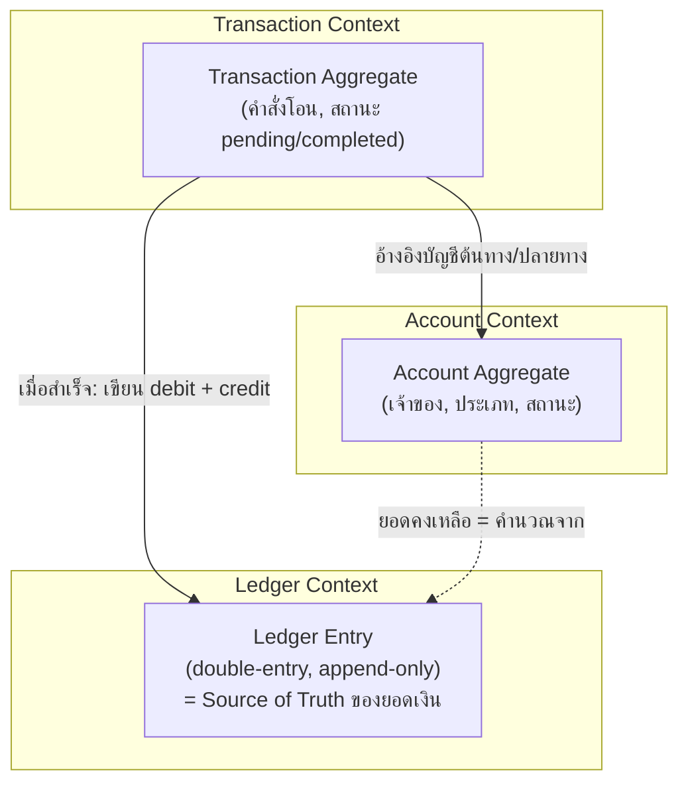

ลองนึกภาพสมุดบัญชีธนาคารแบบเก่า — เจ้าหน้าที่ธนาคารจดทุกธุรกรรมด้วยหมึกลงกระดาษ ห้ามลบ ห้ามแก้ ถ้าจดผิดต้องขีดฆ่าแล้วจดรายการแก้ไขใหม่ต่อท้าย ไม่มีการ "ย้อนกลับไปแก้ตัวเลขเดิม" เด็ดขาด เพราะสมุดบัญชีคือความจริงหนึ่งเดียวที่ทุกฝ่าย (ลูกค้า, ธนาคาร, ผู้ตรวจสอบบัญชี, ธนาคารกลาง) ต้องเชื่อถือได้ร้อยเปอร์เซ็นต์ — ถ้าสมุดบัญชีสองเล่มบอกยอดเงินไม่ตรงกันแม้แต่วินาทีเดียว ความน่าเชื่อถือทั้งระบบจะพังทันที

นี่คือหัวใจของการออกแบบ **Core Banking / Ledger System** — ระบบที่ตัดสินใจเรื่อง consistency เข้มงวดที่สุดในทั้งหลักสูตรนี้ เพราะมันคือระบบเดียวที่ "ข้อมูลผิดพลาดชั่วคราว" ไม่ใช่แค่ bug แต่คือเงินหายจริงๆ

## Requirement คร่าวๆ

- เก็บบัญชีผู้ใช้ (Account), ยอดเงินคงเหลือ (Balance), และประวัติธุรกรรม (Transaction) ทุกรายการ
- ยอดเงินคงเหลือต้อง**ถูกต้อง 100% ตลอดเวลา** — ห้ามแสดงยอดผิด แม้ระบบบางส่วนล่มอยู่
- ธุรกรรมโอนเงินระหว่างสองบัญชีต้อง**atomic** — หักบัญชีต้นทางสำเร็จแต่ไม่เข้าบัญชีปลายทางไม่ได้เด็ดขาด
- ต้อง**audit ย้อนหลังได้ทุกรายการ** (ตาม regulation ธนาคารกลาง) และห้ามแก้ไขประวัติที่บันทึกไปแล้ว

## หา Bounded Context: Account, Transaction, Ledger

จากโมดูล 15 — ระบบธนาคารมีคำที่ฟังดูคล้ายกันแต่ความหมายต่างกันมากในแต่ละ context ซึ่งเป็นตัวอย่างชัดเจนของทำไมต้องมี **ubiquitous language** แยกตาม bounded context

- **Account Context** — โฟกัสที่ "ใครเป็นเจ้าของบัญชี, ประเภทบัญชี (ออมทรัพย์/กระแสรายวัน), สถานะบัญชี (เปิด/ปิด/ระงับ)" คำว่า "Account" ในนี้เป็น aggregate root ที่ควบคุม invariant เช่น "บัญชีที่ถูกระงับห้ามทำธุรกรรมใหม่"
- **Transaction Context** — โฟกัสที่ "คำสั่งโอนเงินหนึ่งครั้ง" มี aggregate คือ **Transaction** ที่เก็บสถานะ (pending, completed, failed, reversed) และ invariant สำคัญคือ "ยอดหักจากบัญชีต้นทางต้องเท่ากับยอดที่เข้าบัญชีปลายทางเป๊ะ" — context นี้เป็นคนสั่งการเปลี่ยนแปลง แต่ไม่ใช่คนเก็บ "ความจริงสุดท้าย" ของยอดเงิน
- **Ledger Context** — นี่คือ context ที่สำคัญที่สุดและมักถูกเข้าใจผิดว่าเหมือนกับ Transaction — **Ledger** คือบันทึกการเข้า-ออกของเงินแบบ **double-entry bookkeeping** (ทุกรายการต้องมี debit และ credit เท่ากันเสมอ) เป็น**แหล่งความจริงเดียว (source of truth)** ของยอดเงินทั้งระบบ ยอด Balance ที่แสดงในแอปไม่ได้ถูกเก็บเป็นตัวเลขเดี่ยวๆ ที่แก้ทับได้ แต่คำนวณ (หรือ cache) มาจากผลรวมของ ledger entries ทั้งหมด — Ledger entry เขียนแล้ว**ห้ามแก้ไขหรือลบ** (append-only) ถ้าต้องแก้ต้องเขียนรายการใหม่หักล้าง เหมือนสมุดบัญชีกระดาษที่ขีดฆ่าแล้วจดใหม่

ความสัมพันธ์ระหว่างสาม context นี้เป็นแบบ **upstream-downstream**: Transaction Context สั่งการ (initiator) แต่ Ledger Context เป็นคนตัดสินความจริงสุดท้าย (source of truth) — Account Context อยู่คนละมุม ให้ข้อมูล metadata ของเจ้าของบัญชีแต่ไม่ได้ถือยอดเงินเอง

สังเกตว่ารูปแบบของ Ledger Context ข้างต้น — เก็บ entry แบบ append-only แล้วคำนวณ balance จากผลรวมย้อนหลัง — คือ **Event Sourcing** ในทางปฏิบัติเป๊ะๆ (เรียนละเอียดในโมดูล CQRS & Event Sourcing) ledger entry แต่ละบรรทัดคือ event หนึ่งตัว balance ที่แสดงในแอปคือ read model ที่ derive มาจาก event log ไม่ใช่ความจริงตั้งต้น — Transaction Context ทำหน้าที่เป็นฝั่ง write (รับ command สั่งโอน) ส่วน Ledger Context ทำหน้าที่เป็นทั้ง event store และ (ผ่านการคำนวณ balance) เป็น read model ไปในตัว นี่คือตัวอย่างจริงว่าทำไมธนาคารถึงมักใช้สถาปัตยกรรมแบบนี้มานานก่อนที่คำว่า Event Sourcing จะถูกตั้งชื่อขึ้นมาด้วยซ้ำ



## Trade-off ที่ต่อยอดจาก CAP Theorem

ต่อยอดจาก **CAP Theorem** ที่เรียนไปในโมดูล Consistency & CAP ของ System Design — CAP บอกว่าเมื่อเกิด network partition ระบบ distributed ต้องเลือกระหว่าง **Consistency** กับ **Availability** จะเอาทั้งคู่พร้อมกันไม่ได้

ระบบส่วนใหญ่ในธนาคาร (เช่น Notification, Analytics, บริการแสดงโปรโมชั่น) เลือก **AP (Availability over Consistency)** ได้สบายๆ — ถ้า analytics service เห็นข้อมูลเก่าไปสองสามวินาทีระหว่าง partition ไม่มีใครเดือดร้อน ระบบยังคงตอบสนองผู้ใช้ได้ต่อไป

แต่ **Ledger ต้องเลือก CP (Consistency over Availability) เท่านั้น** — ถ้าเกิด network partition ระหว่าง node ที่เก็บ ledger entry ระบบต้อง**ยอมปฏิเสธการทำธุรกรรมชั่วคราว** (unavailable) ดีกว่าเสี่ยงให้สอง node เขียน ledger entry ที่ขัดแย้งกัน เพราะผลลัพธ์ของการยอมให้ "available แต่ inconsistent" ในโดเมนนี้คือเงินอาจถูกโอนซ้ำ หรือยอดเงินสองฝั่งไม่ตรงกัน ซึ่งร้ายแรงกว่าการที่ผู้ใช้เห็นข้อความ "ระบบไม่พร้อมให้บริการชั่วคราว กรุณาลองใหม่" มาก

นี่คือเหตุผลว่าทำไม core banking มักใช้ **relational database ที่มี strong consistency (single-leader replication, synchronous commit)** แทนที่จะใช้ NoSQL แบบ eventual consistency ที่นิยมใน service อื่นของบริษัทเดียวกัน — เพราะ**quality attribute ที่ให้น้ำหนักสูงสุดต่างกันตามโดเมน** ไม่ใช่ทุก service ในองค์กรเดียวกันต้องเลือกจุดเดียวกันบน CAP spectrum

```demo
component: ComparisonDiagram
props: {"left":{"title":"ทำไม Ledger เลือก Strong Consistency (CP)","points":["ยอดเงินผิดแม้ชั่วคราวก็ยอมรับไม่ได้ — เงินหายหรือโอนซ้ำคือความเสียหายจริง ไม่ใช่แค่ UX แย่","ต้อง audit ย้อนหลังได้แม่นยำ 100% ตาม regulation ธนาคารกลาง","Double-entry ต้อง balance เป๊ะทุกรายการ ไม่มีพื้นที่ให้ 'ค่อยไปตามให้ตรงทีหลัง'","ยอมให้ระบบ unavailable ชั่วคราวระหว่าง partition ดีกว่าเสี่ยง inconsistent"]},"right":{"title":"ทำไม Service อื่นในธนาคารเลือก Eventual Consistency ได้","points":["Notification: แจ้งเตือนช้าไปไม่กี่วินาทีไม่กระทบความถูกต้องของเงิน","Analytics/Dashboard: เห็นข้อมูลย้อนหลังไม่กี่วินาทีไม่ทำให้ตัดสินใจผิดพลาดร้ายแรง","Promotion/Recommendation: แสดงข้อเสนอไม่อัปเดตทันทีไม่กระทบธุรกรรมจริง","แลกกับ availability สูงกว่า ตอบสนองผู้ใช้ได้แม้บาง node หลุดจากเครือข่ายชั่วคราว"]},"note":"หลักการ: ยิ่งใกล้ 'เงินจริง' มากเท่าไหร่ ยิ่งต้องเอียงไปทาง C (Consistency) มากเท่านั้น ยิ่งไกลจากเงินจริง (metadata, analytics, notification) ยิ่งเอียงไปทาง A (Availability) ได้อย่างปลอดภัย"}
```

## ลองใช้ ATAM Scenario ตรวจสอบการตัดสินใจ

จากโมดูล 16 เรื่อง ATAM-style reasoning — วิธีตรวจสอบว่าการตัดสินใจเรื่อง architecture คุ้มค่าจริงไหม คือลองเขียน **scenario** สั้นๆ ในรูปแบบ stimulus → response แล้วดูว่า architecture ที่เลือกไว้ตอบโจทย์หรือสร้างความเสี่ยงใหม่

**Scenario:** "Data center หลักที่เก็บ Ledger ขาดการเชื่อมต่อกับ data center สำรองนาน 90 วินาที ระหว่างที่ลูกค้ากำลังโอนเงินอยู่ 200 รายการพร้อมกัน"

- **ถ้าเลือก CP (ตามที่ตัดสินใจไว้):** ระบบปฏิเสธธุรกรรมใหม่ทั้งหมดในช่วง 90 วินาทีนั้น ลูกค้าเห็นข้อความ "ลองใหม่อีกครั้ง" — เสีย availability ชั่วคราว แต่ธุรกรรมที่ผ่านไปแล้วก่อนหน้าถูกต้อง 100% ไม่มีเงินหายหรือซ้ำ กู้คืนกลับมาปกติทันทีที่เชื่อมต่อกลับมา
- **ถ้าเลือก AP (สมมติเปลี่ยนใจ):** ระบบยังรับธุรกรรมต่อได้ที่ทั้งสอง data center แต่เสี่ยงที่ทั้งสองฝั่งจะประมวลผลธุรกรรมที่ขัดแย้งกัน (เช่น หักบัญชีเดียวกันสองครั้งจากสอง node ที่ไม่รู้จักกันชั่วคราว) ต้องมี process **reconciliation** ภายหลังเพื่อไล่แก้ ซึ่งมีต้นทุนด้าน operation และความเสี่ยงด้าน regulation สูงกว่ามาก

การเขียน scenario แบบนี้ทำให้เห็นชัดว่าการเลือก CP ไม่ใช่แค่ทฤษฎีจาก CAP theorem แต่ตอบโจทย์ธุรกิจจริงของธนาคาร ที่ยอมรับ downtime สั้นๆ ได้ง่ายกว่ายอมรับข้อมูลเงินที่ผิดพลาด — เป็นการยืนยัน (validate) การตัดสินใจด้วยสถานการณ์รูปธรรม ไม่ใช่แค่หลักการลอยๆ

## ตารางเปรียบเทียบ Trade-off

| ประเด็น | Ledger (CP) | Service อื่นในธนาคาร เช่น Notification/Analytics (AP) |
|---|---|---|
| จุดยืนบน CAP | เลือก Consistency เหนือ Availability | เลือก Availability เหนือ Consistency |
| พฤติกรรมช่วง network partition | ปฏิเสธ request ชั่วคราว ดีกว่าเสี่ยงข้อมูลขัดแย้ง | ยังคงตอบสนอง แม้ข้อมูลอาจ stale ชั่วคราว |
| ประเภท database ที่เหมาะ | RDBMS, synchronous replication, single leader | NoSQL/cache แบบ eventual consistency ก็พอ |
| ผลกระทบถ้าเลือกผิด | เงินหาย/โอนซ้ำ — เสียหายจริงและผิด regulation | ผู้ใช้เห็นข้อมูลไม่อัปเดตทันที — รำคาญแต่ไม่เสียหายจริง |
| ความสำคัญของ audit trail | สูงสุด ต้อง append-only ห้ามแก้ย้อนหลัง | ต่ำกว่ามาก มักไม่ต้อง audit ระดับเดียวกัน |

## ADR ตัวอย่าง

> **Title:** เลือก Strong Consistency (CP) สำหรับ Ledger Service แม้ต้องแลกกับ Availability
> **Status:** Accepted
> **Context:** ระบบ core banking ต้องรับประกันว่ายอดเงินคงเหลือถูกต้อง 100% ตลอดเวลา ธุรกรรมโอนเงินต้อง atomic และประวัติ ledger ต้อง audit ย้อนหลังได้ตาม regulation ธนาคารกลาง ขณะที่ service อื่นในบริษัท (Notification, Analytics) เลือกใช้ eventual consistency เพื่อความพร้อมใช้งานสูงมาแล้ว
> **Decision:** ให้ Ledger Context ใช้ RDBMS แบบ synchronous replication (single leader) และยอมให้ระบบปฏิเสธ request ชั่วคราว (unavailable) เมื่อเกิด network partition แทนที่จะเสี่ยงให้ node ต่าง ๆ เขียน ledger entry ที่ขัดแย้งกัน — เลือกฝั่ง CP บน CAP spectrum อย่างชัดเจน ต่างจาก service อื่นในองค์กรเดียวกันที่เลือกฝั่ง AP
> **Consequences:** ยอดเงินและ audit trail ถูกต้องแม่นยำเสมอ ตรงตาม regulation แต่ต้องยอมรับว่าระบบอาจ downtime สั้นๆ ระหว่าง partition หรือ failover ซึ่งต้องสื่อสารกับผู้ใช้อย่างชัดเจน (เช่น ข้อความ "ระบบไม่พร้อมชั่วคราว") แทนที่จะยอมให้ธุรกรรมผ่านแบบเสี่ยงข้อมูลไม่ตรงกัน
