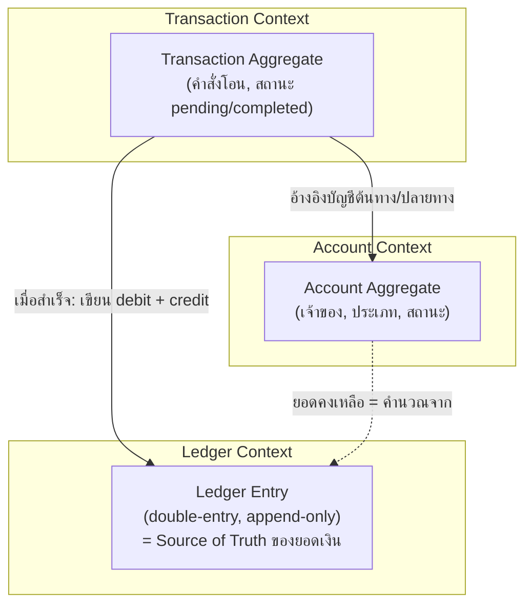
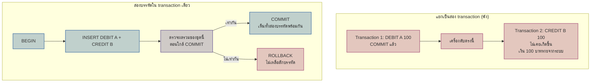
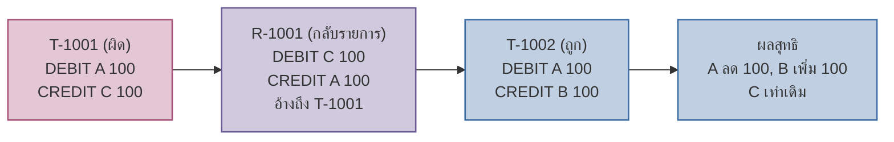
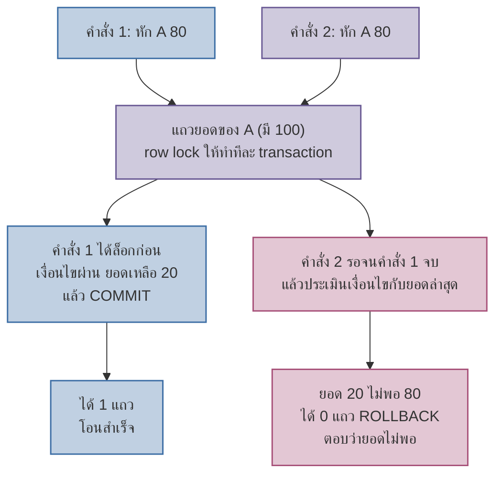
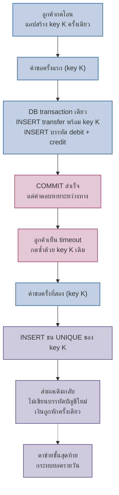

ลองนึกภาพสมุดบัญชีธนาคารแบบเก่า — เจ้าหน้าที่ธนาคารจดทุกธุรกรรมด้วยหมึกลงกระดาษ ห้ามลบ ห้ามแก้ ถ้าจดผิดต้องขีดฆ่าแล้วจดรายการแก้ไขใหม่ต่อท้าย ไม่มีการ "ย้อนกลับไปแก้ตัวเลขเดิม" เด็ดขาด เพราะสมุดบัญชีคือความจริงหนึ่งเดียวที่ทุกฝ่าย (ลูกค้า, ธนาคาร, ผู้ตรวจสอบบัญชี, ธนาคารกลาง) ต้องเชื่อถือได้ร้อยเปอร์เซ็นต์ — ถ้าสมุดบัญชีสองเล่มบอกยอดเงินไม่ตรงกันแม้แต่วินาทีเดียว ความน่าเชื่อถือทั้งระบบจะพังทันที

นี่คือหัวใจของการออกแบบ <mark class="hl-term">**Core Banking / Ledger System**</mark> — ระบบที่ตัดสินใจเรื่อง consistency เข้มงวดที่สุดในทั้งหลักสูตรนี้ เพราะมันคือระบบเดียวที่ "ข้อมูลผิดพลาดชั่วคราว" ไม่ใช่แค่ bug แต่คือเงินหายจริงๆ

## Requirement คร่าวๆ

- เก็บบัญชีผู้ใช้ (Account), ยอดเงินคงเหลือ (Balance), และประวัติธุรกรรม (Transaction) ทุกรายการ
- ยอดเงินคงเหลือต้อง**ถูกต้อง 100% ตลอดเวลา** — ห้ามแสดงยอดผิด แม้ระบบบางส่วนล่มอยู่
- ธุรกรรมโอนเงินระหว่างสองบัญชีต้อง**atomic** — หักบัญชีต้นทางสำเร็จแต่ไม่เข้าบัญชีปลายทางไม่ได้เด็ดขาด
- ต้อง**audit ย้อนหลังได้ทุกรายการ** (ตาม regulation ธนาคารกลาง) และห้ามแก้ไขประวัติที่บันทึกไปแล้ว

## หา Bounded Context: Account, Transaction, Ledger

จากโมดูล 15 — ระบบธนาคารมีคำที่ฟังดูคล้ายกันแต่ความหมายต่างกันมากในแต่ละ context ซึ่งเป็นตัวอย่างชัดเจนของทำไมต้องมี **ubiquitous language** แยกตาม bounded context

- **Account Context** — โฟกัสที่ "ใครเป็นเจ้าของบัญชี, ประเภทบัญชี (ออมทรัพย์/กระแสรายวัน), สถานะบัญชี (เปิด/ปิด/ระงับ)" คำว่า "Account" ในนี้เป็น aggregate root ที่ควบคุม invariant เช่น "บัญชีที่ถูกระงับห้ามทำธุรกรรมใหม่"
- **Transaction Context** — โฟกัสที่ "คำสั่งโอนเงินหนึ่งครั้ง" มี aggregate คือ **Transaction** ที่เก็บสถานะ (pending, completed, failed, reversed) และ invariant สำคัญคือ "ยอดหักจากบัญชีต้นทางต้องเท่ากับยอดที่เข้าบัญชีปลายทางเป๊ะ" — context นี้เป็นคนสั่งการเปลี่ยนแปลง แต่ไม่ใช่คนเก็บ "ความจริงสุดท้าย" ของยอดเงิน
- **Ledger Context** — นี่คือ context ที่สำคัญที่สุดและมักถูกเข้าใจผิดว่าเหมือนกับ Transaction — **Ledger** คือบันทึกการเข้า-ออกของเงินแบบ **double-entry bookkeeping** (ทุกรายการต้องมี debit และ credit เท่ากันเสมอ) เป็น**แหล่งความจริงเดียว (source of truth)** ของยอดเงินทั้งระบบ ยอด Balance ที่แสดงในแอปไม่ได้ถูกเก็บเป็นตัวเลขเดี่ยวๆ ที่แก้ทับได้ แต่คำนวณ (หรือ cache) มาจากผลรวมของ ledger entries ทั้งหมด — Ledger entry เขียนแล้ว**ห้ามแก้ไขหรือลบ** (append-only) ถ้าต้องแก้ต้องเขียนรายการใหม่หักล้าง เหมือนสมุดบัญชีกระดาษที่ขีดฆ่าแล้วจดใหม่

ความสัมพันธ์ระหว่างสาม context นี้เป็นแบบ **upstream-downstream**: Transaction Context สั่งการ (initiator) แต่ Ledger Context เป็นคนตัดสินความจริงสุดท้าย (source of truth) — Account Context อยู่คนละมุม ให้ข้อมูล metadata ของเจ้าของบัญชีแต่ไม่ได้ถือยอดเงินเอง

สังเกตว่ารูปแบบของ Ledger Context ข้างต้น — เก็บ entry แบบ append-only แล้วคำนวณ balance จากผลรวมย้อนหลัง — คือ **Event Sourcing** ในทางปฏิบัติเป๊ะๆ (เรียนละเอียดในโมดูล CQRS & Event Sourcing) ledger entry แต่ละบรรทัดคือ event หนึ่งตัว balance ที่แสดงในแอปคือ read model ที่ derive มาจาก event log ไม่ใช่ความจริงตั้งต้น — Transaction Context ทำหน้าที่เป็นฝั่ง write (รับ command สั่งโอน) ส่วน Ledger Context ทำหน้าที่เป็นทั้ง event store และ (ผ่านการคำนวณ balance) เป็น read model ไปในตัว นี่คือตัวอย่างจริงว่าทำไมธนาคารถึงมักใช้สถาปัตยกรรมแบบนี้มานานก่อนที่คำว่า Event Sourcing จะถูกตั้งชื่อขึ้นมาด้วยซ้ำ


```mermaid
flowchart TB
    subgraph Account["Account Context"]
        A["Account Aggregate\n(เจ้าของ, ประเภท, สถานะ)"]
    end
    subgraph Transaction["Transaction Context"]
        T["Transaction Aggregate\n(คำสั่งโอน, สถานะ pending/completed)"]
    end
    subgraph Ledger["Ledger Context"]
        L["Ledger Entry\n(double-entry, append-only)\n= Source of Truth ของยอดเงิน"]
    end

    T -->|"อ้างอิงบัญชีต้นทาง/ปลายทาง"| A
    T -->|"เมื่อสำเร็จ: เขียน debit + credit"| L
    A -.->|"ยอดคงเหลือ = คำนวณจาก"| L
```

## Trade-off ที่ต่อยอดจาก CAP Theorem

ต่อยอดจาก <mark class="hl-term">**CAP Theorem**</mark> ที่เรียนไปในโมดูล Consistency & CAP ของ System Design — CAP บอกว่าเมื่อเกิด network partition ระบบ distributed ต้องเลือกระหว่าง **Consistency** กับ **Availability** จะเอาทั้งคู่พร้อมกันไม่ได้

ระบบส่วนใหญ่ในธนาคาร (เช่น Notification, Analytics, บริการแสดงโปรโมชั่น) เลือก **AP (Availability over Consistency)** ได้สบายๆ — ถ้า analytics service เห็นข้อมูลเก่าไปสองสามวินาทีระหว่าง partition ไม่มีใครเดือดร้อน ระบบยังคงตอบสนองผู้ใช้ได้ต่อไป

แต่ **Ledger ต้องเลือก CP (Consistency over Availability) เท่านั้น** — ถ้าเกิด network partition ระหว่าง node ที่เก็บ ledger entry ระบบต้อง**ยอมปฏิเสธการทำธุรกรรมชั่วคราว** (unavailable) ดีกว่าเสี่ยงให้สอง node เขียน ledger entry ที่ขัดแย้งกัน เพราะผลลัพธ์ของการยอมให้ "available แต่ inconsistent" ในโดเมนนี้คือ<mark class="hl-warning">เงินอาจถูกโอนซ้ำ หรือยอดเงินสองฝั่งไม่ตรงกัน</mark> ซึ่งร้ายแรงกว่าการที่ผู้ใช้เห็นข้อความ "ระบบไม่พร้อมให้บริการชั่วคราว กรุณาลองใหม่" มาก

นี่คือเหตุผลว่าทำไม core banking มักใช้ **relational database ที่มี strong consistency (single-leader replication, synchronous commit)** แทนที่จะใช้ NoSQL แบบ eventual consistency ที่นิยมใน service อื่นของบริษัทเดียวกัน — <mark class="hl-insight">เพราะ**quality attribute ที่ให้น้ำหนักสูงสุดต่างกันตามโดเมน** ไม่ใช่ทุก service ในองค์กรเดียวกันต้องเลือกจุดเดียวกันบน CAP spectrum</mark>

```demo
component: ComparisonDiagram
props: {"left":{"title":"ทำไม Ledger เลือก Strong Consistency (CP)","points":["ยอดเงินผิดแม้ชั่วคราวก็ยอมรับไม่ได้ — เงินหายหรือโอนซ้ำคือความเสียหายจริง ไม่ใช่แค่ UX แย่","ต้อง audit ย้อนหลังได้แม่นยำ 100% ตาม regulation ธนาคารกลาง","Double-entry ต้อง balance เป๊ะทุกรายการ ไม่มีพื้นที่ให้ 'ค่อยไปตามให้ตรงทีหลัง'","ยอมให้ระบบ unavailable ชั่วคราวระหว่าง partition ดีกว่าเสี่ยง inconsistent"]},"right":{"title":"ทำไม Service อื่นในธนาคารเลือก Eventual Consistency ได้","points":["Notification: แจ้งเตือนช้าไปไม่กี่วินาทีไม่กระทบความถูกต้องของเงิน","Analytics/Dashboard: เห็นข้อมูลย้อนหลังไม่กี่วินาทีไม่ทำให้ตัดสินใจผิดพลาดร้ายแรง","Promotion/Recommendation: แสดงข้อเสนอไม่อัปเดตทันทีไม่กระทบธุรกรรมจริง","แลกกับ availability สูงกว่า ตอบสนองผู้ใช้ได้แม้บาง node หลุดจากเครือข่ายชั่วคราว"]},"note":"หลักการ: ยิ่งใกล้ 'เงินจริง' มากเท่าไหร่ ยิ่งต้องเอียงไปทาง C (Consistency) มากเท่านั้น ยิ่งไกลจากเงินจริง (metadata, analytics, notification) ยิ่งเอียงไปทาง A (Availability) ได้อย่างปลอดภัย"}
```

## ลองใช้ ATAM Scenario ตรวจสอบการตัดสินใจ

จากโมดูล 16 เรื่อง ATAM-style reasoning — วิธีตรวจสอบว่าการตัดสินใจเรื่อง architecture คุ้มค่าจริงไหม คือลองเขียน **scenario** สั้นๆ ในรูปแบบ stimulus → response แล้วดูว่า architecture ที่เลือกไว้ตอบโจทย์หรือสร้างความเสี่ยงใหม่

**Scenario:** "Data center หลักที่เก็บ Ledger ขาดการเชื่อมต่อกับ data center สำรองนาน 90 วินาที ระหว่างที่ลูกค้ากำลังโอนเงินอยู่ 200 รายการพร้อมกัน"

- **ถ้าเลือก CP (ตามที่ตัดสินใจไว้):** ระบบปฏิเสธธุรกรรมใหม่ทั้งหมดในช่วง 90 วินาทีนั้น ลูกค้าเห็นข้อความ "ลองใหม่อีกครั้ง" — เสีย availability ชั่วคราว แต่ธุรกรรมที่ผ่านไปแล้วก่อนหน้าถูกต้อง 100% ไม่มีเงินหายหรือซ้ำ กู้คืนกลับมาปกติทันทีที่เชื่อมต่อกลับมา
- **ถ้าเลือก AP (สมมติเปลี่ยนใจ):** ระบบยังรับธุรกรรมต่อได้ที่ทั้งสอง data center แต่เสี่ยงที่ทั้งสองฝั่งจะประมวลผลธุรกรรมที่ขัดแย้งกัน (เช่น หักบัญชีเดียวกันสองครั้งจากสอง node ที่ไม่รู้จักกันชั่วคราว) ต้องมี process **reconciliation** ภายหลังเพื่อไล่แก้ ซึ่งมีต้นทุนด้าน operation และความเสี่ยงด้าน regulation สูงกว่ามาก

การเขียน scenario แบบนี้ทำให้เห็นชัดว่าการเลือก CP ไม่ใช่แค่ทฤษฎีจาก CAP theorem แต่ตอบโจทย์ธุรกิจจริงของธนาคาร ที่ยอมรับ downtime สั้นๆ ได้ง่ายกว่ายอมรับข้อมูลเงินที่ผิดพลาด — เป็นการยืนยัน (validate) การตัดสินใจด้วยสถานการณ์รูปธรรม ไม่ใช่แค่หลักการลอยๆ

## ตารางเปรียบเทียบ Trade-off

| ประเด็น | Ledger (CP) | Service อื่นในธนาคาร เช่น Notification/Analytics (AP) |
|---|---|---|
| จุดยืนบน CAP | เลือก Consistency เหนือ Availability | เลือก Availability เหนือ Consistency |
| พฤติกรรมช่วง network partition | ปฏิเสธ request ชั่วคราว ดีกว่าเสี่ยงข้อมูลขัดแย้ง | ยังคงตอบสนอง แม้ข้อมูลอาจ stale ชั่วคราว |
| ประเภท database ที่เหมาะ | RDBMS, synchronous replication, single leader | NoSQL/cache แบบ eventual consistency ก็พอ |
| ผลกระทบถ้าเลือกผิด | เงินหาย/โอนซ้ำ — เสียหายจริงและผิด regulation | ผู้ใช้เห็นข้อมูลไม่อัปเดตทันที — รำคาญแต่ไม่เสียหายจริง |
| ความสำคัญของ audit trail | สูงสุด ต้อง append-only ห้ามแก้ย้อนหลัง | ต่ำกว่ามาก มักไม่ต้อง audit ระดับเดียวกัน |

## คำถามเจาะลึกที่มักถูกถามต่อ

พออธิบายว่า Ledger เป็น double-entry, append-only และเลือก CP จบ คนสัมภาษณ์หรือเพื่อนร่วมทีมมักถามต่อว่า "แล้วข้างในมันบังคับกติกาพวกนี้จริงๆ ยังไง ถ้าพังจะเกิดอะไรขึ้น" เพราะในระบบเงิน คำว่า "ควรจะถูกต้อง" ไม่พอ ต้องชี้ได้ว่ากลไกไหนเป็นคนรับประกัน สี่คำถามด้านล่างคือคำถามต่อยอดที่เจอบ่อยที่สุด แต่ละข้อไล่ให้ครบว่า ใช้ความรู้อะไรจากโมดูลไหน แก้ปัญหายังไง มีขั้นตอนอะไรบ้าง และข้างใต้จริงๆ มีอะไรทำงานอยู่

### Q1: โอนเงิน 100 บาทจาก A ไป B ทำไมต้องเขียนสองบรรทัด แล้วใครรับประกันว่า debit กับ credit เท่ากันเสมอ

**ใช้ความรู้อะไร:** โมดูล 15 (Aggregate — Transaction Aggregate ถือ invariant "ยอดหักต้องเท่ายอดเข้า" และต้องบันทึกทั้งก้อนใน transaction เดียว) บวก double-entry bookkeeping ที่ Ledger Context ใช้ตามด้านบน บวก ACID (Atomicity, Consistency, Isolation, Durability — คุณสมบัติของ database transaction) ที่เรียนในโมดูล Database ของ System Design

**นึกภาพก่อน:** ลองนึกถึงการย้ายของระหว่างสองลิ้นชัก ถ้าจดแค่ "ลิ้นชัก A หยิบออก 100" โดยไม่จดว่าไปวางที่ไหน วันหนึ่งตัวเลขไม่ตรงกับของจริงเราก็ไม่มีทางรู้ว่าของหายไปทางไหน บัญชีคู่แก้ด้วยกติกาง่ายๆ ทุกครั้งที่เงินออกจากที่หนึ่งต้องมีอีกบรรทัดบอกว่าเงินเข้าที่ไหน และสองบรรทัดนี้ต้องรวมกันได้ศูนย์พอดี ถ้าขาดไปข้างเดียว ผลรวมจะไม่เป็นศูนย์ทันที <mark class="hl-insight">เราจึงจับความผิดพลาดได้ด้วยการบวกเลขอย่างเดียว โดยไม่ต้องรู้ก่อนว่าบั๊กอยู่ตรงไหน</mark>

**แก้ปัญหายังไง:**

1. Transaction Aggregate ตรวจกติกาธุรกิจก่อน เช่น บัญชีเปิดอยู่ไหม ถูกระงับไหม
2. สร้างบรรทัดบัญชีเป็น**ชุดเดียว**ผูกด้วย `transfer_id` เดียวกัน คือ DEBIT ที่บัญชี A และ CREDIT ที่บัญชี B ด้วยจำนวนเงินเท่ากัน
3. เขียนทั้งชุดใน database transaction เดียว
4. เก็บจำนวนเงินเป็นจำนวนเต็มของหน่วยย่อยที่สุด (สตางค์) ไม่เก็บเป็นทศนิยม

```sql
BEGIN;
INSERT INTO ledger_entry (transfer_id, account_id, direction, amount_satang)
VALUES ('T-1001', 'A', 'DEBIT',  10000),
       ('T-1001', 'B', 'CREDIT', 10000);
COMMIT;
```

หมายเหตุเรื่องทิศทาง: ในสมุดของธนาคาร เงินฝากของลูกค้าคือหนี้สินที่ธนาคารมีต่อลูกค้า จึงกลับด้านกับที่เราคุ้นตอนมองสมุดบัญชีของตัวเอง คือ DEBIT ทำให้ยอดของลูกค้า**ลด** และ CREDIT ทำให้ยอด**เพิ่ม** ตรงกับที่ตัวอย่างข้างบนหัก A เข้า B

**ข้างใต้ทำงานยังไง:** มีสามชั้นป้องกันทำงานซ้อนกัน

- **ชั้น application** — Transaction Aggregate สร้างทั้งสองบรรทัดจากตัวแปร `amount` ตัวเดียว และปฏิเสธถ้าสองข้างไม่เท่ากัน เป็นด่านแรกที่เร็วและให้ error ชัดเจน
- **ชั้น database** — CHECK constraint ตรวจได้ทีละแถวเท่านั้น จึงตรวจ "ผลรวมทั้งชุดเป็นศูนย์" ไม่ได้ ต้องใช้กลไกที่เห็นทั้งชุด เช่นใน PostgreSQL มี constraint trigger แบบ deferred ที่ถูกเรียกตอนใกล้ COMMIT รวมยอดตาม `transfer_id` ถ้า debit ไม่เท่า credit ก็สั่ง error ทำให้ทั้ง transaction ถูก rollback
- **ชั้นตรวจย้อนหลัง** — งานตรวจเป็นระยะรัน query เช่น รวมยอดแยกตาม `transfer_id` แล้วเอาเฉพาะชุดที่ผลรวมไม่เป็นศูนย์ ผลลัพธ์ต้องว่างเสมอ ถ้ามีแถวออกมาแปลว่ามีบั๊กหรือมีคนแตะข้อมูลนอกกระบวนการปกติ

ส่วนที่ว่า "เขียนสองบรรทัดพร้อมกัน" database ทำได้เพราะกลไก <mark class="hl-term">**write-ahead log (WAL — บันทึกที่ต้องเขียนก่อนเสมอ)**</mark> ทุกการเปลี่ยนแปลงถูกจดลง log ก่อนจะแตะข้อมูลจริง ตามด้วย commit record เมื่อ commit record ลง disk แล้วเท่านั้น transaction ถึงนับว่าสำเร็จ ถ้าเครื่องดับก่อนถึงจุดนั้น ตอน restart database เห็นว่าไม่มี commit record จึงทิ้งงานครึ่งๆ กลางๆ ทั้งหมด ระหว่างที่ transaction ยังไม่ commit คนอื่นก็มองไม่เห็นบรรทัดใหม่ด้วย


```mermaid
flowchart TB
    subgraph Bad["แยกเป็นสอง transaction (พัง)"]
        B1["Transaction 1: DEBIT A 100<br/>COMMIT แล้ว"] --> B2["เครื่องดับตรงนี้"]
        B2 --> B3["Transaction 2: CREDIT B 100<br/>ไม่เคยเกิดขึ้น<br/>เงิน 100 บาทหายจากระบบ"]
    end
    subgraph Good["สองบรรทัดใน transaction เดียว"]
        G1["BEGIN"] --> G2["INSERT DEBIT A + CREDIT B"]
        G2 --> G3["ตรวจผลรวมของชุดนี้<br/>ตอนใกล้ COMMIT"]
        G3 -->|"เท่ากัน"| G4["COMMIT<br/>เห็นทั้งสองบรรทัดพร้อมกัน"]
        G3 -->|"ไม่เท่ากัน"| G5["ROLLBACK<br/>ไม่เหลือสักบรรทัด"]
    end

    classDef bad fill:#a8527a52,stroke:#a8527a,stroke-width:1.5px
    classDef good fill:#3d6ea552,stroke:#3d6ea5,stroke-width:1.5px
    classDef check fill:#6b5b9552,stroke:#6b5b95,stroke-width:1.5px
    class B1,B2,B3,G5 bad
    class G1,G2,G4 good
    class G3 check
```

```demo
component: JourneyDiagram
props: {"nodes":[{"icon":"person","label":"ลูกค้า A"},{"icon":"building","label":"Transaction Service"},{"icon":"notebook","label":"Ledger DB (มี WAL)"}],"travelerIcon":"envelope","steps":[{"activeNode":0,"caption":"A สั่งโอน 100 บาทให้ B (คือ 10,000 สตางค์)"},{"activeNode":1,"caption":"Transaction Service ตรวจกติกาธุรกิจ แล้วสร้างบรรทัด DEBIT A กับ CREDIT B จากตัวแปร amount ตัวเดียวกัน"},{"activeNode":2,"caption":"Ledger DB รับสองบรรทัดใน transaction เดียว จดลง WAL ก่อน ระหว่างนี้คนอื่นยังมองไม่เห็นบรรทัดใหม่"},{"activeNode":2,"caption":"ใกล้ COMMIT trigger รวมยอดของ transfer_id นี้ ถ้า debit เท่ากับ credit จึงผ่านไปต่อได้"},{"activeNode":2,"caption":"commit record ลง disk แล้ว จากตอนนี้สองบรรทัดมีอยู่พร้อมกันอย่างถาวร"},{"activeNode":1,"caption":"Transaction Service ได้รับผลสำเร็จ แล้วแจ้งกลับลูกค้า"},{"activeNode":2,"caption":"ถ้าเครื่องดับก่อนมี commit record: restart แล้วสองบรรทัดหายไปพร้อมกัน ไม่มีกรณีที่ A ถูกหักแต่ B ไม่ได้รับ"}]}
```

**ถ้าพังหรือมีข้อควรระวังอะไร:**

- <mark class="hl-warning">ถ้า debit กับ credit ถูกเขียนคนละ transaction (เช่นเรียกสอง service ทีละครั้ง) จะมีช่วงเวลาที่เงินหายไปจากระบบ</mark> และถ้าระบบล้มตรงช่วงนั้น ก็ไม่มีใครรู้ว่าต้องเก็บกวาดอะไร จึงต้องเขียนทั้งชุดใน database เดียวกันเสมอ
- **โอนข้ามธนาคาร** — ปลายทางไม่ได้อยู่ใน database ของเรา จึงไม่มี transaction เดียวที่คลุมสองฝั่งได้ (ดู Saga ในโมดูล Microservices & API Design ของ System Design) ทางที่ใช้กันคือบันทึกฝั่งเราให้สมดุลผ่าน **บัญชีพัก (clearing account)** ก่อน เช่น DEBIT A แล้ว CREDIT บัญชีพักรอเคลียร์ พอได้รับการยืนยันจากอีกฝั่งค่อยเคลียร์บัญชีพักนั้น ทุกขั้นจึงยัง balance ในตัวเอง
- **หลายสกุลเงิน** ต้องตรวจให้ balance แยกรายสกุลเงิน ไม่ใช่รวมข้ามสกุล
- **ห้ามเก็บเงินเป็นทศนิยม (floating point)** เพราะเลขทศนิยมบางค่า เช่น 0.1 แทนค่าได้ไม่ตรงเป๊ะ พอบวกสะสมหลายล้านรายการจะเพี้ยนทีละนิด จึงเก็บเป็นจำนวนเต็มของสตางค์

### Q2: ถ้าห้าม UPDATE และ DELETE ledger แล้วโอนผิดบัญชีไปแล้วจะแก้ยังไง และ "ห้ามแก้" ถูกบังคับด้วยอะไรกันแน่

**ใช้ความรู้อะไร:** โมดูล 19 (Event Sourcing — event ที่บันทึกแล้วคืออดีตที่เปลี่ยนไม่ได้ ถ้าผิดก็เขียน event ชดเชยต่อท้าย เหมือนหลักคิดในบท "ขั้นสูง: Event Versioning & Snapshotting เมื่อ Event Store โตมาก" ที่ไม่แตะข้อมูลเดิมแม้แต่ byte เดียว) บวกโมดูล 15 (Aggregate — **สถานะ**ของ Transaction เปลี่ยนเป็น reversed ได้ แต่ **บรรทัดใน Ledger** แก้ไม่ได้ สองที่นี้เก็บคนละแบบ) บวกโมดูล 30 (Least Privilege — ให้สิทธิ์เท่าที่จำเป็นเท่านั้น)

**นึกภาพก่อน:** สมุดบัญชีหมึกที่ห้ามใช้ยางลบ ถ้าจดผิดก็ปล่อยบรรทัดผิดไว้ จดบรรทัดกลับด้านให้หักล้างพอดีพร้อมเลขอ้างถึงบรรทัดเดิม แล้วจดบรรทัดที่ถูกต่อท้าย ผู้ตรวจสอบเปิดสมุดแล้วเห็นครบว่าอะไรผิด ใครแก้ เมื่อไหร่ ต่างจากการลบแล้วเขียนทับที่ไม่เหลือร่องรอยอะไรเลย

**แก้ปัญหายังไง:** สมมติ A ตั้งใจโอน 100 บาทให้ B แต่พลาดโอนไปบัญชี C ขั้นตอนแก้ด้วย <mark class="hl-term">**reversing entry (รายการกลับรายการ)**</mark> คือ

1. `T-1001` (ผิด): DEBIT A 100 / CREDIT C 100 — อยู่ในสมุดแล้ว ไม่แตะ
2. `R-1001` (กลับรายการ): DEBIT C 100 / CREDIT A 100 บันทึกคอลัมน์ `reverses_transfer_id = T-1001` พร้อมเหตุผลและผู้อนุมัติ
3. `T-1002` (ถูก): DEBIT A 100 / CREDIT B 100

ผลสุทธิคือ A ลด 100, B เพิ่ม 100, C เท่าเดิม ตรงกับที่ควรเป็น <mark class="hl-insight">ไม่มีบรรทัดไหนถูกแก้เลย การ "แก้" คือการเพิ่มข้อเท็จจริงใหม่เข้าไปว่ามีคนพบว่ารายการนั้นผิดและกลับรายการแล้ว ไม่ใช่การเขียนอดีตใหม่</mark> และเพราะบรรทัดกลับรายการก็เป็นรายการ balanced ธรรมดา มันจึงต้องผ่านการตรวจแบบเดียวกับที่เล่าใน Q1 ทุกอย่าง


```mermaid
flowchart LR
    T1["T-1001 (ผิด)<br/>DEBIT A 100<br/>CREDIT C 100"] --> R1["R-1001 (กลับรายการ)<br/>DEBIT C 100<br/>CREDIT A 100<br/>อ้างถึง T-1001"]
    R1 --> T2["T-1002 (ถูก)<br/>DEBIT A 100<br/>CREDIT B 100"]
    T2 --> N["ผลสุทธิ<br/>A ลด 100, B เพิ่ม 100<br/>C เท่าเดิม"]

    classDef wrong fill:#a8527a52,stroke:#a8527a,stroke-width:1.5px
    classDef fix fill:#6b5b9552,stroke:#6b5b95,stroke-width:1.5px
    classDef right fill:#3d6ea552,stroke:#3d6ea5,stroke-width:1.5px
    class T1 wrong
    class R1 fix
    class T2,N right
```

```demo
component: ComparisonDiagram
props: {"left":{"title":"แก้ด้วย UPDATE / DELETE (ที่ห้ามทำ)","points":["ไม่เหลือหลักฐานว่าเคยผิดและผิดอะไร ผู้ตรวจสอบย้อนดูไม่ได้","ยอดในอดีตที่เคยแสดงหรือเคยรายงานไปแล้วเปลี่ยนไปเงียบๆ รายงานเก่ากับข้อมูลจริงไม่ตรงกัน","ถ้าคนหรือโค้ดแก้พลาด ก็ไม่มีทางรู้ว่าแก้อะไรไปบ้าง","ผลรวม debit กับ credit อาจเสียสมดุลระหว่างแก้"]},"right":{"title":"กลับรายการด้วยบรรทัดใหม่ (ที่ใช้จริง)","points":["บรรทัดผิดยังอยู่ พร้อมบรรทัดกลับรายการที่อ้างถึงมัน เห็นครบว่าเกิดอะไรขึ้น","ยอด ณ เวลาใดในอดีตยังคำนวณซ้ำได้ผลเหมือนเดิมทุกครั้ง","บรรทัดกลับรายการเป็นรายการ balanced ธรรมดา ผ่านการตรวจชุดเดียวกับรายการอื่น","แลกกับสมุดที่ยาวขึ้นและต้องมีกระบวนการอนุมัติการกลับรายการ"]},"note":"หลักจำ: ในสมุดบัญชี ความผิดพลาดก็เป็นข้อเท็จจริงที่ต้องเก็บไว้ สิ่งที่เพิ่มเข้ามาคือข้อเท็จจริงใหม่ว่าได้แก้แล้ว ไม่ใช่การเขียนอดีตใหม่"}
```

**ข้างใต้ทำงานยังไง:** คำว่า "ห้ามแก้" ไม่ใช่แค่ธรรมเนียมของทีม แต่ถูกบังคับเป็นชั้นๆ ที่ database

- **สิทธิ์ (Least Privilege)** — user ที่ application ใช้เชื่อมต่อได้แค่ INSERT และ SELECT บนตาราง `ledger_entry` ถอนสิทธิ์ UPDATE และ DELETE ออก ต่อให้โค้ดมีบั๊กหรือ application ถูกเจาะ ก็สั่งแก้แถวเดิมไม่ผ่าน
- **trigger กันแก้** — ตั้ง trigger ก่อน UPDATE หรือ DELETE ที่สั่ง error ทุกครั้ง เป็นด่านที่สองเผื่อสิทธิ์ถูกตั้งผิดพลาดสักวัน
- **ผูกการกลับรายการ** — คอลัมน์ `reverses_transfer_id` มี unique constraint ทำให้ชุดรายการหนึ่งถูกกลับรายการได้ครั้งเดียว กันการกลับซ้ำสองรอบ (ใน PostgreSQL รายการปกติที่คอลัมน์นี้ว่างไม่ชนกันเอง)
- **หลักฐานว่าไม่ถูกแอบแก้ (ทางเลือกเสริม)** — ให้แต่ละบรรทัดเก็บค่า hash ที่คำนวณจากเนื้อหาตัวเองรวมกับ hash ของบรรทัดก่อนหน้า ต่อกันเป็นสายโซ่ ถ้ามีใครแอบแก้บรรทัดเก่า hash ของบรรทัดถัดๆ ไปจะไม่ตรงและตรวจพบได้ แต่วิธีนี้แค่ "ชี้ว่าถูกแก้" ไม่ได้ "กันไม่ให้แก้"

**ถ้าพังหรือมีข้อควรระวังอะไร:**

- <mark class="hl-warning">การกลับรายการไม่ใช่ปุ่ม undo แต่เป็นธุรกรรมใหม่ที่ต้องผ่านกฎเหมือนธุรกรรมอื่น</mark> ถ้า C ใช้เงิน 100 บาทนั้นไปแล้ว การ DEBIT C จะทำให้ยอดติดลบ (กฎที่เล่าใน Q3 จะปฏิเสธ) ระบบไม่ควรฝืนทำเงียบๆ ต้องมีกระบวนการทางธุรกิจรองรับ ตามนโยบายและข้อกำหนดของธนาคาร
- **งวดบัญชีที่ปิดแล้ว** — ระบบบัญชีมักไม่ให้ลงรายการย้อนหลังเข้าไปในงวดที่ปิดไปแล้ว การแก้จึงลงเป็นรายการใหม่ในงวดปัจจุบัน และนี่คือเหตุผลที่ควรเก็บเวลาที่ลงรายการจริง (posted time) แยกจากวันที่ทางธุรกิจของรายการ
- **ข้อมูลส่วนบุคคล** — ใส่แค่ `account_id` ในบรรทัด ledger ไม่ใส่ชื่อหรือเลขบัตรลงไป เพราะบรรทัดเหล่านั้นแก้ไม่ได้ ข้อมูลส่วนบุคคลควรอยู่ใน Account Context ซึ่งแก้ไขหรือปกปิดตามข้อกำหนดที่เกี่ยวข้องได้โดยไม่ต้องแตะบัญชี
- **สมุดโตไม่หยุด** — append-only แปลว่าข้อมูลมีแต่เพิ่ม ต้องวางแผนแบ่ง partition ตามเวลาและย้ายข้อมูลเก่าไปเก็บที่ถูกกว่า โดยยังต้องอ่านย้อนหลังเพื่อ audit ได้

### Q3: ยอดคงเหลือคำนวณมาจากอะไร และถ้ามีการโอนเข้า-ออกบัญชีเดียวกันพร้อมกัน จะไม่ติดลบและไม่ deadlock ได้ยังไง

**ใช้ความรู้อะไร:** โมดูล 19 (Event Sourcing — balance คือ state ที่ derive จาก entry ด้วยการ replay หรือ snapshot ส่วนรายละเอียดการทำ snapshot ให้ใช้ได้จริงดูบท "ขั้นสูง: Event Versioning & Snapshotting เมื่อ Event Store โตมาก" ไม่เล่าซ้ำที่นี่) บวกโมดูล 15 (Aggregate — กติกา "ยอดห้ามติดลบ" ต้องถูกปกป้องในขอบเขตที่ล็อกได้ภายใน transaction เดียว) บวกการเลือก CP ที่ทำให้การเช็คยอดกับการหักเงินเกิดที่ leader ตัวเดียวกัน

**ปัญหาคืออะไร:** มีสองเรื่องซ้อนกัน เรื่องแรกคือยอดคงเหลืออ่านยังไงให้ทั้งเร็วและถูก เรื่องที่สองคือ ถ้า A มี 100 บาทแล้วมีคำสั่งโอนออก 80 บาทเข้ามาพร้อมกันสองคำสั่ง ถ้าทั้งคู่อ่านเจอ 100 แล้วเช็คผ่านทั้งคู่ ยอดจะเหลือ -60 นี่คือ race condition แบบ "อ่านก่อนแล้วค่อยเขียน" ชนิดเดียวกับที่เจอกับสต๊อกในเคส E-commerce Checkout แต่ที่นี่หนึ่งการโอนแตะสองแถวพร้อมกัน (ต้นทางกับปลายทาง) จึงมีปัญหาเพิ่มอีกอย่างคือ deadlock

ยอดคงเหลืออ่านได้สามทาง

| วิธี | อ่านยอดยังไง | ข้อดี | ข้อเสีย |
|---|---|---|---|
| Replay | รวม entry ทั้งบัญชีทุกครั้งที่ต้องการยอด | ถูกต้องเสมอ ไม่มีค่าอื่นให้เพี้ยน | ช้าลงเรื่อยๆ ตามจำนวน entry ที่สะสม |
| Running balance | อ่านแถวยอดตรงๆ ซึ่งอัปเดตพร้อม entry ใน transaction เดียว | อ่านเร็ว และใช้เช็ค "ยอดพอไหม" ตอนหักเงินได้ทันที | เป็นค่าที่ derive มา ถ้าเขียนพลาดจะเพี้ยนจาก entry ต้องมีตัวเทียบ |
| Snapshot + ส่วนท้าย | ยอด ณ entry ลำดับที่ N บวกผลรวม entry ที่เกิดหลัง N | เร็วพอ และมีจุดอ้างอิงไว้ตรวจย้อน | ต้องดูแล logic ของ snapshot ให้ตรงกับการคำนวณปกติ |

ทางที่เข้ากับโจทย์นี้คือใช้ Running balance เป็นตัวหลัก เพราะการหักเงินต้องเช็คยอดทันที ส่วน Replay และ Snapshot เก็บไว้เป็นตัวตรวจและตัวกู้เมื่อ balance เพี้ยน

**แก้ปัญหายังไง:** เก็บสองอย่างและอัปเดตพร้อมกันใน transaction เดียว คือบรรทัดใน `ledger_entry` (ความจริง) กับแถวเดียวต่อบัญชีใน `account_balance` (ค่าที่ derive มาเพื่ออ่านเร็ว)

1. `BEGIN`
2. อัปเดตแถวยอดของทั้งสองบัญชี โดยเรียงตาม `account_id` จากน้อยไปมากเสมอ ไม่สนว่าบัญชีไหนเป็นต้นทางหรือปลายทาง
3. ฝั่งต้นทางใส่เงื่อนไข "ยอดพอ" ในตัว UPDATE เอง ถ้าได้ 0 แถวแปลว่ายอดไม่พอ ให้ `ROLLBACK` แล้วตอบว่ายอดไม่พอ
4. INSERT บรรทัดบัญชีสองบรรทัดตาม Q1
5. `COMMIT`

```sql
-- สมมติ account_id ของ A น้อยกว่า B จึงแตะ A ก่อนเสมอ
UPDATE account_balance
SET balance_satang = balance_satang - 8000
WHERE account_id = 'A' AND balance_satang >= 8000;   -- ได้ 0 แถว = ยอดไม่พอ ให้ ROLLBACK

UPDATE account_balance
SET balance_satang = balance_satang + 8000
WHERE account_id = 'B';

-- INSERT ledger_entry สองบรรทัด (DEBIT A, CREDIT B) แล้ว COMMIT
```

<mark class="hl-insight">ให้ database เป็นคนตัดสินว่ายอดพอหรือไม่ในคำสั่งเดียวกับที่หักเงิน ไม่ใช่ให้ application อ่านยอดมาคิดเองแล้วค่อยเขียนกลับ เพราะช่องว่างระหว่างอ่านกับเขียนมีคนอื่นแทรกได้เสมอ</mark>

**ข้างใต้ทำงานยังไง:** คำสั่ง UPDATE จะล็อกแถวที่แก้ไว้จนกว่า transaction จะจบ ถ้ามี transaction อื่นมาแก้แถวเดียวกันก็ต้องรอ พอตัวแรก COMMIT แล้ว ใน PostgreSQL ที่ระดับ isolation ค่าเริ่มต้น (Read Committed) ตัวที่รอจะประเมินเงื่อนไข WHERE ใหม่กับแถวเวอร์ชันล่าสุดที่ commit แล้ว ไม่ใช่ยอดตอนที่มันเริ่มรอ จึงเห็น 20 บาท ไม่ใช่ 100 บาท และเงื่อนไข "ยอดพอ" ไม่ผ่าน (ไม่จำเป็นต้องใช้ isolation ระดับสูงสุดเพื่อเรื่องนี้)


```mermaid
flowchart TB
    R1["คำสั่ง 1: หัก A 80"] --> L["แถวยอดของ A (มี 100)<br/>row lock ให้ทำทีละ transaction"]
    R2["คำสั่ง 2: หัก A 80"] --> L
    L --> P1["คำสั่ง 1 ได้ล็อกก่อน<br/>เงื่อนไขผ่าน ยอดเหลือ 20<br/>แล้ว COMMIT"]
    L --> P2["คำสั่ง 2 รอจนคำสั่ง 1 จบ<br/>แล้วประเมินเงื่อนไขกับยอดล่าสุด"]
    P1 --> OK["ได้ 1 แถว<br/>โอนสำเร็จ"]
    P2 --> NO["ยอด 20 ไม่พอ 80<br/>ได้ 0 แถว ROLLBACK<br/>ตอบว่ายอดไม่พอ"]

    classDef ok fill:#3d6ea552,stroke:#3d6ea5,stroke-width:1.5px
    classDef lock fill:#6b5b9552,stroke:#6b5b95,stroke-width:1.5px
    classDef reject fill:#a8527a52,stroke:#a8527a,stroke-width:1.5px
    class R1,P1,OK ok
    class R2,L lock
    class P2,NO reject
```

ส่วนที่ต้องเรียงตาม `account_id` ก็เพราะ <mark class="hl-term">**deadlock**</mark> คือสถานการณ์ที่สอง transaction ถือล็อกคนละแถวแล้วรอแถวของอีกฝ่ายเป็นวงกลม ทำให้ไม่มีใครไปต่อได้ database มีตัวตรวจจับวงกลมนี้และยกเลิกหนึ่งใน transaction ให้ แต่การป้องกันตั้งแต่ต้นด้วยการล็อกตามลำดับเดียวกันทุกคำสั่งถูกกว่ามาก

```demo
component: StepThroughDiagram
props: {"steps":[{"label":"1. โอนสวนทางกันเข้ามาพร้อมกัน","detail":"T1 โอนจาก A ไป B จำนวน 80 บาท และ T2 โอนจาก B ไป A จำนวน 30 บาท ทั้งสองต้องแก้แถวยอดของทั้ง A และ B ใน transaction ของตัวเอง"},{"label":"2. แบบพัง: ต่างคนล็อกแถวต้นทางของตัวเองก่อน","detail":"T1 แก้แถวของ A ก่อน (ล็อก A) ส่วน T2 แก้แถวของ B ก่อน (ล็อก B) จนถึงตอนนี้ยังไม่มีปัญหาอะไร"},{"label":"3. แบบพัง: รอกันเป็นวงกลม","detail":"T1 ต้องการล็อก B ซึ่ง T2 ถืออยู่ ส่วน T2 ต้องการล็อก A ซึ่ง T1 ถืออยู่ ต่างคนรอกันไปไม่ได้ตลอดกาล นี่คือ deadlock database ตรวจเจอแล้วยกเลิกหนึ่งตัว ตัวที่ถูกยกเลิกต้องเริ่มใหม่ทั้ง transaction"},{"label":"4. แก้: ล็อกตามลำดับ account_id เสมอ","detail":"กติกาเดียวกันทุกคำสั่ง คือแก้แถวที่ account_id น้อยกว่าก่อน ไม่ว่าแถวนั้นจะเป็นต้นทางหรือปลายทาง สมมติ A น้อยกว่า B ทั้ง T1 และ T2 จึงต้องไปแก้แถว A ก่อน"},{"label":"5. T1 ได้ล็อก A ส่วน T2 รออยู่ที่ A","detail":"T2 ยังไม่ได้ล็อกอะไรเลย จึงไม่มีอะไรที่ T1 ต้องรอจาก T2 ไม่เกิดวงกลม T1 เดินต่อได้: หัก A 80 (มีเงื่อนไขยอดพอ) เพิ่ม B 80 ลง entry แล้ว COMMIT"},{"label":"6. T2 เดินต่อโดยเห็นยอดล่าสุด","detail":"พอ T1 ปล่อยล็อก T2 ได้ล็อก A แล้วทำต่อที่แถว B โดยเห็นยอดที่ T1 commit ไปแล้ว ตรวจว่า B พอจ่าย 30 แล้ว COMMIT ทั้งคู่ผ่านโดยไม่มีใครเห็นยอดกลางทางที่ผิด"}]}
```

**ถ้าพังหรือมีข้อควรระวังอะไร:**

- **บัญชีที่ถูกรุมทุกธุรกรรม (hot account)** เช่น บัญชีร้านค้าดัง บัญชีค่าธรรมเนียม หรือบัญชีพัก ทุกธุรกรรมต้องต่อคิวที่แถวยอดแถวเดียว วิธีที่ใช้กันคือแบ่งยอดเป็นหลายแถวย่อยแล้วรวมตอนอ่าน หรือสำหรับบัญชีที่ "รับเข้าอย่างเดียว" ก็รวบอัปเดตยอดเป็นก้อนเป็นระยะ แลกกับยอดที่อ่านได้อาจช้ากว่าปกติเล็กน้อย
- <mark class="hl-warning">การตัดสินใจหักเงินต้องอ่านและเขียนที่ leader ใน transaction เดียวเท่านั้น ห้ามเช็คยอดจากสำเนา (replica) ที่อาจตามหลังอยู่</mark> ไม่อย่างนั้นก็กลับไปเจอ race แบบอ่านก่อนเขียนเหมือนเดิม
- **ห้ามเรียกระบบภายนอกระหว่างถือล็อก** ยิ่ง transaction ถือล็อกนาน คนอื่นยิ่งรอนาน ให้ทำงานที่ช้า (เช่นเรียก API ภายนอก) ให้เสร็จก่อน `BEGIN` หรือหลัง `COMMIT` แล้วให้ transaction ทำแค่ตรวจ หัก เพิ่ม และเขียน entry
- **ทางเลือกแบบ optimistic** — เก็บเลข `version` ในแถวยอดแล้วอัปเดตด้วยเงื่อนไข `WHERE version = ค่าที่อ่านไว้` ถ้าได้ 0 แถวแปลว่ามีคนแก้ไปก่อน ให้อ่านใหม่แล้วลองอีกครั้ง เหมาะเมื่อชนกันนานๆ ครั้ง แต่ถ้าชนกันบ่อย (hot account) การลองซ้ำจะท่วมระบบ จึงเหมาะกับแบบล็อกด้านบนมากกว่า
- **ยอดใน `account_balance` เพี้ยนจาก entry ได้** ถ้ามีบั๊กเขียน entry แต่ไม่อัปเดตยอด (หรือกลับกัน) จึงต้องมีงานเทียบยอดกับผลรวม entry เป็นระยะ (ดู Q4) และเมื่อไม่ตรง **entry คือความจริง** ให้สร้างยอดใหม่จาก entry ไม่ใช่แก้ entry ให้ตรงกับยอด
- ตัวที่ถูก deadlock ยกเลิก ต้องเริ่มใหม่ได้อย่างปลอดภัย ซึ่งอาศัยกลไกใน Q4

### Q4: ลูกค้ากดโอนแล้วหน้าจอ timeout ไม่รู้ว่าสำเร็จหรือยัง กดซ้ำอีกรอบ จะไม่โอนซ้ำได้ยังไง และถ้าทุกชั้นพลาด ใครจับได้

**ใช้ความรู้อะไร:** Idempotency ในโมดูล Reliability และ Saga ในโมดูล Microservices & API Design ของ System Design บวกโมดูล 16 (บท "ขั้นสูง: Architecture Tactics Pattern ย่อยใน Pattern ใหญ่" — Retry เป็น Recovery Tactic ที่ปลอดภัยก็ต่อเมื่อคำขอทำซ้ำได้โดยผลไม่เปลี่ยน ส่วนการกระทบยอดทำหน้าที่คล้าย Detection Tactic คือตรวจจับว่าพังหรือยัง แต่ตรวจความถูกต้องของข้อมูลแทนการตรวจว่า service ยังมีชีวิต) และต่อยอดจาก ATAM scenario ข้างบนที่เครือข่ายขาดไป 90 วินาที

**นึกภาพก่อน:** สั่งอาหารผ่านพนักงานแล้วพนักงานเงียบไป เราไม่รู้ว่าครัวได้รับใบสั่งหรือยัง ถ้าสั่งใหม่ซ้ำอาจได้อาหารสองจาน แต่ถ้าใบสั่งมีเลขกำกับใบเดิม ครัวเห็นเลขซ้ำก็จะรู้ว่าเป็นใบเดิม ไม่ทำเพิ่ม แล้วบอกว่าจานนั้นทำเสร็จแล้ว ปัญหาจริงคือในระบบที่ต่อกันด้วยเครือข่าย "timeout" ไม่ได้แปลว่า "ไม่สำเร็จ" แต่แปลว่า "ไม่รู้" — คำสั่งอาจสำเร็จไปแล้วแต่คำตอบหายระหว่างทาง ช่วงที่เครือข่ายขาดหรือกำลัง failover เจอเรื่องนี้บ่อยที่สุด

**แก้ปัญหายังไง:** ใช้ <mark class="hl-term">**idempotency key**</mark> (รหัสกำกับ "เจตนาโอนหนึ่งครั้ง" ส่งซ้ำกี่รอบผลก็เหมือนครั้งเดียว) ตามขั้นตอนนี้

1. แอปสร้าง key (เช่น UUID คือรหัสสุ่มที่ซ้ำกันแทบเป็นไปไม่ได้) **หนึ่งครั้งต่อหนึ่งเจตนาโอน** ตอนลูกค้าเปิดหน้ายืนยัน แล้วส่ง key เดิมทุกครั้งที่ลองใหม่
2. ฝั่ง Ledger เขียนแถว transfer ที่มี key พร้อมบรรทัดบัญชีใน transaction เดียวกัน โดยคอลัมน์ key มี unique constraint
3. ถ้า key ซ้ำ จะชน unique constraint ให้ไปอ่านผลเดิมของ transfer นั้นตอบกลับ ห้ามเขียนบรรทัดบัญชีเพิ่ม
4. เก็บ hash ของ payload (`request_hash`) ไว้ด้วย ถ้า key เดิมแต่ยอดหรือปลายทางต่างจากเดิม แสดงว่าใช้ key ผิด ให้ปฏิเสธ ไม่ใช่ตอบผลเดิม

```sql
BEGIN;
INSERT INTO transfer (transfer_id, client_id, idempotency_key, request_hash, status)
VALUES ('T-1001', 'app-42', 'key-7f3a', 'hash-of-payload', 'COMPLETED');
-- ถ้า (client_id, idempotency_key) ซ้ำ: ชน UNIQUE -> ROLLBACK แล้วอ่านผลเดิมมาตอบ

INSERT INTO ledger_entry (transfer_id, account_id, direction, amount_satang)
VALUES ('T-1001', 'A', 'DEBIT',  10000),
       ('T-1001', 'B', 'CREDIT', 10000);
COMMIT;
```

**ข้างใต้ทำงานยังไง:** ผู้ตัดสินคือ unique index ของ database ไม่ใช่ application ที่ "เช็คก่อนว่าเคยมี key นี้ไหม แล้วค่อยเขียน" (ซึ่งกลับไปเป็น race แบบอ่านก่อนเขียนอีกครั้ง) และ unique constraint ควรกำหนดต่อผู้เรียกแต่ละราย (`client_id` คู่กับ key) ไม่ให้ key ของคนละแอปมาชนกัน

- **คำขอซ้ำที่มาพร้อมกัน** (กดสองครั้งติด หรือ retry ทั้งที่ตัวแรกยังทำไม่เสร็จ) — ใน PostgreSQL INSERT ตัวที่สองจะรอจนตัวแรก COMMIT หรือ ROLLBACK ก่อน ถ้าตัวแรก COMMIT ตัวที่สองชน unique constraint แล้วได้ผลเดิม ถ้าตัวแรก ROLLBACK ตัวที่สองก็เขียนต่อได้ตามปกติ
- <mark class="hl-insight">เพราะ key กับบรรทัดบัญชี COMMIT พร้อมกันใน transaction เดียว สถานะที่เป็นไปได้มีแค่ "มีทั้งคู่" หรือ "ไม่มีทั้งคู่" ไม่มีสถานะครึ่งๆ กลางๆ ให้ retry ไปเจอ</mark>

จากนั้นเป็นตาข่ายชั้นสุดท้าย คือ **การกระทบยอด (reconciliation) รายวัน** งานเบื้องหลังที่รันตามรอบและตรวจเป็นชั้นๆ

1. **ภายใน** — ผลรวม debit เท่ากับ credit ทั้งระบบและรายชุด (Q1)
2. **ยอดกับ entry** — `account_balance` ของทุกบัญชีเท่ากับผลรวม entry ของบัญชีนั้น (Q3)
3. **ภายนอก** — เทียบ ledger ของเรากับรายงานจากผู้ให้บริการภายนอกที่เกี่ยวข้อง (ธนาคารพันธมิตร ระบบหักบัญชี ฯลฯ) โดยจับคู่ด้วยเลขอ้างอิง ผลแบ่งได้เป็น ตรงกัน / มีฝั่งเราแต่ไม่มีฝั่งเขา / มีฝั่งเขาแต่ไม่มีฝั่งเรา / จำนวนเงินไม่ตรง
4. รายการที่ไม่ตรงเข้าคิวให้คนตรวจสอบ และแก้ด้วยรายการใหม่ตามวิธีใน Q2 ไม่แก้ทับของเดิม


```mermaid
flowchart TB
    C["ลูกค้ากดโอน<br/>แอปสร้าง key K ครั้งเดียว"] --> R1["คำขอครั้งแรก (key K)"]
    R1 --> TX["DB transaction เดียว<br/>INSERT transfer พร้อม key K<br/>INSERT บรรทัด debit + credit"]
    TX --> CM["COMMIT สำเร็จ<br/>แต่คำตอบหายระหว่างทาง"]
    CM --> TO["ลูกค้าเห็น timeout<br/>กดซ้ำด้วย key K เดิม"]
    TO --> R2["คำขอครั้งที่สอง (key K)"]
    R2 --> UQ["INSERT ชน UNIQUE ของ key K"]
    UQ --> RET["ส่งผลเดิมกลับ<br/>ไม่เขียนบรรทัดบัญชีใหม่<br/>เงินถูกหักครั้งเดียว"]
    RET -.-> RC["ตาข่ายชั้นสุดท้าย<br/>กระทบยอดรายวัน"]

    classDef step fill:#3d6ea552,stroke:#3d6ea5,stroke-width:1.5px
    classDef loss fill:#a8527a52,stroke:#a8527a,stroke-width:1.5px
    classDef safe fill:#6b5b9552,stroke:#6b5b95,stroke-width:1.5px
    class C,R1,TX,R2 step
    class CM,TO loss
    class UQ,RET,RC safe
```

```demo
component: JourneyDiagram
props: {"nodes":[{"icon":"person","label":"ลูกค้า (แอป)"},{"icon":"gate","label":"Ledger API"},{"icon":"notebook","label":"Ledger DB"},{"icon":"building","label":"งานกระทบยอดรายวัน"}],"travelerIcon":"envelope","steps":[{"activeNode":0,"caption":"ลูกค้าเปิดหน้ายืนยันโอน แอปสร้าง idempotency key หนึ่งอันสำหรับเจตนานี้ แล้วกดยืนยัน"},{"activeNode":1,"caption":"Ledger API รับคำขอพร้อม key ส่งต่อให้ฐานข้อมูล"},{"activeNode":2,"caption":"ใน transaction เดียว: INSERT แถว transfer พร้อม key และ INSERT บรรทัด debit กับ credit แล้ว COMMIT สำเร็จ"},{"activeNode":1,"caption":"API พยายามตอบกลับ แต่เครือข่ายหลุดกลางทาง (เช่นช่วง failover) คำตอบไม่ถึงแอป"},{"activeNode":0,"caption":"แอปหมุนค้างจน timeout ลูกค้าไม่รู้ว่าสำเร็จหรือไม่ จึงกดซ้ำ แอปส่ง key เดิม ไม่สร้างใหม่"},{"activeNode":2,"caption":"DB เห็น key ซ้ำ INSERT ชน UNIQUE จึงไม่เขียนบรรทัดบัญชีใหม่ อ่านผลเดิมของ transfer ที่ commit ไปแล้วส่งกลับ"},{"activeNode":0,"caption":"ลูกค้าเห็นผลสำเร็จ เงินถูกหักครั้งเดียว"},{"activeNode":3,"caption":"คืนนั้นงานกระทบยอดเทียบ ledger กับรายงานภายนอก และตรวจ balance เท่ากับผลรวม entry ความผิดปกติที่หลุดผ่านทุกชั้นถูกส่งให้คนตรวจสอบ"}]}
```

**ถ้าพังหรือมีข้อควรระวังอะไร:**

- <mark class="hl-warning">ถ้าแอปสร้าง key ใหม่ทุกครั้งที่ลูกค้ากดซ้ำ ก็เท่ากับไม่มี idempotency เลย</mark> key ต้องผูกกับเจตนาของลูกค้าหนึ่งครั้ง และเก็บไว้ฝั่งแอปจนได้ผลสุดท้าย
- **เก็บ key แยกจาก entry** — ถ้าเก็บ key ไว้ใน cache แยก (เช่น Redis) แต่บรรทัดบัญชีอยู่ใน database จะเกิดช่วงเวลาที่สองที่ไม่ตรงกัน (key ลงแต่ entry ไม่ลง หรือกลับกัน) ซึ่งเสี่ยงทั้งโอนซ้ำและตอบว่าสำเร็จทั้งที่ไม่ได้โอน และ key ใน cache ที่มีอายุ (TTL) หากหมดก่อน retry ตัวสุดท้ายมาถึงก็จะกลับไปโอนซ้ำได้ ต่างจากแถว transfer ใน database ที่เก็บถาวรพร้อมบรรทัดบัญชี
- **Reconciliation ไม่ใช่ตัวกันความผิดพลาด แค่จับได้ทีหลัง** (เช่นวันถัดไป) ระหว่างนั้นเงินอาจถูกใช้ไปแล้ว จึงเป็นตาข่ายชั้นสุดท้ายที่ต้องคู่กับ idempotency ไม่ใช่ตัวแทน
- **รายการไม่ตรงหลายอันไม่ใช่บั๊ก** แต่เป็นเรื่องเวลาตัดรอบของสองฝั่งไม่ตรงกัน ต้องมีกติกาแยกแยะ ไม่งั้นทีมจะถูกท่วมด้วยสัญญาณเตือนที่ไม่จริง
- **เชื่อมกับ ATAM scenario** — ช่วงเครือข่ายขาด 90 วินาทีที่เราเลือก CP จะปฏิเสธรายการใหม่ แต่คำขอที่กำลังบินอยู่ตอนเครือข่ายขาดมีผลที่ไม่แน่นอนสำหรับลูกค้า idempotency key คือสิ่งที่ปิดช่องนี้ ทำให้ลูกค้ากดลองใหม่ได้โดยไม่กลัวโอนซ้ำ

## ADR ตัวอย่าง

> **Title:** เลือก Strong Consistency (CP) สำหรับ Ledger Service แม้ต้องแลกกับ Availability
> **Status:** Accepted
> **Context:** ระบบ core banking ต้องรับประกันว่ายอดเงินคงเหลือถูกต้อง 100% ตลอดเวลา ธุรกรรมโอนเงินต้อง atomic และประวัติ ledger ต้อง audit ย้อนหลังได้ตาม regulation ธนาคารกลาง ขณะที่ service อื่นในบริษัท (Notification, Analytics) เลือกใช้ eventual consistency เพื่อความพร้อมใช้งานสูงมาแล้ว
> **Decision:** ให้ Ledger Context ใช้ RDBMS แบบ synchronous replication (single leader) และยอมให้ระบบปฏิเสธ request ชั่วคราว (unavailable) เมื่อเกิด network partition แทนที่จะเสี่ยงให้ node ต่าง ๆ เขียน ledger entry ที่ขัดแย้งกัน — เลือกฝั่ง CP บน CAP spectrum อย่างชัดเจน ต่างจาก service อื่นในองค์กรเดียวกันที่เลือกฝั่ง AP
> **Consequences:** ยอดเงินและ audit trail ถูกต้องแม่นยำเสมอ ตรงตาม regulation แต่ต้องยอมรับว่าระบบอาจ downtime สั้นๆ ระหว่าง partition หรือ failover ซึ่งต้องสื่อสารกับผู้ใช้อย่างชัดเจน (เช่น ข้อความ "ระบบไม่พร้อมชั่วคราว") แทนที่จะยอมให้ธุรกรรมผ่านแบบเสี่ยงข้อมูลไม่ตรงกัน
