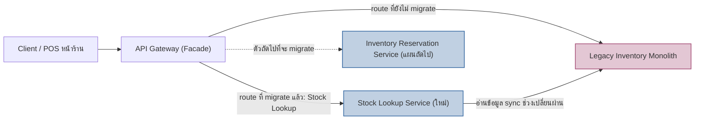

ลองนึกภาพสะพานข้ามแม่น้ำสายเดียวที่เป็นทางเข้าออกเมืองเพียงทางเดียว สะพานสร้างมาแปดปีก่อน ตอนนั้นวิศวกรออกแบบไว้รับรถได้ไม่กี่พันคันต่อวัน แต่ปีต่อปีเทศบาลก็ทยอยต่อเติม — เพิ่มเลนจักรยาน เสริมคานรับน้ำหนักรถบรรทุกโดยไม่มีการคำนวณโครงสร้างใหม่ทั้งระบบ ผู้รับเหมาแต่ละรายที่เข้ามาซ่อมก็แก้ไปตามที่เห็นหน้างาน ไม่มีใครเก็บพิมพ์เขียวที่อัปเดตล่าสุดไว้เลยสักฉบับ

วันนี้เทศบาลอยากขยายสะพานให้รับน้ำหนักรถไฟฟ้าขนส่งมวลชนสายใหม่ได้ แต่ไม่มีวิศวกรคนไหนกล้ายืนยันว่าเสาต้นไหนรับน้ำหนักเพิ่มได้จริงแค่ไหน เพราะพิมพ์เขียวเดิมหายไปนานแล้ว จะปิดสะพานเพื่อรื้อสร้างใหม่ทั้งหมดก็ทำไม่ได้ เพราะเป็นเส้นทางเดียวที่คนทั้งเมืองใช้เดินทางทุกวัน หยุดแม้แค่วันเดียวก็กระทบทั้งเมือง

ทางออกที่วิศวกรใช้จริงในสถานการณ์แบบนี้คือสร้างโครงสร้างใหม่ขนานไปกับสะพานเดิมทีละช่วง ทดสอบรับน้ำหนักให้มั่นใจ แล้วค่อยโยกการจราจรมาที่ช่วงใหม่ทีละเลน โดยสะพานเดิมยังใช้งานได้ตลอดเวลา จนวันหนึ่งไม่มีรถวิ่งบนโครงสร้างเก่าเหลือเลยถึงจะรื้อทิ้งได้อย่างปลอดภัย — นี่คือสถานการณ์เดียวกับที่ทีมวิศวกรรมซอฟต์แวร์ต้องเจอเวลาต้อง migrate <mark class="hl-term">**Legacy Monolith**</mark> ที่ไม่มีใครกล้าแตะ

โจทย์นี้คือโจทย์ที่ pillar อื่นในโมดูลนี้ยังไม่เคยพูดถึงตรงๆ — ไม่ใช่การออกแบบระบบใหม่ตั้งแต่ศูนย์ แต่เป็นการเปลี่ยนสถาปัตยกรรมของระบบที่รันอยู่จริงและหยุดไม่ได้ ซึ่งเป็นหัวใจของ **Evolutionary Architecture** (โมดูล 21)

## Requirement คร่าวๆ

- ระบบ inventory monolith อายุ 8 ปี ต้องให้บริการต่อเนื่อง 24/7 ห้ามหยุดระบบเพื่อ migrate เพราะคลังสินค้าใช้งานจริงตลอดเวลา
- โค้ดเดิมแทบไม่มี automated test coverage — แก้จุดเดียวไม่มีใครมั่นใจว่าจุดอื่นจะไม่พังตาม
- ส่วนต่างๆ ในระบบ coupling กันแน่นมาก (เช่น logic คำนวณราคาเรียก logic เช็คสต๊อกตรงๆ) จนไม่มีใครกล้าแก้
- ธุรกิจต้องการฟีเจอร์ใหม่ (multi-warehouse, real-time stock sync ข้ามสาขา) ที่สถาปัตยกรรมเดิมรองรับไม่ไหว
- ห้ามทำ big-bang rewrite เพราะความเสี่ยงสูงเกินกว่าที่ธุรกิจจะรับได้ — ถ้าระบบใหม่พังคือคลังสินค้าทั้งบริษัทหยุดทำงานพร้อมกัน

## รากปัญหา: ทำไม Monolith ถึงกลายเป็นระบบที่ไม่มีใครกล้าแตะ

ก่อนจะพูดถึงวิธีแก้ ต้องเข้าใจก่อนว่าทำไมระบบถึงมาถึงจุดนี้ — ไม่มีวันไหนที่ทีมตัดสินใจสร้างระบบที่ "แตะไม่ได้" ขึ้นมาตรงๆ ตามที่โมดูล 21 (Evolutionary Architecture & Anti-pattern) อธิบายไว้เรื่อง **Architecture Erosion** ปัญหานี้เกิดจากการสะสมของทางลัดเล็กๆ ทีละจุดตลอดแปดปี — deadline กระชั้นทำให้ทีมเขียน query ข้าม module ตรงถึง database ของอีก module, ฟีเจอร์เร่งด่วนทำให้ logic คำนวณราคาไปเรียกฟังก์ชันเช็คสต๊อกตรงๆ แทนที่จะผ่าน interface ที่ตั้งใจไว้ ทำซ้ำแบบนี้จนไม่มีใครจำ boundary เดิมได้อีกแล้ว

<mark class="hl-insight">จุดที่ทีมมักเข้าใจผิดคือคิดว่าปัญหานี้เกิดจากมี developer ที่ไม่มีวินัยอยู่ในทีม แต่จริงๆ แล้วมันคือผลลัพธ์ที่คาดเดาได้ของระบบที่ไม่มีการตรวจสอบ boundary อัตโนมัติ ปล่อยให้ทุกอย่างพึ่งความจำและวินัยของคนล้วนๆ</mark> เมื่อผสมกับการไม่มี test coverage เพียงพอ (โมดูล 21 หัวข้อ Common Anti-pattern เรียกอาการรวมๆ นี้ว่า **big ball of mud**) ทุกจุดในระบบเชื่อมกับทุกจุดจนแก้อะไรก็เสี่ยงพังจุดที่ไม่เกี่ยวข้องเลย นี่คือเหตุผลที่ไม่มีใครกล้าแตะระบบนี้อีกต่อไป

## กลยุทธ์ Migrate: ทำไมเลือก Strangler Fig แทน Big-bang Rewrite

จากโมดูล 13 (Architectural Styles & Patterns) เราเรียนมาแล้วว่า Monolith กับ Microservices ไม่มีฝั่งไหนถูกเสมอ ขึ้นอยู่กับ stage ของระบบ — แต่โจทย์ของทีมนี้ไม่ใช่แค่ "จะเลือก style ไหน" อีกต่อไป เป้าหมายปลายทางชัดเจนอยู่แล้วว่าต้องเป็นสถาปัตยกรรมที่แยก module ได้อิสระกว่าเดิม คำถามจริงคือ **จะย้ายจากจุด A ไปจุด B ได้อย่างไรโดยไม่หยุดระบบ**

ตัวเลือกแรกที่มักถูกเสนอคือ rewrite ทั้งระบบใหม่ตั้งแต่ต้น (big-bang) แต่สำหรับระบบที่ไม่มี test coverage และธุรกิจพึ่งพาอยู่ 24/7 ความเสี่ยงนี้ยอมรับไม่ได้ — ถ้า rewrite ผิดพลาดคือทั้งคลังสินค้าหยุดทำงานพร้อมกันในวันเปิดตัว ไม่มีทางย้อนกลับทีละส่วน

คำตอบที่โมดูล 21 (Evolutionary Architecture & Anti-pattern) เสนอไว้คือ <mark class="hl-term">**Strangler Fig Pattern**</mark> — วางชั้น facade/proxy ไว้หน้า monolith เดิม แล้วค่อย migrate ทีละ capability ออกมาเป็น service ใหม่ โดยระบบเดิมยังใช้งานได้ตลอดกระบวนการ <mark class="hl-insight">หัวใจของแนวทางนี้คือทำให้ทุกก้าวเล็กพอที่จะ rollback ได้ทันทีถ้าพัง แทนที่จะเดิมพันทั้งระบบไว้กับการเปลี่ยนแปลงครั้งเดียว</mark>



## เลือก Capability แรก: ทำไมต้อง Stock Lookup

Strangler Fig บอกแค่ว่าให้ migrate ทีละชิ้น แต่ไม่ได้บอกว่าเริ่มจากชิ้นไหนก่อน หลักการเลือกคือ **ความเสี่ยงต่ำที่สุดและ boundary ชัดที่สุด** ไม่ใช่ฟีเจอร์ที่ธุรกิจอยากได้เร่งด่วนที่สุด เพราะเป้าหมายรอบแรกคือพิสูจน์ว่าแนวทางนี้ใช้ได้จริงกับระบบนี้ก่อน ทีมพิจารณาสาม capability: Stock Lookup (อ่านจำนวนสต๊อกคงเหลือ), Inventory Reservation (จองสต๊อกตอนมีคำสั่งซื้อ), และ Order Fulfillment (ตัดสต๊อกจริงตอนส่งของ)

| Capability | Read/Write | Coupling กับส่วนอื่น | ความเสี่ยงถ้าพัง | เลือกเป็นตัวแรกไหม |
|---|---|---|---|---|
| Stock Lookup | Read-only | ต่ำ — แค่ query จำนวนคงเหลือ ไม่แก้ state | ต่ำ — ข้อมูลแสดงคลาดเคลื่อนชั่วคราว ไม่กระทบเงินหรือสต๊อกจริง | ใช่ — เริ่มจากตัวนี้ |
| Inventory Reservation | Read + Write | สูง — ต้องกันสต๊อกไม่ให้ oversell ข้าม request พร้อมกัน | สูง — พังคือขายเกินสต๊อกจริง | ยังไม่ใช่ตอนนี้ |
| Order Fulfillment | Write หนัก | สูงมาก — ผูกกับ payment, shipping, accounting | สูงมาก — พังกระทบทั้ง supply chain | ทำท้ายสุด |

<mark class="hl-warning">ข้อผิดพลาดที่ทีมมักทำคือเลือก migrate capability ที่ธุรกิจอยากได้ก่อน (มักเป็น Inventory Reservation หรือ Order Fulfillment เพราะมีมูลค่าทางธุรกิจสูง) โดยลืมว่ามันคือจุดที่ coupling แน่นและความเสี่ยงสูงที่สุดพอดี ถ้าพังตั้งแต่รอบแรก ทีมจะเสียความเชื่อมั่นในแนวทาง strangler fig ทั้งหมดและมักถูกสั่งให้กลับไปทำ rewrite แบบเดิม</mark> Stock Lookup ชนะเพราะเป็น read-only ไม่มี side effect และมี boundary ชัดเจนอยู่แล้ว — migrate สำเร็จรอบแรกแล้วค่อยขยับไปที่ Inventory Reservation ต่อ

## คุม Coupling ไม่ให้ Erosion เกิดซ้ำด้วย Fitness Function

ถ้า migrate เสร็จแล้วปล่อยไว้เฉยๆ ระบบใหม่ก็เสี่ยงเดินซ้ำรอยเดิม — developer ที่รีบอาจแอบให้ Stock Lookup Service กลับไป query database ของ monolith ตรงๆ แทนที่จะผ่าน API ที่ตั้งใจแยกไว้ เหมือนที่เกิดขึ้นกับระบบเดิมมาแล้วแปดปี วิธีป้องกันตามโมดูล 21 (Evolutionary Architecture & Anti-pattern) คือเขียน <mark class="hl-term">**Fitness Function**</mark> ผูกเข้ากับ CI pipeline

ทีมตั้งกฎอัตโนมัติสองข้อ: (1) dependency check ด้วย dependency-cruiser ว่า Stock Lookup Service ห้าม import โค้ดจาก monolith โดยตรง ต้องคุยผ่าน API เท่านั้น และ (2) latency threshold ว่า p95 ของ endpoint stock lookup ต้องไม่เกิน 150ms ถ้า pull request ไหนละเมิดข้อใดข้อหนึ่ง build fail ทันทีก่อน merge

```demo
component: StepThroughDiagram
props: {"steps":[{"label":"1. วาง Facade หน้า Monolith","detail":"ตั้ง API Gateway ให้ route ทุก request ไปที่ legacy monolith เหมือนเดิม 100% ก่อน ยังไม่มีอะไรเปลี่ยนพฤติกรรมระบบในสายตาผู้ใช้"},{"label":"2. สร้าง Stock Lookup Service คู่ขนาน","detail":"เขียน service ใหม่ที่รองรับเฉพาะ query สต๊อกคงเหลือ (read-only) เลือกตัวนี้ก่อนเพราะ coupling ต่ำและพังแล้วไม่กระทบเงินหรือสต๊อกจริง"},{"label":"3. เพิ่ม Fitness Function ใน CI","detail":"ผูก dependency-cruiser เช็คว่า service ใหม่ห้าม import โค้ด monolith ตรง และเช็ค p95 latency ต้องไม่เกิน 150ms ถ้าละเมิด build fail ทันทีก่อน merge"},{"label":"4. เบี่ยง Route ทีละส่วน","detail":"เปลี่ยน facade ให้ route เฉพาะ stock lookup ไปที่ service ใหม่ ส่วนที่เหลือยังไปที่ monolith เหมือนเดิม ถ้าเจอปัญหา rollback แค่ route เดียวได้ทันที"},{"label":"5. ทำซ้ำกับ Capability ถัดไป","detail":"เมื่อ Stock Lookup เสถียรแล้ว ขยับไป migrate Inventory Reservation ด้วยแนวทางเดียวกัน จนวันหนึ่ง monolith เหลือแต่ route ที่ไม่มีใครเรียกแล้วถึงปลดระวางได้"}]}
```

## ใครเป็นเจ้าของอะไรระหว่าง Migrate

อีกจุดที่ต้องตัดสินใจคู่ขนานคือทีมไหนเป็นเจ้าของ Stock Lookup Service ใหม่ ตาม Team Topologies (โมดูล 20) การให้ทีมเดิมที่ดูแล monolith เป็นคนสร้าง service ใหม่ควบคู่กันมีข้อดีคือเข้าใจ business logic เดิมดีที่สุด แต่ต้องระวังไม่ให้ทีมนี้ยังคง mindset แบบ monolith เดิม (เช่น คุ้นเคยกับการ query database ข้าม module ตรงๆ) จนกลายเป็นคนทำลาย boundary ที่เพิ่งสร้างขึ้นเอง — fitness function ในหัวข้อก่อนหน้าจึงสำคัญกับกรณีนี้เป็นพิเศษ เพราะช่วยจับพฤติกรรมเดิมที่ทีมอาจทำโดยไม่รู้ตัว

## ADR ตัวอย่าง

> **Title:** Migrate Legacy Inventory Monolith ด้วย Strangler Fig เริ่มจาก Stock Lookup
> **Status:** Accepted
> **Context:** Inventory monolith อายุ 8 ปีไม่มี test coverage เพียงพอ และ coupling แน่นมากจนไม่มีใครกล้าแก้ ธุรกิจต้องการฟีเจอร์ multi-warehouse ที่สถาปัตยกรรมเดิมรองรับไม่ไหว แต่ระบบต้องรัน 24/7 ห้ามหยุดเพื่อ rewrite
> **Decision:** วาง API Gateway เป็น facade หน้า monolith เดิม แล้ว migrate ทีละ capability เริ่มจาก Stock Lookup (read-only, coupling ต่ำสุด) ก่อน พร้อมผูก fitness function เช็ค dependency และ latency ทุกครั้งที่ build เพื่อไม่ให้ service ใหม่กลับไปมี coupling แบบเดิม
> **Consequences:** ธุรกิจได้ฟีเจอร์ใหม่ทีละส่วนโดยไม่ต้องหยุดระบบ แต่ทีมต้องดูแล facade layer เพิ่มเติมและ monitor ทั้งฝั่งเก่ากับใหม่คู่ขนานกันระหว่างเปลี่ยนผ่าน และต้องเผื่อเวลาสำหรับ capability ถัดไป (Inventory Reservation, Order Fulfillment) ที่มี coupling และความเสี่ยงสูงกว่านี้มาก
