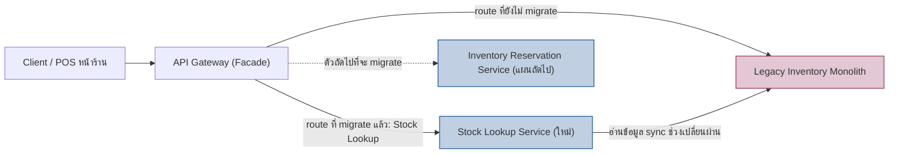
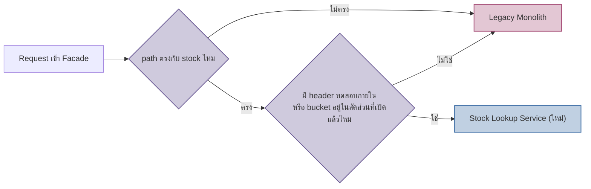
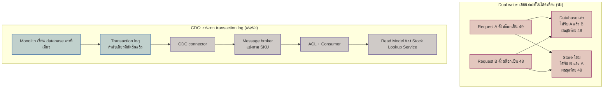
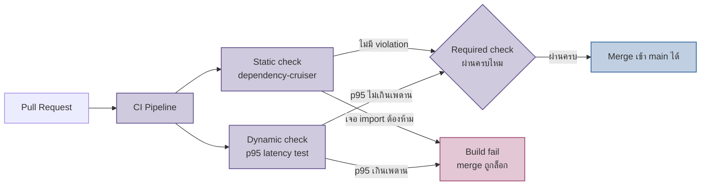
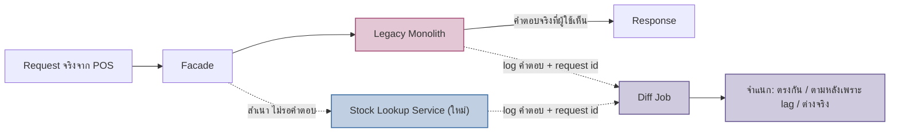
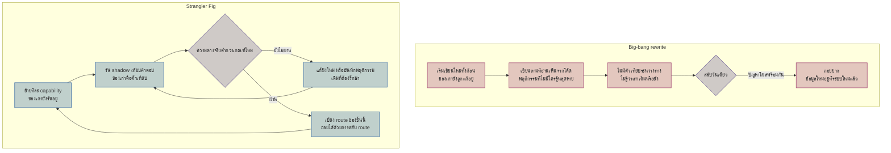
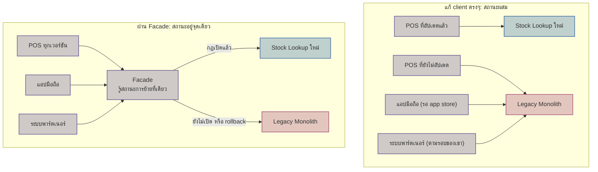

ลองนึกภาพสะพานข้ามแม่น้ำสายเดียวที่เป็นทางเข้าออกเมืองเพียงทางเดียว สะพานสร้างมาแปดปีก่อน ตอนนั้นวิศวกรออกแบบไว้รับรถได้ไม่กี่พันคันต่อวัน แต่ปีต่อปีเทศบาลก็ทยอยต่อเติม — เพิ่มเลนจักรยาน เสริมคานรับน้ำหนักรถบรรทุกโดยไม่มีการคำนวณโครงสร้างใหม่ทั้งระบบ ผู้รับเหมาแต่ละรายที่เข้ามาซ่อมก็แก้ไปตามที่เห็นหน้างาน ไม่มีใครเก็บพิมพ์เขียวที่อัปเดตล่าสุดไว้เลยสักฉบับ

วันนี้เทศบาลอยากขยายสะพานให้รับน้ำหนักรถไฟฟ้าขนส่งมวลชนสายใหม่ได้ แต่ไม่มีวิศวกรคนไหนกล้ายืนยันว่าเสาต้นไหนรับน้ำหนักเพิ่มได้จริงแค่ไหน เพราะพิมพ์เขียวเดิมหายไปนานแล้ว จะปิดสะพานเพื่อรื้อสร้างใหม่ทั้งหมดก็ทำไม่ได้ เพราะเป็นเส้นทางเดียวที่คนทั้งเมืองใช้เดินทางทุกวัน หยุดแม้แค่วันเดียวก็กระทบทั้งเมือง

ทางออกที่วิศวกรใช้จริงในสถานการณ์แบบนี้คือสร้างโครงสร้างใหม่ขนานไปกับสะพานเดิมทีละช่วง ทดสอบรับน้ำหนักให้มั่นใจ แล้วค่อยโยกการจราจรมาที่ช่วงใหม่ทีละเลน โดยสะพานเดิมยังใช้งานได้ตลอดเวลา จนวันหนึ่งไม่มีรถวิ่งบนโครงสร้างเก่าเหลือเลยถึงจะรื้อทิ้งได้อย่างปลอดภัย — นี่คือสถานการณ์เดียวกับที่ทีมวิศวกรรมซอฟต์แวร์ต้องเจอเวลาต้อง migrate <mark class="hl-term">**Legacy Monolith**</mark> ที่ไม่มีใครกล้าแตะ

โจทย์นี้คือโจทย์ที่ pillar อื่นในโมดูลนี้ยังไม่เคยพูดถึงตรงๆ — ไม่ใช่การออกแบบระบบใหม่ตั้งแต่ศูนย์ แต่เป็นการเปลี่ยนสถาปัตยกรรมของระบบที่รันอยู่จริงและหยุดไม่ได้ ซึ่งเป็นหัวใจของ **Evolutionary Architecture** (โมดูล 21)

## Requirement คร่าวๆ

- ระบบ inventory monolith อายุ 8 ปี ต้องให้บริการต่อเนื่อง 24/7 ห้ามหยุดระบบเพื่อ migrate เพราะคลังสินค้าใช้งานจริงตลอดเวลา
- โค้ดเดิมแทบไม่มี automated test coverage — แก้จุดเดียวไม่มีใครมั่นใจว่าจุดอื่นจะไม่พังตาม
- ส่วนต่างๆ ในระบบ coupling กันแน่นมาก (เช่น logic คำนวณราคาเรียก logic เช็คสต๊อกตรงๆ) จนไม่มีใครกล้าแก้
- ธุรกิจต้องการฟีเจอร์ใหม่ (multi-warehouse, real-time stock sync ข้ามสาขา) ที่สถาปัตยกรรมเดิมรองรับไม่ไหว
- ห้ามทำ big-bang rewrite เพราะความเสี่ยงสูงเกินกว่าที่ธุรกิจจะรับได้ — ถ้าระบบใหม่พังคือคลังสินค้าทั้งบริษัทหยุดทำงานพร้อมกัน

## รากปัญหา: ทำไม Monolith ถึงกลายเป็นระบบที่ไม่มีใครกล้าแตะ

ก่อนจะพูดถึงวิธีแก้ ต้องเข้าใจก่อนว่าทำไมระบบถึงมาถึงจุดนี้ — ไม่มีวันไหนที่ทีมตัดสินใจสร้างระบบที่ "แตะไม่ได้" ขึ้นมาตรงๆ ตามที่โมดูล 21 (Evolutionary Architecture & Anti-pattern) อธิบายไว้เรื่อง **Architecture Erosion** ปัญหานี้เกิดจากการสะสมของทางลัดเล็กๆ ทีละจุดตลอดแปดปี — deadline กระชั้นทำให้ทีมเขียน query ข้าม module ตรงถึง database ของอีก module, ฟีเจอร์เร่งด่วนทำให้ logic คำนวณราคาไปเรียกฟังก์ชันเช็คสต๊อกตรงๆ แทนที่จะผ่าน interface ที่ตั้งใจไว้ ทำซ้ำแบบนี้จนไม่มีใครจำ boundary เดิมได้อีกแล้ว

<mark class="hl-insight">จุดที่ทีมมักเข้าใจผิดคือคิดว่าปัญหานี้เกิดจากมี developer ที่ไม่มีวินัยอยู่ในทีม แต่จริงๆ แล้วมันคือผลลัพธ์ที่คาดเดาได้ของระบบที่ไม่มีการตรวจสอบ boundary อัตโนมัติ ปล่อยให้ทุกอย่างพึ่งความจำและวินัยของคนล้วนๆ</mark> เมื่อผสมกับการไม่มี test coverage เพียงพอ (โมดูล 21 หัวข้อ Common Anti-pattern เรียกอาการรวมๆ นี้ว่า **big ball of mud**) ทุกจุดในระบบเชื่อมกับทุกจุดจนแก้อะไรก็เสี่ยงพังจุดที่ไม่เกี่ยวข้องเลย นี่คือเหตุผลที่ไม่มีใครกล้าแตะระบบนี้อีกต่อไป

## กลยุทธ์ Migrate: ทำไมเลือก Strangler Fig แทน Big-bang Rewrite

จากโมดูล 13 (Architectural Styles & Patterns) เราเรียนมาแล้วว่า Monolith กับ Microservices ไม่มีฝั่งไหนถูกเสมอ ขึ้นอยู่กับ stage ของระบบ — แต่โจทย์ของทีมนี้ไม่ใช่แค่ "จะเลือก style ไหน" อีกต่อไป เป้าหมายปลายทางชัดเจนอยู่แล้วว่าต้องเป็นสถาปัตยกรรมที่แยก module ได้อิสระกว่าเดิม คำถามจริงคือ **จะย้ายจากจุด A ไปจุด B ได้อย่างไรโดยไม่หยุดระบบ**

ตัวเลือกแรกที่มักถูกเสนอคือ rewrite ทั้งระบบใหม่ตั้งแต่ต้น (big-bang) แต่สำหรับระบบที่ไม่มี test coverage และธุรกิจพึ่งพาอยู่ 24/7 ความเสี่ยงนี้ยอมรับไม่ได้ — ถ้า rewrite ผิดพลาดคือทั้งคลังสินค้าหยุดทำงานพร้อมกันในวันเปิดตัว ไม่มีทางย้อนกลับทีละส่วน

คำตอบที่โมดูล 21 (Evolutionary Architecture & Anti-pattern) เสนอไว้คือ <mark class="hl-term">**Strangler Fig Pattern**</mark> — วางชั้น facade/proxy ไว้หน้า monolith เดิม แล้วค่อย migrate ทีละ capability ออกมาเป็น service ใหม่ โดยระบบเดิมยังใช้งานได้ตลอดกระบวนการ <mark class="hl-insight">หัวใจของแนวทางนี้คือทำให้ทุกก้าวเล็กพอที่จะ rollback ได้ทันทีถ้าพัง แทนที่จะเดิมพันทั้งระบบไว้กับการเปลี่ยนแปลงครั้งเดียว</mark>


```mermaid
flowchart LR
    Client["Client / POS หน้าร้าน"] --> Facade["API Gateway (Facade)"]
    Facade -->|"route ที่ยังไม่ migrate"| Monolith["Legacy Inventory Monolith"]
    Facade -->|"route ที่ migrate แล้ว: Stock Lookup"| StockSvc["Stock Lookup Service (ใหม่)"]
    StockSvc -->|"อ่านข้อมูล sync ช่วงเปลี่ยนผ่าน"| Monolith
    Facade -.->|"ตัวถัดไปที่จะ migrate"| ReserveSvc["Inventory Reservation Service (แผนถัดไป)"]

    classDef legacy fill:#a8527a52,stroke:#a8527a,stroke-width:1.5px
    classDef modern fill:#3d6ea552,stroke:#3d6ea5,stroke-width:1.5px
    class Monolith legacy
    class StockSvc,ReserveSvc modern
```

## เลือก Capability แรก: ทำไมต้อง Stock Lookup

Strangler Fig บอกแค่ว่าให้ migrate ทีละชิ้น แต่ไม่ได้บอกว่าเริ่มจากชิ้นไหนก่อน หลักการเลือกคือ **ความเสี่ยงต่ำที่สุดและ boundary ชัดที่สุด** ไม่ใช่ฟีเจอร์ที่ธุรกิจอยากได้เร่งด่วนที่สุด เพราะเป้าหมายรอบแรกคือพิสูจน์ว่าแนวทางนี้ใช้ได้จริงกับระบบนี้ก่อน ทีมพิจารณาสาม capability: Stock Lookup (อ่านจำนวนสต๊อกคงเหลือ), Inventory Reservation (จองสต๊อกตอนมีคำสั่งซื้อ), และ Order Fulfillment (ตัดสต๊อกจริงตอนส่งของ)

| Capability | Read/Write | Coupling กับส่วนอื่น | ความเสี่ยงถ้าพัง | เลือกเป็นตัวแรกไหม |
|---|---|---|---|---|
| Stock Lookup | Read-only | ต่ำ — แค่ query จำนวนคงเหลือ ไม่แก้ state | ต่ำ — ข้อมูลแสดงคลาดเคลื่อนชั่วคราว ไม่กระทบเงินหรือสต๊อกจริง | ใช่ — เริ่มจากตัวนี้ |
| Inventory Reservation | Read + Write | สูง — ต้องกันสต๊อกไม่ให้ oversell ข้าม request พร้อมกัน | สูง — พังคือขายเกินสต๊อกจริง | ยังไม่ใช่ตอนนี้ |
| Order Fulfillment | Write หนัก | สูงมาก — ผูกกับ payment, shipping, accounting | สูงมาก — พังกระทบทั้ง supply chain | ทำท้ายสุด |

<mark class="hl-warning">ข้อผิดพลาดที่ทีมมักทำคือเลือก migrate capability ที่ธุรกิจอยากได้ก่อน (มักเป็น Inventory Reservation หรือ Order Fulfillment เพราะมีมูลค่าทางธุรกิจสูง) โดยลืมว่ามันคือจุดที่ coupling แน่นและความเสี่ยงสูงที่สุดพอดี ถ้าพังตั้งแต่รอบแรก ทีมจะเสียความเชื่อมั่นในแนวทาง strangler fig ทั้งหมดและมักถูกสั่งให้กลับไปทำ rewrite แบบเดิม</mark> Stock Lookup ชนะเพราะเป็น read-only ไม่มี side effect และมี boundary ชัดเจนอยู่แล้ว — migrate สำเร็จรอบแรกแล้วค่อยขยับไปที่ Inventory Reservation ต่อ

## คุม Coupling ไม่ให้ Erosion เกิดซ้ำด้วย Fitness Function

ถ้า migrate เสร็จแล้วปล่อยไว้เฉยๆ ระบบใหม่ก็เสี่ยงเดินซ้ำรอยเดิม — developer ที่รีบอาจแอบให้ Stock Lookup Service กลับไป query database ของ monolith ตรงๆ แทนที่จะผ่าน API ที่ตั้งใจแยกไว้ เหมือนที่เกิดขึ้นกับระบบเดิมมาแล้วแปดปี วิธีป้องกันตามโมดูล 21 (Evolutionary Architecture & Anti-pattern) คือเขียน <mark class="hl-term">**Fitness Function**</mark> ผูกเข้ากับ CI pipeline

ทีมตั้งกฎอัตโนมัติสองข้อ: (1) dependency check ด้วย dependency-cruiser ว่า Stock Lookup Service ห้าม import โค้ดจาก monolith โดยตรง ต้องคุยผ่าน API เท่านั้น และ (2) latency threshold ว่า p95 ของ endpoint stock lookup ต้องไม่เกิน 150ms ถ้า pull request ไหนละเมิดข้อใดข้อหนึ่ง build fail ทันทีก่อน merge

```demo
component: StepThroughDiagram
props: {"steps":[{"label":"1. วาง Facade หน้า Monolith","detail":"ตั้ง API Gateway ให้ route ทุก request ไปที่ legacy monolith เหมือนเดิม 100% ก่อน ยังไม่มีอะไรเปลี่ยนพฤติกรรมระบบในสายตาผู้ใช้"},{"label":"2. สร้าง Stock Lookup Service คู่ขนาน","detail":"เขียน service ใหม่ที่รองรับเฉพาะ query สต๊อกคงเหลือ (read-only) เลือกตัวนี้ก่อนเพราะ coupling ต่ำและพังแล้วไม่กระทบเงินหรือสต๊อกจริง"},{"label":"3. เพิ่ม Fitness Function ใน CI","detail":"ผูก dependency-cruiser เช็คว่า service ใหม่ห้าม import โค้ด monolith ตรง และเช็ค p95 latency ต้องไม่เกิน 150ms ถ้าละเมิด build fail ทันทีก่อน merge"},{"label":"4. เบี่ยง Route ทีละส่วน","detail":"เปลี่ยน facade ให้ route เฉพาะ stock lookup ไปที่ service ใหม่ ส่วนที่เหลือยังไปที่ monolith เหมือนเดิม ถ้าเจอปัญหา rollback แค่ route เดียวได้ทันที"},{"label":"5. ทำซ้ำกับ Capability ถัดไป","detail":"เมื่อ Stock Lookup เสถียรแล้ว ขยับไป migrate Inventory Reservation ด้วยแนวทางเดียวกัน จนวันหนึ่ง monolith เหลือแต่ route ที่ไม่มีใครเรียกแล้วถึงปลดระวางได้"}]}
```

## ใครเป็นเจ้าของอะไรระหว่าง Migrate

อีกจุดที่ต้องตัดสินใจคู่ขนานคือทีมไหนเป็นเจ้าของ Stock Lookup Service ใหม่ ตาม Team Topologies (โมดูล 20) การให้ทีมเดิมที่ดูแล monolith เป็นคนสร้าง service ใหม่ควบคู่กันมีข้อดีคือเข้าใจ business logic เดิมดีที่สุด แต่ต้องระวังไม่ให้ทีมนี้ยังคง mindset แบบ monolith เดิม (เช่น คุ้นเคยกับการ query database ข้าม module ตรงๆ) จนกลายเป็นคนทำลาย boundary ที่เพิ่งสร้างขึ้นเอง — fitness function ในหัวข้อก่อนหน้าจึงสำคัญกับกรณีนี้เป็นพิเศษ เพราะช่วยจับพฤติกรรมเดิมที่ทีมอาจทำโดยไม่รู้ตัว

## คำถามเจาะลึกที่มักถูกถามต่อ

พออธิบายแผน migrate จบ คนสัมภาษณ์หรือเพื่อนร่วมทีมมักไม่หยุดแค่ "ใช้ Strangler Fig" แต่จะถามต่อว่า "แล้วข้างในมันทำงานยังไง ถ้าพังจะย้อนกลับได้จริงไหม" สี่คำถามแรก (Q1–Q4) คือคำถามต่อยอดแนวนี้ที่เจอบ่อยที่สุด แต่ละข้อไล่ให้ครบว่า ใช้ความรู้อะไรจากโมดูลไหน แก้ปัญหายังไง มีขั้นตอนอะไรบ้าง และข้างใต้จริงๆ มีอะไรทำงานอยู่ ส่วนอีกแนวที่ senior ชอบถามที่สุดคือ "ทำไมเลือกแบบนี้ ทำไมไม่เลือกอีกแบบ" สามคำถามหลัง (Q5–Q7) จึงไล่ให้เห็นทางเลือกที่ไม่ได้เลือก เหตุผลข้างใต้ ราคาที่ต้องจ่าย และเงื่อนไขที่ทำให้คำตอบเปลี่ยน

### Q1: Facade "เบี่ยง traffic" ยังไงกันแน่ และทำไมสลับ route หรือ rollback ได้ในไม่กี่วินาที

**ใช้ความรู้อะไร:** โมดูล 21 (Strangler Fig — facade คือจุดเดียวที่ตัดสินว่า request ไปเก่าหรือใหม่) บวกโมดูล 18 หัวข้อ ขั้นสูง: Service Mesh (canary และ weighted routing คือความสามารถแบบเดียวกัน แต่เคสนี้ทำที่ชั้น gateway หน้าระบบ) บวกหัวข้อ API Gateway ในโมดูล Microservices & API Design ของ System Design

**นึกภาพก่อน:** นึกถึงคนคุมคันโยกสับรางรถไฟ รางสองสายวางไว้ครบแล้ว (สายเก่าคือ monolith สายใหม่คือ Stock Lookup Service) คนคุมแค่ดูว่าขบวนนี้ตามกฎต้องไปสายไหนแล้วสับคันโยก ใช้เวลาเสี้ยววินาที ไม่ต้องรื้อรางใดเลย ถ้าสายใหม่มีปัญหาก็สับกลับได้ทันที facade ทำหน้าที่เดียวกัน: request คือขบวนรถ และกฎ routing คือตารางที่บอกว่าขบวนไหนไปสายไหน

**แก้ปัญหายังไง:** Facade ถือ <mark class="hl-term">**ตารางกฎ routing**</mark> (routing rules) ชุดหนึ่ง แต่ละกฎคือ "เงื่อนไขที่จับคู่ + ปลายทาง" เงื่อนไขที่ใช้ได้มีสี่แบบ เรียงจากปลอดภัยสุดไปกว้างสุด ซึ่งก็คือบันไดที่ใช้ปล่อยของจริงไล่ทีละขั้น:

1. **ตาม path** — `GET /stock/*` ไป service ใหม่ ส่วน path อื่นทั้งหมดไป monolith เหมือนเดิม นี่คือกฎพื้นฐานที่ขีดเส้นแบ่งว่า capability ไหนย้ายแล้ว
2. **ตาม header** — request ที่มี header พิเศษ (เช่น `X-Route-Stock: new`) ไปทางใหม่ ทีมพัฒนากับ QA ใช้ทดสอบบน production จริงได้ ส่วนผู้ใช้ทั่วไปยังไปทางเดิมโดยไม่รู้ตัว
3. **ตามกลุ่มผู้ใช้ (cohort)** — เช่นเฉพาะ POS ของคลังสาขานำร่องที่ความเสี่ยงต่ำก่อน
4. **ตามสัดส่วน (percentage)** — ค่อยๆ ไล่ 1%, 10%, 50%, 100%

<mark class="hl-insight">หัวใจคือ "การย้าย" ถูกลดเหลือแค่การแก้ตัวเลขหนึ่งตัวในไฟล์ config ไม่ใช่การ deploy โค้ดใหม่ ดังนั้น rollback ก็คือแก้ตัวเลขนั้นกลับ</mark>


```mermaid
flowchart LR
    Req["Request เข้า Facade"] --> R1{"path ตรงกับ stock ไหม"}
    R1 -->|"ไม่ตรง"| Mono["Legacy Monolith"]
    R1 -->|"ตรง"| R2{"มี header ทดสอบภายใน<br/>หรือ bucket อยู่ในสัดส่วนที่เปิดแล้วไหม"}
    R2 -->|"ใช่"| New["Stock Lookup Service (ใหม่)"]
    R2 -->|"ไม่ใช่"| Mono

    classDef legacy fill:#a8527a52,stroke:#a8527a,stroke-width:1.5px
    classDef modern fill:#3d6ea552,stroke:#3d6ea5,stroke-width:1.5px
    classDef decide fill:#6b5b9552,stroke:#6b5b95,stroke-width:1.5px
    class Mono legacy
    class New modern
    class R1,R2 decide
```

```demo
component: StepThroughDiagram
props: {"steps":[{"label":"1. เปิดเฉพาะ header (ทดสอบภายใน)","detail":"กฎบอกว่า path stock ไปทางใหม่เฉพาะ request ที่มี header ทดสอบ ผู้ใช้จริงทั้งหมดยังไปที่ monolith 100% ทีมได้ลองของจริงบน production โดยไม่มีลูกค้าคนไหนเสี่ยง"},{"label":"2. เปิดตาม cohort นำร่อง","detail":"เปิดให้ POS ของคลังสาขาเล็กสองสามแห่งก่อน ถ้า error rate หรือ latency ผิดปกติ แก้กฎกลับทีเดียวก็จบ กระทบแค่กลุ่มเล็กมาก"},{"label":"3. เปิดตามสัดส่วน 1% ถึง 50%","detail":"facade คำนวณ hash ของรหัสคลังแล้วเอาเศษหาร 100 ได้ bucket ตั้งแต่ 0 ถึง 99 ถ้า bucket น้อยกว่าสัดส่วนที่ตั้ง จึงไปทางใหม่ คนเดิมจึงได้ทางเดิมทุกครั้ง และตอนเพิ่มสัดส่วนกลุ่มเดิมยังอยู่ทางใหม่ต่อ"},{"label":"4. เปิดครบ 100% แต่ยังเก็บของเก่าไว้","detail":"ทุก request ของ path นี้ไปทางใหม่ แต่ monolith ยังรันและยังมีโค้ดเดิมอยู่ครบ กฎเดิมยังกู้กลับได้ทันทีตลอดช่วงสังเกตการณ์"},{"label":"5. Rollback: แก้ตัวเลขกลับแล้ว reload","detail":"แก้สัดส่วนเป็น 0 หรือ revert commit ของไฟล์กฎ gateway โหลดกฎใหม่โดย request ที่ค้างอยู่ทำต่อจนจบ ส่วน request ใหม่ไปที่ monolith ทันที ใช้เวลาระดับวินาที ไม่ใช่ระดับ deploy"}]}
```

**ข้างใต้ทำงานยังไง:** กฎ routing เก็บเป็นไฟล์ config ใน Git (เหมือนโค้ด มี pull request และ history ให้ย้อนดู) เมื่อแก้กฎ pipeline จะส่งกฎใหม่เข้า gateway ซึ่ง gateway ส่วนใหญ่โหลดกฎแบบ graceful คือ request ที่กำลังทำอยู่ทำต่อจนจบด้วยกฎเดิม ส่วน request ที่เข้ามาใหม่ใช้กฎใหม่ทันที จึงไม่ต้องตัดการเชื่อมต่อของใครและเร็วกว่าการ deploy โค้ดมาก

ส่วน percentage ไม่ได้ "สุ่มทีละ request" แต่ hash คีย์ที่คงที่ (เช่นรหัสคลังหรือ user id) ให้ได้ bucket ตายตัว เหตุผลคือสองระบบอาจตอบต่างกันเล็กน้อย (เช่นเลขสต๊อกที่ตามหลังอยู่ไม่กี่วินาที ดู Q2) ถ้าสุ่มทีละ request คนเดิมกดรีเฟรชจะเห็นเลขกระโดดไปมาระหว่างสองระบบ

**ถ้าพังหรือมีข้อควรระวังอะไร:**

- <mark class="hl-warning">Facade เองกลายเป็นจุดที่ล่มแล้วทั้งระบบล่ม (single point of failure) เพราะทุก request ต้องผ่านมัน</mark> ต้องรันหลายตัวหลัง load balancer และห้ามยัด business logic เข้าไปใน facade ไม่งั้นมันจะกลายเป็น monolith ก้อนใหม่ที่แตะไม่ได้เหมือนเดิม
- การ rollback ด้วยการสลับ route ปลอดภัยก็ต่อเมื่อ "ข้อมูลยังอยู่ที่เดียวกัน" Stock Lookup อ่านอย่างเดียวจึงสลับกลับได้ทันที แต่ capability ที่เขียนข้อมูลต้องคิดเรื่องข้อมูลที่ฝั่งใหม่เขียนไว้แล้วด้วย (ดู Q2)
- ถ้ามี cache อยู่หน้า facade คำตอบเก่าจะยังถูกเสิร์ฟจนกว่าจะหมดอายุ ทำให้การสลับ route ดูเหมือนไม่มีผลทันที และควรมี metric แยกตามปลายทาง (error rate และ latency ของเก่า เทียบกับของใหม่) เพื่อรู้ว่าต้อง rollback เมื่อไหร่

### Q2: Stock Lookup Service ใหม่ต้องใช้ข้อมูลสต๊อกที่ monolith เป็นเจ้าของ จะเอาข้อมูลมาได้ยังไง และทำไมห้ามใช้ dual write

**ใช้ความรู้อะไร:** โมดูล 15 (Bounded Context — service ใหม่ควรมี model และข้อมูลของตัวเอง ไม่ใช่แอบอ่านตารางของคนอื่น และหัวข้อ ขั้นสูง: Domain Events & Anti-Corruption Layer ข้าม Bounded Context อธิบายชั้นแปลไว้แล้ว) บวกโมดูล 19 (CQRS — Read Model คือสำเนาข้อมูลที่จัดรูปให้เหมาะกับการอ่าน) บวกหัวข้อ Replication ในโมดูล Database, Eventual Consistency ในโมดูล Consistency & CAP และ Stream Processing ในโมดูล Async & Messaging ของ System Design

**นึกภาพก่อน:** นึกถึงสมุดบัญชีเล่มหลักของร้าน ถ้าอยากมีสำเนาไว้อีกเล่ม มีสองวิธี วิธีแรกให้พนักงานจดลงสองเล่มด้วยมือทุกครั้ง (dual write) วันไหนจดเล่มแรกเสร็จแล้วถูกเรียกไปทำอย่างอื่น เล่มที่สองก็ตกหล่นโดยไม่มีใครรู้ วิธีที่สองคือตั้งเครื่องถ่ายเอกสารไว้ข้างสมุดเล่มหลัก ถ่ายทุกหน้าที่ถูกจดตามลำดับเดิมเป๊ะ (CDC) สำเนาอาจตามหลังอยู่บ้างแต่ไม่เคยผิดลำดับและไม่ต้องพึ่งความจำของพนักงานเลย ในแผนผังตอนต้นลูกศรจาก Stock Lookup Service กลับไปหา monolith ("อ่านข้อมูล sync ช่วงเปลี่ยนผ่าน") คือเรื่องนี้ และมันคือส่วนที่ยากที่สุดของการ migrate เพราะโค้ดย้ายง่ายกว่าข้อมูลมาก

**แก้ปัญหายังไง:** มีสี่ทางเลือก แต่ละทางแลกอะไรต่างกัน:

| ทางเลือก | ทำงานยังไง | ข้อดี | ข้อเสีย |
|---|---|---|---|
| เรียก API ของ monolith ทุกครั้ง | service ใหม่ยิง request ไปถาม monolith ทุกคำขอ lookup | ง่ายที่สุด ใช้เป็นก้าวแรกได้ | ไม่ได้ลดภาระ monolith และ service ใหม่ล่มตามของเก่า |
| อ่านจาก read replica ของ database monolith | ต่อตรงไปที่สำเนา (replica) ของ database เก่า | ทำเร็ว ไม่ต้องแก้โค้ด monolith | ผูกกับ schema ภายในที่ไม่มีใครเข้าใจครบ ซึ่งคือ coupling แบบเดียวกับที่ fitness function พยายามกัน จึงควรเป็นทางผ่านชั่วคราวที่บันทึกเป็น ADR |
| CDC (Change Data Capture) | อ่านการเปลี่ยนแปลงจาก transaction log ของ database แล้วส่งเป็น event ให้ service ใหม่สร้าง read model ของตัวเอง | ไม่ต้องแก้โค้ด monolith ไม่เพิ่ม query load บนตาราง ได้ทุกการเปลี่ยนแปลงตามลำดับ | ข้อมูลตามหลังอยู่บ้าง (eventual consistency) ต้องมี infra เพิ่ม |
| Dual write | ให้โค้ดเขียนทั้ง database เก่าและ store ใหม่ในคราวเดียว | ดูตรงไปตรงมา | ไม่ใช่ transaction เดียว จึงพังเงียบๆ ได้สองทาง (ดูด้านล่าง) และต้องแก้โค้ด monolith ที่ไม่มี test |

เคสนี้เลือก <mark class="hl-term">**CDC (Change Data Capture)**</mark> คือเครื่องมืออย่าง Debezium อ่าน transaction log ที่ database เขียนไว้อยู่แล้วสำหรับกู้คืนข้อมูลและทำ replication (เรียกว่า WAL ใน PostgreSQL และ binlog ใน MySQL) แปลงทุกการเปลี่ยนแปลงเป็น event ส่งเข้า message broker แล้วให้ service ใหม่นำไปสร้าง read model ของตัวเอง ตัวเลือกนี้เข้ากับ Stock Lookup เป็นพิเศษ เพราะเป็น capability อ่านอย่างเดียวที่ยอมให้ข้อมูลตามหลังได้ไม่กี่วินาที ต่างจาก Inventory Reservation ที่ต้องเช็คของจริงตอนจอง


```mermaid
flowchart TB
    subgraph Bad["Dual write: เขียนสองที่ในโค้ดเดียว (พัง)"]
        A1["Request A ตั้งสต๊อกเป็น 49"] --> DB1["Database เก่า<br/>ได้รับ A แล้ว B<br/>ผลสุดท้าย 48"]
        B1["Request B ตั้งสต๊อกเป็น 48"] --> DB1
        A1 --> DB2["Store ใหม่<br/>ได้รับ B แล้ว A<br/>ผลสุดท้าย 49"]
        B1 --> DB2
    end
    subgraph Good["CDC: อ่านจาก transaction log (แนะนำ)"]
        M["Monolith เขียน database เก่าที่เดียว"] --> L["Transaction log<br/>ลำดับเดียวที่ตัดสินแล้ว"]
        L --> C["CDC connector"]
        C --> K["Message broker<br/>แบ่งตาม SKU"]
        K --> X["ACL + Consumer"]
        X --> RM["Read Model ของ Stock Lookup Service"]
    end

    classDef bad fill:#a8527a52,stroke:#a8527a,stroke-width:1.5px
    classDef good fill:#3d6ea552,stroke:#3d6ea5,stroke-width:1.5px
    classDef flow fill:#6b5b9552,stroke:#6b5b95,stroke-width:1.5px
    class A1,B1,DB1,DB2 bad
    class M,L good
    class C,K,X,RM flow
```

```demo
component: ComparisonDiagram
props: {"left":{"title":"CDC จาก transaction log (ที่เคสนี้เลือก)","points":["ไม่ต้องแก้โค้ด monolith ที่ไม่มี test เลย","อ่านจาก log ที่ database เขียนอยู่แล้ว ไม่เพิ่ม query load บนตารางสต๊อก","ลำดับการเปลี่ยนแปลงต่อ SKU เดียวกันตรงกับต้นทางเสมอ","ข้อแลกคือ read model ตามหลังอยู่ไม่กี่วินาที ต้องวัดและแจ้งเตือน lag"]},"right":{"title":"Dual write เขียนสองที่ในโค้ดเดียว","points":["เขียนที่แรกสำเร็จ ที่สองล้ม สองฝั่งต่างกันโดยไม่มี error ให้ตามรอย","สอง request พร้อมกันอาจไปถึงสอง store คนละลำดับ ค่าสุดท้ายต่างกันถาวร","ไม่มีใครเป็นผู้ตัดสินลำดับที่แท้จริง เพราะไม่มี transaction คลุมทั้งสองที่","ต้องแก้โค้ด monolith ซึ่งคือส่วนที่ทีมไม่กล้าแตะที่สุด"]},"note":"จำง่ายๆ: ให้ต้นทางเขียนที่เดียว แล้วให้ข้อมูลไหลตามไปเป็น event ดีกว่าให้โค้ดเขียนหลายที่พร้อมกัน"}
```

**ข้างใต้ทำงานยังไง:** ลำดับที่เกิดขึ้นจริงมีห้าขั้น (1) ทำ **snapshot** คัดลอกข้อมูลสต๊อกทั้งหมดที่มีอยู่ตอนนี้ พร้อมจดตำแหน่งใน log ณ จุดนั้นไว้ (2) จากตำแหน่งนั้นเป็นต้นไป connector อ่านการเปลี่ยนแปลงทุกแถวใน log แล้วแปลงเป็น event ที่มีคีย์ (เช่น SKU) ค่าก่อนและหลัง และตำแหน่งใน log (3) message broker แบ่ง event ตามคีย์ ทำให้การเปลี่ยนแปลงของ SKU เดียวกันถูกประมวลผลตามลำดับเดิมเสมอ (4) ก่อนถึง read model มี <mark class="hl-term">**Anti-Corruption Layer (ACL)**</mark> แปลรูปตารางของ monolith ให้เป็นโมเดลสต๊อกของ service ใหม่ ไม่ปล่อยให้ชื่อคอลัมน์แปลกๆ รั่วเข้ามา (5) consumer อัปเดต read model แบบ upsert ตาม SKU และข้าม event ที่เก่ากว่าค่าที่เก็บอยู่ เพราะ broker ทั่วไปส่งแบบ at-least-once คือส่งซ้ำได้ การประมวลผลจึงต้อง idempotent (ทำซ้ำกี่รอบผลเท่าเดิม) <mark class="hl-insight">ส่วนที่ทำให้ CDC ปลอดภัยกว่า dual write คือมีผู้ตัดสินลำดับเพียงคนเดียว คือ log ของ database ต้นทาง ปลายทางแค่ตามอ่านตามลำดับนั้น</mark>

**ถ้าพังหรือมีข้อควรระวังอะไร:**

- <mark class="hl-warning">Dual write พังเงียบได้สองทาง คือเขียนสำเร็จแค่ที่เดียว และสอง request ไปถึงสอง store คนละลำดับ</mark> ทั้งสองแบบไม่มี error ใดๆ ปรากฏ ค่าของสองระบบแค่ค่อยๆ เพี้ยนกันไปโดยไม่มีใครรู้จนลูกค้าเห็นเลขสต๊อกผิด
- ต้องวัด **replication lag** (ช่วงห่างระหว่างเวลาที่ต้นทางเปลี่ยนกับเวลาที่ read model ได้ค่านั้น) แล้วตั้ง alert ถ้าเกินที่ธุรกิจรับได้ ไม่งั้นหน้า lookup จะโชว์ของที่หมดไปแล้วโดยไม่มีใครสังเกต
- ถ้า monolith เปลี่ยน schema, connector หรือ ACL อาจพัง จึงต้องให้ทีมเจ้าของ monolith รู้ว่ามี consumer ผูกอยู่ และถ้า consumer หยุดนานเกินกว่าที่ broker เก็บ event ไว้ ต้องทำ snapshot ใหม่ทั้งหมด

### Q3: Fitness Function ที่กัน coupling ย้อนกลับถูกต่อเข้า CI ยังไง ตรวจอะไรและอะไรทำให้ build fail ถ้าจำเป็นต้องยกเว้นจริงจะบันทึกยังไง

**ใช้ความรู้อะไร:** โมดูล 21 (Fitness Function แบบ static ที่ตรวจตอน build กับแบบ dynamic ที่วัดตอนรัน และ Architecture Erosion ที่แยก intentional debt ซึ่งบันทึกเป็น ADR ออกจาก erosion ที่ไม่มีใครรู้ตัว) บวกโมดูล CI/CD & GitOps ของ System Design (pipeline และด่านก่อน merge)

**นึกภาพก่อน:** นึกถึงด่านตรวจสัมภาระที่สนามบิน เครื่อง X-ray ตรวจของต้องห้ามในทุกกระเป๋าโดยไม่ต้องพึ่งความจำของเจ้าหน้าที่ ถ้าเจอก็ไม่ให้ผ่านประตู และถ้ามีเหตุจำเป็นต้องพกของที่ปกติห้าม (เช่นยาประจำตัว) ก็ต้องมีใบอนุญาตแนบที่ตรวจย้อนหลังได้ ไม่ใช่แค่ขอร้องให้เจ้าหน้าที่ปล่อยผ่าน

**แก้ปัญหายังไง:** สองกฎในเคสนี้เป็นคนละชนิด จึงต่อเข้า CI ต่างกัน

กฎที่ 1 (static) คือ dependency-cruiser ตรวจว่าโค้ดของ Stock Lookup Service ห้าม import โค้ดของ monolith ทีมเขียนกฎในไฟล์ config แล้วสั่งรันเป็นหนึ่ง step ใน pipeline:

```js
// .dependency-cruiser.js (ย่อ)
module.exports = {
  forbidden: [
    {
      name: 'stock-lookup-no-monolith-import',
      severity: 'error',
      from: { path: '^services/stock-lookup' },
      to: { path: '^legacy-monolith' }
    }
  ]
};
```

กฎที่ 2 (dynamic) คือ step ที่ deploy service ไปยัง environment ทดสอบชั่วคราว รัน load test ด้วยสคริปต์ชุดเดิมทุกครั้ง แล้ววัด **p95** (ค่าที่ 95% ของ request เร็วกว่า) เทียบกับเพดาน 150ms เครื่องมืออย่าง k6 มี threshold ในตัวและคืน exit code ที่ไม่ใช่ศูนย์เมื่อเกินเกณฑ์

<mark class="hl-insight">ทั้งสองกฎทำให้ build fail ด้วยกลไกเดียวกัน คือ step จบด้วย exit code ที่ไม่ใช่ศูนย์ แล้ว branch protection ที่ตั้งให้ check นี้เป็น "required" ก็ล็อกปุ่ม merge ไว้ ไม่มีใครต้องจำว่าต้องเช็ค</mark>


```mermaid
flowchart LR
    PR["Pull Request"] --> CI["CI Pipeline"]
    CI --> S["Static check<br/>dependency-cruiser"]
    CI --> D["Dynamic check<br/>p95 latency test"]
    S -->|"ไม่มี violation"| G{"Required check<br/>ผ่านครบไหม"}
    D -->|"p95 ไม่เกินเพดาน"| G
    S -->|"เจอ import ต้องห้าม"| F["Build fail<br/>merge ถูกล็อก"]
    D -->|"p95 เกินเพดาน"| F
    G -->|"ผ่านครบ"| OK["Merge เข้า main ได้"]

    classDef ok fill:#3d6ea552,stroke:#3d6ea5,stroke-width:1.5px
    classDef fail fill:#a8527a52,stroke:#a8527a,stroke-width:1.5px
    classDef step fill:#6b5b9552,stroke:#6b5b95,stroke-width:1.5px
    class OK ok
    class F fail
    class CI,S,D,G step
```

```demo
component: JourneyDiagram
props: {"nodes":[{"icon":"person","label":"Developer เปิด PR"},{"icon":"building","label":"CI Pipeline"},{"icon":"gate","label":"Merge Gate (required check)"},{"icon":"building","label":"main และ deploy"}],"travelerIcon":"envelope","steps":[{"activeNode":0,"caption":"Developer ที่รีบเพิ่ม import จากโค้ด monolith เข้าไปใน Stock Lookup Service แล้วเปิด pull request"},{"activeNode":1,"caption":"CI รัน dependency-cruiser สแกนทุกไฟล์ สร้างกราฟ import แล้วเทียบกับกฎ forbidden พบ import จาก services/stock-lookup ไปยัง legacy-monolith"},{"activeNode":1,"caption":"step นี้จบด้วย exit code ที่ไม่ใช่ศูนย์ job ทั้งก้อนถูกทำเครื่องหมายว่า fail พร้อมบอกไฟล์และบรรทัดที่ละเมิด"},{"activeNode":2,"caption":"Merge Gate เห็นว่า required check ไม่ผ่าน ปุ่ม merge ถูกล็อก Developer ต้องเปลี่ยนไปเรียกผ่าน API ตามที่ออกแบบไว้"},{"activeNode":3,"caption":"เมื่อแก้แล้วทุก check ผ่าน โค้ดจึงเข้า main และ deploy ต่อ coupling ต้องห้ามไม่เคยหลุดเข้ามาแม้แต่ครั้งเดียว"}]}
```

**ข้างใต้ทำงานยังไง:** dependency-cruiser ไม่ได้รันโปรแกรม แต่ **อ่านซอร์สโค้ดทุกไฟล์** แล้วสร้างกราฟที่แต่ละจุดคือไฟล์หรือ module และแต่ละเส้นคือ import จากนั้นไล่ทุกเส้นเทียบกับกฎใน `forbidden` ถ้าเส้นไหนตรงทั้งฝั่ง `from` และ `to` ถือเป็น violation ตามระดับ `severity` ที่ตั้งไว้ ถ้าเป็น `error` ตัวโปรแกรมจะจบด้วย exit code ที่ไม่ใช่ศูนย์ ฝั่ง latency ใช้หลักเดียวกันแต่วัดจากการรัน service จริงแล้วคำนวณ percentile จาก response time ที่เก็บได้ นอกจากนี้ไฟล์กฎเองควรมีเจ้าของกำกับ (เช่นกำหนดใน CODEOWNERS) เพื่อไม่ให้ใครแอบผ่อนกฎใน PR ธรรมดา

**ถ้าต้องยกเว้นจริงๆ:** ห้ามปิดกฎหรือลด severity ทั้งข้อ ให้เพิ่มข้อยกเว้นที่แคบที่สุด (เจาะจงไฟล์เดียวหรือตารางเดียว เช่นผ่านเงื่อนไข `pathNot` ในกฎ) พร้อม comment อ้างเลข ADR และวันหมดอายุ ผ่าน PR ที่เจ้าของสถาปัตยกรรมต้อง approve และมีเช็คเล็กๆ ที่ fail เมื่อเลยวันหมดอายุ เพื่อไม่ให้ข้อยกเว้นค้างกลายเป็น erosion แบบไม่มีใครรู้ ซึ่งคือแนวเดียวกับตัวอย่าง ADR-022 ในโมดูล 21 หัวข้อ Architecture Erosion

**ถ้าพังหรือมีข้อควรระวังอะไร:**

- <mark class="hl-warning">กฎแบบ import ตรวจได้เฉพาะ "โค้ดที่ import ตรง" ถ้า service ใหม่เปิด connection ไปที่ database ของ monolith ตรงๆ จะไม่มี import เลยและผ่านการเช็คทั้งที่ coupling อยู่ครบ</mark> ต้องมีอีกชั้นที่ระดับ infrastructure เช่นไม่ให้ credential หรือ network access ไปยัง database ของ monolith แก่ service ใหม่ตั้งแต่แรก
- latency test บน CI runner ที่ใช้ร่วมกันมีสัญญาณรบกวน อาจ fail ทั้งที่โค้ดไม่ผิด ควรรันหลายรอบและตั้งเพดานให้สมเหตุสมผลกับสถานะจริงก่อน ตามที่โมดูล 21 เตือนว่าถ้าเข้มเกินไปทีมจะเริ่มหาทาง bypass
- Fitness function ปกป้องได้เฉพาะสิ่งที่นิยามไว้แล้วเท่านั้น ยังต้องมีการ review สถาปัตยกรรมเป็นระยะสำหรับสิ่งที่วัดเป็นกฎไม่ได้

### Q4: ก่อนบอกว่า Stock Lookup "migrate เสร็จแล้ว" จะพิสูจน์ยังไงว่าระบบใหม่ตอบตรงกับระบบเก่า ในเมื่อระบบเก่าไม่มี test เลย

**ใช้ความรู้อะไร:** โมดูล 21 หัวข้อ ขั้นสูง: Branch by Abstraction & Parallel Run เมื่อ Strangler Fig ไม่พอ (อธิบาย Parallel Run ไว้แล้ว ข้อนี้ดูว่าเทคนิคเดียวกันไปต่อกับ facade ระดับ service ยังไง) บวกหัวข้อ Progressive Delivery ในโมดูล CI/CD & GitOps ของ System Design

**ปัญหาคืออะไร:** "เสร็จ" ไม่ได้แปลว่า service ใหม่ deploy ได้หรือ test ของมันผ่าน แต่แปลว่า <mark class="hl-insight">คำตอบตรงกับระบบเดิมบนข้อมูลจริงและ traffic จริง</mark> ปัญหาคือ monolith ไม่มี test coverage จึงไม่มีชุด test ให้ยึดเป็นมาตรฐาน สิ่งเดียวที่บอกได้ว่า "ถูก" หมายความว่าอะไรคือตัวระบบเก่าที่กำลังรันอยู่จริงนั่นเอง ดังนั้นวิธีพิสูจน์คือใช้มันเป็นเกณฑ์เทียบ

**แก้ปัญหายังไง:** ใช้ Parallel Run ที่ระดับ facade (เรียกอีกอย่างว่า shadow traffic) ทำเป็นขั้นๆ:

1. **Shadow** — facade ส่ง request จริงไป monolith และคืนคำตอบของ monolith ให้ผู้ใช้เหมือนเดิมทุกอย่าง พร้อมกันนั้นส่งสำเนาไปที่ service ใหม่แบบไม่รอคำตอบ (timeout สั้น) ผู้ใช้จึงไม่เคยเห็นผลของ service ใหม่
2. **เทียบ** — ทั้งสองฝั่ง log คำตอบคู่กับ request id เดียวกัน แล้วมี diff job จับคู่เทียบภายหลัง หลัง normalize ตัดสิ่งที่ต่างกันโดยธรรมชาติออกก่อน (เช่น timestamp, ลำดับ list)
3. **จำแนกความต่าง** — แยกเป็น "ตรงกัน", "ต่างเพราะข้อมูลยังตามหลังอยู่ไม่กี่วินาที (ดู Q2)" และ "ต่างจริง" ซึ่งต้องไล่หาว่าเป็น bug ฝั่งไหน
4. **ตั้งเกณฑ์ผ่านล่วงหน้า** — ตกลงกับธุรกิจก่อนเริ่มว่าความต่างจริงต้องต่ำกว่าเท่าไรและต้องรันนานแค่ไหน (เช่นครอบคลุมรอบธุรกิจเต็มอย่างวันนับสต๊อกสิ้นเดือน) ไม่ใช่มาตั้งเกณฑ์ทีหลังตอนเห็นผล
5. **ให้ของใหม่ตอบจริง** — เมื่อผ่านเกณฑ์ ไล่บันไดสัดส่วนจาก Q1 (1%, 10%, 50%, 100%) โดยเฝ้า error rate และ latency เทียบกับ fitness function ระหว่างทาง แล้วเก็บ route เก่าไว้ช่วงหนึ่งก่อนปลดระวาง


```mermaid
flowchart LR
    Req["Request จริงจาก POS"] --> F["Facade"]
    F --> Mono["Legacy Monolith"]
    F -.->|"สำเนา ไม่รอคำตอบ"| New["Stock Lookup Service (ใหม่)"]
    Mono -->|"คำตอบจริงที่ผู้ใช้เห็น"| Resp["Response"]
    Mono -.->|"log คำตอบ + request id"| Diff["Diff Job"]
    New -.->|"log คำตอบ + request id"| Diff
    Diff --> Cls["จำแนก: ตรงกัน / ตามหลังเพราะ lag / ต่างจริง"]

    classDef legacy fill:#a8527a52,stroke:#a8527a,stroke-width:1.5px
    classDef modern fill:#3d6ea552,stroke:#3d6ea5,stroke-width:1.5px
    classDef obs fill:#6b5b9552,stroke:#6b5b95,stroke-width:1.5px
    class Mono legacy
    class New modern
    class Diff,Cls obs
```

```demo
component: JourneyDiagram
props: {"nodes":[{"icon":"person","label":"POS หน้าร้าน"},{"icon":"gate","label":"Facade (mirror)"},{"icon":"building","label":"Legacy Monolith"},{"icon":"building","label":"Stock Lookup ใหม่"},{"icon":"notebook","label":"Diff Log"}],"travelerIcon":"envelope","steps":[{"activeNode":0,"caption":"POS ถามสต๊อกของ SKU-123 ตามปกติ request ถูกใส่ request id เพื่อใช้จับคู่ภายหลัง"},{"activeNode":1,"caption":"Facade ส่ง request ไป monolith ตามเดิม และส่งสำเนาไป service ใหม่พร้อม request id เดียวกัน โดยไม่รอคำตอบของสำเนา"},{"activeNode":2,"caption":"Monolith ตอบ facade คืนคำตอบนี้ให้ POS ผู้ใช้เห็นเฉพาะคำตอบของระบบเก่า"},{"activeNode":3,"caption":"Stock Lookup ใหม่ตอบสำเนาจาก read model ของตัวเอง คำตอบนี้ผู้ใช้ไม่เคยเห็น ถูกบันทึกไว้เฉยๆ"},{"activeNode":4,"caption":"Diff job จับคู่คำตอบสองฝั่งด้วย request id เทียบหลัง normalize แล้วจำแนกว่าตรงกัน ตามหลังเพราะ lag หรือต่างจริง"}]}
```

**ข้างใต้ทำงานยังไง:** gateway หลายตัวมีฟีเจอร์ request mirroring ในตัว (เช่น Envoy และ NGINX) ซึ่งส่งสำเนา request ไปยังอีก upstream โดยทิ้งคำตอบของสำเนาไป จึงเป็นเหตุผลที่ต้องให้ทั้งสองฝั่ง log คำตอบเองแล้วจับคู่ด้วย request id ทีหลัง (ทางหนึ่งที่ทำได้) ผลของการเทียบมักออกมาเป็นสัดส่วน เช่น "ต่างจริงกี่รายการต่อล้านคำขอ" ที่ติดตามเป็นกราฟรายวัน เกณฑ์ที่ตั้งไว้ล่วงหน้าเป็นตัวตัดสินว่าพร้อมสลับหรือยัง ไม่ใช่ความรู้สึกของทีม

**ถ้าพังหรือมีข้อควรระวังอะไร:**

- <mark class="hl-warning">วิธี shadow ปลอดภัยเพราะ Stock Lookup อ่านอย่างเดียวเท่านั้น</mark> ถ้าเอาไปใช้กับ Inventory Reservation ตรงๆ สำเนาจะไปจองสต๊อกซ้ำจริง จึงต้องมีโหมด dry-run หรือ sandbox ก่อนจึงจะ mirror capability ที่เขียนข้อมูลได้
- อย่าถือว่าระบบเก่า "ถูกเสมอ" พอเจอความต่างจริงต้องตัดสินทีละกลุ่มว่าเป็น bug ที่ต้องเก็บไว้ให้เหมือนเดิม (เพราะระบบอื่นพึ่งพาพฤติกรรมนั้นอยู่) หรือเป็น bug ที่ควรแก้ให้ถูกพร้อมแจ้งผู้ใช้ ซึ่งเป็นการตัดสินใจทางธุรกิจ ไม่ใช่แค่เรื่องเทคนิค
- ช่วงที่ทดสอบไม่ครอบคลุมเคสหายาก (เช่นสิ้นเดือน หรือช่วงลดราคา) diff เป็นศูนย์อาจแปลว่ายังไม่เจอ ไม่ใช่ว่าถูกทั้งหมด และการยอมให้ tolerance ของ lag กว้างเกินไปจะกลบความต่างจริงที่ควรเห็น
- Log ของสองฝั่งมีข้อมูลธุรกิจจริง ต้อง mask ข้อมูลอ่อนไหวและกำหนดอายุการเก็บให้สั้น ไม่งั้นระบบสังเกตการณ์กลายเป็นความเสี่ยงชั้นใหม่

### Q5: ทำไมไม่ rewrite ทั้งระบบให้จบไปเลย ในเมื่อโค้ดเก่าแย่จนไม่มีใครกล้าแตะ เขียนใหม่ให้สะอาดน่าจะเร็วกว่าค่อยๆ ย้ายทีละชิ้น

**คำตอบสั้น (ตอบได้ใน 30 วินาที):** เพราะโค้ดเก่าจะแย่แค่ไหน มันก็ยังเป็น "ข้อกำหนด" ฉบับเดียวที่มีอยู่จริงของพฤติกรรมที่คลังสินค้าพึ่งอยู่ทุกวัน และเมื่อไม่มี test เลย วิธีเดียวที่จะรู้ว่าระบบใหม่ตอบเท่าเดิมคือเอาไปเทียบกับระบบเก่าบน traffic จริง ซึ่ง rewrite ก้อนเดียวทำได้เมื่อเขียนเสร็จทั้งหมดแล้วเท่านั้น <mark class="hl-insight">ระบบเก่าที่ "แย่" คือตัวเทียบคำตอบและทางถอยเดียวที่เรามี rewrite ทิ้งมันตั้งแต่วันแรก ส่วน Strangler Fig เก็บมันไว้ใช้จนถึงชิ้นสุดท้าย</mark>

**ใช้ความรู้อะไร:** โมดูล 21 (Strangler Fig หัวข้อ "ทำไมไม่ rewrite ทั้งหมดทีเดียว" ให้เหตุผลภาพรวมไว้แล้ว ข้อนี้ลงไปที่กลไกว่าทำไมความเสี่ยงของ rewrite ถึงกองอยู่ท้ายโครงการ) บวกโมดูล 21 หัวข้อ ขั้นสูง: Branch by Abstraction & Parallel Run (เอาระบบเก่าเป็นตัวเทียบคำตอบ ดู Q4) บวกโมดูล 16 หัวข้อ ATAM (ตัดสินใจโดยวางความเสี่ยงกับข้อแลกเปลี่ยนไว้บนโต๊ะ) และเคส Twitter Fail Whale ใน Case Studies ของ System Design ซึ่งมีคำถาม "ทำไมไม่แยกทั้งหมดทีเดียว" ตอบจากมุมความเสี่ยงโดยรวมไว้แล้ว ข้อนี้จึงเพิ่มมุมของระบบที่ไม่มี test

**ทางเลือกที่ไม่เลือก และทำไมถึงไม่เลือก:** ลองนึกภาพก๋วยเตี๋ยวร้านเก่าแก่ที่สูตรน้ำซุปอยู่ในหัวของป้าเจ้าของร้าน ไม่เคยมีใครจดไว้ ลูกค้าประจำมากินทุกวันเพราะรสชาตินี้ คนรุ่นใหม่เห็นว่าครัวรกและเก่ามาก จึงอยากรื้อทิ้งแล้วเปิดร้านใหม่ทั้งหมดด้วยสูตรที่ "เดาว่าใช่" วันเปิดร้านลูกค้าประจำชิมแล้วบอกว่ารสไม่เหมือนเดิม และร้านเก่าก็ถูกรื้อไปแล้ว ไม่เหลืออะไรให้ชิมเทียบหรือกลับไปเอาสูตร ต่างจากการเปิดสาขาใหม่ข้างร้านเดิม ให้ป้ายังขายอยู่ ชิมเทียบทีละเมนู แล้วค่อยย้ายลูกค้าไปทีละกลุ่ม

ทางเลือกที่ไม่เลือกคือ big-bang rewrite: ตั้งทีมเขียนระบบคลังใหม่ทั้งก้อนคู่ขนานกับของเก่า แล้วสลับทุก capability ในวันเดียว สิ่งที่มันทำพังมีสามอย่าง คือไม่มีตัวเทียบให้รู้ว่าเท่าเดิมหรือยังจนกว่าจะเสร็จทั้งก้อน ไม่ส่งมอบอะไรให้ธุรกิจเลยตลอดทาง และรวมความเสี่ยงทั้งหมดไว้ที่วันสลับวันเดียว

```demo
component: ComparisonDiagram
props: {"left":{"title":"Strangler Fig ย้ายทีละชิ้น (ที่เคสนี้เลือก)","points":["ระบบเก่ายังรันอยู่ตลอด จึงเป็นตัวเทียบคำตอบของพฤติกรรมที่ไม่มีใครเขียนไว้","ส่งมอบทีละชิ้น ชิ้นแรกให้ประโยชน์ได้ก่อนโครงการจะจบ","แต่ละก้าวเล็กพอจะถอยกลับได้ด้วยการสลับ route","ความเสี่ยงกระจายเป็นก้อนเล็กๆ ตลอดทาง ไม่กองรวมกันที่วันเดียว"]},"right":{"title":"Big-bang rewrite เขียนใหม่ทั้งก้อนแล้วสลับทีเดียว","points":["เทียบกับของเก่าได้ก็ต่อเมื่อเสร็จทั้งก้อน ความต่างทั้งหมดจึงโผล่พร้อมกันตอนท้ายที่เวลาเหลือน้อยที่สุด","ระหว่างเขียน ระบบเก่ายังถูกแก้อยู่ เป้าหมายที่ต้องไล่ให้ทันจึงขยับตลอด","ธุรกิจจ่ายค่าทีมสองชุดแต่ไม่ได้ฟีเจอร์ใหม่เลยจนกว่าจะเสร็จทั้งหมด","สลับวันเดียว ปัญหาโผล่พร้อมกัน และถอยกลับยากเมื่อระบบใหม่เริ่มเขียนข้อมูลไปแล้ว"]},"note":"ทั้งสองทางจบที่โค้ดใหม่ที่สะอาดเหมือนกัน ต่างกันที่ว่าระหว่างทางยังมีระบบเก่าให้เทียบและให้ถอยหรือไม่"}
```

**เหตุผลข้างใต้:** ที่โค้ดดูแย่ แต่ rewrite ก้อนเดียวยังเสี่ยงกว่า เพราะมีห้าขั้นที่ต่อกันเป็นโซ่

1. **ข้อกำหนดที่แท้จริงคือพฤติกรรมที่รันอยู่ ไม่ใช่โค้ดที่อ่านเห็น** — แปดปีที่ผ่านมา ทุก bug fix และทางลัดเล็กๆ กลายเป็นพฤติกรรมที่มีใครสักคนพึ่งพา (ระบบอื่นที่ต่อเข้ามา หรือคนคลังที่ชินกับวิธีที่มันตอบ) ส่วนใหญ่ไม่มีเอกสารและไม่มีใครจำครบ โค้ดที่ "แย่" แปลว่าอ่านยาก ไม่ได้แปลว่าพฤติกรรมของมันไร้ค่า
2. **ไม่มี test จึงไม่มีตัวตัดสินว่า "เท่าเดิมแล้ว"** — ปกติ rewrite มี test suite เดิมเป็นเส้นชัย แต่เคสนี้ไม่มี ตัวตัดสินคำตอบที่ถูก (<mark class="hl-term">**test oracle**</mark>) เหลือแค่ระบบเก่าที่กำลังรันอยู่จริง ตามที่ Q4 อธิบายวิธีเทียบ ปัญหาคือ rewrite เทียบได้เมื่อระบบใหม่ครบทั้งก้อนเท่านั้น ส่วน Strangler Fig เทียบได้ตั้งแต่ชิ้นแรก
3. **เป้าหมายขยับตลอดโครงการ** — ธุรกิจไม่หยุดรอ ระหว่าง rewrite ทีมยังต้องแก้ bug และเพิ่มของที่จำเป็นในระบบเก่า ทุกการแก้ต้องตามไปทำซ้ำในระบบใหม่ ไม่อย่างนั้นวันสลับจะเสียของที่เพิ่งแก้ไป
4. **คุณค่าเป็นศูนย์จนถึงวันสลับ** — ตลอดโครงการธุรกิจจ่ายเงินสองก้อน (ดูแลของเก่ากับสร้างของใหม่) แต่ยังไม่ได้ multi-warehouse เลย ยิ่งนานความอดทนของผู้บริหารยิ่งหมด และโครงการที่ถูกสั่งหยุดกลางทางมักเหลือของครึ่งๆ กลางๆ ที่ใช้งานไม่ได้
5. **ความเสี่ยงกองรวมกันที่วันสลับ** — ข้อ 1 ถึง 3 ไม่ได้ถูกแก้ระหว่างทาง มันสะสมเงียบๆ แล้วโผล่พร้อมกันวันเดียว ส่วน Strangler Fig แก้ทีละก้อนเล็กที่ตรวจเทียบและถอยได้ (ตามที่ Q1 อธิบายกลไกสลับ route)


```mermaid
flowchart TB
    subgraph RW["Big-bang rewrite"]
        R1["เริ่มเขียนใหม่ทั้งก้อน<br/>ของเก่ายังถูกแก้อยู่"] --> R2["เขียนตามที่อ่านเห็นจากโค้ด<br/>พฤติกรรมที่ไม่มีใครรู้หลุดหาย"]
        R2 --> R3["ไม่มีตัวเทียบระหว่างทาง<br/>ไม่รู้ว่าเท่าเดิมหรือยัง"]
        R3 --> R4{"สลับวันเดียว"}
        R4 -->|"ปัญหาโผล่พร้อมกัน"| R5["ถอยยาก<br/>ข้อมูลใหม่อยู่ที่ระบบใหม่แล้ว"]
    end
    subgraph SF["Strangler Fig"]
        S1["ย้ายทีละ capability<br/>ของเก่ายังรันอยู่"] --> S2["รัน shadow เทียบคำตอบ<br/>ของเก่าคือตัวเทียบ"]
        S2 --> S3{"ความต่างจริงต่ำกว่าเกณฑ์ไหม"}
        S3 -->|"ยังไม่ผ่าน"| S4["แก้ฝั่งใหม่ หรือบันทึกพฤติกรรมเดิมที่ต้องรักษา"]
        S4 --> S2
        S3 -->|"ผ่าน"| S5["เบี่ยง route ของชิ้นนี้<br/>ถอยได้ด้วยการสลับ route"]
        S5 --> S1
    end

    classDef bad fill:#a8527a52,stroke:#a8527a,stroke-width:1.5px
    classDef good fill:#3d6ea552,stroke:#3d6ea5,stroke-width:1.5px
    classDef decide fill:#6b5b9552,stroke:#6b5b95,stroke-width:1.5px
    class R1,R2,R3,R5 bad
    class S1,S2,S4,S5 good
    class R4,S3 decide
```

```demo
component: JourneyDiagram
props: {"nodes":[{"icon":"notebook","label":"ระบบเก่า (พฤติกรรมที่รันอยู่คือข้อกำหนดจริง)"},{"icon":"house","label":"ทีม Rewrite"},{"icon":"building","label":"ระบบใหม่ (ยังไม่เคยเจอ traffic จริง)"},{"icon":"gate","label":"วันสลับ (Cutover)"},{"icon":"person","label":"ผู้ใช้จริง"}],"travelerIcon":"envelope","steps":[{"activeNode":0,"caption":"ระบบเก่าทำงานมาแปดปี ทุก bug fix และทางลัดกลายเป็นพฤติกรรมที่มีคนพึ่งพา ส่วนใหญ่ไม่มีเอกสารและไม่มี test จึงไม่มีใครบอกได้ครบว่า 'ถูก' หมายถึงอะไรบ้าง"},{"activeNode":1,"caption":"ทีม rewrite อ่านโค้ดเพื่อสกัดข้อกำหนด แต่ได้เฉพาะสิ่งที่อ่านเห็นและอ่านเข้าใจ พฤติกรรมที่ซ่อนอยู่ใน edge case หลุดหายตั้งแต่ขั้นนี้โดยไม่มีใครรู้ตัว"},{"activeNode":0,"caption":"ระหว่างที่ทีมเขียนใหม่ ระบบเก่ายังต้องแก้ bug และเพิ่มของที่ธุรกิจต้องใช้ เป้าหมายที่ต้องไล่ให้ทันขยับตลอด และทุกการแก้ต้องตามไปทำซ้ำในระบบใหม่"},{"activeNode":2,"caption":"ระบบใหม่ 'เสร็จ' แต่ยังไม่เคยเจอ traffic จริง ถึงจะเปิดเทียบกับของเก่าได้ก็ตอนนี้ ซึ่งความต่างที่สะสมมาทั้งหมดโผล่พร้อมกันและเวลาเหลือน้อยที่สุด"},{"activeNode":3,"caption":"วันสลับ ทุก capability เปลี่ยนพร้อมกันในวันเดียว ปัญหาจากทุกขั้นที่ผ่านมาโผล่พร้อมกัน ตัวเทียบเดียวที่มีคือระบบเก่าที่กำลังจะถูกปิด"},{"activeNode":4,"caption":"ผู้ใช้จริงมักเป็นคนแรกที่เจอความต่าง และถ้าระบบใหม่เริ่มรับข้อมูลไปแล้ว การถอยต้องย้ายข้อมูลกลับด้วย ต่างจาก Strangler Fig ที่ความต่างถูกจับได้ตอน shadow ก่อนผู้ใช้เจอ"}]}
```

**ราคาที่ต้องจ่าย และเมื่อไหร่คำตอบจะเปลี่ยน:**

- <mark class="hl-warning">Strangler Fig แพงกว่าและช้ากว่าในช่วงเปลี่ยนผ่าน และอาจไม่จบถ้าไม่มีวินัย</mark> ทีมต้องดูแลสองระบบพร้อม facade และท่อข้อมูล (Q1, Q2) นานกว่าที่คิด ถ้าไม่มีเกณฑ์ปลดระวางและกติกาว่าฟีเจอร์ใหม่ต้องเขียนฝั่งใหม่ ระบบ "ครึ่งเก่าครึ่งใหม่" จะกลายเป็นสถานะถาวร
- ต้องยอมเขียนโค้ดสะอาดให้คุยกับโค้ดสกปรกผ่าน ACL (Q2) ซึ่งน่าหงุดหงิดกว่าเริ่มจากกระดาษเปล่า นี่คือราคาที่จ่ายแลกกับการมีตัวเทียบและทางถอย
- คำตอบเปลี่ยนเมื่อ: ระบบเล็กพอที่คนเข้าใจครบทั้งระบบและมี test หรือสเปกที่เชื่อถือได้, เทคโนโลยีเก่าจนรันต่อหรือหาคนดูแลไม่ได้อีก, หรือเป็นของที่ธุรกิจตั้งใจเปลี่ยนกติกาใหม่ทั้งหมดจึงไม่ต้องรักษาพฤติกรรมเดิม (เช่นโปรโตไทป์) กรณีเหล่านี้ rewrite ก็สมเหตุสมผล และแม้ใช้ Strangler Fig ก็ยังเขียนใหม่ทีละชิ้นอยู่ดี แค่เป็นชิ้นเล็กที่เทียบกับของเก่าได้

**senior มักถามต่อ:** "แต่ถ้าค่อยๆ ย้ายแบบนี้ มันจะไม่จบสักที ต้องเลี้ยงของเก่าไปตลอดชีวิตหรือเปล่า" — ตอบตรงๆ ว่าความเสี่ยงนี้มีจริง วิธีกันมีสามอย่าง หนึ่งนับความคืบหน้าด้วยสัดส่วน traffic ของแต่ละ capability ที่ไปทางใหม่ สองตั้งกติกาว่าห้ามต่อยอดฟีเจอร์ใหม่ในส่วนของ monolith ที่กำลังจะถูกแทน สามกำหนดเกณฑ์ปลดระวางของแต่ละ capability ล่วงหน้า ไม่มีใครตอบได้ก่อนเริ่มว่าต้องกี่เดือน แต่ทุกก้าวให้ผลที่ใช้งานจริงและวัดได้ ต่างจาก rewrite ที่เห็นความจริงตอนท้ายสุดเท่านั้น

### Q6: ทำไมต้องมี Facade คั่นหน้า monolith เพิ่มอีกชั้น ทำไมไม่แก้ client (POS, แอปมือถือ) ให้เรียก Stock Lookup Service ใหม่ตรงๆ ไปเลย

**คำตอบสั้น (ตอบได้ใน 30 วินาที):** เพราะ client มีหลายชนิดและปล่อยเวอร์ชันตามจังหวะของตัวเอง ถ้าให้ client รู้ว่า capability ไหนย้ายแล้ว ทุกก้าวของการ migrate จะกลายเป็นการแก้และปล่อย client ทุกตัว และการ rollback ก็ต้องรอปล่อยอีกรอบ <mark class="hl-insight">Facade ทำให้ "สถานะการย้าย" อยู่ที่จุดเดียวที่ทีมคุมการ deploy ได้เอง client ทุกตัวเห็นแค่ที่อยู่เดิมกับ contract เดิม โดยไม่รู้ว่าข้างหลังกำลังเปลี่ยน</mark> (contract คือรูปแบบ request และ response ที่ตกลงกันไว้)

**ใช้ความรู้อะไร:** โมดูล 21 (Strangler Fig — facade คือจุดเดียวที่ตัดสินว่า request ไปเก่าหรือใหม่ และหัวข้อ ขั้นสูง: Branch by Abstraction ที่ใช้แนวคิดเดียวกันคือวางจุดสลับก่อนแล้วค่อยย้ายของข้างหลัง แต่ทำภายในโค้ด) บวกโมดูล 16 (Maintainability — ต้นทุนของการเปลี่ยนขึ้นกับจำนวนจุดที่ต้องแก้พร้อมกัน) บวกหัวข้อ API Gateway ในโมดูล Microservices & API Design และหัวข้อ DNS — จากชื่อโดเมนสู่ IP ในโมดูล Fundamentals ของ System Design

**ทางเลือกที่ไม่เลือก และทำไมถึงไม่เลือก:** ลองนึกภาพร้านอาหารที่กำลังย้ายครัว ลูกค้าประจำสั่งอาหารผ่านเบอร์โทรร้านเบอร์เดียว ถ้าย้ายครัวแล้วประกาศให้ลูกค้าทุกคนโทรเบอร์ใหม่ของครัวใหม่โดยตรง ลูกค้าบางคนไม่เห็นประกาศ บางคนยังโทรเบอร์เก่า และถ้าครัวใหม่มีปัญหาก็ต้องประกาศอีกรอบให้ทุกคนกลับมาโทรเบอร์เก่า ต่างจากให้ลูกค้าโทรเบอร์เดียวที่พนักงานรับสายหน้าร้าน แล้วพนักงานเป็นคนโยนออเดอร์เข้าครัวที่ควรไป ลูกค้าไม่ต้องรู้เลยว่าครัวย้ายหรือยัง

ทางเลือกที่ไม่เลือกมีสามแบบ และแต่ละแบบพังคนละจุด:

- **แก้ client ให้ชี้ service ใหม่ตรงๆ** (ฝังที่อยู่ใหม่ หรือใส่ feature flag ในแอป) ทุกก้าวของการย้ายต้องปล่อย client และการย้อนกลับก็ต้องปล่อยอีกรอบ
- **สลับด้วย DNS** DNS แยกได้แค่ระดับชื่อโฮสต์ ไม่แยกตาม path หรือกลุ่มผู้ใช้ตามกฎละเอียดแบบ Q1 และผลถูกจำไว้ (cache) ตามอายุ TTL ในหลายชั้น การถอยจึงไม่ทันที
- **ฝังตัวเบี่ยงไว้ในตัว monolith เอง** คือไปแก้ส่วนที่ไม่มี test และไม่มีใครกล้าแตะ ซึ่งเป็นปัญหาตั้งต้นของเคสนี้ และการถอยก็ต้อง deploy monolith

```demo
component: ComparisonDiagram
props: {"left":{"title":"Facade คั่นหน้า (ที่เคสนี้เลือก)","points":["client ทุกตัวรู้จักแค่ที่อยู่และ contract เดิม ไม่รู้ว่าข้างหลังย้ายไปถึงไหน","สถานะการย้ายอยู่ที่จุดเดียว เปลี่ยนแล้วมีผลกับทุก client พร้อมกัน","ทีมคุมการ deploy ของ facade เอง ไม่ต้องรอรอบปล่อยของ client ใคร","เป็นจุดที่เห็น traffic ทั้งหมด ใช้ทำสำเนา request ไปเทียบผลตาม Q4 และวัด error rate แยกปลายทางได้"]},"right":{"title":"แก้ client ให้เรียก service ใหม่ตรงๆ","points":["client ต้องรู้ว่า capability ไหนย้ายแล้ว โครงสร้างภายในรั่วไปอยู่ในทุก client","ทุกก้าวของการ migrate คือการแก้และปล่อย client ทุกตัวที่เรียกเรื่องนั้น","rollback ต้องรอปล่อย client ใหม่ และเครื่องที่ยังใช้เวอร์ชันเก่าก็ไม่ย้อนตาม","ระบบอยู่ในสภาพผสม client บางตัวไปทางเก่า บางตัวไปทางใหม่ ไล่หาสาเหตุเมื่อคำตอบต่างกันได้ยาก"]},"note":"ต้นทุนของการเปลี่ยนเท่ากับจำนวนจุดที่ต้องแก้พร้อมกัน ควรวางจุดสลับไว้ตรงจุดเดียวที่เราคุมได้"}
```

**เหตุผลข้างใต้:** สิ่งที่ facade ทำคือสร้าง <mark class="hl-term">**seam**</mark> (จุดสลับ คือตำแหน่งที่เปลี่ยนพฤติกรรมของระบบได้โดยไม่ต้องแก้โค้ดตรงตำแหน่งนั้น ศัพท์จากหนังสือ Working Effectively with Legacy Code ของ Michael Feathers) ที่เหตุผลว่าทำไมจึงต้องวางไว้ตรงกลาง ไล่ได้ดังนี้

1. **ใครคุมอะไร** — ทีมคุม facade และ service ใหม่ได้เต็มที่ ปล่อยเมื่อไรก็ได้ แต่ไม่ได้คุม client เช่น POS ที่หน้าร้านต้องติดตั้งทีละสาขา แอปมือถือต้องผ่านการตรวจของ app store ระบบของพาร์ตเนอร์แก้ตามรอบของเขาเอง
2. **สถานะการย้ายรั่วเข้า client** — ถ้า client เรียกตรง มันต้องรู้ว่า stock ย้ายแล้วแต่ reservation ยังไม่ย้าย แผนการ migrate ภายในจึงกลายเป็นสิ่งที่ทุก client ต้องรู้ และทุกก้าวใหม่ (Reservation, Fulfillment) คือรอบแก้ client อีกรอบ ยิ่งย้ายมาก ยิ่งแก้ client มาก
3. **client เวอร์ชันเก่าไม่หายไปทันที** — ปล่อยเวอร์ชันใหม่แล้วก็ยังมีเครื่องที่ใช้เวอร์ชันเก่าอีกนาน ทีมจึงต้องรักษาทางเก่าไว้ และตอบไม่ได้ว่าปลดระวางของเก่าได้เมื่อไร
4. **การถอยกลายเป็นการปล่อยของ** — สลับ route ทำได้ในระดับวินาที (Q1) แต่ปล่อย client ใหม่ใช้เวลาตามรอบของ client ที่ช้าที่สุด ระหว่างรอผู้ใช้ยังเจอปัญหาอยู่
5. **Facade ตรึง contract ไว้ที่เดียว** — client ผูกกับที่อยู่และรูปแบบ response เดิมเพียงชุดเดียว ข้างหลังจะย้ายกี่ก้าวหรือถอยกี่รอบก็ไม่มี client ไหนต้องรู้ ตราบใดที่ฝั่งใหม่ยังตอบรูปแบบเดิมได้ (ผ่าน adapter หรือ ACL ตามที่ Q2 กล่าว)


```mermaid
flowchart TB
    subgraph D["แก้ client ตรงๆ: สถานะผสม"]
        C1["POS ที่อัปเดตแล้ว"] --> DN["Stock Lookup ใหม่"]
        C2["POS ที่ยังไม่อัปเดต"] --> DM["Legacy Monolith"]
        C3["แอปมือถือ (รอ app store)"] --> DM
        C4["ระบบพาร์ตเนอร์ (ตามรอบของเขา)"] --> DM
    end
    subgraph F["ผ่าน Facade: สถานะอยู่จุดเดียว"]
        E1["POS ทุกเวอร์ชัน"] --> FA["Facade<br/>รู้สถานะการย้ายที่เดียว"]
        E2["แอปมือถือ"] --> FA
        E3["ระบบพาร์ตเนอร์"] --> FA
        FA -->|"กฎเปิดแล้ว"| FN["Stock Lookup ใหม่"]
        FA -->|"ยังไม่เปิด หรือ rollback"| FM["Legacy Monolith"]
    end

    classDef client fill:#6b5b9552,stroke:#6b5b95,stroke-width:1.5px
    classDef legacy fill:#a8527a52,stroke:#a8527a,stroke-width:1.5px
    classDef modern fill:#3d6ea552,stroke:#3d6ea5,stroke-width:1.5px
    class C1,C2,C3,C4,E1,E2,E3,FA client
    class DM,FM legacy
    class DN,FN modern
```

```demo
component: JourneyDiagram
props: {"nodes":[{"icon":"person","label":"ทีมพัฒนา"},{"icon":"phone","label":"Client หลายชนิด (POS / แอป / พาร์ตเนอร์)"},{"icon":"gate","label":"Facade (จุดเดียวที่ทีมคุม)"},{"icon":"building","label":"Legacy Monolith"},{"icon":"building","label":"Stock Lookup ใหม่"}],"travelerIcon":"envelope","steps":[{"activeNode":4,"caption":"service ใหม่ตอบผิดในบางกรณีที่ตอนทดสอบยังจับไม่ได้ ทีมต้องรีบดึง traffic กลับไปที่ monolith"},{"activeNode":1,"caption":"ถ้า client ถูกแก้ให้ชี้ service ใหม่ตรงๆ ทางเดียวคือปล่อย client เวอร์ชันที่ชี้กลับ POS ต้องลงทีละสาขา แอปต้องรอ app store พาร์ตเนอร์ต้องรอรอบของเขา ระหว่างรอผู้ใช้ยังได้ข้อมูลผิดอยู่"},{"activeNode":1,"caption":"เครื่องที่ยังไม่อัปเดตไม่รู้ว่ามีการย้อน ทีมสลับให้ทุกคนพร้อมกันไม่ได้ ระบบค้างในสภาพผสมนานเท่าที่ client เวอร์ชันเก่ายังอยู่"},{"activeNode":2,"caption":"ต่างกันเมื่อมี facade เพราะ client ทุกตัวชี้ที่ facade มาตั้งแต่ต้น ไม่มีใครฝังที่อยู่ของ service ใหม่ไว้เลย"},{"activeNode":0,"caption":"ทีมแก้กฎ route ที่จุดเดียว (ปรับสัดส่วนเป็น 0 หรือ revert commit ของไฟล์กฎ ดู Q1) ผ่าน pipeline ของทีมเอง โดยไม่ต้องรอใคร"},{"activeNode":3,"caption":"request ของทุก client รวมทั้งเวอร์ชันเก่าที่ตกค้าง ถูกเบี่ยงกลับไปที่ monolith พร้อมกัน โดยไม่มี client ไหนต้องอัปเดตหรือรู้ว่าเกิดอะไรขึ้น"}]}
```

**ราคาที่ต้องจ่าย และเมื่อไหร่คำตอบจะเปลี่ยน:**

- <mark class="hl-warning">Facade เพิ่ม hop อีกหนึ่งชั้นและเพิ่มของที่ต้องดูแล</mark> ทุก request เสียเวลาเพิ่มเล็กน้อย และ facade ต้องทนกว่าทุกตัวที่อยู่หลังมัน (เรื่อง single point of failure และข้อห้ามใส่ business logic ดู Q1) นอกจากนี้ฝั่งใหม่ต้องตอบรูปแบบเดิมที่ client คาดหวัง จึงอาจต้องแบกฟิลด์หรือรูปแบบไม่สวยของเก่าไว้ก่อน แล้วค่อยถอด adapter ทีหลังเมื่อ client ย้ายตามแล้ว
- Facade คุมได้เฉพาะ traffic ที่ผ่านมัน ผู้เรียกที่ต่อเข้า database ของ monolith ตรงๆ, batch ไฟล์, หรือโค้ดภายใน monolith ที่เรียกกันเองในโปรเซสเดียว (เช่นการคำนวณราคาที่เรียกเช็คสต๊อกตรงๆ ตามที่เล่าตอนต้น) ไม่ผ่าน facade ต้องหา seam อื่น เช่น Branch by Abstraction ในโมดูล 21
- คำตอบเปลี่ยนเมื่อ: client ทั้งหมดเป็นของทีมเองและปล่อยได้ทันทีพร้อมกัน (เช่นเว็บแอปเดียวที่ทีมปล่อยเอง), มี API gateway หรือ BFF (Backend for Frontend ชั้นหลังบ้านที่ทำเฉพาะให้ frontend แต่ละตัว) อยู่แล้วให้ใช้เป็น facade ได้เลยโดยไม่สร้างชั้นใหม่, หรือการย้ายเป็นครั้งเดียวจบไม่มีหลายก้าว

**senior มักถามต่อ:** "ถ้า client ทุกตัวเป็นของเราเอง ปล่อยได้ทันที ยังต้องมี facade ไหม" — ตอบว่าถ้าจริงอย่างนั้น ต้นทุนของการแก้ client ต่ำและใช้ feature flag ฝั่ง client ได้ ไม่ต้องสร้างชั้นใหม่ แต่ให้เช็คสองข้อก่อน หนึ่ง "ปล่อยได้ทันทีทุกตัว" จริงไหม เพราะ POS หน้าร้านกับแอปที่มีเวอร์ชันค้างมักไม่จริง สองถ้าไม่มีจุดกลางที่เห็น traffic ทั้งหมด จะทำสำเนา request ไปเทียบผลตาม Q4 ได้ยาก เพราะต้องให้ client ยิงสองที่เอง

### Q7: ทำไมเริ่มที่ Stock Lookup ที่ดูเล็กและมูลค่าน้อย ไม่เริ่มที่ Inventory Reservation หรือ Order Fulfillment ที่เป็นแกนของธุรกิจ

**คำตอบสั้น (ตอบได้ใน 30 วินาที):** เพราะชิ้นแรกทำหน้าที่ซ้อมย้ายมากกว่าส่งมอบมูลค่า และ Stock Lookup เป็นชิ้นเดียวที่ service ใหม่ไม่ต้องถือความจริงของสต๊อกไว้เอง ถ้าพลาดก็แค่โชว์เลขผิดชั่วคราวแล้วสร้างใหม่จาก monolith ได้ ส่วน Reservation กับ Fulfillment ต้องเขียนสถานะจริง ความจริงจะเริ่มแยกเป็นสองชุด <mark class="hl-insight">ความเสี่ยงของชิ้นแรกไม่ได้วัดจากความสำคัญทางธุรกิจ แต่วัดจากว่าถ้าพลาดแล้วถอยได้ด้วยการสลับ route อย่างเดียวหรือไม่</mark>

**ใช้ความรู้อะไร:** โมดูล 21 (Strangler Fig — เลือก capability ความเสี่ยงต่ำเป็น proof of concept ก่อน) บวกโมดูล 15 (Aggregate และ Bounded Context — ข้อมูลชุดหนึ่งต้องมีเจ้าของที่ชัดเจนเพียงคนเดียว) บวกโมดูล 19 (CQRS — ฝั่งอ่านคือ Read Model ที่เป็นสำเนาและสร้างใหม่ได้ ฝั่งเขียนคือแหล่งความจริง ซึ่งตรงกับเส้นแบ่งระหว่าง Stock Lookup กับ Reservation) บวกหัวข้อ Eventual Consistency ในโมดูล Consistency & CAP ของ System Design

**ทางเลือกที่ไม่เลือก และทำไมถึงไม่เลือก:** ลองนึกภาพการย้ายบ้านครั้งแรก ต้องเลือกว่าจะเอาอะไรไปบ้านใหม่ก่อน ถ้าเอาสำเนาเอกสารไปก่อน ทำหายก็ถ่ายใหม่จากต้นฉบับที่ยังอยู่บ้านเก่า แต่ถ้าเอาต้นฉบับไปก่อน แล้วมีการแก้ไขทั้งสองบ้าน ก็ไม่มีใครรู้แล้วว่าฉบับไหนถูก ชิ้นแรกที่ย้ายจึงควรเป็นสำเนา ไม่ใช่ต้นฉบับ Stock Lookup คือสำเนาที่อ่านออกมาโชว์ ส่วน Reservation กับ Fulfillment คือการแก้ต้นฉบับ

ทางเลือกที่ไม่เลือกคือเริ่มที่ Inventory Reservation (เพราะเป็นจุดที่เจ็บที่สุด ขายเกินสต๊อกที่นี่) หรือ Order Fulfillment (เพราะมูลค่าสูงสุด) สองตัวนี้ต้อง *เขียน* สถานะจริงของสต๊อก ทำให้ต้องตอบคำถามที่ยากที่สุดของการ migrate ตั้งแต่ก้าวแรก คือใครถือความจริงระหว่างเปลี่ยนผ่าน ขณะที่ทีมยังไม่เคยเห็นเครื่องมือย้ายทำงานจริงเลยสักครั้ง

```demo
component: ComparisonDiagram
props: {"left":{"title":"เริ่มที่ Stock Lookup (อ่านอย่างเดียว) ที่เคสนี้เลือก","points":["monolith ยังเป็นแหล่งความจริงของสต๊อกตลอด service ใหม่ถือแค่สำเนา","พลาดแล้วถอยด้วยการสลับ route ไม่มีข้อมูลใหม่ที่ต้องย้ายกลับ","ถ้า read model เพี้ยน สร้างใหม่จาก snapshot และ log ได้เมื่อไรก็ได้","ซ้อมของที่ต้องใช้ทุกรอบ (facade, CDC, diff, fitness function) กับชิ้นที่พลาดแล้วราคาถูก"]},"right":{"title":"เริ่มที่ Reservation หรือ Fulfillment (เขียนได้)","points":["service ใหม่ต้องรับเขียนสถานะจริง (จองแล้ว ตัดแล้ว) ความจริงเริ่มกระจายเป็นสองชุด","พลาดแล้วสลับ route กลับไม่พอ ต้องเอาที่ service ใหม่เขียนไว้กลับมาที่ monolith ทั้งที่ order ยังไหลเข้าอยู่","พลาดเท่ากับขายเกินหรือตัดสต๊อกผิดจริง แก้ได้ด้วยการซ่อมข้อมูลทีละรายการเท่านั้น","ทีมยังไม่เคยเห็นเครื่องมือย้ายทำงานจริง แต่ต้องลองกับชิ้นที่ให้อภัยน้อยที่สุด"]},"note":"Stock Lookup ไม่ได้ถูกเลือกเพราะไม่สำคัญ แต่เพราะเป็นชิ้นเดียวที่ย้ายได้โดยไม่ต้องย้ายความจริงของข้อมูล"}
```

**เหตุผลข้างใต้:** สิ่งที่ตัดสินไม่ใช่ขนาดของชิ้นงาน แต่คือคำถามว่า service ใหม่ถือ <mark class="hl-term">**แหล่งความจริง (source of truth)**</mark> ของข้อมูลหรือไม่ ไล่ตามลำดับได้ดังนี้

1. **ก่อนย้าย** — ความจริงเรื่องสต๊อกอยู่ที่ monolith ที่เดียว ทุก capability คือทางเข้าไปยังข้อมูลชุดนั้น
2. **Stock Lookup** — service ใหม่แค่อ่านออกมาโชว์ ข้อมูลที่มันมีคือสำเนาที่ Q2 สร้างจาก CDC และไม่มีอะไรไหลย้อนกลับเข้า monolith ความจริงจึงยังมีชุดเดียว
3. **ถ้าพลาด** — ผลคือ "มุมมองผิด" (เลขคลาดเคลื่อนบางรายการ) ไม่ใช่ "ความจริงผิด" แก้ได้ด้วยสองอย่างที่ไม่ต้องแตะข้อมูลต้นทาง คือสลับ route กลับ และสร้าง read model ใหม่
4. **Reservation และ Fulfillment** — ต้องเขียนสถานะใหม่ ทันทีที่ service ใหม่รับเขียน ต้องเลือกว่าใครถือความจริง ถ้า service ใหม่ถือ ต้องย้ายความจริงออกจาก monolith ซึ่งยากที่สุด และโค้ดภายใน monolith ที่จองหรือตัดสต๊อกเองก็ต้องถูกแก้ตาม ถ้า monolith ยังถือ แล้วให้ service ใหม่เขียนทั้งสองที่ ก็คือ dual write ที่ Q2 ชี้ว่าไม่ปลอดภัย
5. **การถอย** — ชิ้นอ่านอย่างเดียวถอยได้ด้วยการสลับ route ชิ้นที่เขียนได้ต้องเทียบและรวมข้อมูลสองฝั่งก่อนจึงถอยได้ และระหว่างนั้น order ยังไหลเข้ามา
6. **ชิ้นแรกคือการซ้อม** — facade, ท่อ CDC, ระบบ diff, fitness function และ monitoring แยกปลายทางล้วนต้องมีก่อนย้ายชิ้นไหนก็ตาม ชิ้นแรกคือที่ให้ทีมซ้อมเครื่องมือเหล่านี้ในราคาถูก ก่อนใช้กับชิ้นที่พลาดแล้วราคาแพง


```mermaid
flowchart TB
    subgraph RO["Stock Lookup: ความจริงยังมีชุดเดียว"]
        A1["Monolith DB<br/>แหล่งความจริงของสต๊อก"] -->|"CDC ไหลทางเดียว"| A2["Read Model ของ service ใหม่<br/>สำเนา สร้างใหม่ได้"]
        A2 --> A3["ตอบผิด = แสดงเลขผิดชั่วคราว"]
        A3 -->|"แก้"| A4["สลับ route กลับ<br/>แล้วสร้าง read model ใหม่"]
    end
    subgraph RW["Reservation: ความจริงเริ่มมีสองชุด"]
        B1["Monolith DB<br/>สต๊อกและรายการจองเดิม"] -.->|"ต้องตามให้ตรงกันสองทาง"| B2["Store ของ service ใหม่<br/>รายการจองที่รับเองหลังสลับ"]
        B2 --> B3["ตอบผิด = ขายเกินหรือตัดสต๊อกผิดจริง"]
        B3 -->|"แก้"| B4["เทียบและรวมข้อมูลสองที่<br/>ระหว่างนั้น order ยังไหลเข้า"]
    end

    classDef safe fill:#3d6ea552,stroke:#3d6ea5,stroke-width:1.5px
    classDef risk fill:#a8527a52,stroke:#a8527a,stroke-width:1.5px
    classDef fix fill:#6b5b9552,stroke:#6b5b95,stroke-width:1.5px
    class A1,A2,A3 safe
    class B1,B2,B3 risk
    class A4,B4 fix
```

```demo
component: JourneyDiagram
props: {"nodes":[{"icon":"person","label":"POS หน้าร้าน"},{"icon":"gate","label":"Facade"},{"icon":"building","label":"Service ใหม่ (มีบั๊ก)"},{"icon":"building","label":"Monolith (แหล่งความจริง)"}],"travelerIcon":"envelope","steps":[{"activeNode":0,"caption":"POS ถามสต๊อกผ่าน facade ตามปกติ กฎ route ส่งเฉพาะ path stock ไปที่ Stock Lookup ใหม่"},{"activeNode":2,"caption":"service ใหม่มีบั๊กตอนแปลงข้อมูลจาก CDC จึงตอบเลขผิดให้บาง SKU แต่มันแค่อ่านสำเนาและไม่ได้แก้อะไรที่ต้นทางเลย ความเสียหายจึงจำกัดอยู่ที่เลขที่แสดง"},{"activeNode":1,"caption":"ทีมเห็นความต่างจาก metric และ diff (Q4) จึงแก้กฎ route กลับ request ไปที่ monolith ทันที ไม่มีข้อมูลใดต้องซ่อม เพราะความจริงอยู่ที่ monolith มาตลอด"},{"activeNode":3,"caption":"monolith ตอบด้วยข้อมูลที่ถูกอยู่แล้ว ทีมแก้บั๊กแล้วสร้าง read model ใหม่จาก snapshot กับ log ได้เมื่อพร้อม ราคาของความผิดพลาดคือเลขผิดช่วงสั้นๆ"},{"activeNode":2,"caption":"สมมติบั๊กเดียวกันอยู่ใน Inventory Reservation แทน service ใหม่รับคำขอจองและจดรายการจองไว้ใน store ของตัวเองเท่านั้น monolith ไม่รู้ว่ามีสต๊อกที่ถูกจองไปแล้ว"},{"activeNode":3,"caption":"พอสลับ route กลับ monolith ยังเห็นของเหล่านั้นว่าว่าง และขายซ้ำได้ ต้องนำรายการจองจาก store ใหม่กลับมารวมก่อน ระหว่างนั้น order ยังไหลเข้า การถอยจึงไม่ใช่แค่การสลับ route"}]}
```

**ราคาที่ต้องจ่าย และเมื่อไหร่คำตอบจะเปลี่ยน:**

- <mark class="hl-warning">ชิ้นแรกที่ง่ายไม่ได้พิสูจน์ว่าชิ้นที่ยากจะง่ายตาม</mark> Stock Lookup สำเร็จไม่ได้แปลว่า Reservation จะผ่านฉลุย ปัญหาที่ยากที่สุด (ใครถือความจริง การเขียนพร้อมกัน โค้ดใน monolith ที่เรียกกันเอง) ยังรออยู่ ชิ้นที่สองจึงต้องมีแผนเรื่องความเป็นเจ้าของข้อมูลของตัวเอง ไม่ใช่ทำซ้ำสูตรเดิม
- ธุรกิจเห็นมูลค่าช้า ชิ้นแรกไม่ได้ multi-warehouse ทันที ต้องสื่อสารให้ชัดว่าชิ้นแรกคือการสร้างท่อและซ้อมทีม โดยผลพลอยได้คือท่อข้อมูลสต๊อกที่ชิ้นถัดไปต่อยอดได้
- "อ่านอย่างเดียว" ไม่ได้แปลว่า "ไม่มีใครพึ่ง" ต้องเช็คก่อนว่า monolith เองเรียกฟังก์ชันเช็คสต๊อกภายในโปรเซสเดียวกันมากแค่ไหน (เช่นการคำนวณราคาตามที่เล่าตอนต้น) เพราะผู้เรียกพวกนั้นไม่ผ่าน facade และจะยังอ่านของเก่า boundary ที่ดูชัดอาจไม่ชัดอย่างที่คิด
- คำตอบเปลี่ยนเมื่อ: ชิ้นที่อ่านอย่างเดียวมี coupling ภายในสูงจนแยกยากกว่าที่คาด ควรเลือกชิ้นอื่นที่ผู้เรียกน้อยกว่า, ระบบไม่มีชิ้นที่อ่านอย่างเดียวให้แยกเลย ต้องหาชิ้นที่เขียนแต่ผลสร้างใหม่ได้ง่าย, หรือความเจ็บหลักของธุรกิจอยู่ที่ Reservation จริงและทีมเคยย้ายระบบที่เขียนข้อมูลมาแล้ว ก็อาจเริ่มตรงนั้นได้ แต่ควรเริ่มด้วยรูปแบบที่ความจริงยังอยู่ที่เดียวก่อน

**senior มักถามต่อ:** "แล้วสุดท้ายก็ต้องย้าย Reservation อยู่ดี ตอนนั้นความเป็นเจ้าของข้อมูลจะสลับกันยังไง" — ตอบตรงๆ ว่าตรงนี้ยากกว่า Stock Lookup มาก และเป็นเหตุผลที่ต้องซ้อมกับชิ้นแรกให้เก่งก่อน แนวทางทั่วไปคือให้มีผู้เขียนเพียงฝั่งเดียวต่อข้อมูลชุดหนึ่งในทุกเวลา แล้วสลับผู้เขียนทีละกลุ่มข้อมูลเล็กๆ (เช่นทีละคลังสินค้า) พร้อมวิธีถอยของแต่ละกลุ่ม และบันทึกเป็น ADR ของชิ้นนั้นเอง ไม่ใช่ใช้สูตรเดียวกับ Stock Lookup

> คำถามสัมภาษณ์: "ทำไมทีมนี้ไม่เขียนระบบคลังใหม่ทั้งหมดไปเลย ทำไมต้องวาง facade คั่นหน้า และทำไมเริ่มย้ายจากชิ้นที่ดูเล็กที่สุด" — ทั้งสามข้อคือหลักเดียวกัน อย่าให้การตัดสินใจครั้งเดียวรับความเสี่ยงทั้งหมดไว้ ระบบเก่าที่ยังรันอยู่คือตัวเทียบคำตอบและทางถอยเดียวที่มี จึงต้องเก็บไว้ให้นานที่สุดและย้ายทีละชิ้นที่เทียบได้ facade เป็นจุดสลับที่ทีมคุมเองได้ การย้ายและการถอยจึงเป็นการแก้กฎที่จุดเดียว ไม่ใช่การปล่อย client ทุกตัว และชิ้นแรกควรเป็นชิ้นที่ service ใหม่ยังไม่ต้องถือความจริงของข้อมูล เพื่อให้ความผิดพลาดแก้ได้ด้วยการสลับ route แล้วค่อยเรียนรู้ไปหาชิ้นที่ยากขึ้น

## ADR ตัวอย่าง

> **Title:** Migrate Legacy Inventory Monolith ด้วย Strangler Fig เริ่มจาก Stock Lookup
> **Status:** Accepted
> **Context:** Inventory monolith อายุ 8 ปีไม่มี test coverage เพียงพอ และ coupling แน่นมากจนไม่มีใครกล้าแก้ ธุรกิจต้องการฟีเจอร์ multi-warehouse ที่สถาปัตยกรรมเดิมรองรับไม่ไหว แต่ระบบต้องรัน 24/7 ห้ามหยุดเพื่อ rewrite
> **Decision:** วาง API Gateway เป็น facade หน้า monolith เดิม แล้ว migrate ทีละ capability เริ่มจาก Stock Lookup (read-only, coupling ต่ำสุด) ก่อน พร้อมผูก fitness function เช็ค dependency และ latency ทุกครั้งที่ build เพื่อไม่ให้ service ใหม่กลับไปมี coupling แบบเดิม
> **Consequences:** ธุรกิจได้ฟีเจอร์ใหม่ทีละส่วนโดยไม่ต้องหยุดระบบ แต่ทีมต้องดูแล facade layer เพิ่มเติมและ monitor ทั้งฝั่งเก่ากับใหม่คู่ขนานกันระหว่างเปลี่ยนผ่าน และต้องเผื่อเวลาสำหรับ capability ถัดไป (Inventory Reservation, Order Fulfillment) ที่มี coupling และความเสี่ยงสูงกว่านี้มาก
