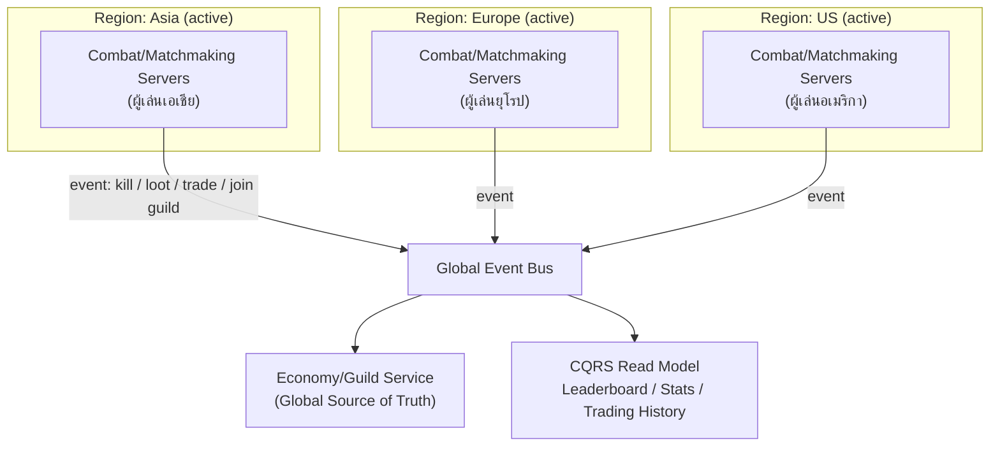

ลองนึกภาพวงดนตรีที่เริ่มเล่นแค่ผับเล็กๆ ในกรุงเทพฯ วันหนึ่งดังจนต้องจัดคอนเสิร์ตพร้อมกันคืนเดียวในสามทวีป — โตเกียว, ลอนดอน, และลอสแอนเจลิส แต่ละสนามนักดนตรีต้องเล่นสด แสง สี เสียง ต้องประสานกับคนหน้าเวทีในเสี้ยววินาที ดีเลย์ครึ่งวินาทีก็รู้สึกได้ทันที สิ่งที่เกิดขึ้น "บนเวที" ของแต่ละสนามจึงต้องเป็นเรื่องท้องถิ่นล้วนๆ

แต่ในอีกฝั่งหนึ่ง ระบบสะสมแต้มแฟนคลับ สิทธิ์ VIP และตลาดซื้อขายของสะสมที่แฟนคลับเทรดกันหลังคอนเสิร์ต ต้องนับรวมทั้งสามสนามเป็น**ความจริงหนึ่งเดียว** — แฟนคลับที่สะสมแต้มจนถึงระดับ Gold ที่โตเกียว ต้องได้สิทธิ์เดียวกันเป๊ะเมื่อไปดูต่อที่ลอนดอน ระบบแต้มนี้ไม่ต้องอัปเดตเร็วเท่าจังหวะดนตรีบนเวที (ช้าไปสองสามวินาทีไม่มีใครว่า) แต่ห้ามแยกเป็นสามระบบตามสามสนามเด็ดขาด

เกมออนไลน์ที่โตจากฮิตระดับภูมิภาคไปเป็นแพลตฟอร์มระดับโลกเจอโจทย์เดียวกันเป๊ะ — การต่อสู้กันสดของผู้เล่น (combat, matchmaking) ต้อง "ท้องถิ่น" เหมือนสนามคอนเสิร์ต เพราะ latency แค่ร้อยกว่ามิลลิวินาทีก็ทำให้เกม feel ผิดทันที แต่กิลด์ การเทรดไอเทม และ leaderboard ต้องเป็นความจริงเดียวข้ามทุกภูมิภาค เหมือนระบบแต้มแฟนคลับที่นับรวมทุกสนาม นี่คือโจทย์ของ <mark class="hl-term">**สถาปัตยกรรม Backend เกมระดับ Global Scale**</mark> ที่ต้องตัดสินใจว่าอะไรควรกระจายอยู่ท้องถิ่น และอะไรควรรวมศูนย์เป็นความจริงเดียว

## Requirement คร่าวๆ

- ผู้เล่นกระจายทั่วโลก (เอเชีย, ยุโรป, อเมริกา) การต่อสู้/แมตช์เมกกิ้งต้อง latency ต่ำพอให้เล่นแบบ real-time ได้จริง
- Live event ระดับโลก (world-boss) ที่ผู้เล่นหลายพันคนใน region เดียวกันมารวมตัวพร้อมกันในไม่กี่นาที ต้องรับ traffic spike รุนแรงโดยไม่ล่ม
- กิลด์ การเทรดไอเทม และ leaderboard ต้องเป็นข้อมูลชุดเดียวที่สอดคล้องกันข้ามทุก region ห้ามมีชื่อกิลด์ซ้ำหรือยอดไอเทมไม่ตรงกันเพราะแยกเก็บคนละ region
- ทีมพัฒนาที่โตจากทีมเดียวสิบกว่าคนเป็นหลายสิบคน ต้องแบ่งขอบเขตความรับผิดชอบชัดเจน ไม่ให้ทีมเดียวต้องแบกรับทุกส่วนของระบบ

## แยก Combat ให้ Region-Local, แยก Economy ให้ Global: โมดูล 18 (Deployment & Infra Architecture)

จากโมดูล 18 เรื่อง multi-region deployment — ไม่ใช่ทุกข้อมูลในแพลตฟอร์มเดียวกันต้องเลือก topology เดียวกัน ฝั่ง **combat/matchmaking** ควร deploy แบบ <mark class="hl-term">**Active-Active**</mark> ในทุก region จริงๆ ผู้เล่นถูก route ไป region ที่ใกล้ที่สุดเสมอ แต่ละแมตช์จบในตัวเองภายใน region เดียว ไม่ต้องรู้จักหรือ sync กับ region อื่นเลย เพราะแมตช์ของผู้เล่นเอเชียกับแมตช์ของผู้เล่นยุโรปไม่เคยเกี่ยวข้องกัน

ฝั่ง **Guild/Economy** กลับตรงข้าม — กิลด์และการเทรดไอเทมต้องมี**แหล่งความจริงเดียว**ที่ทุก region เห็นตรงกัน ถ้าปล่อยให้แต่ละ region เก็บข้อมูลกิลด์แยกกันเอง (sharded ต่อ region ล้วนๆ) จะเจอปัญหาทันทีที่ผู้เล่นสอง region สร้างกิลด์ชื่อเดียวกัน หรือเทรดไอเทมชิ้นเดียวกันซ้ำสองครั้งจากสอง region ที่ไม่รู้จักกัน จึงต้องมี Economy/Guild Service ที่เป็น global source of truth ตัวเดียว รับ write จากทุก region เข้ามารวมศูนย์



<mark class="hl-insight">หลักการคือ ยิ่งข้อมูลเกี่ยวกับ "เวลาจริงตรงหน้า" มากเท่าไหร่ ยิ่งควรกระจายอยู่ท้องถิ่น (region-local, Active-Active) ยิ่งข้อมูลเป็น "บันทึกความจริงที่ต้องใช้ร่วมกันข้ามคน" มากเท่าไหร่ ยิ่งต้องรวมศูนย์เป็นแหล่งเดียว</mark> — เหมือนที่โมดูล 18 สอนว่า topology ไม่ใช่ตัวเลือกเดียวทั้งระบบ แต่เลือกได้ต่างกันตามลักษณะของข้อมูลแต่ละก้อน

## รับมือ World-Boss Spike ด้วย Container Orchestration: โมดูล 18 (Deployment & Infra Architecture)

world-boss event คือ traffic spike ที่รู้ล่วงหน้าได้ (ทีม Live-Ops ประกาศเวลาบอสตื่นล่วงหน้า) จากโมดูล 18 เรื่อง container orchestration — Platform team ตั้ง Kubernetes Horizontal Pod Autoscaler ให้ scale จำนวน combat server pod ของ region นั้นล่วงหน้าก่อนเวลาบอสตื่น (pre-scale ตามตารางกิจกรรม) แล้วปล่อยให้ self-healing และ autoscaling ที่เหลือทำงานต่อเองระหว่างอีเวนต์ ถ้า pod ไหนล่มกลางอีเวนต์ก็ถูกสร้างทดแทนอัตโนมัติทันทีโดยไม่ต้องมีคนมานั่งเฝ้า — ทีม Matchmaking/Combat ไม่จำเป็นต้องรู้รายละเอียดของ Kubernetes cluster เลยด้วยซ้ำ เพราะ Platform team ห่อหุ้มความซับซ้อนนี้ไว้ให้แล้ว

## Leaderboard และ Trading History เป็น CQRS Read Side: โมดูล 19 (CQRS & Event Sourcing)

จากโมดูล 19 — ฝั่ง **write model** คือ game server ของแต่ละ region ที่ประมวลผล command จริง (โจมตี, ปิดจ๊อบบอส, ปิดการเทรด) แล้วยืนยันผลทันทีกับผู้เล่นในแมตช์นั้น ทุกครั้งที่เกิดเหตุการณ์สำคัญ server จะปล่อย event (เช่น `BossDefeated`, `ItemTraded`, `GuildJoined`) เข้า Global Event Bus โดยไม่ต้องรอให้ region อื่นรับทราบก่อน ส่วนฝั่ง **read model** คือ leaderboard, player-stats และ trading-history ที่ subscribe event stream นี้แล้วสร้าง denormalized view แบบ global ขึ้นมาต่างหาก — เหมือนป้ายเมนูที่อัปเดตทีหลังสูตรอาหารในครัว

จุดสำคัญคือ read side นี้ scale ได้อิสระจาก combat server โดยสิ้นเชิง — ผู้เล่นเป็นล้านคนกดดู leaderboard พร้อมกันไม่กระทบ latency ของแมตช์ที่กำลังสู้กันสดอยู่เลย เพราะสองฝั่งไม่ได้ใช้ database เดียวกัน

```demo
component: StepThroughDiagram
props: {"steps":[{"label":"1. ผู้เล่นในโซนเอเชียปิดจ๊อบบอสโลก","detail":"Combat Server ประจำ region เอเชียเป็นคนตัดสินผลจริง (write model) ยืนยันกับผู้เล่นทันทีว่าใครได้ loot อะไร ไม่ต้องรอ region อื่น"},{"label":"2. Server ปล่อย event เข้า Global Event Bus","detail":"เหตุการณ์ BossDefeated และ LootAwarded ถูกส่งออกไปแบบ asynchronous โดยไม่บล็อกผู้เล่นที่กำลังเล่นอยู่ในแมตช์"},{"label":"3. CQRS Read Model รับ event มาประมวลผล","detail":"service ฝั่ง leaderboard/trading-history/player-stats (แยกจาก combat server) subscribe event stream นี้แล้วอัปเดต denormalized view ของตัวเอง"},{"label":"4. Leaderboard และประวัติการเทรดอัปเดตทั่วโลก","detail":"ผู้เล่นที่ยุโรปหรืออเมริกาเห็นอันดับใหม่และประวัติไอเทมที่เปลี่ยนหลังจากนั้นไม่กี่วินาที (eventual consistency) ไม่ใช่ทันทีเป๊ะ แต่ก็ไม่จำเป็นต้องทันทีเป๊ะด้วย"},{"label":"5. Combat server ของทุก region เดินหน้าต่อโดยไม่รอ","detail":"ต่างจาก guild/trading write ที่ต้องรอ Economy Service ยืนยัน combat server ไม่เคยต้องรอ read model ฝั่ง leaderboard เลย เพราะเป็นคนละเส้นทางข้อมูลกันโดยสิ้นเชิง"}]}
```

## ตารางเปรียบเทียบ: ข้อมูล Region-Local vs ข้อมูล Global

| ประเด็น | Combat / Matchmaking (Region-local) | Guild / Trading / Leaderboard (Global ผ่าน CQRS) |
|---|---|---|
| ตำแหน่ง deployment | Active-Active ทุก region ใกล้ผู้เล่นที่สุด | รวมศูนย์เป็น service เดียว (global source of truth) |
| น้ำหนักที่ให้ | Availability + latency ต่ำเป็นหลัก | Consistency ข้าม region เป็นหลัก |
| ถ้าข้อมูลไม่ตรงกันชั่วคราว | ไม่กระทบ เพราะแต่ละแมตช์จบในตัวเอง | <mark class="hl-warning">กิลด์ชื่อซ้ำหรือไอเทมถูกนับซ้ำ = ความเสียหายจริงที่ผู้เล่นรู้สึกได้</mark> |
| วิธี scale | เพิ่ม pod ต่อ region ตาม traffic (container orchestration) | scale เฉพาะฝั่ง read model โดยไม่แตะฝั่งเขียน |

## แบ่งทีมตาม Bounded Context ที่สถาปัตยกรรมกำหนดไว้แล้ว: โมดูล 20 (Team Topologies)

พอสามพาร์ทข้างบนแยกขอบเขตข้อมูลชัดแล้ว (combat region-local, economy global, leaderboard เป็น CQRS read side) โมดูล 20 สอนว่านี่คือจังหวะทำ **Inverse Conway Maneuver** — จัดโครงสร้างทีมให้ตรงกับขอบเขตที่สถาปัตยกรรมวางไว้ แทนที่จะปล่อยให้ทีมใหญ่ทีมเดียวสื่อสารกันมั่วจนโค้ดพันกันตาม Conway's Law โดยไม่ตั้งใจ

| ทีม | ประเภท (Team Topologies) | เป็นเจ้าของอะไร |
|---|---|---|
| Matchmaking/Combat | Stream-aligned | Combat server แบบ region-local ของแต่ละภูมิภาค |
| Guild/Social | Stream-aligned | Bounded context กิลด์และความสัมพันธ์ผู้เล่น |
| Economy/Trading | Stream-aligned | Write model การเทรด/กิลด์ และออกแบบ event ที่ทีมอื่นต้องปล่อยเข้า bus |
| Live-Ops | Stream-aligned | กำหนดเวลาและ reward ของ world-boss event ให้ตรงกันทุก region |
| Platform | Platform team | Kubernetes cluster และ multi-region deployment tooling แบบ self-service ให้ทุกทีมใช้เอง |

Economy/Trading team เป็นเจ้าของทั้ง write model และ **CQRS read model** ของ leaderboard/trading-history ไปพร้อมกัน เพราะเป็นทีมที่รู้ดีที่สุดว่า event ไหนควรมีความหมายอะไร ส่วน Platform team ทำหน้าที่ดูดซับ cognitive load ด้าน infrastructure ออกจากทีมอื่นทั้งหมด ตรงกับที่โมดูล 20 อธิบายไว้ว่า platform team มีไว้ให้ทีม stream-aligned โฟกัสกับ domain ธุรกิจของตัวเองเต็มที่

<mark class="hl-warning">ข้อควรระวังคืออย่าเพิ่งแบ่งทีมละเอียดขนาดนี้ตั้งแต่วันที่ยังเป็นทีมเดียวสิบกว่าคน</mark> — Inverse Conway Maneuver คุ้มค่าเมื่อขอบเขต bounded context (อย่างที่วางไว้ข้างบน) นิ่งพอแล้วเท่านั้น ถ้ายังไม่แน่ใจว่า Guild กับ Economy ควรแยกกันจริงไหม การจัดทีมแยกไปก่อนจะสร้างต้นทุนประสานงานข้ามทีมที่ไม่จำเป็น

## ADR ตัวอย่าง

> **Title:** แยก Data Ownership ตาม Bounded Context และจัดทีมตามขอบเขตเดียวกัน สำหรับเกมออนไลน์ระดับ Global Scale
> **Status:** Accepted
> **Context:** เกมโตจากฮิตระดับภูมิภาคเป็นแพลตฟอร์มระดับโลก มีผู้เล่นกระจายหลายทวีป มี live event (world-boss) ที่สร้าง traffic spike รุนแรง และมีกิลด์/การเทรดไอเทมที่ต้องสอดคล้องกันข้าม region ขณะที่ทีมพัฒนาก็โตจากทีมเดียวเป็นหลายสิบคนพร้อมกัน
> **Decision:** deploy combat/matchmaking server แบบ Active-Active ต่อ region พร้อม autoscale ด้วย Kubernetes รอบ live event ส่วน guild/economy/การเทรดรวมศูนย์เป็น global service เดียว โดยทุก region ปล่อย event เข้า Global Event Bus ให้ CQRS read model สร้าง leaderboard/stats/trading-history แบบ global แยกจากฝั่งเขียน และจัดทีมวิศวกรรมเป็น Matchmaking, Guild/Social, Economy/Trading, Live-Ops แบบ stream-aligned พร้อม Platform team ดูแล infra ให้ทุกทีม
> **Consequences:** การต่อสู้สดยัง responsive ทุก region เพราะไม่ต้องรอ sync ข้ามทวีป ข้อมูลกิลด์/การเทรดไม่ขัดแย้งกันเพราะมีความจริงเดียว และ leaderboard scale ได้อิสระจาก combat แต่ทีมต้องยอมรับ eventual consistency ระดับวินาทีบน leaderboard/stats ต้องลงทุนดูแล event bus เพิ่มเติม และการจัดทีมใหม่ตามขอบเขตนี้ต้องใช้เวลาราวหนึ่งไตรมาสกว่าจะทำงานคล่องตัวเต็มที่
