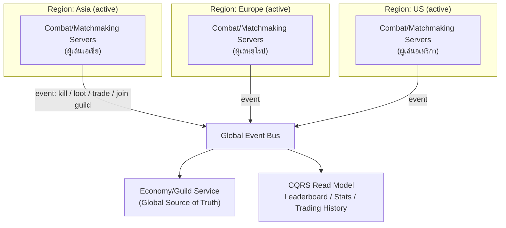
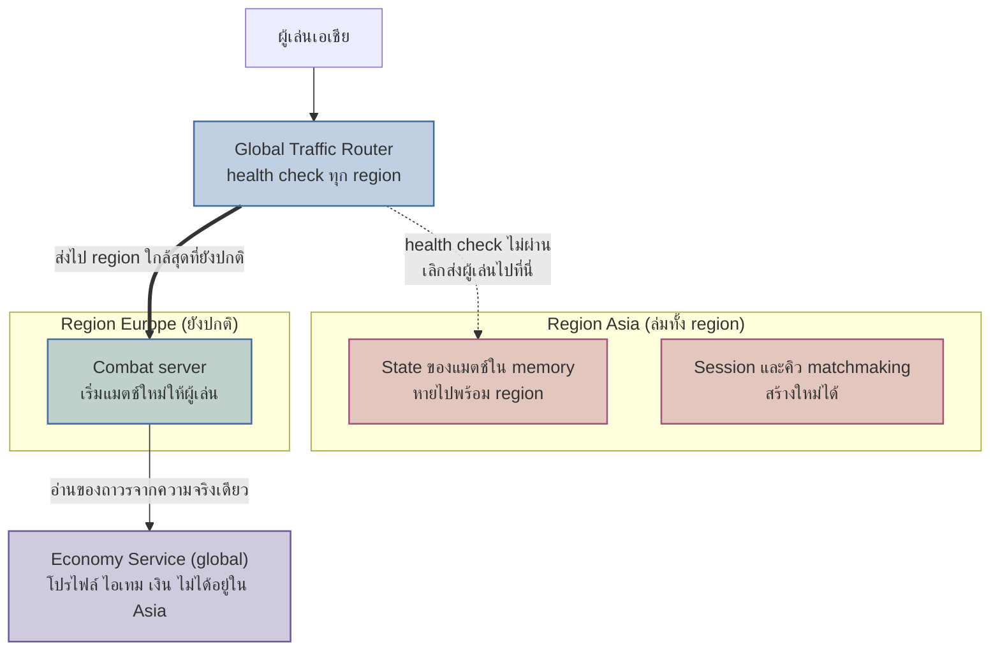
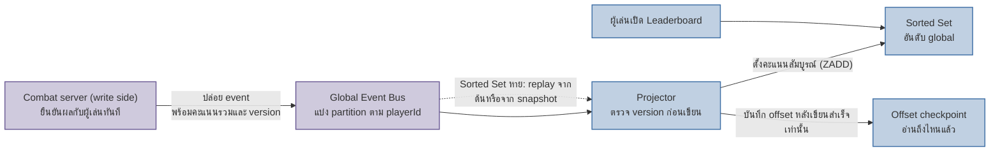
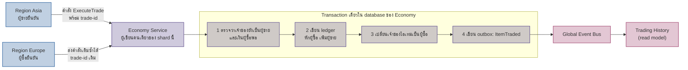
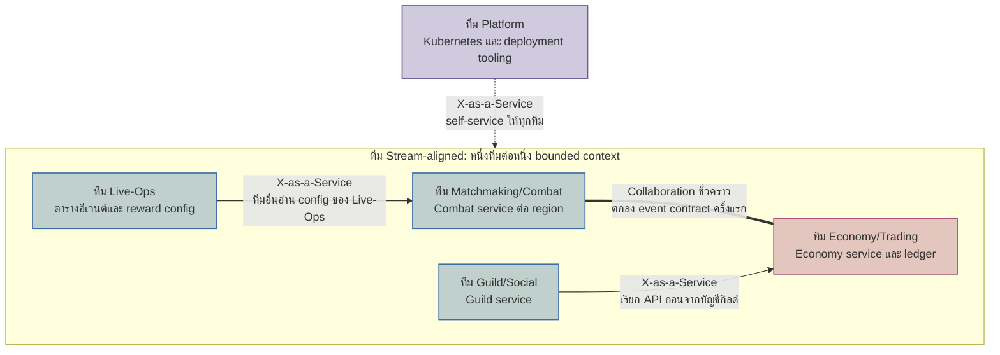

ลองนึกภาพวงดนตรีที่เริ่มเล่นแค่ผับเล็กๆ ในกรุงเทพฯ วันหนึ่งดังจนต้องจัดคอนเสิร์ตพร้อมกันคืนเดียวในสามทวีป — โตเกียว, ลอนดอน, และลอสแอนเจลิส แต่ละสนามนักดนตรีต้องเล่นสด แสง สี เสียง ต้องประสานกับคนหน้าเวทีในเสี้ยววินาที ดีเลย์ครึ่งวินาทีก็รู้สึกได้ทันที สิ่งที่เกิดขึ้น "บนเวที" ของแต่ละสนามจึงต้องเป็นเรื่องท้องถิ่นล้วนๆ

แต่ในอีกฝั่งหนึ่ง ระบบสะสมแต้มแฟนคลับ สิทธิ์ VIP และตลาดซื้อขายของสะสมที่แฟนคลับเทรดกันหลังคอนเสิร์ต ต้องนับรวมทั้งสามสนามเป็น**ความจริงหนึ่งเดียว** — แฟนคลับที่สะสมแต้มจนถึงระดับ Gold ที่โตเกียว ต้องได้สิทธิ์เดียวกันเป๊ะเมื่อไปดูต่อที่ลอนดอน ระบบแต้มนี้ไม่ต้องอัปเดตเร็วเท่าจังหวะดนตรีบนเวที (ช้าไปสองสามวินาทีไม่มีใครว่า) แต่ห้ามแยกเป็นสามระบบตามสามสนามเด็ดขาด

เกมออนไลน์ที่โตจากฮิตระดับภูมิภาคไปเป็นแพลตฟอร์มระดับโลกเจอโจทย์เดียวกันเป๊ะ — การต่อสู้กันสดของผู้เล่น (combat, matchmaking) ต้อง "ท้องถิ่น" เหมือนสนามคอนเสิร์ต เพราะ latency แค่ร้อยกว่ามิลลิวินาทีก็ทำให้เกม feel ผิดทันที แต่กิลด์ การเทรดไอเทม และ leaderboard ต้องเป็นความจริงเดียวข้ามทุกภูมิภาค เหมือนระบบแต้มแฟนคลับที่นับรวมทุกสนาม นี่คือโจทย์ของ <mark class="hl-term">**สถาปัตยกรรม Backend เกมระดับ Global Scale**</mark> ที่ต้องตัดสินใจว่าอะไรควรกระจายอยู่ท้องถิ่น และอะไรควรรวมศูนย์เป็นความจริงเดียว

## Requirement คร่าวๆ

- ผู้เล่นกระจายทั่วโลก (เอเชีย, ยุโรป, อเมริกา) การต่อสู้/แมตช์เมกกิ้งต้อง latency ต่ำพอให้เล่นแบบ real-time ได้จริง
- Live event ระดับโลก (world-boss) ที่ผู้เล่นหลายพันคนใน region เดียวกันมารวมตัวพร้อมกันในไม่กี่นาที ต้องรับ traffic spike รุนแรงโดยไม่ล่ม
- กิลด์ การเทรดไอเทม และ leaderboard ต้องเป็นข้อมูลชุดเดียวที่สอดคล้องกันข้ามทุก region ห้ามมีชื่อกิลด์ซ้ำหรือยอดไอเทมไม่ตรงกันเพราะแยกเก็บคนละ region
- ทีมพัฒนาที่โตจากทีมเดียวสิบกว่าคนเป็นหลายสิบคน ต้องแบ่งขอบเขตความรับผิดชอบชัดเจน ไม่ให้ทีมเดียวต้องแบกรับทุกส่วนของระบบ

## แยก Combat ให้ Region-Local, แยก Economy ให้ Global: โมดูล 18 (Deployment & Infra Architecture)

จากโมดูล 18 เรื่อง multi-region deployment — ไม่ใช่ทุกข้อมูลในแพลตฟอร์มเดียวกันต้องเลือก topology เดียวกัน ฝั่ง **combat/matchmaking** ควร deploy แบบ <mark class="hl-term">**Active-Active**</mark> ในทุก region จริงๆ ผู้เล่นถูก route ไป region ที่ใกล้ที่สุดเสมอ แต่ละแมตช์จบในตัวเองภายใน region เดียว ไม่ต้องรู้จักหรือ sync กับ region อื่นเลย เพราะแมตช์ของผู้เล่นเอเชียกับแมตช์ของผู้เล่นยุโรปไม่เคยเกี่ยวข้องกัน

ฝั่ง **Guild/Economy** กลับตรงข้าม — กิลด์และการเทรดไอเทมต้องมี**แหล่งความจริงเดียว**ที่ทุก region เห็นตรงกัน ถ้าปล่อยให้แต่ละ region เก็บข้อมูลกิลด์แยกกันเอง (sharded ต่อ region ล้วนๆ) จะเจอปัญหาทันทีที่ผู้เล่นสอง region สร้างกิลด์ชื่อเดียวกัน หรือเทรดไอเทมชิ้นเดียวกันซ้ำสองครั้งจากสอง region ที่ไม่รู้จักกัน จึงต้องมี Economy/Guild Service ที่เป็น global source of truth ตัวเดียว รับ write จากทุก region เข้ามารวมศูนย์


```mermaid
flowchart TB
    subgraph Asia["Region: Asia (active)"]
        CA["Combat/Matchmaking Servers<br/>(ผู้เล่นเอเชีย)"]
    end
    subgraph EU["Region: Europe (active)"]
        CE["Combat/Matchmaking Servers<br/>(ผู้เล่นยุโรป)"]
    end
    subgraph US["Region: US (active)"]
        CU["Combat/Matchmaking Servers<br/>(ผู้เล่นอเมริกา)"]
    end
    CA -->|"event: kill / loot / trade / join guild"| BUS["Global Event Bus"]
    CE -->|"event"| BUS
    CU -->|"event"| BUS
    BUS --> ECON["Economy/Guild Service<br/>(Global Source of Truth)"]
    BUS --> READ["CQRS Read Model<br/>Leaderboard / Stats / Trading History"]
```

<mark class="hl-insight">หลักการคือ ยิ่งข้อมูลเกี่ยวกับ "เวลาจริงตรงหน้า" มากเท่าไหร่ ยิ่งควรกระจายอยู่ท้องถิ่น (region-local, Active-Active) ยิ่งข้อมูลเป็น "บันทึกความจริงที่ต้องใช้ร่วมกันข้ามคน" มากเท่าไหร่ ยิ่งต้องรวมศูนย์เป็นแหล่งเดียว</mark> — เหมือนที่โมดูล 18 สอนว่า topology ไม่ใช่ตัวเลือกเดียวทั้งระบบ แต่เลือกได้ต่างกันตามลักษณะของข้อมูลแต่ละก้อน

## รับมือ World-Boss Spike ด้วย Container Orchestration: โมดูล 18 (Deployment & Infra Architecture)

world-boss event คือ traffic spike ที่รู้ล่วงหน้าได้ (ทีม Live-Ops ประกาศเวลาบอสตื่นล่วงหน้า) จากโมดูล 18 เรื่อง container orchestration — Platform team ตั้ง Kubernetes Horizontal Pod Autoscaler ให้ scale จำนวน combat server pod ของ region นั้นล่วงหน้าก่อนเวลาบอสตื่น (pre-scale ตามตารางกิจกรรม) แล้วปล่อยให้ self-healing และ autoscaling ที่เหลือทำงานต่อเองระหว่างอีเวนต์ ถ้า pod ไหนล่มกลางอีเวนต์ก็ถูกสร้างทดแทนอัตโนมัติทันทีโดยไม่ต้องมีคนมานั่งเฝ้า — ทีม Matchmaking/Combat ไม่จำเป็นต้องรู้รายละเอียดของ Kubernetes cluster เลยด้วยซ้ำ เพราะ Platform team ห่อหุ้มความซับซ้อนนี้ไว้ให้แล้ว

## Leaderboard และ Trading History เป็น CQRS Read Side: โมดูล 19 (CQRS & Event Sourcing)

จากโมดูล 19 — ฝั่ง **write model** คือ game server ของแต่ละ region ที่ประมวลผล command จริง (โจมตี, ปิดจ๊อบบอส, ปิดการเทรด) แล้วยืนยันผลทันทีกับผู้เล่นในแมตช์นั้น ทุกครั้งที่เกิดเหตุการณ์สำคัญ server จะปล่อย event (เช่น `BossDefeated`, `ItemTraded`, `GuildJoined`) เข้า Global Event Bus โดยไม่ต้องรอให้ region อื่นรับทราบก่อน ส่วนฝั่ง **read model** คือ leaderboard, player-stats และ trading-history ที่ subscribe event stream นี้แล้วสร้าง denormalized view แบบ global ขึ้นมาต่างหาก — เหมือนป้ายเมนูที่อัปเดตทีหลังสูตรอาหารในครัว

จุดสำคัญคือ read side นี้ scale ได้อิสระจาก combat server โดยสิ้นเชิง — ผู้เล่นเป็นล้านคนกดดู leaderboard พร้อมกันไม่กระทบ latency ของแมตช์ที่กำลังสู้กันสดอยู่เลย เพราะสองฝั่งไม่ได้ใช้ database เดียวกัน

```demo
component: StepThroughDiagram
props: {"steps":[{"label":"1. ผู้เล่นในโซนเอเชียปิดจ๊อบบอสโลก","detail":"Combat Server ประจำ region เอเชียเป็นคนตัดสินผลจริง (write model) ยืนยันกับผู้เล่นทันทีว่าใครได้ loot อะไร ไม่ต้องรอ region อื่น"},{"label":"2. Server ปล่อย event เข้า Global Event Bus","detail":"เหตุการณ์ BossDefeated และ LootAwarded ถูกส่งออกไปแบบ asynchronous โดยไม่บล็อกผู้เล่นที่กำลังเล่นอยู่ในแมตช์"},{"label":"3. CQRS Read Model รับ event มาประมวลผล","detail":"service ฝั่ง leaderboard/trading-history/player-stats (แยกจาก combat server) subscribe event stream นี้แล้วอัปเดต denormalized view ของตัวเอง"},{"label":"4. Leaderboard และประวัติการเทรดอัปเดตทั่วโลก","detail":"ผู้เล่นที่ยุโรปหรืออเมริกาเห็นอันดับใหม่และประวัติไอเทมที่เปลี่ยนหลังจากนั้นไม่กี่วินาที (eventual consistency) ไม่ใช่ทันทีเป๊ะ แต่ก็ไม่จำเป็นต้องทันทีเป๊ะด้วย"},{"label":"5. Combat server ของทุก region เดินหน้าต่อโดยไม่รอ","detail":"ต่างจาก guild/trading write ที่ต้องรอ Economy Service ยืนยัน combat server ไม่เคยต้องรอ read model ฝั่ง leaderboard เลย เพราะเป็นคนละเส้นทางข้อมูลกันโดยสิ้นเชิง"}]}
```

## ตารางเปรียบเทียบ: ข้อมูล Region-Local vs ข้อมูล Global

| ประเด็น | Combat / Matchmaking (Region-local) | Guild / Trading / Leaderboard (Global ผ่าน CQRS) |
|---|---|---|
| ตำแหน่ง deployment | Active-Active ทุก region ใกล้ผู้เล่นที่สุด | รวมศูนย์เป็น service เดียว (global source of truth) |
| น้ำหนักที่ให้ | Availability + latency ต่ำเป็นหลัก | Consistency ข้าม region เป็นหลัก |
| ถ้าข้อมูลไม่ตรงกันชั่วคราว | ไม่กระทบ เพราะแต่ละแมตช์จบในตัวเอง | <mark class="hl-warning">กิลด์ชื่อซ้ำหรือไอเทมถูกนับซ้ำ = ความเสียหายจริงที่ผู้เล่นรู้สึกได้</mark> |
| วิธี scale | เพิ่ม pod ต่อ region ตาม traffic (container orchestration) | scale เฉพาะฝั่ง read model โดยไม่แตะฝั่งเขียน |

## แบ่งทีมตาม Bounded Context ที่สถาปัตยกรรมกำหนดไว้แล้ว: โมดูล 20 (Team Topologies)

พอสามพาร์ทข้างบนแยกขอบเขตข้อมูลชัดแล้ว (combat region-local, economy global, leaderboard เป็น CQRS read side) โมดูล 20 สอนว่านี่คือจังหวะทำ **Inverse Conway Maneuver** — จัดโครงสร้างทีมให้ตรงกับขอบเขตที่สถาปัตยกรรมวางไว้ แทนที่จะปล่อยให้ทีมใหญ่ทีมเดียวสื่อสารกันมั่วจนโค้ดพันกันตาม Conway's Law โดยไม่ตั้งใจ

| ทีม | ประเภท (Team Topologies) | เป็นเจ้าของอะไร |
|---|---|---|
| Matchmaking/Combat | Stream-aligned | Combat server แบบ region-local ของแต่ละภูมิภาค |
| Guild/Social | Stream-aligned | Bounded context กิลด์และความสัมพันธ์ผู้เล่น |
| Economy/Trading | Stream-aligned | Write model การเทรด/กิลด์ และออกแบบ event ที่ทีมอื่นต้องปล่อยเข้า bus |
| Live-Ops | Stream-aligned | กำหนดเวลาและ reward ของ world-boss event ให้ตรงกันทุก region |
| Platform | Platform team | Kubernetes cluster และ multi-region deployment tooling แบบ self-service ให้ทุกทีมใช้เอง |

Economy/Trading team เป็นเจ้าของทั้ง write model และ **CQRS read model** ของ leaderboard/trading-history ไปพร้อมกัน เพราะเป็นทีมที่รู้ดีที่สุดว่า event ไหนควรมีความหมายอะไร ส่วน Platform team ทำหน้าที่ดูดซับ cognitive load ด้าน infrastructure ออกจากทีมอื่นทั้งหมด ตรงกับที่โมดูล 20 อธิบายไว้ว่า platform team มีไว้ให้ทีม stream-aligned โฟกัสกับ domain ธุรกิจของตัวเองเต็มที่

<mark class="hl-warning">ข้อควรระวังคืออย่าเพิ่งแบ่งทีมละเอียดขนาดนี้ตั้งแต่วันที่ยังเป็นทีมเดียวสิบกว่าคน</mark> — Inverse Conway Maneuver คุ้มค่าเมื่อขอบเขต bounded context (อย่างที่วางไว้ข้างบน) นิ่งพอแล้วเท่านั้น ถ้ายังไม่แน่ใจว่า Guild กับ Economy ควรแยกกันจริงไหม การจัดทีมแยกไปก่อนจะสร้างต้นทุนประสานงานข้ามทีมที่ไม่จำเป็น

## คำถามเจาะลึกที่มักถูกถามต่อ

พออธิบายว่า combat อยู่ท้องถิ่น economy รวมศูนย์ และ leaderboard เป็น CQRS read side จบ คนสัมภาษณ์หรือเพื่อนร่วมทีมมักถามต่อว่า "ตอน region ล่มจริง หรือตอนสองที่แย่งเขียนของชิ้นเดียวกันจริง ข้างในมันทำงานยังไง" สี่คำถามด้านล่างจึงเน้นเรื่อง **เส้นแบ่งของข้อมูลและความเป็นเจ้าของ** ระดับสถาปัตยกรรม ไม่ลงไปที่กลไกของเกมแต่ละอย่าง (โจทย์เฉพาะจุดอย่าง "ผู้เล่นพันคนแย่งไอเทมชิ้นเดียวหลังบอสตาย ใครกดก่อนได้ก่อน" เป็นของ Design: Boss Loot Race ในโมดูล Case Studies ของ System Design ที่นี่ไม่พูดซ้ำ)

### Q1: ถ้า region เอเชียล่มทั้ง region กลางดึก ผู้เล่นที่กำลังสู้อยู่จะเป็นยังไง และถูกย้ายไป region อื่นได้ยังไง

**ใช้ความรู้อะไร:** โมดูล 18 (Multi-Region Deployment — Active-Active ที่ทุก region รับ traffic จริง) บวกโมดูล 15 (Bounded Context — ข้อมูลแต่ละก้อนมีเจ้าของและ "บ้าน" ของมันเอง) บวกหัวข้อ Multi-Region Active-Active และ Retry & Backoff ในโมดูล Reliability ของ System Design

**นึกภาพก่อน:** กลับไปที่คอนเสิร์ต ถ้าไฟดับทั้งสนามที่โตเกียวกลางเพลง เพลงที่กำลังเล่นสดต้องหยุดและเริ่มใหม่ในสนามที่ยังมีไฟ แต่แต้มสะสม สิทธิ์ VIP และของสะสมของแฟนคลับไม่หายไปด้วย เพราะไม่เคยถูกเก็บไว้ที่สนามโตเกียว แต่อยู่ในระบบกลาง คำถามที่ต้องตอบตอนออกแบบจึงเป็นว่า ข้อมูลอะไร "ผูกกับสนาม" (หายได้) และอะไร "ห้ามผูกกับสนาม" (ห้ามหาย)

**แก้ปัญหายังไง:** แยกข้อมูลของผู้เล่นเป็นสามชั้นตามว่า "ถ้าหายแล้วเสียหายแค่ไหน" แล้วออกแบบให้ region ล่มแล้วเสียได้แค่สองชั้นบน:

1. **State ของแมตช์ที่กำลังเล่น** (ตำแหน่ง, พลังชีวิต, เวลาที่เหลือ) อยู่ใน memory ของ combat server ใน region เท่านั้น หายพร้อม region ได้ เพราะแมตช์ยังไม่จบ ยังไม่มีของมีค่าเกิดขึ้นจริง
2. **State ท้องถิ่นที่สร้างใหม่ได้** เช่น session, คิว matchmaking, ที่อยู่ game server ปัจจุบัน หายก็แค่ login และเข้าคิวใหม่
3. **ข้อมูลถาวร** (โปรไฟล์, ไอเทม, เงิน, กิลด์) อยู่ที่ Economy/Guild Service ระดับ global ไม่เคยอยู่เฉพาะใน region เดียว และผลของแมตช์ (รางวัล) ถูก commit ที่นั่นก่อนจึงจะนับว่ามีผล

<mark class="hl-insight">คำว่า region-local หมายถึง "หายได้โดยไม่มีใครเสียหายจริง" ส่วนของที่ห้ามหายต้องไปอยู่ในความจริงเดียวก่อนที่ผู้เล่นจะรู้สึกว่ามัน "เกิดขึ้นแล้ว"</mark>


```mermaid
flowchart TB
    P["ผู้เล่นเอเชีย"] --> RT["Global Traffic Router<br/>health check ทุก region"]
    subgraph Asia["Region Asia (ล่มทั้ง region)"]
        M1["State ของแมตช์ใน memory<br/>หายไปพร้อม region"]
        S1["Session และคิว matchmaking<br/>สร้างใหม่ได้"]
    end
    subgraph EU["Region Europe (ยังปกติ)"]
        M2["Combat server<br/>เริ่มแมตช์ใหม่ให้ผู้เล่น"]
    end
    ECON["Economy Service (global)<br/>โปรไฟล์ ไอเทม เงิน ไม่ได้อยู่ใน Asia"]
    RT -.->|"health check ไม่ผ่าน<br/>เลิกส่งผู้เล่นไปที่นี่"| M1
    RT ==>|"ส่งไป region ใกล้สุดที่ยังปกติ"| M2
    M2 -->|"อ่านของถาวรจากความจริงเดียว"| ECON

    classDef lost fill:#a8527a52,stroke:#a8527a,stroke-width:1.5px
    classDef ok fill:#3d6ea552,stroke:#3d6ea5,stroke-width:1.5px
    classDef global fill:#6b5b9552,stroke:#6b5b95,stroke-width:1.5px
    class M1,S1 lost
    class RT,M2 ok
    class ECON global
```

```demo
component: JourneyDiagram
props: {"nodes":[{"icon":"person","label":"ผู้เล่นเอเชีย"},{"icon":"gate","label":"Global Traffic Router"},{"icon":"building","label":"Region Asia (ล่ม)"},{"icon":"building","label":"Region Europe"},{"icon":"notebook","label":"Economy Service (global)"}],"travelerIcon":"envelope","steps":[{"activeNode":0,"caption":"ผู้เล่นกำลังสู้ในแมตช์ที่ region เอเชีย ทุกอย่างปกติ"},{"activeNode":2,"caption":"Region เอเชียล่มทั้ง region — state ของแมตช์ใน memory หายไปพร้อมกัน แมตช์จบกลางคันและยังไม่มีรางวัลถูก commit"},{"activeNode":1,"caption":"Router ตรวจสุขภาพ region เอเชียไม่ผ่านต่อเนื่อง จึงเอาออกจากรายชื่อปลายทางและชี้ไป region ที่ใกล้สุดที่ยังปกติ"},{"activeNode":0,"caption":"Client ต่อเข้าใหม่แบบหน่วงเวลาสุ่ม (ไม่รัวพร้อมกันทั้ง region) พร้อม session token ที่ region ไหนก็ตรวจลายเซ็นได้"},{"activeNode":4,"caption":"Region ยุโรปดึงโปรไฟล์ ไอเทม และเงินของผู้เล่นจาก Economy Service ที่เป็นความจริงเดียว — ของถาวรไม่เคยอยู่แค่ในเอเชียจึงไม่หาย"},{"activeNode":3,"caption":"ผู้เล่นเข้าคิว matchmaking และเริ่มแมตช์ใหม่ที่ยุโรป ด้วย latency ที่สูงกว่าเดิม แต่เล่นต่อได้"}]}
```

**ข้างใต้ทำงานยังไง:** มีสี่อย่างทำงานต่อกัน หนึ่ง <mark class="hl-term">**Global Traffic Router**</mark> (ตัวกระจายผู้เล่นระดับโลก) ตรวจสุขภาพ (health check) ของแต่ละ region เป็นระยะ เมื่อ region ไหนไม่ผ่านต่อเนื่องเกินเกณฑ์ที่ตั้งไว้ ก็เอาออกจากรายชื่อปลายทาง เกณฑ์ต้องไม่ไวจน region ที่แค่กระตุกถูกตัดทิ้ง และไม่ช้าจนผู้เล่นค้างนาน สอง ผู้เล่นส่วนใหญ่ต่อเข้าเกมผ่าน login หรือ matchmaking endpoint ก่อน แล้วค่อยได้รับที่อยู่ game server ที่จะเล่นจริง จึง redirect ไป region ใหม่ได้ตอนต่อเข้าใหม่ (ถ้าพึ่ง DNS ซึ่งเป็นระบบแปลงชื่อโดเมนเป็นที่อยู่ IP อย่างเดียว การสลับอาจช้าตามอายุ cache ที่ค้างอยู่บนเครื่องผู้เล่น) สาม session token ที่ลงลายเซ็นดิจิทัลไว้ ทุก region ตรวจได้เองโดยไม่ต้องถามกลับ region เดิมที่ตายไปแล้ว สี่ region ปลายทางไม่ได้ "กู้" แมตช์เดิมขึ้นมา แต่อ่านโปรไฟล์ ไอเทม เงินของผู้เล่นจาก Economy Service แล้วสร้างแมตช์ใหม่ ส่วนรางวัลของแมตช์ที่จบก่อน region ล่ม คำสั่งให้รางวัลแนบ match-id เป็น idempotency key (หมายเลขกำกับที่ส่งซ้ำกี่รอบผลก็เหมือนครั้งเดียว) ถ้าคำสั่งไปถึง Economy แล้วแต่ region ตายก่อนได้รับคำตอบ Economy จำ match-id นั้นได้ จึงไม่มีทางแจกซ้ำ

**ถ้าพังหรือมีข้อควรระวังอะไร:**

- <mark class="hl-warning">ผู้เล่นทั้ง region ต่อเข้า region ที่เหลือพร้อมกัน (reconnect storm) อาจถล่ม login จนล่มซ้ำอีกรอบ</mark> — ต้องให้ client ลองใหม่แบบ exponential backoff พร้อมหน่วงเวลาสุ่ม (jitter) และมี rate limit ที่ login ตามโมดูล Reliability บทเรียนจริงเรื่องนี้อยู่ที่ "Slack Reconnect พร้อมกันทั่วโลก" ในโมดูล Case Studies ของ System Design
- **region ที่เหลือต้องมีที่ว่างรอไว้ก่อนเกิดเหตุ** — autoscaling ตามหลัง load อยู่เสมอ และ region ล่มเกิดโดยไม่มีใครประกาศล่วงหน้า ไม่เหมือน world-boss ที่ pre-scale ตามตารางได้ จึงต้องยอมจ่ายค่าเครื่องเผื่อเป็นต้นทุนของความพร้อม
- **ผู้เล่นเอเชียไปเล่นบน server ยุโรป ping สูงขึ้นชัดเจน** — ไม่มีคำตอบเดียว บางเกมยอมให้เล่นต่อแบบแจ้งเตือน บางเกมปิดโหมดแข่งขันชั่วคราวเพื่อความยุติธรรม
- **region ที่ "ช้าผิดปกติแต่ยังไม่ตาย" ตัดสินยากกว่า region ที่ตายสนิท** — health check ควรวัดสิ่งที่ผู้เล่นรู้สึกจริง เช่น เวลาตอบของ login ไม่ใช่แค่ดูว่า process ยังรันอยู่

### Q2: Leaderboard ที่ "ช้ากว่าความจริงไม่กี่วินาที" ถูกสร้างขึ้นจริงๆ ยังไง และทำไมช้าแล้วไม่เสียหาย

**ใช้ความรู้อะไร:** โมดูล 19 (CQRS + Event Sourcing ร่วมกัน — Projector ฟัง event แล้วสร้าง Read Model และ replay ย้อนหลังได้) บวกโมดูล Async & Messaging (at-least-once delivery) กับหัวข้อ Idempotency ในโมดูล Reliability ของ System Design และโจทย์ Design: Leaderboard เกมแบบ Real-time ในโมดูล Case Studies ที่สอน Sorted Set ไว้แล้ว ข้อนี้ถามต่อว่า "อะไรป้อนข้อมูลให้ Sorted Set ตัวนั้นข้าม region"

**นึกภาพก่อน:** ป้ายคะแนนในสนามกีฬา กรรมการในสนามจดผลลงใบบันทึกก่อน (นั่นคือความจริง) พนักงานป้ายอ่านใบบันทึกแล้วเปลี่ยนตัวเลข ป้ายช้ากว่าสนามสองสามวินาทีไม่มีใครเสียหาย แต่ถ้าใบเดียวกันถูกส่งมาซ้ำแล้วพนักงานบวกคะแนนซ้ำสองรอบ หรือใบมาสลับลำดับแล้วคะแนนถอยหลัง ป้ายจะผิดจนกว่าจะมีคนมาแก้ ปัญหาจริงจึงไม่ใช่ "ช้า" แต่คือ "ป้ายต้องอ่านใบซ้ำหรือสลับลำดับได้โดยไม่เพี้ยน"

**แก้ปัญหายังไง:** ทำเป็นสี่ขั้น:

1. **ฝั่งเขียนปล่อย event** — combat server ยืนยันผลกับผู้เล่นก่อน แล้วปล่อย event (เช่น `BossDefeated`) เข้า Global Event Bus โดยไม่รอใคร event แนบ `playerId`, คะแนนรวมใหม่ของผู้เล่น และเลขลำดับ (version) ต่อผู้เล่นคนนั้น
2. **Bus แบ่ง partition ตาม playerId** — event ของผู้เล่นคนเดียวกันจึงถูกอ่านเรียงตามลำดับโดย consumer ตัวเดียว (การรับประกันลำดับมีเฉพาะภายใน partition ไม่ใช่ทั้ง bus)
3. **Projector ตรวจ version แล้วตั้งค่า** — ถ้า version ของ event ใหม่กว่าที่บันทึกไว้ ก็ตั้งคะแนนของผู้เล่นใน Sorted Set เป็น "ค่ารวมสัมบูรณ์" ไม่ใช่ "บวกเพิ่ม" ถ้าเก่ากว่าหรือเท่ากันก็ข้าม
4. **ผู้เล่นเปิด Leaderboard** — อ่านช่วงอันดับ (Top N หรืออันดับของตัวเอง) จาก Sorted Set ตรงๆ ไม่แตะ combat server หรือ Economy เลย

<mark class="hl-insight">โปรเจกเตอร์ที่ทนต่อ event ซ้ำ สลับ และตกหล่นได้ ไม่ใช่ตัวที่ "ไม่เคยรับ event ซ้ำ" แต่คือตัวที่ตั้งค่าแบบสัมบูรณ์พร้อมเลข version ทำให้ทำซ้ำกี่รอบผลก็เท่าเดิม</mark>


```mermaid
flowchart LR
    W["Combat server (write side)<br/>ยืนยันผลกับผู้เล่นทันที"] -->|"ปล่อย event<br/>พร้อมคะแนนรวมและ version"| BUS["Global Event Bus<br/>แบ่ง partition ตาม playerId"]
    BUS --> PJ["Projector<br/>ตรวจ version ก่อนเขียน"]
    PJ -->|"ตั้งคะแนนสัมบูรณ์ (ZADD)"| SS["Sorted Set<br/>อันดับ global"]
    PJ -->|"บันทึก offset หลังเขียนสำเร็จเท่านั้น"| OFF["Offset checkpoint<br/>อ่านถึงไหนแล้ว"]
    UI["ผู้เล่นเปิด Leaderboard"] --> SS
    BUS -.->|"Sorted Set หาย: replay จากต้นหรือจาก snapshot"| PJ

    classDef write fill:#6b5b9552,stroke:#6b5b95,stroke-width:1.5px
    classDef read fill:#3d6ea552,stroke:#3d6ea5,stroke-width:1.5px
    class W,BUS write
    class PJ,SS,OFF,UI read
```

```demo
component: ComparisonDiagram
props: {"left":{"title":"บวกคะแนนตามทุก event ที่ได้รับ","points":["ได้ event เดิมซ้ำ (at-least-once) คะแนนถูกบวกซ้ำ ผลเพี้ยนสะสมไปเรื่อยๆ","event ของผู้เล่นคนเดียวมาสลับลำดับ ผลสุดท้ายอาจผิด","projector crash กลางทาง ไม่รู้ว่า event นั้นบวกไปแล้วหรือยัง","แก้ทีหลังยาก ต้อง replay ทั้งหมดถึงจะได้ตัวเลขที่ถูก"]},"right":{"title":"ตรวจ version แล้วตั้งค่าคะแนนรวมแบบสัมบูรณ์","points":["event ซ้ำ: version เท่าเดิมถูกข้าม ผลไม่เปลี่ยน","event มาสลับ: version เก่ากว่าที่บันทึกไว้ถูกทิ้ง ไม่ดึงคะแนนถอยหลัง","crash แล้วอ่านซ้ำ: ทำซ้ำได้ ผลเท่าเดิมเสมอ","บันทึก offset หลังเขียนสำเร็จเท่านั้น ยอมทำซ้ำดีกว่าทำหาย"]},"note":"ทางเลือกอีกแบบคือให้ projector จำ eventId ทุกตัวที่เคยประมวลผลแล้วค่อยบวกเพิ่ม ใช้ได้เหมือนกัน แต่ต้องเก็บรายการ id ที่โตขึ้นเรื่อยๆ"}
```

**ข้างใต้ทำงานยังไง:** มีของสี่อย่างทำงานร่วมกัน หนึ่งคือ **bus ที่มี offset ต่อ partition** consumer จะบันทึก "อ่านถึงตำแหน่งไหนแล้ว" ไว้ (offset checkpoint) สองคือ **state ของ projector** เก็บ version ล่าสุดของผู้เล่นแต่ละคน สามคือ **Sorted Set** ที่อยู่ใน memory เป็นหลักจึงอ่านเร็วมาก และสี่คือตัวเลข <mark class="hl-term">**consumer lag**</mark> (ระยะห่างระหว่าง event ล่าสุดที่ถูกเขียนเข้า bus กับ event ที่ projector อ่านถึง) ซึ่งใช้แทนคำว่า "leaderboard ช้าแค่ไหน" ลำดับการทำงานต่อหนึ่ง event คือ อ่าน event → ตรวจ version → เขียน Sorted Set → บันทึก offset ถ้า crash ระหว่างเขียนกับบันทึก offset ก็จะอ่าน event เดิมซ้ำ แต่ตรวจ version แล้วข้าม ผลจึงเท่าเดิม (การตรวจ version กับการเขียนควรเป็นก้าวเดียวที่แบ่งแยกไม่ได้ เช่นสคริปต์ที่รันทีเดียวจบใน Redis) และถ้า Sorted Set หายทั้งก้อน ก็ย้าย offset กลับไปจุดเริ่ม (หรือจาก snapshot ล่าสุด ดูหัวข้อขั้นสูง: Event Versioning & Snapshotting ในโมดูล 19) แล้ว replay เพื่อสร้างใหม่ ทั้งนี้การ replay ได้ต้องมีที่เก็บ event ย้อนหลังจริง (Event Store ตามโมดูล 19 หรือ bus ที่เก็บ event นานพอ)

**ถ้าพังหรือมีข้อควรระวังอะไร:**

- <mark class="hl-warning">อย่าใช้ leaderboard สดเป็นเกณฑ์แจกรางวัลจริง</mark> — รางวัลปลายซีซันคือไอเทมและเงิน (มูลค่าจริง) ต้องคำนวณจากข้อมูลของ Economy ณ เวลาตัดที่กำหนด เพราะ leaderboard อาจล่าช้าหรือกำลังสร้างใหม่อยู่ตอนนั้น ความช้าไม่กี่วินาทีที่ไม่เสียหายใช้ได้เฉพาะกับ "หน้าจอที่ให้คนดู" ไม่ใช่ "ผลที่มีมูลค่า"
- **projector ตายหรือช้า** — leaderboard จะเก่าลงแต่ combat ไม่กระทบ เพราะเป็นคนละเส้นทางข้อมูล ควรตั้ง alert ที่ consumer lag และให้หน้าจอแสดงเวลา "อัปเดตล่าสุด" เพื่อไม่ให้ผู้เล่นเข้าใจผิดว่าระบบผิดพลาด
- **event เสียรูป (เช่น schema เปลี่ยนโดยไม่ได้แจ้ง)** — projector จะติดอยู่ที่ event นั้นซ้ำๆ (เรียกว่า poison message) partition นั้นหยุดทั้งหมด ต้องมีทางแยก event ที่ประมวลผลไม่ได้ไปเก็บในคิวแยก (dead-letter queue) แล้วเดินหน้าต่อพร้อมแจ้งคนตรวจ
- **ผู้เล่นเพิ่งชนะแต่อันดับยังไม่ขยับ** — เป็นเรื่องปกติของ eventual consistency ถ้าต้องการให้ผู้เล่นเห็นผลของตัวเองทันที ให้หน้าจอแสดงคะแนนจากผลแมตช์ที่เพิ่งได้รับตรงๆ ชั่วคราว ไม่ต้องรอผ่าน leaderboard

### Q3: ทำไมเงินและไอเทมต้องมี "ผู้เขียนคนเดียว" ทั้งที่ส่วนอื่นเป็น Active-Active และการเทรดข้าม region กันไอเทมซ้ำได้ยังไง

**ใช้ความรู้อะไร:** โมดูล 15 (Aggregate — กติกา "ไอเทมมีเจ้าของได้คนเดียว" ต้องถูกบังคับที่จุดเดียว) บวกโมดูล 16 (จุดที่ต้องเป็น Strong Consistency) บวกโมดูล 18 (Active-Active แลก consistency ตาม PACELC) บวกหัวข้อ Consensus & Leader Election ในโมดูล Database, Idempotency ในโมดูล Reliability, Distributed Transactions & Saga ในโมดูล Microservices & API Design และ Transactional Outbox ในหัวข้อ Message Queue ของโมดูล Async & Messaging (System Design) ส่วนเรื่องแย่งไอเทมหลังบอสตายว่าใครกดก่อน ให้ดู Design: Boss Loot Race ข้อนี้ถามหลังจากนั้น คือเมื่อไอเทมถือกำเนิดแล้ว ใครเป็นเจ้าของหนึ่งเดียวข้าม region

**ปัญหาคืออะไร:** ลองนึกภาพธนาคารสองสาขาที่ต่างคนต่างอนุมัติเช็คของบัญชีเดียวกันโดยไม่โทรถามกัน ทั้งสองเห็นว่ายอดพอ จึงจ่ายให้ทั้งคู่ ทีหลังส่งบัญชีมาเทียบกันถึงรู้ว่าจ่ายไปเกินที่มี ถ้า economy เป็น Active-Active ที่แต่ละ region รับ write เอง เรื่องเดียวกันเกิดได้ทันที ผู้เล่นเอเชียขายดาบให้ A ที่ region เอเชีย ในเสี้ยววินาทีเดียวกันขายดาบเล่มเดียวกันให้ B ที่ region ยุโรป ทั้งสอง region เห็นว่าดาบยังเป็นของผู้ขาย จึงยืนยันทั้งคู่ กว่าจะ replicate ถึงกันก็สายไปแล้ว

ทางแก้ปกติของ Active-Active ช่วยไม่ได้ในเคสนี้ Last-Write-Wins (ใครเขียนทีหลังชนะ) ทิ้งฝั่งที่แพ้แบบเงียบๆ ผู้ซื้อคนหนึ่งจึงจ่ายเงินแต่ไม่ได้ดาบ หรือถ้าเก็บไว้ทั้งคู่ก็ได้ดาบซ้ำสองเล่ม ส่วน CRDT (โครงสร้างข้อมูลที่ผสานผลจากสองฝั่งได้เอง) ผสานข้อมูลได้ก็จริง แต่กติกา "ของชิ้นนี้มีเจ้าของได้แค่คนเดียว" เป็น uniqueness constraint ที่ต้องมีผู้ตัดสินก่อนยืนยัน ผสานทีหลังไม่ได้

**แก้ปัญหายังไง:** ข้อมูลเจ้าของไอเทมและยอดเงินแต่ละก้อนต้องมีผู้เขียนที่มีอำนาจเพียงจุดเดียว ทุก region ที่อยากเปลี่ยนเจ้าของไอเทมต้องส่ง **คำสั่ง (command)** ไปให้ Economy Service ตัดสิน ไม่มี region ไหนเขียนตรงๆ <mark class="hl-insight">การมีผู้เขียนคนเดียวต่อข้อมูลหนึ่งก้อนไม่ได้ขัดกับการ scale ระบบ มันขัดแค่กับการให้ "สองที่เขียนก้อนเดียวกันพร้อมกัน" เท่านั้น</mark> คำว่าผู้เขียนคนเดียวไม่ได้แปลว่าเครื่องเดียว แต่แบ่งข้อมูลเป็น shard แต่ละ shard มี leader ตัวเดียวรับ write มี replica ตามหลัง และถ้า leader ตายก็เลือกตัวใหม่ด้วย consensus

อีกครึ่งหนึ่งของคำตอบคือเก็บเงินแบบ <mark class="hl-term">**ledger**</mark> (สมุดบัญชีที่มีแต่การเพิ่มรายการต่อท้าย ไม่แก้ของเดิม) แทนตัวเลขยอดเงินที่ถูกเขียนทับ และให้ทุกการเทรดมี trade-id เป็น idempotency key

```demo
component: StepThroughDiagram
props: {"steps":[{"label":"1. ตกลงราคากันที่ region ตัวเอง (ยังไม่มีอะไรเปลี่ยนเจ้าของ)","detail":"ผู้ขายที่เอเชียและผู้ซื้อที่ยุโรปตกลงกันผ่านหน้าเทรดของ region ตัวเอง ขั้นนี้เป็นแค่การคุยและเสนอราคา ไม่ใช่ความจริงของระบบ ความจริงยังเป็นว่าดาบเป็นของผู้ขาย"},{"label":"2. Region ส่งคำสั่ง ExecuteTrade ไปที่ Economy Service","detail":"คำสั่งแนบ trade-id เช่น trade-901, item, ผู้ขาย, ผู้ซื้อ และราคา ไปถึงผู้เขียนที่มีอำนาจของข้อมูลนี้ ยอมรับ latency ข้ามทวีปเพราะการเทรดไม่ต้อง real-time เหมือน combat"},{"label":"3. Economy เปิด transaction แล้วตรวจกติกา","detail":"ตรวจว่า trade-901 ยังไม่เคยมี (unique key) เจ้าของไอเทมยังเป็นผู้ขายอยู่ และยอดเงินผู้ซื้อพอ ถ้าข้อใดไม่ผ่านก็ปฏิเสธทั้งคำสั่ง"},{"label":"4. เขียนทุกอย่างใน transaction เดียว commit ทีเดียว","detail":"เขียนรายการ ledger สองรายการ (หักเงินผู้ซื้อ เพิ่มเงินผู้ขาย) เปลี่ยนเจ้าของไอเทมแบบมีเงื่อนไข บันทึก trade และเขียน outbox ItemTraded พร้อมกัน สำเร็จทั้งหมดหรือไม่มีอะไรเกิดขึ้นเลย"},{"label":"5. คำสั่งที่ชนกันมาถึงทีหลังถูกปฏิเสธชัดเจน","detail":"ถ้าผู้ขายพยายามขายดาบเล่มเดิมให้ B อีกคนในเวลาไล่เลี่ยกัน คำสั่งนั้นเจอว่าเจ้าของไม่ใช่ผู้ขายแล้ว ถูกปฏิเสธ ไม่มีใครจ่ายเงินแล้วไม่ได้ของ ไม่มีดาบซ้ำ"},{"label":"6. ตอบกลับ และส่งซ้ำได้อย่างปลอดภัย","detail":"Economy ตอบทั้งสอง region ถ้า timeout แล้ว region ส่ง trade-901 ซ้ำ Economy เจอ trade-id เดิมจึงตอบผลเดิมโดยไม่ทำซ้ำ ส่วน outbox จะถูกส่งเป็น event ItemTraded ไปที่ bus ให้ Trading History อัปเดตทีหลังตามที่อธิบายใน Q2"}]}
```

**ข้างใต้ทำงานยังไง:** ในฐานข้อมูลของ Economy มีตารางหลักสามอย่าง คือ `item` (item_id, owner_id) ตาราง `wallet` ที่เก็บยอดคงเหลือไว้อ่านเร็ว และตาราง `ledger_entry` ที่เป็นรายการเพิ่มต่อท้ายอย่างเดียว บวกตาราง `trade` ที่มี trade_id เป็น primary key ยอดใน wallet ถูกอัปเดตใน transaction เดียวกับการเขียน ledger ถ้าสองอย่างเคยไม่ตรงกัน ledger คือฝ่ายที่ถูก การเปลี่ยนเจ้าของใช้เทคนิคเดียวกับ atomic UPDATE ที่ใช้กับสต๊อกในเคส E-commerce Checkout คือให้เงื่อนไขอยู่ในคำสั่งเดียว:

```sql
BEGIN;
INSERT INTO trade (trade_id, item_id, seller_id, buyer_id, price)
VALUES ('trade-901', 'sword-77', 'A', 'B', 500);   -- trade_id ซ้ำ = ชน unique ทันที
UPDATE item SET owner_id = 'B'
WHERE item_id = 'sword-77' AND owner_id = 'A';      -- ได้ 0 แถว = ไม่ใช่ของ A แล้ว application สั่ง ROLLBACK
UPDATE wallet SET balance = balance - 500
WHERE account_id = 'B' AND balance >= 500;          -- ได้ 0 แถว = เงินไม่พอ application สั่ง ROLLBACK
UPDATE wallet SET balance = balance + 500 WHERE account_id = 'A';
INSERT INTO ledger_entry (trade_id, account_id, amount)
VALUES ('trade-901', 'B', -500), ('trade-901', 'A', 500);
INSERT INTO outbox (event_type, payload)
VALUES ('ItemTraded', '{"trade_id":"trade-901"}');  -- ส่งเป็น event ทีหลัง ไม่ใช่ publish ตรงๆ
COMMIT;
```

ไอเทมที่เพิ่งเกิดจากบอสก็เข้าทางเดียวกัน คือ region ส่ง `LootAwarded` พร้อม loot-id แล้ว Economy สร้างแถวไอเทมโดยมี unique constraint บน loot-id ต่อให้ event ถูกส่งซ้ำก็ผลิตไอเทมซ้ำไม่ได้


```mermaid
flowchart LR
    A["Region Asia<br/>ผู้ขายยืนยัน"] -->|"คำสั่ง ExecuteTrade<br/>พร้อม trade-id"| E["Economy Service<br/>ผู้เขียนคนเดียวของ shard นี้"]
    B["Region Europe<br/>ผู้ซื้อยืนยัน"] -->|"ส่งคำสั่งเดิมซ้ำได้<br/>trade-id เดิม"| E
    subgraph TX["Transaction เดียวใน database ของ Economy"]
        T1["1 ตรวจว่าเจ้าของยังเป็นผู้ขาย<br/>และเงินผู้ซื้อพอ"] --> T2["2 เขียน ledger<br/>หักผู้ซื้อ เพิ่มผู้ขาย"]
        T2 --> T3["3 เปลี่ยนเจ้าของไอเทมเป็นผู้ซื้อ"]
        T3 --> T4["4 เขียน outbox: ItemTraded"]
    end
    E --> T1
    T4 --> BUS["Global Event Bus"]
    BUS --> RM["Trading History<br/>(read model)"]

    classDef region fill:#3d6ea552,stroke:#3d6ea5,stroke-width:1.5px
    classDef writer fill:#6b5b9552,stroke:#6b5b95,stroke-width:1.5px
    classDef readside fill:#a8527a52,stroke:#a8527a,stroke-width:1.5px
    class A,B region
    class E,T1,T2,T3,T4 writer
    class BUS,RM readside
```

**ถ้าพังหรือมีข้อควรระวังอะไร:**

- **Economy ที่อยู่อีกทวีปเข้าถึงไม่ได้ชั่วคราว** — การเทรดทำไม่ได้ในช่วงนั้น เพราะเลือก consistency เหนือ availability เฉพาะจุดนี้ แต่ผู้เล่นยังสู้ได้ตามปกติ (combat ไม่พึ่ง Economy ตลอดเวลา) ไอเทมที่ได้ระหว่างนั้นเก็บไว้ในคิวหรือ outbox ท้องถิ่นแล้วส่งเมื่อ Economy กลับมา โดยแสดงเป็น "รอยืนยัน" ใช้และเทรดไม่ได้จนกว่า Economy จะบันทึกจริง
- <mark class="hl-warning">ห้ามให้ region เก็บ "สำเนาเจ้าของไอเทมที่แก้ไขได้" เพื่อความเร็ว</mark> — cache ไว้อ่านได้ แต่การเขียนต้องผ่าน Economy เสมอ ไม่งั้นจะกลายเป็นสองผู้เขียนโดยไม่รู้ตัว และปัญหาดาบซ้ำกลับมาทันที
- **เมื่อ scale จนต้องแบ่ง shard** — ผู้ซื้อกับผู้ขายอาจอยู่คนละ shard ทำให้ไม่มี transaction เดียวคลุม ต้องใช้ saga ตามโมดูล Microservices & API Design (จดสถานะก่อนทำ แล้วมีคำสั่งชดเชย) ซึ่ง ledger ช่วยให้การชดเชยคือ "เพิ่มรายการย้อน" แทนการลบของเดิม
- **ถ้ามีบั๊กทำให้ไอเทมหรือเงินซ้ำ** — ledger ช่วยสืบย้อนได้ว่าเกิดจากคำสั่งไหนและแก้ด้วยรายการชดเชยได้ ต่างจากระบบที่เก็บแต่ยอดล่าสุดซึ่งไม่เหลือร่องรอยให้ตามรอย

### Q4: Inverse Conway Maneuver ถูกแปลงเป็นของจริงยังไง ทีมไหนเป็นเจ้าของ service และข้อมูลอะไร และแต่ละคู่ทีมควรคุยกันแบบไหน

**ใช้ความรู้อะไร:** โมดูล 20 (Inverse Conway Maneuver, Team Interaction Modes ทั้งสามแบบ และ cognitive load) บวกโมดูล 15 (Bounded Context และ Context Mapping แบบ Customer-Supplier)

**ปัญหาคืออะไร:** แผนผังห้าทีมดูสวยบนกระดาษ แต่ถ้าทีม Guild ยังต้องขอแก้ตารางเดียวกับทีม Economy หรือทุกเรื่องต้องประชุมข้ามทีม เส้นแบ่งทีมก็เป็นแค่ชื่อ Conway's Law ไม่ได้ดูว่าใครนั่งใต้หัวข้อไหนในผังองค์กร แต่ดูว่า "ใครต้องคุยกับใครเพื่อเปลี่ยนอะไร" ข้อนี้จึงถามว่าเส้นแบ่งที่ใช้ได้จริงหน้าตาเป็นยังไง และคู่ทีมแต่ละคู่ควรอยู่ในโหมดปฏิสัมพันธ์ไหน

**แก้ปัญหายังไง:** เขียน "แผนที่ความเป็นเจ้าของ" ให้ครบก่อน คือหนึ่งทีม หนึ่ง bounded context หนึ่ง service พร้อมข้อมูลของมัน และ contract ที่เปิดให้ทีมอื่น แล้วตั้งกติกาสามข้อ:

1. <mark class="hl-term">**Data ownership**</mark> คือข้อมูลมีเจ้าของเดียว ไม่มีทีมไหนอ่านหรือเขียน database ของทีมอื่นตรงๆ ต้องผ่านคำสั่งผ่าน API (ช่องทางให้โปรแกรมเรียกใช้กัน) หรือรับ event เท่านั้น
2. **Contract คือผลิตภัณฑ์ของทีมเจ้าของ** — event schema และ API ของ Economy มีเจ้าของ มีการเปลี่ยนแบบแจ้งล่วงหน้า (เชื่อมกับ Event Versioning ในโมดูล 19 ขั้นสูง)
3. **เลือกโหมดตามช่วงชีวิตของ contract** — ตอนยังไม่มีใครรู้ว่า contract ควรหน้าตาเป็นยังไงใช้ Collaboration แบบมีกรอบเวลา พอนิ่งแล้วเปลี่ยนเป็น X-as-a-Service ทันที ส่วน Platform team เป็น X-as-a-Service กับทุกทีมตั้งแต่ต้น (self-service deploy และ scale)

| ทีม | เป็นเจ้าของ (service + ข้อมูล) | เปิด contract อะไรให้ทีมอื่น | คุยกับใครแบบไหน |
|---|---|---|---|
| Matchmaking/Combat | Combat และ Matchmaking server ต่อ region, state ของแมตช์ใน memory | event เช่น BossDefeated, LootAwarded | Collaboration ชั่วคราวกับ Economy ตอนตกลง event ครั้งแรก แล้วเป็น X-as-a-Service |
| Guild/Social | Guild service: สมาชิกและสิทธิ์ในกิลด์ | คำสั่งและ query เรื่องกิลด์, event GuildJoined | X-as-a-Service เรียก API ของ Economy เมื่อต้องแตะเงิน |
| Economy/Trading | Economy service, ledger, outbox และ contract ของ event | คำสั่ง ExecuteTrade, การให้รางวัล, event ItemTraded | เป็น upstream ของทุกทีมแบบ Customer-Supplier |
| Live-Ops | ตารางอีเวนต์และค่า reward ของ world-boss | config ที่ Combat และ Economy อ่านไปใช้ | X-as-a-Service ทีมอื่นอ่านค่าจาก config ของ Live-Ops |
| Platform | Kubernetes cluster และ deployment tooling | self-service ให้ deploy และ scale | X-as-a-Service กับทุกทีม |

ตัวอย่างที่เห็นชัดว่าเส้นแบ่งต้องคิดระดับ "กติกา" ไม่ใช่ระดับชื่อคือ **เงินกิลด์ (guild treasury)** แนวคิดนี้ตกอยู่ระหว่างสอง context จึงต้องแยกว่าแต่ละฝั่งบังคับกติกาอะไร Guild/Social เป็นเจ้าของ "ใครมีสิทธิ์ถอน" ส่วน Economy เป็นเจ้าของ "เงินในบัญชีกิลด์" (เป็นบัญชีอีกชนิดหนึ่งใน ledger) เมื่อสมาชิกขอถอน Guild ตรวจสิทธิ์แล้วส่งคำสั่งไปให้ Economy ตรวจยอดและเขียน ledger ไม่มีสองฝั่งเก็บยอดเงินกิลด์คนละสำเนา ความสัมพันธ์นี้คือ Customer-Supplier ตามโมดูล 15 คือ Guild เป็นลูกค้าที่ขอ API "ถอนจากบัญชีกิลด์" และ Economy เอาไปจัดลำดับใน backlog ของตัวเอง


```mermaid
flowchart TB
    subgraph ST["ทีม Stream-aligned: หนึ่งทีมต่อหนึ่ง bounded context"]
        CB["ทีม Matchmaking/Combat<br/>Combat service ต่อ region"]
        GS["ทีม Guild/Social<br/>Guild service"]
        EC["ทีม Economy/Trading<br/>Economy service และ ledger"]
        LO["ทีม Live-Ops<br/>ตารางอีเวนต์และ reward config"]
    end
    PF["ทีม Platform<br/>Kubernetes และ deployment tooling"]
    CB ===|"Collaboration ชั่วคราว<br/>ตกลง event contract ครั้งแรก"| EC
    GS -->|"X-as-a-Service<br/>เรียก API ถอนจากบัญชีกิลด์"| EC
    LO -->|"X-as-a-Service<br/>ทีมอื่นอ่าน config ของ Live-Ops"| CB
    PF -.->|"X-as-a-Service<br/>self-service ให้ทุกทีม"| ST

    classDef stream fill:#3d6ea552,stroke:#3d6ea5,stroke-width:1.5px
    classDef economy fill:#a8527a52,stroke:#a8527a,stroke-width:1.5px
    classDef platform fill:#6b5b9552,stroke:#6b5b95,stroke-width:1.5px
    class CB,GS,LO stream
    class EC economy
    class PF platform
```

```demo
component: ComparisonDiagram
props: {"left":{"title":"ช่วงแรก: Collaboration ระหว่าง Combat กับ Economy","points":["สองทีมนั่งออกแบบ event contract ร่วมกัน เพราะยังไม่มีใครรู้ว่า BossDefeated และ LootAwarded ควรพกข้อมูลอะไร","sync กันถี่ overhead สูง จึงต้องมีวันเริ่มและวันจบที่ชัดเจน","ผลลัพธ์ที่ต้องได้คือ contract ที่นิ่งพอ และเอกสารที่ทีมอื่นอ่านแล้วใช้ได้เลย"]},"right":{"title":"หลัง contract นิ่ง: X-as-a-Service","points":["Combat ปล่อย event และเรียกคำสั่งของ Economy ตาม contract โดยไม่ต้องประชุม","Economy เปลี่ยนภายในได้อิสระ ตราบใดที่ contract ไม่เปลี่ยน","ถ้าต้องเปลี่ยน contract ต้องแจ้งล่วงหน้าและมีเวอร์ชัน"]},"note":"ถ้า Collaboration ระหว่างสองทีมไม่เคยจบ เป็นสัญญาณว่า contract ยังไม่นิ่งหรือเส้นแบ่งอาจผิดที่ (ดูโมดูล 20 เรื่อง team interaction modes)"}
```

**ข้างใต้ทำงานยังไง:** เหตุที่การจัดทีมแบบนี้ได้ผลจริงคือกลไกของ Conway's Law เอง การเปลี่ยนแปลงส่วนใหญ่ตกอยู่ในขอบเขต context เดียว คนที่ต้องคุยกันจึงน้อย และโค้ด review ไปจนถึง deploy วิ่งผ่าน pipeline ของทีมเดียว <mark class="hl-insight">เมื่อการเปลี่ยนต้องข้ามขอบเขตก็ผ่าน contract ซึ่งเป็นจุดที่ตั้งใจให้มีการสื่อสารระหว่างทีมอยู่แล้ว</mark> ลำดับการทำงานจริงตาม ADR ในโมดูล 20 คือ ตกลงขอบเขตก่อน จัดทีมตามนั้น แล้วค่อยแยกโค้ดเป็น service ถ้ายังไม่แน่ใจขอบเขตให้เริ่มจาก modular monolith ที่มีขอบเขตชัดในโค้ดชุดเดียวก่อน (ดูขั้นสูง: Modular Monolith จุดกึ่งกลางที่ถูกมองข้าม) ส่วนกติกา "ห้ามอ่าน database ทีมอื่น" ตรวจอัตโนมัติได้ด้วย fitness function ในโมดูล 21 เช่นให้ pipeline ล้มเมื่อโค้ดของ service หนึ่งมี connection ไปยัง database ของอีก service สัญญาณที่บอกว่าเส้นแบ่งใช้ได้จริงคือ feature ทั่วไปแตะทีมเดียว และไม่มีคู่ทีมที่ต้องประชุมกันประจำ

**ถ้าพังหรือมีข้อควรระวังอะไร:**

- <mark class="hl-warning">ทีม Economy/Trading เสี่ยงแบกเกินไป</mark> — ตามที่ case ตั้งไว้ ทีมนี้ถือทั้ง write model, ledger, event contract และ read model ของ leaderboard กับ trading history เป็น cognitive load สูงที่สุดใน 5 ทีม และเป็นคอขวดที่ทุกทีมรอ ถ้า backlog คำขอยาวขึ้น ให้พิจารณาย้ายความเป็นเจ้าของ read model ไปให้ทีมที่ใช้มัน (ทีมนั้น subscribe event แล้วสร้าง projection เอง) ให้ Economy เหลือ write side กับ contract
- **ถ้า Live-Ops ต้องเปิดคำขอให้ Combat หรือ Economy แก้ config ทุกครั้ง** แปลว่า X-as-a-Service ยังไม่เกิดจริง ทีมกำลังใช้ Collaboration ถาวรโดยไม่รู้ตัว ต้องลงทุนทำ config ที่ Live-Ops แก้เองได้
- **เส้นแบ่งที่ตัดผิดที่แพงกว่าการปล่อยรวมไว้ก่อน** — เช่นแยก Guild ออกจาก Economy ทั้งที่เงินกิลด์พันกันมาก ควรเริ่มจากขอบเขตที่เห็นชัดที่สุดก่อน (Combat region-local กับ Economy global) แล้วค่อยแบ่งละเอียดเมื่อขอบเขตนิ่ง
- **Facilitating ไม่อยู่ในตารางนี้** เพราะ case ไม่มี Enabling team ถ้าวันหนึ่งบางทีมขาดทักษะ เช่นเขียน projector หรือทำงานแบบ event-driven ค่อยเพิ่มทีมโค้ชแบบมีกรอบเวลา ไม่ใช่เตรียมไว้ล่วงหน้า

## ADR ตัวอย่าง

> **Title:** แยก Data Ownership ตาม Bounded Context และจัดทีมตามขอบเขตเดียวกัน สำหรับเกมออนไลน์ระดับ Global Scale
> **Status:** Accepted
> **Context:** เกมโตจากฮิตระดับภูมิภาคเป็นแพลตฟอร์มระดับโลก มีผู้เล่นกระจายหลายทวีป มี live event (world-boss) ที่สร้าง traffic spike รุนแรง และมีกิลด์/การเทรดไอเทมที่ต้องสอดคล้องกันข้าม region ขณะที่ทีมพัฒนาก็โตจากทีมเดียวเป็นหลายสิบคนพร้อมกัน
> **Decision:** deploy combat/matchmaking server แบบ Active-Active ต่อ region พร้อม autoscale ด้วย Kubernetes รอบ live event ส่วน guild/economy/การเทรดรวมศูนย์เป็น global service เดียว โดยทุก region ปล่อย event เข้า Global Event Bus ให้ CQRS read model สร้าง leaderboard/stats/trading-history แบบ global แยกจากฝั่งเขียน และจัดทีมวิศวกรรมเป็น Matchmaking, Guild/Social, Economy/Trading, Live-Ops แบบ stream-aligned พร้อม Platform team ดูแล infra ให้ทุกทีม
> **Consequences:** การต่อสู้สดยัง responsive ทุก region เพราะไม่ต้องรอ sync ข้ามทวีป ข้อมูลกิลด์/การเทรดไม่ขัดแย้งกันเพราะมีความจริงเดียว และ leaderboard scale ได้อิสระจาก combat แต่ทีมต้องยอมรับ eventual consistency ระดับวินาทีบน leaderboard/stats ต้องลงทุนดูแล event bus เพิ่มเติม และการจัดทีมใหม่ตามขอบเขตนี้ต้องใช้เวลาราวหนึ่งไตรมาสกว่าจะทำงานคล่องตัวเต็มที่
