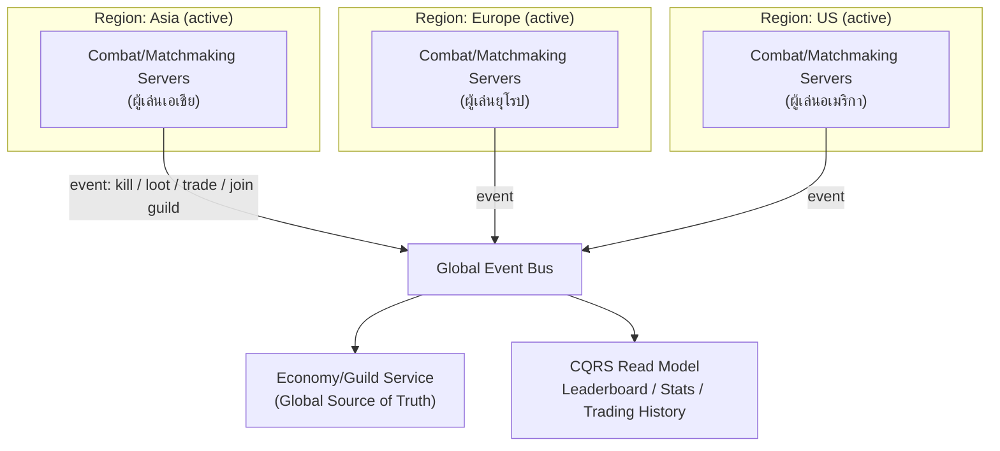
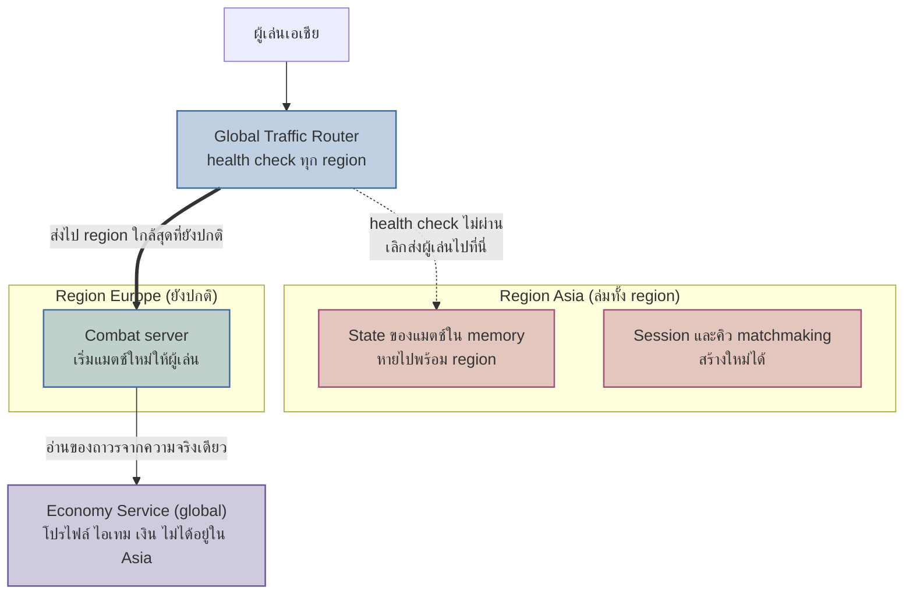
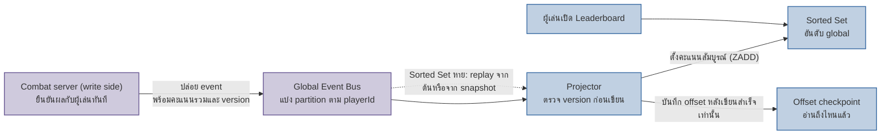
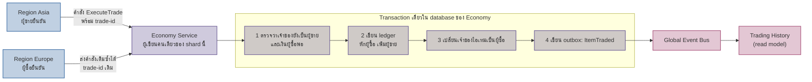
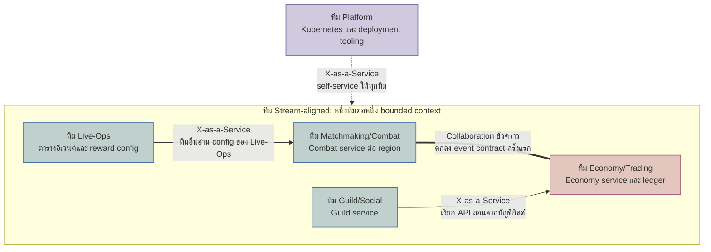
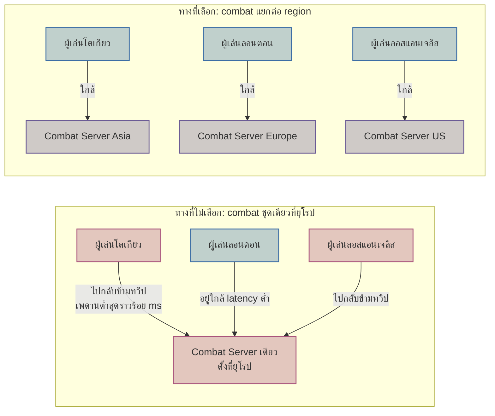
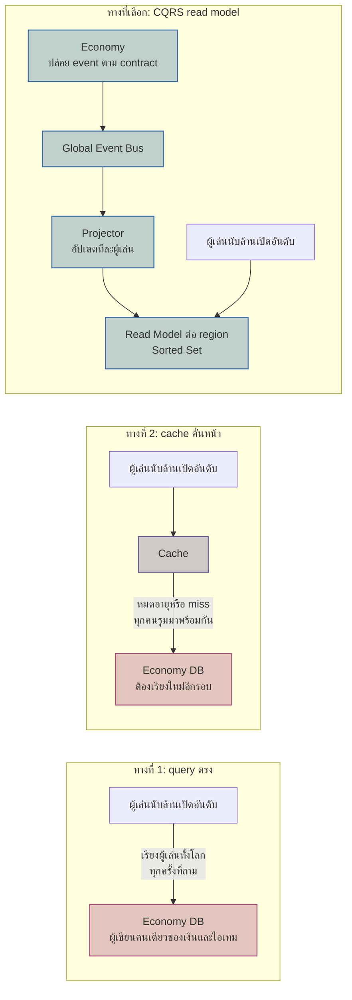
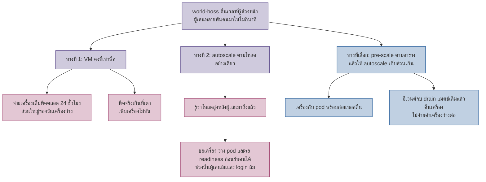

ลองนึกภาพวงดนตรีที่เริ่มเล่นแค่ผับเล็กๆ ในกรุงเทพฯ วันหนึ่งดังจนต้องจัดคอนเสิร์ตพร้อมกันคืนเดียวในสามทวีป — โตเกียว, ลอนดอน, และลอสแอนเจลิส แต่ละสนามนักดนตรีต้องเล่นสด แสง สี เสียง ต้องประสานกับคนหน้าเวทีในเสี้ยววินาที ดีเลย์ครึ่งวินาทีก็รู้สึกได้ทันที สิ่งที่เกิดขึ้น "บนเวที" ของแต่ละสนามจึงต้องเป็นเรื่องท้องถิ่นล้วนๆ

แต่ในอีกฝั่งหนึ่ง ระบบสะสมแต้มแฟนคลับ สิทธิ์ VIP และตลาดซื้อขายของสะสมที่แฟนคลับเทรดกันหลังคอนเสิร์ต ต้องนับรวมทั้งสามสนามเป็น**ความจริงหนึ่งเดียว** — แฟนคลับที่สะสมแต้มจนถึงระดับ Gold ที่โตเกียว ต้องได้สิทธิ์เดียวกันเป๊ะเมื่อไปดูต่อที่ลอนดอน ระบบแต้มนี้ไม่ต้องอัปเดตเร็วเท่าจังหวะดนตรีบนเวที (ช้าไปสองสามวินาทีไม่มีใครว่า) แต่ห้ามแยกเป็นสามระบบตามสามสนามเด็ดขาด

เกมออนไลน์ที่โตจากฮิตระดับภูมิภาคไปเป็นแพลตฟอร์มระดับโลกเจอโจทย์เดียวกันเป๊ะ — การต่อสู้กันสดของผู้เล่น (combat, matchmaking) ต้อง "ท้องถิ่น" เหมือนสนามคอนเสิร์ต เพราะ latency แค่ร้อยกว่ามิลลิวินาทีก็ทำให้เกม feel ผิดทันที แต่กิลด์ การเทรดไอเทม และ leaderboard ต้องเป็นความจริงเดียวข้ามทุกภูมิภาค เหมือนระบบแต้มแฟนคลับที่นับรวมทุกสนาม นี่คือโจทย์ของ <mark class="hl-term">**สถาปัตยกรรม Backend เกมระดับ Global Scale**</mark> ที่ต้องตัดสินใจว่าอะไรควรกระจายอยู่ท้องถิ่น และอะไรควรรวมศูนย์เป็นความจริงเดียว

## Requirement คร่าวๆ

- ผู้เล่นกระจายทั่วโลก (เอเชีย, ยุโรป, อเมริกา) การต่อสู้/แมตช์เมกกิ้งต้อง latency ต่ำพอให้เล่นแบบ real-time ได้จริง
- Live event ระดับโลก (world-boss) ที่ผู้เล่นหลายพันคนใน region เดียวกันมารวมตัวพร้อมกันในไม่กี่นาที ต้องรับ traffic spike รุนแรงโดยไม่ล่ม
- กิลด์ การเทรดไอเทม และ leaderboard ต้องเป็นข้อมูลชุดเดียวที่สอดคล้องกันข้ามทุก region ห้ามมีชื่อกิลด์ซ้ำหรือยอดไอเทมไม่ตรงกันเพราะแยกเก็บคนละ region
- ทีมพัฒนาที่โตจากทีมเดียวสิบกว่าคนเป็นหลายสิบคน ต้องแบ่งขอบเขตความรับผิดชอบชัดเจน ไม่ให้ทีมเดียวต้องแบกรับทุกส่วนของระบบ

## แยก Combat ให้ Region-Local, แยก Economy ให้ Global: โมดูล 18 (Deployment & Infra Architecture)

จากโมดูล 18 เรื่อง multi-region deployment — ไม่ใช่ทุกข้อมูลในแพลตฟอร์มเดียวกันต้องเลือก topology เดียวกัน ฝั่ง **combat/matchmaking** ควร deploy แบบ <mark class="hl-term">**Active-Active**</mark> ในทุก region จริงๆ ผู้เล่นถูก route ไป region ที่ใกล้ที่สุดเสมอ แต่ละแมตช์จบในตัวเองภายใน region เดียว ไม่ต้องรู้จักหรือ sync กับ region อื่นเลย เพราะแมตช์ของผู้เล่นเอเชียกับแมตช์ของผู้เล่นยุโรปไม่เคยเกี่ยวข้องกัน

ฝั่ง **Guild/Economy** กลับตรงข้าม — กิลด์และการเทรดไอเทมต้องมี**แหล่งความจริงเดียว**ที่ทุก region เห็นตรงกัน ถ้าปล่อยให้แต่ละ region เก็บข้อมูลกิลด์แยกกันเอง (sharded ต่อ region ล้วนๆ) จะเจอปัญหาทันทีที่ผู้เล่นสอง region สร้างกิลด์ชื่อเดียวกัน หรือเทรดไอเทมชิ้นเดียวกันซ้ำสองครั้งจากสอง region ที่ไม่รู้จักกัน จึงต้องมี Economy/Guild Service ที่เป็น global source of truth ตัวเดียว รับ write จากทุก region เข้ามารวมศูนย์


```mermaid
flowchart TB
    subgraph Asia["Region: Asia (active)"]
        CA["Combat/Matchmaking Servers<br/>(ผู้เล่นเอเชีย)"]
    end
    subgraph EU["Region: Europe (active)"]
        CE["Combat/Matchmaking Servers<br/>(ผู้เล่นยุโรป)"]
    end
    subgraph US["Region: US (active)"]
        CU["Combat/Matchmaking Servers<br/>(ผู้เล่นอเมริกา)"]
    end
    CA -->|"event: kill / loot / trade / join guild"| BUS["Global Event Bus"]
    CE -->|"event"| BUS
    CU -->|"event"| BUS
    BUS --> ECON["Economy/Guild Service<br/>(Global Source of Truth)"]
    BUS --> READ["CQRS Read Model<br/>Leaderboard / Stats / Trading History"]
```

<mark class="hl-insight">หลักการคือ ยิ่งข้อมูลเกี่ยวกับ "เวลาจริงตรงหน้า" มากเท่าไหร่ ยิ่งควรกระจายอยู่ท้องถิ่น (region-local, Active-Active) ยิ่งข้อมูลเป็น "บันทึกความจริงที่ต้องใช้ร่วมกันข้ามคน" มากเท่าไหร่ ยิ่งต้องรวมศูนย์เป็นแหล่งเดียว</mark> — เหมือนที่โมดูล 18 สอนว่า topology ไม่ใช่ตัวเลือกเดียวทั้งระบบ แต่เลือกได้ต่างกันตามลักษณะของข้อมูลแต่ละก้อน

## รับมือ World-Boss Spike ด้วย Container Orchestration: โมดูล 18 (Deployment & Infra Architecture)

world-boss event คือ traffic spike ที่รู้ล่วงหน้าได้ (ทีม Live-Ops ประกาศเวลาบอสตื่นล่วงหน้า) จากโมดูล 18 เรื่อง container orchestration — Platform team ตั้ง Kubernetes Horizontal Pod Autoscaler ให้ scale จำนวน combat server pod ของ region นั้นล่วงหน้าก่อนเวลาบอสตื่น (pre-scale ตามตารางกิจกรรม) แล้วปล่อยให้ self-healing และ autoscaling ที่เหลือทำงานต่อเองระหว่างอีเวนต์ ถ้า pod ไหนล่มกลางอีเวนต์ก็ถูกสร้างทดแทนอัตโนมัติทันทีโดยไม่ต้องมีคนมานั่งเฝ้า — ทีม Matchmaking/Combat ไม่จำเป็นต้องรู้รายละเอียดของ Kubernetes cluster เลยด้วยซ้ำ เพราะ Platform team ห่อหุ้มความซับซ้อนนี้ไว้ให้แล้ว

## Leaderboard และ Trading History เป็น CQRS Read Side: โมดูล 19 (CQRS & Event Sourcing)

จากโมดูล 19 — ฝั่ง **write model** คือ game server ของแต่ละ region ที่ประมวลผล command จริง (โจมตี, ปิดจ๊อบบอส, ปิดการเทรด) แล้วยืนยันผลทันทีกับผู้เล่นในแมตช์นั้น ทุกครั้งที่เกิดเหตุการณ์สำคัญ server จะปล่อย event (เช่น `BossDefeated`, `ItemTraded`, `GuildJoined`) เข้า Global Event Bus โดยไม่ต้องรอให้ region อื่นรับทราบก่อน ส่วนฝั่ง **read model** คือ leaderboard, player-stats และ trading-history ที่ subscribe event stream นี้แล้วสร้าง denormalized view แบบ global ขึ้นมาต่างหาก — เหมือนป้ายเมนูที่อัปเดตทีหลังสูตรอาหารในครัว

จุดสำคัญคือ read side นี้ scale ได้อิสระจาก combat server โดยสิ้นเชิง — ผู้เล่นเป็นล้านคนกดดู leaderboard พร้อมกันไม่กระทบ latency ของแมตช์ที่กำลังสู้กันสดอยู่เลย เพราะสองฝั่งไม่ได้ใช้ database เดียวกัน

```demo
component: StepThroughDiagram
props: {"steps":[{"label":"1. ผู้เล่นในโซนเอเชียปิดจ๊อบบอสโลก","detail":"Combat Server ประจำ region เอเชียเป็นคนตัดสินผลจริง (write model) ยืนยันกับผู้เล่นทันทีว่าใครได้ loot อะไร ไม่ต้องรอ region อื่น"},{"label":"2. Server ปล่อย event เข้า Global Event Bus","detail":"เหตุการณ์ BossDefeated และ LootAwarded ถูกส่งออกไปแบบ asynchronous โดยไม่บล็อกผู้เล่นที่กำลังเล่นอยู่ในแมตช์"},{"label":"3. CQRS Read Model รับ event มาประมวลผล","detail":"service ฝั่ง leaderboard/trading-history/player-stats (แยกจาก combat server) subscribe event stream นี้แล้วอัปเดต denormalized view ของตัวเอง"},{"label":"4. Leaderboard และประวัติการเทรดอัปเดตทั่วโลก","detail":"ผู้เล่นที่ยุโรปหรืออเมริกาเห็นอันดับใหม่และประวัติไอเทมที่เปลี่ยนหลังจากนั้นไม่กี่วินาที (eventual consistency) ไม่ใช่ทันทีเป๊ะ แต่ก็ไม่จำเป็นต้องทันทีเป๊ะด้วย"},{"label":"5. Combat server ของทุก region เดินหน้าต่อโดยไม่รอ","detail":"ต่างจาก guild/trading write ที่ต้องรอ Economy Service ยืนยัน combat server ไม่เคยต้องรอ read model ฝั่ง leaderboard เลย เพราะเป็นคนละเส้นทางข้อมูลกันโดยสิ้นเชิง"}]}
```

## ตารางเปรียบเทียบ: ข้อมูล Region-Local vs ข้อมูล Global

| ประเด็น | Combat / Matchmaking (Region-local) | Guild / Trading / Leaderboard (Global ผ่าน CQRS) |
|---|---|---|
| ตำแหน่ง deployment | Active-Active ทุก region ใกล้ผู้เล่นที่สุด | รวมศูนย์เป็น service เดียว (global source of truth) |
| น้ำหนักที่ให้ | Availability + latency ต่ำเป็นหลัก | Consistency ข้าม region เป็นหลัก |
| ถ้าข้อมูลไม่ตรงกันชั่วคราว | ไม่กระทบ เพราะแต่ละแมตช์จบในตัวเอง | <mark class="hl-warning">กิลด์ชื่อซ้ำหรือไอเทมถูกนับซ้ำ = ความเสียหายจริงที่ผู้เล่นรู้สึกได้</mark> |
| วิธี scale | เพิ่ม pod ต่อ region ตาม traffic (container orchestration) | scale เฉพาะฝั่ง read model โดยไม่แตะฝั่งเขียน |

## แบ่งทีมตาม Bounded Context ที่สถาปัตยกรรมกำหนดไว้แล้ว: โมดูล 20 (Team Topologies)

พอสามพาร์ทข้างบนแยกขอบเขตข้อมูลชัดแล้ว (combat region-local, economy global, leaderboard เป็น CQRS read side) โมดูล 20 สอนว่านี่คือจังหวะทำ **Inverse Conway Maneuver** — จัดโครงสร้างทีมให้ตรงกับขอบเขตที่สถาปัตยกรรมวางไว้ แทนที่จะปล่อยให้ทีมใหญ่ทีมเดียวสื่อสารกันมั่วจนโค้ดพันกันตาม Conway's Law โดยไม่ตั้งใจ

| ทีม | ประเภท (Team Topologies) | เป็นเจ้าของอะไร |
|---|---|---|
| Matchmaking/Combat | Stream-aligned | Combat server แบบ region-local ของแต่ละภูมิภาค |
| Guild/Social | Stream-aligned | Bounded context กิลด์และความสัมพันธ์ผู้เล่น |
| Economy/Trading | Stream-aligned | Write model การเทรด/กิลด์ และออกแบบ event ที่ทีมอื่นต้องปล่อยเข้า bus |
| Live-Ops | Stream-aligned | กำหนดเวลาและ reward ของ world-boss event ให้ตรงกันทุก region |
| Platform | Platform team | Kubernetes cluster และ multi-region deployment tooling แบบ self-service ให้ทุกทีมใช้เอง |

Economy/Trading team เป็นเจ้าของทั้ง write model และ **CQRS read model** ของ leaderboard/trading-history ไปพร้อมกัน เพราะเป็นทีมที่รู้ดีที่สุดว่า event ไหนควรมีความหมายอะไร ส่วน Platform team ทำหน้าที่ดูดซับ cognitive load ด้าน infrastructure ออกจากทีมอื่นทั้งหมด ตรงกับที่โมดูล 20 อธิบายไว้ว่า platform team มีไว้ให้ทีม stream-aligned โฟกัสกับ domain ธุรกิจของตัวเองเต็มที่

<mark class="hl-warning">ข้อควรระวังคืออย่าเพิ่งแบ่งทีมละเอียดขนาดนี้ตั้งแต่วันที่ยังเป็นทีมเดียวสิบกว่าคน</mark> — Inverse Conway Maneuver คุ้มค่าเมื่อขอบเขต bounded context (อย่างที่วางไว้ข้างบน) นิ่งพอแล้วเท่านั้น ถ้ายังไม่แน่ใจว่า Guild กับ Economy ควรแยกกันจริงไหม การจัดทีมแยกไปก่อนจะสร้างต้นทุนประสานงานข้ามทีมที่ไม่จำเป็น

## คำถามเจาะลึกที่มักถูกถามต่อ

พออธิบายว่า combat อยู่ท้องถิ่น economy รวมศูนย์ และ leaderboard เป็น CQRS read side จบ คนสัมภาษณ์หรือเพื่อนร่วมทีมมักถามต่อว่า "ตอน region ล่มจริง หรือตอนสองที่แย่งเขียนของชิ้นเดียวกันจริง ข้างในมันทำงานยังไง" สี่คำถามแรก (Q1–Q4) จึงเน้นเรื่อง **เส้นแบ่งของข้อมูลและความเป็นเจ้าของ** ระดับสถาปัตยกรรม ไม่ลงไปที่กลไกของเกมแต่ละอย่าง (โจทย์เฉพาะจุดอย่าง "ผู้เล่นพันคนแย่งไอเทมชิ้นเดียวหลังบอสตาย ใครกดก่อนได้ก่อน" เป็นของ Design: Boss Loot Race ในโมดูล Case Studies ของ System Design ที่นี่ไม่พูดซ้ำ) ส่วนอีกแนวที่ senior ชอบถามที่สุดคือ "ทำไมเลือกแบบนี้ ทำไมไม่เลือกอีกแบบ" สามคำถามหลัง (Q5–Q7) จึงไล่ให้เห็นทางเลือกที่ไม่ได้เลือก เหตุผลข้างใต้ ราคาที่ต้องจ่าย และเงื่อนไขที่ทำให้คำตอบเปลี่ยน

### Q1: ถ้า region เอเชียล่มทั้ง region กลางดึก ผู้เล่นที่กำลังสู้อยู่จะเป็นยังไง และถูกย้ายไป region อื่นได้ยังไง

**ใช้ความรู้อะไร:** โมดูล 18 (Multi-Region Deployment — Active-Active ที่ทุก region รับ traffic จริง) บวกโมดูล 15 (Bounded Context — ข้อมูลแต่ละก้อนมีเจ้าของและ "บ้าน" ของมันเอง) บวกหัวข้อ Multi-Region Active-Active และ Retry & Backoff ในโมดูล Reliability ของ System Design

**นึกภาพก่อน:** กลับไปที่คอนเสิร์ต ถ้าไฟดับทั้งสนามที่โตเกียวกลางเพลง เพลงที่กำลังเล่นสดต้องหยุดและเริ่มใหม่ในสนามที่ยังมีไฟ แต่แต้มสะสม สิทธิ์ VIP และของสะสมของแฟนคลับไม่หายไปด้วย เพราะไม่เคยถูกเก็บไว้ที่สนามโตเกียว แต่อยู่ในระบบกลาง คำถามที่ต้องตอบตอนออกแบบจึงเป็นว่า ข้อมูลอะไร "ผูกกับสนาม" (หายได้) และอะไร "ห้ามผูกกับสนาม" (ห้ามหาย)

**แก้ปัญหายังไง:** แยกข้อมูลของผู้เล่นเป็นสามชั้นตามว่า "ถ้าหายแล้วเสียหายแค่ไหน" แล้วออกแบบให้ region ล่มแล้วเสียได้แค่สองชั้นบน:

1. **State ของแมตช์ที่กำลังเล่น** (ตำแหน่ง, พลังชีวิต, เวลาที่เหลือ) อยู่ใน memory ของ combat server ใน region เท่านั้น หายพร้อม region ได้ เพราะแมตช์ยังไม่จบ ยังไม่มีของมีค่าเกิดขึ้นจริง
2. **State ท้องถิ่นที่สร้างใหม่ได้** เช่น session, คิว matchmaking, ที่อยู่ game server ปัจจุบัน หายก็แค่ login และเข้าคิวใหม่
3. **ข้อมูลถาวร** (โปรไฟล์, ไอเทม, เงิน, กิลด์) อยู่ที่ Economy/Guild Service ระดับ global ไม่เคยอยู่เฉพาะใน region เดียว และผลของแมตช์ (รางวัล) ถูก commit ที่นั่นก่อนจึงจะนับว่ามีผล

<mark class="hl-insight">คำว่า region-local หมายถึง "หายได้โดยไม่มีใครเสียหายจริง" ส่วนของที่ห้ามหายต้องไปอยู่ในความจริงเดียวก่อนที่ผู้เล่นจะรู้สึกว่ามัน "เกิดขึ้นแล้ว"</mark>


```mermaid
flowchart TB
    P["ผู้เล่นเอเชีย"] --> RT["Global Traffic Router<br/>health check ทุก region"]
    subgraph Asia["Region Asia (ล่มทั้ง region)"]
        M1["State ของแมตช์ใน memory<br/>หายไปพร้อม region"]
        S1["Session และคิว matchmaking<br/>สร้างใหม่ได้"]
    end
    subgraph EU["Region Europe (ยังปกติ)"]
        M2["Combat server<br/>เริ่มแมตช์ใหม่ให้ผู้เล่น"]
    end
    ECON["Economy Service (global)<br/>โปรไฟล์ ไอเทม เงิน ไม่ได้อยู่ใน Asia"]
    RT -.->|"health check ไม่ผ่าน<br/>เลิกส่งผู้เล่นไปที่นี่"| M1
    RT ==>|"ส่งไป region ใกล้สุดที่ยังปกติ"| M2
    M2 -->|"อ่านของถาวรจากความจริงเดียว"| ECON

    classDef lost fill:#a8527a52,stroke:#a8527a,stroke-width:1.5px
    classDef ok fill:#3d6ea552,stroke:#3d6ea5,stroke-width:1.5px
    classDef global fill:#6b5b9552,stroke:#6b5b95,stroke-width:1.5px
    class M1,S1 lost
    class RT,M2 ok
    class ECON global
```

```demo
component: JourneyDiagram
props: {"nodes":[{"icon":"person","label":"ผู้เล่นเอเชีย"},{"icon":"gate","label":"Global Traffic Router"},{"icon":"building","label":"Region Asia (ล่ม)"},{"icon":"building","label":"Region Europe"},{"icon":"notebook","label":"Economy Service (global)"}],"travelerIcon":"envelope","steps":[{"activeNode":0,"caption":"ผู้เล่นกำลังสู้ในแมตช์ที่ region เอเชีย ทุกอย่างปกติ"},{"activeNode":2,"caption":"Region เอเชียล่มทั้ง region — state ของแมตช์ใน memory หายไปพร้อมกัน แมตช์จบกลางคันและยังไม่มีรางวัลถูก commit"},{"activeNode":1,"caption":"Router ตรวจสุขภาพ region เอเชียไม่ผ่านต่อเนื่อง จึงเอาออกจากรายชื่อปลายทางและชี้ไป region ที่ใกล้สุดที่ยังปกติ"},{"activeNode":0,"caption":"Client ต่อเข้าใหม่แบบหน่วงเวลาสุ่ม (ไม่รัวพร้อมกันทั้ง region) พร้อม session token ที่ region ไหนก็ตรวจลายเซ็นได้"},{"activeNode":4,"caption":"Region ยุโรปดึงโปรไฟล์ ไอเทม และเงินของผู้เล่นจาก Economy Service ที่เป็นความจริงเดียว — ของถาวรไม่เคยอยู่แค่ในเอเชียจึงไม่หาย"},{"activeNode":3,"caption":"ผู้เล่นเข้าคิว matchmaking และเริ่มแมตช์ใหม่ที่ยุโรป ด้วย latency ที่สูงกว่าเดิม แต่เล่นต่อได้"}]}
```

**ข้างใต้ทำงานยังไง:** มีสี่อย่างทำงานต่อกัน หนึ่ง <mark class="hl-term">**Global Traffic Router**</mark> (ตัวกระจายผู้เล่นระดับโลก) ตรวจสุขภาพ (health check) ของแต่ละ region เป็นระยะ เมื่อ region ไหนไม่ผ่านต่อเนื่องเกินเกณฑ์ที่ตั้งไว้ ก็เอาออกจากรายชื่อปลายทาง เกณฑ์ต้องไม่ไวจน region ที่แค่กระตุกถูกตัดทิ้ง และไม่ช้าจนผู้เล่นค้างนาน สอง ผู้เล่นส่วนใหญ่ต่อเข้าเกมผ่าน login หรือ matchmaking endpoint ก่อน แล้วค่อยได้รับที่อยู่ game server ที่จะเล่นจริง จึง redirect ไป region ใหม่ได้ตอนต่อเข้าใหม่ (ถ้าพึ่ง DNS ซึ่งเป็นระบบแปลงชื่อโดเมนเป็นที่อยู่ IP อย่างเดียว การสลับอาจช้าตามอายุ cache ที่ค้างอยู่บนเครื่องผู้เล่น) สาม session token ที่ลงลายเซ็นดิจิทัลไว้ ทุก region ตรวจได้เองโดยไม่ต้องถามกลับ region เดิมที่ตายไปแล้ว สี่ region ปลายทางไม่ได้ "กู้" แมตช์เดิมขึ้นมา แต่อ่านโปรไฟล์ ไอเทม เงินของผู้เล่นจาก Economy Service แล้วสร้างแมตช์ใหม่ ส่วนรางวัลของแมตช์ที่จบก่อน region ล่ม คำสั่งให้รางวัลแนบ match-id เป็น idempotency key (หมายเลขกำกับที่ส่งซ้ำกี่รอบผลก็เหมือนครั้งเดียว) ถ้าคำสั่งไปถึง Economy แล้วแต่ region ตายก่อนได้รับคำตอบ Economy จำ match-id นั้นได้ จึงไม่มีทางแจกซ้ำ

**ถ้าพังหรือมีข้อควรระวังอะไร:**

- <mark class="hl-warning">ผู้เล่นทั้ง region ต่อเข้า region ที่เหลือพร้อมกัน (reconnect storm) อาจถล่ม login จนล่มซ้ำอีกรอบ</mark> — ต้องให้ client ลองใหม่แบบ exponential backoff พร้อมหน่วงเวลาสุ่ม (jitter) และมี rate limit ที่ login ตามโมดูล Reliability บทเรียนจริงเรื่องนี้อยู่ที่ "Slack Reconnect พร้อมกันทั่วโลก" ในโมดูล Case Studies ของ System Design
- **region ที่เหลือต้องมีที่ว่างรอไว้ก่อนเกิดเหตุ** — autoscaling ตามหลัง load อยู่เสมอ และ region ล่มเกิดโดยไม่มีใครประกาศล่วงหน้า ไม่เหมือน world-boss ที่ pre-scale ตามตารางได้ จึงต้องยอมจ่ายค่าเครื่องเผื่อเป็นต้นทุนของความพร้อม
- **ผู้เล่นเอเชียไปเล่นบน server ยุโรป ping สูงขึ้นชัดเจน** — ไม่มีคำตอบเดียว บางเกมยอมให้เล่นต่อแบบแจ้งเตือน บางเกมปิดโหมดแข่งขันชั่วคราวเพื่อความยุติธรรม
- **region ที่ "ช้าผิดปกติแต่ยังไม่ตาย" ตัดสินยากกว่า region ที่ตายสนิท** — health check ควรวัดสิ่งที่ผู้เล่นรู้สึกจริง เช่น เวลาตอบของ login ไม่ใช่แค่ดูว่า process ยังรันอยู่

### Q2: Leaderboard ที่ "ช้ากว่าความจริงไม่กี่วินาที" ถูกสร้างขึ้นจริงๆ ยังไง และทำไมช้าแล้วไม่เสียหาย

**ใช้ความรู้อะไร:** โมดูล 19 (CQRS + Event Sourcing ร่วมกัน — Projector ฟัง event แล้วสร้าง Read Model และ replay ย้อนหลังได้) บวกโมดูล Async & Messaging (at-least-once delivery) กับหัวข้อ Idempotency ในโมดูล Reliability ของ System Design และโจทย์ Design: Leaderboard เกมแบบ Real-time ในโมดูล Case Studies ที่สอน Sorted Set ไว้แล้ว ข้อนี้ถามต่อว่า "อะไรป้อนข้อมูลให้ Sorted Set ตัวนั้นข้าม region"

**นึกภาพก่อน:** ป้ายคะแนนในสนามกีฬา กรรมการในสนามจดผลลงใบบันทึกก่อน (นั่นคือความจริง) พนักงานป้ายอ่านใบบันทึกแล้วเปลี่ยนตัวเลข ป้ายช้ากว่าสนามสองสามวินาทีไม่มีใครเสียหาย แต่ถ้าใบเดียวกันถูกส่งมาซ้ำแล้วพนักงานบวกคะแนนซ้ำสองรอบ หรือใบมาสลับลำดับแล้วคะแนนถอยหลัง ป้ายจะผิดจนกว่าจะมีคนมาแก้ ปัญหาจริงจึงไม่ใช่ "ช้า" แต่คือ "ป้ายต้องอ่านใบซ้ำหรือสลับลำดับได้โดยไม่เพี้ยน"

**แก้ปัญหายังไง:** ทำเป็นสี่ขั้น:

1. **ฝั่งเขียนปล่อย event** — combat server ยืนยันผลกับผู้เล่นก่อน แล้วปล่อย event (เช่น `BossDefeated`) เข้า Global Event Bus โดยไม่รอใคร event แนบ `playerId`, คะแนนรวมใหม่ของผู้เล่น และเลขลำดับ (version) ต่อผู้เล่นคนนั้น
2. **Bus แบ่ง partition ตาม playerId** — event ของผู้เล่นคนเดียวกันจึงถูกอ่านเรียงตามลำดับโดย consumer ตัวเดียว (การรับประกันลำดับมีเฉพาะภายใน partition ไม่ใช่ทั้ง bus)
3. **Projector ตรวจ version แล้วตั้งค่า** — ถ้า version ของ event ใหม่กว่าที่บันทึกไว้ ก็ตั้งคะแนนของผู้เล่นใน Sorted Set เป็น "ค่ารวมสัมบูรณ์" ไม่ใช่ "บวกเพิ่ม" ถ้าเก่ากว่าหรือเท่ากันก็ข้าม
4. **ผู้เล่นเปิด Leaderboard** — อ่านช่วงอันดับ (Top N หรืออันดับของตัวเอง) จาก Sorted Set ตรงๆ ไม่แตะ combat server หรือ Economy เลย

<mark class="hl-insight">โปรเจกเตอร์ที่ทนต่อ event ซ้ำ สลับ และตกหล่นได้ ไม่ใช่ตัวที่ "ไม่เคยรับ event ซ้ำ" แต่คือตัวที่ตั้งค่าแบบสัมบูรณ์พร้อมเลข version ทำให้ทำซ้ำกี่รอบผลก็เท่าเดิม</mark>


```mermaid
flowchart LR
    W["Combat server (write side)<br/>ยืนยันผลกับผู้เล่นทันที"] -->|"ปล่อย event<br/>พร้อมคะแนนรวมและ version"| BUS["Global Event Bus<br/>แบ่ง partition ตาม playerId"]
    BUS --> PJ["Projector<br/>ตรวจ version ก่อนเขียน"]
    PJ -->|"ตั้งคะแนนสัมบูรณ์ (ZADD)"| SS["Sorted Set<br/>อันดับ global"]
    PJ -->|"บันทึก offset หลังเขียนสำเร็จเท่านั้น"| OFF["Offset checkpoint<br/>อ่านถึงไหนแล้ว"]
    UI["ผู้เล่นเปิด Leaderboard"] --> SS
    BUS -.->|"Sorted Set หาย: replay จากต้นหรือจาก snapshot"| PJ

    classDef write fill:#6b5b9552,stroke:#6b5b95,stroke-width:1.5px
    classDef read fill:#3d6ea552,stroke:#3d6ea5,stroke-width:1.5px
    class W,BUS write
    class PJ,SS,OFF,UI read
```

```demo
component: ComparisonDiagram
props: {"left":{"title":"บวกคะแนนตามทุก event ที่ได้รับ","points":["ได้ event เดิมซ้ำ (at-least-once) คะแนนถูกบวกซ้ำ ผลเพี้ยนสะสมไปเรื่อยๆ","event ของผู้เล่นคนเดียวมาสลับลำดับ ผลสุดท้ายอาจผิด","projector crash กลางทาง ไม่รู้ว่า event นั้นบวกไปแล้วหรือยัง","แก้ทีหลังยาก ต้อง replay ทั้งหมดถึงจะได้ตัวเลขที่ถูก"]},"right":{"title":"ตรวจ version แล้วตั้งค่าคะแนนรวมแบบสัมบูรณ์","points":["event ซ้ำ: version เท่าเดิมถูกข้าม ผลไม่เปลี่ยน","event มาสลับ: version เก่ากว่าที่บันทึกไว้ถูกทิ้ง ไม่ดึงคะแนนถอยหลัง","crash แล้วอ่านซ้ำ: ทำซ้ำได้ ผลเท่าเดิมเสมอ","บันทึก offset หลังเขียนสำเร็จเท่านั้น ยอมทำซ้ำดีกว่าทำหาย"]},"note":"ทางเลือกอีกแบบคือให้ projector จำ eventId ทุกตัวที่เคยประมวลผลแล้วค่อยบวกเพิ่ม ใช้ได้เหมือนกัน แต่ต้องเก็บรายการ id ที่โตขึ้นเรื่อยๆ"}
```

**ข้างใต้ทำงานยังไง:** มีของสี่อย่างทำงานร่วมกัน หนึ่งคือ **bus ที่มี offset ต่อ partition** consumer จะบันทึก "อ่านถึงตำแหน่งไหนแล้ว" ไว้ (offset checkpoint) สองคือ **state ของ projector** เก็บ version ล่าสุดของผู้เล่นแต่ละคน สามคือ **Sorted Set** ที่อยู่ใน memory เป็นหลักจึงอ่านเร็วมาก และสี่คือตัวเลข <mark class="hl-term">**consumer lag**</mark> (ระยะห่างระหว่าง event ล่าสุดที่ถูกเขียนเข้า bus กับ event ที่ projector อ่านถึง) ซึ่งใช้แทนคำว่า "leaderboard ช้าแค่ไหน" ลำดับการทำงานต่อหนึ่ง event คือ อ่าน event → ตรวจ version → เขียน Sorted Set → บันทึก offset ถ้า crash ระหว่างเขียนกับบันทึก offset ก็จะอ่าน event เดิมซ้ำ แต่ตรวจ version แล้วข้าม ผลจึงเท่าเดิม (การตรวจ version กับการเขียนควรเป็นก้าวเดียวที่แบ่งแยกไม่ได้ เช่นสคริปต์ที่รันทีเดียวจบใน Redis) และถ้า Sorted Set หายทั้งก้อน ก็ย้าย offset กลับไปจุดเริ่ม (หรือจาก snapshot ล่าสุด ดูหัวข้อขั้นสูง: Event Versioning & Snapshotting ในโมดูล 19) แล้ว replay เพื่อสร้างใหม่ ทั้งนี้การ replay ได้ต้องมีที่เก็บ event ย้อนหลังจริง (Event Store ตามโมดูล 19 หรือ bus ที่เก็บ event นานพอ)

**ถ้าพังหรือมีข้อควรระวังอะไร:**

- <mark class="hl-warning">อย่าใช้ leaderboard สดเป็นเกณฑ์แจกรางวัลจริง</mark> — รางวัลปลายซีซันคือไอเทมและเงิน (มูลค่าจริง) ต้องคำนวณจากข้อมูลของ Economy ณ เวลาตัดที่กำหนด เพราะ leaderboard อาจล่าช้าหรือกำลังสร้างใหม่อยู่ตอนนั้น ความช้าไม่กี่วินาทีที่ไม่เสียหายใช้ได้เฉพาะกับ "หน้าจอที่ให้คนดู" ไม่ใช่ "ผลที่มีมูลค่า"
- **projector ตายหรือช้า** — leaderboard จะเก่าลงแต่ combat ไม่กระทบ เพราะเป็นคนละเส้นทางข้อมูล ควรตั้ง alert ที่ consumer lag และให้หน้าจอแสดงเวลา "อัปเดตล่าสุด" เพื่อไม่ให้ผู้เล่นเข้าใจผิดว่าระบบผิดพลาด
- **event เสียรูป (เช่น schema เปลี่ยนโดยไม่ได้แจ้ง)** — projector จะติดอยู่ที่ event นั้นซ้ำๆ (เรียกว่า poison message) partition นั้นหยุดทั้งหมด ต้องมีทางแยก event ที่ประมวลผลไม่ได้ไปเก็บในคิวแยก (dead-letter queue) แล้วเดินหน้าต่อพร้อมแจ้งคนตรวจ
- **ผู้เล่นเพิ่งชนะแต่อันดับยังไม่ขยับ** — เป็นเรื่องปกติของ eventual consistency ถ้าต้องการให้ผู้เล่นเห็นผลของตัวเองทันที ให้หน้าจอแสดงคะแนนจากผลแมตช์ที่เพิ่งได้รับตรงๆ ชั่วคราว ไม่ต้องรอผ่าน leaderboard

### Q3: ทำไมเงินและไอเทมต้องมี "ผู้เขียนคนเดียว" ทั้งที่ส่วนอื่นเป็น Active-Active และการเทรดข้าม region กันไอเทมซ้ำได้ยังไง

**ใช้ความรู้อะไร:** โมดูล 15 (Aggregate — กติกา "ไอเทมมีเจ้าของได้คนเดียว" ต้องถูกบังคับที่จุดเดียว) บวกโมดูล 16 (จุดที่ต้องเป็น Strong Consistency) บวกโมดูล 18 (Active-Active แลก consistency ตาม PACELC) บวกหัวข้อ Consensus & Leader Election ในโมดูล Database, Idempotency ในโมดูล Reliability, Distributed Transactions & Saga ในโมดูล Microservices & API Design และ Transactional Outbox ในหัวข้อ Message Queue ของโมดูล Async & Messaging (System Design) ส่วนเรื่องแย่งไอเทมหลังบอสตายว่าใครกดก่อน ให้ดู Design: Boss Loot Race ข้อนี้ถามหลังจากนั้น คือเมื่อไอเทมถือกำเนิดแล้ว ใครเป็นเจ้าของหนึ่งเดียวข้าม region

**ปัญหาคืออะไร:** ลองนึกภาพธนาคารสองสาขาที่ต่างคนต่างอนุมัติเช็คของบัญชีเดียวกันโดยไม่โทรถามกัน ทั้งสองเห็นว่ายอดพอ จึงจ่ายให้ทั้งคู่ ทีหลังส่งบัญชีมาเทียบกันถึงรู้ว่าจ่ายไปเกินที่มี ถ้า economy เป็น Active-Active ที่แต่ละ region รับ write เอง เรื่องเดียวกันเกิดได้ทันที ผู้เล่นเอเชียขายดาบให้ A ที่ region เอเชีย ในเสี้ยววินาทีเดียวกันขายดาบเล่มเดียวกันให้ B ที่ region ยุโรป ทั้งสอง region เห็นว่าดาบยังเป็นของผู้ขาย จึงยืนยันทั้งคู่ กว่าจะ replicate ถึงกันก็สายไปแล้ว

ทางแก้ปกติของ Active-Active ช่วยไม่ได้ในเคสนี้ Last-Write-Wins (ใครเขียนทีหลังชนะ) ทิ้งฝั่งที่แพ้แบบเงียบๆ ผู้ซื้อคนหนึ่งจึงจ่ายเงินแต่ไม่ได้ดาบ หรือถ้าเก็บไว้ทั้งคู่ก็ได้ดาบซ้ำสองเล่ม ส่วน CRDT (โครงสร้างข้อมูลที่ผสานผลจากสองฝั่งได้เอง) ผสานข้อมูลได้ก็จริง แต่กติกา "ของชิ้นนี้มีเจ้าของได้แค่คนเดียว" เป็น uniqueness constraint ที่ต้องมีผู้ตัดสินก่อนยืนยัน ผสานทีหลังไม่ได้

**แก้ปัญหายังไง:** ข้อมูลเจ้าของไอเทมและยอดเงินแต่ละก้อนต้องมีผู้เขียนที่มีอำนาจเพียงจุดเดียว ทุก region ที่อยากเปลี่ยนเจ้าของไอเทมต้องส่ง **คำสั่ง (command)** ไปให้ Economy Service ตัดสิน ไม่มี region ไหนเขียนตรงๆ <mark class="hl-insight">การมีผู้เขียนคนเดียวต่อข้อมูลหนึ่งก้อนไม่ได้ขัดกับการ scale ระบบ มันขัดแค่กับการให้ "สองที่เขียนก้อนเดียวกันพร้อมกัน" เท่านั้น</mark> คำว่าผู้เขียนคนเดียวไม่ได้แปลว่าเครื่องเดียว แต่แบ่งข้อมูลเป็น shard แต่ละ shard มี leader ตัวเดียวรับ write มี replica ตามหลัง และถ้า leader ตายก็เลือกตัวใหม่ด้วย consensus

อีกครึ่งหนึ่งของคำตอบคือเก็บเงินแบบ <mark class="hl-term">**ledger**</mark> (สมุดบัญชีที่มีแต่การเพิ่มรายการต่อท้าย ไม่แก้ของเดิม) แทนตัวเลขยอดเงินที่ถูกเขียนทับ และให้ทุกการเทรดมี trade-id เป็น idempotency key

```demo
component: StepThroughDiagram
props: {"steps":[{"label":"1. ตกลงราคากันที่ region ตัวเอง (ยังไม่มีอะไรเปลี่ยนเจ้าของ)","detail":"ผู้ขายที่เอเชียและผู้ซื้อที่ยุโรปตกลงกันผ่านหน้าเทรดของ region ตัวเอง ขั้นนี้เป็นแค่การคุยและเสนอราคา ไม่ใช่ความจริงของระบบ ความจริงยังเป็นว่าดาบเป็นของผู้ขาย"},{"label":"2. Region ส่งคำสั่ง ExecuteTrade ไปที่ Economy Service","detail":"คำสั่งแนบ trade-id เช่น trade-901, item, ผู้ขาย, ผู้ซื้อ และราคา ไปถึงผู้เขียนที่มีอำนาจของข้อมูลนี้ ยอมรับ latency ข้ามทวีปเพราะการเทรดไม่ต้อง real-time เหมือน combat"},{"label":"3. Economy เปิด transaction แล้วตรวจกติกา","detail":"ตรวจว่า trade-901 ยังไม่เคยมี (unique key) เจ้าของไอเทมยังเป็นผู้ขายอยู่ และยอดเงินผู้ซื้อพอ ถ้าข้อใดไม่ผ่านก็ปฏิเสธทั้งคำสั่ง"},{"label":"4. เขียนทุกอย่างใน transaction เดียว commit ทีเดียว","detail":"เขียนรายการ ledger สองรายการ (หักเงินผู้ซื้อ เพิ่มเงินผู้ขาย) เปลี่ยนเจ้าของไอเทมแบบมีเงื่อนไข บันทึก trade และเขียน outbox ItemTraded พร้อมกัน สำเร็จทั้งหมดหรือไม่มีอะไรเกิดขึ้นเลย"},{"label":"5. คำสั่งที่ชนกันมาถึงทีหลังถูกปฏิเสธชัดเจน","detail":"ถ้าผู้ขายพยายามขายดาบเล่มเดิมให้ B อีกคนในเวลาไล่เลี่ยกัน คำสั่งนั้นเจอว่าเจ้าของไม่ใช่ผู้ขายแล้ว ถูกปฏิเสธ ไม่มีใครจ่ายเงินแล้วไม่ได้ของ ไม่มีดาบซ้ำ"},{"label":"6. ตอบกลับ และส่งซ้ำได้อย่างปลอดภัย","detail":"Economy ตอบทั้งสอง region ถ้า timeout แล้ว region ส่ง trade-901 ซ้ำ Economy เจอ trade-id เดิมจึงตอบผลเดิมโดยไม่ทำซ้ำ ส่วน outbox จะถูกส่งเป็น event ItemTraded ไปที่ bus ให้ Trading History อัปเดตทีหลังตามที่อธิบายใน Q2"}]}
```

**ข้างใต้ทำงานยังไง:** ในฐานข้อมูลของ Economy มีตารางหลักสามอย่าง คือ `item` (item_id, owner_id) ตาราง `wallet` ที่เก็บยอดคงเหลือไว้อ่านเร็ว และตาราง `ledger_entry` ที่เป็นรายการเพิ่มต่อท้ายอย่างเดียว บวกตาราง `trade` ที่มี trade_id เป็น primary key ยอดใน wallet ถูกอัปเดตใน transaction เดียวกับการเขียน ledger ถ้าสองอย่างเคยไม่ตรงกัน ledger คือฝ่ายที่ถูก การเปลี่ยนเจ้าของใช้เทคนิคเดียวกับ atomic UPDATE ที่ใช้กับสต๊อกในเคส E-commerce Checkout คือให้เงื่อนไขอยู่ในคำสั่งเดียว:

```sql
BEGIN;
INSERT INTO trade (trade_id, item_id, seller_id, buyer_id, price)
VALUES ('trade-901', 'sword-77', 'A', 'B', 500);   -- trade_id ซ้ำ = ชน unique ทันที
UPDATE item SET owner_id = 'B'
WHERE item_id = 'sword-77' AND owner_id = 'A';      -- ได้ 0 แถว = ไม่ใช่ของ A แล้ว application สั่ง ROLLBACK
UPDATE wallet SET balance = balance - 500
WHERE account_id = 'B' AND balance >= 500;          -- ได้ 0 แถว = เงินไม่พอ application สั่ง ROLLBACK
UPDATE wallet SET balance = balance + 500 WHERE account_id = 'A';
INSERT INTO ledger_entry (trade_id, account_id, amount)
VALUES ('trade-901', 'B', -500), ('trade-901', 'A', 500);
INSERT INTO outbox (event_type, payload)
VALUES ('ItemTraded', '{"trade_id":"trade-901"}');  -- ส่งเป็น event ทีหลัง ไม่ใช่ publish ตรงๆ
COMMIT;
```

ไอเทมที่เพิ่งเกิดจากบอสก็เข้าทางเดียวกัน คือ region ส่ง `LootAwarded` พร้อม loot-id แล้ว Economy สร้างแถวไอเทมโดยมี unique constraint บน loot-id ต่อให้ event ถูกส่งซ้ำก็ผลิตไอเทมซ้ำไม่ได้


```mermaid
flowchart LR
    A["Region Asia<br/>ผู้ขายยืนยัน"] -->|"คำสั่ง ExecuteTrade<br/>พร้อม trade-id"| E["Economy Service<br/>ผู้เขียนคนเดียวของ shard นี้"]
    B["Region Europe<br/>ผู้ซื้อยืนยัน"] -->|"ส่งคำสั่งเดิมซ้ำได้<br/>trade-id เดิม"| E
    subgraph TX["Transaction เดียวใน database ของ Economy"]
        T1["1 ตรวจว่าเจ้าของยังเป็นผู้ขาย<br/>และเงินผู้ซื้อพอ"] --> T2["2 เขียน ledger<br/>หักผู้ซื้อ เพิ่มผู้ขาย"]
        T2 --> T3["3 เปลี่ยนเจ้าของไอเทมเป็นผู้ซื้อ"]
        T3 --> T4["4 เขียน outbox: ItemTraded"]
    end
    E --> T1
    T4 --> BUS["Global Event Bus"]
    BUS --> RM["Trading History<br/>(read model)"]

    classDef region fill:#3d6ea552,stroke:#3d6ea5,stroke-width:1.5px
    classDef writer fill:#6b5b9552,stroke:#6b5b95,stroke-width:1.5px
    classDef readside fill:#a8527a52,stroke:#a8527a,stroke-width:1.5px
    class A,B region
    class E,T1,T2,T3,T4 writer
    class BUS,RM readside
```

**ถ้าพังหรือมีข้อควรระวังอะไร:**

- **Economy ที่อยู่อีกทวีปเข้าถึงไม่ได้ชั่วคราว** — การเทรดทำไม่ได้ในช่วงนั้น เพราะเลือก consistency เหนือ availability เฉพาะจุดนี้ แต่ผู้เล่นยังสู้ได้ตามปกติ (combat ไม่พึ่ง Economy ตลอดเวลา) ไอเทมที่ได้ระหว่างนั้นเก็บไว้ในคิวหรือ outbox ท้องถิ่นแล้วส่งเมื่อ Economy กลับมา โดยแสดงเป็น "รอยืนยัน" ใช้และเทรดไม่ได้จนกว่า Economy จะบันทึกจริง
- <mark class="hl-warning">ห้ามให้ region เก็บ "สำเนาเจ้าของไอเทมที่แก้ไขได้" เพื่อความเร็ว</mark> — cache ไว้อ่านได้ แต่การเขียนต้องผ่าน Economy เสมอ ไม่งั้นจะกลายเป็นสองผู้เขียนโดยไม่รู้ตัว และปัญหาดาบซ้ำกลับมาทันที
- **เมื่อ scale จนต้องแบ่ง shard** — ผู้ซื้อกับผู้ขายอาจอยู่คนละ shard ทำให้ไม่มี transaction เดียวคลุม ต้องใช้ saga ตามโมดูล Microservices & API Design (จดสถานะก่อนทำ แล้วมีคำสั่งชดเชย) ซึ่ง ledger ช่วยให้การชดเชยคือ "เพิ่มรายการย้อน" แทนการลบของเดิม
- **ถ้ามีบั๊กทำให้ไอเทมหรือเงินซ้ำ** — ledger ช่วยสืบย้อนได้ว่าเกิดจากคำสั่งไหนและแก้ด้วยรายการชดเชยได้ ต่างจากระบบที่เก็บแต่ยอดล่าสุดซึ่งไม่เหลือร่องรอยให้ตามรอย

### Q4: Inverse Conway Maneuver ถูกแปลงเป็นของจริงยังไง ทีมไหนเป็นเจ้าของ service และข้อมูลอะไร และแต่ละคู่ทีมควรคุยกันแบบไหน

**ใช้ความรู้อะไร:** โมดูล 20 (Inverse Conway Maneuver, Team Interaction Modes ทั้งสามแบบ และ cognitive load) บวกโมดูล 15 (Bounded Context และ Context Mapping แบบ Customer-Supplier)

**ปัญหาคืออะไร:** แผนผังห้าทีมดูสวยบนกระดาษ แต่ถ้าทีม Guild ยังต้องขอแก้ตารางเดียวกับทีม Economy หรือทุกเรื่องต้องประชุมข้ามทีม เส้นแบ่งทีมก็เป็นแค่ชื่อ Conway's Law ไม่ได้ดูว่าใครนั่งใต้หัวข้อไหนในผังองค์กร แต่ดูว่า "ใครต้องคุยกับใครเพื่อเปลี่ยนอะไร" ข้อนี้จึงถามว่าเส้นแบ่งที่ใช้ได้จริงหน้าตาเป็นยังไง และคู่ทีมแต่ละคู่ควรอยู่ในโหมดปฏิสัมพันธ์ไหน

**แก้ปัญหายังไง:** เขียน "แผนที่ความเป็นเจ้าของ" ให้ครบก่อน คือหนึ่งทีม หนึ่ง bounded context หนึ่ง service พร้อมข้อมูลของมัน และ contract ที่เปิดให้ทีมอื่น แล้วตั้งกติกาสามข้อ:

1. <mark class="hl-term">**Data ownership**</mark> คือข้อมูลมีเจ้าของเดียว ไม่มีทีมไหนอ่านหรือเขียน database ของทีมอื่นตรงๆ ต้องผ่านคำสั่งผ่าน API (ช่องทางให้โปรแกรมเรียกใช้กัน) หรือรับ event เท่านั้น
2. **Contract คือผลิตภัณฑ์ของทีมเจ้าของ** — event schema และ API ของ Economy มีเจ้าของ มีการเปลี่ยนแบบแจ้งล่วงหน้า (เชื่อมกับ Event Versioning ในโมดูล 19 ขั้นสูง)
3. **เลือกโหมดตามช่วงชีวิตของ contract** — ตอนยังไม่มีใครรู้ว่า contract ควรหน้าตาเป็นยังไงใช้ Collaboration แบบมีกรอบเวลา พอนิ่งแล้วเปลี่ยนเป็น X-as-a-Service ทันที ส่วน Platform team เป็น X-as-a-Service กับทุกทีมตั้งแต่ต้น (self-service deploy และ scale)

| ทีม | เป็นเจ้าของ (service + ข้อมูล) | เปิด contract อะไรให้ทีมอื่น | คุยกับใครแบบไหน |
|---|---|---|---|
| Matchmaking/Combat | Combat และ Matchmaking server ต่อ region, state ของแมตช์ใน memory | event เช่น BossDefeated, LootAwarded | Collaboration ชั่วคราวกับ Economy ตอนตกลง event ครั้งแรก แล้วเป็น X-as-a-Service |
| Guild/Social | Guild service: สมาชิกและสิทธิ์ในกิลด์ | คำสั่งและ query เรื่องกิลด์, event GuildJoined | X-as-a-Service เรียก API ของ Economy เมื่อต้องแตะเงิน |
| Economy/Trading | Economy service, ledger, outbox และ contract ของ event | คำสั่ง ExecuteTrade, การให้รางวัล, event ItemTraded | เป็น upstream ของทุกทีมแบบ Customer-Supplier |
| Live-Ops | ตารางอีเวนต์และค่า reward ของ world-boss | config ที่ Combat และ Economy อ่านไปใช้ | X-as-a-Service ทีมอื่นอ่านค่าจาก config ของ Live-Ops |
| Platform | Kubernetes cluster และ deployment tooling | self-service ให้ deploy และ scale | X-as-a-Service กับทุกทีม |

ตัวอย่างที่เห็นชัดว่าเส้นแบ่งต้องคิดระดับ "กติกา" ไม่ใช่ระดับชื่อคือ **เงินกิลด์ (guild treasury)** แนวคิดนี้ตกอยู่ระหว่างสอง context จึงต้องแยกว่าแต่ละฝั่งบังคับกติกาอะไร Guild/Social เป็นเจ้าของ "ใครมีสิทธิ์ถอน" ส่วน Economy เป็นเจ้าของ "เงินในบัญชีกิลด์" (เป็นบัญชีอีกชนิดหนึ่งใน ledger) เมื่อสมาชิกขอถอน Guild ตรวจสิทธิ์แล้วส่งคำสั่งไปให้ Economy ตรวจยอดและเขียน ledger ไม่มีสองฝั่งเก็บยอดเงินกิลด์คนละสำเนา ความสัมพันธ์นี้คือ Customer-Supplier ตามโมดูล 15 คือ Guild เป็นลูกค้าที่ขอ API "ถอนจากบัญชีกิลด์" และ Economy เอาไปจัดลำดับใน backlog ของตัวเอง


```mermaid
flowchart TB
    subgraph ST["ทีม Stream-aligned: หนึ่งทีมต่อหนึ่ง bounded context"]
        CB["ทีม Matchmaking/Combat<br/>Combat service ต่อ region"]
        GS["ทีม Guild/Social<br/>Guild service"]
        EC["ทีม Economy/Trading<br/>Economy service และ ledger"]
        LO["ทีม Live-Ops<br/>ตารางอีเวนต์และ reward config"]
    end
    PF["ทีม Platform<br/>Kubernetes และ deployment tooling"]
    CB ===|"Collaboration ชั่วคราว<br/>ตกลง event contract ครั้งแรก"| EC
    GS -->|"X-as-a-Service<br/>เรียก API ถอนจากบัญชีกิลด์"| EC
    LO -->|"X-as-a-Service<br/>ทีมอื่นอ่าน config ของ Live-Ops"| CB
    PF -.->|"X-as-a-Service<br/>self-service ให้ทุกทีม"| ST

    classDef stream fill:#3d6ea552,stroke:#3d6ea5,stroke-width:1.5px
    classDef economy fill:#a8527a52,stroke:#a8527a,stroke-width:1.5px
    classDef platform fill:#6b5b9552,stroke:#6b5b95,stroke-width:1.5px
    class CB,GS,LO stream
    class EC economy
    class PF platform
```

```demo
component: ComparisonDiagram
props: {"left":{"title":"ช่วงแรก: Collaboration ระหว่าง Combat กับ Economy","points":["สองทีมนั่งออกแบบ event contract ร่วมกัน เพราะยังไม่มีใครรู้ว่า BossDefeated และ LootAwarded ควรพกข้อมูลอะไร","sync กันถี่ overhead สูง จึงต้องมีวันเริ่มและวันจบที่ชัดเจน","ผลลัพธ์ที่ต้องได้คือ contract ที่นิ่งพอ และเอกสารที่ทีมอื่นอ่านแล้วใช้ได้เลย"]},"right":{"title":"หลัง contract นิ่ง: X-as-a-Service","points":["Combat ปล่อย event และเรียกคำสั่งของ Economy ตาม contract โดยไม่ต้องประชุม","Economy เปลี่ยนภายในได้อิสระ ตราบใดที่ contract ไม่เปลี่ยน","ถ้าต้องเปลี่ยน contract ต้องแจ้งล่วงหน้าและมีเวอร์ชัน"]},"note":"ถ้า Collaboration ระหว่างสองทีมไม่เคยจบ เป็นสัญญาณว่า contract ยังไม่นิ่งหรือเส้นแบ่งอาจผิดที่ (ดูโมดูล 20 เรื่อง team interaction modes)"}
```

**ข้างใต้ทำงานยังไง:** เหตุที่การจัดทีมแบบนี้ได้ผลจริงคือกลไกของ Conway's Law เอง การเปลี่ยนแปลงส่วนใหญ่ตกอยู่ในขอบเขต context เดียว คนที่ต้องคุยกันจึงน้อย และโค้ด review ไปจนถึง deploy วิ่งผ่าน pipeline ของทีมเดียว <mark class="hl-insight">เมื่อการเปลี่ยนต้องข้ามขอบเขตก็ผ่าน contract ซึ่งเป็นจุดที่ตั้งใจให้มีการสื่อสารระหว่างทีมอยู่แล้ว</mark> ลำดับการทำงานจริงตาม ADR ในโมดูล 20 คือ ตกลงขอบเขตก่อน จัดทีมตามนั้น แล้วค่อยแยกโค้ดเป็น service ถ้ายังไม่แน่ใจขอบเขตให้เริ่มจาก modular monolith ที่มีขอบเขตชัดในโค้ดชุดเดียวก่อน (ดูขั้นสูง: Modular Monolith จุดกึ่งกลางที่ถูกมองข้าม) ส่วนกติกา "ห้ามอ่าน database ทีมอื่น" ตรวจอัตโนมัติได้ด้วย fitness function ในโมดูล 21 เช่นให้ pipeline ล้มเมื่อโค้ดของ service หนึ่งมี connection ไปยัง database ของอีก service สัญญาณที่บอกว่าเส้นแบ่งใช้ได้จริงคือ feature ทั่วไปแตะทีมเดียว และไม่มีคู่ทีมที่ต้องประชุมกันประจำ

**ถ้าพังหรือมีข้อควรระวังอะไร:**

- <mark class="hl-warning">ทีม Economy/Trading เสี่ยงแบกเกินไป</mark> — ตามที่ case ตั้งไว้ ทีมนี้ถือทั้ง write model, ledger, event contract และ read model ของ leaderboard กับ trading history เป็น cognitive load สูงที่สุดใน 5 ทีม และเป็นคอขวดที่ทุกทีมรอ ถ้า backlog คำขอยาวขึ้น ให้พิจารณาย้ายความเป็นเจ้าของ read model ไปให้ทีมที่ใช้มัน (ทีมนั้น subscribe event แล้วสร้าง projection เอง) ให้ Economy เหลือ write side กับ contract
- **ถ้า Live-Ops ต้องเปิดคำขอให้ Combat หรือ Economy แก้ config ทุกครั้ง** แปลว่า X-as-a-Service ยังไม่เกิดจริง ทีมกำลังใช้ Collaboration ถาวรโดยไม่รู้ตัว ต้องลงทุนทำ config ที่ Live-Ops แก้เองได้
- **เส้นแบ่งที่ตัดผิดที่แพงกว่าการปล่อยรวมไว้ก่อน** — เช่นแยก Guild ออกจาก Economy ทั้งที่เงินกิลด์พันกันมาก ควรเริ่มจากขอบเขตที่เห็นชัดที่สุดก่อน (Combat region-local กับ Economy global) แล้วค่อยแบ่งละเอียดเมื่อขอบเขตนิ่ง
- **Facilitating ไม่อยู่ในตารางนี้** เพราะ case ไม่มี Enabling team ถ้าวันหนึ่งบางทีมขาดทักษะ เช่นเขียน projector หรือทำงานแบบ event-driven ค่อยเพิ่มทีมโค้ชแบบมีกรอบเวลา ไม่ใช่เตรียมไว้ล่วงหน้า

### Q5: ทำไม combat ต้องรันใน region ใกล้ผู้เล่นทุกแห่ง ไม่รวมไว้ที่ region เดียวทั้งโลก ทั้งที่ deploy ง่ายกว่าและเพิ่มเครื่องได้ไม่จำกัด

**คำตอบสั้น (ตอบได้ใน 30 วินาที):** เพราะความหน่วงของการต่อสู้สดมาจาก "ระยะทาง" ที่สัญญาณต้องเดินทาง ไม่ได้มาจากกำลังของเครื่อง <mark class="hl-insight">เพิ่มเครื่องช่วยเรื่อง "รับผู้เล่นได้กี่คน" แต่ไม่ช่วยเรื่อง "ผู้เล่นคนหนึ่งต้องรอนานแค่ไหน" ทางเดียวที่ลดเวลารอคือย้ายเครื่องเข้าไปใกล้ผู้เล่น</mark> และเพราะแต่ละแมตช์มี server ตัดสินตัวเดียวอยู่ใน region เดียว การกระจาย combat ออกไปทุก region จึงไม่ทำให้ต้อง sync ข้อมูลข้ามทวีปเพิ่มเลย

**ใช้ความรู้อะไร:** โมดูล 18 (Multi-Region Deployment — ผู้ใช้ทั่วโลกต้องมี region ใกล้ตัว เพราะระยะทางข้ามทวีปคือ latency ที่หนีไม่ได้) บวกโมดูล 16 (latency เป็น quality attribute ที่ต้องเลือกแลกกับความง่ายในการดูแล) บวกโมดูล 15 (state ของแมตช์เป็นข้อมูลท้องถิ่นของ Bounded Context Combat) และหัวข้อ Multi-Region Active-Active ในโมดูล Reliability ของ System Design ข้อนี้ต่อจาก Q1 แต่คนละมุม Q1 ถามว่าถ้า region ล่มจะเกิดอะไรขึ้น ข้อนี้ถามว่าทำไมต้องมีหลาย region ตั้งแต่แรก

**ทางเลือกที่ไม่เลือก และทำไมถึงไม่เลือก:** ลองนึกภาพร้านพิซซ่าที่มีครัวอยู่แห่งเดียวในโตเกียวแต่ต้องส่งให้ลูกค้าที่ลอนดอน จ้างพ่อครัวเพิ่มกี่คนก็ทำให้ร้านรับออเดอร์ได้มากขึ้น แต่พิซซ่าแต่ละถาดก็ยังต้องนั่งเครื่องบินไปเท่าเดิม ถ้าอยากให้ถึงมือขณะยังร้อนต้องเปิดครัวใกล้บ้านลูกค้า เกมต่อสู้สดก็เหมือนกัน "พิซซ่า" ของมันคือผลของการกดแต่ละครั้งที่ต้องกลับมาถึงมือผู้เล่นในเสี้ยววินาที ทางเลือกที่ไม่เลือกคือ combat server ชุดเดียวที่ region เดียวรับผู้เล่นทั้งโลก ซึ่งดูดีบนกระดาษ (deploy ที่เดียว ดูแลง่าย คิว matchmaking รวมเป็นกองใหญ่หาคู่ง่าย) แต่ผู้เล่นที่อยู่ไกลจะเจอเพดานความหน่วงที่ซื้อเครื่องเพิ่มก็ไม่ลด และผู้เล่นที่อยู่ใกล้ server จะได้เปรียบผู้เล่นที่อยู่ไกลโดยโครงสร้าง ไม่ใช่เพราะฝีมือ

```demo
component: ComparisonDiagram
props: {"left":{"title":"Combat แยกต่อ region ใกล้ผู้เล่น (ที่เคสนี้เลือก)","points":["ผู้เล่นต่อกับ server ใน region ใกล้ตัว ระยะทางสั้น เพดาน latency ต่ำ","แต่ละแมตช์มี server ตัดสินตัวเดียวใน region เดียว ไม่ต้อง sync state ของแมตช์ข้ามทวีป","Matchmaking จับผู้เล่นใน region เดียวกันลงแมตช์เดียวกัน ทุกคนมี latency ใกล้เคียงกัน เกมยุติธรรมกว่า","แลกด้วยการดูแลหลายชุด และ pool ผู้เล่นต่อ region เล็กลง"]},"right":{"title":"Combat ชุดเดียวที่ region เดียวทั้งโลก","points":["ผู้เล่นที่อยู่ไกลต้องเสียเวลาไปกลับข้ามทวีปทุกครั้งที่กด เพิ่มเครื่องก็ไม่ลดระยะทาง","ผู้เล่นใกล้ server ได้เปรียบผู้เล่นไกลโดยโครงสร้าง ไม่เกี่ยวกับฝีมือ","ต้องพึ่งการเดาผลล่วงหน้าและชดเชยความหน่วงมากขึ้น ยิ่งไกลยิ่งเดาไกล เดาผิดภาพกระตุกกลับ","ข้อดีมีจริง คือ deploy และดูแลที่เดียว และ pool matchmaking ใหญ่ที่สุด"]},"note":"ฝั่งขวาไม่ได้ผิดเสมอไป เหมาะกับเกมที่ทนความหน่วงได้เป็นวินาที เช่นเกมไพ่แบบผลัดกันเล่น แต่ไม่เหมาะกับการต่อสู้สดที่ความหน่วงร้อยกว่ามิลลิวินาทีก็ทำให้ feel ผิดทันที"}
```

**เหตุผลข้างใต้:** ความหน่วงที่ผู้เล่นรู้สึกเกิดจากห่วงโซ่ห้าข้อนี้

1. เกมต่อสู้สดส่วนใหญ่ให้ <mark class="hl-term">**Authoritative Server**</mark> (server ที่เป็นเจ้าของความจริงของแมตช์) ตัดสินผลจริง client แค่ส่งสิ่งที่ผู้เล่นกดแล้วรอรับผลไปแสดง เพื่อกันการโกงจากฝั่ง client ผลคือทุกการกดต้องเดินทางไปหา server แล้วเดินทางกลับ
2. Server ประมวลผลเป็นรอบสั้นๆ ซ้ำไปเรื่อยๆ เรียกว่า tick (หลายสิบรอบต่อวินาที) แต่ละรอบรับ input ที่ทันเข้ามา คำนวณ แล้วส่งสถานะใหม่ออกไป เวลาที่ผู้เล่นรอจึงเท่ากับเวลาไปกลับบวกเวลาที่รอถึง tick ถัดไป
3. เวลาไปกลับ (Round-Trip Time หรือ RTT) มีสองส่วน คือเวลาคำนวณของเครื่อง ซึ่งเพิ่มเครื่องหรือใช้เครื่องแรงขึ้นช่วยลดได้ กับเวลาที่สัญญาณเดินทาง ซึ่งลดไม่ได้ เพราะสัญญาณในใยแก้วนำแสงเดินทางได้ราวสองในสามของความเร็วแสง คิดคร่าวๆ ได้ราว 1 มิลลิวินาทีต่อทุก 100 กิโลเมตรของระยะทางสำหรับไปกลับ โตเกียวกับลอนดอนห่างกันราวหมื่นกิโลเมตร เพดานต่ำสุดจึงราวร้อยมิลลิวินาทีในทางทฤษฎี ของจริงมักสูงกว่านี้เพราะสายไม่ได้เดินเป็นเส้นตรงและต้องผ่านอุปกรณ์เครือข่ายหลายตัว
4. Client ซ่อนความหน่วงเล็กน้อยได้ด้วย client-side prediction (แสดงผลของการกดตัวเองไปก่อนโดยเดาว่า server จะเห็นด้วย) และ lag compensation (server ย้อนดูตำแหน่งในอดีตตอนตัดสินการยิง) แต่ทั้งสองเทคนิคคือการเดา ยิ่งไกลยิ่งต้องเดาไกล เมื่อเดาผิดภาพกระตุกกลับ และผู้เล่นที่ ping ต่ำอาจรู้สึกว่าโดนยิงหลังเข้ากำบังไปแล้ว จึงเป็นตัวช่วยสำหรับความหน่วงเล็กๆ ไม่ใช่ทางออกของระยะข้ามทวีป
5. เมื่อ server อยู่ใกล้ ระยะทางหายจากสมการ เหลือแต่เวลาคำนวณที่เราควบคุมได้ และเมื่อแต่ละแมตช์อยู่ใน server เดียว ก็ไม่มีข้อมูลของแมตช์ที่ต้องแบ่งกันเขียนสองที่ combat จึงกระจายไปทุก region ได้โดยไม่ต้องมีการ sync ข้าม region เลย ต่างจาก Economy ใน Q3 ที่ข้อมูลหนึ่งก้อนต้องมีผู้เขียนคนเดียวทั้งโลก


```mermaid
flowchart LR
    subgraph ONE["ทางที่ไม่เลือก: combat ชุดเดียวที่ยุโรป"]
        T1["ผู้เล่นโตเกียว"] -->|"ไปกลับข้ามทวีป<br/>เพดานต่ำสุดราวร้อย ms"| S1["Combat Server เดียว<br/>ตั้งที่ยุโรป"]
        L1["ผู้เล่นลอนดอน"] -->|"อยู่ใกล้ latency ต่ำ"| S1
        A1["ผู้เล่นลอสแอนเจลิส"] -->|"ไปกลับข้ามทวีป"| S1
    end
    subgraph LOCAL["ทางที่เลือก: combat แยกต่อ region"]
        T2["ผู้เล่นโตเกียว"] -->|"ใกล้"| SA["Combat Server Asia"]
        L2["ผู้เล่นลอนดอน"] -->|"ใกล้"| SE["Combat Server Europe"]
        A2["ผู้เล่นลอสแอนเจลิส"] -->|"ใกล้"| SU["Combat Server US"]
    end

    classDef far fill:#a8527a52,stroke:#a8527a,stroke-width:1.5px
    classDef near fill:#3d6ea552,stroke:#3d6ea5,stroke-width:1.5px
    classDef srv fill:#6b5b9552,stroke:#6b5b95,stroke-width:1.5px
    class T1,A1,S1 far
    class L1,T2,L2,A2 near
    class SA,SE,SU srv
```

```demo
component: JourneyDiagram
props: {"nodes":[{"icon":"person","label":"ผู้เล่นโตเกียว"},{"icon":"gate","label":"เครือข่ายข้ามทวีป"},{"icon":"building","label":"Combat Server ที่ยุโรป (ทางที่ไม่เลือก)"},{"icon":"building","label":"Combat Server ที่เอเชีย (ทางที่เลือก)"}],"travelerIcon":"envelope","steps":[{"activeNode":0,"caption":"ผู้เล่นโตเกียวกดโจมตี client ส่งคำสั่งไปให้ server ที่เป็นผู้ตัดสินผลจริง แล้วต้องรอผลกลับมาแสดง"},{"activeNode":1,"caption":"ถ้ามี combat server แห่งเดียวที่ยุโรป คำสั่งต้องเดินข้ามทวีป ระยะทางราวหมื่นกิโลเมตรทำให้การไปกลับมีเพดานต่ำสุดราวร้อยมิลลิวินาที เป็นข้อจำกัดของฟิสิกส์ ไม่ใช่ของเครื่อง"},{"activeNode":2,"caption":"Server ที่ยุโรปคำนวณผลใน tick ถัดไปเสร็จในช่วงสั้นๆ เครื่องแรงขึ้นลดได้เฉพาะส่วนนี้ ซึ่งเป็นส่วนเล็กของเวลาทั้งหมด จึงเพิ่มเครื่องแล้วก็ไม่หายช้า"},{"activeNode":1,"caption":"ผลต้องเดินทางกลับข้ามทวีปอีกรอบ ผู้เล่นเห็นผลของการกดช้ากว่าคนที่อยู่ใกล้ server และ client ต้องเดาผลไปก่อน ถ้าเดาผิดภาพจะกระตุกกลับ"},{"activeNode":3,"caption":"ทางที่เลือก: ตั้ง combat server ไว้ที่ region เอเชีย คำสั่งเดินทางแค่ในภูมิภาค ระยะไปกลับสั้นมาก และแมตช์นี้มี server ตัดสินตัวเดียว ไม่ต้อง sync ข้ามทวีป"},{"activeNode":0,"caption":"ผู้เล่นเห็นผลเร็วพอจะรู้สึกว่าเกมตอบสนองทันที และ matchmaking จับผู้เล่นใน region เดียวกันลงแมตช์เดียวกัน ทุกคนจึงมี latency ใกล้เคียงกัน"}]}
```

**ราคาที่ต้องจ่าย และเมื่อไหร่คำตอบจะเปลี่ยน:**

- <mark class="hl-warning">Pool ผู้เล่นต่อ region เล็กลง</mark> matchmaking หาคู่ที่ระดับฝีมือใกล้กันได้ยากขึ้นในโหมดที่คนน้อยหรือนอกเวลายอดนิยม ต้องยอมให้รอคิวนานขึ้น หรือผ่อนเกณฑ์ ping ให้กว้างขึ้นเมื่อรอนาน (ยอมให้ข้าม region เฉพาะตอนจำเป็น)
- ต้องดูแล deployment, monitoring และความจุหลายชุด รวมถึงเผื่อที่ว่างไว้รับ region อื่นที่ล่มตามที่เล่าใน Q1 ต้นทุนรวมจึงสูงกว่าการรวมศูนย์
- เพื่อนหรือปาร์ตี้ที่อยู่คนละ region ต้องมีนโยบาย เพราะอย่างน้อยหนึ่งคนจะ ping สูง เช่นเลือก region ที่ทำให้คนที่แย่ที่สุดในกลุ่มแย่น้อยที่สุด หรือจำกัดบางโหมดไว้เฉพาะ region เดียวกัน
- คำตอบเปลี่ยนเมื่อ: เกมทนความหน่วงได้เป็นวินาที (เกมไพ่ผลัดกันเล่น เกมสะสม) ซึ่ง region เดียวพอและถูกกว่า, ผู้เล่นน้อยจนแยก region แล้วหาคู่ไม่ได้ ควรเริ่มจากจำนวน region น้อยที่สุดที่ครอบคลุมผู้เล่นหลักแล้วเพิ่มตามข้อมูล ping จริง, หรือการแข่งที่ผู้เล่นทุกคนอยู่ในสถานที่เดียวกัน

**senior มักถามต่อ:** "ถ้า client-side prediction กับ lag compensation ชดเชยความหน่วงได้อยู่แล้ว ทำไมไม่ใช้สองอย่างนี้แทนการเปิดหลาย region" — ตอบตรงๆ ว่าสองเทคนิคนี้ซ่อนความหน่วงระดับเล็กได้ดี แต่ทำงานด้วยการเดา ยิ่งไกลยิ่งเดามาก ราคาคือภาพกระตุกกลับและความรู้สึกไม่ยุติธรรมระหว่างผู้เล่นที่ ping ต่างกัน เมื่อความหน่วงมาจากระยะข้ามทวีป การเดาก็กลายจากรายละเอียดปลีกย่อยเป็นเนื้อหลักของประสบการณ์ สองเทคนิคจึงเป็นตัวเสริมของการวาง server ใกล้ผู้เล่น ไม่ใช่ตัวแทน

### Q6: ทำไมสร้าง leaderboard เป็น CQRS read model แยกออกมา ไม่ query ตรงจาก database ของ Economy หรือเอา cache มาคั่นหน้าไว้ก็พอ

**คำตอบสั้น (ตอบได้ใน 30 วินาที):** เพราะ database ของ Economy เก็บเงินและไอเทม มีผู้เขียนคนเดียวและเป็นทรัพยากรที่มีค่าที่สุดในระบบ ถ้าให้ผู้เล่นนับล้านมาสั่งเรียงอันดับใส่มันโดยตรง งานอ่านที่หนักจะแย่ง CPU กับงานเขียนที่ห้ามช้า ส่วน cache แค่ซ่อนปัญหาไว้บางช่วง เพราะอันดับเปลี่ยนตลอดเวลา <mark class="hl-insight">read model ย้ายงานหนักจากตอนอ่านไปทำทีละนิดตอนมี event เข้ามา ต้นทุนการอ่านจึงคงที่ไม่ว่ามีคนดูกี่คน และ Economy ไม่ต้องรู้จักผู้อ่านเลย แค่ปล่อย event ตาม contract</mark>

**ใช้ความรู้อะไร:** โมดูล 19 (CQRS — แยกโมเดลเขียนกับอ่าน และบท "เมื่อไหร่ควรใช้ CQRS/Event Sourcing เมื่อไหร่ไม่ควร" ที่ให้เกณฑ์ว่าต้นทุนนี้คุ้มเมื่อไหร่) บวกโมดูล 15 (Bounded Context และความเป็นเจ้าของข้อมูล — ห้ามอ่าน database ของ context อื่นตรงๆ) บวก Q2 และ Q4 ของเคสนี้ เคส Leaderboard ใน Case Studies ของ System Design ตอบไว้แล้วว่าทำไมไม่ cache ผลที่ sort ไว้ล่วงหน้า (ผลนิ่งไม่ทันคะแนนที่เปลี่ยนตลอด) ข้อนี้จึงไม่เล่าซ้ำ แต่ถามในมุมสถาปัตยกรรมว่าใครเป็นเจ้าของข้อมูล ใครควรรับ load และ contract ระหว่างทีมควรเป็นอะไร

**ทางเลือกที่ไม่เลือก และทำไมถึงไม่เลือก:** ลองนึกภาพห้องสมุดที่บรรณารักษ์คนเดียวถือสมุดบันทึกการยืมคืนฉบับจริง แล้วมีผู้เข้าชมมาถามว่า "หนังสือเล่มไหนคนยืมมากที่สุด" วิธีแรกคือให้ทุกคนมาถามที่เคาน์เตอร์ยืมคืน บรรณารักษ์ต้องนับสมุดทั้งเล่มใหม่ทุกครั้ง คนที่มายืมจริงต้องต่อคิวรอ วิธีที่สองคือบรรณารักษ์จดคำตอบใส่กระดาษแปะไว้ (cache) แต่ทุกครั้งที่มีคนยืมคืนกระดาษก็ล้าสมัยลงทีละนิด และพอกระดาษหมดอายุ คนที่ยืนรออยู่ก็รุมมาถามพร้อมกัน วิธีที่สามคือให้พนักงานอีกคนคอยดูใบยืมคืนที่บรรณารักษ์ส่งต่อให้ แล้วอัปเดตกระดานอันดับทีละรายการ ผู้เข้าชมดูกระดานได้เป็นล้านคนโดยเคาน์เตอร์ยืมคืนไม่รู้เรื่อง

ทางเลือกที่ไม่เลือกจึงมีสามแบบ query ตรงจาก database ของ Economy, ใส่ cache คั่นหน้า database นั้น, หรือใช้ read replica (สำเนาที่ database ทำไว้ให้อ่านอย่างเดียว) read replica ช่วยแยกภาระอ่านออกจากตัวหลักได้ แต่โครงสร้างตารางกับคำถามที่หนักยังเหมือนเดิม และ leaderboard ยังต้องรู้ schema ภายในของทีม Economy

```demo
component: ComparisonDiagram
props: {"left":{"title":"Read model จาก event stream (ที่เคสนี้เลือก)","points":["Economy ปล่อย event ตาม contract แล้วจบ ผู้อ่านนับล้านไม่แตะ database ที่เก็บเงินและไอเทมเลย","โครงสร้างข้อมูลถูกออกแบบเพื่อคำถามอันดับโดยเฉพาะ ต้นทุนการอ่านคงที่ไม่ขึ้นกับจำนวนผู้ดู","สร้างสำเนาไว้ทุก region ได้จาก stream เดียวกัน ผู้เล่นอ่านใกล้ตัวโดยไม่ข้ามทวีป","แลกด้วยข้อมูลที่ช้ากว่าความจริงเล็กน้อย และต้องดูแล bus, projector กับตัวเลข lag เพิ่ม"]},"right":{"title":"Query ตรงจาก database ของ Economy (มี cache หรือ read replica ช่วย)","points":["ทุกคำขออันดับวิ่งเข้า database ที่เป็นผู้เขียนคนเดียวของเงินและไอเทม แย่งทรัพยากรกับ transaction การเทรด","ต้องเรียงผู้เล่นทั้งโลกจากตารางที่ออกแบบไว้หาว่าไอเทมชิ้นนี้ของใคร หรือเพิ่ม index ที่ต้องอัปเดตทุกครั้งที่คะแนนเปลี่ยน","cache ซ่อนได้แค่ช่วงที่ผลยังไม่หมดอายุ พอคะแนนเปลี่ยนหรือหมดอายุก็กลับมาถล่ม database เหมือนเดิม","ทีม leaderboard ต้องผูกกับ schema ภายในของทีม Economy ผิดกติกาห้ามอ่าน database ทีมอื่นที่วางไว้ใน Q4"]},"note":"ถ้าเกมเล็ก อยู่ region เดียว และมี leaderboard แค่อันเดียว ฝั่งขวาที่ใช้ index บวก cache หรือ read replica เพียงพอและถูกกว่ามาก"}
```

**เหตุผลข้างใต้:** การเลือกนี้ถูกบังคับด้วยสามแรงที่ทำงานพร้อมกัน

1. **ผู้เขียนคนเดียวขยายยาก** ตาม Q3 ข้อมูลเงินและไอเทมของแต่ละ shard มี leader ตัวเดียวรับ write ส่วนงานอ่านก๊อปปี้ไปหลายเครื่องได้ง่ายกว่ามาก ทุกคำสั่งอ่านที่หนักบนเครื่องผู้เขียนใช้ CPU หน่วยความจำ และ I/O ร่วมกับ transaction การเทรด ผู้เล่นนับล้านเปิดอันดับพร้อมกันตอนบอสตายจึงกระทบความเร็วของการเทรดโดยตรง
2. **รูปร่างของคำถามไม่ตรงกับรูปร่างของข้อมูล** ตารางของ Economy ถูกออกแบบให้ตอบคำถามแบบชี้เป้า เช่น "ดาบเล่มนี้เป็นของใคร" หรือ "กระเป๋าเงินนี้เหลือเท่าไหร่" แต่ leaderboard ถามว่า "ใครอยู่อันดับ 1 ถึง 100 จากผู้เล่นทั้งโลก" ซึ่งต้องเรียงข้ามผู้เล่นทั้งหมด จะให้เร็วต้องเพิ่ม index ตามคะแนน แต่ทุก index ต้องถูกอัปเดตทุกครั้งที่ข้อมูลเปลี่ยน ต้นทุนจึงไปตกที่เส้นทางเขียนที่ห้ามช้า
3. **cache ตอบได้ดีเมื่อคำถามเดิมถูกถามซ้ำและคำตอบไม่เปลี่ยน** leaderboard คำถามซ้ำสูงมากแต่คำตอบเปลี่ยนทุกครั้งที่มีคะแนนใหม่ ตั้งอายุสั้นก็ต้องคำนวณใหม่บ่อย ตั้งอายุยาวก็ค้างนาน ที่แย่กว่านั้นคือตอนหมดอายุ คำขอที่ยืนรออยู่ทั้งหมดอาจรุมยิงเข้า database พร้อมกันเป็น <mark class="hl-term">**cache stampede**</mark> (cache หมดอายุแล้วทุกคำขอวิ่งกลับไปที่ต้นทางพร้อมกัน ดูบท Caching ของ System Design และเคส Facebook Memcache Lease ใน Case Studies)

Read model กลับด้านของงานทั้งสามข้อ คือจ่ายต้นทุนเล็กๆ ต่อหนึ่ง event ตอนที่ event เข้ามา (อัปเดตผู้เล่นคนเดียวใน Sorted Set ตาม Q2) แทนที่จะจ่ายก้อนใหญ่ตอนมีคนถาม และเพราะ contract ระหว่างทีมกลายเป็น event ไม่ใช่ตาราง Economy จึงเปลี่ยน schema ภายในได้โดย leaderboard ไม่พัง ตราบใดที่ event ยังเหมือนเดิม (ตรงกับ X-as-a-Service ใน Q4) อีกข้อที่ทำให้คุ้มคือเคสนี้มี Global Event Bus อยู่แล้วเพราะ combat กับ Economy ต้องคุยกัน การเพิ่มผู้รับ event อีกตัวจึงถูกกว่าระบบที่ไม่มี event เลยมาก และ leaderboard, player-stats, trading-history ต้องการข้อมูลคนละรูปร่างจากแหล่งเดียวกัน ซึ่งตรงกับเกณฑ์ในบทข้อแลกเปลี่ยนของโมดูล 19


```mermaid
flowchart LR
    subgraph P1["ทางที่ 1: query ตรง"]
        V1["ผู้เล่นนับล้านเปิดอันดับ"] -->|"เรียงผู้เล่นทั้งโลก<br/>ทุกครั้งที่ถาม"| DB1["Economy DB<br/>ผู้เขียนคนเดียวของเงินและไอเทม"]
    end
    subgraph P2["ทางที่ 2: cache คั่นหน้า"]
        V2["ผู้เล่นนับล้านเปิดอันดับ"] --> CH["Cache"]
        CH -->|"หมดอายุหรือ miss<br/>ทุกคนรุมมาพร้อมกัน"| DB2["Economy DB<br/>ต้องเรียงใหม่อีกรอบ"]
    end
    subgraph P3["ทางที่เลือก: CQRS read model"]
        EC["Economy<br/>ปล่อย event ตาม contract"] --> BUS["Global Event Bus"]
        BUS --> PJ["Projector<br/>อัปเดตทีละผู้เล่น"]
        PJ --> RM["Read Model ต่อ region<br/>Sorted Set"]
        V3["ผู้เล่นนับล้านเปิดอันดับ"] --> RM
    end

    classDef pain fill:#a8527a52,stroke:#a8527a,stroke-width:1.5px
    classDef mask fill:#6b5b9552,stroke:#6b5b95,stroke-width:1.5px
    classDef good fill:#3d6ea552,stroke:#3d6ea5,stroke-width:1.5px
    class DB1,DB2 pain
    class CH mask
    class EC,BUS,PJ,RM good
```

```demo
component: JourneyDiagram
props: {"nodes":[{"icon":"person","label":"ผู้เล่นนับล้านเปิด Leaderboard"},{"icon":"notebook","label":"Cache คั่นหน้า database"},{"icon":"building","label":"Economy DB (ผู้เขียนคนเดียว)"},{"icon":"gate","label":"Event Bus + Projector"},{"icon":"notebook","label":"Read Model ต่อ region"}],"travelerIcon":"envelope","steps":[{"activeNode":0,"caption":"บอสโลกตายและผู้เล่นนับล้านเปิดดูอันดับพร้อมกันในเวลาไม่กี่นาที ขณะเดียวกันผู้เล่นก็ยังเทรดไอเทมกันอยู่"},{"activeNode":1,"caption":"ทางที่ใช้ cache: ช่วงที่ผลยังไม่หมดอายุ cache ตอบแทนได้ แต่ทุกครั้งที่มีคะแนนใหม่ ผลใน cache ก็ล้าสมัยลงทีละนิด จะให้สดต้องตั้งอายุสั้น ซึ่งหมายถึงคำนวณใหม่บ่อย"},{"activeNode":2,"caption":"พอ cache หมดอายุ คำขอที่รออยู่พร้อมกันถล่มเข้า Economy DB ให้เรียงอันดับทั้งโลกซ้ำๆ ขณะที่ DB ตัวเดียวกันต้องตัดเงินและย้ายเจ้าของไอเทมให้การเทรดด้วย งานอ่านที่หนักจึงแย่งทรัพยากรกับงานเขียนที่ห้ามช้า"},{"activeNode":3,"caption":"ทางที่เลือก: ทุก event ที่ Economy ปล่อยออกมา (ผ่าน outbox ที่เขียนใน transaction เดียวกัน) วิ่งเข้า Event Bus ให้ Projector รับไปทีละรายการ"},{"activeNode":4,"caption":"Projector อัปเดตอันดับของผู้เล่นคนเดียวใน Read Model เป็นงานชิ้นเล็ก ทำครั้งเดียวตอน event เข้ามา แทนที่จะเรียงใหม่ทั้งหมดตอนมีคนถาม และ Read Model นี้สร้างซ้ำไว้ทุก region ได้"},{"activeNode":0,"caption":"ผู้เล่นนับล้านอ่านจาก Read Model ใกล้ตัว ต้นทุนการอ่านคงที่ไม่ว่ามีคนดูกี่คน และ Economy DB ไม่เห็นคำขอเหล่านี้เลย จึงทำงานเทรดได้เต็มกำลัง"}]}
```

**ราคาที่ต้องจ่าย และเมื่อไหร่คำตอบจะเปลี่ยน:**

- <mark class="hl-warning">อันดับจะช้ากว่าความจริงเสมอ และห้ามใช้ตัดสินสิ่งที่มีมูลค่า</mark> ตามที่ Q2 ย้ำไว้ ต้องเฝ้าตัวเลข consumer lag ของ projector และแสดงเวลา "อัปเดตล่าสุด" ให้ผู้เล่นเห็น
- ต้องดูแลของเพิ่ม คือ bus, projector, ที่เก็บ read model และขั้นตอน replay เมื่อรูปแบบของ read model เปลี่ยน และ debug ยากขึ้นตามที่โมดูล 19 เตือนไว้ เพราะต้องไล่ว่าผิดที่ event, projector หรือ read model
- ต้องลงทุนกับ event contract ให้ดี event ต้องพกข้อมูลพอให้ projector ทำงานได้ (เช่นคะแนนรวมกับ version ตาม Q2) ถ้า contract ผิดต้องแก้ทั้งฝั่ง Economy และฝั่งผู้อ่าน
- คำตอบเปลี่ยนเมื่อ: เกมเล็ก อยู่ region เดียว ผู้เล่นไม่มาก และมี leaderboard เดียว ซึ่ง database บวก index บวก cache หรือ read replica เพียงพอและถูกกว่า ตามหลักของโมดูล 19 ที่ไม่ให้เพิ่มความซับซ้อนถ้ายังไม่มีปัญหาจริง, หรือข้อมูลที่ผู้เล่นต้องเห็นผลของตัวเองทันที เช่นยอดเงินของตัวเองหลังเทรด ซึ่งต้องอ่านจาก Economy โดยตรง ไม่ผ่าน read model

**senior มักถามต่อ:** "ถ้าอยากได้ความเร็วแบบนี้ ทำไมไม่ให้ Economy เขียนคะแนนลง Redis ตรงๆ ตอน commit เลย จะได้ไม่ต้องมี projector" — ตอบว่าเพราะนั่นคือการเขียนสองที่ (database กับ Redis) โดยไม่มี transaction เดียวคลุม ถ้า commit database สำเร็จแต่เขียน Redis พลาด อันดับจะผิดเงียบๆ และไม่มีร่องรอยให้ซ่อม ทางที่ปลอดภัยคือเขียน event ลง outbox ใน transaction เดียวกับข้อมูลจริง (ตาม Q3) แล้วส่งต่อไปให้ projector ซึ่งทำซ้ำได้อย่างปลอดภัยตาม Q2 ผลคือได้ทั้งความเร็วและความถูกต้องโดยไม่ต้องเขียนสองที่พร้อมกัน

### Q7: ทำไมใช้ container orchestration แล้ว scale ล่วงหน้าตามตารางอีเวนต์ ไม่ตั้ง VM คงที่ให้พอกับพีค และไม่รอ autoscale ตามโหลดอย่างเดียว

**คำตอบสั้น (ตอบได้ใน 30 วินาที):** เพราะโหลดของเกมขึ้นลงแรงและส่วนใหญ่ทำนายเวลาได้ VM คงที่เท่าพีคจึงต้องจ่ายค่าเครื่องเต็มพีคทั้งวัน ทั้งที่พีคมีแค่ไม่กี่สิบนาที ส่วน autoscale อย่างเดียวรู้ว่าโหลดมาก็ต่อเมื่อผู้เล่นมาถึงแล้ว กว่าจะได้เครื่องที่พร้อมรับคนก็สายไป <mark class="hl-insight">เมื่อรู้เวลาพีคล่วงหน้า ควรเตรียมความจุก่อนถึงเวลา แล้วให้ autoscale เป็นแค่ตัวเก็บส่วนที่เกินคาด</mark>

**ใช้ความรู้อะไร:** โมดูล 18 (Container Orchestration — desired state, self-healing, scaling และบท Container ที่ startup เร็วกว่า VM) บวกโมดูล 16 (บท "ขั้นสูง: Architecture Tactics Pattern ย่อยใน Pattern ใหญ่" ที่แยก Increase Resources กับ Manage Resource Demand เป็นสองทางรับ demand) บวกโมดูล 20 (Platform team ดูดซับภาระ infrastructure แทนทีมอื่น) และเคส Slack Reconnect พร้อมกันทั่วโลกใน Case Studies ของ System Design ที่ชี้ว่า autoscaling ตามไม่ทันโหลดที่พุ่งฉับพลัน ข้อนี้ต่อจาก Q1 ที่ region สำรองต้องมีที่ว่างรอไว้ก่อน และ Q5 ที่ทำให้ผู้เล่นย้ายไปใช้ความจุของ region อื่นได้ไม่ง่าย

**ทางเลือกที่ไม่เลือก และทำไมถึงไม่เลือก:** ลองนึกภาพร้านอาหารที่มีงานเลี้ยงใหญ่ทุกคืนวันเสาร์เพียงสองชั่วโมง ทางแรกคือจ้างพนักงานประจำให้พอกับงานเลี้ยงตลอดสัปดาห์ จ่ายเงินเดือนเต็มทั้งที่วันธรรมดาว่างเกือบทั้งวัน ทางที่สองคือรอให้คิวลูกค้ายาวล้นร้านก่อนแล้วค่อยโทรเรียกพนักงานพาร์ตไทม์ กว่าเขาจะมาถึงและเข้าใจงาน ลูกค้าก็เดินหนีไปแล้ว ทางที่ฉลาดคือดูตารางงานเลี้ยงที่จองไว้แล้วเรียกพาร์ตไทม์มาก่อนเวลา พร้อมเผื่อให้โทรเรียกเพิ่มได้ถ้าคนมามากกว่าที่จอง ทางแรกคือ VM คงที่เท่าพีค ทางที่สองคือ autoscale ตามโหลดอย่างเดียว และทางที่เลือกคือ pre-scale ตามตารางบวก autoscale เป็นส่วนเสริม

```demo
component: ComparisonDiagram
props: {"left":{"title":"Pre-scale ตามตาราง + autoscale เก็บส่วนเกิน (ที่เคสนี้เลือก)","points":["ความจุพร้อมก่อนผู้เล่นมาถึง ไม่ต้องรอให้ระบบตรวจพบว่าโหลดสูง","ช่วงที่ไม่มีอีเวนต์จ่ายเท่าที่ใช้ พออีเวนต์จบก็คืนเครื่อง","Pod ที่ตายถูกสร้างแทนอัตโนมัติ และปรับจำนวนด้วยการแก้ตัวเลขที่ต้องการ ไม่ต้องมีคนไล่สั่งเครื่องทีละตัว","แลกด้วยระบบ orchestrator ที่ต้องมีทีม Platform ดูแล และตารางอีเวนต์ต้องแม่นพอ"]},"right":{"title":"VM คงที่ตั้งไว้เท่าพีค","points":["ต้องจ่ายเครื่องเต็มพีคตลอดเวลา ทั้งที่ส่วนใหญ่ของวันว่าง และทุก region ก็ต้องมีชุดเต็มของตัวเองเพราะพีคคนละเวลากัน","ต้องเดาพีคล่วงหน้า เดาต่ำไปคือล่มในวันที่สำคัญที่สุด เดาสูงไปคือจ่ายเงินทิ้ง","เมื่อพีคจริงเกินที่เดา จะเพิ่มเครื่องได้ช้า เพราะ VM เริ่มต้นเป็นนาที","ข้อดีมีจริง คือเรียบง่าย พฤติกรรมคาดเดาได้ และไม่มี cluster ให้ดูแล"]},"note":"ส่วน autoscale ตามโหลดอย่างเดียวประหยัดเหมือนฝั่งซ้าย แต่ตามหลังผู้เล่นเสมอ จึงเหมาะเป็นตัวเสริมสำหรับพีคที่คาดไม่ถึง ไม่ใช่ตัวรับพีคที่รู้เวลาอยู่แล้ว"}
```

**เหตุผลข้างใต้:** เหตุผลมีสามชั้นที่ต่อกัน

1. **ความจุที่ต้องจ่ายคือพื้นที่ใต้เส้นความจุ ไม่ใช่ใต้เส้นโหลด** ถ้าเส้นความจุแบนราบที่ระดับพีค ส่วนต่างระหว่างความจุกับโหลดจริงคือเงินที่จ่ายไปเปล่า พีคของ world-boss แคบและสูง ส่วนต่างนี้จึงใหญ่มาก ยิ่งกว่านั้นผู้เล่นแต่ละ region พีคคนละเวลาตามเวลาท้องถิ่น และตาม Q5 ผู้เล่นเอเชียใช้ความจุของยุโรปไม่ได้ดี เพราะ latency จึงแชร์เครื่องข้าม region เพื่อลดค่าใช้จ่ายไม่ได้ ทุก region ต้องยืดหดความจุของตัวเอง
2. **การเพิ่มความจุใช้เวลา และเวลานั้นต่ออนุกรมกันสามชั้น** ชั้นแรกคือการตรวจพบ เพราะ autoscaler ตัดสินใจจากตัวเลขโหลดที่สะสมมาช่วงหนึ่ง ไม่ใช่จากผู้เล่นที่เพิ่งมาถึง ชั้นที่สองคือถ้าไม่มีเครื่อง (node) ว่างต้องขอ VM ใหม่ซึ่งเริ่มต้นเป็นนาที ชั้นที่สามคือ pod ต้องถูกวาง ดึง image เปิดโปรเซส โหลดข้อมูลเกม และผ่าน readiness check (การตรวจว่าพร้อมรับผู้เล่นแล้ว) ก่อนจะรับผู้เล่นได้ รวมกันมักเป็นหลักนาที ขณะที่ผู้เล่นตอนบอสตื่นมาถึงในหลักวินาที ช่วงที่ความจุตามหลังโหลดคือช่วงที่ผู้เล่นล้น login ล้ม ตามเคส Slack ใน Case Studies ของ System Design
3. **ต้นทุนสามชั้นนั้นเป็นต้นทุนของ "เวลา" ไม่ใช่ของ "ความไม่แน่นอน"** ถ้ารู้เวลาพีคล่วงหน้า (Live-Ops ประกาศเวลาบอสตื่นอยู่แล้ว) ก็จ่ายเวลานั้นก่อนได้ การ <mark class="hl-term">**pre-scale**</mark> (เตรียมความจุก่อนโหลดมา) จึงย้ายความหน่วงออกจากช่วงที่ผู้เล่นรออยู่ไปยังช่วงที่ยังไม่มีใครมา ด้วยการตั้งจำนวน pod ขั้นต่ำของ region นั้นตามตารางเวลา แล้วปล่อยให้ autoscaler เก็บเฉพาะส่วนที่เกินคาด

ส่วนที่ทำให้ต้องเป็น orchestrator ไม่ใช่สคริปต์เปิดปิดเครื่องธรรมดา คือ combat server ถือ state ของแมตช์ใน memory (Q1) ตอนลดขนาดจึงห้ามปิด pod ที่ยังมีแมตช์เล่นอยู่ ต้องออกแบบให้ pod หยุดรับแมตช์ใหม่แล้วรอแมตช์เดิมจบก่อนถูกปิด (Kubernetes ให้เวลาผ่อนผันตอนปิด pod ได้ระดับหนึ่ง แต่โปรแกรมต้องรองรับเอง) ส่วน desired state และ self-healing ทำให้ Platform team ตั้งจำนวนที่ต้องการเป็นตัวเลข แล้วระบบดูแลให้ตรงเอง โดยทีม Combat ไม่ต้องรู้เรื่อง cluster ตามที่แบ่งไว้ใน Q4


```mermaid
flowchart TB
    D["world-boss ตื่นเวลาที่รู้ล่วงหน้า<br/>ผู้เล่นหลายพันคนมาในไม่กี่นาที"] --> A["ทางที่ 1: VM คงที่เท่าพีค"]
    D --> B["ทางที่ 2: autoscale ตามโหลดอย่างเดียว"]
    D --> C["ทางที่เลือก: pre-scale ตามตาราง<br/>แล้วให้ autoscale เก็บส่วนเกิน"]
    A --> A1["จ่ายเครื่องเต็มพีคตลอด 24 ชั่วโมง<br/>ส่วนใหญ่ของวันเครื่องว่าง"]
    A --> A2["พีคจริงเกินที่เดา<br/>เพิ่มเครื่องไม่ทัน"]
    B --> B1["รู้ว่าโหลดสูงหลังผู้เล่นมาถึงแล้ว"]
    B1 --> B2["ขอเครื่อง วาง pod และรอ readiness ก่อนรับคนได้<br/>ช่วงนั้นผู้เล่นล้นและ login ล้ม"]
    C --> C1["เครื่องกับ pod พร้อมก่อนบอสตื่น"]
    C --> C2["อีเวนต์จบ drain แมตช์เดิมแล้วคืนเครื่อง<br/>ไม่จ่ายค่าเครื่องว่างต่อ"]

    classDef bad fill:#a8527a52,stroke:#a8527a,stroke-width:1.5px
    classDef good fill:#3d6ea552,stroke:#3d6ea5,stroke-width:1.5px
    classDef root fill:#6b5b9552,stroke:#6b5b95,stroke-width:1.5px
    class A1,A2,B1,B2 bad
    class C,C1,C2 good
    class D,A,B root
```

```demo
component: JourneyDiagram
props: {"nodes":[{"icon":"notebook","label":"ตารางอีเวนต์ของ Live-Ops"},{"icon":"building","label":"Kubernetes ของ Platform team"},{"icon":"person","label":"ผู้เล่นหลายพันคนมาถึง"},{"icon":"house","label":"หลังอีเวนต์จบ"}],"travelerIcon":"envelope","steps":[{"activeNode":0,"caption":"Live-Ops ประกาศเวลาบอสตื่นไว้ล่วงหน้า เวลานี้อยู่ในตารางที่ Platform ใช้ได้ นี่คือเหตุผลเดียวที่ scale ล่วงหน้าได้ เพราะรู้ว่าพีคจะมาเมื่อไหร่"},{"activeNode":1,"caption":"ก่อนถึงเวลา ตารางสั่งเพิ่มจำนวน pod ขั้นต่ำของ region นั้น ถ้าเครื่องไม่พอก็เพิ่มเครื่องด้วย ช่วงที่ต้องรอ (ขอเครื่อง ดึง image โหลดข้อมูลเกม ผ่าน readiness check) ถูกจ่ายไปก่อนที่ผู้เล่นจะมา"},{"activeNode":2,"caption":"บอสตื่น ผู้เล่นหลายพันคนมาถึงในไม่กี่นาที ความจุพร้อมอยู่แล้ว ไม่ต้องรอให้ระบบตรวจพบว่าโหลดสูงแล้วค่อยเริ่มเตรียม"},{"activeNode":1,"caption":"ถ้าคนมามากกว่าที่คาด autoscaler เพิ่ม pod ตามโหลดจริงเป็นส่วนเสริม แม้จะตามหลังอยู่บ้าง แต่เป็นแค่ส่วนที่เกินคาด ไม่ใช่ตัวรับพีคหลัก"},{"activeNode":3,"caption":"อีเวนต์จบ ระบบหยุดส่งแมตช์ใหม่ให้ pod ที่จะถูกลด แล้วรอแมตช์ที่เล่นอยู่จบ (เพราะ state อยู่ใน memory ตาม Q1) จากนั้นคืนเครื่อง ไม่ต้องจ่ายค่าเครื่องว่างต่อ"}]}
```

**ราคาที่ต้องจ่าย และเมื่อไหร่คำตอบจะเปลี่ยน:**

- <mark class="hl-warning">ค่าเครื่องช่วงเตรียมล่วงหน้าเป็นเงินที่จ่ายก่อนรู้ว่าผู้เล่นจะมาจริงเท่าไหร่</mark> ถ้าตารางคาดสูงเกินก็จ่ายเปล่า ถ้าต่ำเกินก็ยังต้องพึ่ง autoscale ที่ตามหลัง จึงต้องเก็บสถิติผู้เข้าร่วมย้อนหลังของแต่ละอีเวนต์ไว้ปรับขนาดรอบถัดไป
- Kubernetes ไม่ฟรี ต้องมีคนดูแล cluster ตามที่โมดูล 18 เตือนไว้ ซึ่งเป็นเหตุผลที่เคสนี้มี Platform team และการลดขนาด server ที่ถือ state ยุ่งกว่างาน stateless เพราะต้อง drain แมตช์ให้จบก่อน
- ผู้ให้บริการ cloud มักจำกัดโควตาเครื่องต่อ region และความจุของ region ไม่ได้ไม่จำกัด ต้องขอเพิ่มโควตาและจองความจุล่วงหน้าก่อนอีเวนต์ ไม่ใช่ขอตอนพีคมาถึง
- คำตอบเปลี่ยนเมื่อ: โหลดแบนราบและทำนายได้ตลอดปี ซึ่งเครื่องคงที่หรือสัญญาเช่าระยะยาวคุ้มกว่าและไม่ต้องดูแล cluster, ทีมเล็กที่มีเซิร์ฟเวอร์ไม่กี่ตัว ซึ่งภาระดูแล Kubernetes อาจมากกว่าประโยชน์, หรือ spike ที่ทำนายเวลาไม่ได้ เช่นสตรีมเมอร์ดังเปิดเกมโดยไม่แจ้งล่วงหน้า ซึ่ง pre-scale ไม่ช่วย ต้องมีความจุเผื่อ ตัวคุมอัตราการเข้า และ Waiting Room

**senior มักถามต่อ:** "ถ้าพีคมาไม่ตรงตารางหรือมากกว่าที่คาดล่ะ" — ตอบว่าต้องป้องกันหลายชั้น autoscaler เก็บส่วนเกินแม้จะตามหลัง และต้องมีเพดานรับคนเข้าเกมที่ชัดเจน คนที่เกินความจุควรรออยู่ในคิวที่บอกลำดับได้ แบบ Waiting Room ในเคส E-commerce Checkout ดีกว่าปล่อยเข้ามาแล้วทั้งระบบช้าหรือล่มพร้อมกัน ส่วน pre-scale ผิดเพราะคาดเกินก็เป็นแค่ค่าเครื่องช่วงสั้นที่เทียบไม่ได้กับการล่มในนาทีที่ผู้เล่นรออยู่มากที่สุด

> คำถามสัมภาษณ์: "ทำไมเกมระดับโลกจึงกระจาย combat ไปทุก region, ทำ leaderboard เป็น read model แยก และเตรียมเครื่องตามตารางอีเวนต์ แทนที่จะรวมศูนย์ query ตรง และตั้งเครื่องคงที่ให้พอกับพีค" — คำตอบที่ครบคือแต่ละข้อถูกบังคับด้วยสิ่งที่เปลี่ยนไม่ได้ ไม่ใช่รสนิยม ความหน่วงที่มาจากระยะทางแก้ด้วยเครื่องไม่ได้ จึงต้องเอา compute เข้าใกล้ผู้เล่น งานอ่านจำนวนมากไม่ควรแย่งทรัพยากรกับผู้เขียนคนเดียวของข้อมูลที่มีมูลค่า จึงย้ายไปสร้างเป็น read model จาก event และความจุที่จ่ายเป็นเงินควรตามอุปสงค์จริง ไม่ใช่พีคสูงสุด และเมื่อรู้เวลาพีคล่วงหน้าก็ต้องเตรียมก่อนเพราะการเพิ่มความจุใช้เวลา

## ADR ตัวอย่าง

> **Title:** แยก Data Ownership ตาม Bounded Context และจัดทีมตามขอบเขตเดียวกัน สำหรับเกมออนไลน์ระดับ Global Scale
> **Status:** Accepted
> **Context:** เกมโตจากฮิตระดับภูมิภาคเป็นแพลตฟอร์มระดับโลก มีผู้เล่นกระจายหลายทวีป มี live event (world-boss) ที่สร้าง traffic spike รุนแรง และมีกิลด์/การเทรดไอเทมที่ต้องสอดคล้องกันข้าม region ขณะที่ทีมพัฒนาก็โตจากทีมเดียวเป็นหลายสิบคนพร้อมกัน
> **Decision:** deploy combat/matchmaking server แบบ Active-Active ต่อ region พร้อม autoscale ด้วย Kubernetes รอบ live event ส่วน guild/economy/การเทรดรวมศูนย์เป็น global service เดียว โดยทุก region ปล่อย event เข้า Global Event Bus ให้ CQRS read model สร้าง leaderboard/stats/trading-history แบบ global แยกจากฝั่งเขียน และจัดทีมวิศวกรรมเป็น Matchmaking, Guild/Social, Economy/Trading, Live-Ops แบบ stream-aligned พร้อม Platform team ดูแล infra ให้ทุกทีม
> **Consequences:** การต่อสู้สดยัง responsive ทุก region เพราะไม่ต้องรอ sync ข้ามทวีป ข้อมูลกิลด์/การเทรดไม่ขัดแย้งกันเพราะมีความจริงเดียว และ leaderboard scale ได้อิสระจาก combat แต่ทีมต้องยอมรับ eventual consistency ระดับวินาทีบน leaderboard/stats ต้องลงทุนดูแล event bus เพิ่มเติม และการจัดทีมใหม่ตามขอบเขตนี้ต้องใช้เวลาราวหนึ่งไตรมาสกว่าจะทำงานคล่องตัวเต็มที่
