ลองนึกภาพโรงพยาบาลแห่งหนึ่งที่เพิ่งผ่านการตรวจสอบมาตรฐานความปลอดภัยจากหน่วยงานภายนอก ผลตรวจออกมาไม่สวยเลย — พยาบาลและเจ้าหน้าที่เดินเข้าออกทุกวอร์ดได้อย่างอิสระแค่เพราะใส่บัตรพนักงานผ่านประตูหน้าตึกมาแล้ว ไม่มีใครตรวจซ้ำว่าคนที่เดินเข้าห้องผ่าตัดควรมีสิทธิ์เข้าจริงหรือเปล่า, ทางเข้าตึกมีจุดตรวจแค่จุดเดียวคือประตูหน้า ไม่มีจุดตรวจซ้ำที่ลิฟต์หรือหน้าห้องยา, ฝ่ายบริหารไม่เคยนั่งประชุมกันจริงจังว่า "ถ้ามีคนร้ายอยากขโมยยาควบคุมพิเศษ เขาจะเข้าทางไหน" ก่อนออกแบบผังตึก และที่แย่ที่สุดคือกุญแจมาสเตอร์ที่เปิดได้ทุกห้องถูกพบว่าแปะไว้ใต้โต๊ะเวรพยาบาลมานานหลายเดือนโดยไม่มีใครสังเกต

นี่คือสถานการณ์เดียวกับที่ทีมวิศวกรรมของ fintech startup แห่งหนึ่งต้องเจอ หลังจ้างบริษัทภายนอกมาทำ <mark class="hl-term">**Penetration Test**</mark> บนแพลตฟอร์มชำระเงินที่เพิ่งสร้างเสร็จ ผลตรวจพบ 4 จุดอ่อนที่คล้ายกันเป๊ะ: internal service เชื่อกันเองเพราะ "อยู่ใน VPN เดียวกัน" โดยไม่มีการตรวจตัวตนต่อ call, มีแค่ WAF ตัวเดียวเป็นเกราะป้องกันเดียวของทั้งระบบ, ไม่เคยมีการนั่ง threat-model payment flow ก่อนเริ่มเขียนโค้ดเลยสักครั้ง และเจอ database credential ถูก hardcode อยู่ในไฟล์ config ที่หลุด commit เข้า git <mark class="hl-warning">ทีมเชื่อว่า "อยู่ในเครือข่ายเดียวกัน" เท่ากับ "ไว้ใจกันได้" ซึ่งเป็นสมมติฐานเดียวกับที่ทำให้เกิด data breach ใหญ่ๆ มานักต่อนัก</mark>

โจทย์นี้ต้องใช้ pillar ของ Security Architecture (โมดูล 30) เกือบทั้งหมดมาแก้ทีละจุดอ่อน มาดูกันว่าถ้าต้องรื้อสถาปัตยกรรมความปลอดภัยของ payment platform จริงๆ ตามผล pentest จะคิดยังไง

## Requirement คร่าวๆ

- ต้องแก้ทั้ง 4 จุดที่ auditor ระบุให้ทันก่อน re-test รอบสอง ห้ามเหลือช่องโหว่ critical ข้ามรอบ
- ระบบ payment ต้อง**ไม่มี downtime** ระหว่างรื้อสถาปัตยกรรม เพราะยังต้อง process transaction ลูกค้าจริงต่อเนื่อง
- ห้ามลดมาตรฐาน compliance เดิม (PCI-DSS) ระหว่างทำ ต้องแก้แบบเพิ่มความปลอดภัย ไม่ใช่ลดขอบเขต
- ต้องมีหลักฐาน (audit log, ADR, threat model doc) ที่ auditor ตรวจสอบย้อนหลังได้ ไม่ใช่แค่ "แก้แล้วเชื่อสิ"
- ทีมมีเวลาและกำลังคนจำกัด ต้องจัดลำดับว่าอะไรกระทบความเสี่ยงสูงสุดก่อน

## จุดอ่อนที่ 1: VPN Trust → Zero Trust Architecture

จากโมดูล 30 (Security Architecture) หัวข้อ <mark class="hl-term">**Zero Trust Architecture**</mark> — ปัญหาที่ auditor เจอคือ Order Service เรียก Payment Service และ Payment Service เรียก Ledger Service ได้ตรงๆ โดยเช็คแค่ว่ามาจาก IP range ภายใน VPN เท่านั้น ถ้า service ไหนถูกเจาะแม้จุดเดียว ผู้บุกรุกเรียก internal API ที่เหลือได้ทันทีเหมือนเป็น service นั้นเอง

ทางแก้คือเปลี่ยนหน่วยของความเชื่อถือจาก "อยู่ใน network ไหน" เป็น "identity ของ request นี้" — บังคับ mutual TLS (mTLS) พร้อม verify ตัวตนทุก service-to-service call แม้จะอยู่ใน data center เดียวกันก็ตาม ไม่มี call ไหนได้รับการยกเว้นเพราะ "เป็น internal อยู่แล้ว"

```mermaid
flowchart TB
    subgraph Before["ก่อน Pentest — เชื่อกันเพราะอยู่ VPN เดียวกัน"]
        SvcA1["Order Service"] -->|"เรียกตรง ไม่ตรวจตัวตน"| SvcB1["Payment Service"]
        SvcB1 -->|"เรียกตรง"| SvcC1["Ledger Service"]
        WAF1["WAF ตัวเดียว"] --> SvcA1
    end
    subgraph After["หลัง Redesign — Zero Trust + Defense in Depth"]
        SvcA2["Order Service"] -->|"mTLS + verify identity ทุกครั้ง"| SvcB2["Payment Service"]
        SvcB2 -->|"mTLS + verify identity"| SvcC2["Ledger Service"]
        L1["Network: WAF+DDoS"] --> L2["Identity: mTLS/Auth"] --> L3["App: Input validation/authz"] --> L4["Data: Field encryption"] --> L5["Monitoring: Audit log"]
    end

    classDef risky fill:#a8527a52,stroke:#a8527a,stroke-width:1.5px
    classDef secure fill:#3d6ea552,stroke:#3d6ea5,stroke-width:1.5px
    class SvcA1,SvcB1,SvcC1,WAF1 risky
    class SvcA2,SvcB2,SvcC2,L1,L2,L3,L4,L5 secure
```



## จุดอ่อนที่ 2: WAF ตัวเดียว → Defense in Depth

จากโมดูล 30 (Security Architecture) หัวข้อ <mark class="hl-term">**Defense in Depth**</mark> — auditor ชี้ว่าระบบพึ่ง WAF ตัวเดียวที่ขอบ network เป็นเกราะป้องกันเดียว ถ้า payload ใหม่ที่ WAF ไม่รู้จัก signature หลุดผ่านเข้ามาได้ ก็ไม่มีชั้นไหนดักไว้อีกเลย

ทางแก้คือวางชั้นป้องกันที่**เป็นอิสระจากกัน**ตามผังในไดอะแกรมด้านบน: Network (WAF+DDoS), Identity (mTLS/Auth ตามข้อ 1), Application (input validation + authorization ต่อ endpoint ของ payment flow เอง), Data (field-level encryption สำหรับข้อมูลบัตร/บัญชี) และ Monitoring (audit log จับความผิดปกติที่หลุดทุกชั้นมาได้) <mark class="hl-insight">หัวใจคือความหลากหลายของกลไก ไม่ใช่จำนวนชั้น — เพิ่ม WAF อีกตัวที่กันวิธีเดียวกันไม่ใช่ Defense in Depth จริง</mark>

## จุดอ่อนที่ 3: ไม่เคย Threat Model → STRIDE บน Payment Flow

จากโมดูล 30 (Security Architecture) หัวข้อ Threat Modeling — ทีมสร้าง payment flow เสร็จก่อนแล้วค่อยมาคิดเรื่องความปลอดภัยทีหลัง ผลคือช่องโหว่ทั้ง 4 ข้อของ pentest ล้วนเป็นสิ่งที่ <mark class="hl-term">**STRIDE**</mark> ควรจับได้ตั้งแต่ตอนออกแบบ ถ้าเอา payment flow มาไล่ทีละหมวดจะเห็นชัดว่าทุกช่องโหว่ผูกกับ trust boundary ที่ไม่เคยถูกวาดไว้เลย

```demo
component: StepThroughDiagram
props: {"steps":[{"label":"S — Spoofing","detail":"ปลอมเป็น Order Service ยิง payment request เข้า Payment Service ได้ เพราะระบบเดิมเชื่อแค่ IP ภายใน VPN ไม่ตรวจตัวตนต่อ call — แก้ด้วย mTLS/identity verification ทุก call (Zero Trust)"},{"label":"T — Tampering","detail":"แก้ไขจำนวนเงิน (amount) ของ request ระหว่างทางก่อนถึง Payment Service เช่นเปลี่ยน 10000 บาทเป็น 10 บาท เพราะไม่มี integrity check — แก้ด้วย signed request และ validation ที่ Application layer ของ Defense in Depth"},{"label":"R — Repudiation","detail":"ลูกค้าปฏิเสธภายหลังว่าไม่ได้ทำธุรกรรมที่ตัดเงินสำเร็จไปแล้ว เพราะระบบไม่มีหลักฐานที่แก้ไขไม่ได้ — ต้องมี audit log แบบ append-only ผูกกับทุก charge ที่เกิดขึ้น"},{"label":"I — Information Disclosure","detail":"credential ของ database หลุดผ่าน config file ที่ commit เข้า git ทำให้ข้อมูล transaction ทั้งหมดเข้าถึงได้ถ้ามีคน clone repo — แก้ด้วย Secure by Design ย้ายไป Secrets Manager"},{"label":"D — Denial of Service","detail":"WAF ตัวเดียวถูก bypass ทำให้ payment endpoint รับ traffic ผิดปกติจนล่ม — ต้องมีชั้นป้องกันอื่นเสริม เช่น rate limiting ที่ Application layer ไม่พึ่ง WAF อย่างเดียว"},{"label":"E — Elevation of Privilege","detail":"service ที่แค่อ่าน order กลับมีสิทธิ์เขียนลง ledger database ได้เพราะไม่เคยจำกัดสิทธิ์ตั้งแต่แรก — แก้ด้วย least privilege ตาม Secure by Design"}]}
```

## จุดอ่อนที่ 4: Credential หลุดใน Git → Secure by Design

จากโมดูล 30 (Security Architecture) หัวข้อ Secure by Design — credential ของ database ถูก hardcode ไว้ในไฟล์ config แล้ว commit เข้า git โดยไม่มีใครทันสังเกต เป็นสาเหตุ data breach ที่พบบ่อยที่สุดอย่างหนึ่งเพราะโค้ดมักถูกแชร์ ถูก clone หรือหลุดผ่าน log

ทางแก้ต้องทำสองอย่างพร้อมกัน — ย้าย credential ทั้งหมดไป <mark class="hl-term">**Secrets Manager**</mark> ให้ application ดึงมาตอน runtime แบบ short-lived แทนการฝังไว้ตรงๆ และใช้หลัก **Least Privilege** ควบคู่กันคือให้แต่ละ service มีสิทธิ์เข้าถึง database แค่เท่าที่งานต้องใช้จริง เช่น service ที่แค่อ่าน order ไม่ควรมี credential ที่เขียนได้เลย ต่อให้เป็น credential เดียวกันในอดีตก็ตาม

| ปัญหาที่ pentest เจอ | Pillar จากโมดูล 30 ที่แก้ | ต้นทุนถ้าไม่แก้ |
|---|---|---|
| VPN trust ไม่ตรวจตัวตนต่อ call | Zero Trust Architecture | breach จุดเดียว lateral movement ได้ทั้งระบบ |
| WAF ตัวเดียว เป็นเกราะเดียว | Defense in Depth | payload ใหม่ bypass WAF แล้วไม่มีชั้นไหนดักต่อ |
| ไม่เคย threat model payment flow | Threat Modeling (STRIDE) | ช่องโหว่ถูกเจอตอนถูกโจมตีจริงแทนที่จะเจอตอนออกแบบ |
| credential หลุดใน git | Secure by Design | ต้อง rotate ฉุกเฉินและ audit การเข้าถึงย้อนหลังทั้งหมด |

## Trade-off: Zero Trust + Defense in Depth ไม่ได้ฟรี

นี่คือจุดที่โมดูล 16 (Quality Attributes & Trade-off Analysis) เข้ามาเกี่ยวข้องตรงๆ — การแก้ทั้ง 4 จุดพร้อมกันไม่ใช่การอัปเกรดที่ไม่มีต้นทุน mTLS handshake ทุก service-to-service call เพิ่ม latency ต่อ transaction ชัดเจน และหลายชั้นป้องกันที่เป็นอิสระจากกันหมายถึงต้องมีทีมดูแล certificate rotation, secrets rotation และ audit log เพิ่มขึ้นตามไปด้วย

| มิติ (Quality Attribute) | ก่อน (VPN trust + WAF เดียว) | หลัง (Zero Trust + Defense in Depth) |
|---|---|---|
| Latency ต่อ request | ต่ำ ตรวจครั้งเดียวตอนเข้า network | สูงขึ้นจาก mTLS handshake ทุก call |
| Ops overhead | ต่ำ ดูแล WAF ตัวเดียว | สูงกว่า ต้องดูแล certificate/secrets rotation หลายระบบ |
| Blast radius ถ้าเจาะได้ | สูงมาก lateral movement ทั้งระบบ | จำกัดวง ชั้นอื่นยังกันได้ |
| ผ่าน pentest re-test | เสี่ยงตกซ้ำจุดเดิม | พิสูจน์ให้ auditor เห็นได้ทุกจุด |

## ADR ตัวอย่าง

> **Title:** ปรับสถาปัตยกรรมความปลอดภัยของ Payment Platform ตามผล Penetration Test
> **Status:** Accepted
> **Context:** ผล pentest จากบริษัทภายนอกพบ 4 จุดอ่อน: internal service เชื่อกันเพราะอยู่ VPN เดียวกันโดยไม่ตรวจตัวตนต่อ call, มี WAF ชั้นเดียวเป็นเกราะป้องกันเดียว, ไม่เคยทำ threat modeling บน payment flow ก่อนสร้าง และเจอ database credential ถูก hardcode ในไฟล์ config ที่หลุด commit เข้า git
> **Decision:** บังคับ mTLS พร้อม identity verification ทุก service-to-service call (Zero Trust), เพิ่มชั้นป้องกันอิสระ 5 ชั้นตาม Defense in Depth, ทำ STRIDE threat modeling บน payment flow ทุกครั้งที่มีการเปลี่ยน flow นี้ และย้าย credential ทั้งหมดไป Secrets Manager พร้อมบังคับ least privilege
> **Consequences:** ปิดช่องโหว่ทั้ง 4 ข้อที่ auditor ระบุ และผ่าน re-test รอบสองได้ แต่ latency ต่อ transaction เพิ่มขึ้นจาก mTLS handshake ทุกครั้ง ทีมต้องดูแล certificate rotation และ secrets rotation เพิ่มเติม เป็นต้นทุน ops ที่แลกมากับความเสี่ยงที่ลดลง (ตามที่คุยไว้ในโมดูล 16)
