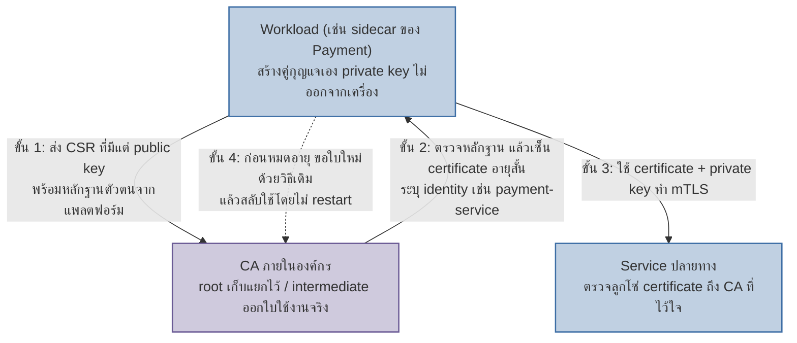
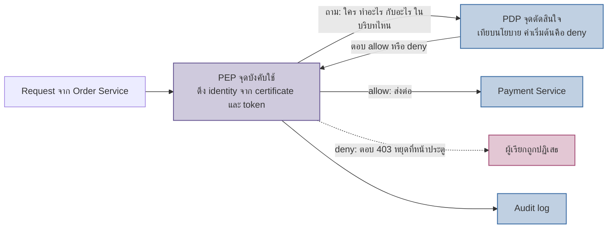
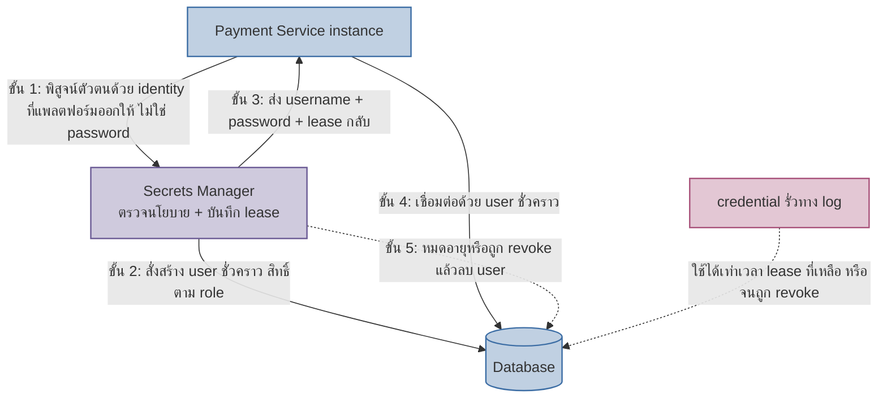
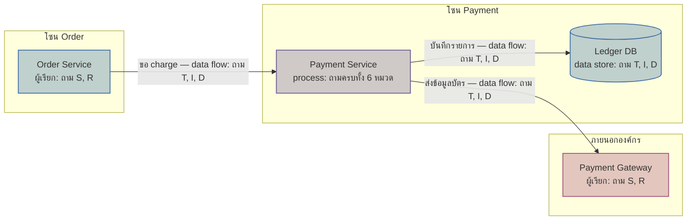
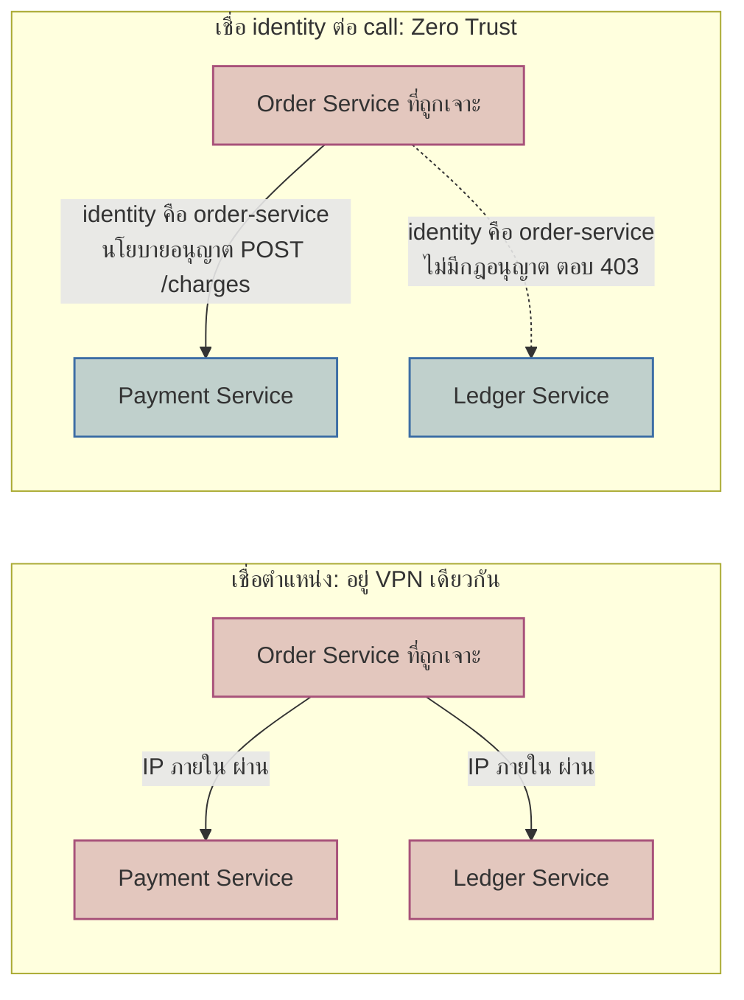
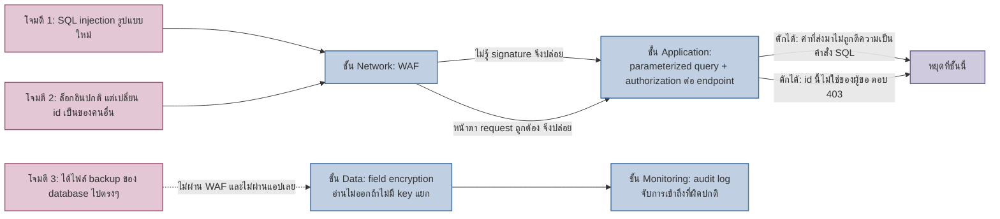
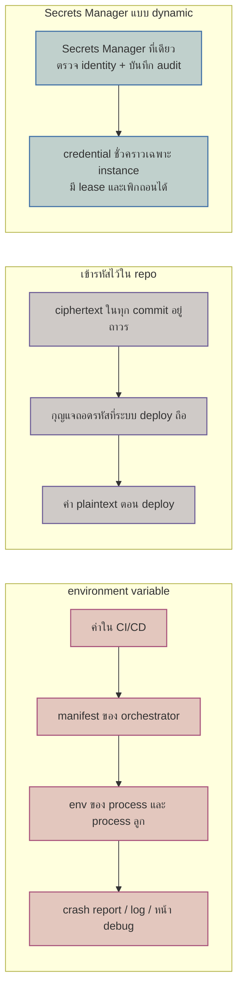

ลองนึกภาพโรงพยาบาลแห่งหนึ่งที่เพิ่งผ่านการตรวจสอบมาตรฐานความปลอดภัยจากหน่วยงานภายนอก ผลตรวจออกมาไม่สวยเลย — พยาบาลและเจ้าหน้าที่เดินเข้าออกทุกวอร์ดได้อย่างอิสระแค่เพราะใส่บัตรพนักงานผ่านประตูหน้าตึกมาแล้ว ไม่มีใครตรวจซ้ำว่าคนที่เดินเข้าห้องผ่าตัดควรมีสิทธิ์เข้าจริงหรือเปล่า, ทางเข้าตึกมีจุดตรวจแค่จุดเดียวคือประตูหน้า ไม่มีจุดตรวจซ้ำที่ลิฟต์หรือหน้าห้องยา, ฝ่ายบริหารไม่เคยนั่งประชุมกันจริงจังว่า "ถ้ามีคนร้ายอยากขโมยยาควบคุมพิเศษ เขาจะเข้าทางไหน" ก่อนออกแบบผังตึก และที่แย่ที่สุดคือกุญแจมาสเตอร์ที่เปิดได้ทุกห้องถูกพบว่าแปะไว้ใต้โต๊ะเวรพยาบาลมานานหลายเดือนโดยไม่มีใครสังเกต

นี่คือสถานการณ์เดียวกับที่ทีมวิศวกรรมของ fintech startup แห่งหนึ่งต้องเจอ หลังจ้างบริษัทภายนอกมาทำ <mark class="hl-term">**Penetration Test**</mark> บนแพลตฟอร์มชำระเงินที่เพิ่งสร้างเสร็จ ผลตรวจพบ 4 จุดอ่อนที่คล้ายกันเป๊ะ: internal service เชื่อกันเองเพราะ "อยู่ใน VPN เดียวกัน" โดยไม่มีการตรวจตัวตนต่อ call, มีแค่ WAF ตัวเดียวเป็นเกราะป้องกันเดียวของทั้งระบบ, ไม่เคยมีการนั่ง threat-model payment flow ก่อนเริ่มเขียนโค้ดเลยสักครั้ง และเจอ database credential ถูก hardcode อยู่ในไฟล์ config ที่หลุด commit เข้า git <mark class="hl-warning">ทีมเชื่อว่า "อยู่ในเครือข่ายเดียวกัน" เท่ากับ "ไว้ใจกันได้" ซึ่งเป็นสมมติฐานเดียวกับที่ทำให้เกิด data breach ใหญ่ๆ มานักต่อนัก</mark>

โจทย์นี้ต้องใช้ pillar ของ Security Architecture (โมดูล 30) เกือบทั้งหมดมาแก้ทีละจุดอ่อน มาดูกันว่าถ้าต้องรื้อสถาปัตยกรรมความปลอดภัยของ payment platform จริงๆ ตามผล pentest จะคิดยังไง

## Requirement คร่าวๆ

- ต้องแก้ทั้ง 4 จุดที่ auditor ระบุให้ทันก่อน re-test รอบสอง ห้ามเหลือช่องโหว่ critical ข้ามรอบ
- ระบบ payment ต้อง**ไม่มี downtime** ระหว่างรื้อสถาปัตยกรรม เพราะยังต้อง process transaction ลูกค้าจริงต่อเนื่อง
- ห้ามลดมาตรฐาน compliance เดิม (PCI-DSS) ระหว่างทำ ต้องแก้แบบเพิ่มความปลอดภัย ไม่ใช่ลดขอบเขต
- ต้องมีหลักฐาน (audit log, ADR, threat model doc) ที่ auditor ตรวจสอบย้อนหลังได้ ไม่ใช่แค่ "แก้แล้วเชื่อสิ"
- ทีมมีเวลาและกำลังคนจำกัด ต้องจัดลำดับว่าอะไรกระทบความเสี่ยงสูงสุดก่อน

## จุดอ่อนที่ 1: VPN Trust → Zero Trust Architecture

จากโมดูล 30 (Security Architecture) หัวข้อ <mark class="hl-term">**Zero Trust Architecture**</mark> — ปัญหาที่ auditor เจอคือ Order Service เรียก Payment Service และ Payment Service เรียก Ledger Service ได้ตรงๆ โดยเช็คแค่ว่ามาจาก IP range ภายใน VPN เท่านั้น ถ้า service ไหนถูกเจาะแม้จุดเดียว ผู้บุกรุกเรียก internal API ที่เหลือได้ทันทีเหมือนเป็น service นั้นเอง

ทางแก้คือเปลี่ยนหน่วยของความเชื่อถือจาก "อยู่ใน network ไหน" เป็น "identity ของ request นี้" — บังคับ mutual TLS (mTLS) พร้อม verify ตัวตนทุก service-to-service call แม้จะอยู่ใน data center เดียวกันก็ตาม ไม่มี call ไหนได้รับการยกเว้นเพราะ "เป็น internal อยู่แล้ว"


```mermaid
flowchart TB
    subgraph Before["ก่อน Pentest — เชื่อกันเพราะอยู่ VPN เดียวกัน"]
        SvcA1["Order Service"] -->|"เรียกตรง ไม่ตรวจตัวตน"| SvcB1["Payment Service"]
        SvcB1 -->|"เรียกตรง"| SvcC1["Ledger Service"]
        WAF1["WAF ตัวเดียว"] --> SvcA1
    end
    subgraph After["หลัง Redesign — Zero Trust + Defense in Depth"]
        SvcA2["Order Service"] -->|"mTLS + verify identity ทุกครั้ง"| SvcB2["Payment Service"]
        SvcB2 -->|"mTLS + verify identity"| SvcC2["Ledger Service"]
        L1["Network: WAF+DDoS"] --> L2["Identity: mTLS/Auth"] --> L3["App: Input validation/authz"] --> L4["Data: Field encryption"] --> L5["Monitoring: Audit log"]
    end

    classDef risky fill:#a8527a52,stroke:#a8527a,stroke-width:1.5px
    classDef secure fill:#3d6ea552,stroke:#3d6ea5,stroke-width:1.5px
    class SvcA1,SvcB1,SvcC1,WAF1 risky
    class SvcA2,SvcB2,SvcC2,L1,L2,L3,L4,L5 secure
```

## จุดอ่อนที่ 2: WAF ตัวเดียว → Defense in Depth

จากโมดูล 30 (Security Architecture) หัวข้อ <mark class="hl-term">**Defense in Depth**</mark> — auditor ชี้ว่าระบบพึ่ง WAF ตัวเดียวที่ขอบ network เป็นเกราะป้องกันเดียว ถ้า payload ใหม่ที่ WAF ไม่รู้จัก signature หลุดผ่านเข้ามาได้ ก็ไม่มีชั้นไหนดักไว้อีกเลย

ทางแก้คือวางชั้นป้องกันที่**เป็นอิสระจากกัน**ตามผังในไดอะแกรมด้านบน: Network (WAF+DDoS), Identity (mTLS/Auth ตามข้อ 1), Application (input validation + authorization ต่อ endpoint ของ payment flow เอง), Data (field-level encryption สำหรับข้อมูลบัตร/บัญชี) และ Monitoring (audit log จับความผิดปกติที่หลุดทุกชั้นมาได้) <mark class="hl-insight">หัวใจคือความหลากหลายของกลไก ไม่ใช่จำนวนชั้น — เพิ่ม WAF อีกตัวที่กันวิธีเดียวกันไม่ใช่ Defense in Depth จริง</mark>

## จุดอ่อนที่ 3: ไม่เคย Threat Model → STRIDE บน Payment Flow

จากโมดูล 30 (Security Architecture) หัวข้อ Threat Modeling — ทีมสร้าง payment flow เสร็จก่อนแล้วค่อยมาคิดเรื่องความปลอดภัยทีหลัง ผลคือช่องโหว่ทั้ง 4 ข้อของ pentest ล้วนเป็นสิ่งที่ <mark class="hl-term">**STRIDE**</mark> ควรจับได้ตั้งแต่ตอนออกแบบ ถ้าเอา payment flow มาไล่ทีละหมวดจะเห็นชัดว่าทุกช่องโหว่ผูกกับ trust boundary ที่ไม่เคยถูกวาดไว้เลย

```demo
component: StepThroughDiagram
props: {"steps":[{"label":"S — Spoofing","detail":"ปลอมเป็น Order Service ยิง payment request เข้า Payment Service ได้ เพราะระบบเดิมเชื่อแค่ IP ภายใน VPN ไม่ตรวจตัวตนต่อ call — แก้ด้วย mTLS/identity verification ทุก call (Zero Trust)"},{"label":"T — Tampering","detail":"แก้ไขจำนวนเงิน (amount) ของ request ระหว่างทางก่อนถึง Payment Service เช่นเปลี่ยน 10000 บาทเป็น 10 บาท เพราะไม่มี integrity check — แก้ด้วย signed request และ validation ที่ Application layer ของ Defense in Depth"},{"label":"R — Repudiation","detail":"ลูกค้าปฏิเสธภายหลังว่าไม่ได้ทำธุรกรรมที่ตัดเงินสำเร็จไปแล้ว เพราะระบบไม่มีหลักฐานที่แก้ไขไม่ได้ — ต้องมี audit log แบบ append-only ผูกกับทุก charge ที่เกิดขึ้น"},{"label":"I — Information Disclosure","detail":"credential ของ database หลุดผ่าน config file ที่ commit เข้า git ทำให้ข้อมูล transaction ทั้งหมดเข้าถึงได้ถ้ามีคน clone repo — แก้ด้วย Secure by Design ย้ายไป Secrets Manager"},{"label":"D — Denial of Service","detail":"WAF ตัวเดียวถูก bypass ทำให้ payment endpoint รับ traffic ผิดปกติจนล่ม — ต้องมีชั้นป้องกันอื่นเสริม เช่น rate limiting ที่ Application layer ไม่พึ่ง WAF อย่างเดียว"},{"label":"E — Elevation of Privilege","detail":"service ที่แค่อ่าน order กลับมีสิทธิ์เขียนลง ledger database ได้เพราะไม่เคยจำกัดสิทธิ์ตั้งแต่แรก — แก้ด้วย least privilege ตาม Secure by Design"}]}
```

## จุดอ่อนที่ 4: Credential หลุดใน Git → Secure by Design

จากโมดูล 30 (Security Architecture) หัวข้อ Secure by Design — credential ของ database ถูก hardcode ไว้ในไฟล์ config แล้ว commit เข้า git โดยไม่มีใครทันสังเกต เป็นสาเหตุ data breach ที่พบบ่อยที่สุดอย่างหนึ่งเพราะโค้ดมักถูกแชร์ ถูก clone หรือหลุดผ่าน log

ทางแก้ต้องทำสองอย่างพร้อมกัน — ย้าย credential ทั้งหมดไป <mark class="hl-term">**Secrets Manager**</mark> ให้ application ดึงมาตอน runtime แบบ short-lived แทนการฝังไว้ตรงๆ และใช้หลัก **Least Privilege** ควบคู่กันคือให้แต่ละ service มีสิทธิ์เข้าถึง database แค่เท่าที่งานต้องใช้จริง เช่น service ที่แค่อ่าน order ไม่ควรมี credential ที่เขียนได้เลย ต่อให้เป็น credential เดียวกันในอดีตก็ตาม

| ปัญหาที่ pentest เจอ | Pillar จากโมดูล 30 ที่แก้ | ต้นทุนถ้าไม่แก้ |
|---|---|---|
| VPN trust ไม่ตรวจตัวตนต่อ call | Zero Trust Architecture | breach จุดเดียว lateral movement ได้ทั้งระบบ |
| WAF ตัวเดียว เป็นเกราะเดียว | Defense in Depth | payload ใหม่ bypass WAF แล้วไม่มีชั้นไหนดักต่อ |
| ไม่เคย threat model payment flow | Threat Modeling (STRIDE) | ช่องโหว่ถูกเจอตอนถูกโจมตีจริงแทนที่จะเจอตอนออกแบบ |
| credential หลุดใน git | Secure by Design | ต้อง rotate ฉุกเฉินและ audit การเข้าถึงย้อนหลังทั้งหมด |

## Trade-off: Zero Trust + Defense in Depth ไม่ได้ฟรี

นี่คือจุดที่โมดูล 16 (Quality Attributes & Trade-off Analysis) เข้ามาเกี่ยวข้องตรงๆ — การแก้ทั้ง 4 จุดพร้อมกันไม่ใช่การอัปเกรดที่ไม่มีต้นทุน mTLS handshake ทุก service-to-service call เพิ่ม latency ต่อ transaction ชัดเจน และหลายชั้นป้องกันที่เป็นอิสระจากกันหมายถึงต้องมีทีมดูแล certificate rotation, secrets rotation และ audit log เพิ่มขึ้นตามไปด้วย

| มิติ (Quality Attribute) | ก่อน (VPN trust + WAF เดียว) | หลัง (Zero Trust + Defense in Depth) |
|---|---|---|
| Latency ต่อ request | ต่ำ ตรวจครั้งเดียวตอนเข้า network | สูงขึ้นจาก mTLS handshake ทุก call |
| Ops overhead | ต่ำ ดูแล WAF ตัวเดียว | สูงกว่า ต้องดูแล certificate/secrets rotation หลายระบบ |
| Blast radius ถ้าเจาะได้ | สูงมาก lateral movement ทั้งระบบ | จำกัดวง ชั้นอื่นยังกันได้ |
| ผ่าน pentest re-test | เสี่ยงตกซ้ำจุดเดิม | พิสูจน์ให้ auditor เห็นได้ทุกจุด |

## คำถามเจาะลึกที่มักถูกถามต่อ

พออธิบายว่าจะแก้ 4 จุดอ่อนด้วย Zero Trust, Defense in Depth, STRIDE และ Secrets Manager คนสัมภาษณ์หรือเพื่อนร่วมทีมมักไม่หยุดแค่ชื่อของเครื่องมือ แต่จะถามต่อว่า "พูดง่าย แล้วข้างในมันทำงานยังไง ถ้า credential หลุดจริงจะเกิดอะไรขึ้น" สี่คำถามแรก (Q1–Q4) คือคำถามต่อยอดแนวนี้ที่เจอบ่อย แต่ละข้อไล่ให้ครบว่า ใช้ความรู้อะไรจากโมดูลไหน แก้ปัญหายังไง ข้างใต้มีขั้นตอนอะไรจริงๆ และตรงไหนที่ยังพังได้ ส่วนอีกแนวที่ senior ชอบถามที่สุดคือ "ทำไมเลือกแบบนี้ ทำไมไม่เลือกอีกแบบ" สามคำถามหลัง (Q5–Q7) จึงไล่ให้เห็นทางเลือกที่ไม่ได้เลือก เหตุผลข้างใต้ ราคาที่ต้องจ่าย และเงื่อนไขที่ทำให้คำตอบเปลี่ยน

### Q1: บอกว่าใช้ mTLS พิสูจน์ตัวตนระหว่าง service แต่จริงๆ handshake ทำอะไรบ้าง certificate มาจากไหน และหมดอายุแล้วหมุนเวียนยังไง

**ใช้ความรู้อะไร:** โมดูล 30 (Security Architecture) หัวข้อ Zero Trust Architecture ที่เปลี่ยนหน่วยของความเชื่อถือเป็น identity ของ request บวกโมดูล 18 หัวข้อ "ขั้นสูง: Service Mesh Sidecar, mTLS, Traffic Shaping" ที่เล่าภาพรวมว่า sidecar จัดการ certificate ให้ ข้อนี้ลงไปดูว่าขั้นตอนจริงๆ คืออะไร

**นึกภาพก่อน:** นึกถึงสองคนที่ไม่เคยเจอกันนัดเจอกันที่ล็อบบี้ ทั้งคู่ต้องแสดงบัตรที่ออกโดยหน่วยงานที่ทั้งสองฝ่ายเชื่อถือ และต้องพิสูจน์ด้วยว่าบัตรเป็นของตัวเองจริง ไม่ใช่ถ่ายสำเนาบัตรของคนอื่นมา เว็บ HTTPS ทั่วไปตรวจแบบทางเดียว (browser ตรวจบัตรของเว็บ แต่เว็บไม่ตรวจบัตรของ browser) ส่วน mTLS (mutual TLS) ตรวจ**ทั้งสองทาง** ซึ่งตรงกับที่จุดอ่อนที่ 1 ต้องการ เพราะ Payment Service ต้องรู้ว่าคนเรียกคือ Order Service จริงๆ ไม่ใช่เครื่องอื่นที่บังเอิญอยู่ใน VPN เดียวกัน

**แก้ปัญหายังไง:** แบ่งเป็นสองเรื่อง คือ "บัตรออกมาจากไหน" กับ "ตอนเจอกันตรวจอะไรบ้าง" เรื่องแรกคือการออก certificate:

1. แต่ละ workload สร้างกุญแจสองดอกเอง — **private key** เก็บลับอยู่ในเครื่องตัวเอง ส่วน **public key** แจกได้
2. ส่งคำขอ (CSR — Certificate Signing Request) ที่มีแต่ public key ไปที่ <mark class="hl-term">**CA (Certificate Authority)**</mark> ภายในองค์กร พร้อมหลักฐานว่าตัวเองคือ service ไหน เช่น token ที่แพลตฟอร์มออกให้ (ใน Kubernetes มักเป็น ServiceAccount token)
3. CA ตรวจหลักฐานแล้วเซ็น certificate ที่ระบุ identity ของ service (เช่น payment-service) และกำหนดอายุสั้นๆ
4. ก่อนหมดอายุ workload ขอใบใหม่ด้วยวิธีเดิมแล้วสลับใช้เอง โดยไม่ต้อง restart

<mark class="hl-insight">certificate เป็นข้อมูลสาธารณะที่ใครก็ดูได้ สิ่งที่พิสูจน์ตัวตนจริงคือ private key ที่ไม่เคยออกจากเครื่อง ขโมยสำเนา certificate ไปก็ปลอมตัวไม่ได้ถ้าไม่มี private key</mark>


```mermaid
flowchart TB
    W["Workload (เช่น sidecar ของ Payment)<br/>สร้างคู่กุญแจเอง private key ไม่ออกจากเครื่อง"]
    CA["CA ภายในองค์กร<br/>root เก็บแยกไว้ / intermediate ออกใบใช้งานจริง"]
    W -->|"ขั้น 1: ส่ง CSR ที่มีแต่ public key<br/>พร้อมหลักฐานตัวตนจากแพลตฟอร์ม"| CA
    CA -->|"ขั้น 2: ตรวจหลักฐาน แล้วเซ็น certificate อายุสั้น<br/>ระบุ identity เช่น payment-service"| W
    W -->|"ขั้น 3: ใช้ certificate + private key ทำ mTLS"| Peer["Service ปลายทาง<br/>ตรวจลูกโซ่ certificate ถึง CA ที่ไว้ใจ"]
    W -.->|"ขั้น 4: ก่อนหมดอายุ ขอใบใหม่ด้วยวิธีเดิม<br/>แล้วสลับใช้โดยไม่ restart"| CA

    classDef workload fill:#3d6ea552,stroke:#3d6ea5,stroke-width:1.5px
    classDef authority fill:#6b5b9552,stroke:#6b5b95,stroke-width:1.5px
    class W,Peer workload
    class CA authority
```

```demo
component: StepThroughDiagram
props: {"steps":[{"label":"1. ClientHello","detail":"Order Service (ฝั่ง client) เริ่มต่อ connection ไปหา Payment Service ส่งรายชื่อวิธีเข้ารหัสที่รองรับ พร้อมส่วนของกุญแจชั่วคราว (ephemeral key share) ที่สร้างใหม่เฉพาะ connection นี้ (ตัวอย่างนี้ใช้ลำดับข้อความของ TLS 1.3 ส่วน TLS 1.2 ลำดับต่างเล็กน้อยแต่หลักการเดียวกัน)"},{"label":"2. ServerHello","detail":"Payment Service เลือกวิธีเข้ารหัส แล้วส่งส่วนกุญแจชั่วคราวของตัวเองกลับมา ถึงตรงนี้ทั้งสองฝั่งคำนวณ shared secret ตัวเดียวกันได้ และข้อความต่อจากนี้ถูกเข้ารหัสแล้ว แม้แต่ certificate ก็ไม่ถูกส่งแบบเปิด"},{"label":"3. Server แสดงตัว และขอให้ client แสดงตัวกลับ","detail":"Payment ส่ง CertificateRequest (บอกว่าขอดูบัตรของ client ด้วย) ส่ง certificate ของตัวเอง และส่ง CertificateVerify คือลายเซ็นที่เซ็นสรุป handshake ที่ผ่านมาด้วย private key เพื่อพิสูจน์ว่าถือกุญแจจริง ไม่ใช่แค่ถือสำเนาใบรับรอง"},{"label":"4. Client ตรวจ certificate ของ server","detail":"ตรวจสามอย่าง คือลูกโซ่ certificate ไปจบที่ CA ที่ตัวเองไว้ใจ, ยังอยู่ในช่วงเวลาที่ใช้ได้, และ identity ในใบตรงกับ service ที่ตั้งใจเรียก (payment-service) ข้อใดข้อหนึ่งไม่ผ่านก็ตัด connection ทันที"},{"label":"5. Client ส่ง certificate ของตัวเองกลับ","detail":"Order Service ส่ง certificate และ CertificateVerify ของตัวเอง ขั้นนี้แหละที่ทำให้เป็น mutual เพราะ Payment ได้เห็นบัตรของผู้เรียกจริงๆ แทนที่จะเดาจาก IP"},{"label":"6. Server ตรวจ certificate ของ client","detail":"Payment ตรวจสามข้อแบบเดียวกัน ถ้าไม่ผ่านจะปิด connection ก่อนที่โค้ดธุรกิจจะเห็น request แม้แต่ตัวเดียว ถ้าผ่านก็รู้แล้วว่าผู้เรียกคือ order-service (ส่วนจะอนุญาตให้ทำอะไรเป็นเรื่องของ Q2)"},{"label":"7. Finished แล้วส่งข้อมูลจริง","detail":"สองฝั่งยืนยันว่า handshake ไม่ถูกแก้ระหว่างทาง แล้วใช้ session key ที่ได้จากกุญแจชั่วคราวเข้ารหัส request และ response ต่อ connection เดียวกันนี้ใช้ซ้ำกับหลาย request ได้ จึงไม่ต้อง handshake ใหม่ทุกครั้ง"}]}
```

**ข้างใต้ทำงานยังไง:** สิ่งที่ตรวจในขั้น 4 และ 6 ไม่มีเวทมนตร์ คือเทียบกับข้อมูลที่แต่ละฝั่งถืออยู่แล้ว ได้แก่ รายการ CA ที่ไว้ใจ (trust store), เวลาปัจจุบันเทียบกับช่วงที่ใบใช้ได้, และ identity ที่เขียนไว้ในช่อง Subject Alternative Name (SAN) ของ certificate ซึ่งหลายระบบใช้รูปแบบ URI ตามมาตรฐาน SPIFFE (Secure Production Identity Framework For Everyone) ส่วน key ที่เข้ารหัสข้อมูลจริงมาจากกุญแจชั่วคราวใหม่ทุก connection ไม่ได้มาจาก private key ของ certificate — private key มีหน้าที่แค่เซ็นพิสูจน์ตัวตน จึงทำให้ต่อให้ private key ถูกขโมยในอนาคต traffic ที่ถูกบันทึกไว้ในอดีตก็ยังถอดรหัสไม่ได้ (เรียกว่า forward secrecy)

เมื่อใช้ service mesh ทั้งหมดนี้ย้ายไปอยู่ที่ sidecar: sidecar ถือ private key และ certificate, ทำ CSR และต่ออายุเอง, ทำ handshake แทน application ส่วน control plane ของ mesh ทำหน้าที่เป็น CA ภายใน โค้ดของ Order Service ยังยิง request แบบธรรมดาไปหา sidecar ในเครื่องเดียวกัน (ขอบเขตความเชื่อถือจึงอยู่ที่ Pod ไม่ใช่ที่โค้ด) การตั้ง certificate ให้อายุสั้นยังช่วยเรื่องการเพิกถอนด้วย: ถ้า certificate กับ key หลุดไป มันจะใช้ไม่ได้เองเมื่อหมดอายุ ไม่ต้องพึ่งการแจกรายการเพิกถอนให้ทุก service รู้ทันเวลา

**ถ้าพังหรือมีข้อควรระวังอะไร:**

- **CA คือกุญแจมาสเตอร์ของทั้งระบบ** — ใครถือ private key ของ CA ออก certificate ปลอมเป็น service ไหนก็ได้ จึงนิยมเก็บ root CA แยกออกจากระบบที่ออนไลน์ (เช่น offline หรือใน HSM — Hardware Security Module อุปกรณ์เก็บกุญแจที่ดึงกุญแจออกมาไม่ได้) แล้วให้ intermediate CA เป็นตัวออกใบใช้งานประจำวัน
- <mark class="hl-warning">ถ้า certificate หมดอายุโดยไม่มีระบบต่ออายุอัตโนมัติ ฝั่งตรงข้ามจะปฏิเสธ handshake ทันที ผลคือ service ล่มทั้งที่โค้ดไม่ผิด</mark> ต้องต่ออายุตั้งแต่ยังเหลืออายุอีกมาก ไม่รอถึงวินาทีสุดท้าย และตั้ง alert เมื่อการต่ออายุล้มเหลว
- **นาฬิกาเครื่องเพี้ยน** — เพราะ certificate มีช่วงเวลาที่ใช้ได้ เครื่องที่เวลาคลาดเคลื่อนมากอาจปฏิเสธใบที่ถูกต้อง (คิดว่ายังไม่เริ่มมีผลหรือหมดอายุแล้ว) ต้องซิงก์เวลาด้วย NTP ให้ดี
- **ต้นทุน latency ที่ตารางในเคสเขียนแบบย่อว่า "ทุก call"** จริงๆ แล้ว handshake เกิดตอน**เปิด connection ใหม่** ส่วน request ที่ใช้ connection เดิมซ้ำ (connection pooling) จ่ายครั้งเดียว ต้นทุนจึงเห็นชัดตอน pod เพิ่งเริ่มหรือ scale out มากกว่าตอนวิ่งปกติ
- mTLS บอกได้แค่ "ใครเรียก" ไม่ได้บอกว่า "ควรอนุญาตหรือไม่" ซึ่งเป็นหัวข้อของ Q2

### Q2: mTLS พิสูจน์ได้แค่ว่าใครเรียก แล้วระบบตัดสินยังไงว่า request นี้ "ควรได้รับอนุญาต" — Zero Trust บังคับใช้ต่อ request จริงๆ ยังไง

**ใช้ความรู้อะไร:** โมดูล 30 (Security Architecture) หัวข้อ Zero Trust Architecture ที่มี Policy Decision Point ในไดอะแกรม บวกหัวข้อ Secure by Design (Least Privilege) และ sidecar จาก "ขั้นสูง: Service Mesh Sidecar, mTLS, Traffic Shaping" ที่เป็นตัวอย่างของจุดที่ใช้บังคับกฎ

**นึกภาพก่อน:** กลับไปที่โรงพยาบาลในเรื่องเปิด แต่ปรับใหม่ ยามหน้าห้องยาไม่ได้ตัดสินเอง เขาเช็คบัตรว่าเป็นใคร แล้วโทรถามห้องควบคุมที่ถือสมุดกฎว่า "คนนี้ขอเข้าห้องยาควบคุมตอนนี้ได้ไหม" ห้องควบคุมตอบได้หรือไม่ได้ ยามทำตามและจดบันทึกทุกครั้ง การแยกคนถือสมุดกฎ (**Policy Decision Point หรือ PDP** จุดตัดสินใจ) ออกจากคนยืนหน้าประตู (<mark class="hl-term">**Policy Enforcement Point (PEP)**</mark> จุดบังคับใช้) ทำให้แก้กฎที่เดียวแล้วมีผลกับประตูทุกบาน โดยประตูแต่ละบานไม่ต้องเขียนกฎเอง

**แก้ปัญหายังไง:** ต่อ request หนึ่งครั้ง เช่น POST /charges จาก Order Service ไป Payment Service:

1. PEP ที่ตั้งอยู่หน้า Payment (อาจเป็น sidecar, API gateway หรือ middleware) ดัก request ก่อนถึงโค้ดธุรกิจ
2. อ่าน identity ของผู้เรียกจาก certificate ที่ผ่าน mTLS แล้วใน Q1 และถ้ามี user ต้นทาง ก็ตรวจ token ของ user (ลายเซ็นถูกต้อง, ยังไม่หมดอายุ, ระบุว่าใช้กับบริการนี้ได้)
3. ถาม PDP ว่า ใคร (identity) ทำอะไร (POST) กับอะไร (/charges) ในบริบทไหน (เช่น ยอดเงิน, เวลา, สถานะของเครื่องที่เรียก)
4. PDP เทียบกับนโยบาย แล้วตอบ allow หรือ deny โดยค่าเริ่มต้นคือ **deny** ถ้าไม่มีกฎที่อนุญาตไว้ชัดเจน
5. PEP ทำตามคำตอบ คือส่งต่อหรือตอบ 403 และบันทึกผลการตัดสินพร้อม identity ลง audit log (ต่อยอดไปเป็นหลักฐานของหมวด Repudiation ใน STRIDE และชั้น Monitoring ของ Defense in Depth)


```mermaid
flowchart LR
    R["Request จาก Order Service"] --> PEP["PEP จุดบังคับใช้<br/>ดึง identity จาก certificate และ token"]
    PEP -->|"ถาม: ใคร ทำอะไร กับอะไร ในบริบทไหน"| PDP["PDP จุดตัดสินใจ<br/>เทียบนโยบาย ค่าเริ่มต้นคือ deny"]
    PDP -->|"ตอบ allow หรือ deny"| PEP
    PEP -->|"allow: ส่งต่อ"| S["Payment Service"]
    PEP -.->|"deny: ตอบ 403 หยุดที่หน้าประตู"| X["ผู้เรียกถูกปฏิเสธ"]
    PEP --> A["Audit log"]

    classDef enforce fill:#6b5b9552,stroke:#6b5b95,stroke-width:1.5px
    classDef decide fill:#3d6ea552,stroke:#3d6ea5,stroke-width:1.5px
    classDef blocked fill:#a8527a52,stroke:#a8527a,stroke-width:1.5px
    class PEP enforce
    class PDP,S,A decide
    class X blocked
```

```demo
component: JourneyDiagram
props: {"nodes":[{"icon":"building","label":"Order Service"},{"icon":"gate","label":"PEP หน้า Payment"},{"icon":"notebook","label":"PDP + นโยบาย"},{"icon":"building","label":"Payment Service"}],"travelerIcon":"envelope","steps":[{"activeNode":0,"caption":"Order Service ส่ง POST /charges ไปหา Payment Service ผ่าน connection ที่ผ่าน mTLS แล้ว ตอนนี้รู้แค่ว่าใครเรียก ยังไม่รู้ว่าควรอนุญาตไหม"},{"activeNode":1,"caption":"PEP ดัก request ก่อนถึงโค้ดธุรกิจ อ่าน identity ของผู้เรียกจาก certificate ที่ตรวจแล้ว (ไม่ใช่จาก header ที่ผู้เรียกพิมพ์มาเอง) และตรวจ token ของ user ต้นทางถ้ามี"},{"activeNode":2,"caption":"PEP ถาม PDP ว่า order-service ขอทำ POST กับ /charges ยอด 1,500 บาทได้ไหม PDP เทียบกับนโยบายที่เขียนไว้ ถ้าไม่มีกฎอนุญาตชัดเจนคำตอบคือ deny"},{"activeNode":1,"caption":"PDP ตอบกลับ PEP บันทึกผลการตัดสินพร้อม identity ลง audit log แล้วทำตามคำตอบ"},{"activeNode":3,"caption":"ถ้า allow request ถึง Payment Service ถ้า deny PEP ตอบ 403 ที่หน้าประตู โค้ดธุรกิจไม่เคยเห็น request นั้นเลย"}]}
```

**ข้างใต้ทำงานยังไง:** ข้อแรกที่ต้องรู้คือ identity ต้องมาจาก**หลักฐานเข้ารหัส** ไม่ใช่ข้อมูลที่ผู้เรียกบอกมาเอง เช่น header ชื่อ X-Caller ที่ใครก็ใส่ค่าอะไรก็ได้ PEP จึงอ่านชื่อ service จาก certificate ที่ handshake ตรวจแล้วเท่านั้น ข้อที่สองคือ PDP ไม่จำเป็นต้องเป็น service ไกลที่ถูกเรียกทุก request มักเป็น policy engine ที่รันติดกับ PEP (ในตัว sidecar หรือเป็น library) แล้ว control plane ส่งชุดนโยบายล่าสุดมาอัปเดตให้ การตัดสินจึงเกิดในเครื่องโดยไม่ต้องข้าม network ทุกครั้ง (ส่วนการตัดสินที่ซับซ้อนมากอาจยังเรียก PDP กลางได้) ข้อสุดท้ายคือนโยบายเป็นข้อมูลหรือโค้ดที่เก็บใน git และ review เหมือนโค้ดอื่น เช่นกฎ "order-service เรียก POST /charges ได้, ledger-service เรียกไม่ได้, ไม่มีใครลบรายการ ledger ผ่านช่องทางนี้"

เหตุผลที่เลิกเช็ค IP ไม่ใช่แค่ความเข้มงวด แต่เพราะ IP ใช้เป็น identity ไม่ได้ตั้งแต่ต้น: เครื่องหรือ Pod ที่ถูกเจาะก็มี IP ภายในเหมือนตัวจริง และใน Kubernetes IP ของ Pod เปลี่ยนทุกครั้งที่ Pod ถูกสร้างใหม่ จึงไม่ผูกกับ service ใดถาวร <mark class="hl-insight">หน่วยความเชื่อถือที่เชื่อถือได้ต้องเป็นสิ่งที่พิสูจน์ด้วยกุญแจได้และถูกตรวจซ้ำทุก request ไม่ใช่ตำแหน่งบน network</mark>

**ถ้าพังหรือมีข้อควรระวังอะไร:**

- <mark class="hl-warning">ผ่านการพิสูจน์ตัวตน (authenticated) ไม่เท่ากับได้รับอนุญาต (authorized)</mark> — certificate ที่ถูกต้องของ Order Service ยังเป็น identity จริง แม้โค้ดของ service นั้นจะถูกแอบใส่ของร้ายผ่าน dependency ก็ตาม ทางลดความเสียหายคือกฎ least privilege ที่จำกัดว่า order-service ทำได้แค่ endpoint ที่จำเป็น และปิดที่ต้นทางด้วยเรื่องในหัวข้อ "ขั้นสูง: Supply Chain Security SBOM, Dependency Signing, SLSA"
- **PDP หรือนโยบายใช้ไม่ได้** ต้องเลือกล่วงหน้าว่าจะ fail closed (ปฏิเสธเมื่อถามไม่ได้) หรือ fail open (ปล่อยผ่าน) ระบบชำระเงินควร fail closed แต่มีราคาคือ availability จึงให้ PEP เก็บนโยบายล่าสุดไว้ตัดสินต่อได้ ไม่ต้องหยุดทั้งระบบเมื่อ control plane ล่ม
- **กฎกว้างเกินไป** เช่น "อนุญาตทุก service ภายใน" คือการเอา VPN trust กลับมาในรูปแบบใหม่ ต้องเขียนกฎเป็นคู่ผู้เรียกกับ endpoint ที่จำเป็นจริงๆ
- **Confused deputy** — ถ้า Payment ดูแค่ identity ของ Order Service แล้วไม่ดูว่า user ต้นทางคือใคร Order Service ที่ถูกหลอกก็ขอ charge แทนคนอื่นได้ ต้องส่งต่อและตรวจ token ของ user ต้นทางด้วย
- นโยบายและ token มีเวลาหน่วงกว่าจะมีผล จึงตั้งอายุ token ให้สั้นและตรวจวันหมดอายุทุก request

### Q3: ย้าย credential ไป Secrets Manager แล้วดีกว่าฝังในไฟล์ตรงไหน — ถ้า credential หลุด ความเสียหายและวิธีรับมือต่างกันยังไง

**ใช้ความรู้อะไร:** โมดูล 30 (Security Architecture) หัวข้อ Secure by Design (Secrets Management และ Least Privilege) บวก identity ของ workload จาก Q1 ที่ใช้พิสูจน์ตัวตนต่อ Secrets Manager

**ปัญหาคืออะไร:** กลับไปที่กุญแจมาสเตอร์ที่แปะใต้โต๊ะเวรพยาบาลในเรื่องเปิด ปัญหาไม่ใช่แค่ "กุญแจวางผิดที่" แต่คือ (1) ใครเห็นก็ก๊อปได้เงียบๆ โดยไม่มีร่องรอย (2) กุญแจดอกเดียวเปิดได้ตลอดกาล ไม่มีวันหมดอายุ (3) ทุกคนใช้ดอกเดียวกัน พอเกิดเหตุจึงแยกไม่ออกว่าใครใช้ (4) จะเปลี่ยนล็อกต้องเปลี่ยนพร้อมกันทุกประตู password ที่ hardcode ในไฟล์ config ตรงกับทั้งสี่ข้อ และ git เก็บประวัติทุก commit ตลอดไป ต่อให้ลบไฟล์ในเวอร์ชันล่าสุดแล้ว ค่าเดิมก็ยังอยู่ในประวัติและในสำเนาที่ถูก clone ไปแล้ว

**แก้ปัญหายังไง:** ให้ Secrets Manager ออก <mark class="hl-term">**dynamic credential**</mark> (credential ที่สร้างใหม่ให้ทีละราย มีอายุจำกัด เรียกว่ามี lease) แทน password ถาวร:

1. ตอน Payment Service เริ่มทำงาน มันพิสูจน์ตัวตนต่อ Secrets Manager ด้วย identity ที่แพลตฟอร์มออกให้ (เช่นตัวเดียวกับที่ใช้ทำ mTLS) **ไม่ใช่ด้วย password อีกตัว** เพราะถ้าต้องมี password เพื่อขอ password ก็แค่ย้ายปัญหาไปที่ใหม่ (เรียกว่า bootstrap problem หรือปัญหา secret zero)
2. Secrets Manager ตรวจนโยบายว่า identity นี้ขอ role `payment-writer` ได้ไหม
3. สร้าง database user ใหม่สำหรับ instance นี้โดยเฉพาะ ด้วยสิทธิ์เท่าที่ role นั้นกำหนด (Least Privilege) พร้อมตั้งเวลาหมดอายุ แล้วส่ง username และ password กลับ
4. application ใช้เชื่อมต่อ database และขอต่ออายุหรือขอใหม่ก่อนหมด
5. เมื่อหมดอายุหรือถูกสั่งเพิกถอน Secrets Manager ลบ user นั้นออกจาก database

<mark class="hl-insight">หัวใจคือ credential เปลี่ยนจากรหัสผ่านถาวรที่ทุกคนใช้ร่วมกัน เป็นของที่มีเจ้าของ มีวันหมดอายุ และเพิกถอนได้รายตัว</mark>


```mermaid
flowchart TB
    App["Payment Service instance"] -->|"ขั้น 1: พิสูจน์ตัวตนด้วย identity ที่แพลตฟอร์มออกให้ ไม่ใช่ password"| SM["Secrets Manager<br/>ตรวจนโยบาย + บันทึก lease"]
    SM -->|"ขั้น 2: สั่งสร้าง user ชั่วคราว สิทธิ์ตาม role"| DB[("Database")]
    SM -->|"ขั้น 3: ส่ง username + password + lease กลับ"| App
    App -->|"ขั้น 4: เชื่อมต่อด้วย user ชั่วคราว"| DB
    SM -.->|"ขั้น 5: หมดอายุหรือถูก revoke แล้วลบ user"| DB
    Leak["credential รั่วทาง log"] -.->|"ใช้ได้เท่าเวลา lease ที่เหลือ หรือจนถูก revoke"| DB

    classDef safe fill:#3d6ea552,stroke:#3d6ea5,stroke-width:1.5px
    classDef manager fill:#6b5b9552,stroke:#6b5b95,stroke-width:1.5px
    classDef threat fill:#a8527a52,stroke:#a8527a,stroke-width:1.5px
    class App,DB safe
    class SM manager
    class Leak threat
```

```demo
component: ComparisonDiagram
props: {"left":{"title":"Hardcode password ในไฟล์ config (จุดอ่อนที่ 4 เดิม)","points":["password เดียวกันถูกใช้ทุก instance และทุกที่ที่ใช้ config ชุดนี้","ไม่มีวันหมดอายุ ใครได้ไปก็ใช้ได้จนกว่าจะมีคนเปลี่ยนเอง","จะเปลี่ยนรหัสต้องแก้ทุกที่พร้อมกัน เสี่ยงระบบล่ม จึงมักถูกเลื่อน","ทุกการเชื่อมต่อดูเหมือนกัน เมื่อหลุดจึงไม่รู้ว่าใครใช้ ต้องตรวจย้อนหลังทั้งหมด"]},"right":{"title":"Dynamic credential จาก Secrets Manager","points":["แต่ละ instance ได้ user ของตัวเอง มี lease ID ผูกกับ identity ที่ขอ","หมดอายุเอง ค่าที่หลุดไปใช้ได้เท่าเวลาที่เหลือเท่านั้น","เพิกถอนรายตัวได้ทันที ไม่กระทบ instance อื่น","audit log บอกว่า identity ไหนขอเมื่อไหร่ และ database เห็นว่า user ไหนทำอะไร จึงตรวจย้อนได้แคบลง"]},"note":"ต่างกันที่ขอบเขตความเสียหายเมื่อหลุด: ตัวหนึ่งหลุดแล้วต้องหมุนทั้งระบบ อีกตัวหลุดแล้วเพิกถอนแค่ตัวเดียว"}
```

**ข้างใต้ทำงานยังไง:** Secrets Manager เก็บบันทึก lease ไว้ (lease ID, identity ผู้ขอ, role, เวลาหมดอายุ) และเพื่อสร้าง user ให้ได้ มันเองต้องถือ credential ของ database ที่มีสิทธิ์จัดการ user จึงเป็นของที่ต้องปกป้องที่สุดในระบบ (เก็บแบบเข้ารหัส จำกัดคนเข้าถึง และทำ high availability) แล้วรันคำสั่งตาม template ที่ตั้งไว้ต่อ role หน้าตาประมาณนี้ (ตัวอย่างสไตล์ PostgreSQL):

```sql
CREATE USER "v-payment-8f3a" WITH PASSWORD '(รหัสสุ่มใหม่)' VALID UNTIL '(เวลาหมดอายุ)';
GRANT SELECT, INSERT, UPDATE ON payments TO "v-payment-8f3a";
```

ตอนเพิกถอนก็รันคำสั่งลบ user นั้น และทุกการขอกับการเพิกถอนถูกบันทึก audit (ผลิตภัณฑ์อย่าง HashiCorp Vault มีฟีเจอร์แบบนี้โดยตรง ส่วนบางตัว เช่น AWS Secrets Manager เน้นเก็บ secret แล้วหมุนเวียนตามรอบเวลา หลักการที่ว่า credential ไม่ใช่ของถาวรเหมือนกัน)

ลองดูเหตุการณ์จริง: connection string หลุดลง log ฝั่ง dynamic ทีมหา lease จาก username ในบรรทัด log, สั่ง revoke ซึ่งลบ user นั้นทันที, instance ที่ถือ lease นั้นขอ credential ใหม่เอง แล้วตรวจย้อนได้ว่า user นั้นทำอะไรบ้างเพราะเป็น user เฉพาะ ฝั่ง hardcode ต้องเปลี่ยน password กลางและ deploy ใหม่ทุกที่พร้อมกัน แถมแยกไม่ออกว่าคนร้ายเคยเข้ามาหรือไม่เพราะทุกการเชื่อมต่อใช้ password เดียวกัน

**ถ้าพังหรือมีข้อควรระวังอะไร:**

- <mark class="hl-warning">ลบไฟล์ที่มี secret ออกจาก git แล้วไม่ได้ทำให้ปลอดภัย</mark> ประวัติ commit และสำเนาที่ถูก clone ไปแล้วยังมีค่าเดิม ต้องถือว่ารั่วแล้วและ rotate หรือ revoke เสมอ และใส่ pre-commit secret scanning เป็นชั้นเสริมกันไม่ให้เกิดซ้ำ
- **Secrets Manager กลายเป็นจุดพึ่งพาสำคัญ** ตามที่ ADR ของโมดูล 30 เตือนไว้ว่าถ้ามันล่ม application อาจ start ไม่ได้ ต้องทำ high availability และให้ application ถือ credential ที่ได้มาต่อไปได้จนกว่า lease จะหมด พร้อม retry ตอนขอใหม่
- **ยังรั่วได้ระหว่างที่ credential ไม่หมดอายุ** — ค่านี้อยู่ใน memory, log หรือ crash dump ได้ dynamic credential ลดความเสียหาย ไม่ได้ทำให้รั่วไม่ได้ จึงยังห้าม log connection string
- **ตั้งอายุสั้นเกินไปหรือยาวเกินไป** อายุสั้นลดช่วงเวลาที่ค่าที่หลุดใช้ได้ แต่เพิ่มภาระการต่ออายุและโอกาสที่การต่ออายุจะพัง อายุยาวกลับไปใกล้ password ถาวร นอกจากนี้ connection pool ต้องรู้จักเชื่อมต่อใหม่เมื่อ credential ถูกเพิกถอน ไม่งั้น connection ที่ค้างอยู่จะพังแบบสุ่ม
- **ถ้า identity ที่ใช้ขอ secret เป็น token ถาวรที่ฝังใน config** ก็กลับไปจุดเดิม ต้องให้แพลตฟอร์มออก identity ให้ workload

### Q4: "ทำ STRIDE กับ payment flow" ทำจริงๆ ยังไง — ไล่ทีละหมวดกับอะไร ผลออกมาเป็นอะไร และบันทึกให้ auditor ตรวจย้อนหลังได้ยังไง

**ใช้ความรู้อะไร:** โมดูล 30 (Security Architecture) หัวข้อ Threat Modeling (STRIDE และ trust boundary) บวกโมดูล 14 (Architecture Documentation) เรื่อง ADR และหัวข้อ "ขั้นสูง: Documentation as Code กัน Diagram หลุดจาก Code จริง" ที่ใช้เก็บผลไว้ข้าง code ไม่ให้เอกสารเก่า

**นึกภาพก่อน:** ผู้เชี่ยวชาญของบริษัทประกันที่สำรวจตึกไม่ได้ถามกว้างๆ ว่า "ตึกนี้ปลอดภัยไหม" เขาถือแปลนตึกกับเช็คลิสต์ 6 ข้อ ยืนที่ประตูทีละบานแล้วถามชุดเดิมทุกบาน จากนั้นจดผลลงตาราง STRIDE ก็คือเช็คลิสต์ 6 ข้อนั้น และตารางที่จดคือสิ่งที่ auditor ขอดู

**แก้ปัญหายังไง:** เลือก flow เดียวให้แคบพอ เช่น "ตัดเงินหนึ่งรายการ" จาก Order Service ผ่าน Payment Service ไป Ledger database และ payment gateway ภายนอก แล้วทำตามลำดับใน demo ด้านล่าง:


```mermaid
flowchart LR
    subgraph ZO["โซน Order"]
        O["Order Service<br/>ผู้เรียก: ถาม S, R"]
    end
    subgraph ZP["โซน Payment"]
        P["Payment Service<br/>process: ถามครบทั้ง 6 หมวด"]
        L[("Ledger DB<br/>data store: ถาม T, I, D")]
    end
    subgraph ZX["ภายนอกองค์กร"]
        G["Payment Gateway<br/>ผู้เรียก: ถาม S, R"]
    end
    O -->|"ขอ charge — data flow: ถาม T, I, D"| P
    P -->|"บันทึกรายการ — data flow: ถาม T, I, D"| L
    P -->|"ส่งข้อมูลบัตร — data flow: ถาม T, I, D"| G

    classDef inner fill:#3d6ea552,stroke:#3d6ea5,stroke-width:1.5px
    classDef core fill:#6b5b9552,stroke:#6b5b95,stroke-width:1.5px
    classDef outer fill:#a8527a52,stroke:#a8527a,stroke-width:1.5px
    class O,L inner
    class P core
    class G outer
```

```demo
component: StepThroughDiagram
props: {"steps":[{"label":"1. เลือก flow ให้แคบพอ","detail":"เช่น ตัดเงินหนึ่งรายการ ตั้งแต่ Order Service ถึง Ledger flow ที่ใหญ่เกินไปทำไม่จบ flow ที่เล็กเกินไปพลาดจุดข้ามโซน"},{"label":"2. วาด DFD และลาก trust boundary","detail":"DFD (Data Flow Diagram) มี 4 ชนิดของ element คือผู้กระทำภายนอก, process, data store และ data flow แล้วลากเส้น trust boundary ตรงที่ข้อมูลข้ามโซนที่ไว้ใจต่างกัน"},{"label":"3. ไล่ STRIDE ตามชนิดของ element","detail":"ไม่ต้องถามทุกหมวดกับทุกชนิด: process ถามครบ 6 หมวด, data flow และ data store ถามเรื่อง Tampering, Information Disclosure, Denial of Service (data store ที่เก็บ log ถาม Repudiation เพิ่ม), ผู้กระทำภายนอกถามเรื่อง Spoofing และ Repudiation"},{"label":"4. จดผล 1 threat ต่อ 1 แถว","detail":"เขียน threat ให้เป็นประโยคที่เห็นภาพ เช่น เครื่องที่ถูกเจาะใน VPN ส่ง POST /charges แอบอ้างเป็น Order Service ไม่ใช่แค่คำว่า Spoofing"},{"label":"5. จัดลำดับและเลือก control","detail":"เรียงตามผลกระทบคูณโอกาสที่จะเกิด แล้วเลือก control ที่ตรงจุด ภัยที่รุนแรงมากควรมี control มากกว่าหนึ่งชั้นที่ใช้กลไกต่างกัน (Defense in Depth)"},{"label":"6. ผูกหลักฐานและเจ้าของ","detail":"ทุกแถวที่บอกว่า mitigated ต้องชี้ไปที่ test, config หรือ ADR ที่ตรวจซ้ำได้ ส่วนภัยที่ยอมรับความเสี่ยงต้องมีเจ้าของ เหตุผล และวันทบทวน"},{"label":"7. ทบทวนเมื่อ flow เปลี่ยน","detail":"เก็บตารางไว้ใน repo ข้าง diagram และให้ PR ที่แตะ flow นี้ต้องอัปเดตตารางด้วย ตามที่ ADR ของเคสนี้กำหนดไว้"}]}
```

<mark class="hl-insight">STRIDE ไม่ใช่เครื่องมือหาคำตอบ แต่เป็นเช็คลิสต์ที่บังคับให้ถามครบทุกหมวดกับทุกจุดที่ข้าม boundary ผลลัพธ์ที่ตรวจย้อนหลังได้จึงเป็นตารางภัยที่มีหลักฐาน ไม่ใช่ความรู้สึกว่าคิดครบแล้ว</mark>

**ข้างใต้ทำงานยังไง:** ผลของการทำ STRIDE คือ <mark class="hl-term">**threat register**</mark> (ทะเบียนภัยคุกคาม) ที่เป็นเอกสารจริง หน้าตาประมาณนี้สำหรับ flow ตัดเงิน:

| รหัส | Threat บน flow นี้ | หมวด | Control | หลักฐานและสถานะ |
|---|---|---|---|---|
| TM-01 | เครื่องที่ถูกเจาะใน VPN ส่ง POST /charges แอบอ้างเป็น Order Service | S | mTLS (Q1) + นโยบายที่อนุญาตเฉพาะ order-service (Q2) | test: ใช้ certificate ของ service อื่นเรียก ต้องได้ 403 — Mitigated |
| TM-02 | ผู้เรียกส่ง amount ผิดปกติ (ติดลบ, สกุลเงินผิด) หรือถูกแก้ระหว่างทาง | T | TLS ระหว่างทาง + validate ค่าฝั่ง Payment | test ค่าขอบเขต — Mitigated |
| TM-03 | ลูกค้าปฏิเสธว่าไม่ได้สั่งรายการที่ตัดเงินไปแล้ว | R | audit log แบบ append-only ผูก request id กับ identity | ตัวอย่าง log และสิทธิ์เขียนแบบเพิ่มอย่างเดียว — Mitigated |
| TM-04 | ข้อมูลบัตรหรือ credential หลุดผ่าน error response หรือ log | I | ไม่ log ข้อมูลอ่อนไหว, error แบบทั่วไป, field-level encryption | ทดสอบ error path และสแกน log — Mitigated |
| TM-05 | ยิง /charges ถี่จน Payment ล่ม | D | rate limit ต่อ identity ที่ Application layer | load test — ยอมรับความเสี่ยงชั่วคราว มีเจ้าของและวันทบทวน |
| TM-06 | service ที่ควรอ่านอย่างเดียวเขียนลง ledger ได้ | E | database role แบบ least privilege (Q3) + นโยบายต่อ endpoint | ตรวจ GRANT ของ role — Mitigated |

คอลัมน์ Control คือจุดที่ threat model ต่อกับ Defense in Depth: TM-01 มีทั้ง mTLS (ชั้น Identity) และนโยบายต่อ endpoint (ชั้น Application) ซึ่งเป็นกลไกต่างชนิดกัน ส่วนคอลัมน์หลักฐานคือสิ่งที่ตอบข้อกำหนดของเคสนี้ว่า auditor ต้องตรวจย้อนหลังได้ ไม่ใช่แค่ "แก้แล้วเชื่อสิ" ตารางนี้อยู่ใน repo เดียวกับ diagram และ ADR จึง review ผ่าน PR ได้เหมือนโค้ด

**ถ้าพังหรือมีข้อควรระวังอะไร:**

- <mark class="hl-warning">threat model ที่ทำครั้งเดียวแล้ววางไว้ จะเก่าทันทีที่ flow เปลี่ยน</mark> ต้องผูกไว้กับ PR ที่แตะ flow นี้ ไม่ใช่งานประจำปีที่ทำแล้วลืม
- **diagram ตกหล่น trust boundary** — CI/CD pipeline, หน้า admin, ระบบ backup และบุคคลที่สามอย่าง payment gateway มักถูกลืมวาด ภัยที่อยู่ตรงนั้นจึงไม่มีใครถาม
- **ไม่ต้องเถียงว่าภัยหนึ่งเป็นหมวดไหน** บางภัยเข้าได้หลายหมวด (เช่นยึดสิทธิ์ admin ได้ทั้ง Spoofing และ Elevation of Privilege) จุดประสงค์ของ STRIDE คือกระตุ้นให้ถามครบ ไม่ใช่จัดหมวดให้เป๊ะ
- **"Mitigated" ที่ไม่มีหลักฐานคือคำกล่าวอ้าง** — ต้องชี้ไปที่ test หรือ config ที่ตรวจซ้ำได้ ไม่งั้น auditor ก็ไม่มีอะไรให้ตรวจ
- **เวลาจำกัด ทำครบทุกภัยพร้อมกันไม่ได้** ให้จัดลำดับตามผลกระทบและโอกาส ภัยที่ยังไม่ทำต้องมีเจ้าของ เหตุผล และวันทบทวน ไม่ใช่ปล่อยเงียบ

### Q5: ทำไมต้องทำ Zero Trust/mTLS ทั้งที่ service ทุกตัวอยู่ใน private network อยู่แล้ว — ปิด network ให้แน่นก็น่าจะพอไม่ใช่เหรอ

**คำตอบสั้น (ตอบได้ใน 30 วินาที):** เพราะ private network บอกได้แค่ว่า "ใครเอื้อมถึงได้" ไม่ได้บอกว่า "ใครกำลังเรียกอยู่" และผู้โจมตีไม่จำเป็นต้องพังประตูหน้า แค่ช่องโหว่ใน dependency หรือ laptop ที่ติด malware ก็พาเขาเข้ามาอยู่ "ข้างใน" ได้แล้ว <mark class="hl-insight">ระบบที่มี service หลายตัวต้องออกแบบโดยสมมติว่าสักตัวจะถูกเจาะ แล้วทำให้ตัวที่ถูกเจาะทำได้แค่สิ่งที่ identity ของมันได้รับอนุญาต ไม่ใช่ทุกอย่างที่ตำแหน่งบน network เอื้อมถึง</mark>

**ใช้ความรู้อะไร:** โมดูล 30 (Security Architecture) หัวข้อ Zero Trust Architecture ที่เปลี่ยนหน่วยความเชื่อถือจากตำแหน่งบน network เป็น identity บวกหัวข้อ Defense in Depth ที่ทำให้ network เป็นแค่ชั้นหนึ่งไม่ใช่ชั้นเดียว และโมดูล 16 (Quality Attributes & Trade-off Analysis) ที่ใช้เทียบต้นทุน Ops กับขอบเขตความเสียหาย (blast radius) ในตารางของเคสนี้

**ทางเลือกที่ไม่เลือก และทำไมถึงไม่เลือก:** นึกภาพคอนโดที่มียามหน้าตึกเข้มงวดมาก ต้องแลกบัตรทุกคน แต่ประตูห้องทุกห้องในตึกไม่มีกุญแจ เพราะ "ใครผ่านยามมาได้ก็ต้องเป็นลูกบ้านอยู่แล้ว" ขอแค่มีคนเดียวยืมบัตรลูกบ้านไปหรือเดินตามเข้ามา ก็เปิดได้ทุกห้อง ทางเลือกที่ไม่เลือกคือแบบนี้ พึ่ง private network หรือ VPN เป็นเกราะชั้นเดียวแล้วให้ service ข้างในเชื่อกันเอง ส่วนที่เคสนี้เลือกคือให้ทุกห้องมีกุญแจของตัวเอง และกุญแจของแต่ละคนไขได้เฉพาะห้องที่เขาควรเข้า

```demo
component: ComparisonDiagram
props: {"left":{"title":"Zero Trust: พิสูจน์ตัวตนทุกการเรียก (ที่เคสนี้เลือก)","points":["หน่วยความเชื่อถือคือ identity ที่พิสูจน์ด้วยกุญแจ ไม่ใช่ตำแหน่งบน network","service ที่ถูกเจาะทำได้แค่สิ่งที่ identity ของมันได้รับอนุญาต ขอบเขตความเสียหายจึงแคบลง","ทุก call มี identity ติดอยู่ใน audit log จึงไล่ย้อนได้ว่า service ไหนเรียกอะไรเมื่อไหร่","แลกด้วยงานดูแล certificate นโยบายต่อคู่ผู้เรียก และการหาสาเหตุเมื่อ call ล้มที่ซับซ้อนขึ้น"]},"right":{"title":"พึ่ง private network / VPN เป็นเกราะชั้นเดียว","points":["ใครหรืออะไรที่เข้ามาอยู่ใน network ได้ ก็ได้สิทธิ์เท่ากับ service ทุกตัวที่อยู่ข้างใน","ช่องโหว่ SSRF ที่หลอกให้ service ยิง request ภายในแทนผู้โจมตี ดูเหมือน call ที่ถูกต้องทุกประการ","service ยิ่งเพิ่ม จุดที่อาจถูกเจาะยิ่งมาก แต่ blast radius ยังเป็นทั้งระบบเท่าเดิมไม่ว่าเจาะจากจุดไหน","ง่ายและไม่มีต้นทุน certificate แต่ไม่มีหลักฐานว่าใครเรียกอะไร เมื่อเกิดเหตุจึงไล่ย้อนยาก"]},"note":"network ที่ปิดสนิทยังมีค่าในฐานะชั้นหนึ่งของ Defense in Depth แต่ไม่ควรเป็นชั้นเดียวที่ตัดสินว่าใครเชื่อได้"}
```

**เหตุผลข้างใต้:** "ปิด network ให้แน่น" ไม่พอ ไม่ใช่เพราะการปิดไม่มีประโยชน์ แต่เพราะโครงสร้างของปัญหาเดินตามสี่ขั้นนี้

1. **ทางเข้า "ข้างใน" มีมากกว่าประตูหน้า** — laptop ของผู้ดูแลระบบที่ต่อ VPN แล้วติด malware, dependency ที่มีโค้ดอันตรายแฝงมาและรันอยู่ใน service ของเราเอง (ต่อยอดจากหัวข้อ "ขั้นสูง: Supply Chain Security SBOM, Dependency Signing, SLSA"), และช่องโหว่ <mark class="hl-term">**SSRF (Server-Side Request Forgery)**</mark> ที่หลอกให้ service ยิง request ไปยังที่อยู่ภายในแทนผู้โจมตี ทางเหล่านี้ไม่ต้องผ่านประตูหน้าเลย
2. **ในโมเดลที่เชื่อตำแหน่ง ตำแหน่งคือสิทธิ์** — ทุกทางข้างต้นทำให้ผู้โจมตีอยู่ในตำแหน่งเดียวกับ service ตัวจริง ซึ่งระบบเดิมถือว่าน่าเชื่อถือหมด
3. **โอกาสที่จะมีสักตัวถูกเจาะโตตามจำนวน service** — ถ้า service หนึ่งตัวมีโอกาสถูกเจาะเป็น p (ต่ำแค่ไหนก็ตาม) โอกาสที่ "อย่างน้อยหนึ่งตัวในทั้งหมด N ตัวถูกเจาะ" คือ 1 − (1 − p) ยกกำลัง N ซึ่งเพิ่มขึ้นเมื่อ N เพิ่ม (เป็นสูตรทั่วไป ไม่ใช่ตัวเลขจริงของระบบใด) คำถามที่ถูกจึงไม่ใช่ "กันไม่ให้ใครเข้ามาได้ไหม" แต่คือ "เมื่อสักตัวถูกเจาะ มันไปต่อได้แค่ไหน"
4. **Zero Trust เปลี่ยนคำตอบของข้อ 3** — ทุก call พิสูจน์ตัวตนด้วย private key (Q1) และถูกตัดสินตามนโยบายเป็นคู่ผู้เรียกกับ endpoint (Q2) แม้ผู้โจมตีจะใช้ SSRF หลอกให้ Order Service ยิง request ออกไป request นั้นก็ออกไปพร้อม identity ของ order-service ซึ่งนโยบายไม่ได้อนุญาตให้เรียก Ledger ส่วนที่เกินจากนั้นถูกปฏิเสธและทิ้งร่องรอยไว้ใน audit log


```mermaid
flowchart LR
    subgraph OLD["เชื่อตำแหน่ง: อยู่ VPN เดียวกัน"]
        X1["Order Service ที่ถูกเจาะ"] -->|"IP ภายใน ผ่าน"| P1["Payment Service"]
        X1 -->|"IP ภายใน ผ่าน"| L1["Ledger Service"]
    end
    subgraph NEW["เชื่อ identity ต่อ call: Zero Trust"]
        X2["Order Service ที่ถูกเจาะ"] -->|"identity คือ order-service<br/>นโยบายอนุญาต POST /charges"| P2["Payment Service"]
        X2 -.->|"identity คือ order-service<br/>ไม่มีกฎอนุญาต ตอบ 403"| L2["Ledger Service"]
    end

    classDef exposed fill:#a8527a52,stroke:#a8527a,stroke-width:1.5px
    classDef safe fill:#3d6ea552,stroke:#3d6ea5,stroke-width:1.5px
    class X1,P1,L1,X2 exposed
    class P2,L2 safe
```

```demo
component: JourneyDiagram
props: {"nodes":[{"icon":"person","label":"ผู้โจมตี"},{"icon":"building","label":"Order Service (ถูกยึดแล้ว)"},{"icon":"gate","label":"จุดตรวจก่อนถึง Ledger"},{"icon":"building","label":"Ledger Service"}],"travelerIcon":"envelope","steps":[{"activeNode":0,"caption":"ผู้โจมตีไม่ได้เจาะ network เลย แค่ใช้ช่องโหว่ใน dependency ตัวหนึ่งของ Order Service ให้โค้ดของตัวเองไปรันอยู่ในนั้น"},{"activeNode":1,"caption":"ตอนนี้โค้ดของผู้โจมตีอยู่ 'ข้างใน' VPN แล้ว ใช้ IP ภายในของ Order เหมือนตัวจริง และเรียก service อื่นผ่านเครือข่ายเดียวกันได้"},{"activeNode":2,"caption":"ผู้โจมตียิง request ไปหา Ledger ตรงๆ ระบบเดิมเช็คแค่ว่า IP อยู่ในช่วงภายในไหม ซึ่งคำตอบคือใช่"},{"activeNode":3,"caption":"ระบบเดิม: Ledger รับ request เพราะไม่มีอะไรให้สงสัย ผู้โจมตีเข้าถึงข้อมูลบัญชีได้ ทั้งที่ Order ไม่เคยมีเหตุผลต้องคุยกับ Ledger เลย"},{"activeNode":2,"caption":"ระบบใหม่: จุดตรวจอ่าน identity จาก certificate ได้ว่าผู้เรียกคือ order-service แล้วเทียบนโยบายที่ Ledger รับเฉพาะ payment-service จึงตอบ 403 ผู้โจมตีแอบอ้างเป็น payment-service ไม่ได้เพราะไม่มี private key ของมัน"},{"activeNode":1,"caption":"ผู้โจมตียังติดอยู่ที่ Order ทำได้แค่สิ่งที่ order-service ได้รับอนุญาต เช่น POST /charges ที่ยังต้องผ่านการตรวจค่าที่ชั้น Application และทุกครั้งที่ลองถูกบันทึกลง audit log ให้ทีมเห็นความผิดปกติ"}]}
```

**ราคาที่ต้องจ่าย และเมื่อไหร่คำตอบจะเปลี่ยน:**

- <mark class="hl-warning">Zero Trust ไม่ได้ทำให้ service ไม่ถูกเจาะ มันแค่ตีกรอบว่าตัวที่ถูกเจาะไปต่อได้แค่ไหน ถ้านโยบายเขียนกว้างเกินไป เช่น "อนุญาตทุก service ภายใน" ก็ได้ผลเท่ากับไม่ได้ทำ</mark> ต้องเขียนกฎเป็นคู่ผู้เรียกกับ endpoint ที่จำเป็นจริงๆ (Q2)
- ต้องดูแลงานประจำเพิ่ม ได้แก่ CA และการหมุน certificate (Q1) และนโยบายของทุก service ที่เข้ามาใหม่ ซึ่งต้องลงทะเบียน identity และกฎก่อนจะคุยกับใครได้ เป็นแรงเสียดทานที่ตั้งใจให้มี นอกจากนี้ traffic ที่เข้ารหัสแล้วดักดูด้วย packet capture ตรงๆ ไม่ได้ ต้องพึ่ง log และ trace ที่ mesh หรือ PEP บันทึกไว้แทน
- คำตอบเปลี่ยนเมื่อ: ระบบเล็กมาก มี service ไม่กี่ตัว ทีมเดียว ไม่มีข้อมูลอ่อนไหว การเริ่มจาก network segmentation กับ TLS ที่ขอบก่อนเป็นจุดเริ่มที่สมเหตุสมผล แต่ payment platform ที่ต้องพิสูจน์ต่อ auditor ไม่ใช่กรณีนั้น, service เก่าที่ใส่ sidecar ไม่ได้ ให้กันไว้หลัง gateway ที่ทำหน้าที่ PEP แทนเป็นการชั่วคราวพร้อมแผนเลิกใช้, และถ้าแพลตฟอร์มมี mesh ที่จัด certificate ให้อัตโนมัติ ต้นทุนจะลดลงมากจนแทบไม่มีเหตุผลที่จะไม่ทำ

**senior มักถามต่อ:** "ใช้ Kubernetes NetworkPolicy จำกัดว่า Pod ไหนคุยกับ Pod ไหนได้ ก็น่าจะได้ผลเหมือนกันโดยไม่ต้องดูแล certificate ไม่ใช่เหรอ" — ตอบว่า NetworkPolicy เป็นชั้น Network ที่ดีและควรใช้คู่กัน (ข้อจำกัดคือบังคับได้ก็ต่อเมื่อ network plugin ที่ใช้รองรับ) แต่มันตัดสินจากป้ายชื่อ ที่อยู่ และพอร์ตของปลายทาง ไม่ได้พิสูจน์ด้วยกุญแจว่าผู้เรียกคือใคร และช่องที่เปิดให้ Pod หนึ่งก็เปิดให้ทุกโปรเซสใน Pod นั้นรวมถึงโค้ดของผู้โจมตีที่เข้ามาแล้ว จึงเป็นชั้นเสริมของ Zero Trust ตามหลัก Defense in Depth ไม่ใช่ตัวแทน

### Q6: ทำไมต้องวางหลายชั้นแบบ Defense in Depth ทั้งที่ WAF ที่ใช้อยู่ก็ดีมากแล้ว — ทำไมไม่เอางบไปซื้อ WAF ที่เก่งกว่านี้แทน

**คำตอบสั้น (ตอบได้ใน 30 วินาที):** เพราะ WAF (Web Application Firewall ไฟร์วอลล์สำหรับเว็บแอป) ไม่ว่าจะเก่งแค่ไหนก็ตัดสินจาก "หน้าตาของ request" ที่ขอบ network โครงสร้างของมันจึงมองไม่เห็นสามอย่าง คือ request ที่หน้าตาถูกต้องแต่ผิดตรรกะ (เช่นขอดูข้อมูลของลูกค้าคนอื่น), traffic ที่ไม่ผ่านมันเลย (call ภายในที่ถูกเจาะ, ไฟล์ backup ที่รั่ว) และ payload ที่มันยังไม่รู้จัก <mark class="hl-insight">WAF ที่ดีขึ้นช่วยให้ชั้นเดียวพลาดน้อยลง แต่ปิดช่องที่ชั้นนี้ปิดไม่ได้โดยธรรมชาติไม่ได้ ต้องใช้ชั้นอื่นที่กลไกต่างกันมาปิด</mark>

**ใช้ความรู้อะไร:** โมดูล 30 (Security Architecture) หัวข้อ Defense in Depth ที่เน้นความหลากหลายของกลไก (defense diversity) มากกว่าจำนวนชั้น บวกหัวข้อ Threat Modeling ที่ Q4 ใช้ตัดสินว่าภัยแต่ละข้อควรมี control กี่ชั้น และโมดูล 16 (ทุกชั้นมีต้นทุนดูแล) พร้อมเคส Cloudflare regex outage ใน Case Studies ของ System Design ที่เตือนว่าชั้นป้องกันเองก็เป็นจุดล้มได้

**ทางเลือกที่ไม่เลือก และทำไมถึงไม่เลือก:** นึกภาพเจ้าของบ้านที่ซื้อประตูเหล็กที่หนาและแพงที่สุดในโลกมาติดบานเดียว แล้วรู้สึกว่าปลอดภัยแล้ว แต่ขโมยไม่จำเป็นต้องพังประตู เขาเข้าทางหน้าต่างที่ไม่ได้ล็อกก็ได้ ขอกุญแจสำรองจากคนสวนก็ได้ หรือเป็นแขกที่ได้รับเชิญแล้วหยิบของกลับไปด้วย ประตูที่ดีขึ้นไม่ได้ปิดทางเหล่านี้ ตัวช่วยที่ได้ผลกว่าคือล็อกหน้าต่าง ตู้เซฟ และกล้องวงจรปิด ซึ่งเป็นเครื่องมือคนละชนิดที่ปิดคนละทาง

```demo
component: ComparisonDiagram
props: {"left":{"title":"หลายชั้นที่กลไกต่างกัน: Defense in Depth (ที่เคสนี้เลือก)","points":["ชั้นที่พลาดด้วยเหตุต่างกัน ต้องพลาดพร้อมกันจึงจะผ่านได้ทั้งหมด","ปิดภัยคนละชนิด: WAF กัน payload, authorization ที่แอปกัน request ผิดสิทธิ์, encryption กันข้อมูลรั่ว, audit log จับสิ่งที่หลุดมาได้","ต่อให้ชั้นแรกพลาด ความเสียหายถูกจำกัดโดยชั้นถัดไป","แลกด้วยต้องดูแลหลายระบบ และต้องทดสอบว่าแต่ละชั้นทำงานจริง"]},"right":{"title":"ลงทุนให้ WAF เก่งที่สุดชั้นเดียว","points":["WAF ที่ดีขึ้นกันได้มากขึ้นเฉพาะสิ่งที่ตัดสินได้จากหน้าตาของ request","request ที่หน้าตาถูกต้องแต่ผิดตรรกะ เช่นเปลี่ยน id เป็นของลูกค้าคนอื่น ผ่านได้ เพราะ WAF ไม่รู้ว่าใครควรเห็นอะไร","call ภายในที่ถูกเจาะและ insider ไม่ผ่าน WAF เลย ไม่ว่ามันจะเก่งแค่ไหน","ถ้าพลาดก็ไม่มีชั้นไหนจำกัดความเสียหายต่อ และตัว WAF เองก็เป็นจุดที่ล้มทั้งระบบได้"]},"note":"ไม่ได้บอกให้ทิ้ง WAF มันยังเป็นชั้นแรกที่ตัดเสียงรบกวนได้ดี แต่ไม่ควรเป็นชั้นเดียวที่ต้องถูกตลอดไป"}
```

**เหตุผลข้างใต้:** ที่ต้องมีหลายชั้นไม่ใช่เพราะกลัวไว้ก่อน แต่เพราะข้อจำกัดของ WAF และของความน่าจะเป็นบังคับ ไล่ทีละขั้นได้ดังนี้

1. **WAF ตัดสินจากข้อความของ request** — มันอ่าน URL, header และ body แล้วเทียบกับกฎหรือ signature ที่ขอบ network (บางตัวเสริมด้วยการให้คะแนนความผิดปกติ) จึงไม่รู้กติกาธุรกิจ เช่น "ลูกค้า A ไม่ควรเห็นรายการชำระเงินของลูกค้า B"
2. **ภัยบางกลุ่มอยู่นอกความสามารถของมันโดยโครงสร้าง** — (ก) request ที่หน้าตาปกติแต่ผิดตรรกะ เช่น <mark class="hl-term">**IDOR (Insecure Direct Object Reference)**</mark> คือเปลี่ยน id ใน URL เป็นของคนอื่นแล้วระบบไม่เช็คสิทธิ์ ต้องแก้ด้วย authorization ในแอป (ข) traffic ที่ไม่ผ่าน WAF เลย เช่น call ภายในที่ถูกยึด (Q5), คนใน หรือไฟล์ backup ของ database ที่รั่ว (ค) payload ที่ WAF ยังไม่รู้จักหรือตีความต่างจากแอป เช่นการเข้ารหัสอักขระรูปแบบแปลก ฝั่งป้องกันต้องตามให้ครบ ฝั่งโจมตีหาช่องเดียวก็พอ
3. **ความน่าจะเป็นคูณกันได้ก็ต่อเมื่อชั้นพลาดด้วยเหตุที่ไม่เกี่ยวกัน** — สมมติ (เพื่อดูสูตร ไม่ใช่สถิติจริง) แต่ละชั้นพลาด 1 ใน 10 ถ้าสามชั้นพลาดโดยอิสระ โอกาสที่ทั้งสามพลาดพร้อมกันคือประมาณ 1 ใน 1,000 แต่ถ้าสามชั้นเป็น WAF ที่ใช้ signature แบบเดียวกัน payload ที่ตัวแรกไม่รู้จัก ตัวที่เหลือก็ไม่รู้จักด้วย โอกาสพลาดจึงยังใกล้ 1 ใน 10 นี่คือเหตุผลเชิงตัวเลขที่ต้องเน้น "กลไกต่างกัน" มากกว่า "จำนวนชั้น" และตรงกับที่ Q4 บอกว่าภัยรุนแรงมากควรมี control ที่ใช้กลไกต่างชนิดกันมากกว่าหนึ่งชั้น
4. **ชั้นหลังไม่ได้ทำหน้าที่กันอย่างเดียว แต่จำกัดผลเมื่อชั้นก่อนพลาด** — database role แบบ least privilege (Q3) ทำให้ injection ที่หลุดมาทำได้แค่สิทธิ์ของ role นั้น field-level encryption ทำให้ข้อมูลบัตรที่ถูกอ่านออกมาเป็น ciphertext ถ้าไม่มี key แยกต่างหาก และ audit log ทำให้เห็นสิ่งผิดปกติ จึงเป็นทั้งการป้องกัน การจำกัดความเสียหาย และการตรวจจับในชุดเดียว


```mermaid
flowchart LR
    A1["โจมตี 1: SQL injection รูปแบบใหม่"] --> W["ชั้น Network: WAF"]
    A2["โจมตี 2: ล็อกอินปกติ แต่เปลี่ยน id เป็นของคนอื่น"] --> W
    W -->|"ไม่รู้ signature จึงปล่อย"| App["ชั้น Application:<br/>parameterized query + authorization ต่อ endpoint"]
    W -->|"หน้าตา request ถูกต้อง จึงปล่อย"| App
    App -->|"ดักได้: ค่าที่ส่งมาไม่ถูกตีความเป็นคำสั่ง SQL"| STOP["หยุดที่ชั้นนี้"]
    App -->|"ดักได้: id นี้ไม่ใช่ของผู้ขอ ตอบ 403"| STOP
    A3["โจมตี 3: ได้ไฟล์ backup ของ database ไปตรงๆ"] -.->|"ไม่ผ่าน WAF และไม่ผ่านแอปเลย"| D["ชั้น Data: field encryption<br/>อ่านไม่ออกถ้าไม่มี key แยก"]
    D --> M["ชั้น Monitoring: audit log<br/>จับการเข้าถึงที่ผิดปกติ"]

    classDef attack fill:#a8527a52,stroke:#a8527a,stroke-width:1.5px
    classDef layer fill:#3d6ea552,stroke:#3d6ea5,stroke-width:1.5px
    classDef result fill:#6b5b9552,stroke:#6b5b95,stroke-width:1.5px
    class A1,A2,A3 attack
    class W,App,D,M layer
    class STOP result
```

```demo
component: JourneyDiagram
props: {"nodes":[{"icon":"person","label":"ผู้โจมตี"},{"icon":"gate","label":"WAF (ชั้น Network)"},{"icon":"building","label":"Application (authorization + query)"},{"icon":"house","label":"Database (role จำกัด + field encryption)"},{"icon":"notebook","label":"Audit log + alert"}],"travelerIcon":"envelope","steps":[{"activeNode":0,"caption":"ผู้โจมตีปรับ payload SQL injection ด้วยการเข้ารหัสอักขระรูปแบบที่ signature ของ WAF ยังไม่รู้จัก"},{"activeNode":1,"caption":"WAF ไม่พบกฎที่ตรงจึงปล่อยผ่าน นี่คือชั้นที่พลาดจริง ซึ่งเป็นเรื่องปกติของตัวตรวจแบบ signature ไม่ได้แปลว่าซื้อ WAF ผิดตัว"},{"activeNode":2,"caption":"ชั้น Application ใช้ parameterized query ที่แยกคำสั่ง SQL ออกจากค่าที่ผู้ใช้ส่งมา payload จึงถูกมองเป็นแค่ข้อความ ไม่ถูกรันเป็นคำสั่ง ชั้นนี้ดักได้เพราะใช้กลไกคนละแบบกับ WAF"},{"activeNode":3,"caption":"สมมติว่าโค้ดชั้น Application มีบั๊กอีกจุดจน query หลุดไปถึง database ก็ยังทำได้แค่สิทธิ์ของ role นั้น (ไม่มีสิทธิ์ลบตาราง) และข้อมูลบัตรที่อ่านออกมาเป็น ciphertext ที่ถอดไม่ได้ถ้าไม่มี key แยกต่างหาก"},{"activeNode":4,"caption":"query ที่ผิดปกติถูกบันทึกและแจ้งเตือน ทีมเห็นว่า payload แบบใหม่หลุด WAF จึงเพิ่มกฎ WAF และแก้บั๊กในแอป ชั้นที่เหลือซื้อเวลาให้ก่อนที่จะเกิดความเสียหายจริง"}]}
```

**ราคาที่ต้องจ่าย และเมื่อไหร่คำตอบจะเปลี่ยน:**

- <mark class="hl-warning">ชั้นที่ไม่มีใครทดสอบคือชั้นที่แค่ดูเหมือนมี</mark> authorization ที่ไม่มี test, key ที่เก็บไว้ข้างข้อมูล หรือ alert ที่ไม่มีใครอ่านให้ความมั่นใจปลอม จึงต้องทดสอบแต่ละชั้นแยกกัน เช่นจำลองว่า WAF พลาดแล้วดูว่าแอปยังกันได้ไหม
- ภาระดูแลเพิ่มขึ้นทั้งหลายระบบ หลาย key หลาย alert และชั้นความปลอดภัยเองก็เป็นจุดล้มได้ เช่นเคส Cloudflare regex outage ที่กฎ WAF บรรทัดเดียวถูกปล่อยไปทั่วโลกพร้อมกันจนระบบล่ม จึงต้องปล่อยกฎความปลอดภัยแบบทยอยเหมือนโค้ดทั่วไป
- คำตอบเปลี่ยนเมื่อ: endpoint ที่ผลกระทบต่ำและไม่แตะข้อมูลอ่อนไหว หรือทีมเล็กมาก ไม่ต้องครบทุกชั้นทุกจุด ให้ลงทุนตามระดับความเสี่ยงในทะเบียนภัยของ Q4 ข้อมูลบัตรควรมีหลายชั้น ส่วนหน้าข้อมูลสาธารณะอาจพอด้วยชั้นน้อยกว่า

**senior มักถามต่อ:** "ทีมเล็ก ดูแลครบห้าชั้นไม่ไหว ควรเริ่มเติมชั้นไหนก่อน" — ตอบว่าไม่ต้องสร้างครบทุกชั้นพร้อมกัน ให้เปิดทะเบียนภัยของ Q4 ดูภัยที่ผลกระทบสูงสุดและยังมี control กลไกเดียวอยู่ แล้วเติมชั้นต่างชนิดตรงนั้นก่อน ในเคสนี้ WAF มีอยู่แล้ว จึงควรเริ่มที่ authorization ต่อ endpoint ของ payment flow และ field-level encryption ของข้อมูลบัตร เพราะปิดสิ่งที่ WAF ปิดไม่ได้โดยโครงสร้าง และอย่าเพิ่มชั้นที่ใช้กลไกซ้ำกับของเดิม

### Q7: ทำไมต้องใช้ Secrets Manager ที่ออก credential ชั่วคราวให้แต่ละ instance ทั้งที่เก็บใน environment variable หรือเข้ารหัสไฟล์ config ไว้ใน repo ก็ดูปลอดภัยพอแล้ว

**คำตอบสั้น (ตอบได้ใน 30 วินาที):** เพราะทั้งสองวิธีแค่ย้ายที่อยู่ของ password แต่ตัว password ยังเป็นค่าถาวรค่าเดียวที่ถูกคัดลอกไปหลายที่ และไม่มีใครรู้ว่าใครใช้อยู่ เมื่อหลุดจึงยังต้องหมุนรหัสทั้งระบบ <mark class="hl-insight">ความปลอดภัยของ secret วัดได้จากสามอย่าง คือมีสำเนากี่ที่ ค่าที่หลุดใช้ได้นานแค่ไหน และไล่ได้ไหมว่าใครใช้ Secrets Manager ที่ออกค่าชั่วคราวให้รายตัวดีขึ้นทั้งสามข้อพร้อมกัน</mark>

**ใช้ความรู้อะไร:** โมดูล 30 (Security Architecture) หัวข้อ Secure by Design (Secrets Management และ Least Privilege) ซึ่งมี ADR ตัวอย่างเรื่องย้ายจาก environment variable ไป Secrets Manager และ identity ของ workload จาก Q1 บวกโมดูล 16 (Trade-off Analysis) สำหรับเทียบต้นทุนกับประโยชน์ ข้อนี้เจาะเฉพาะสองทางเลือกตรงกลางที่ Q3 ยังไม่ได้เทียบ ส่วนขั้นตอนการออก credential ชั่วคราวอยู่ใน Q3 แล้ว

**ทางเลือกที่ไม่เลือก และทำไมถึงไม่เลือก:** ลองนึกภาพกุญแจสำรองของห้องนิรภัย สองทางเลือกตรงกลางคือ (ก) ถอดกุญแจออกจากป้ายหน้าห้องแล้วแจกสำเนาให้แต่ละแผนกเก็บกันเอง เหมือน environment variable และ (ข) ใส่กุญแจไว้ในกล่องล็อกแล้วเก็บกล่องไว้ในตู้เอกสารกลางที่เก็บทุกรุ่นทุกปีโดยไม่เคยทิ้ง เหมือนเข้ารหัสไว้ใน repo ทั้งสองแบบดีกว่าแปะไว้ใต้โต๊ะ แต่กุญแจยังเป็นดอกเดิมที่ไม่หมดอายุ มีสำเนาหลายที่ และแบบ (ข) ก็ยังต้องมีกุญแจไขกล่องอยู่ที่ใดที่หนึ่ง ส่วนที่เคสนี้เลือกคือให้ห้องควบคุมออกบัตรผ่านชั่วคราวเป็นรายคน ระบุชื่อ มีวันหมดอายุ และเพิกถอนรายใบได้

```demo
component: ComparisonDiagram
props: {"left":{"title":"Secrets Manager + credential ชั่วคราวรายตัว (ที่เคสนี้เลือก)","points":["ค่าไม่เคยอยู่ใน repo, manifest หรือ pipeline ต้นทางมีที่เดียวที่ป้องกันหนักที่สุด","แต่ละ instance ได้ค่าเฉพาะตัวที่หมดอายุเอง ค่าที่หลุดใช้ได้เท่าเวลาที่เหลือ","เพิกถอนรายตัวได้โดยไม่กระทบ instance อื่น ไม่ต้อง deploy ใหม่ทั้งระบบ","มีบันทึกว่า identity ไหนขอค่าเมื่อไหร่ จึงตอบ auditor ได้ว่าใครเข้าถึงอะไร"]},"right":{"title":"environment variable หรือเข้ารหัสไฟล์ไว้ใน repo","points":["ค่ายังเป็น static ค่าเดียวที่ทุก instance ใช้ร่วมกัน และมีสำเนาหลายที่ตลอดทางตั้งแต่ pipeline ถึง process","ต้องมีกุญแจถอดรหัสหรือตัวแปรต้นทางที่ต้องปกป้องอีกชั้น ปัญหาแค่ย้ายที่ ไม่ได้หายไป","ciphertext ทุกเวอร์ชันอยู่ในประวัติ git ตลอดไป ถ้ากุญแจหลุดทีหลังก็อ่านค่าเก่าได้ย้อนหลังทุกเวอร์ชัน","ไม่มีบันทึกว่าใครอ่านค่าเมื่อไหร่ และหมุนรหัสต้องแก้และ deploy ทั่วระบบ"]},"note":"ต่างกันที่จำนวนสำเนา อายุของค่า และความสามารถในการชี้ตัวผู้ใช้ ไม่ใช่แค่ที่ที่ค่าถูกวางไว้"}
```

**เหตุผลข้างใต้:** ทุกวิธีเก็บ secret คือห่วงโซ่ที่ลงท้ายด้วย "ความลับอีกตัวหนึ่ง" เสมอ คำถามที่ถูกจึงเป็นว่าโซ่นั้นมีสำเนากี่ที่ ค่าที่หลุดอยู่ได้นานแค่ไหน และไล่ตัวผู้ใช้ได้ไหม ไล่ทีละทางเลือกได้ดังนี้

1. **environment variable** ย้ายค่าออกจากโค้ด แต่ไม่ได้ลดสำเนาหรืออายุ ค่าต้องมาจากที่ไหนสักแห่ง เช่นตัวแปรในระบบ CI/CD (ระบบ build และ deploy อัตโนมัติ) และ manifest ของ orchestrator จึงมีสำเนาหลายที่ตลอดทาง เมื่อถึง process แล้ว process ลูกที่ถูกสร้างจากมันก็ได้รับสำเนาต่อโดยปริยาย และค่ามักโผล่ใน crash report, หน้า debug ที่พิมพ์ environment หรือผลตรวจ container ใน Kubernetes ค่าที่ส่งเป็น environment variable มักมาจาก Secret ที่โดยปริยายเก็บเป็น base64 ซึ่งเป็นแค่การแปลงอักขระ ไม่ใช่การเข้ารหัส ต้องเปิด encryption at rest แยกต่างหาก
2. **เข้ารหัสไว้ใน repo** (เช่นเครื่องมือแนว SOPS หรือ Sealed Secrets) แก้ข้อ "plaintext ใน git" ได้จริง แต่สามเรื่องยังอยู่ หนึ่ง ระบบ deploy ต้องถือกุญแจถอดรหัส ปัญหา <mark class="hl-term">**secret zero**</mark> (ต้องมีความลับตัวแรกเพื่อไปเปิดความลับตัวอื่น) จึงย้ายไปอยู่ที่กุญแจ สอง ciphertext ทุกเวอร์ชันอยู่ในประวัติ git ตลอดไป ถ้ากุญแจหลุดในอนาคต ไม่ว่าอีกกี่ปี ค่าเก่าทุกเวอร์ชันที่เคย commit ก็อ่านได้ย้อนหลังพร้อมกัน สาม ค่ายังเป็น static ค่าเดียวใช้ร่วมกัน หมุนรหัสคือเข้ารหัสใหม่ commit แล้ว deploy ทั่วระบบ และไม่มีบันทึกว่าใครถอดรหัสไปใช้เมื่อไหร่
3. **Secrets Manager แบบ dynamic** ตอบทั้งสามข้อ ค่าไม่ได้ถูกคัดลอกไปเก็บถาวรที่ไหน ต้นทางคือที่เดียวที่ป้องกันหนักที่สุด แต่ละ instance ได้ค่าเฉพาะตัวที่มีอายุ และทุกการขอผูกกับ identity (ขั้นตอนอยู่ใน Q3) ไม่ได้ทำให้ปัญหาหายไป แต่เปลี่ยนจาก "ปกป้องสำเนาจำนวนมากที่กระจายอยู่" เป็น "ปกป้องต้นทางที่เดียวให้แน่นพอ" ซึ่งทำได้จริงกว่า


```mermaid
flowchart LR
    subgraph ENV["environment variable"]
        E1["ค่าใน CI/CD"] --> E2["manifest ของ orchestrator"] --> E3["env ของ process และ process ลูก"] --> E4["crash report / log / หน้า debug"]
    end
    subgraph ENC["เข้ารหัสไว้ใน repo"]
        C1["ciphertext ในทุก commit อยู่ถาวร"] --> C2["กุญแจถอดรหัสที่ระบบ deploy ถือ"] --> C3["ค่า plaintext ตอน deploy"]
    end
    subgraph DYN["Secrets Manager แบบ dynamic"]
        D1["Secrets Manager ที่เดียว<br/>ตรวจ identity + บันทึก audit"] --> D2["credential ชั่วคราวเฉพาะ instance<br/>มี lease และเพิกถอนได้"]
    end

    classDef many fill:#a8527a52,stroke:#a8527a,stroke-width:1.5px
    classDef middle fill:#6b5b9552,stroke:#6b5b95,stroke-width:1.5px
    classDef one fill:#3d6ea552,stroke:#3d6ea5,stroke-width:1.5px
    class E1,E2,E3,E4 many
    class C1,C2,C3 middle
    class D1,D2 one
```

```demo
component: JourneyDiagram
props: {"nodes":[{"icon":"house","label":"repo / CI ต้นทางของค่า"},{"icon":"building","label":"manifest ของ orchestrator"},{"icon":"gate","label":"env ของ Payment process"},{"icon":"phone","label":"log / crash dump ที่หลุดออกไป"},{"icon":"notebook","label":"Secrets Manager (ที่เคสนี้เลือก)"}],"travelerIcon":"envelope","steps":[{"activeNode":0,"caption":"password ถูกเข้ารหัสไว้ใน repo หรือเก็บเป็นตัวแปรใน CI สำเนาแรกเกิดขึ้นแล้ว และถ้าอยู่ใน git ทุก commit เก็บไว้ถาวร"},{"activeNode":1,"caption":"ตอน deploy ต้องถอดรหัสเป็น plaintext แล้วส่งให้ orchestrator ได้สำเนาที่สอง และระบบ deploy ต้องถือกุญแจถอดรหัสไว้ ปัญหา secret zero จึงย้ายไปที่กุญแจ ไม่ได้หายไป"},{"activeNode":2,"caption":"ค่าถูกใส่เป็น environment variable ของ process ทุก instance ได้ค่าเดียวกัน และ process ลูกที่ถูกสร้างจากมันได้รับสำเนาต่อโดยปริยาย"},{"activeNode":3,"caption":"วันหนึ่งค่าหลุดผ่าน crash dump หรือ log ค่านี้ไม่มีวันหมดอายุ ทุก instance ใช้ค่าเดียวกัน จึงต้องหมุนรหัสแล้ว deploy ทุกที่ ระหว่างนั้นผู้ถือค่ายังใช้ได้ และแยกไม่ออกว่าใครเข้ามาแล้วบ้างเพราะทุกการเชื่อมต่อใช้รหัสเดียวกัน"},{"activeNode":4,"caption":"แบบที่เคสนี้เลือก: ค่าไม่เคยอยู่ใน repo หรือ manifest instance ขอเองตอนรันและได้ user ชั่วคราวเฉพาะตัว ถ้าหลุดก็เพิกถอนรายตัว และ audit log บอกว่า identity ไหนขอเมื่อไหร่ (ขั้นตอนเต็มอยู่ใน Q3)"}]}
```

**ราคาที่ต้องจ่าย และเมื่อไหร่คำตอบจะเปลี่ยน:**

- <mark class="hl-warning">credential ชั่วคราวใช้ได้เฉพาะปลายทางที่ออกค่าใหม่ให้เราได้</mark> database ส่วนใหญ่ทำได้ แต่ secret ที่ระบบภายนอกเป็นคนออกให้ เช่น API key ของ payment gateway ภายนอก มักเป็นค่าคงที่ที่เราสร้างใหม่เองไม่ได้ กรณีนั้น Secrets Manager ทำได้แค่เก็บรวมที่เดียว ควบคุมสิทธิ์ อ่านแล้วมี audit และหมุนตามรอบเท่าที่ผู้ให้บริการรองรับ ยังไม่ใช่ค่าชั่วคราวจริง
- ต้องมีคนดูแลตัว Secrets Manager เอง (ทำ high availability, สำรอง, ดูแลนโยบาย) และแอปต้องเขียนให้ขอ credential ตอนเริ่มและรับมือการต่ออายุกับการเพิกถอนได้ ซึ่งเป็นภาระที่ environment variable ไม่มี ตามที่ Q3 ไล่ไว้
- คำตอบเปลี่ยนเมื่อ: ทีมเล็ก มี secret ไม่กี่ตัว ไม่มีข้อกำหนดให้พิสูจน์ว่าใครเข้าถึงอะไรเมื่อไหร่ และทำงานแบบ GitOps การเข้ารหัสไว้ใน repo โดยให้ KMS (Key Management Service บริการเก็บและใช้กุญแจของ cloud) เป็นตัวถอดรหัสเป็นจุดเริ่มที่สมเหตุสมผลและดีกว่า environment variable ล้วนๆ มาก แต่ระบบที่ต้องตอบ auditor อย่างเคสนี้ และมี credential ของ database ที่ออกเป็นค่าชั่วคราวได้ ควรไปให้ถึง Secrets Manager

**senior มักถามต่อ:** "ถ้าให้ KMS ของ cloud เป็นตัวถอดรหัสไฟล์ใน repo กุญแจก็ไม่เคยออกจาก KMS แล้ว ไม่มีอะไรให้หลุดไม่ใช่เหรอ" — ตอบว่านี่เป็นทางกลางที่ดีมาก กุญแจไม่ออกจาก KMS และทุกครั้งที่ถอดรหัสต้องพิสูจน์ตัวตนต่อ cloud และมีบันทึก แต่ที่ยังเหลือคือค่าที่ถอดรหัสออกมายังเป็น static ค่าเดียวใช้ร่วมกันทุก instance และใครมีสิทธิ์ถอดรหัสก็อ่านได้ทุกเวอร์ชันในประวัติ git จึงลดปัญหาเรื่องที่เก็บกุญแจได้มาก แต่ยังไม่แก้เรื่องอายุของค่าและการเพิกถอนรายตัว ซึ่งเป็นสิ่งที่ dynamic credential เพิ่มให้

> คำถามสัมภาษณ์: "ทำไมระบบที่อยู่ใน private network, มี WAF ดีๆ และเข้ารหัส password ไว้แล้ว จึงยังควรรื้อเป็น Zero Trust, Defense in Depth และ Secrets Manager" — ทั้งสามข้อคือหลักเดียวกัน คืออย่าวางความปลอดภัยไว้บนสมมติฐานข้อเดียวที่ต้องถูกตลอดไป ไม่ว่าจะเป็น "ข้างในเชื่อได้" "ชั้นเดียวพอ" หรือ "ที่เก็บลับถาวรพอ" ให้สมมติว่าแต่ละอย่างจะพลาดสักวัน แล้วออกแบบให้พลาดแล้วเสียหายแคบ (identity ต่อ call จำกัดว่าตัวที่ถูกเจาะไปต่อได้แค่ไหน) ต้องพลาดหลายชั้นที่กลไกต่างกันพร้อมกันจึงจะทะลุ และค่าที่หลุดใช้ได้ไม่นานและเพิกถอนรายตัวได้ ราคาคือความซับซ้อนของงาน ops ที่ควรจ่ายตามระดับความเสี่ยงของข้อมูล ไม่ใช่จ่ายเท่ากันทุกจุด

## ADR ตัวอย่าง

> **Title:** ปรับสถาปัตยกรรมความปลอดภัยของ Payment Platform ตามผล Penetration Test
> **Status:** Accepted
> **Context:** ผล pentest จากบริษัทภายนอกพบ 4 จุดอ่อน: internal service เชื่อกันเพราะอยู่ VPN เดียวกันโดยไม่ตรวจตัวตนต่อ call, มี WAF ชั้นเดียวเป็นเกราะป้องกันเดียว, ไม่เคยทำ threat modeling บน payment flow ก่อนสร้าง และเจอ database credential ถูก hardcode ในไฟล์ config ที่หลุด commit เข้า git
> **Decision:** บังคับ mTLS พร้อม identity verification ทุก service-to-service call (Zero Trust), เพิ่มชั้นป้องกันอิสระ 5 ชั้นตาม Defense in Depth, ทำ STRIDE threat modeling บน payment flow ทุกครั้งที่มีการเปลี่ยน flow นี้ และย้าย credential ทั้งหมดไป Secrets Manager พร้อมบังคับ least privilege
> **Consequences:** ปิดช่องโหว่ทั้ง 4 ข้อที่ auditor ระบุ และผ่าน re-test รอบสองได้ แต่ latency ต่อ transaction เพิ่มขึ้นจาก mTLS handshake ทุกครั้ง ทีมต้องดูแล certificate rotation และ secrets rotation เพิ่มเติม เป็นต้นทุน ops ที่แลกมากับความเสี่ยงที่ลดลง (ตามที่คุยไว้ในโมดูล 16)
