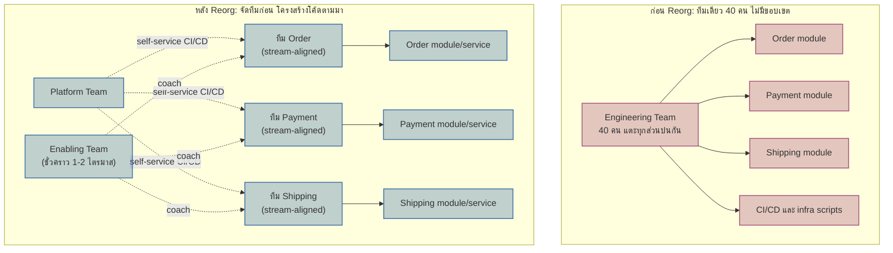

เด็กกลุ่มหนึ่งเริ่มเล่นฟุตบอลกันครั้งแรกตอนอายุ 6-7 ขวบ ภาพที่เห็นบ่อยที่สุดคือทุกคนวิ่งไล่ตามลูกบอลเป็นฝูงเดียว ไม่มีใครยืนเฝ้าตำแหน่งไหนเป็นพิเศษ แต่ก็ยังพอเล่นกันสนุกดี เพราะทีมมีกันแค่ 5-6 คน สนามก็เล็ก ใครเห็นบอลก็วิ่งเข้าไปแตะได้ทันโดยไม่ต้องมีใครสั่ง

ลองจินตนาการว่าทีมเดียวกันนี้โตขึ้นเป็น 40 คนต่อฝั่ง ลงสนามจริงขนาดมาตรฐาน แล้วยังเล่นด้วยวิธีเดิมคือ "เห็นบอลแล้ววิ่งเข้าไปทุกคน" ผลลัพธ์ไม่ใช่ทีมที่แข็งแกร่งขึ้นแปดเท่าตามจำนวนคน แต่คือความชุลมุน คนเหยียบเท้ากันเอง ไม่มีใครเฝ้าประตู ไม่มีใครคุมแนวรับ เพราะไม่เคยมีใครตัดสินใจว่า "ใครควรอยู่ตำแหน่งไหน" — ทีมแค่โตขึ้นเรื่อยๆ โดยไม่เคยเปลี่ยนวิธีเล่นตามขนาดที่เปลี่ยนไปเลย

ทีมฟุตบอลระดับอาชีพแก้ปัญหานี้ด้วยการกำหนดตำแหน่งให้ชัดตั้งแต่ต้น — ผู้รักษาประตู กองหลัง กองกลาง กองหน้า แต่ละตำแหน่งรู้ขอบเขตหน้าที่ตัวเองแน่นอน ไม่ต้องวิ่งไล่บอลทั่วสนามเหมือนเด็ก 7 ขวบอีกต่อไป นี่คือแนวคิดเดียวกับที่ <mark class="hl-term">**Team Topologies**</mark> เสนอไว้สำหรับทีมวิศวกรรมซอฟต์แวร์ที่โตเร็วเกินกว่าจะปล่อยให้ "ทุกคนแตะทุกโมดูล" ต่อไปได้อีก

## Requirement คร่าวๆ

- บริษัทโตจากวิศวกร 5 คนเป็น 40 คนภายใน 18 เดือน แต่ยังทำงานเป็น "ทีมเดียว" บน codebase เดียวกันเหมือนเดิม
- Feature delivery ช้าลงอย่างเห็นได้ชัด ทั้งที่ headcount เพิ่มขึ้นเกือบ 8 เท่า
- PR รอ review ค้างเป็นวันๆ เพราะผู้ review ไม่คุ้นเคยกับส่วนของโค้ดที่ถูกแก้
- แก้ Order module เล็กน้อยกลับไป break Payment หรือ Shipping แบบไม่มีใครคาดคิดอยู่บ่อยๆ
- ต้องออกแบบ**โครงสร้างทีมใหม่อย่างตั้งใจ** ให้โครงสร้างทีมนำหน้า แล้วปล่อยให้สถาปัตยกรรมของ codebase ค่อยๆ ตามมาเอง ไม่ใช่ปล่อยให้ทีมกระจัดกระจายไปเรื่อยๆ แล้วหวังว่าโค้ดจะแยกตัวเองได้

## วินิจฉัยอาการ: "40 คนในทีมเดียว" คือตัวปัญหา ไม่ใช่แค่คนเยอะ

จากโมดูล 20 (Team Topologies) — สิ่งที่บริษัทนี้มีอยู่ไม่ใช่ "หลายทีมที่ประสานงานกันไม่ดี" แต่คือ**ทีมเดียวขนาด 40 คนที่ไม่เคยถูกแบ่งเลย** เพียงแต่นั่งอยู่คนละแถวในออฟฟิศ ทุกคนยังมี mental model เดียวกันกับตอนที่มี 5 คน คือ "ใครจะแก้ตรงไหนก็ได้ที่จำเป็น" — พอ codebase โตตามจำนวนคน สมองของแต่ละคนต้องถือความซับซ้อนของทั้งระบบพร้อมกัน (<mark class="hl-term">**cognitive load**</mark> เกินขีดจำกัด) นี่คือสาเหตุตรงของทั้งสามอาการที่เห็น: reviewer ต้องแบก mental model ของทุก module พร้อมกันจึง review ช้า และการแก้ Order กระทบ Payment เพราะไม่มีใครเป็น "เจ้าของ" boundary ระหว่างสองส่วนนี้จริงๆ

## จัดทีมใหม่ตาม 4 ประเภทของ Team Topologies

โมดูล 20 (Team Topologies) แบ่งทีมออกเป็น 4 ประเภทเท่านั้น ในเคสนี้เอามาวางแผนได้ตรงตัว: **Stream-aligned team** สามทีมแยกตาม domain ที่ชนกันบ่อยที่สุด คือ ทีม Order, ทีม Payment, ทีม Shipping แต่ละทีมเป็นเจ้าของ codebase ส่วนของตัวเองแบบ end-to-end ตั้งแต่ design จนถึง on-call ส่วน **Platform team** ตั้งขึ้นใหม่เพื่อดูแล CI/CD, observability, และ deployment tooling กลางที่ทั้งสามทีมใช้ร่วมกัน และ **Enabling team** ชั่วคราวเข้ามาช่วยโค้ชทั้งสามทีมเรื่อง testing practice และการออกแบบ service boundary ในช่วง 1-2 ไตรมาสแรกที่ทุกคนยังไม่คุ้นกับการทำงานแบบแยกทีม แล้วถอยออกเมื่อภารกิจจบ (ระบบนี้ยังไม่มีความซับซ้อนเฉพาะทางระดับที่ต้องมี Complicated-Subsystem team แยกต่างหาก)



## Inverse Conway Maneuver: จัดทีมก่อน ปล่อยให้โค้ดแยกตามมาเอง

จุดที่เคสนี้ต่างจากเคสอื่นในโมดูลนี้ชัดที่สุดคือลำดับการตัดสินใจ — โมดูล 20 (Team Topologies) เรื่อง <mark class="hl-term">**Inverse Conway Maneuver**</mark> บอกว่าไม่ต้องรอให้ทีม refactor codebase ให้แยกเป็น module ที่ชัดเจนก่อนแล้วค่อยจัดทีมตามทีหลัง เพราะกว่าจะ refactor เสร็จทีมก็ยังชนกันไปเรื่อยๆ ระหว่างทาง <mark class="hl-insight">ให้กลับด้าน คือประกาศแบ่งทีม Order/Payment/Shipping ให้เป็นทางการก่อนวันแรกของไตรมาสหน้าเลย โดยยังไม่ต้องรอให้ codebase แยกเสร็จก่อน</mark> เมื่อคนที่นั่งทำงานด้วยกันทุกวันเปลี่ยนไป ขอบเขตการสื่อสารก็เปลี่ยนตาม แล้ว pull request ที่แต่ละทีมส่งจะเริ่มเกาะกลุ่มอยู่ในโฟลเดอร์ของตัวเองตามธรรมชาติ ไม่ต้องมีใครสั่งให้ "แยกโค้ด" อย่างเป็นทางการเลยด้วยซ้ำ

## เลือก Interaction Mode ให้ถูก: Platform ให้บริการแบบ X-as-a-Service

การตั้งทีมใหม่อย่างเดียวไม่พอ ถ้าไม่เลือก interaction mode ให้เหมาะ (โมดูล 20 - Team Topologies) ปัญหาเดิมจะย้ายที่แต่ไม่หายไป — ถ้า Platform team ต้องเข้าประชุม Collaboration กับทั้งสามทีม stream-aligned ทุกสัปดาห์เพื่อช่วย deploy หรือ debug pipeline <mark class="hl-warning">Platform team เองจะกลายเป็นคอขวดใหม่แทนที่ทีมเดียวเดิม เพียงแค่เปลี่ยนชื่อคอขวด</mark> ทางเลือกที่ถูกต้องคือให้ Platform team ลงทุนสร้าง self-service CLI/API ให้สามทีมเรียกใช้เองได้แบบ **X-as-a-Service** โดยแทบไม่ต้องคุยกันเลยในการทำงานประจำวัน ส่วน Enabling team ใช้โหมด **Facilitating** ที่มีจุดเริ่มและจุดจบชัดเจนกับแต่ละทีม ไม่ใช่ Collaboration ถาวรที่ต้องนั่งด้วยกันตลอดไป

```demo
component: StepThroughDiagram
props: {"steps":[{"label":"1. วินิจฉัย","detail":"ทีมเดียว 40 คนไม่เคยถูกแบ่ง ทุกคนแบก cognitive load ของทั้งระบบพร้อมกัน จึง review ช้าและแก้ Order แล้วกระทบ Payment/Shipping"},{"label":"2. จัดตาม 4 ประเภททีม","detail":"แยก stream-aligned team ตาม Order/Payment/Shipping ตั้ง Platform team ดูแล CI/CD กลาง และ Enabling team ชั่วคราวช่วยโค้ช 1-2 ไตรมาสแรก"},{"label":"3. Inverse Conway Maneuver","detail":"ประกาศแบ่งทีมก่อนที่ codebase จะถูกแยกเสร็จ ให้ขอบเขตการสื่อสารใหม่ค่อยๆ ดึงโค้ดให้แยกตามมาเอง ไม่ใช่รอ refactor เสร็จก่อนค่อยจัดทีม"},{"label":"4. เลือก Interaction Mode","detail":"Platform team ให้บริการแบบ X-as-a-Service ผ่าน self-service tooling ไม่ใช่ Collaboration ทุกสัปดาห์ ส่วน Enabling team ใช้ Facilitating ที่มีจุดจบชัดเจน"}]}
```

## จุดที่โมดูล 13 เข้ามาเกี่ยวข้อง: Monolith ที่ในที่สุดก็ต้องแตกตามทีม

โมดูล 13 (Architectural Styles & Patterns) พูดถึง Conway's Law ไว้ว่าโครงสร้างระบบมักสะท้อนโครงสร้างการสื่อสารขององค์กร — เคสนี้คือตัวอย่างที่ลำดับกลับกับเคส e-commerce checkout ที่เคยเห็น ที่นั่นทีมเลือกแยก Payment ออกจาก monolith ก่อนด้วยเหตุผลทางเทคนิค แล้วค่อยแยกทีมตามทีหลัง ส่วนที่นี่การ reorg ทีมต่างหากที่มาก่อน และมันคือแรงผลักที่ทำให้ codebase ก้อนเดียวที่ Order/Payment/Shipping เคยพันกันมานาน ในที่สุดถูกบังคับให้แยก module ตามขอบเขตทีมใหม่ ไม่ใช่เพราะมีใครวางแผนแยก service ไว้ล่วงหน้า แต่เพราะสามทีมที่แยกกันทำงานจริงจะเริ่มเบื่อที่ต้องรอ merge conflict กับอีกสองทีมในไฟล์เดียวกัน แล้วค่อยๆ ผลักดันให้แยก deployment ของตัวเองออกมาเอง

## ตารางเปรียบเทียบ: ก่อน vs หลัง Reorg

| ประเด็น | ก่อน Reorg (ทีมเดียว 40 คน) | หลัง Reorg (Stream-aligned + Platform + Enabling) |
|---|---|---|
| เวลารอ PR review | หลายวัน เพราะ reviewer ไม่คุ้นส่วนที่แก้ | เร็วขึ้นมาก เพราะแต่ละทีม review เฉพาะโค้ดของตัวเอง |
| Blast radius เมื่อแก้ Order | กระทบ Payment/Shipping แบบไม่คาดคิดบ่อยครั้ง | จำกัดอยู่ในทีม Order เว้นแต่แตะ contract ระหว่างทีม |
| Cognitive load ต่อวิศวกร | สูงมาก ต้องถือ mental model ทั้งระบบ | ลดลง เพราะดูแลแค่ domain ของทีมตัวเอง |
| ความเป็นอิสระในการ deploy | ต้องรอคิว deploy รวมกับทีมอื่น | แต่ละ stream-aligned team deploy เองได้ |
| การขอความช่วยเหลือเรื่อง infra | ไม่มีเจ้าของชัดเจน ต่างคนต่างแก้เอง | เรียก Platform team แบบ self-service (X-as-a-Service) |

## ADR ตัวอย่าง

> **Title:** จัดโครงสร้างทีมวิศวกรรมใหม่ตาม Team Topologies ก่อนแยก Codebase ออกเป็น Service
> **Status:** Accepted
> **Context:** บริษัทโตจากวิศวกร 5 คนเป็น 40 คนใน 18 เดือน แต่ยังทำงานเป็นทีมเดียวบน codebase เดียวกัน ทำให้ feature delivery ช้าลงทั้งที่ headcount เพิ่มขึ้นมาก PR รอ review หลายวันเพราะผู้ review ไม่คุ้นกับส่วนที่แก้ และการแก้ Order module มักกระทบ Payment/Shipping โดยไม่มีใครคาดคิด
> **Decision:** แบ่งทีมออกเป็น 3 stream-aligned team ตาม Order/Payment/Shipping ตั้ง Platform team ใหม่ดูแล CI/CD และ tooling กลางแบบ self-service และนำ Enabling team ชั่วคราวเข้ามาโค้ช 1-2 ไตรมาสแรก โดยประกาศแบ่งทีมก่อนที่จะเริ่มแยก codebase จริง ตาม Inverse Conway Maneuver
> **Consequences:** คาดว่า PR review เร็วขึ้นและ blast radius ของการเปลี่ยนแปลงแคบลงภายในสองไตรมาส แต่ต้องยอมรับต้นทุนการ reorganize ทีมช่วงแรก ทั้งความรู้ domain ที่กระจัดกระจายชั่วคราวและการที่ทั้งสามทีมต้องเข้าโหมด Collaboration หนักขึ้นชั่วคราวเพื่อตกลง contract ระหว่างกันก่อนเปลี่ยนไปใช้ X-as-a-Service เต็มรูปแบบ
