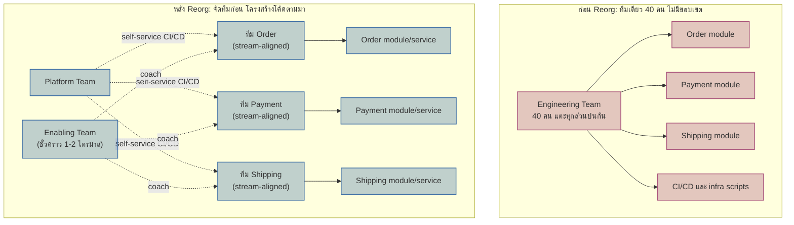
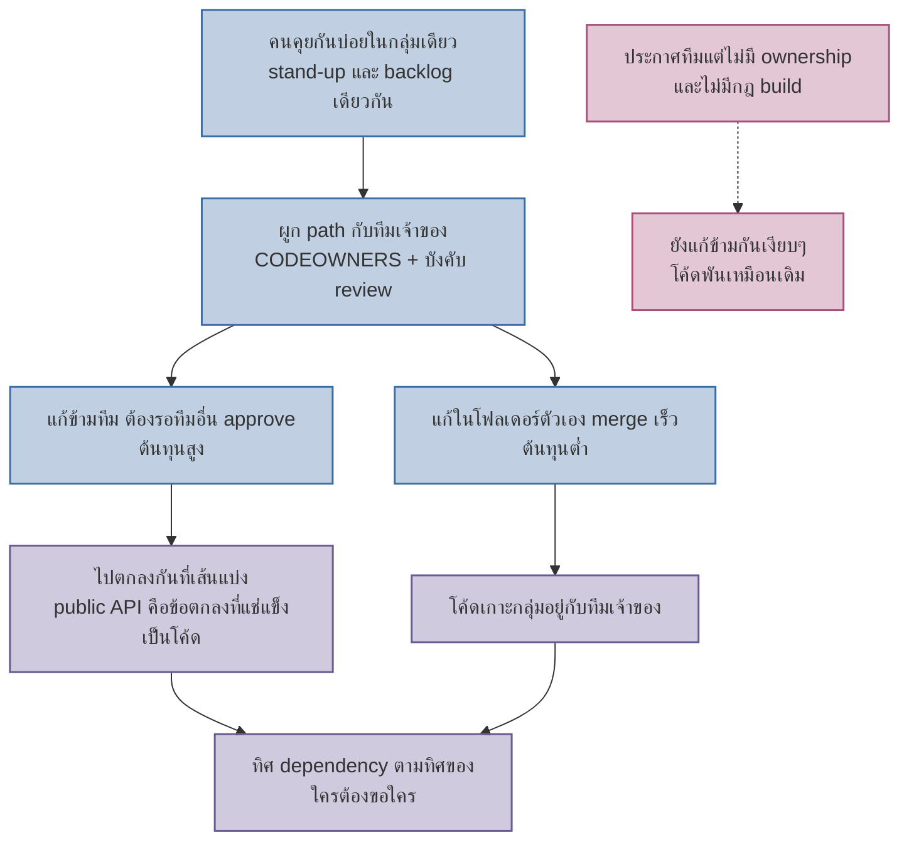
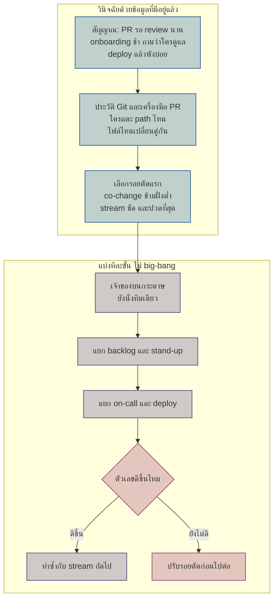
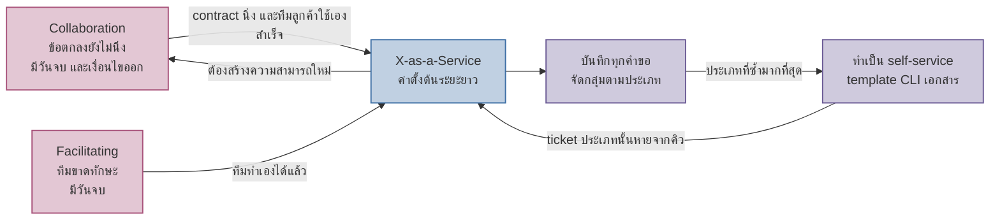
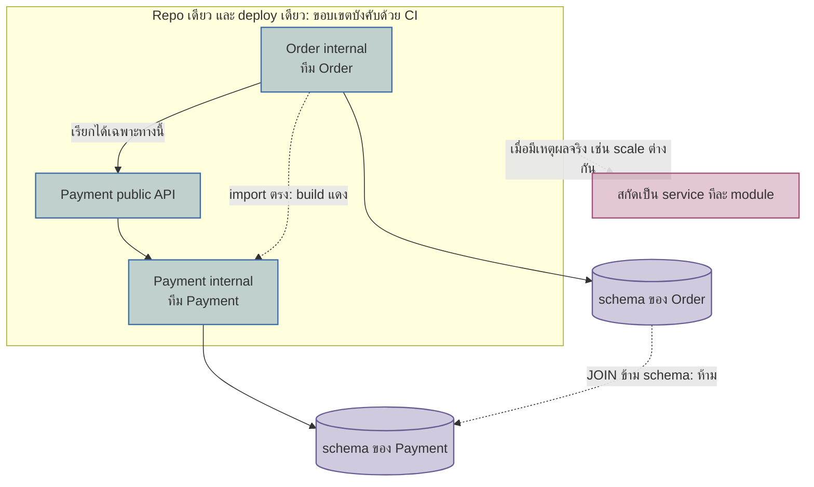
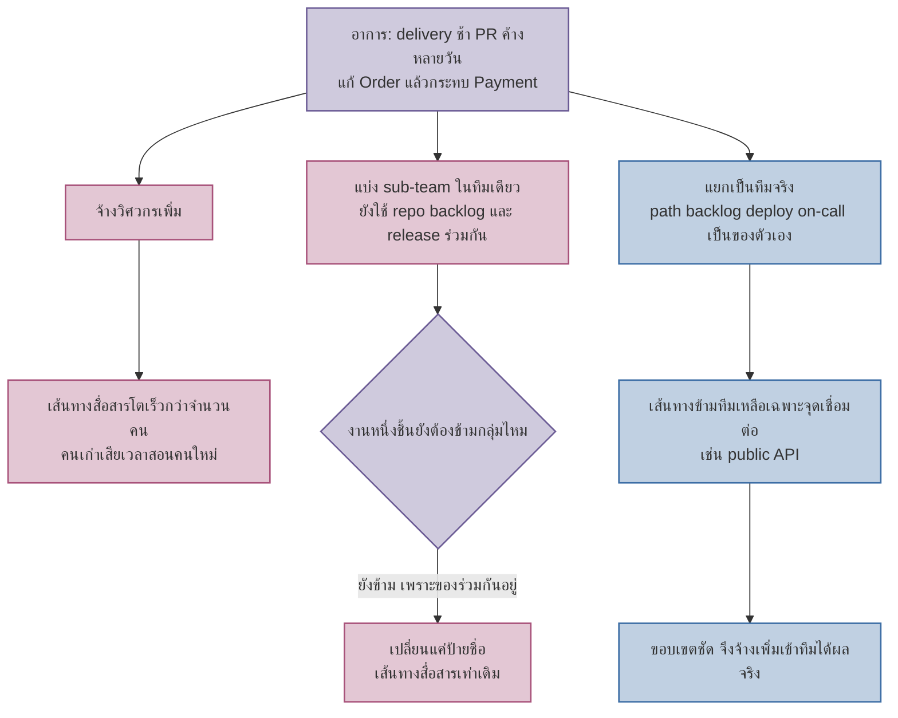
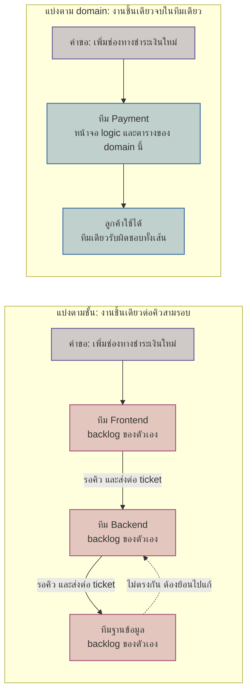
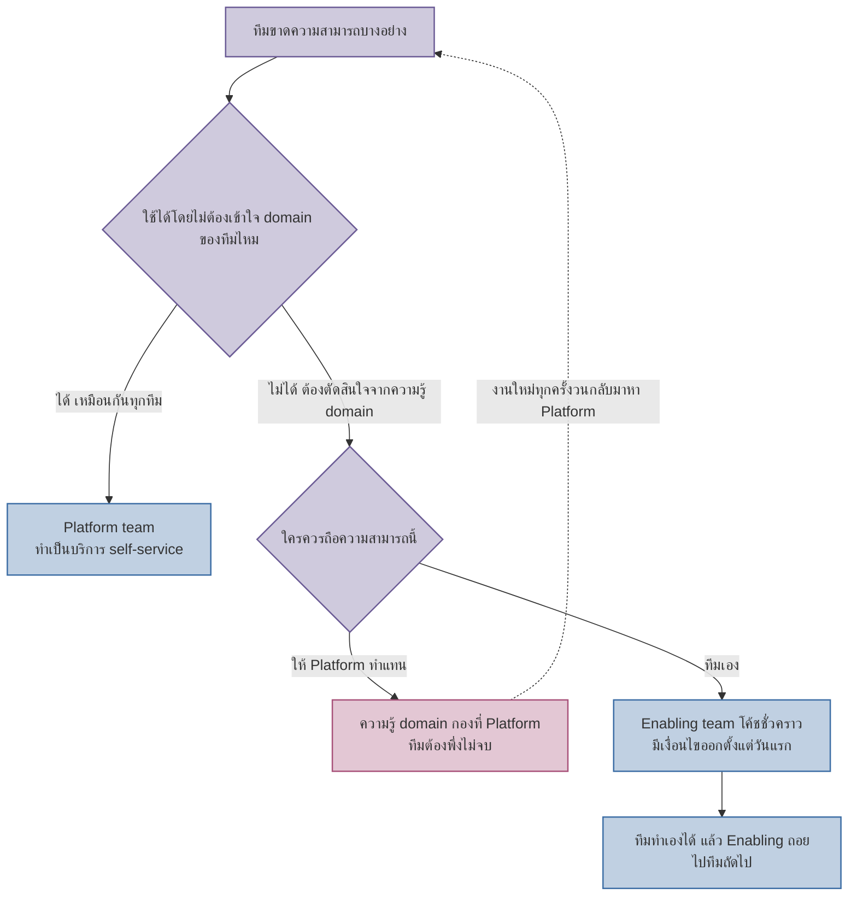

เด็กกลุ่มหนึ่งเริ่มเล่นฟุตบอลกันครั้งแรกตอนอายุ 6-7 ขวบ ภาพที่เห็นบ่อยที่สุดคือทุกคนวิ่งไล่ตามลูกบอลเป็นฝูงเดียว ไม่มีใครยืนเฝ้าตำแหน่งไหนเป็นพิเศษ แต่ก็ยังพอเล่นกันสนุกดี เพราะทีมมีกันแค่ 5-6 คน สนามก็เล็ก ใครเห็นบอลก็วิ่งเข้าไปแตะได้ทันโดยไม่ต้องมีใครสั่ง

ลองจินตนาการว่าทีมเดียวกันนี้โตขึ้นเป็น 40 คนต่อฝั่ง ลงสนามจริงขนาดมาตรฐาน แล้วยังเล่นด้วยวิธีเดิมคือ "เห็นบอลแล้ววิ่งเข้าไปทุกคน" ผลลัพธ์ไม่ใช่ทีมที่แข็งแกร่งขึ้นแปดเท่าตามจำนวนคน แต่คือความชุลมุน คนเหยียบเท้ากันเอง ไม่มีใครเฝ้าประตู ไม่มีใครคุมแนวรับ เพราะไม่เคยมีใครตัดสินใจว่า "ใครควรอยู่ตำแหน่งไหน" — ทีมแค่โตขึ้นเรื่อยๆ โดยไม่เคยเปลี่ยนวิธีเล่นตามขนาดที่เปลี่ยนไปเลย

ทีมฟุตบอลระดับอาชีพแก้ปัญหานี้ด้วยการกำหนดตำแหน่งให้ชัดตั้งแต่ต้น — ผู้รักษาประตู กองหลัง กองกลาง กองหน้า แต่ละตำแหน่งรู้ขอบเขตหน้าที่ตัวเองแน่นอน ไม่ต้องวิ่งไล่บอลทั่วสนามเหมือนเด็ก 7 ขวบอีกต่อไป นี่คือแนวคิดเดียวกับที่ <mark class="hl-term">**Team Topologies**</mark> เสนอไว้สำหรับทีมวิศวกรรมซอฟต์แวร์ที่โตเร็วเกินกว่าจะปล่อยให้ "ทุกคนแตะทุกโมดูล" ต่อไปได้อีก

## Requirement คร่าวๆ

- บริษัทโตจากวิศวกร 5 คนเป็น 40 คนภายใน 18 เดือน แต่ยังทำงานเป็น "ทีมเดียว" บน codebase เดียวกันเหมือนเดิม
- Feature delivery ช้าลงอย่างเห็นได้ชัด ทั้งที่ headcount เพิ่มขึ้นเกือบ 8 เท่า
- PR รอ review ค้างเป็นวันๆ เพราะผู้ review ไม่คุ้นเคยกับส่วนของโค้ดที่ถูกแก้
- แก้ Order module เล็กน้อยกลับไป break Payment หรือ Shipping แบบไม่มีใครคาดคิดอยู่บ่อยๆ
- ต้องออกแบบ**โครงสร้างทีมใหม่อย่างตั้งใจ** ให้โครงสร้างทีมนำหน้า แล้วปล่อยให้สถาปัตยกรรมของ codebase ค่อยๆ ตามมาเอง ไม่ใช่ปล่อยให้ทีมกระจัดกระจายไปเรื่อยๆ แล้วหวังว่าโค้ดจะแยกตัวเองได้

## วินิจฉัยอาการ: "40 คนในทีมเดียว" คือตัวปัญหา ไม่ใช่แค่คนเยอะ

จากโมดูล 20 (Team Topologies) — สิ่งที่บริษัทนี้มีอยู่ไม่ใช่ "หลายทีมที่ประสานงานกันไม่ดี" แต่คือ**ทีมเดียวขนาด 40 คนที่ไม่เคยถูกแบ่งเลย** เพียงแต่นั่งอยู่คนละแถวในออฟฟิศ ทุกคนยังมี mental model เดียวกันกับตอนที่มี 5 คน คือ "ใครจะแก้ตรงไหนก็ได้ที่จำเป็น" — พอ codebase โตตามจำนวนคน สมองของแต่ละคนต้องถือความซับซ้อนของทั้งระบบพร้อมกัน (<mark class="hl-term">**cognitive load**</mark> เกินขีดจำกัด) นี่คือสาเหตุตรงของทั้งสามอาการที่เห็น: reviewer ต้องแบก mental model ของทุก module พร้อมกันจึง review ช้า และการแก้ Order กระทบ Payment เพราะไม่มีใครเป็น "เจ้าของ" boundary ระหว่างสองส่วนนี้จริงๆ

## จัดทีมใหม่ตาม 4 ประเภทของ Team Topologies

โมดูล 20 (Team Topologies) แบ่งทีมออกเป็น 4 ประเภทเท่านั้น ในเคสนี้เอามาวางแผนได้ตรงตัว: **Stream-aligned team** สามทีมแยกตาม domain ที่ชนกันบ่อยที่สุด คือ ทีม Order, ทีม Payment, ทีม Shipping แต่ละทีมเป็นเจ้าของ codebase ส่วนของตัวเองแบบ end-to-end ตั้งแต่ design จนถึง on-call ส่วน **Platform team** ตั้งขึ้นใหม่เพื่อดูแล CI/CD, observability, และ deployment tooling กลางที่ทั้งสามทีมใช้ร่วมกัน และ **Enabling team** ชั่วคราวเข้ามาช่วยโค้ชทั้งสามทีมเรื่อง testing practice และการออกแบบ service boundary ในช่วง 1-2 ไตรมาสแรกที่ทุกคนยังไม่คุ้นกับการทำงานแบบแยกทีม แล้วถอยออกเมื่อภารกิจจบ (ระบบนี้ยังไม่มีความซับซ้อนเฉพาะทางระดับที่ต้องมี Complicated-Subsystem team แยกต่างหาก)


```mermaid
flowchart TB
    subgraph Before["ก่อน Reorg: ทีมเดียว 40 คน ไม่มีขอบเขต"]
        Eng["Engineering Team<br/>40 คน แตะทุกส่วนปนกัน"] --> OrderCode["Order module"]
        Eng --> PaymentCode["Payment module"]
        Eng --> ShippingCode["Shipping module"]
        Eng --> InfraCode["CI/CD และ infra scripts"]
    end
    subgraph After["หลัง Reorg: จัดทีมก่อน โครงสร้างโค้ดตามมา"]
        OrderTeam["ทีม Order<br/>(stream-aligned)"] --> OrderSvc["Order module/service"]
        PaymentTeam["ทีม Payment<br/>(stream-aligned)"] --> PaymentSvc["Payment module/service"]
        ShippingTeam["ทีม Shipping<br/>(stream-aligned)"] --> ShippingSvc["Shipping module/service"]
        PlatformTeam["Platform Team"] -.self-service CI/CD.-> OrderTeam
        PlatformTeam -.self-service CI/CD.-> PaymentTeam
        PlatformTeam -.self-service CI/CD.-> ShippingTeam
        EnablingTeam["Enabling Team<br/>(ชั่วคราว 1-2 ไตรมาส)"] -.coach.-> OrderTeam
        EnablingTeam -.coach.-> PaymentTeam
        EnablingTeam -.coach.-> ShippingTeam
    end
    classDef before fill:#a8527a52,stroke:#a8527a,stroke-width:1.5px
    classDef after fill:#3d6ea552,stroke:#3d6ea5,stroke-width:1.5px
    class Eng,OrderCode,PaymentCode,ShippingCode,InfraCode before
    class OrderTeam,PaymentTeam,ShippingTeam,PlatformTeam,EnablingTeam,OrderSvc,PaymentSvc,ShippingSvc after
```

## Inverse Conway Maneuver: จัดทีมก่อน ปล่อยให้โค้ดแยกตามมาเอง

จุดที่เคสนี้ต่างจากเคสอื่นในโมดูลนี้ชัดที่สุดคือลำดับการตัดสินใจ — โมดูล 20 (Team Topologies) เรื่อง <mark class="hl-term">**Inverse Conway Maneuver**</mark> บอกว่าไม่ต้องรอให้ทีม refactor codebase ให้แยกเป็น module ที่ชัดเจนก่อนแล้วค่อยจัดทีมตามทีหลัง เพราะกว่าจะ refactor เสร็จทีมก็ยังชนกันไปเรื่อยๆ ระหว่างทาง <mark class="hl-insight">ให้กลับด้าน คือประกาศแบ่งทีม Order/Payment/Shipping ให้เป็นทางการก่อนวันแรกของไตรมาสหน้าเลย โดยยังไม่ต้องรอให้ codebase แยกเสร็จก่อน</mark> เมื่อคนที่นั่งทำงานด้วยกันทุกวันเปลี่ยนไป ขอบเขตการสื่อสารก็เปลี่ยนตาม แล้ว pull request ที่แต่ละทีมส่งจะเริ่มเกาะกลุ่มอยู่ในโฟลเดอร์ของตัวเองตามธรรมชาติ ไม่ต้องมีใครสั่งให้ "แยกโค้ด" อย่างเป็นทางการเลยด้วยซ้ำ

## เลือก Interaction Mode ให้ถูก: Platform ให้บริการแบบ X-as-a-Service

การตั้งทีมใหม่อย่างเดียวไม่พอ ถ้าไม่เลือก interaction mode ให้เหมาะ (โมดูล 20 - Team Topologies) ปัญหาเดิมจะย้ายที่แต่ไม่หายไป — ถ้า Platform team ต้องเข้าประชุม Collaboration กับทั้งสามทีม stream-aligned ทุกสัปดาห์เพื่อช่วย deploy หรือ debug pipeline <mark class="hl-warning">Platform team เองจะกลายเป็นคอขวดใหม่แทนที่ทีมเดียวเดิม เพียงแค่เปลี่ยนชื่อคอขวด</mark> ทางเลือกที่ถูกต้องคือให้ Platform team ลงทุนสร้าง self-service CLI/API ให้สามทีมเรียกใช้เองได้แบบ **X-as-a-Service** โดยแทบไม่ต้องคุยกันเลยในการทำงานประจำวัน ส่วน Enabling team ใช้โหมด **Facilitating** ที่มีจุดเริ่มและจุดจบชัดเจนกับแต่ละทีม ไม่ใช่ Collaboration ถาวรที่ต้องนั่งด้วยกันตลอดไป

```demo
component: StepThroughDiagram
props: {"steps":[{"label":"1. วินิจฉัย","detail":"ทีมเดียว 40 คนไม่เคยถูกแบ่ง ทุกคนแบก cognitive load ของทั้งระบบพร้อมกัน จึง review ช้าและแก้ Order แล้วกระทบ Payment/Shipping"},{"label":"2. จัดตาม 4 ประเภททีม","detail":"แยก stream-aligned team ตาม Order/Payment/Shipping ตั้ง Platform team ดูแล CI/CD กลาง และ Enabling team ชั่วคราวช่วยโค้ช 1-2 ไตรมาสแรก"},{"label":"3. Inverse Conway Maneuver","detail":"ประกาศแบ่งทีมก่อนที่ codebase จะถูกแยกเสร็จ ให้ขอบเขตการสื่อสารใหม่ค่อยๆ ดึงโค้ดให้แยกตามมาเอง ไม่ใช่รอ refactor เสร็จก่อนค่อยจัดทีม"},{"label":"4. เลือก Interaction Mode","detail":"Platform team ให้บริการแบบ X-as-a-Service ผ่าน self-service tooling ไม่ใช่ Collaboration ทุกสัปดาห์ ส่วน Enabling team ใช้ Facilitating ที่มีจุดจบชัดเจน"}]}
```

## จุดที่โมดูล 13 เข้ามาเกี่ยวข้อง: Monolith ที่ในที่สุดก็ต้องแตกตามทีม

โมดูล 13 (Architectural Styles & Patterns) พูดถึง Conway's Law ไว้ว่าโครงสร้างระบบมักสะท้อนโครงสร้างการสื่อสารขององค์กร — เคสนี้คือตัวอย่างที่ลำดับกลับกับเคส e-commerce checkout ที่เคยเห็น ที่นั่นทีมเลือกแยก Payment ออกจาก monolith ก่อนด้วยเหตุผลทางเทคนิค แล้วค่อยแยกทีมตามทีหลัง ส่วนที่นี่การ reorg ทีมต่างหากที่มาก่อน และมันคือแรงผลักที่ทำให้ codebase ก้อนเดียวที่ Order/Payment/Shipping เคยพันกันมานาน ในที่สุดถูกบังคับให้แยก module ตามขอบเขตทีมใหม่ ไม่ใช่เพราะมีใครวางแผนแยก service ไว้ล่วงหน้า แต่เพราะสามทีมที่แยกกันทำงานจริงจะเริ่มเบื่อที่ต้องรอ merge conflict กับอีกสองทีมในไฟล์เดียวกัน แล้วค่อยๆ ผลักดันให้แยก deployment ของตัวเองออกมาเอง

## ตารางเปรียบเทียบ: ก่อน vs หลัง Reorg

| ประเด็น | ก่อน Reorg (ทีมเดียว 40 คน) | หลัง Reorg (Stream-aligned + Platform + Enabling) |
|---|---|---|
| เวลารอ PR review | หลายวัน เพราะ reviewer ไม่คุ้นส่วนที่แก้ | เร็วขึ้นมาก เพราะแต่ละทีม review เฉพาะโค้ดของตัวเอง |
| Blast radius เมื่อแก้ Order | กระทบ Payment/Shipping แบบไม่คาดคิดบ่อยครั้ง | จำกัดอยู่ในทีม Order เว้นแต่แตะ contract ระหว่างทีม |
| Cognitive load ต่อวิศวกร | สูงมาก ต้องถือ mental model ทั้งระบบ | ลดลง เพราะดูแลแค่ domain ของทีมตัวเอง |
| ความเป็นอิสระในการ deploy | ต้องรอคิว deploy รวมกับทีมอื่น | แต่ละ stream-aligned team deploy เองได้ |
| การขอความช่วยเหลือเรื่อง infra | ไม่มีเจ้าของชัดเจน ต่างคนต่างแก้เอง | เรียก Platform team แบบ self-service (X-as-a-Service) |

## คำถามเจาะลึกที่มักถูกถามต่อ

เรื่ององค์กรมักฟังเหมือนเวทมนตร์ง่ายที่สุด เช่น "แบ่งทีมแล้วโค้ดก็แยกตามเอง" พออ่านเคสนี้จบ คนสัมภาษณ์หรือเพื่อนร่วมทีมจึงมักไม่หยุดที่ "จัดทีมแบบไหน" แต่จะถามต่อว่า "แล้วข้างในมันเกิดขึ้นได้ยังไง ถ้าไม่เกิดจะเป็นเพราะอะไร" สี่คำถามแรก (Q1–Q4) จึงเจาะที่กลไก คือเส้นทางการสื่อสาร ขอบเขตความเป็นเจ้าของ และวงจรป้อนกลับ ว่าสิ่งเหล่านี้กลายเป็นโครงสร้างโค้ดจริงๆ ได้ยังไง แต่ละข้อไล่ให้ครบว่า ใช้ความรู้อะไรจากโมดูลไหน แก้ปัญหายังไง มีขั้นตอนอะไรบ้าง และข้างใต้จริงๆ มีอะไรทำงานอยู่ (เคสนี้เป็นเรื่องคน คำตอบจึงเป็นกลไกและวิธีวัด ไม่ใช่ตัวเลขสถิติ) ส่วนอีกแนวที่ senior ชอบถามที่สุดคือ "ทำไมเลือกแบบนี้ ทำไมไม่เลือกอีกแบบ" สามคำถามหลัง (Q5–Q7) จึงไล่ให้เห็นทางเลือกที่ไม่ได้เลือก เหตุผลข้างใต้ ราคาที่ต้องจ่าย และเงื่อนไขที่ทำให้คำตอบเปลี่ยน

### Q1: ประกาศแบ่งทีมแล้ว ทำไมโค้ดถึง "แยกตามเอง" ขอบเขตการสื่อสารของคนกลายเป็นขอบเขต module และทิศทาง dependency ในโค้ดได้ยังไง

**ใช้ความรู้อะไร:** โมดูล 20 (Inverse Conway Maneuver และหลัก 1 stream-aligned team ต่อ 1 bounded context) บวกโมดูล 13 (Conway's Law) บวกโมดูล 15 (Context Mapping แบบ Customer-Supplier ที่บอกว่าทีมไหนเป็น upstream ทีมไหนเป็น downstream)

**นึกภาพก่อน:** ลองนึกถึงหอพักที่ทุกห้องใช้ครัวรวมกันหลังเดียว ใครจะหยิบหม้อหรือเครื่องปรุงของใครก็ได้ ผลคือไม่มีใครรู้ว่าของอยู่ตรงไหนและใครทำหาย พอแบ่งเป็นครัวประจำชั้นพร้อมช่องส่งของที่หน้าห้อง ทุกคนก็เริ่มเก็บของไว้ในครัวชั้นตัวเอง ถ้าอยากได้ของชั้นอื่นก็ไปขอที่ช่องส่งของ ไม่มีใครสั่งให้ทำแบบนั้นเลย แต่ "ต้นทุนของการเดินไปล้วงครัวชั้นอื่น" สูงขึ้นจนทุกคนเลือกทางที่ถูกกว่าเอง

**ปัญหาคืออะไร:** ในเคสเขียนว่า pull request จะ "เกาะกลุ่มอยู่ในโฟลเดอร์ของตัวเองตามธรรมชาติ" ฟังเหมือนเวทมนตร์ แต่การประกาศชื่อทีมไม่ได้แก้ไฟล์แม้แต่ไฟล์เดียว ถ้าไม่มีอะไรเปลี่ยน "ต้นทุนของการแก้ข้ามเส้น" คนก็ยังแก้ข้ามกันเหมือนเดิม คำถามคือมีกลไกอะไรบ้างที่ทำให้ประโยคนั้นเป็นจริง

**แก้ปัญหายังไง:** เปลี่ยนโครงสร้างคนให้กลายเป็นโครงสร้างโค้ดผ่านสามกลไกที่ทำงานต่อกัน

1. **ผูกทุก path กับทีมเจ้าของ** ด้วยไฟล์แบบ `CODEOWNERS` (ไฟล์ที่ระบุว่าโฟลเดอร์ไหนเป็นของทีมไหน มีใน GitHub และ GitLab) แล้วตั้งให้ pull request ที่แตะ path นั้นต้องได้รับ approve จากทีมเจ้าของก่อนถึงจะ merge ได้
2. **ปล่อยให้ต้นทุนข้ามเส้นทำงาน** แก้ไฟล์ในโฟลเดอร์ตัวเองใช้ review จากเพื่อนร่วมทีมที่คุยกันทุกวัน ส่วนแก้ไฟล์ของอีกทีมต้องรอคนที่มี backlog (รายการงานรอทำ) และลำดับความสำคัญของตัวเอง คนจึงเลือกแก้ในที่ของตัวเอง หรือไม่ก็ตกลงเป็นข้อตกลงแล้วให้เจ้าของเปิดทางให้
3. **ทิศของ "ใครต้องขอใคร" กลายเป็นทิศของ dependency** เช่น Shipping ต้องรู้ว่า order ไหนจ่ายเงินแล้วจึงจัดส่งได้ Shipping จึงเป็นฝั่ง downstream ที่ต้องขอ ส่วน Payment เป็นฝั่ง upstream ที่ต้องรักษาทางเข้าให้นิ่ง (public API คือทางเข้าที่ module เปิดให้เรียกอย่างเป็นทางการ) ลูกศร import ในโค้ดจึงเรียงตามลูกศรของคำขอ

<mark class="hl-insight">ในทางปฏิบัติ Conway's Law ทำงานแบบนี้ สิ่งที่คนคุยกันบ่อยจะถูกแก้ด้วยกัน และสิ่งที่ถูกแก้ด้วยกันบ่อยจะไปอยู่ใกล้กันในโค้ด</mark> การจัดทีมจึงเป็นการเลือกว่าใครจะคุยกับใครบ่อย ไม่ใช่การสั่งให้โค้ดแยก


```mermaid
flowchart TB
    A["คนคุยกันบ่อยในกลุ่มเดียว<br/>stand-up และ backlog เดียวกัน"] --> B["ผูก path กับทีมเจ้าของ<br/>CODEOWNERS + บังคับ review"]
    B --> C["แก้ข้ามทีม ต้องรอทีมอื่น approve<br/>ต้นทุนสูง"]
    B --> D["แก้ในโฟลเดอร์ตัวเอง merge เร็ว<br/>ต้นทุนต่ำ"]
    C --> E["ไปตกลงกันที่เส้นแบ่ง<br/>public API คือข้อตกลงที่แช่แข็งเป็นโค้ด"]
    D --> F["โค้ดเกาะกลุ่มอยู่กับทีมเจ้าของ"]
    E --> G["ทิศ dependency ตามทิศของ<br/>ใครต้องขอใคร"]
    F --> G
    X["ประกาศทีมแต่ไม่มี ownership<br/>และไม่มีกฎ build"] -.-> Y["ยังแก้ข้ามกันเงียบๆ<br/>โค้ดพันเหมือนเดิม"]

    classDef mechanism fill:#3d6ea552,stroke:#3d6ea5,stroke-width:1.5px
    classDef result fill:#6b5b9552,stroke:#6b5b95,stroke-width:1.5px
    classDef fail fill:#a8527a52,stroke:#a8527a,stroke-width:1.5px
    class A,B,C,D mechanism
    class E,F,G result
    class X,Y fail
```

```demo
component: JourneyDiagram
props: {"nodes":[{"icon":"person","label":"วิศวกรทีม Order"},{"icon":"notebook","label":"ไฟล์ ownership (path ผูกกับทีม)"},{"icon":"person","label":"ทีม Payment (เจ้าของ path)"},{"icon":"building","label":"Payment module (public API)"}],"travelerIcon":"envelope","steps":[{"activeNode":0,"caption":"วิศวกรทีม Order ต้องการข้อมูลบางอย่างจากฝั่ง Payment จึงเปิด pull request ที่แก้ไฟล์ในโฟลเดอร์ payment ตรงๆ"},{"activeNode":1,"caption":"ระบบเทียบรายชื่อไฟล์ที่ถูกแก้กับไฟล์ ownership พบว่า path นี้เป็นของทีม Payment จึงขอ review จากทีมนั้นและ merge ไม่ได้จนกว่าจะ approve"},{"activeNode":2,"caption":"ทีม Payment ตอบกลับว่าอย่าแก้ข้างในเอง เดี๋ยวเปิด field หรือ endpoint ให้ ต้นทุนของการข้ามเส้นสูงกว่าการคุยกันที่เส้นแบ่ง"},{"activeNode":3,"caption":"สองทีมตกลงกันเป็น contract ที่ public API ของ Payment ข้อตกลงระหว่างคนถูกแช่แข็งเป็นโค้ดที่เห็นได้ชัด"},{"activeNode":0,"caption":"ทีม Order เรียกผ่าน public API แทนการแก้ข้างใน ลูกศร dependency ชี้จาก Order ไปหา Payment ผ่านทางเข้าเดียว ตามทิศของคำขอ"}]}
```

**ข้างใต้ทำงานยังไง:** ถ้ามองทีละขั้นของ pull request จะเห็นกลไกชัด เมื่อมี PR เข้ามา ระบบของ Git hosting จะเทียบรายชื่อไฟล์ที่ถูกแก้กับไฟล์ ownership แล้วขอ review จากเจ้าของ path ที่ตรงกัน ถ้าเปิดกฎ branch protection (การตั้งค่าที่ห้าม merge จนกว่าจะผ่านเงื่อนไข) ไว้ PR จะ merge ไม่ได้จนกว่าเจ้าของทุก path ที่ถูกแตะจะ approve ผลที่สะสมคือ PR ที่แตะสอง path ต้องรอสองทีม ส่วน PR ที่อยู่ใน path เดียวจบเร็วกว่ามาก ความต่างของความเร็วนี้เองคือแรงดันที่ค่อยๆ ดันงานเข้าหาโฟลเดอร์ของตัวเอง

ส่วน interface ในโค้ด (ฟังก์ชัน endpoint หรือ event ที่เปิดให้เรียก) ก็คือ "ข้อตกลงระหว่างคน" ที่ถูกเขียนลงเป็นโค้ด ทุกครั้งที่สองทีมต้องตกลงกัน ผลของการตกลงต้องไปอยู่ที่ไหนสักที่ และที่ที่ถูกที่สุดคือเส้นแบ่งที่ทั้งสองฝ่ายมองเห็นร่วมกัน ยิ่ง upstream ถูกขอบ่อย ก็ยิ่งเปลี่ยนทางเข้ายาก เพราะเปลี่ยนทีหนึ่งกระทบหลายทีม ทางเข้านั้นจึงนิ่งขึ้นเอง

**ถ้าพังหรือมีข้อควรระวังอะไร:**

- <mark class="hl-warning">ประกาศทีมแต่ไม่มี ownership map และไม่มีกฎ build โค้ดจะพันเหมือนเดิม</mark> เกิดสภาพ "ทีมใหม่ในโค้ดเก่า" คนยังแก้ข้ามกันเงียบๆ เพราะไม่มีอะไรมาขวาง และ pull request ก็ไม่เกาะกลุ่มตามที่หวัง
- โฟลเดอร์กลางอย่าง `common` หรือ `shared` ที่ไม่มีเจ้าของจะกลายเป็นที่ทิ้งของ ทุกทีมพึ่งมัน แล้วกลายเป็นก้อนโคลนก้อนใหม่ ต้องมีเจ้าของชัดเจนและเก็บให้เล็ก
- ถ้าแบ่งทีมผิดแกน เช่น แบ่งตามชั้น (หน้าเว็บ หลังบ้าน ฐานข้อมูล) แทนที่จะแบ่งตาม domain ฟีเจอร์เดียวจะต้องข้ามทุกทีม ต้นทุนการประสานงานกลับมาทันที จึงต้องยึดหลัก 1 stream-aligned team ต่อ 1 bounded context ตามโมดูล 20
- ผลไม่เกิดทันทีในวันประกาศ โค้ดเก่าที่พันกันอยู่แล้วต้องถูกแก้ทีละจุด ขอบเขตค่อยๆ ชัดขึ้นตามเวลา ไม่ใช่สวิตช์ที่กดครั้งเดียวแล้วจบ

### Q2: ทีมเดียว 40 คน รู้ได้ยังไงว่า cognitive load เกินจริง และแบ่งทีมทีละขั้นยังไงโดยไม่ต้อง big-bang

**ใช้ความรู้อะไร:** โมดูล 20 (Cognitive Load และหลัก 1 stream-aligned team ต่อ 1 bounded context) บวกโมดูล 16 (Modifiability คือระบบที่แก้แล้วกระทบวงแคบ ซึ่งวัดได้จากพฤติกรรมของการเปลี่ยนแปลงจริง) บวกแนวคิด Fitness Function จากโมดูล 21 (แปลงความรู้สึกให้เป็นตัวเลขที่ตรวจซ้ำได้)

**นึกภาพก่อน:** หมอไม่วินิจฉัยจากคำว่า "รู้สึกไม่สบาย" แต่วัดไข้ วัดความดัน แล้วดูแนวโน้ม cognitive load ของคนวัดตรงๆ ไม่ได้ แต่มันทิ้ง "อาการภายนอก" ไว้ในเครื่องมือที่ทีมมีอยู่แล้ว ทั้ง Git ระบบ pull request และห้องแชท ส่วนการแบ่งทีมก็เหมือนการผ่าตัดใหญ่ ถ้าเลือกได้ไม่มีใครอยากทำทั้งตัวในครั้งเดียว

**แก้ปัญหายังไง:** แบ่งเป็นสองช่วง คือวินิจฉัยด้วยข้อมูล แล้วค่อยแบ่งทีมทีละขั้น

ช่วงวินิจฉัย ดูสี่สัญญาณที่ชี้ไปที่คนละสาเหตุ

- **เวลารอ review ครั้งแรก** นับจากเปิด PR ถึงมี reviewer คนแรกตอบ รวมถึงจำนวนครั้งที่ PR ถูกโยนต่อให้คนอื่นเพราะ "ฉันไม่คุ้นส่วนนี้" ชี้ว่าความรู้ของคนกระจายไม่ตรงกับที่โค้ดถูกแก้
- **เวลา onboarding** นับจากวันแรกของคนใหม่ถึง PR ชิ้นแรกที่มีความหมายและ merge ได้ ชี้ว่าต้องเรียนรู้เยอะเกินไปก่อนจะแตะอะไรได้อย่างปลอดภัย
- **คำถาม "ใครดูแลตรงนี้" ในห้องแชท** นับแบบหยาบๆ เป็นรายสัปดาห์ ชี้ว่า ownership ไม่ชัด
- **Change failure rate** คือสัดส่วนของการ deploy ที่ตามมาด้วยปัญหาที่ต้องแก้ เป็นหนึ่งในตัวชี้วัดกลุ่ม DORA (DevOps Research and Assessment) ที่นิยมใช้วัดประสิทธิภาพการส่งมอบซอฟต์แวร์ ให้ดูโดยเฉพาะครั้งที่ PR แตะหลาย module พร้อมกัน ชี้ว่า blast radius กว้าง

ไม่ต้องมีเกณฑ์ตัวเลขตายตัว ให้เทียบกับตัวเองเมื่อไม่กี่เดือนก่อนแล้วดูแนวโน้ม เพราะระดับที่ "ปกติ" ต่างกันไปในแต่ละองค์กร จากนั้นเอาประวัติ Git มาหารอยตัด แล้วแบ่งทีละขั้นตามนี้ (เป็นวิธีหนึ่งที่สมเหตุสมผล ไม่ใช่สูตรตายตัว)

1. วัด baseline (ค่าตั้งต้นก่อนเปลี่ยนอะไร) สักสองสามสัปดาห์
2. ตั้ง "เจ้าของบนกระดาษ" ให้ทุก path ทั้งที่ทุกคนยังนั่งทีมเดียว
3. แยก backlog และ stand-up (ประชุมสั้นประจำวัน) ของ stream แรก
4. แยก on-call (เวรรับแจ้งเหตุ) และการ deploy ของ stream นั้น
5. ดูตัวเลข ถ้าดีขึ้นจึงทำซ้ำกับ stream ถัดไป ถ้าไม่ดีให้ปรับรอยตัดก่อน


```mermaid
flowchart TB
    subgraph Diagnose["วินิจฉัยด้วยข้อมูลที่มีอยู่แล้ว"]
        S["สัญญาณ: PR รอ review นาน<br/>onboarding ช้า ถามว่าใครดูแล<br/>deploy แล้วพังบ่อย"] --> H["ประวัติ Git และเครื่องมือ PR<br/>ใครแตะ path ไหน<br/>ไฟล์ไหนเปลี่ยนคู่กัน"]
        H --> K["เลือกรอยตัดแรก<br/>co-change ข้ามฝั่งต่ำ<br/>stream ชัด และปวดที่สุด"]
    end
    subgraph Split["แบ่งทีละขั้น ไม่ big-bang"]
        P1["เจ้าของบนกระดาษ<br/>ยังนั่งทีมเดียว"] --> P2["แยก backlog และ stand-up"]
        P2 --> P3["แยก on-call และ deploy"]
        P3 --> CH{"ตัวเลขดีขึ้นไหม"}
        CH -->|"ดีขึ้น"| NX["ทำซ้ำกับ stream ถัดไป"]
        CH -->|"ยังไม่ดี"| AD["ปรับรอยตัดก่อนไปต่อ"]
    end
    K --> P1

    classDef diag fill:#3d6ea552,stroke:#3d6ea5,stroke-width:1.5px
    classDef step fill:#6b5b9552,stroke:#6b5b95,stroke-width:1.5px
    classDef adjust fill:#a8527a52,stroke:#a8527a,stroke-width:1.5px
    class S,H,K diag
    class P1,P2,P3,NX step
    class CH,AD adjust
```

```demo
component: StepThroughDiagram
props: {"steps":[{"label":"0. วัด baseline ก่อนแตะอะไร","detail":"เก็บเวลารอ review ครั้งแรก เวลา onboarding จำนวนคำถามว่าใครดูแล และ change failure rate ไว้สักสองสามสัปดาห์ เป้าหมายคือมีตัวเทียบก่อนและหลังการเปลี่ยน ไม่ใช่หาเกณฑ์ผ่านหรือตก"},{"label":"1. ตั้งเจ้าของบนกระดาษ","detail":"ยังไม่ย้ายใครออกจากทีมเดิม แค่ผูกแต่ละ path กับทีมเสมือน Order, Payment, Shipping แล้วให้ PR ต้องมีเจ้าของ path เป็นหนึ่งใน reviewer ขั้นนี้ราคาถูกและถอยกลับได้ทันที แต่ทำให้เห็นว่าใครรู้อะไรและช่องว่างอยู่ตรงไหน"},{"label":"2. แยก backlog และ stand-up ของ stream แรก","detail":"เลือก stream ที่รอยตัดชัดที่สุดและปวดที่สุดก่อน แยกรายการงานและการประชุมประจำวันของทีมนั้นออกมา ถึงตอนนี้เส้นทางการสื่อสารเริ่มเปลี่ยนจริง ซึ่งเป็นตัวที่ดึงโค้ดตามมา"},{"label":"3. แยก on-call และ deploy ของ stream นั้น","detail":"ให้ทีมรับเวรแจ้งเหตุของ domain ตัวเองและ deploy ของตัวเองได้ ความเป็นเจ้าของครบวงจรตั้งแต่ design ถึง on-call ตามที่เคสกำหนดไว้ ก่อนนี้ยังเป็นแค่ชื่อบนกระดาษ"},{"label":"4. ดูตัวเลขแล้วทำซ้ำหรือปรับ","detail":"เทียบกับ baseline ถ้าเวลารอ review และคำถามว่าใครดูแลลดลง ก็ทำซ้ำกับ stream ถัดไป ถ้าไม่ดีให้ย้อนไปดูข้อมูล co-change ว่ารอยตัดผิดตรงไหน แล้วปรับก่อนขยายต่อ"}]}
```

**ข้างใต้ทำงานยังไง:** ตัวเลขทั้งหมดดึงจากที่ที่มีอยู่แล้ว ไม่ต้องมีเครื่องมือหรู เวลารอ review ได้จากเวลา review แรกลบเวลาเปิด PR ผ่าน API (ช่องทางให้โปรแกรมดึงข้อมูล) ของระบบ Git hosting ส่วน "ผู้เขียนที่ไม่ซ้ำกันต่อ path" นับจากประวัติ Git ช่วงหลายเดือน (คำสั่งอย่าง `git log --name-only` ก็พอเป็นจุดเริ่ม) ถ้าคนเกือบทุกคนเคยแตะทุกโฟลเดอร์ แปลว่ายังไม่มีเจ้าของจริง

ตัวที่ใช้เลือกรอยตัดคือ **co-change** คือการนับคู่ path ที่โผล่ใน commit หรือ PR เดียวกัน คู่ที่เปลี่ยนด้วยกันบ่อยคือรอยต่อจริงของระบบ แม้ในผังจะวางเป็นโฟลเดอร์แยกกัน ถ้า order กับ payment เปลี่ยนคู่กันเกือบทุก PR การตัดตรงนั้นจะเจ็บ <mark class="hl-insight">รอยตัดทีมที่ดีคือรอยที่การเปลี่ยนแปลงส่วนใหญ่ไม่ต้องข้าม ไม่ใช่รอยที่ดูสวยบนผังองค์กร</mark> จากนั้นเลือกรอยที่ co-change ข้ามฝั่งต่ำ ผูกกับ flow ธุรกิจที่ชัด และเป็นจุดที่สัญญาณปวดที่สุด

**ถ้าพังหรือมีข้อควรระวังอะไร:**

- <mark class="hl-warning">ตัวเลขพวกนี้คือเครื่องมือชวนคุย ไม่ใช่ KPI ของตัวคน</mark> เมื่อผูกตัวเลขกับผลงานส่วนบุคคล คนจะเล่นเกม เช่น กด approve เร็วโดยไม่อ่าน หรือหั่น PR เป็นชิ้นจิ๋ว ตัวเลขก็ดูดีแต่เลิกบอกความจริง
- สัญญาณเดียวกันมีได้หลายสาเหตุ review ช้าอาจเป็นเพราะคนลาหรือต่างเขตเวลา ไม่ใช่ cognitive load อย่างเดียว จึงต้องดูหลายสัญญาณพร้อมกันและคุยกับคนจริงใน retrospective ประกอบเสมอ
- ความรู้มักกระจุกอยู่ที่คนไม่กี่คนที่รู้หลาย domain ถ้าย้ายเขาไปทีมเดียว อีกสองทีมจะขาดความรู้ทันที ต้องจับคู่ทำงานให้ถ่ายทอดกันก่อนย้าย
- รอการวัดให้สมบูรณ์แบบก่อนขยับก็มีต้นทุน เพราะทีมยังชนกันอยู่ระหว่างรอ วัดแค่พอตัดสินใจเลือกรอยตัดแรกแล้วเริ่มได้เลย

### Q3: ทำไม Platform team ต้องเป็น X-as-a-Service ไม่ใช่ Collaboration ตลอด เลือกโหมดยังไง เปลี่ยนโหมดเมื่อไหร่ และกันไม่ให้ Platform กลายเป็นคิว ticket ได้ยังไง

**ใช้ความรู้อะไร:** โมดูล 20 (Team Interaction Modes ทั้ง 3 แบบ และ ADR ตัวอย่างที่เปลี่ยนจาก Collaboration ไปเป็น X-as-a-Service) บวก "ขั้นสูง: Platform as a Product วัดผลด้วย Developer Experience" (self-service ratio และ ticket backlog age ซึ่งไม่ขอสอนซ้ำที่นี่) บวกโมดูล Stocks and Flows และ Feedback Loops (คิวคือ stock และวงจรที่ส่งผลกลับมาเสริมตัวเอง)

**นึกภาพก่อน:** ตึกหนึ่งมีช่างซ่อมประจำคนเดียว ทุกห้องโทรตามช่างทุกครั้งที่หลอดไฟดับ ช่างยิ่งยุ่งก็ยิ่งมาช้า และเมื่อยิ่งช้า คนก็ยิ่งโทรตาม ทางออกคือสอนผู้เช่าให้เปลี่ยนหลอดเอง โดยเตรียมบันได หลอดสำรอง และคู่มือไว้ให้ ช่างจะได้ไปทำงานที่ยากกว่านั้น การเปลี่ยนโหมดของสองทีมก็คือการตัดสินใจแบบนี้ ว่าเรื่องไหนต้องให้ช่างมาทำร่วมกัน เรื่องไหนต้องทำให้ทำเองได้

**แก้ปัญหายังไง:** เลือกโหมดจาก "ความไม่แน่นอนของข้อตกลงระหว่างสองทีม" ไม่ใช่จากความชอบ

- **ยังไม่มีใครรู้ว่า contract ที่ถูกควรหน้าตาเป็นยังไง** ใช้ Collaboration เป็นเวลาจำกัด โดยตั้งวันจบและ "เงื่อนไขออก" ตั้งแต่วันแรก เช่น ทีม Order deploy service ของตัวเองได้จบโดยไม่ต้องถามใคร
- **ข้อตกลงนิ่งแล้ว** มี API หรือ CLI มีเอกสาร และทีมลูกค้าลองใช้เองสำเร็จ ใช้ X-as-a-Service เป็นค่าตั้งต้นระยะยาว
- **ทีมขาดทักษะ** เช่นยังเขียน contract test (test ที่เช็คว่า interface ยังทำตามที่อีกฝั่งคาดหวัง) ไม่เป็น ใช้ Facilitating จาก Enabling team โดยระบุล่วงหน้าว่าเมื่อจบทีมนั้นต้องทำอะไรเองได้

ในเคสนี้ ช่วงแรก Platform team ไม่ควรสร้างเครื่องมือให้ทั้งสามทีมพร้อมกัน แต่ทำ Collaboration กับทีมลูกค้านำร่องหนึ่งทีมที่เรียกว่า <mark class="hl-term">**design partner**</mark> เพื่อสร้างทางลัดสายแรก เช่น template ของ service ใหม่พร้อม pipeline เมื่อทีมนำร่องใช้เองได้ครบวงจรจึงเปิดให้ทีมที่เหลือใช้แบบ X-as-a-Service เพราะข้อตกลงที่ออกแบบให้สามทีมพร้อมกันก่อนมีใครใช้จริงมักเสี่ยงเดาผิด <mark class="hl-insight">โหมดเป็นคุณสมบัติของความสัมพันธ์ ณ ช่วงเวลาหนึ่ง ไม่ใช่ป้ายที่ติดถาวรบนทีม</mark> ความสัมพันธ์เดียวกันจึงวนกลับไป Collaboration ชั่วคราวได้ทุกครั้งที่ต้องสร้างความสามารถใหม่ แล้วกลับมา X-as-a-Service เมื่อนิ่ง

กันไม่ให้เป็นคิว ticket ด้วยการบันทึกทุกคำขอพร้อมประเภทตั้งแต่วันแรก แล้วนำประเภทที่ซ้ำมากที่สุดไปทำเป็น self-service ก่อน งานของ Platform team จึงเป็น "ทำให้ ticket ประเภทนี้ไม่ต้องมีอีก" ไม่ใช่ "ปิด ticket ให้เร็วขึ้น" ส่วนตัวชี้วัดใช้ตามที่ขั้นสูง: Platform as a Product วางไว้


```mermaid
flowchart LR
    C["Collaboration<br/>ข้อตกลงยังไม่นิ่ง<br/>มีวันจบ และเงื่อนไขออก"] -->|"contract นิ่ง และทีมลูกค้าใช้เองสำเร็จ"| X["X-as-a-Service<br/>ค่าตั้งต้นระยะยาว"]
    X -->|"ต้องสร้างความสามารถใหม่"| C
    F["Facilitating<br/>ทีมขาดทักษะ<br/>มีวันจบ"] -->|"ทีมทำเองได้แล้ว"| X
    X --> T["บันทึกทุกคำขอ<br/>จัดกลุ่มตามประเภท"]
    T -->|"ประเภทที่ซ้ำมากที่สุด"| S["ทำเป็น self-service<br/>template CLI เอกสาร"]
    S -->|"ticket ประเภทนั้นหายจากคิว"| X

    classDef temp fill:#a8527a52,stroke:#a8527a,stroke-width:1.5px
    classDef steady fill:#3d6ea552,stroke:#3d6ea5,stroke-width:1.5px
    classDef loop fill:#6b5b9552,stroke:#6b5b95,stroke-width:1.5px
    class C,F temp
    class X steady
    class T,S loop
```

```demo
component: ComparisonDiagram
props: {"left":{"title":"Platform ที่เป็นคิว ticket","points":["ทุกคำขอเข้าคิวเดียวกัน ปิดทีละใบด้วยมือของคน Platform team","ตัวชี้วัดคือปิด ticket ได้กี่ใบ ยิ่งงานเข้าเยอะยิ่งดูยุ่งและยิ่งช้า","ticket ประเภทเดิมวนกลับมาทุกสัปดาห์ เพราะไม่มีใครเปลี่ยนมันให้เป็นเครื่องมือ","ทีมลูกค้ารอนานจนเริ่มทำทางลัดของตัวเอง แล้วเรื่องแปลกๆ ก็ส่งกลับมาเป็น ticket ใหม่"]},"right":{"title":"Platform ที่ลด ticket ที่ต้นทาง","points":["บันทึกและจัดกลุ่มทุกคำขอตามประเภทตั้งแต่วันแรก","ประเภทที่ซ้ำมากที่สุดถูกทำเป็น template, CLI หรือ portal ก่อน","ตัวชี้วัดคือ ticket ประเภทนี้ยังต้องมีอยู่ไหม และ self-service ratio","คนของ Platform team มีเวลาไปสร้างความสามารถใหม่ แทนที่จะตอบคำขอเดิมซ้ำ"]},"note":"การปิด ticket ให้เร็วขึ้นช่วยได้แค่ชั่วคราว ของจริงคือลดจำนวนคำขอที่ต้องมีคนมาทำให้"}
```

**ข้างใต้ทำงานยังไง:** ลองมองด้วยแนวคิดจากโมดูล Stocks and Flows ticket ที่ค้างอยู่คือ stock (ของที่สะสม) ticket ใหม่คือ inflow (ทางเข้า) ที่ Platform team ปิดได้คือ outflow (ทางออก) ตามทฤษฎีคิวพื้นฐาน เมื่อ inflow เข้าใกล้กำลังปิดของทีม เวลารอไม่ได้เพิ่มเป็นเส้นตรง แต่พุ่งเร็วขึ้นเรื่อยๆ เมื่อใกล้เต็มกำลัง และยิ่งมีทีมลูกค้ามาก inflow ก็ยิ่งสูง การเพิ่มคนมาปิด ticket จึงเพิ่มแค่ outflow ส่วน self-service ตัด inflow ที่ต้นทาง คำขอไม่เคยกลายเป็น ticket ตั้งแต่แรก

ยังมีวงจรที่เสริมตัวเอง (reinforcing loop ตามโมดูล Feedback Loops) ซึ่งเกิดขึ้นได้ในทางปฏิบัติ คิวยาวขึ้น ทีมลูกค้าจึงเลี่ยงไปทำสคริปต์หรือโครงสร้างของตัวเอง ระบบก็กระจัดกระจายมากขึ้น เมื่อของเหล่านั้นมีปัญหา ก็ส่งกลับมาเป็น ticket ที่ Platform team ต้องช่วยดูอีก คิวจึงยาวขึ้นไปอีก การรู้ว่าสองทีมอยู่ในโหมดไหนอยู่ ดูได้จากสัญญาณเช่น มีประชุมประจำที่ไม่มีวันจบ คำขอผ่านแชทส่วนตัว หรือคำถามเดิมถูกถามซ้ำเป็นครั้งที่สาม

**ถ้าพังหรือมีข้อควรระวังอะไร:**

- <mark class="hl-warning">Collaboration ที่ไม่มีวันจบเป็นความสัมพันธ์ที่แพงที่สุด</mark> เพราะ roadmap ของสองทีมเริ่มผูกกัน ต้องตามใจกันทุกการเปลี่ยนแปลง จึงต้องมีวันจบและเงื่อนไขออกที่เขียนไว้ก่อนเริ่ม
- เปลี่ยนเป็น X-as-a-Service เร็วเกินไปตอนที่ contract ยังไม่นิ่ง จะเกิด breaking change (การเปลี่ยนที่ทำให้ของเดิมใช้ไม่ได้) ต่อเนื่อง ทีมลูกค้าเจ็บแล้วเลิกใช้ ต้องมีเอกสารและการแจ้งเปลี่ยนแปลงที่ดีพอ
- อย่าบังคับให้ใช้ platform แทนที่จะทำให้ดีพอที่ทีมอยากเลือกใช้เอง เพราะการบังคับจะซ่อนสัญญาณว่า platform ยังไม่ตอบโจทย์ ตามหลัก Platform as a Product ที่มองทีมอื่นเป็นลูกค้า
- Enabling team ที่ไม่มีเงื่อนไขจบจะกลายเป็นคนทำงานแทนทีมอื่นแบบถาวร ซึ่งเป็นหน้าที่ผิดประเภทตามที่โมดูล 20 เตือนไว้

### Q4: ระหว่างที่ทีมแยกกันแล้วแต่โค้ดยังเป็นก้อนเดียว ต้องทำอะไรกับ monolith ทำไมไม่รีบแยกเป็น service และบังคับขอบเขตข้างในให้ได้จริงยังไง

**ใช้ความรู้อะไร:** โมดูล 13 และ "ขั้นสูง: Modular Monolith จุดกึ่งกลางที่ถูกมองข้าม" (กลไกบังคับขอบเขตด้วย build rule ไม่ขอสอนซ้ำ) บวกโมดูล 21 (Fitness Function และ anti-pattern Shared Database กับ Distributed Monolith) บวกโมดูล 15 (แต่ละ bounded context เป็นเจ้าของข้อมูลของตัวเอง)

**นึกภาพก่อน:** สามครอบครัวจะแยกบ้านจากบ้านหลังเดียวกัน ถ้ารีบสร้างรั้ว ถนน และประปาแยกสามชุดตั้งแต่วันแรก ก่อนจะรู้ว่าใครใช้ห้องครัวและห้องน้ำร่วมกันมากแค่ไหน ก็ต้องรื้อทำใหม่เมื่อกั้นผิดที่ ทางที่ถูกกว่าคือกั้นห้อง ติดกุญแจ ลองอยู่แบบนั้นสักพัก เห็นว่าเส้นแบ่งไหนใช้ได้จริงแล้วค่อยย้ายออกเมื่อมีเหตุผลจริง

**ปัญหาคืออะไร:** เคสบอกว่าสามทีมจะเบื่อ merge conflict แล้วผลักให้แยก deployment แต่ถ้าแยกเป็น service ทันทีในขณะที่ Order, Payment, Shipping ยังพันกันอยู่ทั้งในโค้ด (import ข้ามกัน) และในข้อมูล (JOIN ข้ามตาราง) ผลคือได้ระบบกระจายที่ยังพันกันอยู่ซึ่งแก้ยากกว่าเดิม จึงต้องมีช่วงกลางที่ทีมแยกกันแล้ว โค้ดยังก้อนเดียว แต่ "ขอบเขตต้องเป็นของจริง"

**แก้ปัญหายังไง:** ไล่ตามลำดับ ตั้งแต่ราคาถูกไปหาแพง

1. **ทางเข้าเดียวต่อ module และเจ้าของชัด** วาง public interface ของแต่ละ module แล้วผูก path กับทีมเจ้าของตามกลไกใน Q1
2. **ใส่กฎ build บล็อกการ import ข้าม internal** ตามกลไกใน "ขั้นสูง: Modular Monolith จุดกึ่งกลางที่ถูกมองข้าม" และแนวคิด Fitness Function ของโมดูล 21 โค้ดเก่าจะมีการละเมิดอยู่แล้วเป็นจำนวนมาก ให้เก็บรายการที่มีอยู่เป็นค่าตั้งต้น แล้วบล็อกเฉพาะการละเมิดใหม่ จากนั้นค่อยๆ ลดรายการเก่าลง
3. **แยกข้อมูลให้เป็นของแต่ละ module** ให้แต่ละ module เป็นเจ้าของตารางของตัวเอง (แยกเป็น schema) ห้าม JOIN (คำสั่งดึงข้อมูลจากสองตารางมารวมกัน) ข้าม module และแทนที่ foreign key ข้าม module ด้วยการเก็บแค่ ID อ้างอิง
4. **แยก CI ตาม path** CI (Continuous Integration คือระบบที่รัน build และ test อัตโนมัติทุกครั้งที่ส่งโค้ด) รัน test เฉพาะ module ที่เปลี่ยน บวก contract test ที่ interface ซึ่งทีมอื่นพึ่งอยู่ ทีมจึงไม่ต้องรอ test ของทีมอื่น
5. **สกัดเป็น service เมื่อมีเหตุผลจริง** เช่น module นั้นต้อง scale ต่างจากที่เหลือมาก หรือจังหวะ release ต่างกันจนรอกันไม่ไหว ใช้ Strangler Fig ตามโมดูล 21 และ "ขั้นสูง: Branch by Abstraction & Parallel Run เมื่อ Strangler Fig ไม่พอ" สลับ implementation หลัง interface ที่ขั้นที่ 1 วางไว้แล้ว


```mermaid
flowchart TB
    subgraph Mono["Repo เดียว และ deploy เดียว: ขอบเขตบังคับด้วย CI"]
        OI["Order internal<br/>ทีม Order"] -->|"เรียกได้เฉพาะทางนี้"| PA["Payment public API"]
        PA --> PI["Payment internal<br/>ทีม Payment"]
        OI -.->|"import ตรง: build แดง"| PI
    end
    ODB[("schema ของ Order")]
    PDB[("schema ของ Payment")]
    OI --> ODB
    PI --> PDB
    ODB -.->|"JOIN ข้าม schema: ห้าม"| PDB
    Mono -.->|"เมื่อมีเหตุผลจริง เช่น scale ต่างกัน"| Later["สกัดเป็น service ทีละ module"]

    classDef ok fill:#3d6ea552,stroke:#3d6ea5,stroke-width:1.5px
    classDef data fill:#6b5b9552,stroke:#6b5b95,stroke-width:1.5px
    classDef forbidden fill:#a8527a52,stroke:#a8527a,stroke-width:1.5px
    class OI,PA,PI ok
    class ODB,PDB data
    class Later forbidden
```

```demo
component: JourneyDiagram
props: {"nodes":[{"icon":"person","label":"วิศวกรทีม Order"},{"icon":"gate","label":"CI: ตรวจ import และรัน test"},{"icon":"notebook","label":"Schema แยกต่อ module"},{"icon":"building","label":"Modular Monolith (deploy ก้อนเดียว)"}],"travelerIcon":"envelope","steps":[{"activeNode":0,"caption":"วิศวกรทีม Order เปิด pull request แก้โค้ดในโฟลเดอร์ order ที่ต้องใช้ข้อมูลจากฝั่ง Payment"},{"activeNode":1,"caption":"CI อ่านโค้ดโดยไม่ต้องรัน สร้างกราฟว่าไฟล์ไหน import ไฟล์ไหน แล้วเทียบกับกฎ ถ้าเจอ import ตรงเข้า internal ของ payment build จะแดงทันที"},{"activeNode":1,"caption":"แก้เป็นเรียกผ่าน public API ของ Payment แล้ว build ผ่าน จากนั้น CI รัน test เฉพาะ module ที่เปลี่ยน และ contract test ที่ interface ที่ทีมอื่นพึ่งอยู่"},{"activeNode":2,"caption":"ฝั่งข้อมูล query ของ Order อ่านได้เฉพาะ schema ของ Order ถ้าต้องการข้อมูล Payment ต้องผ่าน interface และถ้าตั้งสิทธิ์ตาม role ไว้ query ข้าม schema จะถูกฐานข้อมูลปฏิเสธ"},{"activeNode":3,"caption":"merge เข้า main แล้ว deploy เป็นก้อนเดียว ได้ขอบเขตที่เป็นของจริงโดยยังไม่ต้องแบก network call และ eventual consistency ของระบบกระจาย"}]}
```

**ข้างใต้ทำงานยังไง:** เครื่องมืออย่าง dependency-cruiser (สำหรับ JavaScript และ TypeScript) หรือ ArchUnit (สำหรับ Java) เป็นการวิเคราะห์โค้ดแบบ static คืออ่านโค้ดโดยไม่ต้องรันโปรแกรม มันแปลงคำสั่ง import ทั้งหมดเป็นกราฟว่าไฟล์หรือคลาสไหนพึ่งพาไฟล์หรือคลาสไหน แล้วเทียบกับกฎที่เขียนไว้ เช่น "โค้ดใน order ห้ามพึ่ง internal ของ payment" ถ้ามีเส้นในกราฟที่ผิดกฎ ก็คืนค่าล้มเหลวให้ CI ซึ่งเป็นสิ่งที่ทำให้ build แดง

แต่ตัวตรวจ import มองไม่เห็น SQL <mark class="hl-insight">coupling ผ่านฐานข้อมูลไม่มี import ให้เห็นในโค้ด จึงต้องบังคับอีกชั้นหนึ่งที่ฝั่งข้อมูล</mark> ฐานข้อมูลเชิงสัมพันธ์ส่วนใหญ่ (เช่น PostgreSQL) มี schema และระบบสิทธิ์ตาม role ถ้าให้แต่ละ module เชื่อมต่อด้วย role ที่มีสิทธิ์เฉพาะ schema ของตัวเอง คำสั่ง JOIN ข้าม schema จะล้มเหลวตั้งแต่ตอน dev หรือ test โดยอัตโนมัติ ส่วนการแทน foreign key ข้าม module ด้วยการเก็บ ID เป็นข้อแลกเปลี่ยน คือเสียการตรวจความถูกต้องของความสัมพันธ์โดยฐานข้อมูล ต้องไปเช็คในโค้ดหรือใน contract test แทน

**ถ้าพังหรือมีข้อควรระวังอะไร:**

- <mark class="hl-warning">แยกเป็น service ก่อนแยกข้อมูล จะได้ Distributed Monolith</mark> คือแบกความยุ่งยากของ network และหลาย pipeline เต็มๆ แต่ยังต้อง deploy พร้อมกันเพราะข้อมูลและ coupling ยังพันกันอยู่ ตามที่โมดูล 21 อธิบายไว้
- รายการ "อนุญาตชั่วคราว" ที่ใส่ไว้ในกฎ build จะค่อยๆ โตแบบเงียบๆ จนกฎไม่มีความหมาย ต้องมีเจ้าของและวันหมดอายุให้ทุกรายการ และดูว่าจำนวนรวมกำลังลดลงจริง
- deploy ก้อนเดียวหมายความว่า main ที่แดงเพราะทีมหนึ่งบล็อกอีกสองทีมด้วย ต้องมีวินัยเรื่อง test ก่อน merge, revert (ย้อนการเปลี่ยนแปลง) ให้เร็ว และ feature flag (สวิตช์เปิดปิดฟีเจอร์ในโค้ด) เพื่อเลื่อนการเปิดใช้ของที่ยังไม่พร้อม
- ค้างอยู่ใน monolith ตลอดไปก็เป็นความเสี่ยง ถ้า deploy ก้อนเดียวเริ่มเป็นคอขวดจริงจนทีมรอกันไม่ไหว ก็ถึงเวลาสกัด module นั้นออกมา ทางที่ถูกกว่าคือมีเกณฑ์ตัดสินที่ชัดเจนล่วงหน้า ไม่ใช่ปล่อยให้ความหงุดหงิดของทีมเป็นตัวตัดสิน

### Q5: ทำไมไม่แค่จ้างวิศวกรเพิ่มหรือแบ่งเป็นกลุ่มย่อยภายในทีมเดียว ต้องแยกเป็นทีมจริงๆ เลยหรือ

**คำตอบสั้น (ตอบได้ใน 30 วินาที):** เพราะปัญหาของเคสนี้ไม่ใช่คนไม่พอ แต่คือทุกคนยังต้องคุยกันและแบก mental model ของทั้งระบบร่วมกัน <mark class="hl-insight">จำนวนเส้นทางที่คนต้องคุยกันโตเร็วกว่าจำนวนคนมาก การจ้างเพิ่มหรือแค่แปะป้ายกลุ่มย่อยจึงไม่ลดเส้นเหล่านั้น มีแต่การแยกทีมที่มี ownership, backlog และ deploy เป็นของตัวเองเท่านั้นที่ตัดเส้นออกได้</mark> เมื่อขอบเขตชัดแล้วค่อยจ้างเพิ่มเข้าไปในแต่ละทีม จึงจะได้ผลจริง

**ใช้ความรู้อะไร:** โมดูล 20 (Cognitive Load และหลัก 1 stream-aligned team ต่อ 1 bounded context) บวกโมดูล 13 (Conway's Law ที่บอกว่าโครงสร้างระบบสะท้อนเส้นทางการสื่อสารจริง ไม่ใช่ป้ายในผังองค์กร) บวก Brooks's Law จากหนังสือ The Mythical Man-Month ของ Fred Brooks ที่ว่าการเพิ่มคนให้โปรเจกต์ที่ช้าอยู่แล้วมักทำให้ช้าลงอีก

**ทางเลือกที่ไม่เลือก และทำไมถึงไม่เลือก:** ลองนึกภาพกลุ่มแชทงานที่มีสมาชิก 5 คน ทุกคนอ่านได้ครบทุกข้อความและรู้ว่าใครดูแลเรื่องไหน พอเป็น 40 คนในกลุ่มเดียว ทุกเรื่องปนกัน ต้องไล่อ่านทั้งหมดเพื่อหาเรื่องที่เกี่ยวกับตัวเอง การเชิญคนเพิ่มเข้ากลุ่มทำให้ข้อความท่วมขึ้นไปอีก และต้องมีคนคอยอธิบายบริบทให้คนใหม่ ส่วนการตั้งชื่อ "กลุ่มย่อย" ไว้ในกลุ่มเดิมแต่ทุกเรื่องยังต้องแท็กกลับมาที่กลุ่มใหญ่ ก็แค่เปลี่ยนป้าย ข้อความไม่ลดลงเลย ทางที่ได้ผลคือเปิดกลุ่มแยกให้แต่ละเรื่องที่มีเจ้าของชัด แล้วคุยข้ามกลุ่มเฉพาะเรื่องที่ต้องตกลงกันจริงๆ

```demo
component: ComparisonDiagram
props: {"left":{"title":"แยกเป็นทีมจริงตาม domain (ที่เคสนี้เลือก)","points":["ตัดเส้นทางการสื่อสารข้ามทีมออก เหลือเฉพาะที่จุดเชื่อมต่อที่ตกลงกันไว้แล้ว เช่น public API","แต่ละทีมเป็นเจ้าของ path, backlog, การ deploy และ on-call ของตัวเอง งานหนึ่งชิ้นส่วนใหญ่จบในทีมเดียว","ขอบเขตที่ชัดทำให้ตอบได้ทันทีว่าใครควร review และใครดูแลตรงนี้ cognitive load ต่อคนลดลง","จ้างเพิ่มทีหลังได้ผลจริง เพราะคนใหม่เข้าไปอยู่ในทีมเล็กที่มีขอบเขตชัด"]},"right":{"title":"จ้างเพิ่ม หรือแบ่ง sub-team ในทีมเดียว","points":["จ้างเพิ่มทำให้เส้นทางที่ต้องคุยกันโตเร็วกว่าจำนวนคน และคนเก่าต้องเสียเวลาสอนก่อนคนใหม่จะให้ผลงาน","sub-team ที่ยังใช้ repo, backlog และ release ร่วมกัน ทำให้งานหนึ่งชิ้นยังต้องข้ามกลุ่มเหมือนเดิม เปลี่ยนแค่ชื่อ","ยังไม่มีใครเป็นเจ้าของขอบเขตระหว่าง Order กับ Payment จริงๆ แก้ตรงนี้แล้วกระทบตรงนั้นเหมือนเดิม","ดูเหมือนทำอะไรไปแล้ว (มีผังองค์กรใหม่ มีหัวหน้ากลุ่มใหม่) ทั้งที่กลไกของปัญหายังไม่ถูกแตะ"]},"note":"จ้างคนไม่ผิด แต่ควรเป็นขั้นหลังการแบ่งขอบเขต ไม่ใช่ตัวแทนของการแบ่ง"}
```

**เหตุผลข้างใต้:** ทั้งหมดมาจากเลขคณิตของการสื่อสารกับสิ่งที่ทำให้คนสองกลุ่มต้องคุยกัน

1. **นับเส้นทาง** — ถ้าคน n คนต้องคุยกันได้ทุกคู่ จะมี <mark class="hl-term">**เส้นทางการสื่อสาร (communication paths)**</mark> สูงสุด n(n-1)/2 เส้น (Brooks ใช้สูตรนี้ในหนังสือของเขา) 5 คนมี 10 เส้น 40 คนมี 780 เส้น คนเพิ่ม 8 เท่าแต่เส้นเพิ่มราว 78 เท่า นี่เป็นค่าสูงสุดตามทฤษฎี ในความจริงไม่ทุกคู่คุยกัน แต่ยิ่งไม่มีเจ้าของชัด ยิ่งต้องถามหลายคนกว่าจะเจอคนที่รู้จริง
2. **ตัดด้วยขอบเขต** — สมมติแบ่ง 40 คนเท่าๆ กันเป็น 5 ทีมตามเคส (stream-aligned 3 ทีม, Platform, Enabling) ทีมละ 8 คนมี 28 เส้นภายในทีม รวม 140 เส้น ส่วนการคุยข้ามทีมเหลือเฉพาะที่จุดเชื่อมต่อ ไม่ใช่ทุกคู่ (ตัวเลขนี้ใช้เห็นทิศทาง ไม่ใช่ค่าที่จะวัดได้จริง)
3. **ทำไม sub-team ไม่ตัดเส้น** — เส้นทางการสื่อสารถูกกำหนดโดยของที่ต้องใช้ร่วมกัน ไม่ใช่ป้ายชื่อ ถ้าทุกกลุ่มยังแก้ repo เดียว ใช้ backlog ที่จัดลำดับความสำคัญชุดเดียว และ release พร้อมกัน งานหนึ่งชิ้นก็ยังต้องตกลงกับทุกกลุ่มที่แตะไฟล์เดียวกันอยู่ดี ทีมแยกจริงต้องมีครบสามอย่างที่ Q2 ไล่ไว้ คือเจ้าของ path, backlog กับ stand-up ของตัวเอง และ on-call กับ deploy ของตัวเอง
4. **ทำไมจ้างเพิ่มจึงมักช้าลงก่อน** — คนใหม่ต้องได้รับการสอน คนเก่าเสียเวลาไปกับการสอนจึงทำงานได้น้อยลงชั่วคราว และเส้นทางการสื่อสารเพิ่มขึ้นอีก ยิ่งงานแบ่งเป็นชิ้นอิสระไม่ได้ ผลนี้ยิ่งชัด (Brooks เองก็แยกไว้ว่าถ้างานแบ่งเป็นชิ้นอิสระต่อกันได้จริง การเพิ่มคนช่วยได้) ข้อสรุปของเคสนี้จึงเป็นลำดับ คือแบ่งขอบเขตให้งานแบ่งเป็นชิ้นได้ก่อน แล้วค่อยจ้างเข้าไปในทีมที่ขอบเขตชัด


```mermaid
flowchart TB
    P["อาการ: delivery ช้า PR ค้างหลายวัน<br/>แก้ Order แล้วกระทบ Payment"] --> A["จ้างวิศวกรเพิ่ม"]
    P --> B["แบ่ง sub-team ในทีมเดียว<br/>ยังใช้ repo backlog และ release ร่วมกัน"]
    P --> C["แยกเป็นทีมจริง<br/>path backlog deploy on-call เป็นของตัวเอง"]
    A --> A1["เส้นทางสื่อสารโตเร็วกว่าจำนวนคน<br/>คนเก่าเสียเวลาสอนคนใหม่"]
    B --> B1{"งานหนึ่งชิ้นยังต้องข้ามกลุ่มไหม"}
    B1 -->|"ยังข้าม เพราะของร่วมกันอยู่"| B2["เปลี่ยนแค่ป้ายชื่อ<br/>เส้นทางสื่อสารเท่าเดิม"]
    C --> C1["เส้นทางข้ามทีมเหลือเฉพาะจุดเชื่อมต่อ<br/>เช่น public API"]
    C1 --> C2["ขอบเขตชัด จึงจ้างเพิ่มเข้าทีมได้ผลจริง"]

    classDef ask fill:#6b5b9552,stroke:#6b5b95,stroke-width:1.5px
    classDef bad fill:#a8527a52,stroke:#a8527a,stroke-width:1.5px
    classDef good fill:#3d6ea552,stroke:#3d6ea5,stroke-width:1.5px
    class P,B1 ask
    class A,A1,B,B2 bad
    class C,C1,C2 good
```

```demo
component: JourneyDiagram
props: {"nodes":[{"icon":"person","label":"วิศวกรผู้เขียน PR"},{"icon":"person","label":"เพื่อนร่วมทีมคนแรก"},{"icon":"person","label":"เพื่อนร่วมทีมคนที่สอง"},{"icon":"person","label":"คนที่รู้จริง"},{"icon":"notebook","label":"ไฟล์ ownership (path ผูกกับทีม)"}],"travelerIcon":"envelope","steps":[{"activeNode":0,"caption":"วิศวกรเปิด PR แก้โค้ดฝั่ง payment เพื่อรองรับช่องทางจ่ายใหม่ ในทีมเดียว 40 คนที่ไม่มีใครเป็นเจ้าของ path ไหน ระบบจึงไม่รู้ว่าควรขอ review จากใคร ผู้เขียนต้องเดาเอง"},{"activeNode":1,"caption":"เพื่อนคนแรกที่ถูกขอตอบว่าไม่คุ้นส่วนนี้ ลองถามคนอื่นดู เส้นทางสื่อสารหนึ่งเส้นถูกใช้ไปแต่ PR ยังไม่ขยับ เพราะความรู้ของแต่ละคนไม่ได้จับคู่กับโค้ดที่ถูกแก้"},{"activeNode":2,"caption":"คนที่สองเคยแตะส่วนนี้นานแล้วแต่ไม่แน่ใจ จึงแนะนำให้ไปถามอีกคน ยิ่งคนเยอะ การหาว่าใครรู้จริงยิ่งเสียเวลา ทั้งที่ไม่มีใครขี้เกียจ"},{"activeNode":3,"caption":"หลายวันผ่านไป PR จึงถึงคนที่รู้จริง เขาจับได้ว่าการแก้นี้กระทบ Shipping ซึ่งสองคนแรกมองไม่เห็น ทั้งความล่าช้าและ blast radius ที่กว้างมาจากรากเดียวกันคือไม่มีเจ้าของขอบเขต"},{"activeNode":4,"caption":"หลัง reorg path ของ payment ถูกผูกกับทีม Payment ในไฟล์ ownership ตามกลไกใน Q1 ระบบเลือก reviewer จากเจ้าของ path ให้เองตั้งแต่ตอนเปิด PR ไม่ต้องเดา"},{"activeNode":3,"caption":"PR ถึงคนที่รู้จริงในทีมเล็กที่คุยกันทุกวันภายในก้าวเดียว ไม่ต้องถามต่อเป็นทอดๆ การตัดเส้นทางสื่อสารมาจากการมีเจ้าของขอบเขต ไม่ใช่จากการมีคนเพิ่มหรือมีป้ายกลุ่มย่อย"}]}
```

**ราคาที่ต้องจ่าย และเมื่อไหร่คำตอบจะเปลี่ยน:**

- <mark class="hl-warning">การแยกทีมจริงต้องจ่ายราคาล่วงหน้าตั้งแต่ก่อนเห็นผล</mark> ความรู้ domain กระจัดกระจายชั่วคราว บางคนต้องย้ายทีม สามทีมต้องคุยกันหนักขึ้นเพื่อตกลง contract ตามที่ ADR ด้านล่างยอมรับไว้ และมีงานซ้ำซ้อนบางส่วนเพราะแต่ละทีมทำของคล้ายกันเอง
- เส้นทางข้ามทีมไม่ได้เป็นศูนย์ แค่ย้ายไปอยู่ที่จุดเชื่อมต่อ ถ้าตัดผิดที่ (คู่ path ที่เปลี่ยนด้วยกันบ่อยตามที่ Q2 อธิบาย) ต้นทุนการประสานงานจะกลับมา
- คำตอบเปลี่ยนเมื่อ: ทีมยังเล็กพอที่ทุกคนรู้จักงานของกันทั่วถึง ก็จ้างเพิ่มได้เลยโดยไม่ต้องแบ่ง, ปัญหาจริงคือขาดทักษะเฉพาะอย่างหนึ่งที่งานอิสระต่อกัน การจ้างคนที่มีทักษะนั้นตรงจุดสมเหตุสมผล, หรือ domain ยังเปลี่ยนเร็วจนไม่รู้ขอบเขตที่แท้จริง ซึ่งโมดูล 20 เตือนว่าการ reorganize บ่อยแพงกว่าการรอให้ขอบเขตชัดก่อน

**senior มักถามต่อ:** "ถ้าจ้างเพิ่มอีกสิบคนจนทีมละสิบกว่าคน ก็กลับไปเจอปัญหาเดิมอีกไม่ใช่เหรอ" — ใช่ เส้นทางภายในทีมก็โตตามจำนวนคนเหมือนกัน แต่โตอยู่ในวงที่เล็กกว่ามาก เมื่อทีมใดเริ่มมีอาการเดิม (review ช้า ไม่รู้ว่าใครดูแลตรงไหน) ให้ใช้สัญญาณเดียวกับที่ Q2 วางไว้ แล้วแบ่งทีมนั้นตาม bounded context ภายในของมันอีกรอบ ไม่ใช่ขยายทีมเดิมต่อไปเรื่อยๆ

### Q6: ทำไมแบ่งทีมตาม Order/Payment/Shipping ไม่แบ่งตามชั้นเทคนิคอย่างทีม frontend, backend, ฐานข้อมูล ที่ดูเป็นระเบียบและให้คนสายเดียวกันอยู่ด้วยกันได้

**คำตอบสั้น (ตอบได้ใน 30 วินาที):** เพราะงานที่ธุรกิจขอ เช่น "เพิ่มช่องทางชำระเงินใหม่" ตัดผ่านทุกชั้นของระบบเสมอ ถ้าแบ่งทีมตามชั้น งานชิ้นเดียวต้องส่งต่อหลายทีมและต่อคิวรอที่แต่ละทีม <mark class="hl-insight">ควรแบ่งทีมตามแกนที่งานไหลผ่านและการเปลี่ยนแปลงเกิดขึ้น ไม่ใช่ตามแกนที่ช่างเทคนิคจัดกลุ่มกันสะดวก เพราะทุกจุดที่งานต้องส่งต่อข้ามทีมคือคิวรอและบริบทที่ตกหล่น</mark> ความเชี่ยวชาญเฉพาะชั้นยังรักษาไว้ได้ด้วยช่องทางอื่นที่ไม่ใช่ขอบเขตของทีม

**ใช้ความรู้อะไร:** โมดูล 20 (Stream-aligned team คือเจ้าของ value stream แบบ end-to-end และหลัก 1 stream-aligned team ต่อ 1 bounded context) บวกโมดูล 15 (Bounded Context ตัดตามความหมายทางธุรกิจ ไม่ใช่ตามชั้นเทคนิค) บวกโมดูล 13 (Layered Architecture ที่จัดโค้ดเป็นชั้น และ Conway's Law) บวกโมดูล 16 (Modifiability คือแก้แล้วกระทบวงแคบ ในระดับทีมคือแก้แล้วไม่ต้องข้ามทีม) Q1 พูดถึงเรื่องแบ่งผิดแกนไว้สั้นๆ ในข้อควรระวัง ข้อนี้ขยายเหตุผลให้เต็ม

**ทางเลือกที่ไม่เลือก และทำไมถึงไม่เลือก:** ลองนึกภาพร้านอาหารที่แบ่งครัวเป็นแผนกหั่น แผนกผัด และแผนกจัดจาน ทุกจานที่ลูกค้าสั่งต้องเดินผ่านสามแผนก แต่ละแผนกมีคิวของตัวเอง เชฟที่เก่งเรื่องผัดที่สุดอยู่รวมกัน ดูเป็นระเบียบและเก่งลึก แต่ลูกค้าที่สั่งจานเดียวต้องรอคิวสามรอบ และถ้าจานออกมาไม่อร่อยก็ไม่มีแผนกไหนรับว่าเป็นเรื่องของตัวเอง ต่างจากสถานีประจำเมนูที่ทำจานเดียวครบตั้งแต่หั่นถึงจัดจาน ทีมแบบ stream-aligned คือแบบหลังนี้

```demo
component: ComparisonDiagram
props: {"left":{"title":"แบ่งตาม domain แบบ stream-aligned (ที่เคสนี้เลือก)","points":["คำขอหนึ่งชิ้นเข้าทีมเดียวที่มีทั้งหน้าจอ logic และตารางข้อมูลของ domain นั้น จบได้เกือบหมดโดยไม่ต้องส่งต่อ","ทีมเป็นเจ้าของผลลัพธ์ปลายทาง เช่น การชำระเงินใช้ได้จริง รวมถึง on-call จึงรู้สึกถึงผลของการตัดสินใจของตัวเอง","เส้นแบ่งตรงกับ bounded context ขอบเขตของโค้ดและข้อมูลจึงตามมาเป็น module ที่ชัด","แลกด้วยความรู้เฉพาะชั้นที่กระจายไปทุกทีม ต้องสร้างช่องทางแบ่งปันข้ามทีมเพิ่ม"]},"right":{"title":"แบ่งตามชั้นเทคนิค (frontend / backend / ฐานข้อมูล)","points":["ฟีเจอร์เดียวต้องผ่านหลายทีม แต่ละทีมมี backlog และลำดับความสำคัญของตัวเอง งานจึงต่อคิวรอทุกจุดที่ส่งต่อ","ส่งต่อกันผ่าน ticket หรือเอกสาร บริบทตกหล่น ต้องย้อนถามและแก้ซ้ำ","ไม่มีทีมไหนเป็นเจ้าของผลลัพธ์ปลายทางจริง แต่ละทีมนับว่า ส่วนของฉันเสร็จ ทั้งที่ลูกค้ายังใช้ไม่ได้","ได้ความเชี่ยวชาญลึกและมาตรฐานเดียวกันในแต่ละชั้น แต่โค้ดของ domain เดียวกันกระจายอยู่ทุกชั้นตามโครงสร้างทีม"]},"note":"ความเชี่ยวชาญเฉพาะชั้นเป็นของดีที่ควรรักษาไว้ แต่รักษาด้วยชุมชนแลกเปลี่ยนความรู้หรือ Platform team ไม่ใช่ด้วยการทำให้เป็นขอบเขตของทีม"}
```

**เหตุผลข้างใต้:** ข้อสรุปนี้มาจากห้าขั้นที่ต่อกัน

1. **หน่วยของการเปลี่ยนแปลงคือ domain** — ธุรกิจสั่งว่า "เพิ่มวิธีชำระเงิน" หรือ "ปรับวิธีคิดค่าส่ง" ไม่เคยสั่งว่า "เพิ่มคอลัมน์" งานแบบนี้แตะหน้าจอ logic และตารางพร้อมกันเกือบทุกครั้ง ทีมตามชั้นจึงมีงานที่ต้องข้ามทีมแทบทุกชิ้น
2. **ทุกจุดส่งต่อคือคิว** — สมมติแต่ละทีมลงมือทำจริงราว 1 วัน แต่มีงานอื่นรออยู่ก่อนในคิวของตัวเองราว 1 สัปดาห์ (ตัวเลขสมมติเพื่อให้เห็นภาพ ไม่ใช่สถิติ) งานชิ้นเดียวใช้เวลาลงมือรวม 3 วัน แต่ระยะเวลาตั้งแต่ขอจนเสร็จยืดเป็นหลายสัปดาห์ สัดส่วนเวลาลงมือจริงต่อระยะเวลาทั้งหมดเรียกว่า <mark class="hl-term">**flow efficiency**</mark> ซึ่งการแบ่งตามชั้นทำให้ต่ำโดยโครงสร้าง ยิ่งงานต้องส่งต่อหลายมือ เวลารอคิวมักมากกว่าเวลาลงมือจริง
3. **ส่งต่อคือบริบทตกหล่น** — ทีม backend เห็นแค่ ticket ว่าต้องมี field ใหม่ ไม่เห็นเหตุผลทางธุรกิจ จึงออกแบบแบบที่ทีม frontend ใช้ยาก ต้องย้อนถามและแก้ซ้ำ ยิ่งข้ามหลายมือ การแก้ซ้ำยิ่งเพิ่มรอบรอคิวอีก
4. **ไม่มีเจ้าของผลลัพธ์** — คำว่าเสร็จของแต่ละชั้นไม่เท่ากับเสร็จของลูกค้า และเสียงจาก production ไปถึงคนที่ตัดสินใจออกแบบช้าหรือไม่ถึงเลย ในทีมตาม domain คนที่ on-call กับผลของการออกแบบคือคนออกแบบเอง
5. **Conway's Law ซ้ำเติมเป็นวงจร** — ทีมตามชั้นทำให้ระบบออกมาเป็นชั้น โค้ดของ domain เดียวกันจึงกระจายอยู่ทุกชั้น (ดู Layered Architecture ในโมดูล 13 ที่ dependency ไหลทางเดียวจากบนลงล่าง) การเปลี่ยน domain จึงข้ามชั้นเสมอ ซึ่งยิ่งทำให้ต้องประสานข้ามทีมมากขึ้น


```mermaid
flowchart LR
    subgraph Layer["แบ่งตามชั้น: งานชิ้นเดียวต่อคิวสามรอบ"]
        R1["คำขอ: เพิ่มช่องทางชำระเงินใหม่"] --> F["ทีม Frontend<br/>backlog ของตัวเอง"]
        F -->|"รอคิว และส่งต่อ ticket"| B["ทีม Backend<br/>backlog ของตัวเอง"]
        B -->|"รอคิว และส่งต่อ ticket"| D["ทีมฐานข้อมูล<br/>backlog ของตัวเอง"]
        D -.->|"ไม่ตรงกัน ต้องย้อนไปแก้"| B
    end
    subgraph Stream["แบ่งตาม domain: งานชิ้นเดียวจบในทีมเดียว"]
        R2["คำขอ: เพิ่มช่องทางชำระเงินใหม่"] --> PT["ทีม Payment<br/>หน้าจอ logic และตารางของ domain นี้"]
        PT --> Fin["ลูกค้าใช้ได้<br/>ทีมเดียวรับผิดชอบทั้งเส้น"]
    end

    classDef req fill:#6b5b9552,stroke:#6b5b95,stroke-width:1.5px
    classDef queued fill:#a8527a52,stroke:#a8527a,stroke-width:1.5px
    classDef flowing fill:#3d6ea552,stroke:#3d6ea5,stroke-width:1.5px
    class R1,R2 req
    class F,B,D queued
    class PT,Fin flowing
```

```demo
component: JourneyDiagram
props: {"nodes":[{"icon":"person","label":"product ผู้ขอฟีเจอร์"},{"icon":"phone","label":"ทีม Frontend"},{"icon":"building","label":"ทีม Backend"},{"icon":"notebook","label":"ทีมฐานข้อมูล"},{"icon":"gate","label":"ทีม Payment (stream-aligned)"}],"travelerIcon":"envelope","steps":[{"activeNode":0,"caption":"product ขอเพิ่มช่องทางชำระเงินใหม่ เป็นคำขอเดียวจากมุมธุรกิจ แต่ในระบบมันต้องแตะทั้งหน้าจอ logic และตาราง จึงต้องเริ่มหาว่าควรส่งให้ทีมไหนก่อน"},{"activeNode":1,"caption":"ทีม Frontend รับ ticket เข้า backlog ที่มีงานอื่นรออยู่แล้ว กว่าจะถึงคิวต้องรอ และเมื่อถึงคิวก็ทำได้แค่ครึ่งเดียวเพราะยังไม่มี API ให้เรียก ที่ต้องรอเพราะแต่ละทีมจัดลำดับความสำคัญตามเป้าหมายของทีมตัวเอง ไม่ใช่ตามฟีเจอร์นี้"},{"activeNode":2,"caption":"ทีม Backend ถึงคิวแล้วทำ logic แต่ต้องมีคอลัมน์ใหม่ จึงเปิด ticket ส่งต่ออีกใบ บริบทเหลือแค่ข้อความสั้นๆ ว่าต้องการอะไร ไม่มีเหตุผลทางธุรกิจว่าทำไม"},{"activeNode":3,"caption":"ทีมฐานข้อมูลมีคิวของอีกสองทีมอยู่แล้ว ออกแบบตารางตามความเข้าใจจาก ticket ซึ่งต่างจากที่ backend คาดไว้เล็กน้อย เพราะบริบทหายไปตอนส่งต่อ"},{"activeNode":2,"caption":"งานย้อนกลับไปหา Backend เพื่อแก้ให้เข้ากัน ต้องรอคิวอีกรอบ ตัวงานลงมือจริงอาจแค่ไม่กี่วันแต่ระยะเวลาจริงยืดเป็นหลายสัปดาห์ และไม่มีทีมไหนตอบได้ว่าลูกค้าใช้ได้หรือยัง"},{"activeNode":4,"caption":"เทียบกับทีม Payment แบบ stream-aligned คำขอเดียวเข้าทีมเดียวที่มีทั้งหน้าจอ logic และตารางของ domain นี้ ตัดสินใจร่วมกันในทีมเดียว ไม่มีคิวส่งต่อ และทีมนี้เองที่ต้อง on-call ถ้ามีปัญหา จึงมีเหตุผลออกแบบให้ดูแลง่าย"}]}
```

**ราคาที่ต้องจ่าย และเมื่อไหร่คำตอบจะเปลี่ยน:**

- <mark class="hl-warning">ถ้าเปลี่ยนแค่ป้ายเป็นทีม Order แต่ยังส่งงานฐานข้อมูลให้ DBA (Database Administrator ผู้ดูแลฐานข้อมูล) กลาง และส่งงานหน้าจอให้ทีม UI กลางทุกครั้ง จะได้การส่งต่อเท่าเดิมภายใต้ชื่อใหม่</mark> ทีม stream-aligned ต้องมีทักษะครบพอที่จะจบงานเองได้เป็นส่วนใหญ่
- ความรู้เฉพาะชั้นกระจายไปทุกทีม เสี่ยงที่หน้าตา UI ไม่เหมือนกัน หรือแต่ละทีมออกแบบตารางคนละมาตรฐาน และคนที่เก่งเฉพาะด้านอาจรู้สึกไม่มีบ้าน ต้องมีตัวประสาน เช่น design system และมาตรฐานกลางที่ Platform team ให้บริการแบบ X-as-a-Service, ชุมชนแลกเปลี่ยนความรู้ตามสายงาน (community of practice คือกลุ่มคนสายทักษะเดียวกันที่นัดคุยกันเป็นประจำ ไม่ใช่ขอบเขตของทีม) และ Enabling team ตามที่ Q7 อธิบาย
- ต้องยอมรับงานซ้ำซ้อนบางส่วนที่ทีมต่างทำของคล้ายกัน แลกกับการไม่ต้องต่อคิวข้ามทีม
- คำตอบเปลี่ยนเมื่อ: ชั้นนั้นเป็น "ผลิตภัณฑ์" ในตัวเองที่หลายทีมใช้ร่วม เช่น design system หรือแพลตฟอร์มฐานข้อมูล ให้ตั้งเป็น Platform team ได้, ความรู้เฉพาะทางลึกจนไม่ควรให้ทีมอื่นแบก ให้ใช้ Complicated-Subsystem team ตามโมดูล 20, หรือระบบเล็กมากจนคนไม่กี่คนทำครบทุกชั้นเองอยู่แล้ว ไม่มีอะไรให้แบ่ง

**senior มักถามต่อ:** "แล้ว UI ของสามทีมจะไม่หน้าตาต่างกันหมดเหรอ และความรู้เรื่องฐานข้อมูลจะไม่หายไปเหรอ" — ความสม่ำเสมอไม่จำเป็นต้องมาจากการอยู่ทีมเดียวกัน ทำ design system ให้เป็นผลิตภัณฑ์ของ Platform ที่แต่ละทีมเรียกใช้เอง ตั้งมาตรฐานกลางเรื่องการออกแบบตารางและการเปลี่ยน schema ให้ community of practice ดูแลร่วมกัน และใช้ Enabling team ช่วยโค้ชเมื่อทีมไหนขาดทักษะ ทั้งหมดนี้เป็นช่องทางน้ำหนักเบาที่ไม่ทำให้งานต้องต่อคิวข้ามทีม แต่ก็ยอมรับตรงๆ ว่าความสม่ำเสมอจะไม่เท่ากับที่ได้จากทีมเดียวกันทั้งหมด

### Q7: ทำไมต้องตั้ง Enabling team ชั่วคราวมาโค้ช ทำไมไม่ให้ Platform team ลงไปทำเรื่อง testing และการออกแบบ service boundary ให้ทุกทีมไปเลย ในเมื่อมี Platform อยู่แล้ว

**คำตอบสั้น (ตอบได้ใน 30 วินาที):** เพราะสองเรื่องนี้ต่างชนิดกัน Platform ทำสิ่งที่เหมือนกันทุกทีมให้เป็นบริการที่เรียกใช้ได้เลย แต่การเขียน test ที่เหมาะกับ Payment หรือการตัดขอบเขต service ของ Order ต้องอาศัยการตัดสินใจจากความรู้ domain ของทีมนั้นทุกวัน ซึ่งทำเป็นปุ่มกดไม่ได้ <mark class="hl-insight">ถ้าให้ Platform ทำแทน ความรู้จะไปกองอยู่ผิดที่และทีมไม่มีวันทำเองได้ Enabling team จึงมีไว้ถ่ายทอดความสามารถเข้าไปในทีม แล้วถอยออก</mark>

**ใช้ความรู้อะไร:** โมดูล 20 (Enabling team ที่ช่วยชั่วคราวแล้วถอยออก, Facilitating mode และ Cognitive Load) บวก "ขั้นสูง: Platform as a Product" (Platform คือผลิตภัณฑ์ที่ทีมอื่นเป็นลูกค้า) บวกโมดูล 15 (การตัดขอบเขต bounded context ต้องใช้ความรู้ domain) ส่วนกลไกคิว ticket ของ Platform ไม่ขอสอนซ้ำ ดู Q3

**ทางเลือกที่ไม่เลือก และทำไมถึงไม่เลือก:** ลองนึกภาพบริการแท็กซี่กับครูสอนขับรถ แท็กซี่เหมาะกับการเดินทางที่เหมือนกันทุกคน ใครก็เรียกใช้ได้โดยไม่ต้องรู้ว่าเครื่องยนต์ทำงานยังไง แต่ถ้าทุกคนต้องขับรถเองทุกวันบนเส้นทางที่ต่างกัน แล้วเราให้แท็กซี่ขับพาไปทุกครั้ง ไม่มีใครขับเป็นเลยและต้องเรียกแท็กซี่ตลอดไป ที่ต้องการคือครูสอนขับที่นั่งข้างๆ จนขับเองได้ แล้วไปสอนคนอื่นต่อ

```demo
component: ComparisonDiagram
props: {"left":{"title":"Enabling team ชั่วคราว (ที่เคสนี้เลือก)","points":["ความรู้ย้ายเข้าไปอยู่ในหัวของคนในทีม stream-aligned ที่ต้อง on-call และอยู่กับผลของการตัดสินใจเอง","ทำงานบน backlog จริงของทีมเป้าหมาย สอนโดยเดินคู่ ไม่ใช่ทำแทน และจบด้วยเงื่อนไขที่ตกลงกันตั้งแต่วันแรก","หมุนไปช่วยทีมถัดไปได้ ต้นทุนการสอนจ่ายครั้งเดียวต่อทีม แล้วทีมทำเองได้ตลอด","แลกด้วยช่วงแรกที่ทีมช้าลงเพราะต้องเรียน และต้องใช้ผู้เชี่ยวชาญที่สอนเป็น ไม่ใช่แค่ทำเก่ง"]},"right":{"title":"ให้ Platform team ทำเรื่องนี้แทนทุกทีม","points":["Platform ต้องเข้าใจ domain ของ Order, Payment และ Shipping ครบ cognitive load ก้อนเดิมที่ทีม 40 คนเคยแบกถูกย้ายมากองที่ Platform","ทุกครั้งที่ domain เปลี่ยนหรือมีบริการใหม่ ทีมต้องกลับไปพึ่ง Platform อีก ความสามารถไม่เคยเกิดขึ้นในทีม","ทีม stream-aligned ต้อง on-call กับขอบเขตที่คนอื่นเป็นคนตัด ownership แบบ end-to-end จึงไม่ครบ","ต้นทุนจ่ายซ้ำทุกครั้งที่มีงานใหม่ ไม่มีวันจบ"]},"note":"ของที่เหมือนกันทุกทีมและใช้ได้โดยไม่ต้องรู้ domain เหมาะกับ Platform ส่วนทักษะที่ต้องตัดสินใจจากความรู้ domain ต้องไปอยู่ในหัวของคนในทีม"}
```

**เหตุผลข้างใต้:** เหตุผลอยู่ที่ชนิดของสิ่งที่ทีมขาด และใครควรถือมัน

1. **แยกของที่ทีมขาดออกเป็นสองชนิด** — ชนิดแรกคือของที่เหมือนกันทุกทีมและใช้ได้โดยไม่ต้องเข้าใจข้างใน เช่น pipeline สำเร็จรูป ทำเป็นผลิตภัณฑ์แบบ self-service ได้ ชนิดที่สองคือทักษะการตัดสินใจที่ต้องใช้ความรู้ domain ของตัวเองทุกวัน เช่น จะเขียน test ตรงไหนของ Payment ถึงจับปัญหาได้ หรือจะตัดขอบเขต service ของ Order ตรงไหน คำตอบต่างกันไปตามบริบทของแต่ละทีม จึงทำเป็นปุ่มกดไม่ได้
2. **ถ้า Platform ทำชนิดที่สองแทน จะเกิดสามอย่างพร้อมกัน** — Platform ต้องแบกความรู้ domain ของทุกทีม ซึ่งคือโรคเดิมของทีม 40 คนที่ย้ายมาอยู่ที่ Platform, ความรู้ไม่ไปถึงทีม ทีมจึงต้องพึ่ง Platform ทุกครั้งที่มีงานใหม่ และคนที่ต้อง on-call กับผลของการตัดสินใจไม่ใช่คนที่ตัดสินใจ
3. **Enabling team ทำงานโดยสอนบนงานจริง** — เริ่มจากตกลง <mark class="hl-term">**เงื่อนไขออก (exit criteria)**</mark> คือข้อตกลงที่เขียนไว้ก่อนเริ่มว่าทีมต้องทำอะไรเองได้และวัดจากอะไร จากนั้นเดินคู่บนงานจริงของทีมโดยให้คนของทีมเป็นคนลงมือ (ทักษะที่ต้องตัดสินใจเองจะติดตัวได้ดีเมื่อลงมือเองจริง) แล้วให้ทีมทำเองทั้งรอบโดย Enabling แค่สังเกต ผ่านเงื่อนไขก็ถอย
4. **ทำไมต้องชั่วคราว** — ต้นทุนการสอนจ่ายครั้งเดียวต่อทีม ส่วนต้นทุนการทำแทนจ่ายซ้ำทุกงาน และความสำเร็จของ Enabling team วัดจากการที่ทีมไม่ต้องเรียกหาอีก ไม่ใช่จากจำนวนงานที่ทำ ถ้าวัดจากจำนวนงาน จะเกิดแรงจูงใจให้ไม่ถอย


```mermaid
flowchart TB
    G["ทีมขาดความสามารถบางอย่าง"] --> D1{"ใช้ได้โดยไม่ต้องเข้าใจ domain ของทีมไหม"}
    D1 -->|"ได้ เหมือนกันทุกทีม"| PL["Platform team<br/>ทำเป็นบริการ self-service"]
    D1 -->|"ไม่ได้ ต้องตัดสินใจจากความรู้ domain"| D2{"ใครควรถือความสามารถนี้"}
    D2 -->|"ให้ Platform ทำแทน"| BAD["ความรู้ domain กองที่ Platform<br/>ทีมต้องพึ่งไม่จบ"]
    D2 -->|"ทีมเอง"| EN["Enabling team โค้ชชั่วคราว<br/>มีเงื่อนไขออกตั้งแต่วันแรก"]
    EN --> OK["ทีมทำเองได้ แล้ว Enabling ถอยไปทีมถัดไป"]
    BAD -.->|"งานใหม่ทุกครั้งวนกลับมาหา Platform"| G

    classDef ask fill:#6b5b9552,stroke:#6b5b95,stroke-width:1.5px
    classDef bad fill:#a8527a52,stroke:#a8527a,stroke-width:1.5px
    classDef good fill:#3d6ea552,stroke:#3d6ea5,stroke-width:1.5px
    class G,D1,D2 ask
    class BAD bad
    class PL,EN,OK good
```

```demo
component: JourneyDiagram
props: {"nodes":[{"icon":"person","label":"ทีม Order (ยังขาดทักษะ)"},{"icon":"notebook","label":"ข้อตกลงก่อนเริ่ม (เป้าหมาย + เงื่อนไขออก)"},{"icon":"person","label":"Enabling team (โค้ช)"},{"icon":"gate","label":"ด่านตรวจ: ทำเองได้ไหม"},{"icon":"house","label":"ทีมถัดไปที่รอการโค้ช"}],"travelerIcon":"envelope","steps":[{"activeNode":0,"caption":"ทีม Order ยังตัดขอบเขต service และเขียน contract test ไม่คล่อง ปัญหาคือช่องว่างทักษะที่ต้องใช้ความรู้ domain ของ Order ไม่ใช่การขาดเครื่องมือ Platform จึงช่วยด้วยการทำเป็นปุ่มกดไม่ได้"},{"activeNode":1,"caption":"ก่อนเริ่ม ทั้งสองทีมเขียนข้อตกลงว่าทักษะไหน วัดจากอะไร และจบเมื่อไหร่ เช่น ทีมเสนอการตัดขอบเขตเองได้ใน PR เดียวโดยไม่มี Enabling เขียนเงื่อนไขออกไว้ตั้งแต่วันแรกเพื่อให้ความช่วยเหลือจบได้จริง"},{"activeNode":2,"caption":"Enabling team นั่งเคียงข้างสมาชิกทีม Order ทำงานจริงจาก backlog ของทีม โดยให้คนของทีมเป็นคนลงมือตัดสินใจ Enabling ถามและชี้ทาง เพราะทักษะที่ต้องตัดสินใจเองจะติดตัวจากการลงมือเองจริง ไม่ใช่จากการดูคนอื่นทำ"},{"activeNode":3,"caption":"รอบถัดไปทีม Order ทำเองทั้งรอบ Enabling แค่สังเกตแล้วเทียบกับเงื่อนไขออก ถ้ายังไม่ผ่านก็กลับไปเดินคู่อีกรอบ ถ้าผ่านก็จบ ไม่ต่อเวลาเพราะความเคยชิน"},{"activeNode":4,"caption":"Enabling team ถอยออกไปโค้ชทีมถัดไปด้วยวิธีเดียวกัน ต้นทุนการสอนจ่ายครั้งเดียวต่อทีม และ Enabling team เองก็ไม่กลายเป็นคอขวดถาวรเพราะไม่ได้ถือความรู้ของทีมไว้"},{"activeNode":0,"caption":"ต่อมาทีม Order เจองานที่ต้องตัดขอบเขตอีกครั้งก็ทำเองได้โดยไม่ต้องเรียกใคร ความสามารถอยู่ในทีมที่ต้องอยู่กับผลของมัน ต่างจากกรณี Platform ทำแทนที่ความรู้ค้างอยู่ที่ Platform และทีมต้องกลับไปขอทุกครั้ง"}]}
```

**ราคาที่ต้องจ่าย และเมื่อไหร่คำตอบจะเปลี่ยน:**

- <mark class="hl-warning">Enabling team ที่สอนไม่จบหรือไม่มีเงื่อนไขออก จะกลายเป็น Platform ที่ทำแทนโดยเปลี่ยนแค่ชื่อ</mark> ต้องเขียนเงื่อนไขออกและวันจบก่อนเริ่มตามที่ Q3 วางไว้ และวัดความสำเร็จจากการที่ทีมเป้าหมายไม่ต้องเรียกอีก
- ช่วงเรียนทีมจะช้าลง ต้องเผื่อเวลาใน roadmap และทีมต้องเห็นด้วยว่าคุ้มที่จะลงทุนเวลา ไม่ใช่ถูกสั่งให้ไปเรียน
- ต้องหาคนที่สอนเป็น ไม่ใช่แค่ทำเก่ง เพราะผู้เชี่ยวชาญที่ชอบลงมือเองมักเผลอลงไปทำแทนโดยไม่รู้ตัว
- คำตอบเปลี่ยนเมื่อ: ทักษะนั้นแปลงเป็นเครื่องมือได้ล้วนๆ เช่น template หรือกฎตรวจอัตโนมัติที่ทีมไม่ต้องเข้าใจข้างใน ก็เป็นงานของ Platform, ทักษะลึกจนไม่ควรให้ทุกทีมเรียน ก็เป็นงานของ Complicated-Subsystem team, หรือทีมมีคนที่ทำเป็นอยู่แล้วแต่ขาดเวลา ปัญหาคือกำลังคน ไม่ใช่ทักษะ ก็ไม่ต้องใช้ Enabling

**senior มักถามต่อ:** "แต่ถ้าผู้เชี่ยวชาญทำเองเร็วกว่าสอนมาก ทำไมไม่ทำให้จบๆ ไปเลย" — ระยะสั้นเร็วกว่าจริง แต่ถ้าเรื่องนั้นเกิดซ้ำทุกงานใหม่ การทำแทนคือจ่ายซ้ำไปเรื่อยๆ ส่วนถ้าเป็นงานครั้งเดียวจบ เช่นตั้งค่าครั้งเดียวที่ไม่มีการตัดสินใจต่อเนื่อง การทำแทนก็สมเหตุสมผล จึงควรเลือกสอนเฉพาะสิ่งที่ทีมต้องตัดสินใจซ้ำๆ เป็นประจำ

> คำถามสัมภาษณ์: "ทำไมเคสนี้แยกเป็นทีมจริงตาม domain โดยมี Platform ให้บริการและมี Enabling team ชั่วคราวมาโค้ช ทำไมไม่จ้างเพิ่ม ไม่แบ่งตามชั้นเทคนิค และไม่ให้ Platform ทำแทนทุกอย่าง" — ทุกข้อเลือกจากสิ่งที่ทำให้งานติดคิวหรือความรู้อยู่ผิดที่ ไม่ใช่จากผังองค์กรที่ดูเป็นระเบียบ เส้นทางการสื่อสารโตเร็วกว่าจำนวนคนจึงต้องตัดด้วยขอบเขตจริง ไม่ใช่ป้าย ตัดตามแกนที่งานไหลผ่านเพื่อไม่ให้งานต้องส่งต่อและรอคิว และให้ของที่เหมือนกันเป็นบริการ ส่วนความสามารถที่ต้องตัดสินใจจาก domain ถูกถ่ายทอดเข้าไปในทีมที่ต้องอยู่กับผลของมัน

## ADR ตัวอย่าง

> **Title:** จัดโครงสร้างทีมวิศวกรรมใหม่ตาม Team Topologies ก่อนแยก Codebase ออกเป็น Service
> **Status:** Accepted
> **Context:** บริษัทโตจากวิศวกร 5 คนเป็น 40 คนใน 18 เดือน แต่ยังทำงานเป็นทีมเดียวบน codebase เดียวกัน ทำให้ feature delivery ช้าลงทั้งที่ headcount เพิ่มขึ้นมาก PR รอ review หลายวันเพราะผู้ review ไม่คุ้นกับส่วนที่แก้ และการแก้ Order module มักกระทบ Payment/Shipping โดยไม่มีใครคาดคิด
> **Decision:** แบ่งทีมออกเป็น 3 stream-aligned team ตาม Order/Payment/Shipping ตั้ง Platform team ใหม่ดูแล CI/CD และ tooling กลางแบบ self-service และนำ Enabling team ชั่วคราวเข้ามาโค้ช 1-2 ไตรมาสแรก โดยประกาศแบ่งทีมก่อนที่จะเริ่มแยก codebase จริง ตาม Inverse Conway Maneuver
> **Consequences:** คาดว่า PR review เร็วขึ้นและ blast radius ของการเปลี่ยนแปลงแคบลงภายในสองไตรมาส แต่ต้องยอมรับต้นทุนการ reorganize ทีมช่วงแรก ทั้งความรู้ domain ที่กระจัดกระจายชั่วคราวและการที่ทั้งสามทีมต้องเข้าโหมด Collaboration หนักขึ้นชั่วคราวเพื่อตกลง contract ระหว่างกันก่อนเปลี่ยนไปใช้ X-as-a-Service เต็มรูปแบบ
