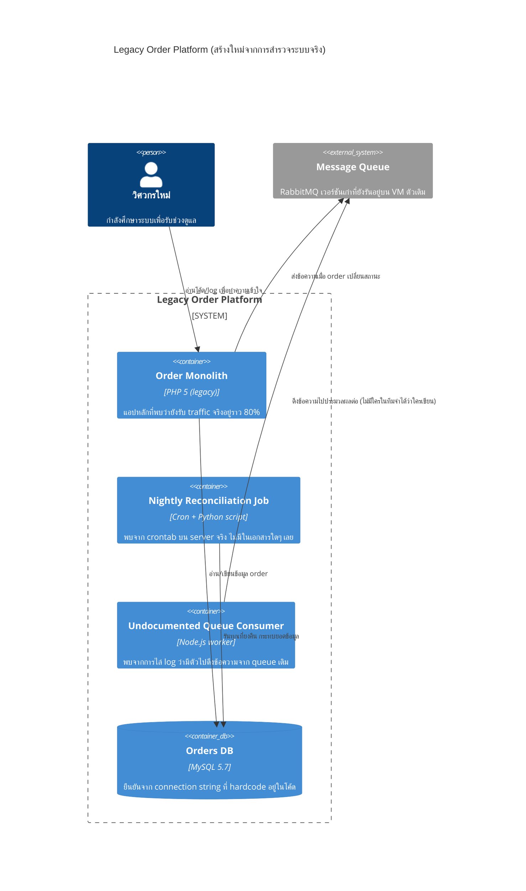

ลองนึกภาพว่าคุณได้รับมรดกเป็นบ้านเก่าหลังหนึ่งจากญาติที่เพิ่งเสียชีวิต บ้านหลังนี้ถูกต่อเติมมาหลายรอบตลอด 20 ปี — ต่อครัวใหม่ปีนี้ เพิ่มห้องนอนชั้นบนปีนั้น เดินท่อประปาใหม่อีกรอบตอนน้ำรั่วเมื่อสามปีก่อน แต่ไม่มีใบอนุญาตต่อเติมสักใบ ไม่มีพิมพ์เขียวอัปเดตสักแผ่นเหลืออยู่เลย มีแค่ตัวบ้านจริงที่ยืนอยู่ตรงหน้า กับเพื่อนบ้านคนเดียวที่จำได้ลางๆ ว่า "ท่อแก๊สน่าจะเดินผ่านใต้ห้องครัว" แต่เพื่อนบ้านคนนั้นกำลังจะย้ายไปอยู่ต่างจังหวัดในอีกสองเดือน

คุณต้องอยู่ในบ้านหลังนี้ทันที ไม่มีเวลาหยุดพักเพื่อรื้อสร้างใหม่ทั้งหมด และก่อนจะเจาะผนังติดแอร์เครื่องใหม่สักตัว คุณต้องรู้ก่อนว่าจะไปโดนสายไฟหรือท่อน้ำที่ซ่อนอยู่ตรงไหนหรือเปล่า สถาปนิกมืออาชีพจะไม่เริ่มจากการถามเพื่อนบ้านทุกคนแล้วเอาคำตอบมาปะติดปะต่อ (เพราะความจำคนคลาดเคลื่อนและตกหล่นได้เสมอ) แต่จะสำรวจตัวบ้านจริงอย่างเป็นระบบ เคาะผนังฟังเสียงกลวง เปิดฝ้าเพดานดูสายไฟจริง แล้ววาดพิมพ์เขียวขึ้นมาใหม่จากสิ่งที่เห็นจริงต่อหน้า

สถานการณ์เดียวกันนี้เกิดขึ้นทุกวันในทีมวิศวกรรมซอฟต์แวร์ — วิศวกรใหม่ (หรือทีมทั้งทีมที่ถูกโอนย้ายมาจากการปรับโครงสร้างองค์กร) ต้องเข้ามาดูแลระบบ production ที่ไม่มีเอกสารสถาปัตยกรรมเหลืออยู่เลย ไม่มี diagram ไม่มี ADR มีแค่โค้ดที่รันอยู่จริงกับความรู้ที่ฝังอยู่ในหัวคนไม่กี่คนที่กำลังจะลาออก นี่คือปัญหาคลาสสิกที่เรียกว่า <mark class="hl-term">**Undocumented Legacy System**</mark> และทางออกไม่ใช่การรีบถามคนเก่าให้ครบทุกคนก่อนที่พวกเขาจะไป แต่คือการทำสิ่งที่สถาปนิกบ้านทำ — ใช้ระบบจริงที่รันอยู่เป็น source of truth

## Requirement คร่าวๆ

- ทีมใหม่ต้องเข้าใจระบบเพียงพอที่จะแก้บั๊กและส่ง feature เล็กๆ ได้ภายในไม่กี่สัปดาห์ โดยไม่รอให้ "มีคนอธิบายให้ฟังครบทุกจุด" ก่อน
- ห้ามหยุดระบบ production เพื่อสำรวจ — ต้องเรียนรู้ไปพร้อมกับระบบที่ยังให้บริการผู้ใช้จริงอยู่ตลอดเวลา
- tribal knowledge ของทีมเดิมกำลังจะหายไปพร้อมกับคนที่ลาออก/ย้ายทีมภายใน 1-2 เดือน ต้องรีบดึงเฉพาะส่วนที่ "ตัวระบบเองบอกไม่ได้" ออกมาก่อนคนกลุ่มนี้จะไป
- ทุกอย่างที่ทีมใหม่เรียนรู้มา ต้องถูกบันทึกเป็นเอกสารที่คนถัดไปอ่านต่อได้ ไม่ใช่ปล่อยให้กลับไปเป็นความรู้ปากเปล่าเหมือนเดิมอีกรอบ
- ห้ามเปลี่ยนโครงสร้างระบบใหญ่ๆ จนกว่าจะเข้าใจภาพจริงพอสมควร — เปลี่ยนแปลงโดยไม่รู้ blast radius คือความเสี่ยงที่ยอมรับไม่ได้กับระบบที่มีผู้ใช้จริงอยู่แล้ว

## ใช้ระบบจริงเป็น Source of Truth: Reverse-Engineer C4 Container Diagram

โมดูล 14 (Architecture Documentation & Views) สอนไว้ว่า C4 Model ซูมจากภาพกว้างไปแคบทีละชั้น — Context, Container, Component, Code แต่สำหรับระบบไร้เอกสาร จุดเริ่มต้นที่คุ้มค่าที่สุดไม่ใช่ Context (เพราะรู้อยู่แล้วคร่าวๆ ว่าธุรกิจนี้ทำอะไร) แต่คือ **Container** — เพราะคำถามที่ตอบไม่ได้จริงๆ ตอนนี้คือ "มีกี่ service กันแน่ที่รันอยู่ ใครคุยกับใคร" คำถามนี้ต้องตอบด้วยการอ่านของจริง ไม่ใช่ถามคน

วิธีทำจริงคือไล่ตรวจ infra ที่รันอยู่ — ดู deployment config, connection string ที่ hardcode ในโค้ด, crontab บน server, consumer ที่ subscribe queue อยู่จริง แล้วค่อยเอาสิ่งที่คนเดิมยังจำได้มาช่วยยืนยันหรือเติมช่องว่างทีหลัง ไม่ใช่ใช้เป็นแหล่งข้อมูลหลักตั้งแต่แรก <mark class="hl-insight">ระบบที่รันอยู่จริงโกหกไม่ได้ ต่างจากความทรงจำของคนที่คลาดเคลื่อนได้ตลอดเวลาโดยที่เจ้าตัวไม่รู้ตัวด้วยซ้ำ</mark>



สิ่งที่มักเจอระหว่างสำรวจคือของจริงไม่ตรงกับคำบอกเล่าของคนในทีมเลย เพราะระบบที่ไม่มีใครคอยรักษาวินัยด้านสถาปัตยกรรมมักถูกกัดกร่อนไปทีละจุดตามการแก้ปัญหาเฉพาะหน้า — ปรากฏการณ์ที่โมดูล 21 (Evolutionary Architecture & Anti-pattern) เรียกว่า architecture erosion เอกสารที่หายไปกับสถาปัตยกรรมที่เสื่อมสภาพจึงมักเป็นปัญหาคู่แฝดที่มาด้วยกันเสมอ แต่เคสนี้ยังโฟกัสที่การสร้างเอกสารกลับคืนมาก่อน ไม่ใช่การแก้ erosion โดยตรง

## จัดสิ่งที่ค้นพบเข้า 4+1 View ให้ตรงคำถามที่จะโดนถาม

พอมี Container diagram แล้ว ข้อมูลที่เก็บมาระหว่างสำรวจจะกระจัดกระจาย — ต้องใช้ **4+1 View Model** (โมดูล 14) จัดเข้ากล่องให้ถูกที่ ไม่ใช่โยนทุกอย่างลง diagram เดียวจนอ่านไม่รู้เรื่อง

- **Logical View** — ระหว่างไล่โค้ด Order Monolith จะเจอ concept ทางธุรกิจที่ไม่มีใครเขียนอธิบายไว้ เช่น สถานะ order ที่ซ่อนอยู่ในคอลัมน์ `status_code` เป็นตัวเลข ต้องไล่ enum ในโค้ดมาสร้างเป็น domain model ใหม่ทั้งหมด แล้วบันทึกไว้เป็น Logical View
- **Physical/Deployment View** — บันทึกว่า monolith รันอยู่บน VM ตัวไหน cron job ถูก schedule ด้วยอะไร queue consumer deploy แยกจากตัวหลักหรือเปล่า ข้อมูลนี้ต้องดึงจาก infra จริง ไม่ใช่จากรูปเก่าใน slide ที่อาจล้าสมัยไปหลายปีแล้ว
- **Process View** — ต้องสังเกตพฤติกรรม runtime ภายใต้โหลดจริง เช่น ช่วงที่ cron job รันตอนเที่ยงคืนพร้อมกับมี queue consumer ประมวลผลอยู่ด้วย ทำให้ DB connection พุ่งสูงจนบางครั้ง request ปกติช้าลง — พฤติกรรมแบบนี้ไม่มีทางรู้ได้จากการอ่านโค้ดเฉยๆ ต้องสังเกตของจริงตอนระบบทำงาน

## ตารางเปรียบเทียบ Trade-off: ถามคนเดิม vs สำรวจระบบจริง

| ประเด็น | ถามคนในทีมเดิม (tribal knowledge) | สำรวจระบบจริง (code/infra archaeology) |
|---|---|---|
| ความเร็วในช่วงแรก | เร็ว — ถามคำถามตรงๆ ได้คำตอบทันที | ช้ากว่า — ต้องไล่โค้ด, log, config เอง |
| ความแม่นยำ | เสี่ยงคลาดเคลื่อนหรือคนจำผิดโดยไม่รู้ตัว | แม่นยำเท่าที่ระบบจริงเป็น ไม่มีอคติของความทรงจำ |
| อายุของข้อมูล | หมดอายุทันทีที่คนคนนั้นลาออก | คงอยู่ตราบใดที่ระบบยังรันอยู่ |
| ครอบคลุมมุมที่คนลืม | ครอบคลุมไม่ได้เลยถ้าไม่มีใครจำ | ครอบคลุมทุกจุดที่ระบบสัมผัส แม้ไม่มีใครจำได้ |
| เหมาะกับ | ยืนยัน "ทำไม" ถึงตัดสินใจแบบนี้ (เจตนา) | หา "อะไร" ที่รันอยู่จริง (โครงสร้าง) |

```demo
component: StepThroughDiagram
props: {"steps":[{"label":"1. สำรวจระบบจริง","detail":"ไล่ deployment config, connection string, crontab, queue consumer ที่รันอยู่จริง เพื่อสร้าง C4 Container diagram จากของจริง ไม่ใช่จากคำบอกเล่า"},{"label":"2. ถามคนเดิมเป็นตัวเสริม","detail":"เอาสิ่งที่สำรวจเจอไปถามยืนยันกับคนที่ยังอยู่ เพื่อเติมเจตนาและเหตุผลเบื้องหลัง (ทำไมถึงมี cron job ตัวนี้) ไม่ใช่ใช้คำตอบของคนเป็นแหล่งข้อมูลหลัก"},{"label":"3. จัดเข้า 4+1 View","detail":"แยกสิ่งที่เจอเข้า Logical View (domain model ที่ไล่จากโค้ด), Physical View (deployment topology จริง), Process View (พฤติกรรม runtime ตอนโหลดสูง) แทนที่จะโยนทุกอย่างลง diagram เดียว"},{"label":"4. เขียน ADR แรก","detail":"พอเข้าใจพอจะทำการเปลี่ยนแปลงแรกได้ ให้บันทึกเหตุผลของการเปลี่ยนแปลงนั้นเป็น ADR ทันที เพื่อไม่ให้คนถัดไปเจอปัญหาแบบเดียวกับที่ทีมนี้เพิ่งเจอ"}]}
```

## เขียน ADR แรก: วางวินัยที่ระบบนี้ไม่เคยมี

พอเข้าใจระบบพอจะลงมือแก้จริงได้ครั้งแรก — เช่น ตัดสินใจย้าย Undocumented Queue Consumer ออกจาก VM เดิมไปรันเป็น container แยก — จุดนี้คือโอกาสสำคัญที่สุดในการวาง<mark class="hl-warning">วินัยที่ระบบเดิมไม่เคยมี</mark> ถ้าทำการเปลี่ยนแปลงไปเงียบๆ โดยไม่บันทึกอะไรไว้ ทีมถัดไปจะตกอยู่ในสถานการณ์เดียวกับที่ทีมนี้เพิ่งเจอมาทุกประการ

ตามโมดูล 14 เรื่อง ADR (Architecture Decision Record) — การเปลี่ยนแปลงระดับนี้เข้าข่าย "one-way door" เพราะกระทบ deployment topology และพฤติกรรม runtime ทั้งระบบ จึงควรมี ADR เขียนไว้ <mark class="hl-insight">เป้าหมายของ ADR แรกนี้ไม่ใช่แค่บันทึกสิ่งที่เพิ่งค้นพบ แต่คือสร้างนิสัยให้ทุกการตัดสินใจถัดไปถูกบันทึกเป็นค่าเริ่มต้น ไม่ใช่ข้อยกเว้น</mark>

## ADR ตัวอย่าง

> **Title:** ADR-001: แยก Undocumented Queue Consumer ออกเป็น Container อิสระ พร้อมเริ่มบันทึกเอกสารสถาปัตยกรรมของระบบ
> **Status:** Accepted
> **Context:** ระบบ Legacy Order Platform ไม่มีเอกสารสถาปัตยกรรมหลงเหลืออยู่เลยตอนทีมใหม่เข้ารับช่วง ทีมสำรวจ infra จริงจนพบว่ามี Node.js worker ที่ดึงข้อความจาก queue เดิมอยู่ ทำงานร่วม process เดียวกับ Order Monolith โดยไม่มีใครในทีมเดิมจำได้ว่าใครเป็นคนเขียนขึ้นมา ทำให้ deploy monolith ทุกครั้งเสี่ยงกระทบ consumer ตัวนี้โดยไม่ตั้งใจ
> **Decision:** แยก queue consumer ออกมาเป็น container อิสระ deploy แยกจาก monolith และเริ่มเก็บ C4 Container diagram กับ 4+1 View ที่สร้างจากการสำรวจครั้งนี้ไว้ใน repo คู่กับโค้ด พร้อมกำหนดว่าการเปลี่ยนแปลงระดับ one-way door ทุกครั้งนับจากนี้ต้องมี ADR กำกับ
> **Consequences:** Deploy ของ monolith และ consumer แยกอิสระจากกัน ลดความเสี่ยงจากการกระทบกันโดยไม่ตั้งใจ ทีมต้องเสียเวลาช่วงแรกเขียนเอกสารที่ไม่เคยมีมาก่อน แต่แลกกับการที่ทีมถัดไปจะไม่ต้องเริ่มจากศูนย์เหมือนที่ทีมนี้เพิ่งเจอมา
