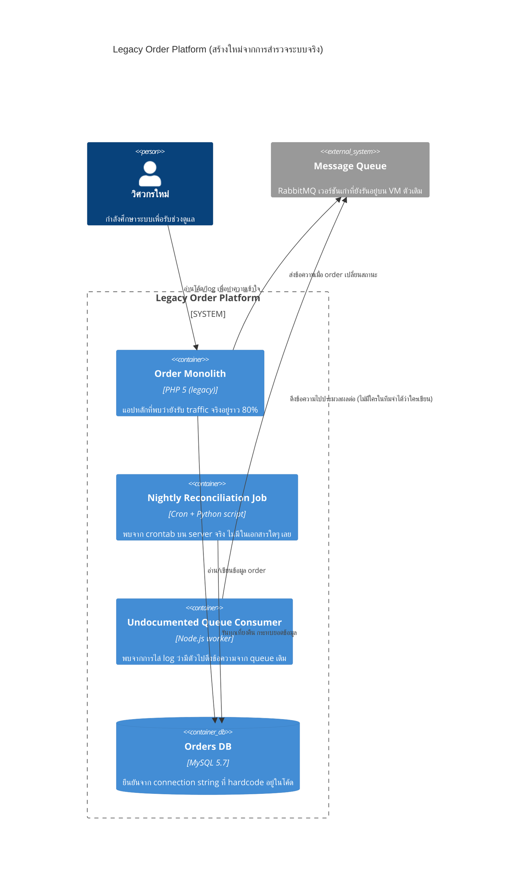
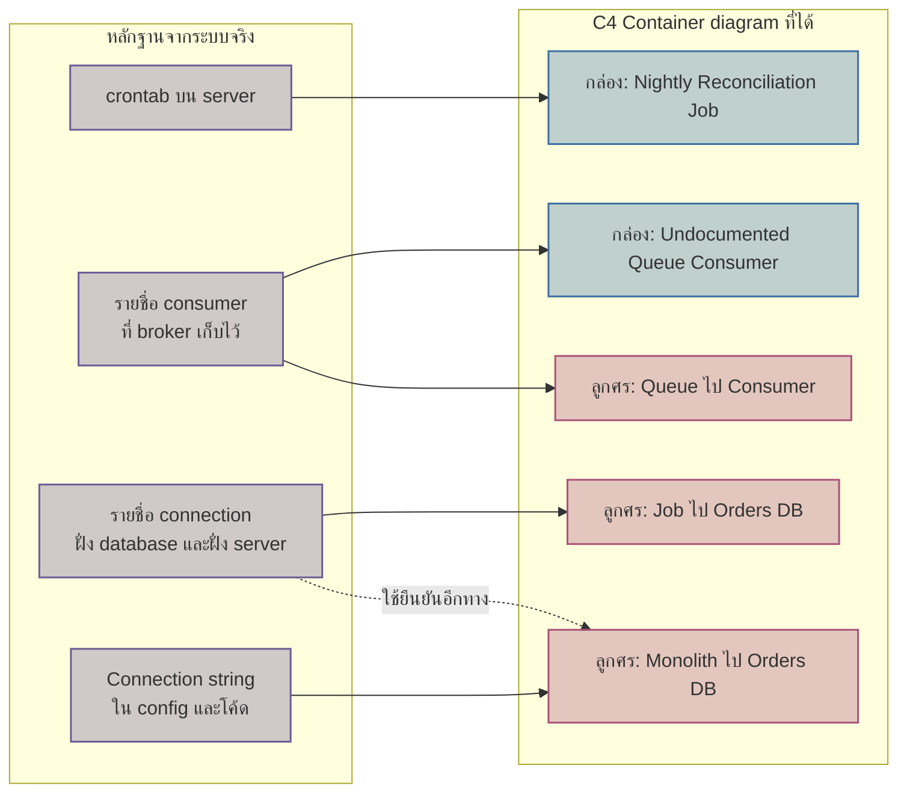
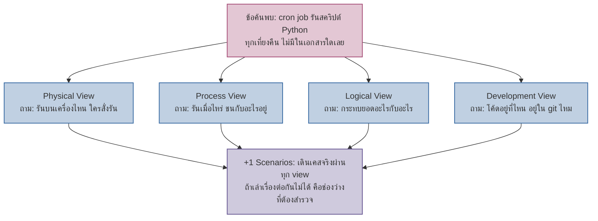
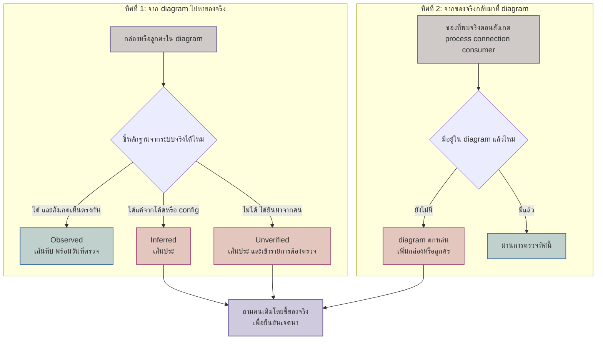
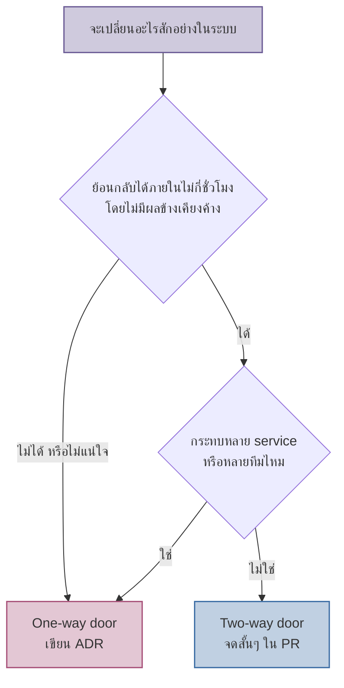
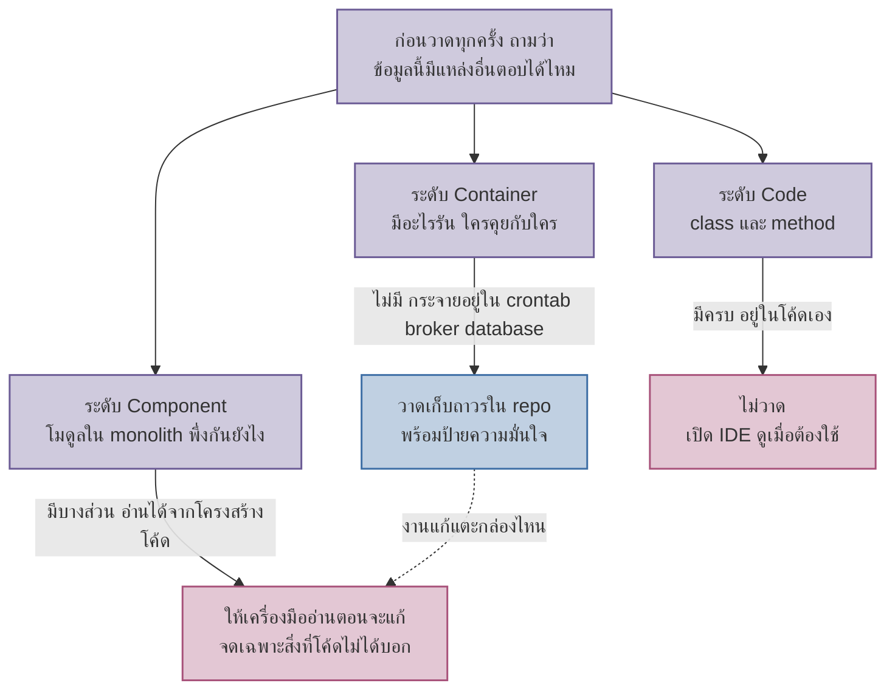
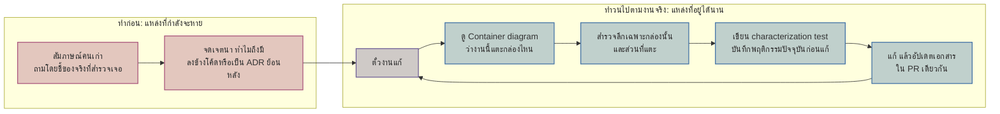
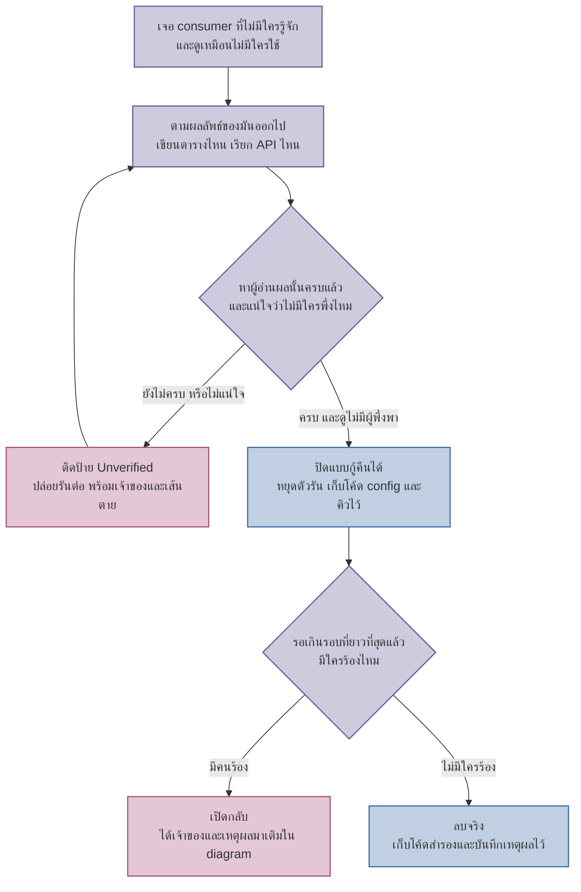

ลองนึกภาพว่าคุณได้รับมรดกเป็นบ้านเก่าหลังหนึ่งจากญาติที่เพิ่งเสียชีวิต บ้านหลังนี้ถูกต่อเติมมาหลายรอบตลอด 20 ปี — ต่อครัวใหม่ปีนี้ เพิ่มห้องนอนชั้นบนปีนั้น เดินท่อประปาใหม่อีกรอบตอนน้ำรั่วเมื่อสามปีก่อน แต่ไม่มีใบอนุญาตต่อเติมสักใบ ไม่มีพิมพ์เขียวอัปเดตสักแผ่นเหลืออยู่เลย มีแค่ตัวบ้านจริงที่ยืนอยู่ตรงหน้า กับเพื่อนบ้านคนเดียวที่จำได้ลางๆ ว่า "ท่อแก๊สน่าจะเดินผ่านใต้ห้องครัว" แต่เพื่อนบ้านคนนั้นกำลังจะย้ายไปอยู่ต่างจังหวัดในอีกสองเดือน

คุณต้องอยู่ในบ้านหลังนี้ทันที ไม่มีเวลาหยุดพักเพื่อรื้อสร้างใหม่ทั้งหมด และก่อนจะเจาะผนังติดแอร์เครื่องใหม่สักตัว คุณต้องรู้ก่อนว่าจะไปโดนสายไฟหรือท่อน้ำที่ซ่อนอยู่ตรงไหนหรือเปล่า สถาปนิกมืออาชีพจะไม่เริ่มจากการถามเพื่อนบ้านทุกคนแล้วเอาคำตอบมาปะติดปะต่อ (เพราะความจำคนคลาดเคลื่อนและตกหล่นได้เสมอ) แต่จะสำรวจตัวบ้านจริงอย่างเป็นระบบ เคาะผนังฟังเสียงกลวง เปิดฝ้าเพดานดูสายไฟจริง แล้ววาดพิมพ์เขียวขึ้นมาใหม่จากสิ่งที่เห็นจริงต่อหน้า

สถานการณ์เดียวกันนี้เกิดขึ้นทุกวันในทีมวิศวกรรมซอฟต์แวร์ — วิศวกรใหม่ (หรือทีมทั้งทีมที่ถูกโอนย้ายมาจากการปรับโครงสร้างองค์กร) ต้องเข้ามาดูแลระบบ production ที่ไม่มีเอกสารสถาปัตยกรรมเหลืออยู่เลย ไม่มี diagram ไม่มี ADR มีแค่โค้ดที่รันอยู่จริงกับความรู้ที่ฝังอยู่ในหัวคนไม่กี่คนที่กำลังจะลาออก นี่คือปัญหาคลาสสิกที่เรียกว่า <mark class="hl-term">**Undocumented Legacy System**</mark> และทางออกไม่ใช่การรีบถามคนเก่าให้ครบทุกคนก่อนที่พวกเขาจะไป แต่คือการทำสิ่งที่สถาปนิกบ้านทำ — ใช้ระบบจริงที่รันอยู่เป็น source of truth

## Requirement คร่าวๆ

- ทีมใหม่ต้องเข้าใจระบบเพียงพอที่จะแก้บั๊กและส่ง feature เล็กๆ ได้ภายในไม่กี่สัปดาห์ โดยไม่รอให้ "มีคนอธิบายให้ฟังครบทุกจุด" ก่อน
- ห้ามหยุดระบบ production เพื่อสำรวจ — ต้องเรียนรู้ไปพร้อมกับระบบที่ยังให้บริการผู้ใช้จริงอยู่ตลอดเวลา
- tribal knowledge ของทีมเดิมกำลังจะหายไปพร้อมกับคนที่ลาออก/ย้ายทีมภายใน 1-2 เดือน ต้องรีบดึงเฉพาะส่วนที่ "ตัวระบบเองบอกไม่ได้" ออกมาก่อนคนกลุ่มนี้จะไป
- ทุกอย่างที่ทีมใหม่เรียนรู้มา ต้องถูกบันทึกเป็นเอกสารที่คนถัดไปอ่านต่อได้ ไม่ใช่ปล่อยให้กลับไปเป็นความรู้ปากเปล่าเหมือนเดิมอีกรอบ
- ห้ามเปลี่ยนโครงสร้างระบบใหญ่ๆ จนกว่าจะเข้าใจภาพจริงพอสมควร — เปลี่ยนแปลงโดยไม่รู้ blast radius คือความเสี่ยงที่ยอมรับไม่ได้กับระบบที่มีผู้ใช้จริงอยู่แล้ว

## ใช้ระบบจริงเป็น Source of Truth: Reverse-Engineer C4 Container Diagram

โมดูล 14 (Architecture Documentation & Views) สอนไว้ว่า C4 Model ซูมจากภาพกว้างไปแคบทีละชั้น — Context, Container, Component, Code แต่สำหรับระบบไร้เอกสาร จุดเริ่มต้นที่คุ้มค่าที่สุดไม่ใช่ Context (เพราะรู้อยู่แล้วคร่าวๆ ว่าธุรกิจนี้ทำอะไร) แต่คือ **Container** — เพราะคำถามที่ตอบไม่ได้จริงๆ ตอนนี้คือ "มีกี่ service กันแน่ที่รันอยู่ ใครคุยกับใคร" คำถามนี้ต้องตอบด้วยการอ่านของจริง ไม่ใช่ถามคน

วิธีทำจริงคือไล่ตรวจ infra ที่รันอยู่ — ดู deployment config, connection string ที่ hardcode ในโค้ด, crontab บน server, consumer ที่ subscribe queue อยู่จริง แล้วค่อยเอาสิ่งที่คนเดิมยังจำได้มาช่วยยืนยันหรือเติมช่องว่างทีหลัง ไม่ใช่ใช้เป็นแหล่งข้อมูลหลักตั้งแต่แรก <mark class="hl-insight">ระบบที่รันอยู่จริงโกหกไม่ได้ ต่างจากความทรงจำของคนที่คลาดเคลื่อนได้ตลอดเวลาโดยที่เจ้าตัวไม่รู้ตัวด้วยซ้ำ</mark>


```mermaid
C4Container
    title Legacy Order Platform (สร้างใหม่จากการสำรวจระบบจริง)

    Person(newEngineer, "วิศวกรใหม่", "กำลังศึกษาระบบเพื่อรับช่วงดูแล")

    System_Boundary(legacy, "Legacy Order Platform") {
        Container(monolith, "Order Monolith", "PHP 5 (legacy)", "แอปหลักที่พบว่ายังรับ traffic จริงอยู่ราว 80%")
        Container(cronWorker, "Nightly Reconciliation Job", "Cron + Python script", "พบจาก crontab บน server จริง ไม่มีในเอกสารใดๆ เลย")
        Container(hiddenConsumer, "Undocumented Queue Consumer", "Node.js worker", "พบจากการไล่ log ว่ามีตัวไปดึงข้อความจาก queue เดิม")
        ContainerDb(mainDb, "Orders DB", "MySQL 5.7", "ยืนยันจาก connection string ที่ hardcode อยู่ในโค้ด")
    }

    System_Ext(legacyQueue, "Message Queue", "RabbitMQ เวอร์ชันเก่าที่ยังรันอยู่บน VM ตัวเดิม")

    Rel(newEngineer, monolith, "อ่านโค้ด/log เพื่อทำความเข้าใจ")
    Rel(monolith, mainDb, "อ่าน/เขียนข้อมูล order")
    Rel(cronWorker, mainDb, "รันทุกเที่ยงคืน กระทบยอดข้อมูล")
    Rel(monolith, legacyQueue, "ส่งข้อความเมื่อ order เปลี่ยนสถานะ")
    Rel(hiddenConsumer, legacyQueue, "ดึงข้อความไปประมวลผลต่อ (ไม่มีใครในทีมจำได้ว่าใครเขียน)")
```

สิ่งที่มักเจอระหว่างสำรวจคือของจริงไม่ตรงกับคำบอกเล่าของคนในทีมเลย เพราะระบบที่ไม่มีใครคอยรักษาวินัยด้านสถาปัตยกรรมมักถูกกัดกร่อนไปทีละจุดตามการแก้ปัญหาเฉพาะหน้า — ปรากฏการณ์ที่โมดูล 21 (Evolutionary Architecture & Anti-pattern) เรียกว่า architecture erosion เอกสารที่หายไปกับสถาปัตยกรรมที่เสื่อมสภาพจึงมักเป็นปัญหาคู่แฝดที่มาด้วยกันเสมอ แต่เคสนี้ยังโฟกัสที่การสร้างเอกสารกลับคืนมาก่อน ไม่ใช่การแก้ erosion โดยตรง

## จัดสิ่งที่ค้นพบเข้า 4+1 View ให้ตรงคำถามที่จะโดนถาม

พอมี Container diagram แล้ว ข้อมูลที่เก็บมาระหว่างสำรวจจะกระจัดกระจาย — ต้องใช้ **4+1 View Model** (โมดูล 14) จัดเข้ากล่องให้ถูกที่ ไม่ใช่โยนทุกอย่างลง diagram เดียวจนอ่านไม่รู้เรื่อง

- **Logical View** — ระหว่างไล่โค้ด Order Monolith จะเจอ concept ทางธุรกิจที่ไม่มีใครเขียนอธิบายไว้ เช่น สถานะ order ที่ซ่อนอยู่ในคอลัมน์ `status_code` เป็นตัวเลข ต้องไล่ enum ในโค้ดมาสร้างเป็น domain model ใหม่ทั้งหมด แล้วบันทึกไว้เป็น Logical View
- **Physical/Deployment View** — บันทึกว่า monolith รันอยู่บน VM ตัวไหน cron job ถูก schedule ด้วยอะไร queue consumer deploy แยกจากตัวหลักหรือเปล่า ข้อมูลนี้ต้องดึงจาก infra จริง ไม่ใช่จากรูปเก่าใน slide ที่อาจล้าสมัยไปหลายปีแล้ว
- **Process View** — ต้องสังเกตพฤติกรรม runtime ภายใต้โหลดจริง เช่น ช่วงที่ cron job รันตอนเที่ยงคืนพร้อมกับมี queue consumer ประมวลผลอยู่ด้วย ทำให้ DB connection พุ่งสูงจนบางครั้ง request ปกติช้าลง — พฤติกรรมแบบนี้ไม่มีทางรู้ได้จากการอ่านโค้ดเฉยๆ ต้องสังเกตของจริงตอนระบบทำงาน

## ตารางเปรียบเทียบ Trade-off: ถามคนเดิม vs สำรวจระบบจริง

| ประเด็น | ถามคนในทีมเดิม (tribal knowledge) | สำรวจระบบจริง (code/infra archaeology) |
|---|---|---|
| ความเร็วในช่วงแรก | เร็ว — ถามคำถามตรงๆ ได้คำตอบทันที | ช้ากว่า — ต้องไล่โค้ด, log, config เอง |
| ความแม่นยำ | เสี่ยงคลาดเคลื่อนหรือคนจำผิดโดยไม่รู้ตัว | แม่นยำเท่าที่ระบบจริงเป็น ไม่มีอคติของความทรงจำ |
| อายุของข้อมูล | หมดอายุทันทีที่คนคนนั้นลาออก | คงอยู่ตราบใดที่ระบบยังรันอยู่ |
| ครอบคลุมมุมที่คนลืม | ครอบคลุมไม่ได้เลยถ้าไม่มีใครจำ | ครอบคลุมทุกจุดที่ระบบสัมผัส แม้ไม่มีใครจำได้ |
| เหมาะกับ | ยืนยัน "ทำไม" ถึงตัดสินใจแบบนี้ (เจตนา) | หา "อะไร" ที่รันอยู่จริง (โครงสร้าง) |

```demo
component: StepThroughDiagram
props: {"steps":[{"label":"1. สำรวจระบบจริง","detail":"ไล่ deployment config, connection string, crontab, queue consumer ที่รันอยู่จริง เพื่อสร้าง C4 Container diagram จากของจริง ไม่ใช่จากคำบอกเล่า"},{"label":"2. ถามคนเดิมเป็นตัวเสริม","detail":"เอาสิ่งที่สำรวจเจอไปถามยืนยันกับคนที่ยังอยู่ เพื่อเติมเจตนาและเหตุผลเบื้องหลัง (ทำไมถึงมี cron job ตัวนี้) ไม่ใช่ใช้คำตอบของคนเป็นแหล่งข้อมูลหลัก"},{"label":"3. จัดเข้า 4+1 View","detail":"แยกสิ่งที่เจอเข้า Logical View (domain model ที่ไล่จากโค้ด), Physical View (deployment topology จริง), Process View (พฤติกรรม runtime ตอนโหลดสูง) แทนที่จะโยนทุกอย่างลง diagram เดียว"},{"label":"4. เขียน ADR แรก","detail":"พอเข้าใจพอจะทำการเปลี่ยนแปลงแรกได้ ให้บันทึกเหตุผลของการเปลี่ยนแปลงนั้นเป็น ADR ทันที เพื่อไม่ให้คนถัดไปเจอปัญหาแบบเดียวกับที่ทีมนี้เพิ่งเจอ"}]}
```

## เขียน ADR แรก: วางวินัยที่ระบบนี้ไม่เคยมี

พอเข้าใจระบบพอจะลงมือแก้จริงได้ครั้งแรก — เช่น ตัดสินใจย้าย Undocumented Queue Consumer ออกจาก VM เดิมไปรันเป็น container แยก — จุดนี้คือโอกาสสำคัญที่สุดในการวาง<mark class="hl-warning">วินัยที่ระบบเดิมไม่เคยมี</mark> ถ้าทำการเปลี่ยนแปลงไปเงียบๆ โดยไม่บันทึกอะไรไว้ ทีมถัดไปจะตกอยู่ในสถานการณ์เดียวกับที่ทีมนี้เพิ่งเจอมาทุกประการ

ตามโมดูล 14 เรื่อง ADR (Architecture Decision Record) — การเปลี่ยนแปลงระดับนี้เข้าข่าย "one-way door" เพราะกระทบ deployment topology และพฤติกรรม runtime ทั้งระบบ จึงควรมี ADR เขียนไว้ <mark class="hl-insight">เป้าหมายของ ADR แรกนี้ไม่ใช่แค่บันทึกสิ่งที่เพิ่งค้นพบ แต่คือสร้างนิสัยให้ทุกการตัดสินใจถัดไปถูกบันทึกเป็นค่าเริ่มต้น ไม่ใช่ข้อยกเว้น</mark>

## คำถามเจาะลึกที่มักถูกถามต่อ

พออ่านเคสนี้จบ คนสัมภาษณ์หรือเพื่อนร่วมทีมมักไม่ถามแค่ว่า "ควรสำรวจระบบจริงไหม" (เนื้อเคสตอบไปแล้ว) แต่จะถามต่อว่า "สำรวจยังไงกันแน่ เชื่อผลที่ได้ได้แค่ไหน และทำยังไงไม่ให้กลับไปเป็นระบบไร้เอกสารอีก" สี่คำถามแรก (Q1–Q4) ไล่ตั้งแต่การอ่านหลักฐานจากระบบจริงมาวาดเป็น diagram, การจัดข้อค้นพบเข้า view, การตรวจว่า diagram เป็นความจริง ไปจนถึงการเลือกและเขียน ADR แรก แต่ละข้อไล่ให้ครบว่าใช้ความรู้อะไร ข้างใต้ทำงานยังไง และพังได้ตรงไหน ส่วนอีกแนวที่ senior ชอบถามที่สุดคือ "ทำไมเลือกแบบนี้ ทำไมไม่เลือกอีกแบบ" สามคำถามหลัง (Q5–Q7) จึงไล่ให้เห็นทางเลือกที่ไม่ได้เลือก เหตุผลข้างใต้ ราคาที่ต้องจ่าย และเงื่อนไขที่ทำให้คำตอบเปลี่ยน

### Q1: ไม่มีเอกสารเลย จะ "อ่านระบบที่รันอยู่" แล้ววาดเป็น C4 Container diagram ได้ยังไง หลักฐานแต่ละอย่างกลายเป็นกล่องหรือลูกศรอย่างไร

**ใช้ความรู้อะไร:** โมดูล 14 (C4 Model ระดับ Container คือหน่วยที่รันหรือ deploy แยกกันได้จริง เช่น แอป worker หรือ database — คำว่า container ตรงนี้ไม่ใช่ Docker) บวกโมดูล Reliability ของ System Design (หัวข้อ Observability เรื่อง log, metric, trace ที่เป็นที่มาของหลักฐานตอนระบบรันจริง)

**นึกภาพก่อน:** นักสืบที่เข้าห้องซึ่งไม่มีคำให้การของใครเลย มีแต่ร่องรอยหลายชนิด — สมุดนัดหมายที่บอกว่าใครต้องทำอะไรเมื่อไหร่ ประวัติการโทรที่บอกว่าใครคุยกับใคร และทะเบียนผู้พักอาศัยของตึกที่บอกว่ามีใครอยู่บ้าง ร่องรอยชนิดเดียวบอกภาพทั้งหมดไม่ได้ แต่ละชนิดตอบคำถามได้แค่ข้อเดียว นักสืบที่ดีจึงเอามาต่อกัน และถ้าร่องรอยสองอย่างขัดกันก็จดไว้ ไม่เลือกข้างเงียบๆ

**แก้ปัญหายังไง:** หลักคิดคือหลักฐานทุกชิ้นตอบได้แค่สองคำถาม — "มีอะไรรันอยู่" (กลายเป็น **กล่อง**) หรือ "ใครคุยกับใคร" (กลายเป็น **ลูกศร**) ตารางนี้สรุปแหล่งหลักฐานที่ไล่ดูได้ พร้อมจุดอ่อนของแต่ละอย่าง

| แหล่งหลักฐาน | ดูได้จาก | กลายเป็น | จุดอ่อนที่ต้องรู้ |
|---|---|---|---|
| Deployment config (docker-compose, systemd unit, Kubernetes manifest) | อ่านไฟล์ แล้วเทียบกับ process ที่รันจริง | กล่องของแต่ละ service และลูกศรจาก env var หรือ depends_on | บอกว่า "ตั้งใจให้รันอะไร" ไม่ใช่ "รันอะไรอยู่จริง" |
| crontab (cron คือตัวตั้งเวลารันงานของ Linux, crontab คือไฟล์ตารางงานของมัน) | ไล่ของทุก user, ไฟล์ใน `/etc/cron.d`, systemd timer ของทุกเครื่อง | กล่องของแต่ละ job และลูกศรตามที่สคริปต์เรียกไป | งานที่ตั้งบนเครื่องอื่นหรือ scheduler ในตัวแอปเองไม่โผล่ที่นี่ |
| Consumer ของ queue | หน้า management ของ broker หรือคำสั่ง `rabbitmqctl list_consumers` | ลูกศรจาก queue ไป consumer และเครื่องต้นทางของ connection บอกว่ากล่องนั้นอยู่ที่ไหน | เห็นเฉพาะ consumer ที่ต่ออยู่ตอนนั้น worker ที่รันเป็นช่วงๆ อาจไม่โผล่ |
| Connection ที่เปิดอยู่จริง | `ss -tnp` หรือ `lsof -i` บน server และ `SHOW PROCESSLIST` บนฝั่ง MySQL | ลูกศรจาก process ไปยัง host และ port ปลายทาง | เป็นภาพ ณ วินาทีนั้น connection สั้นๆ ของ cron job จะหลุด |
| Service discovery (เช่น Consul, Kubernetes Service) | ดูรายชื่อบริการที่ลงทะเบียนไว้ | รายชื่อกล่องที่ลงทะเบียนตัวเอง | ระบบเก่ามักไม่เคยลงทะเบียนอะไรเลย |
| APM (Application Performance Monitoring) และ distributed tracing | service map จากเครื่องมือ tracing | ลูกศรพร้อมความถี่จริงของการเรียก | เห็นเฉพาะโค้ดที่ติด instrumentation ระบบเก่าอาจไม่เคยถูกติดไว้ |
| Connection string ใน config หรือโค้ด | ไล่หา host, port, ชื่อ database | ลูกศรจากแอปไป database | อาจเป็นทางเก่าที่ไม่ถูกเรียกแล้ว ต้องยืนยันด้วย connection จริง |

จากตารางนี้ไล่เป็นขั้นตอนได้ดังนี้

1. **ทำรายชื่อกล่องจากหลายแหล่งที่เป็นอิสระต่อกัน** — deployment config, รายการ process บนแต่ละเครื่อง และ crontab แล้วรวมเป็นตารางเดียว กล่องที่ปรากฏในแหล่งเดียวแต่ไม่ปรากฏในแหล่งอื่นคือจุดที่ต้องสงสัยก่อน
2. **ลากลูกศรจากสิ่งที่ config บอก** — connection string และ env var ได้ "ลูกศรที่ตั้งใจให้มี" ซึ่งยังเป็นแค่สมมติฐาน
3. **ตรวจย้อนจากฝั่งปลายทาง** — ถาม database ว่าใครต่ออยู่ และถาม <mark class="hl-term">**message broker**</mark> (ตัวกลางที่ถือคิวข้อความ ในเคสนี้คือ RabbitMQ) ว่ามี consumer ตัวไหนสมัครดึงข้อความอยู่ วิธีนี้ไม่ต้องเชื่อโค้ดฝั่งต้นทางเลย และเป็นจุดที่ Undocumented Queue Consumer โผล่ขึ้นมา
4. **ใส่สิ่งที่ไม่มีเจ้าของลง diagram ไว้ก่อน** — กล่องหรือลูกศรที่พบจริงแต่ไม่มีใครรู้จัก ให้ติดป้ายว่า "ไม่ทราบเจ้าของ" แทนที่จะรอให้ครบก่อนแล้วค่อยวาด


```mermaid
flowchart LR
    subgraph Ev["หลักฐานจากระบบจริง"]
        E1["crontab บน server"]
        E2["รายชื่อ consumer<br/>ที่ broker เก็บไว้"]
        E3["รายชื่อ connection<br/>ฝั่ง database และฝั่ง server"]
        E4["Connection string<br/>ใน config และโค้ด"]
    end
    subgraph Out["C4 Container diagram ที่ได้"]
        B1["กล่อง: Nightly Reconciliation Job"]
        B2["กล่อง: Undocumented Queue Consumer"]
        A1["ลูกศร: Job ไป Orders DB"]
        A2["ลูกศร: Queue ไป Consumer"]
        A3["ลูกศร: Monolith ไป Orders DB"]
    end

    E1 --> B1
    E4 --> A3
    E3 --> A1
    E2 --> B2
    E2 --> A2
    E3 -.->|"ใช้ยืนยันอีกทาง"| A3

    classDef evid fill:#6b5b9552,stroke:#6b5b95,stroke-width:1.5px
    classDef bx fill:#3d6ea552,stroke:#3d6ea5,stroke-width:1.5px
    classDef ar fill:#a8527a52,stroke:#a8527a,stroke-width:1.5px
    class E1,E2,E3,E4 evid
    class B1,B2 bx
    class A1,A2,A3 ar
```

```demo
component: StepThroughDiagram
props: {"steps":[{"label":"1. ทำรายชื่อกล่องจากหลายแหล่งที่เป็นอิสระต่อกัน","detail":"อ่านไฟล์ deployment กับรายการ process บน VM จริง ได้ Order Monolith และ MySQL ซึ่งทีมรู้จักอยู่แล้ว ยังไม่มีอะไรน่าแปลกใจ เพราะสองอย่างนี้อยู่ในความจำของทุกคน"},{"label":"2. เปิด crontab ของทุก user บนทุกเครื่อง","detail":"เจอบรรทัดรูปแบบ 0 0 * * * python3 /opt/scripts/reconcile.py (ตัวอย่าง) แปลว่ามีสคริปต์รันทุกเที่ยงคืน ได้กล่องใหม่ชื่อ Nightly Reconciliation Job และพออ่านสคริปต์เจอ connection string ไป Orders DB ก็ได้ลูกศรจาก Job ไป database"},{"label":"3. ถามฝั่ง database ว่าใครต่ออยู่","detail":"ดูรายการ connection ที่ database เห็น (เช่น SHOW PROCESSLIST ของ MySQL) แยกตาม user และ host ต้นทาง ถ้ามีผู้เรียกที่ไม่ตรงกับ Monolith หรือ Job ที่รู้จัก แปลว่ามีตัวที่สามที่ยังไม่อยู่ในภาพ นี่คือการตรวจย้อนจากปลายทางที่ไม่ต้องเชื่อโค้ดฝั่งต้นทาง"},{"label":"4. ถาม broker ว่าใครสมัครดึงข้อความอยู่","detail":"ดูรายชื่อ consumer ของแต่ละ queue (เช่น rabbitmqctl list_consumers หรือหน้า management ของ RabbitMQ) แล้วดูว่า connection ของ consumer มาจากเครื่องไหน เจอ Node.js worker ที่ต่ออยู่จริงแต่ไม่มีในรายการของทีมเลย ได้กล่อง Undocumented Queue Consumer พร้อมลูกศรจาก queue"},{"label":"5. ติดป้ายว่ายืนยันได้แค่ไหน แล้วเก็บเป็น text","detail":"ทุกกล่องและลูกศรจดว่ารู้จากหลักฐานอะไร ตรวจเมื่อไหร่ ตัวไหนยังไม่ทราบเจ้าของก็ใส่ไว้ตรงๆ แล้วเขียนเป็นไฟล์ text เก็บใน repo (รายละเอียดอยู่ใน Q3) เพื่อให้คนถัดไปเริ่มจากภาพนี้ ไม่ใช่เริ่มจากศูนย์"}]}
```

**ข้างใต้ทำงานยังไง:** หลักฐานพวกนี้เชื่อถือได้เพราะแต่ละอย่างคือ **ข้อมูลที่ตัวระบบต้องใช้เองเพื่อทำงาน** ไม่ใช่เอกสารที่มีคนเขียนแยกไว้ ตัว cron ต้องอ่าน crontab เพื่อรู้ว่าจะสั่งรันอะไรเมื่อไหร่ ถ้าไฟล์ผิด job ก็ไม่รันตามที่ควร kernel ของระบบปฏิบัติการเก็บตารางของ TCP connection ที่เปิดอยู่ (`ss` และ `lsof` อ่านตารางนี้) ทุก connection ที่ established คือการคุยกันจริง และเลข port ปลายทางเป็นคำใบ้ชนิดบริการ (ค่าเริ่มต้นของ MySQL คือ 3306 ของ RabbitMQ คือ 5672 แต่เปลี่ยนได้ จึงเป็นแค่คำใบ้ ต้องยืนยันจากตัวบริการ) ส่วน broker ต้องรู้ว่ามี consumer ใครบ้างเพราะต้องรู้ว่าจะส่งข้อความให้ใคร รายชื่อ consumer จึงเป็นสมุดบัญชีภายในของ broker เอง และ database ก็เก็บรายการ connection ของทุกฝั่งที่ต่ออยู่เช่นกัน <mark class="hl-insight">หลักฐานที่ระบบใช้ทำงานจริงมีสถานะเป็น "ของที่กำลังถูกใช้" ถ้าผิดจะเห็นระบบพังหรือทำงานผิด ต่างจากเอกสารที่ผิดแล้วไม่มีอะไรเกิดขึ้นเลย</mark> นี่คือเหตุผลที่ควรเริ่มจากตรงนี้ ก่อนถามความจำของคน

**ถ้าพังหรือมีข้อควรระวังอะไร:**

- <mark class="hl-warning">ไฟล์ config บอกว่า "ตั้งใจให้รันอะไร" ไม่ใช่ "รันอะไรอยู่จริง"</mark> — docker-compose ที่ค้างอยู่ใน repo อาจเป็นของ environment เก่า และ connection string ที่ hardcode ในโค้ดอาจเป็นทางเก่าที่ไม่ถูกเรียกแล้ว ต้องเทียบกับ process และ connection จริงเสมอ
- **ภาพ ณ วินาทีเดียว** — connection ของ cron job เปิดแค่ไม่กี่วินาทีตอนเที่ยงคืน ถ้าไล่ดูตอนบ่ายจะไม่เห็นเลย ต้องอ่านเวลาจาก crontab แล้วไปดูตอนงานรันจริง หรือเก็บ log ของ connection ต่อเนื่อง
- **ช่องบอดของเครื่องมือ** — tracing เห็นเฉพาะโค้ดที่ติด instrumentation (ตัวเก็บข้อมูลที่ฝังในแอป) ระบบเก่าอย่าง PHP 5 ในเคสนี้อาจไม่เคยถูกติดไว้ และ scheduler ที่ฝังในตัวแอปเองก็ไม่โผล่ใน crontab
- **ทำแบบอ่านอย่างเดียวเสมอ** — เพราะระบบยังให้บริการผู้ใช้จริงอยู่ ขอสิทธิ์ read-only ก่อน คำสั่งดูรายชื่อ connection หรือ consumer ไม่กระทบระบบ แต่การเปิด debug logging หนักๆ บน production ต้องประเมินผลกระทบก่อนทุกครั้ง

### Q2: เจอ cron job ลึกลับหนึ่งตัวแล้ว จะเอาไปใส่ view ไหนของ 4+1 ทำไมไม่วาดรวมใน diagram เดียวให้จบ

**ใช้ความรู้อะไร:** โมดูล 14 (4+1 View Model — Logical ตอบเรื่องแนวคิดธุรกิจ, Process ตอบเรื่องการทำงานตอน runtime, Development ตอบเรื่องโครงสร้างซอร์สโค้ด, Physical ตอบเรื่องรันอยู่ที่ไหน และ +1 Scenarios คือการเดินเคสจริงผ่านทุก view เพื่อเช็คว่าสอดคล้องกัน) เนื้อเคสยกมาสาม view ตามข้อค้นพบที่เจอ แต่ Development View ก็มีข้อค้นพบให้ลงเหมือนกัน

**นึกภาพก่อน:** ข้อสังเกตเดียวตอนสำรวจบ้าน เช่น "มีท่อแก๊สเดินใต้ห้องครัว" ไม่ได้ลงพิมพ์เขียวแผ่นเดียว ช่างประปาอยากรู้ว่าท่ออยู่ตรงไหน คนทำครัวอยากรู้ว่าเปิดเตากับเครื่องดูดควันพร้อมกันได้ไหม ผู้ซื้อบ้านอยากรู้ว่าห้องนั้นใช้ทำอะไร ข้อสังเกตเดียวจึงต้องไปอยู่ในหลายแผ่น เพราะมันตอบหลายคำถาม ไม่ใช่เพราะมันซับซ้อน

**แก้ปัญหายังไง:** ใช้วิธี "ถามก่อนวาด" คือเอาข้อค้นพบหนึ่งข้อมาถามทีละ view ว่า view นี้อยากรู้อะไรเกี่ยวกับมัน ลองตามข้อค้นพบ Nightly Reconciliation Job ไปทีละ view

- **Physical:** รันบน VM ตัวไหน ตัวจัดตารางคืออะไร (cron ของระบบปฏิบัติการหรืออย่างอื่น) รันด้วย user ไหน และต่อไปที่ database ตัวไหน — ตอบได้จากเครื่องและ config จริง
- **Process:** รันทุกเที่ยงคืนพร้อมกับที่ queue consumer ประมวลผลอยู่ และทั้งคู่ต้องการ connection ของ database — ตอบได้จากการสังเกตตอนระบบรันจริงเท่านั้น เช่นกราฟจำนวน connection ตามเวลา
- **Logical:** "กระทบยอด" หมายถึงเทียบอะไรกับอะไร และสถานะแบบไหนถือว่าผิดปกติ — เป็นกฎธุรกิจที่ไม่เคยมีใครเขียนไว้ ต้องอ่านสคริปต์เพื่อรู้
- **Development:** สคริปต์อยู่ใน source control ไหม ใครแก้ล่าสุด ถ้าพบว่าวางอยู่บน server เพียงสำเนาเดียวโดยไม่มีใน git ให้ทำสำเนาเข้า repo ก่อนที่ใครจะแก้อะไร เพราะไม่เช่นนั้นระบบกำลังพึ่งโค้ดที่ไม่มีประวัติการแก้ไขเลย ซึ่งเป็นความเสี่ยงที่ต้องปิดก่อนเปลี่ยนอะไรใกล้ตัวมัน
- **+1 Scenarios:** เดินเคสเดียวตลอดสาย เช่น order ที่เปลี่ยนสถานะใกล้เที่ยงคืน แล้วถามว่า job กระทบยอดเห็นข้อมูลก่อนหรือหลังที่ consumer ประมวลผลเสร็จ ถ้าแต่ละ view เล่าเรื่องต่อกันไม่ได้ แปลว่ายังมีช่องว่าง


```mermaid
flowchart TB
    F["ข้อค้นพบ: cron job รันสคริปต์ Python<br/>ทุกเที่ยงคืน ไม่มีในเอกสารใดเลย"]
    F --> PH["Physical View<br/>ถาม: รันบนเครื่องไหน ใครสั่งรัน"]
    F --> PR["Process View<br/>ถาม: รันเมื่อไหร่ ชนกับอะไรอยู่"]
    F --> LG["Logical View<br/>ถาม: กระทบยอดอะไรกับอะไร"]
    F --> DV["Development View<br/>ถาม: โค้ดอยู่ที่ไหน อยู่ใน git ไหม"]
    PH --> SC["+1 Scenarios: เดินเคสจริงผ่านทุก view<br/>ถ้าเล่าเรื่องต่อกันไม่ได้ คือช่องว่างที่ต้องสำรวจ"]
    PR --> SC
    LG --> SC
    DV --> SC

    classDef finding fill:#a8527a52,stroke:#a8527a,stroke-width:1.5px
    classDef view fill:#3d6ea552,stroke:#3d6ea5,stroke-width:1.5px
    classDef check fill:#6b5b9552,stroke:#6b5b95,stroke-width:1.5px
    class F finding
    class PH,PR,LG,DV view
    class SC check
```

```demo
component: JourneyDiagram
props: {"nodes":[{"icon":"notebook","label":"crontab (จุดที่ค้นพบ)"},{"icon":"building","label":"Physical View"},{"icon":"gate","label":"Process View"},{"icon":"person","label":"Logical View"},{"icon":"house","label":"Development View"}],"travelerIcon":"envelope","steps":[{"activeNode":0,"caption":"ข้อค้นพบตั้งต้น: crontab มีสคริปต์ Python รันทุกเที่ยงคืน ที่ไม่มีในเอกสารใดๆ เลย"},{"activeNode":1,"caption":"Physical View: รันบน VM ไหน ตัวจัดตารางคืออะไร ต่อไปที่ database ตัวไหน ตอบจากเครื่องและ config จริง"},{"activeNode":2,"caption":"Process View: รันเที่ยงคืนพร้อมกับ consumer ที่ประมวลผลอยู่ ทั้งคู่ใช้ connection ของ database ตอบจากการสังเกตกราฟจำนวน connection ตามเวลา ไม่ใช่จากการอ่านโค้ด"},{"activeNode":3,"caption":"Logical View: กระทบยอดคือเทียบอะไรกับอะไร สถานะไหนถือว่าผิดปกติ เป็นกฎธุรกิจที่ไม่มีใครเขียนไว้ ต้องอ่านสคริปต์เพื่อรู้"},{"activeNode":4,"caption":"Development View: สคริปต์อยู่ใน source control ไหม ถ้ามีสำเนาเดียวบน server ให้เก็บเข้า repo ก่อนใครจะแก้อะไร"},{"activeNode":0,"caption":"+1 Scenarios: กลับมาเดินเคสเดียวตลอดสายผ่านทุก view เช่น order ที่เปลี่ยนสถานะใกล้เที่ยงคืน ถ้าเล่าเรื่องต่อกันไม่ได้ตรงไหน ตรงนั้นคือช่องว่างที่ยังต้องสำรวจ"}]}
```

**ข้างใต้ทำงานยังไง:** แต่ละ view ใช้ **แหล่งความรู้คนละชนิด** และต้องเก็บหลักฐานคนละวิธี Physical มาจากไฟล์ config และเครื่องจริง Development มาจาก repo และ build Logical มาจากการอ่านโค้ดและ schema ของ database ส่วน Process ต้องสังเกตต่อเนื่องตามเวลาผ่าน metric, log หรือ trace ถ้ารวมเป็น diagram เดียว จะปนหลักฐานที่น่าเชื่อถือต่างระดับกันจนแยกไม่ออกว่าเส้นไหนเห็นจริงเส้นไหนเดา

ตัวอย่างชัดที่สุดคือ Process View ของเคสนี้ database มีเพดานจำนวน connection พร้อมกัน (เช่นค่า max connections ของ MySQL) และแอปมักใช้ <mark class="hl-term">**connection pool**</mark> คือกลุ่ม connection ที่เปิดค้างไว้ให้ request หยิบไปใช้ซ้ำ ถ้า job กับ consumer ยึด connection ไปเยอะพร้อมกัน ตอน monolith ขอ connection ใหม่ก็ต้องรอคิว request ปกติจึงช้าลง อาการนี้ไม่ปรากฏในโค้ดบรรทัดไหนเลย แต่เห็นได้จากกราฟ connection ที่พุ่งตรงเวลาเที่ยงคืน

แล้ว view ต่างๆ เชื่อมกันด้วยอะไร คำตอบคือ **ชื่อเดียวกัน** ทุก view เรียกงานนี้ว่า "Nightly Reconciliation Job" เหมือนเลขห้องที่ตรงกันในพิมพ์เขียวทุกแผ่น ทำให้ไล่ตามข้อค้นพบเดียวข้ามหลายเอกสารได้ และเห็นทันทีว่า view ไหนยังไม่มีชื่อนี้อยู่ <mark class="hl-insight">ข้อค้นพบหนึ่งข้อต้องลงหลาย view เพราะมันตอบหลายคำถาม และ view ที่ตอบไม่ได้คือช่องว่างความรู้ที่บอกว่าต้องไปสำรวจอะไรต่อ</mark>

**ถ้าพังหรือมีข้อควรระวังอะไร:**

- <mark class="hl-warning">อย่าเดาจากชื่อไฟล์</mark> — ไฟล์ชื่อ `reconcile.py` อาจทำอย่างอื่นเพิ่มด้วย ชื่อเป็นแค่เบาะแส Logical View ต้องมาจากการอ่านโค้ดจริง
- ไม่ต้องวาดครบทุก view ทุกกล่องตั้งแต่สัปดาห์แรก ตามที่โมดูล 14 ชี้ ทีมเล็กมักเริ่มจาก Logical กับ Physical แล้วเพิ่ม Process เมื่อมีอาการด้าน concurrency จริง เช่นในเคสนี้ที่ request ช้าลงตอนเที่ยงคืน
- view ที่ตอบไม่ได้ให้ลงเป็นรายการ "ยังไม่รู้" อย่าปล่อยว่างหรือเดาเติม เพราะช่องว่างที่ถูกบันทึกไว้ตรงๆ ช่วยให้คนถัดไปรู้ว่าต้องระวังตรงไหน ต่างจากช่องว่างที่ไม่มีใครรู้ว่ามี

### Q3: จะรู้ได้ยังไงว่า diagram ที่ทีมวาดขึ้นใหม่ "เป็นความจริง" ไม่ใช่การเดาที่ดูน่าเชื่อ และวาดเสร็จแล้วจะกันไม่ให้หลุดอีกยังไง

**ใช้ความรู้อะไร:** โมดูล 14 หัวข้อ "ขั้นสูง: Documentation as Code กัน Diagram หลุดจาก Code จริง" (เก็บ diagram เป็น text ใน repo แล้วตรวจใน CI) บวกโมดูล 21 (Architecture Erosion และ Fitness Function — ระบบเสื่อมทีละจุดโดยไม่มีใครตั้งใจ และตรวจอัตโนมัติได้)

**ปัญหาคืออะไร:** diagram ที่วาดจากการสำรวจเสี่ยงสองแบบ แบบแรกคือ "ผิดตั้งแต่วันแรก" เพราะเชื่อ config เก่าหรือคำบอกเล่าที่จำคลาดเคลื่อน แบบที่สองคือ "ถูกวันนี้ แต่ล้าสมัยพรุ่งนี้" เมื่อใครสักคนแก้ระบบ ทั้งสองแบบอันตรายเพราะ diagram ที่ผิดแต่ดูน่าเชื่อ ทำให้คนตัดสินใจพลาดอย่างมั่นใจ ซึ่งแย่กว่าไม่มีเอกสารเลย (ตามที่หัวข้อขั้นสูงเรื่อง Documentation as Code ชี้ไว้) และในเคสนี้ diagram ชุดใหม่คือเอกสารเดียวที่ระบบมี

**แก้ปัญหายังไง:** สี่อย่างที่ทำร่วมกัน

1. **ตรวจสองทาง** — ทิศแรกจาก diagram ไปหาของจริง: ทุกกล่องและลูกศรต้องชี้หลักฐานที่ตรวจซ้ำได้ (คำสั่ง ไฟล์ วันที่ตรวจ) ทิศที่สองจากของจริงกลับมาที่ diagram: เอา connection, process และ consumer ที่สังเกตได้จริงในช่วงเวลาหนึ่งมาเทียบว่ามีตัวไหนที่ diagram ไม่มี
2. **ยืนยันเจตนากับคนแบบชี้ของจริง** — ระบบบอก "อะไร" แต่ไม่บอก "ทำไม" (ตามตารางในเนื้อเคส) จึงเอาสิ่งที่พบไปถามคนที่กำลังจะย้ายทีมว่า "consumer ตัวนี้ต่อมาจากเครื่องนี้ คุณรู้ไหมว่าทำไม" ไม่ใช่ถามลอยๆ ว่า "ระบบมีอะไรบ้าง" เพราะคนนึกออกเมื่อเห็นของตรงหน้าง่ายกว่านึกเองจากศูนย์มาก
3. **ติดป้าย** <mark class="hl-term">**ระดับความมั่นใจ (confidence level)**</mark> ให้ทุกกล่องและลูกศร เช่นสามระดับ Observed (เห็นจากระบบจริง ระบุวันที่ตรวจ) Inferred (อนุมานจากโค้ดหรือ config) และ Unverified (ได้ยินมาจากคน ยังไม่ยืนยัน) เป็นข้อตกลงของทีมเอง ไม่ใช่มาตรฐานของ C4 แสดงด้วยเส้นทึบกับเส้นประ
4. **กันหลุดหลังวาดเสร็จ** — เก็บ diagram เป็น text ใน repo ตามหัวข้อขั้นสูง และเก็บ "สคริปต์สำรวจ" (คำสั่งที่ใช้ไล่ดู consumer, connection, crontab) ไว้ใน repo เดียวกัน เพื่อรันซ้ำเป็นระยะแล้วเทียบผลกับ diagram


```mermaid
flowchart TB
    subgraph Fwd["ทิศที่ 1: จาก diagram ไปหาของจริง"]
        L["กล่องหรือลูกศรใน diagram"] --> CK1{"ชี้หลักฐานจากระบบจริงได้ไหม"}
        CK1 -->|"ได้ และสังเกตเห็นตรงกัน"| OBS["Observed<br/>เส้นทึบ พร้อมวันที่ตรวจ"]
        CK1 -->|"ได้แค่จากโค้ดหรือ config"| INF["Inferred<br/>เส้นประ"]
        CK1 -->|"ไม่ได้ ได้ยินมาจากคน"| UNV["Unverified<br/>เส้นประ และเข้ารายการต้องตรวจ"]
    end
    subgraph Rev["ทิศที่ 2: จากของจริงกลับมาที่ diagram"]
        R["ของที่พบจริงตอนสังเกต<br/>process connection consumer"] --> CK2{"มีอยู่ใน diagram แล้วไหม"}
        CK2 -->|"ยังไม่มี"| MISS["diagram ตกหล่น<br/>เพิ่มกล่องหรือลูกศร"]
        CK2 -->|"มีแล้ว"| DONE["ผ่านการตรวจทิศนี้"]
    end
    INF --> ASK["ถามคนเดิมโดยชี้ของจริง<br/>เพื่อยืนยันเจตนา"]
    UNV --> ASK
    MISS --> ASK

    classDef ok fill:#3d6ea552,stroke:#3d6ea5,stroke-width:1.5px
    classDef doubt fill:#a8527a52,stroke:#a8527a,stroke-width:1.5px
    classDef step fill:#6b5b9552,stroke:#6b5b95,stroke-width:1.5px
    class OBS,DONE ok
    class INF,UNV,MISS doubt
    class L,R,ASK step
```

```demo
component: ComparisonDiagram
props: {"left":{"title":"Diagram ที่ไม่ระบุความมั่นใจ","points":["ลูกศรทุกเส้นดูมั่นใจเท่ากัน คนอ่านแยกไม่ออกว่าเส้นไหนเห็นจริงเส้นไหนเดา","คนถัดไปเชื่อทั้งภาพ แล้วพลาดตอนไปเปลี่ยนจุดที่จริงๆ ยังเป็นแค่การเดา","ไม่รู้ว่าควรกลับไปตรวจตรงไหนก่อน","ถูกถามว่ารู้ได้ยังไง ตอบไม่ได้"]},"right":{"title":"Diagram ที่ติดป้ายความมั่นใจ","points":["เส้นทึบคือสังเกตเห็นจากระบบจริง ระบุวันที่และคำสั่งที่ใช้ตรวจ","เส้นประคืออนุมานจาก config หรือได้ยินมา ยังไม่ยืนยัน","รายการเส้นประกลายเป็น to-do ที่ต้องตรวจก่อนเปลี่ยนอะไรใกล้จุดนั้น","ยังไม่สมบูรณ์ แต่ซื่อสัตย์กับสิ่งที่รู้และสิ่งที่ยังไม่รู้"]},"note":"diagram ที่บอกว่าตรงไหนยังไม่แน่ใจ ปลอดภัยกว่า diagram ที่ดูสมบูรณ์แต่ไม่บอกที่มาของเส้นใดเลย"}
```

**ข้างใต้ทำงานยังไง:** ต้องตรวจสองทางเพราะแต่ละทิศจับความผิดคนละชนิด ทิศแรกจับ "เส้นที่ไม่มีอยู่จริง" เช่น connection string ที่ตายอยู่ในโค้ด ทิศที่สองจับ "ของที่มีจริงแต่ไม่อยู่ในภาพ" — Undocumented Queue Consumer ในเคสนี้จะหลุดจากทิศแรกตลอดไป เพราะไม่เคยอยู่ใน diagram ใดมาก่อน มันถูกพบได้จากทิศที่สองเท่านั้น หน้าต่างเวลาของการสังเกตต้องยาวเท่ากับรอบที่ยาวที่สุดของงานในระบบ งานรายวันต้องดูอย่างน้อยหนึ่งวัน งานรายสัปดาห์ต้องดูหนึ่งสัปดาห์ ส่วนงานที่รอบยาวกว่าช่วงที่สังเกตได้ให้อ่านเวลาจาก crontab แทน และลงระดับ Inferred ไว้จนกว่าจะเห็นรันจริง

ส่วนการกันหลุด CI ที่หัวข้อขั้นสูงสอนตรวจได้เฉพาะการเปลี่ยนที่ผ่าน pull request แต่ระบบที่ไม่เคยมีวินัยมักถูกแก้ตรงบน server เช่นแก้ crontab หรือวางสคริปต์ใหม่โดยไม่ผ่าน PR ใดเลย <mark class="hl-insight">PR check จึงมองไม่เห็นการเปลี่ยนที่เกิดนอก repo ต้องมีการสแกนระบบจริงซ้ำเป็นระยะมาเสริม</mark> ซึ่งก็คือ architecture review เป็นระยะที่โมดูล 21 แนะนำ เพียงแต่ทำให้เป็นสคริปต์ที่รันแล้วเทียบผลกับ diagram ได้ทันที

**ถ้าพังหรือมีข้อควรระวังอะไร:**

- <mark class="hl-warning">Diagram ที่ไม่ระบุระดับความมั่นใจจะถูกเชื่อทั้งภาพ</mark> — คนถัดไปจะเปลี่ยนระบบตามส่วนที่ยังเป็นการเดาโดยไม่รู้ตัว
- **ระบบกับคนขัดแย้งกัน** — ให้ระบบชนะเรื่อง "อะไรรันอยู่" และฟังคนเรื่อง "ทำไม" แต่จดข้อขัดแย้งไว้เสมอ เพราะบางครั้งมันหมายถึงระบบมีของที่คนจำไม่ได้ ไม่ใช่คนผิด
- **การสแกนซ้ำที่ไม่มีเจ้าของจะถูกเลิกทำเงียบๆ** — ต้องกำหนดคนรับผิดชอบและรอบเวลาชัดเจน และเขียนเป็นสคริปต์ที่รันได้โดยไม่ต้องจำขั้นตอน
- **ป้ายความมั่นใจต้องมีวันที่** — ป้าย Observed ที่ตรวจไว้เมื่อหนึ่งปีก่อนไม่ได้หมายความว่ายังจริงวันนี้

### Q4: ทำไม ADR แรกของเคสนี้เลือกเรื่อง "แยก consumer" และอะไรทำให้นับเป็น one-way door ทั้งที่ deploy กลับไปที่เดิมได้ อีกทั้งเขียนยังไงให้ทีมเขียน ADR ต่อเป็นนิสัย

**ใช้ความรู้อะไร:** โมดูล 14 (ADR ฟอร์แมต Michael Nygard 5 ส่วน และเกณฑ์ one-way door กับ two-way door) บวกโมดูล Async & Messaging ของ System Design (หัวข้อ Message Queue เรื่องการ acknowledge ข้อความ)

**นึกภาพก่อน:** ย้ายตู้ไปรษณีย์หน้าบ้านไปอีกมุมหนึ่ง ย้ายกลับได้เสมอ แต่ถ้าระหว่างที่ตู้อยู่มุมใหม่ มีคนรับจดหมายไปเปิดอ่านและฉีกทิ้งแล้ว จดหมายฉบับนั้นเอากลับมาไม่ได้ "การย้าย" ย้อนได้ แต่ "ผลข้างเคียงระหว่างทาง" ย้อนไม่ได้ และนี่คือจุดที่ตัดสินว่าเรื่องไหนคือ one-way door

**แก้ปัญหายังไง:** เกณฑ์ที่ใช้ตัดสินไม่ใช่ถามว่า "ย้อน action ได้ไหม" แต่ถามสองข้อ ข้อแรก ย้อนกลับได้ภายในไม่กี่ชั่วโมงโดยไม่มีผลข้างเคียงค้างอยู่ไหม ข้อสอง กระทบหลาย service หรือหลายทีมไหม (ตามตารางในโมดูล 14) ถ้าย้อนไม่ได้หรือกระทบกว้าง ให้เขียน ADR ส่วนเรื่องที่ย้อนง่ายและแคบ จดสั้นๆ ใน PR ก็พอ


```mermaid
flowchart TB
    Q["จะเปลี่ยนอะไรสักอย่างในระบบ"] --> A{"ย้อนกลับได้ภายในไม่กี่ชั่วโมง<br/>โดยไม่มีผลข้างเคียงค้าง"}
    A -->|"ได้"| B{"กระทบหลาย service<br/>หรือหลายทีมไหม"}
    A -->|"ไม่ได้ หรือไม่แน่ใจ"| ADR["One-way door<br/>เขียน ADR"]
    B -->|"ใช่"| ADR
    B -->|"ไม่ใช่"| TWO["Two-way door<br/>จดสั้นๆ ใน PR"]

    classDef begin fill:#6b5b9552,stroke:#6b5b95,stroke-width:1.5px
    classDef must fill:#a8527a52,stroke:#a8527a,stroke-width:1.5px
    classDef light fill:#3d6ea552,stroke:#3d6ea5,stroke-width:1.5px
    class Q begin
    class ADR must
    class TWO light
```

ส่วน ADR แรกควรเลือกเรื่องที่ผ่านสามข้อพร้อมกัน คือ (1) เป็นการตัดสินใจที่ทีมกำลังลงมือทำจริง ไม่ใช่ทุกอย่างที่เพิ่งค้นพบ (การบันทึกสิ่งที่ค้นพบเป็นหน้าที่ของ diagram) (2) ผ่านเกณฑ์ one-way door (3) เป็นเรื่องที่โค้ดอธิบาย "ทำไม" ไม่ได้ การย้าย consumer ตรงทั้งสามข้อ จากนั้นเขียนตามลำดับนี้

1. **Context** — เขียนสิ่งที่พบ พร้อมชี้ว่ารู้ได้ยังไง (ลิงก์ไปที่กล่องที่ติดป้าย Observed ใน diagram) และเขียนตรงๆ ว่า "ไม่ทราบเหตุผลเดิมของการทำแบบนี้" ช่องว่างที่ยอมรับตรงๆ เป็นข้อมูลที่มีค่า เพราะบอกคนถัดไปว่าควรระวังตรงไหน
2. **Decision** — ประโยคสั้นที่ชัด พร้อมแผน cutover (ขั้นตอนสลับจากตัวเก่าไปตัวใหม่) ว่าทำยังไงไม่ให้ข้อความหาย
3. **Consequences** — ทั้งข้อดี ต้นทุน และ "ย้อนกลับได้แค่ไหน" ตามรูปแบบ Nygard
4. **ส่งใน PR เดียวกับการเปลี่ยนจริง** แล้วรีวิวเหมือนโค้ด ตามที่โมดูล 14 สอน
5. **ลดแรงเสียดทานเพื่อให้ติดเป็นนิสัย** — template ไฟล์เดียวใน repo, ADR ยาวไม่เกินครึ่งหน้า, ใส่กฎ "one-way door ต้องมี ADR" ไว้ใน Decision ของ ADR-001 เอง (ตามที่เคสนี้ทำ) และเพิ่มช่องติ๊กใน template ของ PR ว่า "เปลี่ยนโครงสร้างหรือไม่ ถ้าใช่ ลิงก์ ADR"

```demo
component: ComparisonDiagram
props: {"left":{"title":"ส่วนที่ย้อนกลับได้","points":["ชี้ deployment กลับไปรัน consumer ตัวเดิมบน VM เดิมได้","image และ config ของตัวเก่ายังอยู่ ไม่ได้ถูกลบ","ข้อความที่ยังไม่ถูก ack ยังอยู่ในคิว ถูกส่งให้ตัวอื่นได้","ใช้เวลาไม่กี่ชั่วโมงและทีมทำเองได้"]},"right":{"title":"ส่วนที่ย้อนกลับไม่ได้","points":["ข้อความที่ consumer ตัวใหม่ ack ไปแล้ว หายจากคิว เอากลับมาประมวลผลใหม่ไม่ได้","ผลของการประมวลผลที่เกิดไปแล้ว เช่นเขียนข้อมูลต่อหรือเรียกระบบอื่น","ถ้า consumer ใหม่ทำงานต่างจากตัวเก่าเล็กน้อย กว่าจะรู้ก็หลังจากที่เกิดผลไปแล้ว","ทีมอื่นที่เริ่มเชื่อว่า consumer แยกแล้ว ต้องกลับมาปรับตาม"]},"note":"one-way door ตัดสินที่ผลข้างเคียง ไม่ใช่ตัว action การย้ายตัวเองย้อนได้ แต่ข้อความที่ถูกประมวลผลผิดไปแล้วย้อนไม่ได้"}
```

**ข้างใต้ทำงานยังไง:** RabbitMQ ส่งข้อความให้ consumer แล้วรอให้ consumer ตอบกลับว่าทำเสร็จแล้ว เรียกว่า <mark class="hl-term">**ack (acknowledgement)**</mark> เมื่อได้ ack แล้ว broker จึงลบข้อความออกจากคิว ถ้า consumer ตายก่อนส่ง ack ข้อความที่ค้างจะถูกส่งกลับเข้าคิวให้ตัวอื่นรับต่อ นี่คือตาข่ายนิรภัยที่ทำให้ "ย้อนได้" ส่วนที่ ack ไปแล้วคือจุดที่ย้อนไม่ได้ อีกเรื่องคือถ้ามี consumer สองตัวสมัครคิวเดียวกันพร้อมกัน ตามค่าเริ่มต้น broker จะแจกข้อความให้สลับกันทีละตัว ช่วงที่ตัวเก่ากับตัวใหม่วิ่งคู่กันข้อความจะถูกแบ่งครึ่ง ถ้าตัวใหม่มีบั๊กเล็กๆ ครึ่งหนึ่งของข้อความจะถูกประมวลผลผิดโดยไม่มีใครรู้

ดังนั้นแผน cutover ที่ปลอดภัยใน Decision จึงมักหน้าตาแบบนี้ หยุดตัวเก่าก่อน ข้อความจะสะสมรออยู่ในคิว (ตราบที่คิวและข้อความไม่ได้ตั้งให้หมดอายุ) แล้วเริ่มตัวใหม่โดยจำกัดจำนวนข้อความที่ค้างไม่ ack ต่อ consumer ด้วย prefetch ให้น้อยไว้ก่อน ตรวจผลลัพธ์กับข้อความจริงจำนวนน้อย แล้วค่อยปล่อยเต็มที่ ราคาที่ต้องจ่ายคือช่วงที่การประมวลผลหยุดชั่วคราว จึงควรเลือกช่วงที่รับได้ และเลี่ยงเที่ยงคืนที่ cron job ของเคสนี้รันอยู่ (ตามที่ Q2 ไล่ไว้) <mark class="hl-insight">ค่า "one-way" ของการตัดสินใจไม่ได้ติดมากับชนิดของงาน แต่ขึ้นกับว่ามีผลข้างเคียงถาวรเกิดขึ้นระหว่างทางหรือไม่</mark>

**ถ้าพังหรือมีข้อควรระวังอะไร:**

- <mark class="hl-warning">บังคับเขียน ADR ทุกเรื่อง ทีมจะเบื่อและเลิกเขียน</mark> (โมดูล 14 เตือนไว้เหมือนกัน) ใช้เกณฑ์สองข้อข้างบนคัดเรื่อง และจดเรื่อง two-way door สั้นๆ ใน PR
- **ตัดสินผิดทิศเพราะท่องว่า "แยก service คือ one-way"** — ถ้า consumer ตัวนี้ไม่มีผลข้างเคียงถาวร (เช่นประมวลผลซ้ำได้ปลอดภัยตามหลัก Idempotency ในโมดูล Reliability ของ System Design) การย้ายอาจเป็น two-way door เกณฑ์ต้องดูจากข้อเท็จจริงของระบบนั้น ไม่ใช่ท่องจำ และในเคสนี้ที่ไม่มีใครรู้ว่า consumer ทำอะไร ควรถือว่ามีผลข้างเคียงไว้ก่อนจนกว่าจะพิสูจน์ได้ว่าไม่มี
- **ADR ที่เขียนหลังเปลี่ยนไปแล้วมักกลายเป็นข้อแก้ตัว** — เขียนก่อนหรือพร้อมลงมือ และเมื่อบริบทเปลี่ยนก็เขียน ADR ใหม่แล้วมาร์กอันเก่าเป็น Superseded ไม่ลบทิ้ง
- **ADR-001 ที่ยาวเป็นหลายหน้าและไม่มีใครรีวิว** จะกลายเป็นเอกสารที่ไม่มีใครเชื่อ เหมือน diagram ที่ไม่มีใครดูแลในเคสนี้

### Q5: ทำไมหยุดวาดที่ระดับ Container ไม่วาดลงไปถึง Component หรือโค้ดให้ครบทั้งระบบ ทั้งที่ยิ่งละเอียดยิ่งน่าจะปลอดภัยตอนแก้

**คำตอบสั้น (ตอบได้ใน 30 วินาที):** เพราะควรวาดเฉพาะข้อมูลที่ไม่มีที่ไหนเก็บไว้ให้ และเปลี่ยนไม่เร็วเกินกว่าจะตามทัน ระดับ Container (มีอะไรรัน ใครคุยกับใคร) กระจายอยู่ใน crontab, broker และ database ไม่มีไฟล์ไหนสรุปให้ ส่วนระดับ Component และโค้ดอ่านได้จากโค้ดเองและเปลี่ยนทุกสัปดาห์ <mark class="hl-insight">วาดเฉพาะสิ่งที่ไม่มีแหล่งอื่นตอบได้ ส่วนที่โค้ดตอบเองได้ให้โค้ดตอบ แล้วค่อยลงลึกเฉพาะกล่องที่งานแก้กำลังจะแตะ</mark>

**ใช้ความรู้อะไร:** โมดูล 14 (C4 Model — ตารางระดับ Component/Code ที่ระบุว่ามักวาดแบบ ad-hoc ไม่บังคับดูแลถาวร และหัวข้อ "ขั้นสูง: Documentation as Code" เรื่องเอกสารที่ตามไม่ทันโค้ดจะกลายเป็นเอกสารที่ให้ข้อมูลผิด) บวกโมดูล 21 (Fitness Function แบบ static ที่อ่าน dependency graph จากโค้ดตอน build ได้เอง แสดงว่าโครงสร้างระดับ Component สกัดจากโค้ดได้) บวกโมดูล 16 (ทุกทางเลือกมีราคา ในที่นี้ราคาคือแรงที่ต้องคอยดูแล diagram)

**ทางเลือกที่ไม่เลือก และทำไมถึงไม่เลือก:** ลองนึกภาพนักท่องเที่ยวที่เพิ่งมาถึงเมืองใหม่ แผนที่ที่ช่วยได้จริงคือแผนที่ที่บอกว่าสถานีรถไฟอยู่ตรงไหนและถนนสายหลักต่อไปที่ไหน ไม่ใช่แผนที่ที่วาดตำแหน่งเฟอร์นิเจอร์ในทุกห้องของทุกอาคาร แผนที่แบบหลังวาดไม่มีวันจบ และพอมีใครขยับโต๊ะตัวเดียวก็ผิดทันที ส่วนวันที่ต้องเข้าไปซ่อมอาคารหลังหนึ่งจริงๆ ค่อยขอผังของอาคารหลังนั้นตอนนั้น ทางเลือกที่ไม่เลือกคือวาดลงถึงระดับ Component และโค้ดของทั้ง monolith ก่อนแตะอะไร ฟังดูรอบคอบ แต่เสียแรงกับของที่เปลี่ยนเร็วและอ่านเองได้ ในขณะที่ของที่หาไม่ได้จากที่อื่นจริงๆ อย่าง cron job และ consumer ลึกลับไม่ได้อยู่ในนั้นเลย

```demo
component: ComparisonDiagram
props: {"left":{"title":"หยุดที่ Container แล้วลงลึกเฉพาะกล่องที่กำลังจะแก้ (ที่เคสนี้เลือก)","points":["มีกล่องและลูกศรจำนวนน้อย สำรวจและตรวจซ้ำได้ครบทุกเส้น","เปลี่ยนเมื่อ topology เปลี่ยน (ย้าย consumer เพิ่ม job) ไม่ใช่ทุก pull request จึงดูแลตามทัน","การลงลึกผูกกับงานแก้จริง แรงที่ใช้จึงสัดส่วนกับสิ่งที่กำลังจะเปลี่ยน","แลกด้วยการที่ข้างในกล่องใหญ่ยังไม่มีแผนที่ถาวร คนถัดไปอาจสำรวจพื้นที่เดิมซ้ำ"]},"right":{"title":"วาดลงถึง Component และโค้ดของทั้งระบบก่อนเริ่มแก้","points":["องค์ประกอบมีจำนวนมากกว่าหลายเท่า สำรวจไม่จบก่อนที่คนเก่าจะย้ายไป","ส่วนใหญ่ซ้ำกับที่อ่านจากโค้ดได้ตรงๆ จึงเป็นสำเนาที่ต้องตามซิงค์ ไม่ใช่ข้อมูลใหม่","monolith ที่ยังถูกแก้อยู่ทำให้ผังล้าสมัยเร็ว กลายเป็นเอกสารที่ดูน่าเชื่อแต่ให้ข้อมูลผิด","ใช้แรงไปกับข้างในก้อน ทั้งที่ของลึกลับ (cron job และ consumer) อยู่ข้างนอกก้อนและไม่มีในโค้ดของ monolith"]},"note":"ก่อนวาดทุกครั้งให้ถามว่า 'ข้อมูลนี้มีแหล่งอื่นตอบได้ไหม' ถ้าตอบได้ ให้อ่านจากแหล่งนั้นตอนต้องใช้ ไม่ต้องคัดลอกมาไว้ใน diagram"}
```

**เหตุผลข้างใต้:** ให้ดูก่อนว่าข้อมูลแต่ละระดับ "อยู่ที่ไหน" เพราะตรงนี้ตัดสินว่าควรวาดหรือไม่

1. **ระดับ Code** — class และ method อยู่ในไฟล์ซอร์สเอง และ IDE (Integrated Development Environment คือโปรแกรมแก้โค้ดที่มีเครื่องมือช่วยดูโครงสร้าง) สร้างผังออกมาให้ได้ทุกเมื่อที่ต้องการ ผังที่วาดเก็บไว้ก่อนจึงเป็นแค่สำเนาของสิ่งที่ไฟล์บอกอยู่แล้ว
2. **ระดับ Component** — โมดูลไหน import โมดูลไหน อ่านได้จากโค้ดด้วยการวิเคราะห์โดยไม่ต้องรันโปรแกรม (static analysis) แบบเดียวกับที่ fitness function แบบ static ในโมดูล 21 ทำตอน build แต่อ่านได้ไม่ครบเสมอ (ดูข้อควรระวังด้านล่าง)
3. **ระดับ Container** — ข้อมูลกระจายอยู่ในที่ที่ไม่ใช่โค้ด คือ crontab บนเครื่อง สมุดบัญชี consumer ของ broker และรายการ connection ของ database (ตามตารางใน Q1) ยิ่งไปกว่านั้น ปกติผู้ส่งข้อความเข้า broker ไม่รู้ว่าใครเป็นผู้รับ ต่อให้อ่านโค้ดของ Order Monolith ครบทุกบรรทัดก็ไม่มีทางเจอ Undocumented Queue Consumer เพราะมันไม่ได้อยู่ในโค้ดของ monolith เลย

จากสามข้อนี้ได้หลักตัดสินสองข้อ ข้อแรก ข้อมูลหนึ่งชิ้นควรมี<mark class="hl-term">**แหล่งความจริงแหล่งเดียว (single source of truth)**</mark> ทุกสำเนาที่คัดลอกไปไว้ใน diagram คือภาระที่ต้องตามซิงค์ ตามที่โมดูล 14 เตือนว่าเอกสารที่แยกจากโค้ดคือเอกสารที่กำลังจะโกหก ข้อที่สอง ต้นทุนดูแลผังหนึ่งชั้นโดยประมาณเท่ากับจำนวนองค์ประกอบคูณความถี่ที่มันเปลี่ยน ระดับ Container มีไม่กี่กล่องและเปลี่ยนเมื่อโครงสร้างที่รันจริงเปลี่ยนเท่านั้น ส่วนระดับ Code มีมากกว่าหลายเท่าและเปลี่ยนทุก commit

เมื่อมีงานแก้เข้ามา จึงใช้ Container diagram ตอบก่อนว่างานนี้แตะกล่องไหน แล้วสำรวจลึกเฉพาะกล่องนั้นและเฉพาะส่วนที่แตะ และบันทึกเฉพาะสิ่งที่โค้ดอธิบายตัวเองไม่ได้ เช่นความหมายของ `status_code` ที่เป็นตัวเลขลอยๆ (Logical View ในเนื้อเคส)


```mermaid
flowchart TB
    Q["ก่อนวาดทุกครั้ง ถามว่า<br/>ข้อมูลนี้มีแหล่งอื่นตอบได้ไหม"]
    Q --> L1["ระดับ Container<br/>มีอะไรรัน ใครคุยกับใคร"]
    Q --> L2["ระดับ Component<br/>โมดูลใน monolith พึ่งกันยังไง"]
    Q --> L3["ระดับ Code<br/>class และ method"]
    L1 -->|"ไม่มี กระจายอยู่ใน crontab broker database"| D1["วาดเก็บถาวรใน repo<br/>พร้อมป้ายความมั่นใจ"]
    L2 -->|"มีบางส่วน อ่านได้จากโครงสร้างโค้ด"| D2["ให้เครื่องมืออ่านตอนจะแก้<br/>จดเฉพาะสิ่งที่โค้ดไม่ได้บอก"]
    L3 -->|"มีครบ อยู่ในโค้ดเอง"| D3["ไม่วาด<br/>เปิด IDE ดูเมื่อต้องใช้"]
    D1 -.->|"งานแก้แตะกล่องไหน"| D2

    classDef ask fill:#6b5b9552,stroke:#6b5b95,stroke-width:1.5px
    classDef draw fill:#3d6ea552,stroke:#3d6ea5,stroke-width:1.5px
    classDef skip fill:#a8527a52,stroke:#a8527a,stroke-width:1.5px
    class Q,L1,L2,L3 ask
    class D1 draw
    class D2,D3 skip
```

```demo
component: JourneyDiagram
props: {"nodes":[{"icon":"notebook","label":"Container diagram (วาดถาวร)"},{"icon":"person","label":"วิศวกรที่ได้ตั๋วงานแก้"},{"icon":"house","label":"Order Monolith (ลงลึกเฉพาะจุดที่แก้)"},{"icon":"gate","label":"เครื่องมืออ่านโค้ด"},{"icon":"building","label":"บันทึกสำหรับคนถัดไป"}],"travelerIcon":"envelope","steps":[{"activeNode":0,"caption":"สำรวจรอบแรก วาดแค่ระดับ Container คือ Monolith, Reconciliation Job, Queue Consumer และ Orders DB เพราะข้อมูลนี้กระจายอยู่ใน crontab, broker และ database ไม่มีไฟล์ไหนสรุปให้ ถ้าไม่วาดเก็บไว้ก็ไม่มีใครมีภาพนี้"},{"activeNode":1,"caption":"ตั๋วงานเข้ามา: แก้กฎเปลี่ยนสถานะ order วิศวกรเปิด Container diagram ดูก่อนว่างานนี้แตะกล่องไหน ได้คำตอบว่าแตะ Monolith กับคิวที่ส่งข้อความออกไป ซึ่งมี consumer ลึกลับต่ออยู่ปลายคิว จึงรู้ว่าต้องระวังผลข้างเคียงนอกก้อนด้วยตั้งแต่ก่อนเปิดโค้ดสักบรรทัด"},{"activeNode":2,"caption":"ลงลึกเฉพาะส่วนจัดการสถานะ order ใน monolith ไม่ต้องรู้จักโมดูลอื่นที่งานนี้ไม่ได้แตะ แรงที่ใช้จึงสัดส่วนกับสิ่งที่กำลังเปลี่ยน ไม่ใช่กับขนาดของทั้งระบบ"},{"activeNode":3,"caption":"ใช้เครื่องมืออ่านโค้ดหาว่าใครเรียกฟังก์ชันนี้และใครอ่านคอลัมน์ status_code คำตอบมาจากโค้ดตรงๆ จึงไม่มีผังให้ล้าสมัย แต่ถ้าโค้ด include ไฟล์แบบ dynamic ผลค้นอาจไม่ครบ ต้องเสริมด้วย log จากระบบจริง"},{"activeNode":4,"caption":"จดเฉพาะสิ่งที่โค้ดอธิบายตัวเองไม่ได้ เช่นตัวเลข status_code แต่ละค่าหมายถึงสถานะอะไรในทางธุรกิจ เพราะอ่านจากโค้ดยาก และคนถัดไปต้องเสียเวลาสืบใหม่ทุกครั้งถ้าไม่จด"},{"activeNode":0,"caption":"กลับมาที่ Container diagram: ถ้างานนี้เปลี่ยน topology (เช่นย้าย consumer ออกเป็น container แยก) ค่อยแก้ผัง ถ้าไม่เปลี่ยนก็ไม่ต้องแตะ เพราะผังระดับนี้ควรเปลี่ยนเฉพาะเมื่อโครงสร้างที่รันจริงเปลี่ยน"}]}
```

**ราคาที่ต้องจ่าย และเมื่อไหร่คำตอบจะเปลี่ยน:**

- <mark class="hl-warning">ข้างในกล่อง monolith ไม่มีแผนที่ถาวร</mark> คนถัดไปที่แตะพื้นที่เดิมอาจสำรวจซ้ำ ลดได้ด้วยการจดเฉพาะข้อค้นพบที่โค้ดไม่ได้บอก (ความหมายของค่า เหตุผลของ workaround) ไว้ข้างโค้ดหรือใน Logical View
- เครื่องมือวิเคราะห์โค้ดมองไม่ครบ เพราะ PHP อนุญาตให้ include ไฟล์และเรียกฟังก์ชันจากชื่อที่เก็บในตัวแปรได้ ผลค้นที่ว่า "ไม่มีใครเรียกฟังก์ชันนี้" จึงยังไม่ใช่หลักฐานว่าไม่มี ต้องเสริมด้วย log หรือการสังเกตตอนรันจริงตามที่ Q1 ไล่ไว้
- คำตอบเปลี่ยนเมื่อ: กำลังจะตัดส่วนหนึ่งของ monolith ออก (เช่นเคส Migrate Legacy Monolith ในโมดูลนี้) ตอนนั้นต้องมีแผนที่ระดับ Component ของส่วนนั้นก่อนตัด, มีเครื่องมือสร้างผังระดับ Component จากโค้ดอัตโนมัติรันใน CI ที่ดูแลเกือบไม่ต้องใช้แรง (ตามแนวทางในหัวข้อขั้นสูงของโมดูล 14) หรือทีมใหญ่จนคนใหม่ต้องเข้ามาทำงานในกล่องเดียวกันซ้ำๆ ผัง Component ของกล่องนั้นก็คุ้มที่จะเก็บถาวร

**senior มักถามต่อ:** "ถ้ากล่อง monolith ใหญ่มากและข้างในเป็นก้อนโคลน Container diagram ก็ไม่ได้บอกอะไรเลยไม่ใช่เหรอ" — ตอบว่าใช่ ผังระดับนี้ตอบได้แค่ "ข้างนอก" ของกล่อง ไม่ใช่ "ข้างใน" ถ้ากล่องเดียวแบกแทบทุกอย่างก็เป็นสัญญาณให้ลงระดับ Component ของกล่องนั้น วิธีเลือกจุดเริ่มคือดูประวัติ git ว่าไฟล์ไหนถูกแก้บ่อย แล้วให้ตั๋วงานจริงเป็นตัวกำหนดว่าจะลงต่อตรงไหน

### Q6: ทำไมไม่ใช้เวลาเขียนเอกสารย้อนหลังให้ครบทั้งระบบก่อนแล้วค่อยลงมือแก้ ถ้ายังไม่เข้าใจครบแล้วแก้ไม่กลัวพังเหรอ

**คำตอบสั้น (ตอบได้ใน 30 วินาที):** เพราะเอกสารที่เขียนครบก่อนแก้ไม่มีอะไรทดสอบว่าถูกหรือผิด และส่วนใหญ่เป็นส่วนที่ไม่มีใครแตะ ขณะที่ของที่กำลังจะหายจริงๆ คือความจำของคนเก่า <mark class="hl-insight">จึงควรเรียงงานเอกสารตามความเร็วที่แหล่งความรู้จะหาย และตามส่วนที่กำลังจะถูกแก้ ไม่ใช่ตามความครบของระบบ</mark> ส่วนความกลัวว่าจะแก้พัง ลดด้วยการล็อกพฤติกรรมปัจจุบันไว้ด้วยเทสต์ก่อนแก้ ไม่ต้องรอให้เข้าใจครบ

**ใช้ความรู้อะไร:** โมดูล 14 (ADR และ 4+1 View — เอกสารควรตอบคำถามที่จะถูกถามจริง และหัวข้อ "ขั้นสูง: Documentation as Code" เรื่องเอกสารที่ตามไม่ทันโค้ดจะให้ข้อมูลผิด) บวกโมดูล 21 (Evolutionary Architecture — ให้สถาปัตยกรรมเปลี่ยนไปเป็นก้าวเล็กที่ตรวจผลได้ตามหลักฐานจากระบบจริง) บวกโมดูล 16 (ทุกทางเลือกมีราคา ในที่นี้ราคาคือเวลาที่ใช้ไปกับเอกสารที่ยังไม่มีใครใช้)

**ทางเลือกที่ไม่เลือก และทำไมถึงไม่เลือก:** กลับไปที่บ้านมรดกหลังนั้น ถ้าคุณจะเจาะผนังติดแอร์ในห้องนอนหนึ่งห้อง คุณไม่ได้เริ่มจากสำรวจทุกห้อง ทุกเส้นท่อ ทุกตารางนิ้วของบ้านเป็นเดือนๆ ก่อนแล้วค่อยเจาะ เพราะระหว่างนั้นคนในบ้านยังต้องอยู่ และส่วนใหญ่ของบ้านคุณไม่ได้แตะเลย สิ่งที่สำรวจละเอียดคือผนังที่จะเจาะกับสิ่งที่ต่ออยู่กับมัน แต่มีอย่างเดียวที่ต้องรีบทำก่อนอย่างอื่น คือไปถามเพื่อนบ้านที่กำลังจะย้ายว่าทำไมท่อแก๊สถึงเดินผ่านตรงนั้น เพราะตัวบ้านยังอยู่ให้เคาะผนังดูได้อีกนาน แต่ความจำของเพื่อนบ้านไม่รอ ทางเลือกที่ไม่เลือกคือเขียนเอกสารย้อนหลังให้ครบทั้งระบบก่อนแล้วค่อยแก้ ฟังดูเป็นระเบียบ แต่เอกสารทั้งก้อนยังไม่เคยถูกใช้ตัดสินใจอะไร ส่วนใหญ่เป็นส่วนที่ยังไม่มีใครแตะ และคนเก่าอาจไปก่อนที่เราจะเขียนมาถึงเรื่องที่มีแต่เขารู้

```demo
component: ComparisonDiagram
props: {"left":{"title":"ให้เอกสารโตตามงานแก้ และดึงเจตนาจากคนเก่าก่อน (ที่เคสนี้เลือก)","points":["เริ่มแก้ได้ในไม่กี่สัปดาห์เพราะสำรวจเฉพาะส่วนที่จะแตะ ตรงตาม requirement ที่ต้องแก้บั๊กให้ได้เร็ว","ความจำของคนเก่าถูกดึงออกมาก่อนที่เขาจะไป ส่วนที่ระบบบอกเองได้ค่อยอ่านทีหลัง","เอกสารถูกใช้ทันทีในงานแก้ ผิดตรงไหนก็เจอตอนนั้นและแก้ใน PR เดียวกัน","แลกด้วยความรู้ที่ไม่สม่ำเสมอ บางส่วนละเอียด บางส่วนยังว่าง ต้องบอกให้ชัดว่าตรงไหนยังไม่รู้"]},"right":{"title":"เขียนเอกสารให้ครบทั้งระบบก่อน แล้วค่อยแก้","points":["หลายสัปดาห์แรกไม่ส่งมอบอะไรเลย ในขณะที่บั๊กและคำขอยังเข้ามาเรื่อยๆ","เวลาส่วนใหญ่หมดไปกับส่วนที่ไม่มีใครแตะ ส่วนที่มีแต่คนเก่ารู้ยังไม่ถึงคิว คนเก่าจึงไปก่อน","เอกสารยังไม่เคยถูกใช้ตัดสินใจ จึงไม่รู้ว่าผิดตรงไหนจนกว่าจะเริ่มแก้ ซึ่งตอนนั้นทีมเชื่อมันไปแล้ว","ระบบยังถูกแก้อยู่ระหว่างที่เขียน (รวมถึงแก้ตรงบน server) เอกสารบางส่วนจึงเก่าตั้งแต่ยังเขียนไม่เสร็จ"]},"note":"ทั้งสองแบบต้องการ 'ความเข้าใจ' เหมือนกัน ต่างกันที่จังหวะที่ได้ข้อมูลกลับ แบบแรกได้ทุกครั้งที่แก้ แบบหลังได้ตอนท้ายสุดเท่านั้น"}
```

**เหตุผลข้างใต้:** มีสามแรงที่บังคับให้เรียงงานแบบนี้

1. **แหล่งความรู้หายไม่เท่ากัน** — ตาม requirement ข้อสามของเคส ความรู้ในหัวคนเก่าจะหายภายใน 1-2 เดือน แต่ระบบที่รันอยู่ยังให้ตรวจซ้ำได้ทุกวันตราบที่ยังไม่ถูกปิด ของที่ต้องทำก่อนจึงเป็นของที่เก็บย้อนหลังไม่ได้ คือเจตนา ("ทำไมถึงมี job นี้ ทำไมเลือกแบบนี้") ไม่ใช่ diagram ที่ระบบเองก็ให้ข้อมูลได้ทีหลัง (ตาม Q3 ระบบบอก "อะไร" คนบอก "ทำไม") ข้อนี้ไม่ใช่การเขียนเอกสารให้น้อยลง แต่คือการสลับลำดับ สัมภาษณ์ก่อน วาดทีหลัง
2. **มูลค่าของเอกสารเกิดตอนมีคนเอาไปตัดสินใจ** — การแก้โค้ดของระบบที่ใช้งานมานานมักกระจุกอยู่ในบางส่วน ซึ่งตรวจได้จากประวัติ git ของระบบนี้เอง ส่วนที่ไม่มีใครแตะ เอกสารมีมูลค่าเป็นศูนย์ไปจนกว่าจะมีคนมาแตะ และพอถึงวันนั้นค่อยสำรวจก็ได้ข้อมูลสดกว่าที่เขียนไว้ล่วงหน้าหลายเดือน
3. **เอกสารที่ยังไม่มีผู้ใช้ไม่มีวงตอบกลับ (feedback loop)** — เอกสารที่เขียนครบก่อนแก้จะถูกทดสอบครั้งแรกตอนแก้จริง ซึ่งตอนนั้นทีมเชื่อมันไปแล้ว แต่ถ้าเอกสารโตไปพร้อมงานแก้ ทุกตั๋วงานคือการทดสอบเอกสารส่วนนั้นทันที ผิดตรงไหนเจอเร็วและแก้ใน PR เดียวกัน

ส่วนคำถามว่า "ไม่เข้าใจครบแล้วแก้ไม่กลัวพังเหรอ" ตอบด้วย <mark class="hl-term">**characterization test**</mark> (คำที่ Michael Feathers ใช้ในหนังสือ Working Effectively with Legacy Code) คือเทสต์ที่ไม่ได้ถามว่าโค้ดควรทำอะไร แต่บันทึกว่าตอนนี้มันทำอะไรจริง แล้วใช้เป็นตาข่ายกันการเปลี่ยนพฤติกรรมโดยไม่ตั้งใจ ความปลอดภัยจึงมาจากการเทียบพฤติกรรมก่อนกับหลังแก้ ไม่ได้มาจากการเข้าใจทุกบรรทัด และนี่คือสิ่งที่ทำให้เริ่มแก้ได้ตั้งแต่สัปดาห์แรกๆ โดยไม่ต้องรอเอกสารครบ


```mermaid
flowchart LR
    subgraph G1["ทำก่อน: แหล่งที่กำลังจะหาย"]
        A["สัมภาษณ์คนเก่า<br/>ถามโดยชี้ของจริงที่สำรวจเจอ"] --> B["จดเจตนา ทำไมถึงมี<br/>ลงข้างโค้ดหรือเป็น ADR ย้อนหลัง"]
    end
    subgraph G2["ทำวนไปตามงานจริง: แหล่งที่อยู่ได้นาน"]
        T["ตั๋วงานแก้"] --> M["ดู Container diagram<br/>ว่างานนี้แตะกล่องไหน"]
        M --> D["สำรวจลึกเฉพาะกล่องนั้น<br/>และส่วนที่แตะ"]
        D --> C["เขียน characterization test<br/>บันทึกพฤติกรรมปัจจุบันก่อนแก้"]
        C --> X["แก้ แล้วอัปเดตเอกสาร<br/>ใน PR เดียวกัน"]
        X --> T
    end
    B --> T

    classDef fast fill:#a8527a52,stroke:#a8527a,stroke-width:1.5px
    classDef loop fill:#3d6ea552,stroke:#3d6ea5,stroke-width:1.5px
    classDef start fill:#6b5b9552,stroke:#6b5b95,stroke-width:1.5px
    class A,B fast
    class M,D,C,X loop
    class T start
```

```demo
component: JourneyDiagram
props: {"nodes":[{"icon":"person","label":"คนเก่า (อยู่อีกราวสองเดือน)"},{"icon":"notebook","label":"โน้ตเจตนา (ทำไมถึงมี)"},{"icon":"building","label":"ระบบจริง (อ่านได้ทุกวัน)"},{"icon":"gate","label":"ตั๋วงานแก้ + เทสต์ล็อกพฤติกรรม"},{"icon":"house","label":"เอกสารที่โตตามงาน"}],"travelerIcon":"envelope","steps":[{"activeNode":0,"caption":"สัปดาห์แรก ก่อนคนเก่าจะไป: เอาสิ่งที่สำรวจเจอไปถามเฉพาะเรื่องที่ระบบบอกไม่ได้ เช่น 'ทำไม job นี้รันเที่ยงคืน' โดยชี้ของจริงให้ดู ไม่ขอให้เล่าทั้งระบบ เพราะแหล่งนี้เป็นแหล่งเดียวที่กำลังจะหายไป"},{"activeNode":1,"caption":"จดคำตอบทันทีเป็นโน้ตสั้นๆ พร้อมป้ายว่าได้มาจากใครและวันที่เท่าไร (ระดับ Unverified จนกว่าจะเทียบกับระบบ) เพราะถ้าไม่จดตอนนี้ก็ไม่มีทางกลับมาถามใหม่ได้"},{"activeNode":2,"caption":"ส่วนที่ระบบบอกเองได้ (มีอะไรรัน ใครคุยกับใคร โค้ดทำอะไร) ยังไม่ต้องรีบ เพราะระบบยังรันอยู่และให้อ่านซ้ำได้ทุกวัน จึงเก็บไว้อ่านตอนมีงานแตะส่วนนั้น ซึ่งได้ข้อมูลสดที่สุด"},{"activeNode":3,"caption":"ตั๋วงานแก้แรกเข้ามา: ใช้ Container diagram หาขอบเขต เขียน characterization test ล็อกพฤติกรรมปัจจุบันของส่วนที่จะแตะ แล้วค่อยแก้ เพื่อให้รู้ทันทีถ้าพฤติกรรมเปลี่ยนโดยไม่ตั้งใจ ไม่ต้องรอเข้าใจครบทุกบรรทัด"},{"activeNode":4,"caption":"แก้เสร็จ อัปเดตเอกสารส่วนนั้นใน PR เดียวกัน เอกสารถูกใช้จริงทันที ผิดตรงไหนก็เจอตอนนี้ ไม่ใช่ตอนที่ทุกคนเชื่อมันไปแล้ว"},{"activeNode":2,"caption":"ตั๋วถัดไปแตะส่วนอื่น จึงกลับไปสำรวจส่วนนั้นด้วยวิธีเดิม เอกสารโตเฉพาะส่วนที่มีคนใช้จริง ส่วนที่ยังไม่มีใครแตะถูกบันทึกตรงๆ ว่า 'ยังไม่รู้'"}]}
```

**ราคาที่ต้องจ่าย และเมื่อไหร่คำตอบจะเปลี่ยน:**

- <mark class="hl-warning">ความรู้ที่โตตามงานจะไม่สม่ำเสมอ</mark> บางส่วนละเอียด บางส่วนว่าง คนถัดไปอาจเข้าใจผิดว่าส่วนที่ว่างคือส่วนที่ไม่สำคัญ จึงต้องมีรายการ "ยังไม่รู้" ที่เปิดเผย (ตาม Q2) และมี Container diagram ครอบทั้งระบบไว้เป็นแผนที่ฐาน
- การเขียน characterization test กับระบบที่ผูกกับ database และ queue จริงทำยากและช้า ต้องมีสภาพแวดล้อมทดสอบที่ใช้ข้อมูลตัวอย่างโดยไม่ให้ข้อมูลจริงของลูกค้าหลุดออกมา และเทสต์บางจุดอาจเขียนไม่ได้ ตอนนั้นให้ลดขนาดการเปลี่ยนลงจนตรวจผลได้
- คำตอบเปลี่ยนเมื่อ: ต้อง migrate หรือแยกทั้งก้อน (ดูเคส Migrate Legacy Monolith ในโมดูลนี้) ซึ่งต้องมีรายการ input/output ของระบบครบก่อนตัด, มีข้อบังคับ audit หรือสัญญาส่งมอบที่ต้องการเอกสารครบ, หรือระบบเล็กและนิ่งจนเขียนครบได้เร็วโดยไม่มีใครแก้ระหว่างนั้น

**senior มักถามต่อ:** "แล้วถ้าตั๋วงานแรกดันไปแตะส่วนที่ไม่มีใครเข้าใจเลยล่ะ" — ตอบว่านั่นเป็นเหตุผลให้สำรวจส่วนนั้นก่อนแก้ ไม่ใช่ให้สำรวจทั้งระบบ ถ้าเลือกได้ให้เลือกตั๋วแรกจากส่วนที่ขอบเขตชัดและผลตรวจได้ง่าย เพื่อได้รอบเรียนรู้ที่ปลอดภัยก่อนแตะจุดลึกลับ และถ้าจำเป็นต้องแตะจุดนั้นจริง ให้ใช้เวลาที่คนเก่ายังอยู่ให้คุ้มที่สุดโดยให้เขานั่งดูด้วยกัน

### Q7: ทำไมเจอ consumer หรือ cron job ที่ไม่มีใครรู้จักและดูเหมือนไม่มีใครใช้ ถึงไม่ปิดหรือลบทิ้งเลย ปล่อยไว้ไม่เสี่ยงกว่าเหรอ

**คำตอบสั้น (ตอบได้ใน 30 วินาที):** เพราะ "ไม่มีใครรู้จัก" กับ "ไม่มีใครใช้" ไม่ใช่เรื่องเดียวกัน ผู้พึ่งพาผลของมันอาจเป็นทีมอื่นหรือรายงานที่รันแค่สิ้นเดือน ซึ่งการสังเกตช่วงสั้นมองไม่เห็น <mark class="hl-insight">ต้นทุนของการปล่อยไว้อีกไม่กี่สัปดาห์เล็กและมีขอบเขต แต่ต้นทุนของการลบของที่ยังมีคนพึ่งอยู่ไม่มีเพดานและมาช้า</mark> จึงต้องตามหาผู้พึ่งพาให้เจอ ปิดแบบกู้คืนได้ แล้วค่อยลบเมื่อรอครบรอบ

**ใช้ความรู้อะไร:** โมดูล 14 (ADR และเกณฑ์ one-way door กับ two-way door ตามที่ Q4 ใช้ ตรงนี้คือคำถามว่าจะปิดดีไหม ไม่ใช่จะย้ายยังไง) บวกโมดูล 21 (Architecture Erosion — ระบบที่เสื่อมทีละจุดมักสะสมของที่ไม่มีเจ้าของ) บวกโมดูล Async & Messaging ของ System Design (หัวข้อ Message Queue — broker แยกผู้ส่งกับผู้รับออกจากกัน ซึ่งเป็นเหตุที่ผู้ส่งไม่รู้ว่าใครรับ)

**ทางเลือกที่ไม่เลือก และทำไมถึงไม่เลือก:** ลองนึกภาพสวิตช์ไฟดวงหนึ่งในบ้านเก่าที่กดแล้วไม่เห็นมีไฟดวงไหนติด คนที่ตัดสินใจว่า "ไม่ได้ต่อกับอะไร ตัดสายทิ้งเลย" อาจไปตัดสายปั๊มน้ำหลังบ้านโดยไม่รู้ตัว และจะรู้ก็ตอนถังน้ำหมดอีกหลายวันให้หลัง ซึ่งตอนนั้นไม่มีใครนึกถึงสวิตช์ตัวนี้แล้ว หลักนี้มีชื่อเรียกว่า <mark class="hl-term">**Chesterton's Fence**</mark> (ตั้งชื่อตามนักเขียน G. K. Chesterton) คือ อย่ารื้อรั้วที่ยังไม่รู้ว่าใครตั้งไว้ทำไม ให้สืบให้รู้ก่อน ถ้ารู้แล้วว่าไม่จำเป็นค่อยรื้อ ทางเลือกที่ไม่เลือกคือปิดหรือลบทันทีเพราะไม่มีใครรู้จัก ซึ่งได้ผลดีทันตาและดูเป็นการทำความสะอาดที่ถูกต้อง แต่พังแบบเงียบและช้า ADR-001 ของเคสนี้จึงเลือก "ย้าย" consumer ออกมาเป็น container แยก ไม่ใช่ "ลบ"

```demo
component: ComparisonDiagram
props: {"left":{"title":"ตามหาผู้พึ่งพา ปิดแบบกู้คืนได้ รอครบรอบ แล้วค่อยลบ (ที่เคสนี้เลือก)","points":["ตามผลลัพธ์ของมันออกไปก่อน ว่าเขียนตารางไหน เรียก API ไหน แล้วใครอ่านต่อ","ปิดแบบกู้คืนได้ คือหยุดตัวรัน ไม่ลบโค้ดและ config ข้อความในคิวยังรออยู่ตราบที่คิวไม่ได้ตั้งอายุข้อความ (TTL คือ Time To Live) หรือความยาวสูงสุดไว้","รอเกินรอบที่ยาวที่สุดของผู้อ่านที่เป็นไปได้ (รายวัน รายเดือน สิ้นไตรมาส) แล้วจึงตัดสิน","แลกด้วยของลึกลับที่ยังรันหรือหยุดค้างอยู่อีกระยะ ต้องมีเจ้าของและเส้นตายไม่ให้เลื่อนไปเรื่อยๆ"]},"right":{"title":"ปิดหรือลบทิ้งทันทีเพราะไม่มีใครรู้จักและดูเหมือนไม่มีใครใช้","points":["ประหยัดเครื่องและตัดความสับสนได้ทันที ซึ่งเป็นข้อดีจริง","ไม่มีอะไรพังทันที จึงดูเหมือนตัดสินใจถูก ทั้งที่ผู้พึ่งพารอบยาวยังไม่ถึงเวลาตื่น","ถ้าคิวถูกลบหรือข้อความหมดอายุไปก่อนมีคนร้อง ข้อความช่วงนั้นเอากลับมาประมวลผลไม่ได้","ถ้าลบโค้ดและ config ไปด้วย ก็ไม่เหลือเบาะแสว่ามันเคยทำอะไร ต้องสืบใหม่จากศูนย์"]},"note":"ราคาของการรอคือความรกอีกไม่กี่สัปดาห์ ราคาของการลบผิดคือของที่พังเงียบๆ โดยไม่มีใครรู้ว่าต้นเหตุคืออะไร"}
```

**เหตุผลข้างใต้:** ทำไมความเงียบหลังปิดจึงเป็นหลักฐานที่อ่อนมาก ไล่ได้เป็นขั้นตอนดังนี้

1. **ความหลวมของ messaging มีสองด้าน** — broker แยกผู้ส่งกับผู้รับออกจากกัน ผู้ส่งไม่ต้องรู้ว่าใครรับ จึงเพิ่มผู้รับได้โดยไม่แก้ผู้ส่ง ด้วยเหตุเดียวกัน จึงไม่มีที่ไหนบันทึกว่าใครพึ่งผลของ consumer ตัวนี้ นอกจากตัว consumer และผู้พึ่งพาเอง ตามที่ Q1 เห็น consumer โผล่ได้จากสมุดบัญชีของ broker เท่านั้น ต่อให้เจอ consumer แล้วก็ยังไม่เจอผู้พึ่งพา เพราะเป็นอีกทอดหนึ่งที่ไม่มีใครบันทึกไว้
2. **ผลของ consumer ไปได้หลายทาง** — เขียนลงตารางที่รายงานอ่าน เรียก API ของระบบอื่น หรือส่งไฟล์ออกไป และผู้อ่านแต่ละรายอ่านตามรอบของตัวเอง รายงานสิ้นเดือนเห็นผลกระทบแค่เดือนละครั้ง
3. **ความเงียบแยกสองกรณีไม่ออก** — เงียบเพราะไม่มีผู้พึ่งพา หรือเงียบเพราะผู้พึ่งพายังไม่ถึงรอบ ตาม Q3 หน้าต่างสังเกตต้องยาวเท่ารอบที่ยาวที่สุด ที่นี่ต่อยอดอีกขั้น ต่อให้สังเกตครบรอบแล้ว ผู้พึ่งพายังอาจอยู่นอกสิ่งที่เรานับได้ (ทีมอื่น สคริปต์บนเครื่องส่วนตัว) เราจึงพิสูจน์ว่า "ไม่มีผู้พึ่งพา" ได้ไม่เคยครบ 100% ทำได้แค่จัดให้การตัดสินใจพลาดแล้วกู้คืนได้
4. **ต้นทุนสองฝั่งไม่สมมาตร** — ปล่อยไว้คือค่าเครื่องกับความสับสนที่จำกัดและเห็นชัด ส่วนลบผิดคือผลข้างเคียงที่อาจถาวร (ข้อความที่ ack ไปแล้วเอากลับไม่ได้ ตาม Q4)

ลำดับที่ตอบสี่ข้อนี้ได้คือไต่ขึ้นทีละขั้นของความย้อนกลับได้ เริ่มจากอ่านอย่างเดียว (ดูว่ามันเขียนหรือเรียกอะไรออกไป และหาผู้อ่านในโค้ดกับ query log ฝั่ง database) แล้วจึงหยุดแบบกู้คืนได้ในช่วงที่มีคนเฝ้า รอเกินรอบที่ยาวที่สุด และลบเป็นขั้นสุดท้าย พร้อมเก็บโค้ดสำรองไว้


```mermaid
flowchart TB
    F["เจอ consumer ที่ไม่มีใครรู้จัก<br/>และดูเหมือนไม่มีใครใช้"] --> A["ตามผลลัพธ์ของมันออกไป<br/>เขียนตารางไหน เรียก API ไหน"]
    A --> B{"หาผู้อ่านผลนั้นครบแล้ว<br/>และแน่ใจว่าไม่มีใครพึ่งไหม"}
    B -->|"ยังไม่ครบ หรือไม่แน่ใจ"| C["ติดป้าย Unverified<br/>ปล่อยรันต่อ พร้อมเจ้าของและเส้นตาย"]
    C --> A
    B -->|"ครบ และดูไม่มีผู้พึ่งพา"| D["ปิดแบบกู้คืนได้<br/>หยุดตัวรัน เก็บโค้ด config และคิวไว้"]
    D --> E{"รอเกินรอบที่ยาวที่สุดแล้ว<br/>มีใครร้องไหม"}
    E -->|"มีคนร้อง"| G["เปิดกลับ<br/>ได้เจ้าของและเหตุผลมาเติมใน diagram"]
    E -->|"ไม่มีใครร้อง"| H["ลบจริง<br/>เก็บโค้ดสำรองและบันทึกเหตุผลไว้"]

    classDef ask fill:#6b5b9552,stroke:#6b5b95,stroke-width:1.5px
    classDef safe fill:#3d6ea552,stroke:#3d6ea5,stroke-width:1.5px
    classDef hold fill:#a8527a52,stroke:#a8527a,stroke-width:1.5px
    class F,A,B,E ask
    class D,H safe
    class C,G hold
```

```demo
component: JourneyDiagram
props: {"nodes":[{"icon":"gate","label":"Queue (ข้อความ order รออยู่)"},{"icon":"building","label":"Undocumented Consumer"},{"icon":"notebook","label":"ตารางผลลัพธ์ที่มันเขียน (สมมติ)"},{"icon":"person","label":"รายงานสิ้นเดือนของอีกทีม (สมมติ)"}],"travelerIcon":"envelope","steps":[{"activeNode":0,"caption":"ตัวอย่างสมมติเพื่อดูกลไก: ข้อความ order เข้าคิวตามปกติ Order Monolith ส่งแล้วจบ ไม่รู้ว่าใครรับต่อ เพราะ broker แยกผู้ส่งกับผู้รับออกจากกัน"},{"activeNode":1,"caption":"consumer ที่ไม่มีใครรู้จักดึงข้อความไปประมวลผลแล้ว ack ทีมเห็นแค่ว่ามันต่ออยู่ ยังไม่เห็นว่ามันทำอะไรกับผลลัพธ์"},{"activeNode":2,"caption":"สมมติว่ามันเขียนผลลงตารางสรุปตารางหนึ่ง ซึ่งไม่อยู่ในเอกสารใดๆ และทีมยังไม่เคยเปิดดูว่าตารางนี้มีคนอ่านหรือเปล่า"},{"activeNode":3,"caption":"สมมติว่ามีรายงานสิ้นเดือนของอีกทีมอ่านตารางนั้นเดือนละครั้ง ทีมเราสังเกตระบบทั้งสัปดาห์ก็ไม่เห็นเพราะยังไม่ถึงวันที่มันรัน จึงดูเหมือนไม่มีใครใช้ consumer ตัวนี้"},{"activeNode":1,"caption":"ถ้าลบ consumer ตอนนี้ ไม่มีกราฟไหนผิดปกติเลย ดูเหมือนตัดสินใจถูก นี่คือกับดัก เพราะความเงียบตอนนี้แยกไม่ออกระหว่าง 'ไม่มีใครใช้' กับ 'ยังไม่ถึงรอบของคนที่ใช้'"},{"activeNode":3,"caption":"สิ้นเดือน รายงานอ่านตารางที่ไม่ถูกอัปเดตมาหลายสัปดาห์ ตัวเลขผิด ทีมต้องสืบต้นเหตุโดยไม่เหลือโค้ดของ consumer และถ้าคิวถูกลบหรือข้อความหมดอายุไปด้วย ข้อความช่วงนั้นก็ประมวลผลย้อนหลังไม่ได้ ทางที่ปลอดภัยกว่าคือหยุดแบบกู้คืนได้แล้วรอให้ผู้พึ่งพาตื่นก่อนจะลบ"}]}
```

**ราคาที่ต้องจ่าย และเมื่อไหร่คำตอบจะเปลี่ยน:**

- <mark class="hl-warning">ของลึกลับที่ปล่อยไว้ไม่ใช่ของฟรี</mark> มันยังกินเครื่อง อาจเป็นซอฟต์แวร์เวอร์ชันเก่าที่ไม่ได้อัปเดตความปลอดภัย และทำให้ทุก deploy ต้องระวัง จึงต้องมีเจ้าของและเส้นตาย ไม่ปล่อยเลื่อนไม่สิ้นสุด เคส Knight Capital ใน Case Studies ของ System Design เล่าว่าโค้ดเก่าที่ตายแล้วแต่ไม่ถูกลบกลับมาทำงานได้ เมื่อชื่อ flag เดิมถูกนำกลับมาใช้ซ้ำ ของที่ไม่ลบจึงต้องถูกเก็บแบบรู้ตัว ไม่ใช่ลืม
- การปิดชั่วคราวก็มีผล งาน cron จะข้ามรอบ (ต้องรู้ก่อนว่ารันย้อนหลังได้ไหม) และข้อความที่สะสมในคิวกินหน่วยความจำหรือดิสก์ของ broker ถ้าโตต่อเนื่องอาจกระทบผู้ส่งข้อความ จึงต้องมีคนเฝ้าและกำหนดช่วงปิดให้สั้นพอ
- คำตอบเปลี่ยนเมื่อ: ตามผลลัพธ์ได้ครบและมีหลักฐานว่าไม่มีผู้อ่านตลอดรอบที่ยาวที่สุด (เช่น ตารางที่มันเขียนไม่มี query จากใครใน log ครบรอบ) จึงลบได้, มีเหตุด่วนด้านความปลอดภัยเช่นเครื่องถูกโจมตีอยู่ ให้ตัดการเข้าถึงเครือข่ายก่อนซึ่งยังย้อนกลับได้ แล้วค่อยสืบ, หรือ consumer ประมวลผลซ้ำได้ปลอดภัยตามหลัก Idempotency ในโมดูล Reliability ของ System Design และข้อความถูกเก็บครบ ช่วงรอก็สั้นลงได้

**senior มักถามต่อ:** "ถ้ารอจนแน่ใจ 100% ก็ไม่มีวันได้ลบอะไรเลยสิ" — ตอบว่าใช่ ไม่มีวัน 100% จึงตั้งเกณฑ์ว่า "พอ" ไว้ล่วงหน้า คือตามผลลัพธ์ได้ครบเท่าที่ทำได้ ปิดแบบกู้คืนได้ รอเกินรอบที่ยาวที่สุด และมีเจ้าของอนุมัติ ส่วนความเสี่ยงที่เหลือก็ยอมรับโดยเก็บโค้ดกับข้อความสำรองไว้ให้กู้ได้ เป้าหมายคือทำให้ความผิดพลาดกู้คืนได้ ไม่ใช่ทำให้ไม่ผิดพลาดเลย

> คำถามสัมภาษณ์: "ทำไมทีมที่รับระบบไร้เอกสารจึงวาดแค่ระดับ Container, เขียนเอกสารตามงานที่กำลังจะแก้, และไม่ลบของลึกลับทิ้งเลย ทั้งที่ทำให้ครบและสะอาดฟังดูปลอดภัยกว่า" — คำตอบที่ครบคือทั้งสามข้อใช้หลักเดียวกัน ลงแรงกับข้อมูลที่หาแหล่งอื่นไม่ได้และกำลังจะหาย ตรงจุดที่การตัดสินใจกำลังจะเกิด ไม่คัดลอกสิ่งที่แหล่งเดิมตอบได้เองมาเป็นภาระให้ตามซิงค์ และเมื่อยังรู้ไม่ครบให้ทำทุกก้าวให้กู้คืนได้ก่อนจะทำให้ถาวร เพราะความปลอดภัยของระบบที่ยังไม่รู้จักดีมาจากการเปลี่ยนที่ย้อนได้ ไม่ใช่จากความครบของเอกสารหรือความสะอาดของระบบ

## ADR ตัวอย่าง

> **Title:** ADR-001: แยก Undocumented Queue Consumer ออกเป็น Container อิสระ พร้อมเริ่มบันทึกเอกสารสถาปัตยกรรมของระบบ
> **Status:** Accepted
> **Context:** ระบบ Legacy Order Platform ไม่มีเอกสารสถาปัตยกรรมหลงเหลืออยู่เลยตอนทีมใหม่เข้ารับช่วง ทีมสำรวจ infra จริงจนพบว่ามี Node.js worker ที่ดึงข้อความจาก queue เดิมอยู่ รันอยู่บน VM เดียวกับ Order Monolith และถูก deploy พ่วงไปพร้อมกันทุกครั้ง โดยไม่มีใครในทีมเดิมจำได้ว่าใครเป็นคนเขียนขึ้นมา ทำให้ deploy monolith ทุกครั้งเสี่ยงกระทบ consumer ตัวนี้โดยไม่ตั้งใจ
> **Decision:** แยก queue consumer ออกมาเป็น container อิสระ deploy แยกจาก monolith และเริ่มเก็บ C4 Container diagram กับ 4+1 View ที่สร้างจากการสำรวจครั้งนี้ไว้ใน repo คู่กับโค้ด พร้อมกำหนดว่าการเปลี่ยนแปลงระดับ one-way door ทุกครั้งนับจากนี้ต้องมี ADR กำกับ
> **Consequences:** Deploy ของ monolith และ consumer แยกอิสระจากกัน ลดความเสี่ยงจากการกระทบกันโดยไม่ตั้งใจ ทีมต้องเสียเวลาช่วงแรกเขียนเอกสารที่ไม่เคยมีมาก่อน แต่แลกกับการที่ทีมถัดไปจะไม่ต้องเริ่มจากศูนย์เหมือนที่ทีมนี้เพิ่งเจอมา
