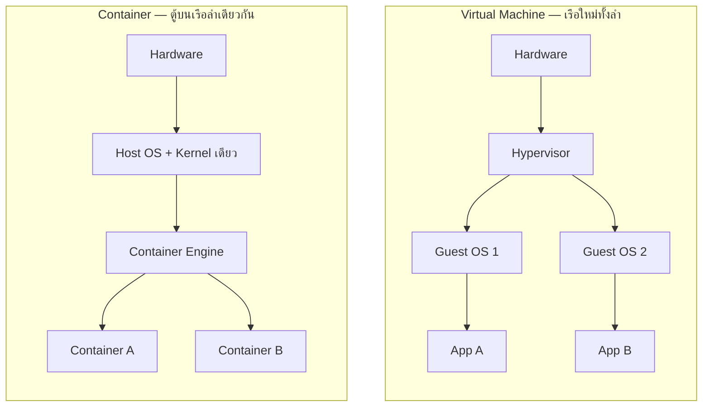
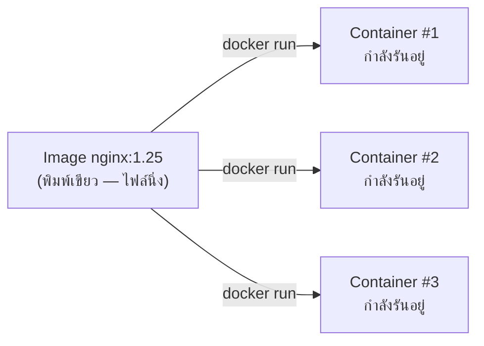

ลองนึกภาพก่อนยุคตู้คอนเทนเนอร์ (container) เดินเรือ — การขนของข้ามประเทศเมื่อ 70 ปีก่อนคือฝันร้าย สินค้าแต่ละอย่างมีรูปทรงไม่เท่ากัน กระสอบข้าว ถังน้ำมัน กล่องผลไม้ ต้องมีคนงานหลายสิบคนมาแบกขึ้นเรือทีละชิ้น ใช้เวลาหลายวันต่อลำ แถมเรือแต่ละลำ ท่าเรือแต่ละแห่ง ก็ต้องมีวิธีจัดการสินค้าแบบไม่เหมือนกัน

จนกระทั่งมีคนคิด**ตู้คอนเทนเนอร์มาตรฐาน** — กล่องเหล็กขนาดเดียวกันทุกใบ ไม่สนใจว่าข้างในจะเป็นอะไร (เสื้อผ้า อะไหล่รถ หรือของเล่นเด็ก) ท่าเรือทุกแห่ง เครนทุกตัว รถบรรทุกทุกคัน ถูกออกแบบให้ยก-วาง-ขนตู้ขนาดมาตรฐานนี้ได้เหมือนกันหมด ของข้างในไม่ต้องแคร์ว่าจะไปลงเรือลำไหน ท่าเรือไหน ขอแค่เป็นตู้มาตรฐานก็พอ

ในโลกซอฟต์แวร์มีปัญหาแบบเดียวกันเป๊ะ — โปรแกรมที่พัฒนาบนเครื่อง developer ทำงานได้ดี แต่พอเอาไป deploy บน server จริงกลับพัง เพราะ server มี OS คนละเวอร์ชัน library คนละรุ่น ปัญหาคลาสสิกที่เรียกกันติดปากว่า "**it works on my machine**" วิธีแก้คือเอาแนวคิดตู้คอนเทนเนอร์มาใช้กับซอฟต์แวร์ เรียกว่า **Container**

## Container คืออะไรกันแน่ (ไม่ใช่ VM)

หลายคนเข้าใจผิดว่า container คือ virtual machine (VM) ย่อส่วน ความจริงคือคนละเรื่องกันเลย

VM จำลอง**ฮาร์ดแวร์ทั้งเครื่อง**ขึ้นมาใหม่ แต่ละ VM มี OS kernel เป็นของตัวเอง เหมือนสร้างเรือทั้งลำใหม่สำหรับสินค้าแต่ละประเภท หนักและช้า แต่แยกขาดจากกันสมบูรณ์แบบ

Container ไม่จำลองฮาร์ดแวร์ ไม่มี OS kernel เป็นของตัวเอง — มันคือ**process ปกติที่ถูกกั้นขอบเขตไว้** (isolated process) ให้มองเห็นแค่ filesystem, network, และ dependency ของตัวเองเท่านั้น แต่ยัง**แชร์ kernel เดียวกันกับเครื่อง host** อยู่ดี เหมือนตู้คอนเทนเนอร์หลายใบวางอยู่บนเรือลำเดียวกัน แยกของกันชัดเจน แต่ใช้เรือ (kernel) ลำเดียวกันขนไปด้วยกัน



จากภาพจะเห็นว่า container ตัดชั้น "Guest OS" ทิ้งไปเลย เหลือแค่ container engine (เช่น Docker) มาคุยกับ kernel ของ host โดยตรง — นี่คือเหตุผลที่ container **เบากว่าและเร็วกว่า VM มาก** เพราะไม่ต้องบูต OS ใหม่ทุกครั้ง

## Image vs Container: พิมพ์เขียว vs ของจริงที่วิ่งอยู่

สองคำนี้มักถูกใช้สลับกันจนสับสน แต่จริงๆ แยกกันชัดเจน

**Image** คือ**พิมพ์เขียว** (blueprint) — ไฟล์ที่ห่อรวม application code, library, environment variable, และทุกอย่างที่โปรแกรมต้องการไว้เป็น layer ซ้อนกัน เหมือนแบบแปลนตู้คอนเทนเนอร์มาตรฐานที่บอกว่า "ตู้นี้ต้องมีอะไรข้างในบ้าง" image เป็น**ไฟล์นิ่งๆ** ไม่ได้ทำงานอะไร แค่เก็บไว้เฉยๆ (มักเก็บใน registry เช่น Docker Hub)

**Container** คือ**ของจริงที่กำลังวิ่งอยู่** (running instance) — เมื่อสั่ง "run" image นั้น ระบบจะสร้าง process ขึ้นมาจริงตาม blueprint นั้น เหมือนเอาแบบแปลนไปสร้างตู้จริงขึ้นมาใช้งาน จาก image เดียวสามารถสร้าง container ได้หลายตัวพร้อมกัน เหมือนแบบแปลนเดียวใช้ผลิตตู้คอนเทนเนอร์ได้เป็นร้อยใบ



## ทำไม Container แก้ปัญหา "Works on My Machine" ได้

ปัญหาเดิมคือ environment ของ developer กับ environment ของ production ไม่เหมือนกัน — เวอร์ชัน library ต่างกัน ตั้งค่า config ต่างกัน

Container แก้ปัญหานี้ตรงจุด เพราะ image ห่อรวม**ทุกอย่างที่โปรแกรมต้องการ**ไว้ในตัวมันเองแล้ว ไม่ว่าจะรันบนเครื่อง developer, server ทดสอบ, หรือ production จริง — ถ้าใช้ image เดียวกัน ก็ได้ environment ที่เหมือนกันทุกประการ เหมือนตู้คอนเทนเนอร์ที่ปิดผนึกจากโรงงานแล้ว ไม่ว่าจะไปลงท่าเรือไหนในโลก ของข้างในก็ยังเหมือนเดิมไม่เปลี่ยนแปลง

## Container vs Virtual Machine

| | Virtual Machine | Container |
|---|---|---|
| ระดับการจำลอง | จำลองฮาร์ดแวร์ทั้งเครื่อง + OS kernel เป็นของตัวเอง | แชร์ kernel เดียวกับ host เป็น process ที่ถูกกั้นขอบเขต |
| เวลา startup | เป็นนาที (ต้องบูต OS ใหม่) | เป็นวินาทีหรือต่ำกว่านั้น |
| ขนาดไฟล์ | หลาย GB (มี OS เต็มรูปแบบ) | หลัก MB ถึงร้อย MB |
| ระดับ isolation | แยกขาดสมบูรณ์ (ปลอดภัยกว่า) | แยกในระดับ process (ปลอดภัยน้อยกว่า VM เล็กน้อย) |
| ความหนาแน่นต่อเครื่อง | รันได้น้อยตัวต่อเครื่อง host | รันได้เยอะกว่ามากบนเครื่องเดียวกัน |
| ใช้เมื่อไหร่ | ต้องการ isolation สูงสุด, รัน OS ต่างชนิดกัน | ต้องการ deploy เร็ว, scale ง่าย, ใช้ resource คุ้มค่า |

```demo
component: ComparisonDiagram
props: {"left":{"title":"Virtual Machine","points":["จำลองฮาร์ดแวร์ + มี Guest OS เป็นของตัวเอง","startup ช้า (เป็นนาที) เพราะต้องบูต OS ใหม่","overhead สูง — กิน RAM/disk เยอะต่อ instance","isolation แน่นหนาที่สุด เหมาะกับ workload ที่ต้องแยกขาดจริงจัง"]},"right":{"title":"Container","points":["แชร์ kernel เดียวกับ host ไม่มี Guest OS","startup เร็ว (วินาทีหรือเร็วกว่า) เพราะไม่ต้องบูต OS","overhead ต่ำ — รันได้หนาแน่นกว่าบนเครื่องเดียวกัน","isolation ระดับ process เพียงพอสำหรับงานส่วนใหญ่"]},"note":"ทีมจริงมักใช้ทั้งคู่ผสมกัน: container วิ่งอยู่ภายใน VM อีกที บน cloud provider ส่วนใหญ่"}
```

## มุมมองตอนสัมภาษณ์

คำถามที่เจอบ่อยคือ "container ปลอดภัยเท่า VM ไหม" คำตอบตรงไปตรงมาคือ**ไม่เท่า** เพราะ container ทุกตัวบนเครื่องเดียวกันยังแชร์ kernel เดียวกันอยู่ ถ้า kernel มีช่องโหว่ ทฤษฎีแล้วมีโอกาสกระทบข้าม container ได้ (ต่างจาก VM ที่แยก kernel กันเด็ดขาด) นี่คือเหตุผลที่ระบบ production จริงจำนวนมากเลือก "รัน container ไว้ภายใน VM อีกชั้นหนึ่ง" — ได้ทั้งความเร็วของ container และ isolation ระดับ VM เป็นเกราะป้องกันสำรอง ไม่ใช่เลือกอย่างใดอย่างหนึ่งเท่านั้น

## ADR ตัวอย่าง

> **Title:** ใช้ Container แทน Bare-metal Deployment สำหรับบริการใหม่
> **Status:** Accepted
> **Context:** ทีมพบปัญหา "works on my machine" บ่อยครั้งเมื่อ deploy บริการจาก environment developer ไปยัง staging/production เพราะเวอร์ชัน library และการตั้งค่าไม่ตรงกัน ทำให้เสียเวลา debug environment แทนที่จะ debug logic จริง
> **Decision:** เปลี่ยนมา build ทุกบริการเป็น container image และ deploy ด้วย image เดียวกันทุก environment ตั้งแต่ dev จนถึง production
> **Consequences:** ลดปัญหา environment ไม่ตรงกันได้เกือบทั้งหมด และ deploy ได้เร็วขึ้นเพราะ startup ของ container เร็วกว่า VM มาก แต่ทีมต้องเรียนรู้เครื่องมือใหม่ (Docker) และต้องวางแผนเรื่อง image registry และ security scanning ของ image เพิ่มเติม
