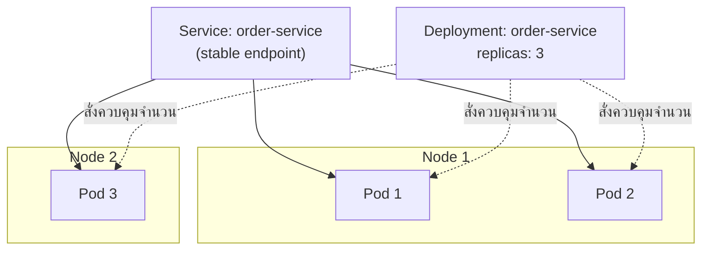

ลองนึกภาพร้านอาหารที่มีสาขาเดียว เจ้าของร้านคุมทุกอย่างเองได้ — พนักงานลาป่วยก็โทรเรียกคนมาแทนเอง ลูกค้าเยอะก็เปิดโต๊ะเพิ่มเอง จัดการเองได้หมดเพราะมีแค่จุดเดียวให้ดู แต่พอร้านขยายเป็น 200 สาขาทั่วประเทศ เจ้าของคนเดียวจะมานั่งเช็คทีละสาขาว่าพนักงานครบไหม ลูกค้าล้นไหม ไม่ได้อีกต่อไปแล้ว — ต้องมี**ระบบกลาง**ที่คอยสั่งการ ตรวจสอบ และจัดการทุกสาขาแทนคน

จากบทที่แล้วเรารู้จัก container ตัวเดียวแล้วว่ามันคืออะไร แต่ระบบจริงในโลก production ไม่ได้มี container ตัวเดียว — มีเป็นร้อยเป็นพันตัว กระจายอยู่บนเครื่อง (node) หลายสิบเครื่อง ถ้าจะมานั่งสั่ง `docker run` ทีละตัวเองด้วยมือ ไม่มีทางจัดการไหว นี่คือปัญหาที่ **Container Orchestration** เข้ามาแก้ โดยเครื่องมือที่ครองตลาดที่สุดคือ **Kubernetes** (มักย่อว่า K8s)

## ทำไมต้องมี Orchestrator

เมื่อมี container จำนวนมากกระจายอยู่หลายเครื่อง จะมีปัญหาที่ต้องจัดการซ้ำๆ อยู่สี่เรื่องหลัก:

1. **Scheduling** — container ตัวใหม่ควรไปวางบนเครื่องไหน เครื่องที่ resource ว่างพอ ไม่ใช่เครื่องที่โหลดเต็มอยู่แล้ว
2. **Restart-on-crash** — container ตายกะทันหันต้องมีคนสร้างใหม่แทนทันที ไม่ใช่รอให้คนมาสังเกตเห็นแล้วค่อยสั่งเอง
3. **Scaling** — โหลดเข้ามาเยอะขึ้นต้องเพิ่มจำนวน container โหลดลดต้องลดจำนวนลง
4. **Service Discovery ระหว่าง container** — container ที่ถูกสร้าง/ทำลายตลอดเวลามี IP เปลี่ยนไปเรื่อยๆ (ปัญหาเดียวกับที่เจอในโมดูล System Design หัวข้อ Service Discovery) ต้องมีกลไกกลางบอกว่า "ตอนนี้ container ของ service ไหนอยู่ที่ไหนบ้าง"

Orchestrator คือระบบกลางที่ทำสี่งานนี้ให้อัตโนมัติ แทนที่ทีมจะต้องมานั่งทำเองด้วยมือทุกครั้ง

## แนวคิดหลักของ Kubernetes (ระดับ concept ไม่ลงลึก API)

Kubernetes มีศัพท์เยอะมาก แต่ในระดับสถาปัตยกรรมสิ่งที่ต้องเข้าใจก่อนมีแค่สามอย่าง:

- **Pod** — หน่วยที่เล็กที่สุดที่ Kubernetes จัดการ ปกติคือ container หนึ่งตัว (หรือกลุ่ม container เล็กๆ ที่ต้องทำงานคู่กันเสมอ) Pod คือ "หน่วยเสิร์ฟอาหารหนึ่งจาน" ไม่ใช่ container เดี่ยวๆ ที่ Kubernetes มองเห็นโดยตรง
- **Deployment** — คำสั่งบอกว่า "อยากมี Pod แบบนี้กี่ตัว" (เช่น "อยากมี Pod ของ order-service 5 ตัวตลอดเวลา") Deployment คอยดูแลให้จำนวน Pod ตรงตามที่สั่งไว้เสมอ ถ้าตัวไหนตายก็สร้างทดแทนอัตโนมัติ
- **Service** — จุดเชื่อมต่อที่มี**IP/ชื่อคงที่** ให้ client เรียกใช้ ทั้งที่ Pod ข้างหลังอาจถูกสร้างใหม่/ทำลายตลอดเวลาจน IP เปลี่ยนไปเรื่อยๆ Service ทำหน้าที่เหมือนเบอร์โทรศัพท์ร้านที่ไม่เปลี่ยน แม้พนักงานรับสายจะเปลี่ยนคนไปเรื่อยๆ ก็ตาม



## ไล่ทีละ step: Pod ตายแล้วเกิดใหม่ยังไง (Self-Healing)

จุดเด่นที่สุดของ orchestrator คือความสามารถ "ซ่อมตัวเองอัตโนมัติ" (self-healing) ลองไล่ทีละขั้นว่าเกิดอะไรขึ้นจริง

```demo
component: StepThroughDiagram
props: {"steps":[{"label":"1. Deployment สั่งให้มี Pod กี่ตัว","detail":"ทีมประกาศไว้ใน Deployment ว่า order-service ต้องมี Pod ทำงานอยู่ 3 ตัวตลอดเวลา (replicas: 3) — นี่คือ 'สภาพที่ต้องการ' (desired state) ไม่ใช่คำสั่งครั้งเดียว แต่เป็นกฎที่ต้องคงไว้ตลอด"},{"label":"2. Kubernetes scheduler วาง Pod ลงเครื่องที่ว่าง","detail":"scheduler เลือกเครื่อง (node) ที่มี CPU/memory เหลือพอ แล้ววาง Pod ทั้ง 3 ตัวกระจายไปตามเครื่องต่างๆ ไม่จำเป็นต้องอยู่เครื่องเดียวกัน"},{"label":"3. Pod ตายกะทันหัน","detail":"เครื่องที่ Pod 2 อยู่เกิด crash หรือตัว process ใน container ล่มกะทันหัน ทำให้เหลือ Pod ทำงานจริงแค่ 2 ตัว ไม่ตรงกับ desired state ที่สั่งไว้ 3 ตัว"},{"label":"4. Kubernetes สร้าง Pod ใหม่แทนอัตโนมัติ (self-healing)","detail":"control loop ของ Kubernetes ตรวจพบว่าจำนวน Pod จริง (2) ไม่ตรงกับที่ต้องการ (3) จึงสั่ง scheduler สร้าง Pod ใหม่แทนทันทีโดยไม่ต้องมีคนมาสั่งเอง — นี่คือหัวใจของคำว่า self-healing"},{"label":"5. Service ทำหน้าที่เป็น stable endpoint ให้ Pod ที่เปลี่ยน IP ตลอด","detail":"ตลอดกระบวนการนี้ client ที่เรียกผ่าน Service ไม่เห็นความเปลี่ยนแปลงเลย เพราะ Service อัปเดตรายชื่อ Pod ที่ยังมีชีวิตอยู่ให้เองอัตโนมัติ ไม่ต้องรู้ IP จริงของ Pod แต่ละตัว"}]}
```

## Orchestration แลกอะไรมา

การมี orchestrator ไม่ได้ฟรี — ต้องแลกความซับซ้อนของระบบมาด้วย

| | ไม่มี Orchestrator (จัดการเอง) | มี Orchestrator (Kubernetes) |
|---|---|---|
| การ deploy | สั่งรัน container ทีละเครื่องด้วยมือ/script เอง | ประกาศ desired state แล้วปล่อยให้ระบบจัดการ |
| Pod ตาย | ต้องมีคนสังเกตแล้วสั่งใหม่เอง | สร้างทดแทนอัตโนมัติทันที |
| Scaling | ต้อง provision เครื่องและรัน container เพิ่มเอง | ปรับตัวเลข replicas แล้วระบบจัดการที่เหลือ |
| ความซับซ้อนของระบบ | ต่ำ เหมาะกับ workload เล็ก | สูง ต้องเรียนรู้ concept เพิ่มเยอะ (Pod, Service, ingress, ฯลฯ) |
| เหมาะกับ | โปรเจกต์เล็ก, container ไม่กี่ตัว | ระบบใหญ่ที่มี service จำนวนมาก ต้อง scale บ่อย |

## มุมมองตอนสัมภาษณ์

คำถามที่เจอบ่อยคือ "ทุกโปรเจกต์ต้องใช้ Kubernetes ไหม" คำตอบคือ**ไม่จำเป็น** — ทีมเล็กที่มี container ไม่กี่ตัว การจัดการ Kubernetes เองอาจสร้างภาระ operational มากกว่าประโยชน์ที่ได้ (ต้องมีคนดูแล cluster, เรียนรู้ concept เยอะ) จุดคุ้มค่าจริงๆ มักเริ่มเมื่อมี service จำนวนมากพอที่การจัดการด้วยมือเริ่มไม่ไหว หรือ traffic ผันผวนจนต้อง scale บ่อยจนทำเองไม่ทัน — คำตอบที่ดีในห้องสัมภาษณ์คือแสดงให้เห็นว่ารู้จัก trade-off นี้ ไม่ใช่ตอบว่า "ต้องใช้ K8s เสมอ"

## ADR ตัวอย่าง

> **Title:** นำ Kubernetes มาใช้จัดการ Container แทนการรันด้วยมือ
> **Status:** Accepted
> **Context:** จำนวน microservice ของทีมเพิ่มจาก 3 เป็น 25 บริการ แต่ละบริการรันหลาย instance กระจายอยู่หลายเครื่อง การ deploy และ restart ด้วยมือเริ่มใช้เวลานานและเกิดความผิดพลาดบ่อยจากการลืม restart instance ที่ตาย
> **Decision:** ย้ายทุกบริการเข้าสู่ Kubernetes cluster ใช้ Deployment ควบคุมจำนวน replica และ Service เป็น stable endpoint ให้แต่ละบริการเรียกกัน
> **Consequences:** ได้ self-healing และ scaling อัตโนมัติ ลดงาน operational ด้วยมือลงมาก แต่ทีมต้องลงทุนเวลาเรียนรู้ Kubernetes concept และต้องมีคนดูแล cluster โดยเฉพาะ ซึ่งเป็นต้นทุนที่ทีมขนาดเล็กมากอาจยังไม่คุ้ม
