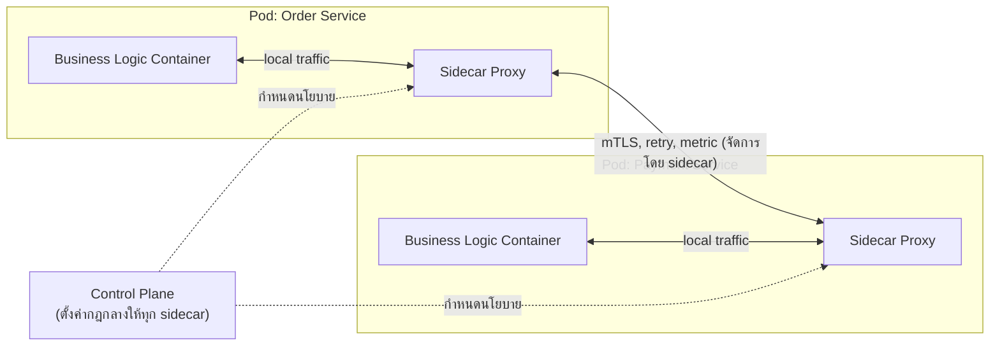

ลองนึกภาพโรงแรมสองแบบ — โรงแรมแบบเก่าที่ทุกห้องต้องมีพนักงานประจำห้องคอยดูแลทุกอย่างเอง ทั้งทำความสะอาด เสิร์ฟอาหาร ซ่อมไฟฟ้า แต่ละห้องต้องฝึกพนักงานให้ทำได้ทุกอย่าง ถ้าจะเปลี่ยนมาตรฐานการทำความสะอาดต้องไปสอนพนักงานทุกห้องใหม่ทีละคน

กับโรงแรมสมัยใหม่ที่แยกแผนกชัดเจน — แผนกแม่บ้านเดินไปทำความสะอาดทุกห้อง แผนกช่างเดินไปซ่อมทุกห้อง ห้องพักแค่โฟกัสหน้าที่หลักของตัวเอง (ให้แขกพัก) ส่วนงานที่ทุกห้องต้องมีเหมือนกัน (ความสะอาด ความปลอดภัย) มีทีมเฉพาะทางมาช่วยจัดการแทน ถ้าจะเปลี่ยนมาตรฐานความสะอาด แค่ไปคุยกับแผนกแม่บ้านแผนกเดียวก็พอ

ระบบซอฟต์แวร์ก็มีปัญหาแบบเดียวกัน — พอย้ายมาใช้ container และ Kubernetes (จากสองบทที่แล้ว) แค่ "รันบน cloud ได้" ยังไม่พอ ต้อง**ออกแบบให้เหมาะกับธรรมชาติของ cloud** ด้วย แนวคิดนี้เรียกว่า **Cloud-Native**

## Cloud-Native ไม่ใช่แค่ "รันบน Cloud"

หลายคนเข้าใจผิดว่า cloud-native แปลว่าแค่เอาโปรแกรมเดิมไปรันบน AWS/GCP/Azure ความจริงคือ cloud-native เป็น**ปรัชญาการออกแบบ** — สร้างระบบให้ใช้ประโยชน์จากธรรมชาติของ cloud ได้เต็มที่ ตั้งแต่แรก ไม่ใช่แค่ยกของเก่าไปวางบนเครื่องคนอื่น

ธรรมชาติของ cloud คือ instance ถูกสร้าง/ทำลายตลอดเวลา (เหมือนที่เห็นใน Kubernetes บทที่แล้ว), เครื่องอาจล่มได้ทุกเมื่อ, และต้อง scale ขึ้น-ลงตามโหลด ระบบที่ออกแบบมาดีสำหรับ cloud-native ต้องรับมือกับความไม่แน่นอนพวกนี้ได้โดยไม่พัง

## 12-Factor App: สรุปหลักการระดับภาพรวม

แนวทางที่ถูกอ้างอิงมากที่สุดคือ **12-Factor App** ซึ่งมีหลักการย่อยหลายข้อ แต่สามข้อที่สำคัญที่สุดในระดับสถาปัตยกรรมคือ:

- **Config ผ่าน Environment Variable** — ค่าที่เปลี่ยนไปตาม environment (database URL, API key) ต้องไม่ hardcode ในโค้ด แต่อ่านจาก environment variable ตอน runtime ทำให้ deploy image เดียวกันไปได้ทั้ง dev/staging/production แค่เปลี่ยนค่า env
- **Stateless Process** — แต่ละ instance ต้องไม่เก็บ state สำคัญไว้ในตัวเอง (เชื่อมกับโมดูล System Design หัวข้อ Stateless Design) เพราะ instance อาจถูกทำลายและสร้างใหม่ได้ตลอดเวลา ถ้าเก็บ state ไว้ในเครื่องเดียว ข้อมูลจะหายทันทีที่ instance นั้นตาย
- **Disposability** — instance ต้อง start เร็วและ shutdown ได้อย่างนุ่มนวล (graceful) เพราะ orchestrator อาจสั่งทำลายและสร้างใหม่บ่อยครั้งเป็นเรื่องปกติ ไม่ใช่เหตุการณ์พิเศษ

หลักการเหล่านี้ทำให้ระบบ "เข้ากับ" ธรรมชาติของ container/Kubernetes ได้จริง ไม่ใช่แค่รันได้แต่พังง่ายเวลาเจอการ scale หรือ restart

## Sidecar Pattern: ผู้ช่วยที่แปะติดไปกับทุกบริการ

กลับมาที่ตัวอย่างโรงแรม — งานที่ทุกห้องต้องมีเหมือนกัน (ความปลอดภัย, การรายงานสถานะ) ไม่ควรให้แต่ละห้องทำเอง ควรมีทีมเฉพาะทางมาช่วย

ในสถาปัตยกรรม container แนวคิดเดียวกันเรียกว่า **Sidecar Pattern** — แทนที่จะให้ business code ของแต่ละ service ต้องเขียนโค้ดจัดการเรื่อง cross-cutting concern เอง (เช่น encryption ระหว่าง service, การเก็บ metric, retry logic) ให้แปะ container ผู้ช่วยตัวเล็กๆ (sidecar) ไว้คู่กับทุก Pod แทน sidecar ทำหน้าที่ดักจับ network traffic เข้า-ออกของ container หลัก แล้วจัดการเรื่องพวกนี้ให้อัตโนมัติ

เมื่อทุก service ในระบบมี sidecar แบบนี้ติดไปด้วย รวมกันเรียกว่า **Service Mesh** — เครือข่ายของ sidecar proxy ที่คุมการสื่อสารระหว่าง service ทั้งหมดในระบบอย่างสม่ำเสมอ ไม่ต้องพึ่งให้แต่ละทีมเขียนโค้ดจัดการเองแยกกัน

## ข้อดี-ข้อเสียของ Sidecar / Service Mesh

| | ไม่มี Sidecar (business code จัดการเอง) | มี Sidecar / Service Mesh |
|---|---|---|
| ความรับผิดชอบของ business code | ต้องเขียน retry, encryption, metric เองในทุก service | โฟกัสแค่ business logic ล้วนๆ |
| ความสม่ำเสมอ | แต่ละทีมอาจทำไม่เหมือนกัน | นโยบายเดียวกันบังคับใช้ทุก service อัตโนมัติ |
| resource overhead | ไม่มี container เพิ่ม | ทุก Pod มี container เสริมกินทรัพยากรเพิ่ม |
| ความซับซ้อนของระบบ | ต่ำกว่า | สูงขึ้น ต้องมี control plane จัดการ sidecar ทั้งหมด |
| จุดที่ต้อง debug เพิ่ม | น้อยกว่า | ต้องเข้าใจทั้ง business code และ sidecar layer เวลามีปัญหา network |

## มุมมองตอนสัมภาษณ์

คำถามที่เจอบ่อยคือ "sidecar ต่างจากการเขียน logic พวกนี้ใส่ shared library ยังไง" จุดต่างสำคัญคือ shared library ต้องถูก compile/import เข้าไปในโค้ดของแต่ละภาษาที่ทีมใช้ (ถ้าทีมใช้ทั้ง Go, Java, Python ต้องมี library แยกสามเวอร์ชัน) แต่ sidecar ทำงานเป็น process แยกต่างหาก ดักจับ network traffic เท่านั้น ไม่สนใจว่า business code เขียนด้วยภาษาอะไร ทำให้บังคับใช้นโยบายเดียวกันได้ข้ามทุกภาษา/ทีม โดยไม่ต้องให้แต่ละทีม maintain library เวอร์ชันของตัวเอง

## ADR ตัวอย่าง

> **Title:** ใช้ Service Mesh (Sidecar Pattern) จัดการ mTLS และ Retry ระหว่าง Service
> **Status:** Accepted
> **Context:** ทีมมี microservice กว่า 15 บริการเขียนด้วยหลายภาษา แต่ละทีมต้อง implement mTLS, retry logic และ metric reporting เองซ้ำๆ ทำให้เกิดความไม่สม่ำเสมอ บางบริการลืมทำ encryption ระหว่าง service
> **Decision:** นำ service mesh มาใช้ โดยแปะ sidecar proxy ไว้ทุก Pod เพื่อจัดการ mTLS, retry, และ metric แบบรวมศูนย์ที่ control plane เดียว แทนที่จะให้แต่ละทีมเขียนเอง
> **Consequences:** business code เบาลงและสอดคล้องกันทุกบริการโดยอัตโนมัติ แต่เพิ่ม resource overhead ต่อ Pod และเพิ่มความซับซ้อนของระบบ ทีมต้องมีคนดูแล control plane ของ service mesh โดยเฉพาะ และต้อง debug เพิ่มอีกชั้นเวลา network มีปัญหา
