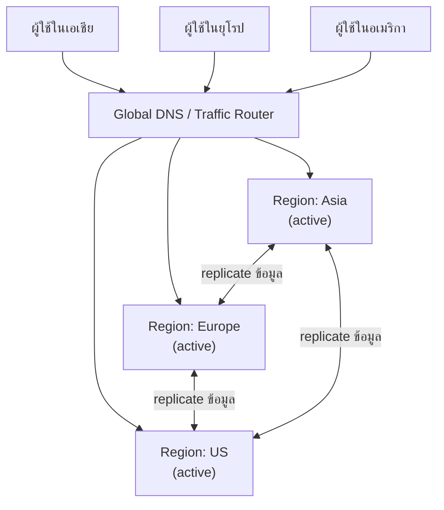

ลองนึกภาพเชนร้านสะดวกซื้อที่มีสาขาเดียวในกรุงเทพฯ ให้บริการทั้งประเทศ — ลูกค้าที่เชียงใหม่ต้องขับรถมาซื้อของถึงกรุงเทพฯ ทุกครั้ง ไกลและช้า แถมถ้าสาขานั้นไฟไหม้ ทั้งประเทศก็ไม่มีร้านให้ซื้อของเลยทันที นี่คือเหตุผลที่เชนใหญ่ๆ ต้องเปิดสาขาหลายจังหวัด — ทั้งเพื่อให้ลูกค้าใกล้บ้านซื้อสะดวก และเพื่อไม่ให้ทั้งธุรกิจพังเพราะสาขาเดียวมีปัญหา

ระบบซอฟต์แวร์ที่มีผู้ใช้ทั่วโลกก็เจอปัญหาเดียวกัน ถ้า data center มีอยู่แค่ที่เดียว (เช่น สิงคโปร์) ผู้ใช้ที่อยู่ยุโรปหรืออเมริกาจะเจอ latency สูงมาก เพราะข้อมูลต้องเดินทางข้ามทวีปทุกครั้ง แถมถ้า region นั้นทั้ง region ล่ม (ไฟดับทั้งศูนย์ข้อมูล, ภัยธรรมชาติ) ระบบก็ล่มทั้งหมดพร้อมกัน นี่คือเหตุผลที่ระบบใหญ่ต้องทำ **Multi-Region Deployment**

## ทำไมต้อง Deploy หลาย Region

มีเหตุผลหลักสองข้อที่แยกจากกันชัดเจน:

1. **Latency สำหรับผู้ใช้ทั่วโลก** — ยิ่งข้อมูลเดินทางไกล ยิ่งช้า การมี region ใกล้ผู้ใช้แต่ละกลุ่มทำให้ response เร็วขึ้นมาก
2. **Disaster Recovery จาก region ทั้งหมดล่ม** — เหตุการณ์ที่ทั้ง region ใช้งานไม่ได้เกิดขึ้นจริง (ไฟดับทั้งศูนย์ข้อมูล, ปัญหาเครือข่ายระดับภูมิภาค) ถ้ามีแค่ region เดียว ระบบทั้งหมดจะล่มพร้อมกันทันที

หัวข้อนี้เป็นแนวคิดเดียวกับที่เจอในโมดูล System Design หัวข้อ **Failover & Redundancy** เรื่อง "ไม่มีจุดไหนควรมีแค่ 1 ชุด" เพียงแต่ยกระดับจาก**เครื่องเดียวในศูนย์ข้อมูลเดียวกัน** ไปเป็น**ทั้ง region ในภูมิศาสตร์ที่ต่างกัน** — หลักการเดิม สเกลที่ใหญ่ขึ้น

## สอง Topology หลัก: Active-Passive vs Active-Active

**Active-Passive** — มี region หลัก (active) รับ traffic จริงทั้งหมด ส่วน region สำรอง (passive) ยืนรอเฉยๆ ไม่รับ traffic จนกว่า region หลักจะล่ม ค่อยสลับไปใช้ region สำรองแทน (คล้าย standby ในบท Failover & Redundancy แต่ระดับ region) ออกแบบง่ายกว่า แต่ region สำรอง "นอนเฉยๆ ไม่ได้ใช้ประโยชน์" ตอนไม่มีปัญหา

**Active-Active** — ทุก region รับ traffic พร้อมกันจริงๆ ตลอดเวลา ผู้ใช้แต่ละคนถูก route ไปยัง region ที่ใกล้ที่สุด ถ้า region ใดล่ม region ที่เหลือรับภาระต่อได้ทันทีโดยไม่ต้อง "สลับ" อะไร ใช้ทรัพยากรคุ้มค่ากว่าเพราะทุก region ทำงานจริง แต่ซับซ้อนกว่ามากในเรื่องการ sync ข้อมูลระหว่าง region



## ปัญหาที่ตามมา: Consistency ข้าม Region คือของจริง

พอมีหลาย region รับเขียนข้อมูลพร้อมกัน (โดยเฉพาะแบบ Active-Active) จะชนกับปัญหาแบบเดียวกับที่เจอในโมดูล System Design หัวข้อ Consistency & CAP ทันที — ถ้าผู้ใช้เอเชียแก้ไขข้อมูลชิ้นหนึ่ง ผู้ใช้ยุโรปที่อ่านข้อมูลเดียวกันในวินาทีถัดมาจะเห็นค่าใหม่ทันทีไหม หรือต้องรอ replicate ข้ามทวีปก่อน? ข้อสังเกตสำคัญคือสถานการณ์นี้ไม่จำเป็นต้องมี network partition เกิดขึ้นเลยด้วยซ้ำ (เครือข่ายเชื่อมต่อกันปกติทุกอย่าง) — นี่คือกรณีของ **PACELC** มากกว่า **CAP theorem** ตรงๆ เพราะ CAP อธิบายแค่ตอนเกิด partition เท่านั้น ส่วน PACELC (ต่อยอดจากโมดูล Consistency & CAP) ครอบคลุมด้วยว่าแม้ไม่มี partition ระบบก็ยังต้องเลือกระหว่าง latency กับ consistency อยู่ดี

ถ้าต้องการ**ความสดใหม่ (consistency) แน่นอน** ทุกครั้งที่เขียนต้องรอ region อื่นยืนยันก่อน (latency สูงขึ้นมาก ข้ามทวีปเป็นสิบ ms ถึงร้อย ms) ถ้ายอมรับ**ความล่าช้าของข้อมูลชั่วคราว** (eventual consistency) จะได้ latency ต่ำกว่ามาก แต่ผู้ใช้ต่าง region อาจเห็นข้อมูลไม่ตรงกันชั่วขณะ — นี่คือ trade-off เดียวกับ PACELC ที่เจอมาแล้ว (ไม่ใช่ CAP theorem ตรงๆ เพราะไม่มี partition) เพียงแค่มาเจอในบริบทของระยะทางข้ามทวีปจริงๆ

## Active-Passive vs Active-Active

| | Active-Passive | Active-Active |
|---|---|---|
| Region สำรองรับ traffic ไหม | ไม่รับ จนกว่า active จะล่ม | รับพร้อมกันทุก region ตลอดเวลา |
| การใช้ทรัพยากร | region สำรองไม่ถูกใช้ประโยชน์เต็มที่ | ทุก region ทำงานจริง คุ้มค่ากว่า |
| ความซับซ้อนของการ sync ข้อมูล | ต่ำกว่า (เขียนทางเดียว แล้ว replicate ไปสำรอง) | สูงกว่ามาก (เขียนได้หลายทาง ต้องจัดการ conflict) |
| Latency ตอนสลับ region เมื่อล่ม | มี downtime ช่วงสั้นๆ ระหว่างสลับ (failover) | แทบไม่มี เพราะ region อื่นรับภาระต่อทันที |
| เหมาะกับ | ระบบที่ต้องการความง่าย ยอมรับ downtime สั้นๆ ได้ | ระบบที่ต้องการ latency ต่ำทั่วโลกและ uptime สูงสุด |

```demo
component: ComparisonDiagram
props: {"left":{"title":"Active-Passive","points":["Region สำรองยืนรอเฉยๆ ไม่รับ traffic จนกว่า active จะล่ม","ออกแบบและ sync ข้อมูลง่ายกว่า","มี downtime สั้นๆ ช่วง failover สลับ region"]},"right":{"title":"Active-Active","points":["ทุก region รับ traffic จริงพร้อมกันตลอดเวลา","ใช้ทรัพยากรคุ้มค่ากว่า ไม่มี region ที่นอนเฉยๆ","ต้องจัดการ data consistency ข้าม region ที่ซับซ้อนกว่ามาก (เชื่อมกับ PACELC ไม่ใช่ CAP theorem ตรงๆ เพราะไม่มี partition)"]},"note":"เชื่อมกับโมดูล Reliability หัวข้อ Failover & Redundancy (แนวคิดเดียวกัน ยกระดับจากเครื่องเดียวเป็นทั้ง region) และโมดูล Consistency & CAP (PACELC)"}
```

## มุมมองตอนสัมภาษณ์

คำถามที่เจอบ่อยคือ "ระบบทุกตัวควรทำ Active-Active ทั่วโลกไหม" คำตอบตรงไปตรงมาคือ**ไม่ใช่เสมอไป** — Active-Active แลกความซับซ้อนของการจัดการ consistency ข้ามทวีปมาด้วย ซึ่งมีต้นทุนสูงทั้งด้าน engineering และ operational ระบบส่วนใหญ่ที่ผู้ใช้กระจุกตัวอยู่ภูมิภาคเดียวและยอมรับ downtime สั้นๆ ได้ มักเลือก Active-Passive ที่ง่ายกว่าและเพียงพอ ส่วน Active-Active จะคุ้มค่าจริงๆ เมื่อผู้ใช้กระจายทั่วโลกจริงและ downtime มีค่าเสียหายมหาศาลจนต้องแลกความซับซ้อนมาด้วย

## ADR ตัวอย่าง

> **Title:** เลือก Active-Passive แทน Active-Active สำหรับ Multi-Region Deployment รอบแรก
> **Status:** Accepted
> **Context:** ผู้ใช้ของระบบกว่า 90% อยู่ในภูมิภาคเอเชียตะวันออกเฉียงใต้ แต่ทีมต้องการแผนสำรองกรณี region หลักล่มทั้งหมด โดยยังไม่มีความจำเป็นเร่งด่วนเรื่อง latency ต่ำในภูมิภาคอื่น
> **Decision:** deploy แบบ Active-Passive — region หลักในสิงคโปร์รับ traffic ทั้งหมด และมี region สำรองในภูมิภาคใกล้เคียงพร้อม replicate ข้อมูลแบบ asynchronous ไว้สลับใช้เมื่อ region หลักล่ม
> **Consequences:** ได้ disaster recovery พื้นฐานโดยไม่ต้องแบกรับความซับซ้อนของการจัดการ conflict จากการเขียนข้อมูลพร้อมกันหลาย region แลกกับการมี downtime สั้นๆ ช่วง failover และทรัพยากรของ region สำรองไม่ถูกใช้ประโยชน์เต็มที่ในสภาวะปกติ
