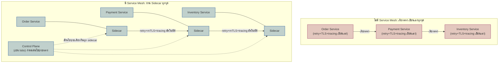

ลองนึกภาพบริษัทข้ามชาติที่มีพนักงานติดต่อข้ามสาขากันตลอดเวลา ถ้าปล่อยให้พนักงานแต่ละคนต้องเรียนภาษาสาขาอื่นเอง พกบัตรพิสูจน์ตัวตนไปโชว์เองทุกครั้งที่คุยกับคนสาขาอื่น แถมต้องจดบันทึกการสนทนาเองด้วย งานหลักที่ควรโฟกัสจริงๆ จะถูกแบ่งเวลาไปกับงานซ้ำซ้อนพวกนี้จนหมด ทางที่ฉลาดกว่าคือจ้างล่ามส่วนตัวประจำพนักงานทุกคน คอยแปลภาษา ตรวจบัตร และจดบันทึกแทนให้ โดยพนักงานแค่พูดภาษาตัวเองตามปกติแล้วปล่อยให้ล่ามจัดการส่วนที่เหลือให้เหมือนกันทุกคน

จากบทที่แล้วเรารู้จัก Kubernetes ในฐานะระบบกลางที่จัดการ scheduling, self-healing และ scaling ของ container แต่ Kubernetes ไม่ได้จัดการเรื่อง "การสื่อสารระหว่าง service" ให้เลย — พอระบบมี microservice เป็นสิบเป็นร้อยตัวคุยกันเองผ่าน network ภายใน คำถามคือใครจะจัดการเรื่อง retry เวลา call ล้มเหลว, การเข้ารหัสข้อมูลระหว่างทาง, และการเก็บ metric ว่า call ไหนช้า — นี่คือช่องว่างที่ <mark class="hl-term">**Service Mesh**</mark> เข้ามาเติม โดยทำหน้าที่เป็นชั้น infrastructure ที่จัดการการสื่อสารระหว่าง service ทั้งหมดแทน โดยไม่ต้องแก้โค้ด application เลย

## ปัญหา: Cross-Cutting Concern ที่ถูกเขียนซ้ำในทุก Service

ลองนึกดูว่าทีม order-service, payment-service และ inventory-service ต่างคนต่างต้องเขียนโค้ดจัดการเรื่องเดียวกันซ้ำๆ กันเอง — retry เวลา call เพื่อนบ้านล้มเหลว, ตั้ง timeout ไม่ให้รอค้างตลอดไป, เข้ารหัสข้อมูลระหว่าง service ด้วยกันเอง, และส่ง metric/trace ออกไปให้ทีม observability ดู เรื่องพวกนี้เรียกว่า cross-cutting concern เพราะไม่ใช่ business logic ของ service ไหนโดยเฉพาะ แต่ทุก service ต้องมีเหมือนกันหมด

ปัญหาคือแต่ละทีมมักเขียนใช้ library คนละตัว ตั้งค่า retry คนละแบบ บางทีมลืมใส่ timeout ไปเลย พอเกิดปัญหาความปลอดภัยหรือต้องอัปเดต policy กลาง (เช่นเปลี่ยนอัลกอริทึม encryption) ก็ต้องไล่แก้โค้ดทีละ service ทีละภาษาโปรแกรมมิ่ง ซึ่งช้าและมีจุดที่พลาดได้ง่าย

## Sidecar Proxy: ให้ Proxy ข้างตัวจัดการแทน

วิธีแก้ที่ mesh ใช้คือ <mark class="hl-term">**Sidecar Proxy**</mark> — proxy ตัวเล็กๆ (ที่นิยมที่สุดคือ Envoy) ถูกรันเป็น container เพิ่มอีกตัวใน Pod เดียวกันกับ container ของ service ทุกตัว (คล้ายรถ motorcycle sidecar ที่ติดไปกับตัวรถหลัก) sidecar นี้ดัก**ทุก**การเชื่อมต่อ network ที่เข้าและออกจาก service นั้น ไม่ว่า service จะเขียนด้วยภาษาอะไรก็ตาม

โค้ดของ application เองไม่รู้ด้วยซ้ำว่ามี sidecar อยู่ — แค่ยิง request ออกไปตามปกติเหมือนเรียก service อื่นตรงๆ sidecar จะดักจับ เข้ารหัส ใส่ retry policy และเก็บ metric ให้เองทั้งหมดอย่างโปร่งใส (transparent) ทีมพัฒนาจึงไม่ต้องเขียน retry logic หรือจัดการ TLS certificate เองในโค้ดอีกต่อไป



<mark class="hl-insight">แก่นของแนวคิดนี้คือย้าย cross-cutting concern ออกจากโค้ด application ไปไว้ที่ชั้น infrastructure แล้วให้ control plane บังคับ policy เดียวกันกับทุก sidecar จากจุดศูนย์กลาง แทนที่จะปล่อยให้แต่ละทีมเขียนเองแบบต่างคนต่างทำ</mark>

## mTLS: พิสูจน์ตัวตนสองทางระหว่าง Service ทุกครั้งที่คุยกัน

เมื่อ sidecar ดักทุก connection ได้แล้ว มันสามารถบังคับให้ทุกการเชื่อมต่อระหว่าง service เข้ารหัสด้วย <mark class="hl-term">**mTLS (Mutual TLS)**</mark> — ต่างจาก TLS ทั่วไปที่มีแค่ server พิสูจน์ตัวตนให้ client เชื่อ (เช่นเว็บ HTTPS ทั่วไป) mTLS บังคับให้พิสูจน์ตัวตน**ทั้งสองฝั่ง** ทั้งฝั่งเรียกและฝั่งถูกเรียกต้องแสดง certificate ยืนยันว่าตัวเองเป็นใครจริง ก่อนจะแลกข้อมูลกันได้ sidecar เป็นคนจัดการออก certificate, หมุนเวียน (rotate) certificate และทำ handshake ให้อัตโนมัติ ไม่ต้องมีใครไปจัดการ certificate ด้วยมือทีละ service

หลักการ "ไม่เชื่อใครโดยอัตโนมัติแม้จะอยู่ใน network เดียวกัน" นี้เป็นส่วนหนึ่งของแนวคิดใหญ่กว่าที่เรียกว่า Zero Trust Architecture ซึ่งจะอธิบายละเอียดในโมดูล Security

## Traffic Shaping: ความสามารถที่ Control Plane ให้มาฟรี

เพราะ traffic ทั้งหมดไหลผ่าน sidecar อยู่แล้ว control plane ของ mesh จึงสั่งควบคุมเส้นทาง traffic ได้โดยไม่ต้องแตะโค้ด application เลยสักบรรทัด เช่น canary release (ปล่อย version ใหม่รับ traffic แค่ 5% ก่อน ถ้าไม่มี error ค่อยเพิ่มสัดส่วน) หรือ weighted routing (แบ่ง traffic ระหว่างสอง version ตามสัดส่วนที่กำหนด) ทีมแค่ประกาศ policy ที่ control plane แล้ว sidecar ทุกตัวจะทำตามพร้อมกันทันที

<mark class="hl-insight">ความสามารถนี้คือของแถมที่ได้มาฟรีเมื่อ traffic ถูกดักผ่าน sidecar อยู่แล้ว — ถ้าไม่มี mesh การทำ canary หรือ weighted routing ต้องเขียน logic แบ่ง traffic เองในทุก service ที่ต้องการความสามารถนี้</mark>

## แลกอะไรมา: Latency เพิ่ม กับ Control Plane ที่ต้องดูแลเอง

การมี sidecar คั่นทุกการเชื่อมต่อไม่ได้ฟรี — ทุก call ที่เคยยิงตรงจาก service หนึ่งไปอีก service หนึ่ง ตอนนี้ต้องผ่าน hop เพิ่มอย่างน้อยสองจุด (sidecar ฝั่งต้นทางกับฝั่งปลายทาง) เพิ่ม latency ทุก call แม้จะเล็กน้อยต่อครั้งแต่สะสมได้เยอะในระบบที่มี call chain ยาว

<mark class="hl-warning">ยิ่งไปกว่านั้น mesh เองก็เป็นระบบ distributed system อีกชุดหนึ่งที่ต้องมีคนดูแล — control plane อย่าง Istio ต้อง deploy, monitor และ upgrade เองเหมือนระบบอื่นๆ ถ้า control plane มีปัญหา sidecar ทุกตัวในคลัสเตอร์อาจได้รับผลกระทบพร้อมกัน</mark> การนำ mesh เข้ามาจึงไม่ใช่แค่ติดตั้งแล้วจบ แต่คือการรับภาระ operational เพิ่มอีกระบบหนึ่งเข้ามาถาวร

```demo
component: StepThroughDiagram
props: {"steps":[{"label":"1. Order Service เรียก Payment Service ผ่าน localhost","detail":"โค้ดของ Order Service ไม่รู้จัก mTLS หรือ retry logic เลย แค่ยิง request ไปที่ localhost (sidecar ของตัวเอง) เหมือนเรียก service ปกติทั่วไป"},{"label":"2. Sidecar ดักจับ traffic ทั้งหมดโดยอัตโนมัติ","detail":"Envoy sidecar ที่รันอยู่ pod เดียวกันดักจับ request นี้ผ่าน network rule โดยอัตโนมัติ ไม่ต้องแก้โค้ด application แม้แต่บรรทัดเดียว"},{"label":"3. Sidecar ทั้งสองฝั่งเจรจา mTLS กัน","detail":"sidecar ของ Order Service และ Payment Service แลก certificate พิสูจน์ตัวตนซึ่งกันและกันก่อนส่งข้อมูลจริง ถ้าฝั่งใดพิสูจน์ตัวตนไม่ผ่าน request ถูกปฏิเสธทันที"},{"label":"4. Control Plane สั่งนโยบาย routing ให้ sidecar","detail":"control plane บอก sidecar ว่า Payment Service เวอร์ชัน v2 กำลังทำ canary รับ traffic แค่ 10% request นี้ถูกสุ่มส่งไปตามน้ำหนักที่กำหนดไว้"},{"label":"5. Sidecar retry ให้เองถ้า call ล้มเหลว","detail":"เมื่อ timeout เกิดขึ้น sidecar จัดการ retry ตาม policy ที่ตั้งไว้ เช่น retry 3 ครั้งแบบ exponential backoff โดย Order Service ไม่รู้เลยว่ามี retry เกิดขึ้นเบื้องหลัง"},{"label":"6. Sidecar ส่ง metric และ trace ออกไปเอง","detail":"latency, error rate และ trace span ของ call นี้ถูกส่งออกไปยัง observability platform โดยอัตโนมัติ ไม่ต้องเขียน instrumentation code เพิ่มในทั้งสอง service"}]}
```

| | ไม่มี Service Mesh | มี Service Mesh |
|---|---|---|
| Retry / Timeout | เขียนเองในทุก service ไม่สม่ำเสมอ | sidecar จัดการให้ policy เดียวกันทุกที่ |
| mTLS | ต้องจัดการ certificate เองทีละ service | sidecar ออก/หมุนเวียน certificate อัตโนมัติ |
| Canary / Weighted routing | ต้องเขียน logic แบ่ง traffic เอง | ประกาศ policy ที่ control plane จุดเดียว |
| Latency | เรียกตรงไม่มี hop เพิ่ม | เพิ่ม hop ผ่าน sidecar ทุกครั้ง |
| ภาระ operational | ไม่มีระบบ mesh ให้ดูแล | ต้อง deploy/monitor/upgrade control plane เอง |

## มุมมองตอนสัมภาษณ์งาน

คำถามสัมภาษณ์: "ทีมอยากติดตั้ง Istio เพราะเห็นบริษัทใหญ่ใช้กัน ควรทำเลยไหม" คำตอบระดับ surface คือ "ใช่ ติดเลย ได้ mTLS กับ traffic control ฟรี" ซึ่งมองข้ามต้นทุน คำตอบระดับ senior ต้องชี้ root cause ก่อนว่าปัญหาที่แท้จริงคืออะไร — ถ้าระบบมี service แค่ไม่กี่ตัว การเขียน retry/timeout เองในแต่ละ service ยังจัดการไหว ต้นทุนของการเรียนรู้และดูแล control plane ของ mesh (รวมถึง latency ที่เพิ่มทุก call) อาจสูงกว่าประโยชน์ที่ได้ จุดที่ mesh คุ้มค่าจริงๆ คือเมื่อจำนวน service เยอะพอที่ความไม่สม่ำเสมอของ cross-cutting concern เองกลายเป็นปัญหาใหญ่กว่าภาระ operational ของการรัน mesh

## ADR ตัวอย่าง

> **Title:** นำ Service Mesh (Istio) มาใช้จัดการ mTLS และ Traffic Shaping ระหว่าง Microservice
> **Status:** Accepted
> **Context:** ระบบมี microservice เพิ่มขึ้นเป็น 40 บริการ แต่ละทีมเขียน retry logic และจัดการ TLS certificate เองไม่สม่ำเสมอกัน เคยเกิดเหตุ certificate หมดอายุโดยไม่มีใครรู้จนบริการหยุดทำงาน และทีมไม่มีวิธีทำ canary release ที่เป็นมาตรฐานเดียวกัน
> **Decision:** ติดตั้ง Istio เป็น service mesh ให้ sidecar (Envoy) จัดการ mTLS, retry และ traffic routing ระหว่างทุก service แทนการเขียนแยกในแต่ละทีม
> **Consequences:** certificate หมุนเวียนอัตโนมัติและ policy การ retry สม่ำเสมอทั่วทั้งระบบ ทำ canary release ได้โดยไม่ต้องแก้โค้ด แต่ต้องมีทีมดูแล control plane ของ Istio โดยเฉพาะ และทุก call ระหว่าง service มี latency เพิ่มขึ้นจากการผ่าน sidecar ซึ่งต้องยอมรับเป็นต้นทุนถาวร
