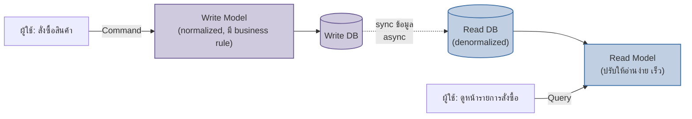

ลองนึกภาพครัวของร้านอาหารกับป้ายเมนูที่แขวนอยู่หน้าร้าน สองอย่างนี้ "พูดถึงอาหารจานเดียวกัน" แต่ถูกออกแบบมาเพื่อคนละวัตถุประสงค์กันโดยสิ้นเชิง

ในครัว เชฟต้องมีสูตรที่ละเอียดยิบ — ต้มน้ำซุปกี่ชั่วโมง ใส่เครื่องปรุงตามลำดับไหน อุณหภูมิเท่าไหร่ ห้ามข้ามขั้นตอนไหนเด็ดขาดเพราะจะกระทบรสชาติหรือความปลอดภัยของอาหาร สูตรนี้ซับซ้อน เป๊ะ และต้อง "ถูกต้อง" เป็นอันดับหนึ่ง ส่วนป้ายเมนูหน้าร้านไม่มีใครอยากอ่านสูตรแบบนั้น ลูกค้าอยากเห็นแค่ชื่อจาน รูปสวยๆ ราคา แล้วตัดสินใจสั่งได้เร็วที่สุด ป้ายเมนูถูกออกแบบมาเพื่อ "อ่านง่าย ตัดสินใจไว" ไม่ใช่เพื่อ "ทำอาหารได้ถูกต้อง"

ระบบซอฟต์แวร์จำนวนมากพยายามใช้ **โมเดลข้อมูลเดียว** ทำหน้าที่ทั้งสองอย่างนี้พร้อมกัน — ทั้งรับคำสั่งเปลี่ยนแปลงข้อมูล (เหมือนสูตรอาหารในครัว) และแสดงผลให้คนอ่าน (เหมือนป้ายเมนู) ซึ่งใช้งานได้ในระบบเล็กๆ แต่พอระบบโตขึ้น ความต้องการสองฝั่งนี้เริ่มขัดกันเอง โมเดลที่ normalize สุดๆ เพื่อรักษาความถูกต้องของข้อมูล (ไม่มีข้อมูลซ้ำซ้อน) กลับทำให้ query หน้าจอที่ต้อง join หลายตารางช้าลงเรื่อยๆ นี่คือจุดเริ่มต้นของแนวคิด <mark class="hl-term">**CQRS (Command Query Responsibility Segregation)**</mark> — แยกโมเดลที่ใช้ "เขียน" ข้อมูล ออกจากโมเดลที่ใช้ "อ่าน" ข้อมูล ให้เป็นคนละส่วนกันอย่างชัดเจน

## Command กับ Query คือคนละหน้าที่กัน

CQRS มาจากหลักการที่กว้างกว่าคือ **Command-Query Separation (CQS)** ที่บอกว่า method หนึ่งควรทำหน้าที่อย่างใดอย่างหนึ่งเท่านั้น — **Command** คือการสั่งเปลี่ยนแปลง state (เช่น "สร้าง order ใหม่", "อัปเดตที่อยู่จัดส่ง") ไม่คืนค่าข้อมูลกลับมา แค่บอกว่าสำเร็จหรือไม่ ส่วน **Query** คือการอ่านข้อมูล ไม่เปลี่ยนแปลง state ใดๆ เลย CQRS ยกระดับหลักการนี้จาก method เดี่ยวๆ ขึ้นไปเป็นระดับสถาปัตยกรรมทั้งระบบ — ไม่ใช่แค่แยก method แต่แยก**โมเดลข้อมูลทั้งชุด** ที่อยู่เบื้องหลัง command กับ query ออกจากกัน

ฝั่ง <mark class="hl-term">**Write Model**</mark> (เหมือนสูตรอาหารในครัว) ถูกออกแบบมาเพื่อความถูกต้อง — เก็บข้อมูลแบบ normalize เพื่อไม่ให้เกิดข้อมูลขัดแย้งกัน มี business rule คอยตรวจสอบก่อนบันทึกทุกครั้ง (เช่น "ห้ามสั่งของเกิน stock ที่มี") โครงสร้างตารางออกแบบรอบ "การเปลี่ยนแปลง" ไม่ใช่รอบ "การแสดงผล" ส่วนฝั่ง **Read Model** (เหมือนป้ายเมนู) ถูกออกแบบมาเพื่อความเร็วในการอ่าน — denormalize ข้อมูลไว้ล่วงหน้าให้พร้อมแสดงผลทันที ไม่ต้อง join หลายตาราง อาจเก็บในรูปแบบหรือแม้แต่ฐานข้อมูลคนละชนิดกับฝั่ง write เลยก็ได้ (เช่น write ใช้ PostgreSQL เพื่อความถูกต้อง แต่ read ใช้ Elasticsearch เพื่อค้นหาเร็ว)

สังเกตลูกศรระหว่าง Write DB กับ Read DB — นี่คือจุดสำคัญที่สุดของ CQRS: ข้อมูลไม่ได้อยู่ที่เดียวแล้วอ่าน-เขียนสลับกัน แต่ฝั่ง write บันทึกก่อน แล้ว<mark class="hl-insight">**ค่อย sync ข้อมูลไปอัปเดต read model ทีหลัง**</mark> ซึ่งมักเป็นแบบ asynchronous นั่นแปลว่ามีช่วงเวลาสั้นๆ ที่ read model ยังไม่เห็นข้อมูลล่าสุด (eventual consistency) — เชฟเพิ่งปรุงจานใหม่เสร็จ แต่ป้ายเมนูหน้าร้านยังไม่ทันอัปเดตราคาใหม่ในวินาทีนั้นเป๊ะ

## ไม่จำเป็นต้องแยกฐานข้อมูลเสมอไป

CQRS มีได้หลายระดับความเข้มข้น ไม่ใช่ทุกระบบต้องแยกฐานข้อมูลคนละตัวทันที ระดับที่เบาที่สุดคือแยกแค่ **class/query object** ฝั่ง read กับ write ในโค้ด แต่ยังใช้ตารางเดียวกันในฐานข้อมูลเดียวกัน — แค่เขียน query แยกเฉพาะสำหรับหน้าจอที่ต้องการ ไม่ผ่าน business logic layer ฝั่ง write เลย ระดับถัดมาคือแยกเป็นคนละ view/materialized view ในฐานข้อมูลเดียวกัน และระดับที่เข้มข้นสุดคือแยกเป็นคนละฐานข้อมูล คนละ service กันไปเลย พร้อมกลไก sync ข้อมูลแบบ event-driven — ยิ่งเข้มข้นมากยิ่งได้ประสิทธิภาพและความยืดหยุ่นมากขึ้น แต่ก็ยิ่งซับซ้อนและมี eventual consistency ที่ต้องจัดการมากขึ้นตามไปด้วย

| มิติ | Write Model | Read Model |
|---|---|---|
| เป้าหมายหลัก | ความถูกต้อง (correctness) | ความเร็วในการอ่าน (performance) |
| รูปแบบข้อมูล | Normalized ลด redundancy | Denormalized ปรับให้พร้อมแสดงผล |
| มี business rule ตรวจสอบไหม | มี ตรวจก่อนบันทึกทุกครั้ง | ไม่มี แค่อ่านสิ่งที่มีอยู่แล้ว |
| Scale แยกกันได้ไหม | scale ตามปริมาณ write | scale ตามปริมาณ read (มักสูงกว่ามาก) |
| ตัวอย่าง technology | RDBMS transactional | Elasticsearch, Redis, read replica, materialized view |

## ทำไมต้องแยก แล้วได้อะไรกลับมา

เหตุผลหลักที่ทำให้ CQRS คุ้มค่าคือระบบจริงส่วนใหญ่มี**อัตราส่วนการอ่านต่อการเขียนที่เหลื่อมกันมาก** — เว็บอีคอมเมิร์ซอาจมีคนดูสินค้า (read) มากกว่าคนสั่งซื้อจริง (write) เป็นร้อยเท่า ถ้าใช้โมเดลเดียวกันทั้งคู่ การ scale ฝั่ง read (ที่รับภาระหนักกว่ามาก) จะไปดึงฝั่ง write ให้ scale ตามโดยไม่จำเป็น พอแยกกัน จะ scale read model ออกไปกี่ instance ก็ได้อิสระ โดยไม่กระทบความถูกต้องของฝั่ง write เลย นอกจากนี้ยังเปิดทางให้ออกแบบ read model ได้อิสระเต็มที่ตามหน้าจอที่ต้องการ โดยไม่ต้องบิดโครงสร้างตารางฝั่ง write ให้เสียความถูกต้องเพื่อรองรับการแสดงผล

## มุมมองตอนสัมภาษณ์งาน

คำถามสัมภาษณ์ที่มักตามมาหลัง "รู้จัก CQRS ไหม" คือ "แล้วเมื่อไหร่ควรใช้จริง" คำตอบที่ดีไม่ใช่ท่องนิยาม Command/Query แต่ต้องชี้สัญญาณจริงที่บอกว่าถึงเวลาแล้ว เช่น อัตราส่วน read/write เหลื่อมกันมาก หรือหน้าจอต้องการ shape ข้อมูลต่างกันมากจากข้อมูลชุดเดียวกัน — <mark class="hl-warning">ถ้าระบบยังเล็กและ query ปัจจุบันยังเร็วพอ การแยก Write/Read Model ตั้งแต่วันแรกมีแต่เพิ่มความซับซ้อนโดยไม่จำเป็น</mark>

## ADR ตัวอย่าง

> **Title:** แยก Read Model ออกจาก Write Model สำหรับหน้ารายการสินค้า
> **Status:** Accepted
> **Context:** หน้ารายการสินค้าต้องรองรับ traffic การอ่านสูงกว่าการสั่งซื้อจริงหลายสิบเท่า แต่ query ปัจจุบัน join ตาราง normalized 6 ตารางทุกครั้ง ทำให้ response ช้าเมื่อ traffic สูง
> **Decision:** สร้าง read model แยกต่างหาก (denormalized, เก็บใน read replica) sync ข้อมูลจาก write model แบบ asynchronous ผ่าน event เมื่อสินค้าเปลี่ยนแปลง หน้ารายการสินค้าอ่านจาก read model นี้เท่านั้น
> **Consequences:** หน้ารายการสินค้าเร็วขึ้นมาก และ scale read replica แยกจาก write DB ได้อิสระ แต่ต้องยอมรับว่าข้อมูลสินค้าที่เพิ่งเปลี่ยนอาจไม่แสดงผลทันทีในหน้ารายการ (eventual consistency ระดับวินาที) และทีมต้องดูแล pipeline sync ข้อมูลเพิ่มเติมที่ไม่เคยมีมาก่อน
