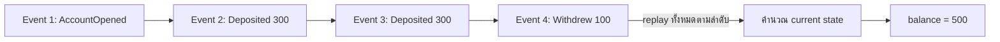

ลองนึกภาพสมุดบัญชีธนาคารเล่มเก่าที่เจ้าหน้าที่จดด้วยหมึกทุกธุรกรรม — "ฝาก 300 บาท", "ฝาก 300 บาท อีกครั้ง", "ถอน 100 บาท" เรียงกันเป็นบรรทัดๆ ไม่มีบรรทัดไหนบอกตรงๆ ว่า "ยอดคงเหลือตอนนี้คือ 500 บาท" เลยสักบรรทัด แต่ถ้าอยากรู้ยอดคงเหลือ แค่**บวกลบทุกบรรทัดตั้งแต่ต้นเล่ม**ก็ได้คำตอบที่ถูกต้องเสมอ และที่สำคัญกว่านั้นคือห้ามใครลบหรือแก้บรรทัดเก่าเด็ดขาด ถ้าจดผิดต้องขีดฆ่าแล้วจดรายการแก้ไขใหม่ต่อท้ายเท่านั้น

นี่คือแก่นของแนวคิด <mark class="hl-term">**Event Sourcing**</mark> — แทนที่จะเก็บ "สถานะปัจจุบัน" ของข้อมูล (เช่น คอลัมน์ `balance = 500` ในตาราง) ที่ถูกเขียนทับทุกครั้งที่เปลี่ยนแปลง (เหมือนลบเลขเก่าแล้วเขียนเลขใหม่ทับ) เราเก็บ**ลำดับเหตุการณ์ทั้งหมด**ที่เกิดขึ้น (`Deposited(300)`, `Deposited(300)`, `Withdrew(100)`) ไว้แบบ append-only ห้ามแก้ไขหรือลบ แล้วค่อยคำนวณสถานะปัจจุบันจากการ**เล่นเหตุการณ์ทั้งหมดซ้ำ** (replay) ตั้งแต่ต้น — สมุดบัญชี (event log) คือ **source of truth** ตัวจริง <mark class="hl-insight">ส่วนยอดคงเหลือที่เห็นในแอปเป็นแค่ผลลัพธ์ที่คำนวณ (derived) มาจากมันอีกที ไม่ใช่ความจริงตั้งต้น</mark>

## Event Store คือแหล่งความจริงเดียว

ระบบทั่วไปที่ไม่ใช้ event sourcing เก็บข้อมูลแบบ "current state" — ทุกครั้งที่มีการเปลี่ยนแปลง แถวข้อมูลเดิมถูก `UPDATE` ทับ ประวัติความเป็นมาก่อนหน้าหายไปตลอดกาล รู้แค่ว่า "ตอนนี้เป็นอะไร" แต่ไม่รู้ว่า "ทำไมถึงมาเป็นแบบนี้" ส่วน Event Sourcing เก็บทุกการเปลี่ยนแปลงเป็น **event** แยกกันในที่เก็บที่เรียกว่า <mark class="hl-term">**Event Store**</mark> ซึ่งมีคุณสมบัติสำคัญคือ append-only (เขียนได้อย่างเดียว ห้าม update/delete) เรียงตามลำดับเวลาเสมอ



แนวคิดนี้เชื่อมโยงตรงกับ case study **Core Banking / Ledger** ซึ่งเป็น capstone ท้ายหลักสูตร System Architecture นี้เอง (โมดูล Case Studies) — ledger แบบ double-entry ที่ห้ามแก้ไขหรือลบรายการเก่า ก็คือรูปแบบหนึ่งของ event sourcing ในทางปฏิบัติอยู่แล้ว บทนั้นจะเน้นมุมมองเรื่อง consistency (ต่อยอดจาก CAP Theorem ของ System Design) ส่วนบทนี้เจาะลึกกลไกเบื้องหลังว่า "การเก็บ event แล้ว derive state" ทำงานยังไงในฐานะ pattern ที่ใช้ได้กว้างกว่าแค่ระบบธนาคาร

## Replay กับ Snapshot

การคำนวณ current state ด้วยการ replay event ทั้งหมดตั้งแต่ต้นใช้ได้ดีตอน event ยังมีไม่มาก แต่ลองนึกภาพบัญชีที่มีธุรกรรมสะสมมาหลายปี เป็นหมื่นเป็นแสน event — <mark class="hl-warning">ทุกครั้งที่ต้องรู้ยอดคงเหลือ แล้วต้องไล่อ่านและบวกลบเป็นแสนบรรทัดใหม่ทุกรอบ ย่อมช้าเกินจะรับได้</mark> วิธีแก้คือ **Snapshot** — จดยอดสรุป ณ จุดใดจุดหนึ่งไว้เป็นระยะ (เช่นทุก 1,000 event) เวลาต้องการ current state ก็แค่โหลด snapshot ล่าสุด แล้ว replay เฉพาะ event ที่เกิดขึ้น**หลัง**จาก snapshot นั้นเท่านั้น เหมือนสมุดบัญชีที่มีหน้าสรุปยอดต้นเดือนคั่นไว้ ไม่ต้องเปิดย้อนกลับไปอ่านทุกบรรทัดตั้งแต่เปิดบัญชีครั้งแรก

```demo
component: StepThroughDiagram
props: {"steps":[{"label":"1. Event ถูก append: Deposited 300","detail":"ธุรกรรมฝากเงิน 300 บาทถูกบันทึกเป็น event ใหม่ต่อท้าย event log เดิม ไม่มีการแก้ไขบรรทัดเก่าใดๆ ทั้งสิ้น"},{"label":"2. Event ถูก append อีกครั้ง: Withdrew 100","detail":"ธุรกรรมถอนเงิน 100 บาทถูกบันทึกเป็น event ใหม่อีกบรรทัด event log ตอนนี้มี 2 บรรทัดเรียงตามเวลา"},{"label":"3. ต้องการ current state → Replay event ทั้งหมด","detail":"ระบบไล่อ่าน event ทีละบรรทัดตามลำดับ แล้วคำนวณผลสะสม: เริ่มจาก 0 บวก 300 ลบ 100 = เหลือ 200 บาท นี่คือ state ที่ 'derive' มาจาก event ไม่ใช่ค่าที่เก็บตรงๆ"},{"label":"4. เวลาผ่านไป event สะสมนับหมื่นรายการ","detail":"ถ้ายังต้อง replay ตั้งแต่บรรทัดแรกทุกครั้ง จะช้าลงเรื่อยๆ ตามจำนวน event ที่เพิ่มขึ้น กลายเป็นคอขวดด้าน performance"},{"label":"5. แก้ด้วย Snapshot: จดยอดสรุปเป็นระยะ","detail":"ระบบบันทึก snapshot ของ state ณ จุดหนึ่ง (เช่นทุก 1,000 event) เวลาต้องการ current state ครั้งถัดไป แค่โหลด snapshot ล่าสุด แล้ว replay เฉพาะ event ที่เกิดหลังจากนั้น ไม่ต้องไล่ตั้งแต่ต้นอีก"}]}
```

## ประโยชน์ที่ตามมาโดยธรรมชาติ

เพราะ event ทุกอันถูกเก็บถาวรและเรียงลำดับเวลาไว้ Event Sourcing จึงให้ **audit trail แบบสมบูรณ์** มาโดยไม่ต้องออกแบบเพิ่มเติมเลย — รู้ได้เสมอว่า "ใครทำอะไร เมื่อไหร่ ตามลำดับไหน" ซึ่งสำคัญมากในโดเมนที่ต้อง compliance เช่นการเงินหรือสุขภาพ นอกจากนี้ยังทำ **time travel** ได้ตามธรรมชาติ — อยากรู้ state ณ เวลาใดในอดีต ก็แค่ replay event จนถึงจุดเวลานั้นแล้วหยุด ไม่ต้องมีกลไกพิเศษแยกต่างหาก

| ประเด็น | เก็บแบบ Current State (ทั่วไป) | เก็บแบบ Event Sourcing |
|---|---|---|
| สิ่งที่เก็บจริง | ค่าล่าสุด (ถูกเขียนทับทุกครั้ง) | ลำดับเหตุการณ์ทั้งหมด (append-only) |
| ประวัติย้อนหลัง | หายไปเมื่อถูก update ทับ | มีครบ ตรวจสอบย้อนหลังได้เสมอ |
| การอ่าน state ปัจจุบัน | อ่านตรงๆ เร็วทันที | ต้อง replay หรือใช้ snapshot ช่วย |
| Audit / compliance | ต้องออกแบบ log แยกต่างหากเอง | ได้มาโดยธรรมชาติจากโครงสร้าง |
| ความซับซ้อนของระบบ | ต่ำ เข้าใจง่าย | สูงกว่า ต้องจัดการ replay/snapshot |

## มุมมองตอนสัมภาษณ์งาน

คำถามสัมภาษณ์ที่พบบ่อย: "Event Sourcing ต่างจากการทำ audit log ธรรมดายังไง" คำตอบที่ดีคือชี้ความต่างที่แก่นกลาง — audit log ทั่วไปเป็นแค่บันทึกเสริมที่วางขนานไปกับ current state ตัวจริงซึ่งยังอยู่ในตาราง ถ้า log กับ state ไม่ตรงกันก็แค่ log ผิด แต่ Event Sourcing ทำให้ event log **กลายเป็น** source of truth ตัวจริงเพียงหนึ่งเดียว ไม่มี current state เก็บแยกต่างหากเลย มีแต่ค่าที่ derive/cache มาจาก event log อีกที

## ADR ตัวอย่าง

> **Title:** ใช้ Event Sourcing สำหรับ Wallet Service แทนการเก็บ current balance ตรงๆ
> **Status:** Accepted
> **Context:** ทีม compliance ต้องการ audit trail ที่พิสูจน์ได้ว่ายอดเงินคงเหลือมาจากธุรกรรมอะไรบ้างตามลำดับเวลา และเคยมีเคสที่ debug ปัญหายอดเงินผิดพลาดได้ยากเพราะไม่มีประวัติว่า balance เปลี่ยนจากอะไรมาเป็นอะไร
> **Decision:** เก็บทุกธุรกรรม (deposit, withdraw) เป็น event แบบ append-only ใน Event Store แทนการ `UPDATE` คอลัมน์ balance ตรงๆ และคำนวณ current balance จากการ replay event พร้อมทำ snapshot ทุก 500 event เพื่อควบคุมเวลา replay
> **Consequences:** ได้ audit trail และ time-travel debugging มาโดยธรรมชาติ ตรวจสอบย้อนหลังได้ทุกรายการ แต่ทีมต้องเรียนรู้วิธีออกแบบและจัดการ snapshot เพิ่มเติม และ query ที่ต้องการแค่ "ยอดปัจจุบัน" ซับซ้อนกว่าการ `SELECT` ตรงๆ แบบเดิม
