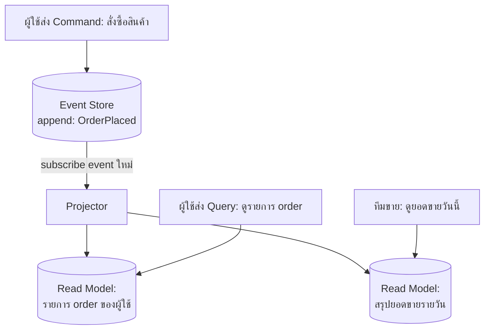

กลับไปที่ร้านอาหารในบทแรก — สมมติว่าครัวเปลี่ยนวิธีทำงานใหม่ ไม่ได้แค่ทำอาหารแล้วจบ แต่เชฟเขียน**บันทึกทุกขั้นตอนที่ทำจริง**ไว้เป็นลำดับ ("หั่นหมู", "ผัดกระเทียม", "ใส่ซอส", "จานเสร็จ") ทีนี้พนักงานหน้าร้านที่ทำป้ายเมนูไม่ต้องเดินเข้าไปถามเชฟทุกครั้งว่าจานนี้มีอะไรบ้าง แค่**อ่านบันทึกขั้นตอนที่เชฟจดไว้** แล้วสรุปออกมาเป็นป้ายเมนูสวยๆ เองได้เลย แถมถ้าวันหนึ่งอยากทำป้ายเมนูแบบใหม่ (เช่น ป้ายที่โชว์ปริมาณแคลอรี่) ก็แค่**อ่านบันทึกเก่าทั้งหมดใหม่อีกรอบ**แล้วสรุปออกมาเป็นป้ายรูปแบบใหม่ ไม่ต้องไปรบกวนเชฟหรือครัวเลย

นี่คือภาพของการเอา **CQRS** (บทที่ 1) มาผสมกับ **Event Sourcing** (บทที่ 2) — สองแนวคิดนี้เป็นอิสระจากกัน ใช้ CQRS โดยไม่มี event sourcing ก็ได้ ใช้ event sourcing โดยไม่มี CQRS ก็ได้ แต่ในทางปฏิบัติมักถูกจับคู่กันเสมอ เพราะแต่ละอย่างแก้ปัญหาที่อีกฝั่งทิ้งไว้พอดี

## เมื่อ Event Store กลายเป็นฝั่ง Write และ Projection กลายเป็นฝั่ง Read

ฝั่ง **write** ใช้ event sourcing เต็มรูปแบบ — เมื่อมี command เข้ามา (เช่น "สั่งซื้อสินค้า") ระบบตรวจสอบ business rule แล้ว **append event** ใหม่ลง Event Store (`OrderPlaced`) ไม่ได้ query อ่านจาก event store นี้โดยตรงเพื่อแสดงผลหน้าจอเลย เพราะ event store ถูกออกแบบมาเพื่อบันทึกความจริงตามลำดับเวลา ไม่ใช่เพื่ออ่านแบบ query ซับซ้อนได้เร็ว

ส่วนฝั่ง **read** มี process แยกต่างหากเรียกว่า **Projector** (บางที่เรียก Event Handler หรือ Subscriber) คอย **subscribe** ฟัง event ใหม่ๆ ที่ถูก append เข้า Event Store แล้วนำมาสร้างหรืออัปเดต **Read Model / Projection** — ตารางหรือ view ที่ denormalize พร้อมแสดงผลทันที Query ทุกอันจากฝั่งผู้ใช้จะอ่านจาก Read Model นี้เท่านั้น ไม่แตะ Event Store โดยตรง

สังเกตว่า Projector สามารถสร้าง Read Model ได้**หลายชุดพร้อมกัน**จาก event ชุดเดียวกัน — RM1 ตอบโจทย์หน้าจอ "รายการ order ของฉัน" ส่วน RM2 ตอบโจทย์หน้าจอ "สรุปยอดขายรายวัน" ทั้งสองอ่านจาก event stream เดียวกัน (`OrderPlaced`) แต่สรุปออกมาคนละรูปแบบตามที่แต่ละหน้าจอต้องการ

## พลังพิเศษ: สร้าง Read Model ใหม่ย้อนหลังได้เสมอ

นี่คือจุดที่การผสมสองแนวคิดนี้เข้าด้วยกันให้ประโยชน์ที่มากกว่าการใช้แยกกัน — เพราะ Event Store เก็บ**ประวัติทั้งหมดแบบสมบูรณ์**ไว้ตั้งแต่ event แรก เมื่อใดที่ทีมต้องการ Read Model รูปแบบใหม่ที่ไม่เคยมีมาก่อน (เช่น อยู่ๆ ฝ่ายการตลาดอยากได้หน้าจอ "สินค้าที่ถูกยกเลิกบ่อยที่สุดในแต่ละเดือน" ที่ไม่เคยคิดไว้ตอนออกแบบระบบครั้งแรก) ไม่ต้องไปรื้อฝั่ง write หรือขอข้อมูลจากที่ไหนใหม่เลย แค่เขียน Projector ตัวใหม่ แล้ว**replay event ทั้งหมดตั้งแต่ต้น**ผ่าน projector ตัวนั้น ก็จะได้ Read Model ใหม่ที่ถูกต้องครบถ้วนทันที — เหมือนพนักงานหน้าร้านเปิดสมุดบันทึกขั้นตอนของเชฟทั้งเล่มย้อนหลัง แล้วสรุปทำป้ายเมนูแบบใหม่ขึ้นมาได้เองโดยไม่ต้องรบกวนครัวเลย

ถ้าเป็นระบบที่เก็บแค่ current state (ไม่มี event sourcing) การสร้าง read model รูปแบบใหม่ย้อนหลังแบบนี้แทบเป็นไปไม่ได้ เพราะข้อมูลในอดีตถูกเขียนทับหายไปแล้ว รู้ได้แค่ "ตอนนี้เป็นยังไง" ไม่รู้ "อดีตเคยเป็นยังไง" — นี่คือเหตุผลที่ CQRS กับ Event Sourcing มักถูกใช้ร่วมกันในระบบที่คาดว่าความต้องการด้าน reporting/analytics จะเปลี่ยนแปลงบ่อยในอนาคต

| ประเด็น | ใช้ CQRS อย่างเดียว (ไม่มี Event Sourcing) | ใช้ CQRS + Event Sourcing ร่วมกัน |
|---|---|---|
| แหล่งข้อมูลต้นทาง (write) | Current state ปกติ (ถูกเขียนทับ) | Event log แบบ append-only |
| Sync ไป read model | มักอ่านจาก write DB โดยตรงแล้วแปลง | Projector subscribe event แล้วสร้าง projection |
| สร้าง read model รูปแบบใหม่ย้อนหลัง | ทำได้จำกัด เพราะประวัติเก่าอาจหายไปแล้ว | ทำได้เต็มที่ ด้วยการ replay event ทั้งหมด |
| Audit trail | ต้องออกแบบแยกต่างหาก | ได้มาโดยธรรมชาติจาก event log |
| ความซับซ้อนรวม | ปานกลาง | สูงกว่า ต้องดูแลทั้ง event store และ projector |

## มุมมองตอนสัมภาษณ์งาน

คำถามสัมภาษณ์: "ทำไมต้องใช้ CQRS กับ Event Sourcing คู่กัน ใช้แค่อย่างใดอย่างหนึ่งไม่ได้เหรอ" คำตอบที่ดีคือชี้ว่าแต่ละอย่างแก้ปัญหาคนละจุดที่เติมเต็มกันพอดี — Event Sourcing แก้ปัญหา "จะเก็บความจริงระยะยาวยังไงให้ไม่มีวันหาย" ส่วน CQRS แก้ปัญหา "จะให้แต่ละหน้าจออ่านข้อมูลได้เร็วและตรงความต้องการยังไง" ใช้ Event Sourcing อย่างเดียวโดยไม่มี CQRS ก็ได้ (query ตรงจาก event store แล้ว fold เอง ซึ่งช้า) ใช้ CQRS อย่างเดียวโดยไม่มี Event Sourcing ก็ได้ (แค่แยก read/write model จาก current-state DB ปกติ) แต่การจับคู่กันคือจุดที่ได้ประโยชน์สูงสุด

## ADR ตัวอย่าง

> **Title:** ใช้ Event Sourcing เป็นฝั่ง Write และ Projection เป็นฝั่ง Read สำหรับ Order Service
> **Status:** Accepted
> **Context:** ทีมคาดว่าฝ่ายธุรกิจจะขอหน้าจอ reporting รูปแบบใหม่จาก order data บ่อยขึ้นเรื่อยๆ ในอนาคต และต้องการ audit trail ที่ตรวจสอบได้ว่า order แต่ละใบผ่านสถานะอะไรมาบ้าง
> **Decision:** ให้ command ทั้งหมดใน Order Service append event ลง Event Store โดยตรง แล้วสร้าง Projector แยกต่างหากที่ subscribe event เหล่านั้นเพื่อ build Read Model หลายชุดตามแต่ละหน้าจอ query ทั้งหมดอ่านจาก Read Model เท่านั้น ไม่แตะ Event Store
> **Consequences:** เมื่อฝ่ายธุรกิจขอ read model รูปแบบใหม่ ทีมเขียน projector ใหม่แล้ว replay event ประวัติทั้งหมดได้ทันทีโดยไม่ต้องรื้อฝั่ง write แต่ต้องแลกกับความซับซ้อนที่เพิ่มขึ้น ทั้งการดูแล event schema versioning และ eventual consistency ระหว่างเวลาที่ event ถูก append กับเวลาที่ projection อัปเดตเสร็จ
