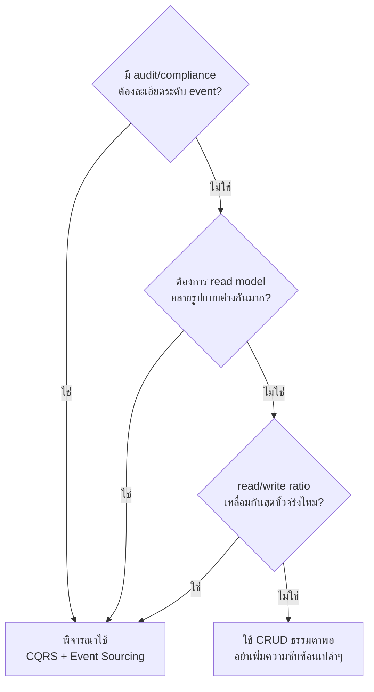

ลองนึกภาพทีมงานที่เพิ่งไปฟังสัมมนาเรื่อง event sourcing มา แล้วกลับมาตัดสินใจเอาไปใช้กับระบบจัดการ "รายชื่อพนักงาน" ของบริษัทตัวเอง — ระบบที่มีแค่ CRUD ธรรมดา เพิ่ม-ลบ-แก้ไข-ดูข้อมูลพนักงาน ไม่มี business rule ซับซ้อน ไม่มีใครต้องการ audit trail ระดับ event-by-event ผลลัพธ์คือทีมต้องมานั่งดูแล event store, projector, snapshot ทั้งที่งานจริงคือแค่ตาราง `employees` ตารางเดียวก็พอ นี่คือตัวอย่างคลาสสิกของการ**ใช้ pattern ที่ทรงพลังผิดที่ผิดเวลา** — ทรงพลังไม่ได้แปลว่าควรใช้ทุกที่

CQRS และ Event Sourcing ไม่ใช่ของฟรี ทุกประโยชน์ที่ได้มาในสองบทก่อนหน้ามาพร้อมต้นทุนที่ต้องจ่ายจริง คำถามสำคัญที่สุดของบทนี้ไม่ใช่ "ทำยังไง" (สองบทก่อนตอบไปแล้ว) แต่คือ **"ควรใช้เมื่อไหร่ และไม่ควรใช้เมื่อไหร่"**

## ต้นทุนที่ต้องจ่ายจริง

**Eventual Consistency** คือต้นทุนแรกและสำคัญที่สุด — เพราะ write กับ read แยกโมเดลกัน (และในกรณี event sourcing ยังมี projector คั่นกลางอีกชั้น) มีช่วงเวลาสั้นๆ เสมอที่สิ่งที่เพิ่ง write ไปยังไม่ปรากฏในฝั่ง read ผู้ใช้ที่กด "บันทึก" แล้วรีเฟรชหน้าทันทีอาจยังไม่เห็นข้อมูลใหม่ ทีมต้องออกแบบ UX รองรับสถานการณ์นี้ (เช่น optimistic UI) ซึ่งเพิ่มความซับซ้อนที่ไม่เคยต้องคิดมาก่อนตอนใช้โมเดลเดียว

**ส่วนประกอบเพิ่มขึ้น** — จากเดิมมีแค่ database เดียว กลายเป็นต้องมี write store, read store, กลไก sync/projector, และในกรณี event sourcing ยังมี snapshot mechanism อีก แต่ละส่วนคือจุดที่อาจพังได้ และต้อง monitor, deploy, debug แยกกัน

**Debug ยากขึ้น** — เมื่อ read model แสดงข้อมูลผิด ต้องไล่หาว่าปัญหาอยู่ที่ event ที่ append ผิด, projector ที่ประมวลผลผิด, หรือ read model ที่ query ผิด ไม่ใช่แค่เปิด debugger ดู query เดียวจบเหมือนระบบ CRUD ธรรมดา

**เส้นโค้งการเรียนรู้สูง** — ทีมที่ไม่เคยทำงานกับ event sourcing มาก่อนต้องปรับ mental model ใหม่ทั้งหมด ตั้งแต่การคิดเป็น "เหตุการณ์ที่เกิดขึ้น" แทนที่จะเป็น "สถานะปัจจุบัน" ไปจนถึงการจัดการ event schema versioning เมื่อ business logic เปลี่ยนไป

## เมื่อไหร่ที่ต้นทุนนี้คุ้มค่า

ต้นทุนข้างต้นคุ้มค่าเมื่อระบบมีลักษณะอย่างน้อยหนึ่งในนี้ชัดเจน — โดเมนที่มีข้อกำหนดด้าน **audit/compliance** เข้มงวด (การเงิน, สุขภาพ, กฎหมาย) ที่ต้องพิสูจน์ได้ว่าเกิดอะไรขึ้นตามลำดับเวลาจริง, ระบบที่ต้องการ **read model หลายรูปแบบที่แตกต่างกันมาก** จากข้อมูลชุดเดียวกัน (เช่น dashboard วิเคราะห์, หน้าค้นหา, API สำหรับ mobile ที่ต้องการ shape คนละแบบ), หรือระบบที่มี **อัตราส่วน read/write เหลื่อมกันสุดขั้ว** จนต้อง scale สองฝั่งแยกอิสระจากกันจริงๆ ไม่ใช่แค่ "อาจจะต้องการในอนาคต"

```demo
component: ComparisonDiagram
props: {"left":{"title":"เหมาะกับ CQRS/Event Sourcing","points":["โดเมนต้อง audit trail ละเอียดตามกฎหมาย เช่น ธุรกรรมการเงิน เวชระเบียน","ต้องการ read model หลายรูปแบบต่างกันมากจากข้อมูลชุดเดียวกัน เช่น dashboard, ค้นหา, mobile API","อัตราส่วน read/write ต่างกันมาก ต้อง scale สองฝั่งอิสระกันจริงจัง","Business rule ฝั่ง write ซับซ้อนและเปลี่ยนบ่อย ต้องการแยกจาก concern ของการแสดงผล"]},"right":{"title":"ไม่เหมาะ ใช้ CRUD ธรรมดาพอ","points":["ระบบ CRUD พื้นฐาน ไม่มี business rule ซับซ้อน เช่น รายชื่อพนักงาน ตั้งค่าระบบ","ไม่มีใครต้องการ audit trail ระดับ event-by-event","Traffic น้อย โมเดลเดียวรองรับได้สบายอยู่แล้ว ไม่มีปัญหาต้อง scale แยก","ทีมยังไม่มีประสบการณ์กับ eventual consistency และ distributed system"]},"note":"หลักการ: เพิ่มความซับซ้อนของสถาปัตยกรรมได้ก็ต่อเมื่อมันแก้ปัญหาจริงที่มีอยู่ ไม่ใช่เพราะ pattern นี้ฟังดูทันสมัย"}
```



## ตารางเปรียบเทียบ

| ประเด็น | CRUD ธรรมดา | CQRS + Event Sourcing |
|---|---|---|
| ความซับซ้อนเริ่มต้น | ต่ำ ตั้งระบบเร็ว | สูง ต้องออกแบบหลายส่วน |
| Consistency | Strong (อ่าน-เขียนที่เดียวกัน) | Eventual (มี delay ระหว่าง write/read) |
| Audit trail | ต้องออกแบบเพิ่มเอง | ได้มาโดยธรรมชาติ |
| ความยืดหยุ่นของ read model | จำกัด ผูกกับโครงสร้าง write | สร้างใหม่ย้อนหลังได้อิสระ |
| ต้นทุน operation/debug | ต่ำ | สูงกว่ามาก ต้อง monitor หลายส่วน |
| เหมาะกับทีม | ทีมเล็ก/ระบบไม่ซับซ้อน | ทีมมีประสบการณ์ distributed system |

## มุมมองตอนสัมภาษณ์งาน

คำถามสัมภาษณ์ที่ทดสอบวุฒิภาวะได้ดีที่สุดในหัวข้อนี้คือ "เคยพิจารณาใช้ CQRS/Event Sourcing แล้วตัดสินใจไม่ใช้บ้างไหม เพราะอะไร" คำตอบที่ดีที่สุดไม่ใช่การท่องข้อดีของ pattern แต่คือการแสดงว่ารู้ต้นทุนจริงและเคยตัดสินใจ "ไม่ใช้" อย่างมีเหตุผลด้วย — เหมือน ADR ตัวอย่างท้ายบทนี้ ไม่ใช่ใช้ pattern ทันสมัยทุกที่เพียงเพราะมันฟังดูดี

## ADR ตัวอย่าง

> **Title:** ไม่ใช้ CQRS/Event Sourcing สำหรับ Internal Admin Tool จัดการรายชื่อพนักงาน
> **Status:** Accepted
> **Context:** ทีมพิจารณานำ CQRS + Event Sourcing มาใช้กับระบบจัดการรายชื่อพนักงานภายในหลังไปฟังสัมมนา แต่ระบบนี้เป็น CRUD ธรรมดา ไม่มี business rule ซับซ้อน ไม่มีข้อกำหนด audit ระดับ event และมีผู้ใช้งานภายในไม่ถึง 50 คน
> **Decision:** ใช้สถาปัตยกรรม CRUD ปกติกับตารางเดียว ไม่แยก read/write model และไม่ใช้ event store
> **Consequences:** ทีมพัฒนาและดูแลระบบได้เร็วและง่าย ไม่ต้องแบกรับ eventual consistency หรือ operational overhead ที่ไม่จำเป็น หากในอนาคตมีความต้องการ audit trail ละเอียดหรือ read model หลายรูปแบบเกิดขึ้นจริง ค่อยพิจารณา CQRS ใหม่ตามความต้องการที่ชัดเจนในตอนนั้น ไม่ใช่เผื่อไว้ล่วงหน้า
