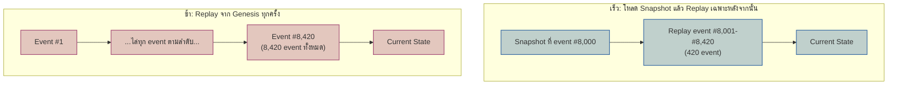

ลองนึกภาพห้องสมุดเก็บเอกสารราชการที่รับเรื่องมาต่อเนื่องเจ็ดสิบปี แบบฟอร์มยุคแรกไม่มีช่องกรอก "เลขประจำตัวผู้เสียภาษี" เพราะตอนนั้นยังไม่มีระบบนี้ บรรณารักษ์แก้ปัญหาด้วยการไม่ไปฉีกแก้เอกสารเก่า แต่เขียนคู่มือแนบไว้ว่า "ถ้าเจอฟอร์มแบบเก่า ให้ตีความว่าช่องนี้ว่าง" แทน และเมื่อมีคนมาถามยอดเอกสารสะสมทั้งหมด บรรณารักษ์ก็ไม่นับใหม่จากฉบับแรกทุกครั้ง เพราะมีบันทึกสรุปยอด ณ สิ้นปีล่าสุดคั่นเล่มไว้อยู่แล้ว

ระบบที่ใช้ Event Sourcing (จากบทที่แล้ว) แล้วรันอยู่ใน production มาหลายปีจะเจอปัญหาคู่แฝดแบบเดียวกันนี้เป๊ะๆ ปัญหาแรกคือ <mark class="hl-term">**Event Versioning**</mark> — จัดการยังไงเมื่อ "รูปร่าง" (shape) ของ event type ต้องเปลี่ยนไป ทั้งที่ event เก่านับล้านตัวที่เก็บไว้แล้วยังเป็นรูปร่างเดิม และแก้ไขไม่ได้เพราะ event store เป็น append-only ปัญหาที่สองคือการทำ snapshot ให้ลึกพอจะใช้งานได้จริงในสเกลที่ event สะสมเป็นล้านตัว ไม่ใช่แค่แนวคิดผิวเผินที่เคยพูดถึง — สองปัญหานี้ไม่โผล่มาตอนเริ่มเขียนระบบ แต่โผล่มาหลังระบบรันไปแล้วหลายปีจนเริ่มเจ็บจริง

## ปัญหาที่ 1: Event Versioning — เปลี่ยนรูปร่าง Event ที่บันทึกไปแล้วไม่ได้

สมมติระบบ e-commerce เก็บ event `OrderPlaced` มาสามปี วันหนึ่งฝ่ายภาษีต้องการให้ทุก order มี `taxId` (เลขประจำตัวผู้เสียภาษี) เป็นฟิลด์บังคับ ทีมเขียนโค้ดเพิ่มฟิลด์นี้ใน `OrderPlaced` ตัวใหม่ได้ไม่ยาก แต่ event `OrderPlaced` เก่าหลายล้านตัวที่นอนอยู่ใน event store ตั้งแต่ก่อนมีฟิลด์นี้ ไม่มีทางย้อนไปเติม `taxId` ให้มันได้ — จะ `UPDATE` เข้าไปตรงๆ ก็ผิดหลัก append-only ตั้งแต่ต้น จะลบทิ้งแล้วเขียนใหม่ก็เท่ากับปลอมแปลงประวัติ ผลคือ consumer ทุกตัวที่ deserialize event `OrderPlaced` ต้องรับมือกับความจริงที่ว่า "event เก่ากับ event ใหม่ไม่ได้มีรูปร่างเดียวกัน" ไปตลอดกาล

## ทางแก้: Upcasting กับ Weak Schema Evolution

ทางแก้แรกคือ <mark class="hl-term">**Upcasting**</mark> — เขียนฟังก์ชัน transform ที่แปลง event รูปร่างเก่าให้กลายเป็นรูปร่างใหม่ ณ ตอน**อ่าน**เท่านั้น ไม่แตะ byte ที่เก็บอยู่จริงในสตอเรจเลยสักตัว เช่น เจอ `OrderPlaced` เวอร์ชัน 1 (ไม่มี `taxId`) ตัว upcaster ก็เติม `taxId: null` หรือค่า default ให้ก่อนส่งต่อให้ consumer เห็นเป็นเวอร์ชัน 2 เสมอ ถ้ามีการเปลี่ยน shape หลายรอบ ก็ต่อ upcaster เป็น chain (v1→v2→v3→...) ให้ event เก่าที่สุดก็ยังไล่แปลงมาถึงเวอร์ชันปัจจุบันได้ <mark class="hl-insight">หัวใจของ upcasting คือ event ที่บันทึกไปแล้วคืออดีตที่เปลี่ยนไม่ได้ สิ่งที่เปลี่ยนได้มีแค่วิธีตีความอดีตตอนอ่านมันขึ้นมาใหม่เท่านั้น</mark>

ทางแก้ที่สองคือ <mark class="hl-term">**Weak Schema Evolution**</mark> — ตั้งกฎให้ทีมทำตามตั้งแต่ต้น: การแก้ event type ในอนาคตทำได้แค่ "เพิ่มฟิลด์ใหม่แบบ optional" เท่านั้น ห้ามลบฟิลด์เดิม ห้ามเปลี่ยนชื่อ ห้ามเปลี่ยน type เดิม ผลคือ event เก่าที่ไม่มีฟิลด์ใหม่ ก็ยัง deserialize ผ่าน schema ใหม่ได้ตรงๆ โดยฟิลด์ที่ไม่มีก็แค่เป็นค่าว่าง ไม่ต้องเขียนโค้ด transform เพิ่มเลยสักบรรทัด — แลกมาด้วยวินัยระดับทีมที่ต้องสูงมาก เพราะแค่มีใครคนหนึ่ง rename field ผิดกฎครั้งเดียว event เก่าทั้งหมดก็ deserialize ผิดทันที

```demo
component: ComparisonDiagram
props: {"left":{"title":"Upcasting","points":["เขียน transform function แปลง event เก่า → รูปร่างใหม่ตอนอ่าน","event ที่เก็บจริงไม่ถูกแตะเลย ยังเป็น byte เดิมตลอดไป","รองรับการเปลี่ยนแบบรุนแรงได้ เช่น ลบ/เปลี่ยนชื่อฟิลด์","ต้นทุน: ต้องดูแลโค้ด upcaster ของทุก shape เก่าตลอดไป"]},"right":{"title":"Weak Schema Evolution","points":["ตั้งกฎ: แก้ event type ได้แค่เพิ่มฟิลด์ optional เท่านั้น","event เก่า deserialize ผ่าน schema ใหม่ได้ตรงๆ ไม่ต้อง transform","ไม่รองรับการลบ/rename ฟิลด์ — ทำแล้ว event เก่าพังทันที","ต้นทุน: ต้องมีวินัยทีมสูง ผิดกฎครั้งเดียวกระทบ event เก่าทั้งหมด"]},"note":"เลือกจากคำถามเดียว: การเปลี่ยนแปลงที่ต้องการรุนแรงแค่ไหน — แค่เพิ่มฟิลด์ใหม่ ใช้ Weak Schema Evolution พอ แต่ถ้าต้องลบ/เปลี่ยนชื่อ/แยก event เป็นสองตัว ต้องมี Upcasting เท่านั้น"}
```

## ปัญหาที่ 2: Snapshotting เมื่อ Event Log โตจน Replay จากศูนย์ไม่ไหว

บทที่แล้วแนะนำแนวคิด snapshot ไว้คร่าวๆ ว่า "จดยอดสรุปเป็นระยะ" แต่ในระบบจริงที่ aggregate เดียวสะสม event เป็นแสนเป็นล้านตัว (เช่นบัญชีที่ใช้งานทุกวันมาสิบปี) การทำ snapshot ให้ใช้งานได้จริงต้องตอบคำถามเพิ่มอีกสามข้อ คือเก็บ snapshot ไว้ที่ไหน จะ snapshot ถี่แค่ไหน และจะรู้ได้ยังไงว่า snapshot ที่โหลดมายังถูกต้อง

Snapshot ปกติเก็บใน store แยกต่างหากจาก event log ตัวจริง โดย key ด้วย aggregate id คู่กับเลข version ของ event ล่าสุดที่ snapshot นั้นครอบคลุมถึง เวลาต้องการ current state ระบบจะ query หา snapshot ล่าสุดของ aggregate นั้นก่อน แล้ว replay เฉพาะ event ที่มี version มากกว่า version ใน snapshot เท่านั้น ความถี่ในการ snapshot เป็น trade-off ตรงไปตรงมา — snapshot ถี่เกินไปกินพื้นที่เก็บข้อมูลเปล่าประโยชน์ (state ไม่ได้เปลี่ยนเยอะระหว่างสอง snapshot) ส่วน snapshot ห่างเกินไปก็แทบไม่ช่วยลดเวลา replay เลย ทีมส่วนใหญ่เริ่มจากกฎง่ายๆ อย่าง "ทุก N event" แล้วค่อยปรับตาม pattern การเข้าถึงจริง



<mark class="hl-warning">จุดอันตรายของ snapshot ไม่ใช่ตอนเขียน แต่คือตอนที่ logic การคำนวณ snapshot กับ logic การ apply event ตอน replay ปกติถูกเขียนแยกกันแล้วค่อยๆ เพี้ยนจากกันโดยไม่มีใครรู้ตัว — เพราะโค้ด path นี้ถูกใช้น้อยกว่า path หลักมาก บั๊กจึงซ่อนอยู่ได้นานเป็นเดือนก่อนมีใครสังเกตว่า state ที่ rebuild จาก snapshot กับ state ที่ replay ทั้งเส้นให้ผลไม่ตรงกัน</mark> วิธีป้องกันที่ตรงไปตรงมาที่สุดคือให้ snapshot logic เรียกใช้ apply function ตัวเดียวกับที่ replay ปกติใช้ ไม่เขียนแยกอีกชุดหนึ่งขึ้นมาเอง

## Trade-off ที่ต้องยอมแลก

ทั้งสองทางแก้ไม่ได้ฟรี — Snapshotting แลกมาด้วยพื้นที่เก็บข้อมูลที่เพิ่มขึ้นเรื่อยๆ ตามจำนวน aggregate และกลายเป็น "ของที่สองที่อาจ stale หรือผิดได้" ควบคู่ไปกับ event log ตัวจริง ส่วน Upcasting แลกมาด้วยภาระบำรุงรักษาถาวร — ทุก shape ของ event ที่เคยมีอยู่จริงในระบบ แม้จะเลิกใช้ไปแล้วสิบปี ก็ยังต้องมีโค้ด transform รองรับอยู่ตราบใดที่ event log เก่ายังไม่ถูกลบทิ้ง ไม่มีทางเลือกไหนที่ "จบงาน" แล้วลืมได้ ทั้งคู่คือภาระที่ต้องดูแลต่อเนื่องตลอดอายุของระบบ

| เทคนิค | แก้ปัญหาอะไร | ต้นทุนที่ต้องแลก |
|---|---|---|
| Upcasting | อ่าน event เก่าให้ออกมาเป็นรูปร่างปัจจุบันได้เสมอ โดยไม่แตะข้อมูลเดิม | ต้องดูแลโค้ด transform ของทุก shape เก่าที่เคยมีอยู่ไปตลอดกาล |
| Weak Schema Evolution | event เก่าใช้ schema ใหม่ได้ทันทีโดยไม่ต้องเขียน transform เลย | จำกัดวิธีแก้ event ในอนาคตให้เหลือแค่ "เพิ่มฟิลด์ optional" เท่านั้น |
| Snapshotting | ลดเวลา rebuild aggregate จากต้องไล่เป็นล้าน event เหลือแค่ไม่กี่ร้อย | เพิ่มพื้นที่เก็บข้อมูล และเพิ่ม logic ที่บั๊กซ่อนอยู่ได้นานเพราะไม่ค่อยถูกใช้งาน |

## มุมมองตอนสัมภาษณ์งาน

คำถามสัมภาษณ์: "ระบบมี event `OrderPlaced` สามเวอร์ชันปนกันอยู่ใน production แล้ว consumer ตัวใหม่ที่เพิ่งเขียนอ่าน field ที่มีแค่ในเวอร์ชันล่าสุด แล้วพัง — จะแก้ยังไง" คำตอบแบบ surface คือ "เพิ่ม if-else เช็คว่า field นั้นมีอยู่ไหมก่อนอ่านทุกจุดที่ consumer เรียกใช้ event นี้" ซึ่งแก้ปัญหาเฉพาะหน้าได้จริง แต่ผลคือทุก consumer ในระบบต้องรู้เรื่อง version ของ event เองทั้งหมด กระจายความรับผิดชอบไปทั่วโค้ดเบส คำตอบระดับ senior คือชี้ไปที่ต้นเหตุ ปัญหาไม่ได้อยู่ที่ consumer แต่อยู่ที่ไม่มี upcasting layer คั่นระหว่าง event store กับ consumer — ทางแก้ที่ถูกคือรวม logic แปลง version ไว้ที่จุดเดียวตรง deserialization pipeline ให้ consumer ทุกตัวเห็นแต่ event เวอร์ชันล่าสุดเสมอ ไม่ต้องรู้จักเวอร์ชันเก่าเลยแม้แต่ตัวเดียว

## ADR ตัวอย่าง

> **Title:** เพิ่ม Snapshot Store และ Upcasting Pipeline ให้ Order Event Store
> **Status:** Accepted
> **Context:** Event store ของ Order service รันมาสามปี สะสม `OrderPlaced` กว่า 40 ล้าน event เวลา rebuild aggregate ของลูกค้าที่สั่งซื้อบ่อยเริ่มใช้เวลาเกิน 2 วินาทีต่อครั้ง พร้อมกันนั้นฝ่ายภาษีต้องการเพิ่มฟิลด์ `taxId` แบบบังคับ ซึ่ง event เก่าทั้งหมดไม่มีฟิลด์นี้
> **Decision:** สร้าง snapshot store แยกต่างหาก เก็บ snapshot ทุก 500 event ต่อ aggregate โดยให้ snapshot logic เรียกใช้ apply function ตัวเดียวกับ replay ปกติ และสร้าง upcasting pipeline ที่ deserialization layer แปลง `OrderPlaced` ทุกเวอร์ชันเก่าให้เป็นเวอร์ชันล่าสุดก่อนส่งต่อให้ consumer เสมอ
> **Consequences:** เวลา rebuild aggregate ลดลงเหลือหลักสิบมิลลิวินาที และ consumer ทุกตัวเห็น event รูปร่างเดียวกันเสมอโดยไม่ต้องรู้เรื่อง version แต่ทีมต้องดูแล snapshot store เพิ่มอีกหนึ่งระบบ (พื้นที่เก็บข้อมูล และความเสี่ยงที่ snapshot logic จะเพี้ยนจาก replay logic) และต้องคงโค้ด upcaster ของทุกเวอร์ชัน `OrderPlaced` ที่เคยมีไว้ตลอดไป แม้เวอร์ชันเก่าสุดจะไม่มีใครสร้าง event ใหม่แบบนั้นแล้วก็ตาม
