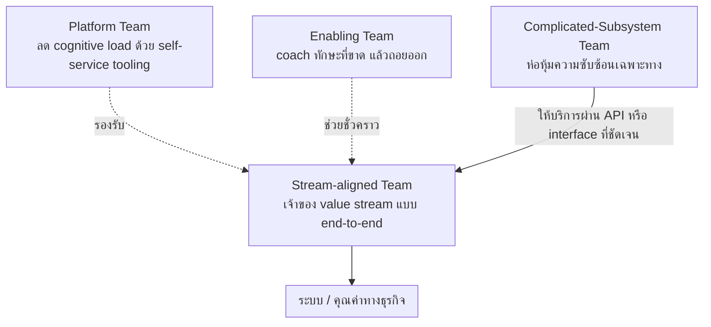

ลองนึกภาพร้านอาหารขนาดกลางแห่งหนึ่ง มีทีมทำอาหารหน้าเตา (line cook) ที่รับออเดอร์แล้วปรุงจนเสิร์ฟถึงมือลูกค้าครบทุกขั้นตอน มีช่างเทคนิคที่คอยดูแลเตาอบและระบบ POS ให้ทุกสถานีในครัวใช้งานได้ตลอดเวลาโดยไม่ต้องมาคอยซ่อมเอง มีเชฟที่ปรึกษาซึ่งมาสอนเทคนิคการหมักเนื้อแบบใหม่อยู่สองสัปดาห์แล้วก็จากไป และมีเชฟทำขนมที่ฝึกฝนเทคนิค tempering ช็อกโกแลตมาเป็นสิบปีจนไม่มีใครในครัวอยากไปแย่งงานนั้นทำ

สี่บทบาทนี้ไม่ได้ปะปนกันมั่วๆ แต่ละคนมีขอบเขตความรับผิดชอบและวิธีปฏิสัมพันธ์กับคนอื่นในครัวที่ต่างกันชัดเจน — นี่คือภาพเดียวกับที่หนังสือ **Team Topologies** โดย Matthew Skelton และ Manuel Pais ใช้อธิบายวิธีจัดทีมวิศวกรรมซอฟต์แวร์ พวกเขาเสนอว่าทีมในองค์กร engineering ที่ดีควรจัดอยู่ใน 4 รูปแบบพื้นฐานเท่านั้น ไม่ใช่เพราะทีมอื่นแบบอื่นผิด แต่เพราะ 4 แบบนี้ครอบคลุมรูปแบบความรับผิดชอบที่จำเป็นในการส่งมอบซอฟต์แวร์ได้ครบ

## Stream-aligned Team — ทีมสายหลัก ทำอาหารครบวงจร

**Stream-aligned team** คือทีมที่รับผิดชอบ "หนึ่งสายงานคุณค่า" (<mark class="hl-term">value stream</mark>) แบบ end-to-end ตรงกับ domain ทางธุรกิจหนึ่งเรื่อง เช่น "ทีม Checkout" ที่ดูแลตั้งแต่ตะกร้าสินค้าไปจนถึงชำระเงินสำเร็จ ทีมเดียวออกแบบ พัฒนา ทดสอบ deploy และ monitor ระบบของตัวเองได้ครบ ไม่ต้องรอทีมอื่นอนุมัติหรือทำแทนในแต่ละขั้น — เหมือนทีมทำอาหารหน้าเตาที่รับออเดอร์จนเสิร์ฟเสร็จเองทั้งหมด ไม่ต้องส่งต่อจานให้อีกแผนกจัดการต่อ

นี่คือรูปแบบทีมที่ **ควรมีมากที่สุด** ในองค์กร เพราะเป็นทีมที่สร้างคุณค่าให้ลูกค้าโดยตรงและเร็วที่สุด <mark class="hl-insight">อีก 3 แบบที่เหลือมีไว้เพื่อ "รับใช้" ทีมประเภทนี้ให้ทำงานได้คล่องขึ้น ไม่ใช่ทำงานคู่ขนานแบบเท่าเทียมกัน</mark>

## Platform Team — ทีมดูแลเตาอบและ POS ให้ทุกคนใช้เอง

**Platform team** สร้างเครื่องมือและ infrastructure ภายในที่ทีม stream-aligned เรียกใช้แบบ self-service ได้เอง เช่น ทีมที่ดูแล internal deployment platform, CI/CD pipeline กลาง, หรือ observability stack — เป้าหมายไม่ใช่แค่ "มีเครื่องมือให้ใช้" แต่คือการ**ลด cognitive load** ของทีม stream-aligned ไม่ต้องมานั่งเรียนรู้เรื่อง Kubernetes, network security, หรือ log aggregation ลึกๆ ด้วยตัวเอง

เปรียบเหมือนช่างเทคนิคที่ดูแลเตาอบและระบบ POS ให้พร้อมใช้งานตลอดเวลา ทีมทำอาหารแค่กดปุ่มใช้งานได้เลย ไม่ต้องรู้วงจรไฟฟ้าข้างในเตาอบว่าทำงานยังไง แพลตฟอร์มที่ดีเปรียบเสมือน "product" ที่มีทีม stream-aligned เป็นลูกค้าภายใน ไม่ใช่แค่ shared service ที่ถูกบังคับให้ใช้

## Enabling Team — เชฟที่ปรึกษาที่มาสอนแล้วจากไป

**Enabling team** ประกอบด้วยผู้เชี่ยวชาญเฉพาะด้าน (เช่น testing, security, performance) ที่เข้าไปช่วยทีม stream-aligned **ชั่วคราว** เพื่อปิดช่องว่างทักษะที่ทีมนั้นยังขาด แล้วถอยออกมาเมื่อทีมนั้นทำเองได้แล้ว — จุดสำคัญคือคำว่า "ชั่วคราว" ทีมนี้ไม่ได้เข้าไปทำงานแทน แต่เข้าไป**สอนและ coach** ให้ทีมเป้าหมายมีความสามารถนั้นติดตัวไปเอง

เหมือนเชฟที่ปรึกษาที่มาสอนเทคนิคการหมักเนื้อแบบใหม่ให้ทีมครัวเป็นเวลาสองสัปดาห์ แล้วก็จากไปทำงานกับครัวอื่นต่อ ไม่ได้ยืนทำอาหารแทนทีมเดิมตลอดไป <mark class="hl-warning">ถ้า enabling team กลายเป็นทีมที่ทุกคนพึ่งพาถาวร นั่นคือสัญญาณว่ามันกำลังทำหน้าที่ผิดประเภทไปแล้ว</mark>

## Complicated-Subsystem Team — เชฟทำขนมที่ทักษะเฉพาะทางสุดๆ

**Complicated-Subsystem team** ดูแลส่วนของระบบที่ต้องใช้ความรู้เฉพาะทางลึกมากจนวิศวกรทั่วไปในทีมอื่น**ไม่ควรต้องมาเรียนรู้เอง** เช่น ทีมที่ดูแล video-codec engine, ระบบคำนวณราคาที่ซับซ้อนทาง actuarial, หรือ machine learning model เฉพาะทาง — ความซับซ้อนตรงนี้ "จำเป็นต้องมีอยู่จริง" (essential complexity) ไม่ใช่ความยุ่งเหยิงที่ควรกำจัด แต่ควรถูกห่อหุ้มไว้ในทีมเดียวเพื่อไม่ให้ทีมอื่นต้องแบกรับ

เหมือนเชฟทำขนมที่ฝึกเทคนิค tempering ช็อกโกแลตมาเป็นสิบปี ทีมทำอาหารหน้าเตาไม่จำเป็นต้องรู้วิธีคุมอุณหภูมิช็อกโกแลตให้เงางามแบบมืออาชีพ แค่สั่งขนมหวานจากแผนกนี้มาเสิร์ฟก็พอ — ต่างจาก platform team ตรงที่ platform team มีไว้ "ลดงาน" ให้ทีมอื่น ส่วน complicated-subsystem team มีไว้ "กันความซับซ้อนที่จำเป็น" ไม่ให้กระจายออกไปโดยไม่จำเป็น

## สรุปเปรียบเทียบทั้ง 4 แบบ

| ประเภททีม | จุดประสงค์หลัก | ตัวอย่าง | ระยะเวลาปฏิสัมพันธ์กับทีมอื่น |
|---|---|---|---|
| Stream-aligned | เป็นเจ้าของ value stream หนึ่งสาย แบบ end-to-end | ทีม Checkout, ทีม Onboarding ลูกค้าใหม่ | ต่อเนื่องระยะยาว รับบริการจากอีก 3 แบบ |
| Platform | สร้าง internal tool/infra แบบ self-service เพื่อลด cognitive load | ทีมดูแล internal deployment platform, CI/CD กลาง | ต่อเนื่องระยะยาว แต่ปฏิสัมพันธ์ต่ำ (self-service) |
| Enabling | ปิดช่องว่างทักษะให้ทีมอื่นชั่วคราว แล้วถอยออก | โค้ชด้าน testing, security champion | ชั่วคราว มีจุดเริ่มและจุดจบชัดเจน |
| Complicated-Subsystem | ห่อหุ้มความซับซ้อนเฉพาะทางที่ทีมอื่นไม่ควรต้องรู้ลึก | ทีม video-codec, ทีมคำนวณราคาประกันภัย | ต่อเนื่องระยะยาว แต่ปฏิสัมพันธ์แคบผ่าน interface เดียว |

สังเกตว่าคอลัมน์ขวาสุดคือสิ่งที่แยกทั้ง 4 แบบออกจากกันชัดที่สุด ไม่ใช่แค่ "ทำอะไร" — Enabling team ต่างจากอีก 3 แบบตรงที่**การเข้าไปช่วยทีมใดทีมหนึ่ง**ถูกออกแบบมาให้จบลงเมื่อภารกิจสำเร็จ (เหมือนโค้ชที่ไปสอนทีมนี้เสร็จแล้วย้ายไปสอนทีมอื่นต่อ) แต่ตัว Enabling team **เองยังเป็นโครงสร้างถาวร**ในองค์กรเหมือนอีก 3 แบบ เพียงแค่มันหมุนเวียนไปช่วยทีมต่างๆ แทนที่จะยึดติดอยู่กับทีมเดียวตลอด

## ทำไมต้องจำกัดแค่ 4 แบบ

องค์กรจำนวนมากมีทีมที่ตั้งชื่อแปลกๆ ไม่รู้จบ เช่น "ทีม Integration", "ทีม Core Services", "ทีม Special Projects" — <mark class="hl-term">Team Topologies</mark> เสนอว่าปัญหาของทีมที่มีขอบเขตความรับผิดชอบไม่ชัดคือมันสร้าง**การพึ่งพาข้ามทีมที่คาดเดาไม่ได้** ทุกทีมต้องมาถามว่า "ทีมนี้ทำหน้าที่อะไรกันแน่" ก่อนจะรู้ว่าต้องคุยกับใคร การบังคับให้ทุกทีมจัดอยู่ใน 4 ประเภทนี้ (หรือใกล้เคียงที่สุด) ทำให้คนในองค์กร**คาดเดาได้**ว่าจะขอความช่วยเหลือจากทีมไหนเรื่องอะไร ลดต้นทุนการสื่อสารข้ามทีมลงอย่างมาก

ในการสัมภาษณ์งานสาย engineering leadership หรือ staff/principal engineer คำถามแนวนี้มักไม่ได้ถามแค่ "รู้จัก Team Topologies ไหม" แต่ถามว่า "ถ้าทีมของคุณเริ่มมีปัญหาการประสานงานข้ามทีมบ่อยๆ จะวินิจฉัยยังไง" คำตอบที่ดีมักเริ่มจากการเช็กว่าแต่ละทีมกำลังทำหน้าที่ตรงกับ 1 ใน 4 ประเภทนี้จริงหรือไม่ หรือกำลังปะปนหลายบทบาทจนไม่มีใครรู้ขอบเขตชัดเจน

## ADR ตัวอย่าง

> **Title:** จัดตั้ง Platform Team แยกจากทีม Product เพื่อดูแล internal deployment tooling
> **Status:** Accepted
> **Context:** มีทีม stream-aligned 6 ทีม แต่ละทีมต้องเสียเวลาเฉลี่ย 20% ต่อสัปดาห์ไปกับการดูแล CI/CD pipeline, secrets management, และ observability ของตัวเอง ทำให้ velocity ของ feature งานหลักช้าลง
> **Decision:** ตั้ง Platform Team ใหม่ 4 คน รับผิดชอบสร้าง internal deployment platform แบบ self-service ให้ทีม stream-aligned เรียกใช้ผ่าน CLI/API เดียว โดยไม่ต้องเข้าใจรายละเอียดเบื้องหลัง
> **Consequences:** ลด cognitive load ของทีม stream-aligned ลงอย่างชัดเจนภายใน 2 ไตรมาส แต่ Platform Team ต้องดูแล documentation และ developer experience ให้ดีพอ ไม่งั้นจะกลายเป็นคอขวดใหม่ที่ทุกทีมต้องรอ ticket แทน
