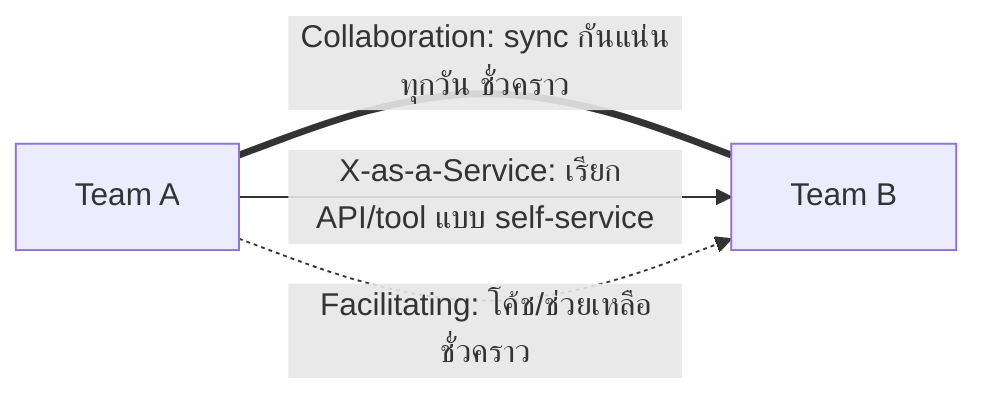

ลองนึกภาพความสัมพันธ์ระหว่างคนสองกลุ่มในชีวิตจริง — เพื่อนร่วมทีมที่นั่งระดมสมองแก้ปัญหายากๆ ด้วยกันทั้งวันจนกว่าจะเจอทางออก กับลูกค้าที่สั่งกาแฟจากร้านโดยไม่ต้องรู้จักบาริสต้าเลยสักนิด แค่บอกเมนูแล้วรับแก้วที่เคาน์เตอร์ กับนักเรียนที่มีติวเตอร์มาสอนเทคนิคการอ่านหนังสือให้จนกว่าจะทำเองได้ แล้วติวเตอร์ก็จากไป — ทั้งสามแบบนี้คือ "การปฏิสัมพันธ์" ที่มีลักษณะต่างกันโดยสิ้นเชิง ทั้งความเข้มข้น ระยะเวลา และเป้าหมาย

Team Topologies เสนอว่าทีมวิศวกรรมสองทีมที่ต้องทำงานเกี่ยวข้องกันควรเลือกรูปแบบปฏิสัมพันธ์ให้ตรงกับสถานการณ์ ไม่ใช่ปล่อยให้ทุกความสัมพันธ์กลายเป็นการประชุมทุกวันแบบไม่มีที่สิ้นสุด กรอบนี้เรียกว่า **Team Interaction Modes** มีอยู่ 3 แบบ

## Collaboration — ระดมสมองแก้ปัญหาร่วมกัน

**Collaboration** คือสองทีมทำงาน**ใกล้ชิดกันมาก**ชั่วคราว เพื่อค้นหาบางสิ่งที่ยังไม่มีใครรู้คำตอบชัดเจน เช่น ทีม stream-aligned กับทีม platform ต้องนั่งคุยกันทุกวันเพื่อออกแบบ API ใหม่ของแพลตฟอร์มที่ยังไม่เคยมีมาก่อน โหมดนี้มี**communication overhead สูงมาก** เพราะต้อง sync กันตลอดเวลา จึงควรใช้แบบ**เจาะจงและมีกรอบเวลาชัดเจน** ไม่ใช่ความสัมพันธ์ถาวร — เมื่อค้นพบคำตอบแล้ว ควรเปลี่ยนไปใช้โหมดที่ overhead ต่ำกว่าทันที

## X-as-a-Service — สั่งกาแฟจากเคาน์เตอร์ ไม่ต้องรู้จักบาริสต้า

**X-as-a-Service** คือทีมหนึ่งแค่**เรียกใช้**ผลงานหรือ API ของอีกทีมโดยแทบไม่ต้องสื่อสารกันเลย เหมือนสั่งกาแฟที่เคาน์เตอร์ — บอกสิ่งที่ต้องการ (เมนู/API contract) แล้วรับผลลัพธ์ ไม่ต้องรู้ว่าเบื้องหลังบาริสต้าชงยังไง นี่คือโหมดที่ **ควรเป็นค่าเริ่มต้นส่วนใหญ่** ขององค์กร เพราะมี overhead ต่ำที่สุด ทีมทำงานอิสระจากกันได้เต็มที่ ตัวอย่างที่ชัดที่สุดคือทีม stream-aligned เรียกใช้ self-service tooling ของ platform team ผ่าน CLI หรือ API โดยไม่ต้องคุยกับคนในทีม platform เลยสักครั้ง

## Facilitating — ติวเตอร์ที่มาสอนจนกว่าจะทำเองได้

**Facilitating** คือทีมหนึ่ง (มักเป็น Enabling team) ช่วย**โค้ช**อีกทีมให้ผ่านอุปสรรคหรือเรียนรู้ทักษะที่ขาด เหมือนติวเตอร์ที่สอนเทคนิคจนนักเรียนทำเองได้ แล้วถอยออกไป จุดต่างจาก Collaboration คือ Facilitating มีทิศทางความสัมพันธ์ที่ชัดเจนกว่า — ฝ่ายหนึ่งสอน อีกฝ่ายเรียน ไม่ใช่ทั้งสองฝ่ายร่วมกันค้นหาคำตอบใหม่แบบเท่าเทียม และเช่นเดียวกับ Collaboration โหมดนี้ควรมี**กรอบเวลาจำกัด** ไม่ใช่ถาวร

```demo
component: StepThroughDiagram
props: {"steps":[{"label":"1. Collaboration — ทำงานใกล้ชิดเพื่อค้นหาคำตอบใหม่","detail":"ตัวอย่าง: ทีม Checkout กับทีม Platform นั่งออกแบบ API ใหม่ของ payment gateway ร่วมกันทุกวันเป็นเวลา 2 สัปดาห์ เพราะยังไม่มีใครรู้ว่า contract ที่เหมาะสมหน้าตาเป็นยังไง — overhead สูง ควรใช้เฉพาะช่วงที่ต้องค้นพบสิ่งใหม่ร่วมกัน แล้วรีบเปลี่ยนไปโหมดอื่นเมื่อคำตอบชัดแล้ว"},{"label":"2. X-as-a-Service — เรียกใช้โดยแทบไม่ต้องสื่อสาร","detail":"ตัวอย่าง: ทีม Checkout เรียกใช้ internal deployment platform ผ่าน CLI คำสั่งเดียว โดยไม่ต้องคุยกับทีม Platform เลย เหมือนสั่งกาแฟจากเคาน์เตอร์ — นี่คือโหมดที่ควรเป็นค่าเริ่มต้นส่วนใหญ่ในองค์กร เพราะทำให้แต่ละทีมทำงานอิสระ ไม่บล็อกกัน"},{"label":"3. Facilitating — โค้ชจนกว่าอีกทีมจะทำเองได้","detail":"ตัวอย่าง: Enabling team ด้าน security เข้าไปช่วยทีม Checkout ตั้งค่า automated security scanning ในระบบ CI เป็นเวลา 1 เดือน สอนจนทีมนั้นดูแล pipeline เองต่อได้ แล้วถอยออกไปช่วยทีมถัดไป — มีจุดเริ่มและจุดจบชัดเจนเสมอ"}]}
```



## เปรียบเทียบทั้ง 3 โหมด

| Interaction Mode | Communication Overhead | ระยะเวลาที่เหมาะสม | ใช้เมื่อไหร่ |
|---|---|---|---|
| Collaboration | สูงมาก (sync บ่อย) | ชั่วคราว มีกรอบเวลาชัดเจน | ต้องค้นหาคำตอบใหม่ที่ยังไม่มีใครรู้ร่วมกัน |
| X-as-a-Service | ต่ำมาก (แทบไม่ต้องคุย) | ถาวร | บริโภคผลงาน/API ของอีกทีมที่มี contract ชัดแล้ว |
| Facilitating | ปานกลาง (coaching เป็นระยะ) | ชั่วคราว มีจุดเริ่ม-จบชัดเจน | ทีมหนึ่งขาดทักษะ/ติดขัด ต้องการโค้ชจากผู้เชี่ยวชาญ |

จุดที่ทีมส่วนใหญ่พลาดคือปล่อยให้ความสัมพันธ์ที่ควรเป็น X-as-a-Service กลายเป็น Collaboration แบบถาวรโดยไม่รู้ตัว — เช่น ทีม stream-aligned ต้องประชุมกับทีม platform ทุกสัปดาห์เพื่อขอ deploy เพราะ self-service tooling ยังไม่ดีพอ นี่คือสัญญาณว่า API/contract ระหว่างสองทีมยังไม่นิ่งพอ ควรลงทุนปรับปรุงจนกลายเป็น X-as-a-Service ได้จริง

## ทำไมต้องเลือกโหมดให้ถูก ไม่ใช่แค่ "คุยกันเยอะๆ ดีเสมอ"

สัญชาตญาณทั่วไปมักคิดว่ายิ่งสื่อสารกันเยอะยิ่งดี แต่ Team Topologies ชี้ว่า communication overhead ที่สูงเกินจำเป็นคือต้นทุนแฝงที่ทำให้ทีมทำงานช้าลง ทุกครั้งที่ต้องรอประชุม รอ sync กับอีกทีม คือเวลาที่ไม่ได้ใช้ผลิตคุณค่าให้ลูกค้า การเลือกโหมดที่เหมาะสมกับสถานการณ์คือการบริหาร**ต้นทุนการสื่อสาร**อย่างมีสติ ไม่ใช่การลดการสื่อสารทั้งหมดลง แต่คือการทำให้การสื่อสารที่จำเป็นเกิดขึ้นในโหมดที่คุ้มค่าที่สุด

ในการสัมภาษณ์งานสาย engineering management คำถามแนวนี้มักมาในรูป "ทีมสองทีมของคุณต้องประชุมกันทุกวันเพื่อ deploy งาน คุณจะแก้ปัญหานี้ยังไง" คำตอบที่ดีมักชี้ให้เห็นว่าความสัมพันธ์นี้ควรเป็น X-as-a-Service ไม่ใช่ Collaboration ถาวร แล้วเสนอให้ลงทุนสร้าง self-service API/tooling ที่ชัดเจนพอจะตัด synchronous communication ออกไปได้

## ADR ตัวอย่าง

> **Title:** เปลี่ยนความสัมพันธ์ทีม Checkout กับทีม Platform จาก Collaboration เป็น X-as-a-Service
> **Status:** Accepted
> **Context:** ทีม Checkout ต้องประชุมกับทีม Platform สัปดาห์ละ 3 ครั้งเพื่อขอความช่วยเหลือ deploy งาน เพราะ deployment pipeline ยังไม่มี self-service interface ที่ชัดเจน ทำให้ทั้งสองทีมเสียเวลาไปกับ synchronous communication มาก
> **Decision:** ทีม Platform ลงทุนสร้าง CLI + API แบบ self-service ให้ทีม Checkout deploy งานเองได้โดยไม่ต้องขอความช่วยเหลือแบบ real-time อีกต่อไป ใช้เวลา Collaboration ร่วมกัน 3 สัปดาห์เพื่อออกแบบ contract ก่อนเปลี่ยนโหมด
> **Consequences:** ลดการประชุมข้ามทีมลงเกือบทั้งหมด ทีม Checkout deploy ได้อิสระขึ้น แต่ทีม Platform ต้องรับภาระดูแล documentation และ error message ของ CLI ให้ดีพอจะไม่ต้องมีคนมาถามซ้ำๆ
