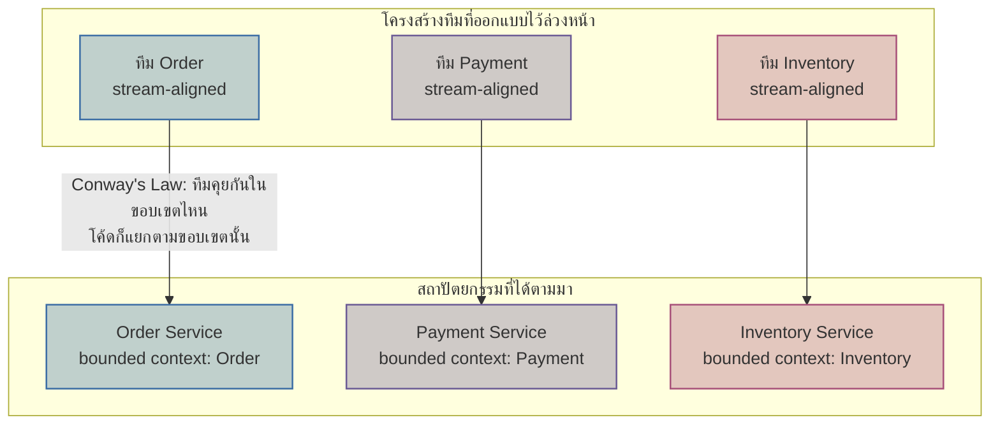

ในโมดูล Architecture Style ที่เรียนไปแล้ว มีการพูดถึง**Conway's Law**สั้นๆ ไว้ว่าระบบที่องค์กรออกแบบมักสะท้อนโครงสร้างการสื่อสารขององค์กรนั้นเอง ทีนี้ลองพลิกคำถามกลับด้าน — แทนที่จะปล่อยให้โครงสร้างทีมที่มีอยู่แล้ว "บังเอิญ" ผลิตสถาปัตยกรรมแบบใดแบบหนึ่งออกมาโดยไม่ได้ตั้งใจ จะเกิดอะไรขึ้นถ้าเรา**ออกแบบโครงสร้างทีมล่วงหน้า** ให้ตรงกับสถาปัตยกรรมที่เราต้องการอยู่แล้วตั้งแต่แรก

นี่คือแก่นของ Team Topologies ที่เชื่อมกลับมาหาสถาปัตยกรรมโดยตรง — มันไม่ใช่แค่ทฤษฎีการจัดองค์กร แต่เป็น**เครื่องมือออกแบบสถาปัตยกรรม**ที่ทำงานผ่านการจัดทีม

## Inverse Conway Maneuver — กลับด้าน Conway's Law มาใช้ให้เป็นประโยชน์

ลองนึกภาพบริษัทที่อยากมีสถาปัตยกรรมแบบ microservices ที่แยก bounded context ชัดเจน 3 domain คือ Order, Payment, Inventory (ตามที่เรียนในโมดูล Domain-Driven Design) แต่ยังจัดทีมแบบเดิมคือทีมเดียวใหญ่ที่ทุกคนแก้โค้ดทุกส่วนปนกันหมด — ถ้าไม่แก้โครงสร้างทีมก่อน โค้ดที่ออกมาจะยังคง "พันกัน" ตาม Conway's Law ไม่ว่าจะวาด architecture diagram สวยแค่ไหนบนกระดาษก็ตาม <mark class="hl-insight">เพราะคนที่นั่งทำงานด้วยกันทุกวันจะสื่อสารกันแบบไม่มีขอบเขต โค้ดก็จะไม่มีขอบเขตตามไปด้วย</mark>

<mark class="hl-term">**Inverse Conway Maneuver**</mark> คือการจงใจ**จัดโครงสร้างทีมใหม่ก่อน** ให้ตรงกับสถาปัตยกรรมเป้าหมาย แทนที่จะรอให้สถาปัตยกรรมค่อยๆ เปลี่ยนตามทีมเดิมอย่างไม่ตั้งใจ — แบ่งทีมใหญ่ทีมเดียวออกเป็น 3 ทีม stream-aligned คือทีม Order, ทีม Payment, ทีม Inventory แต่ละทีมเป็นเจ้าของ bounded context ของตัวเองแบบเต็มตัว เมื่อขอบเขตการสื่อสารระหว่างคนถูกกำหนดชัดตาม domain แล้ว โค้ดที่แต่ละทีมผลิตออกมาก็จะมีแนวโน้มแยกเป็น service ตามขอบเขตนั้นตามธรรมชาติ

## Cognitive Load — เหตุผลที่ทีมหนึ่งไม่ควรถือทุกอย่าง

เหตุผลที่ Team Topologies เน้นเรื่องขอบเขตทีมมากขนาดนี้ มาจากแนวคิดเรื่อง <mark class="hl-term">**cognitive load**</mark> — สมองมนุษย์มีขีดจำกัดว่าจะถือความซับซ้อนได้มากแค่ไหนในเวลาเดียวกัน ทีมหนึ่งทีมก็เช่นกัน ถ้าทีม Order ต้องเข้าใจทั้ง business logic ของการสั่งซื้อ **และ** วิธีตั้งค่า Kubernetes cluster **และ** วิธีจัดการ network security **และ** logic การคำนวณภาษีที่ซับซ้อน cognitive load จะสูงเกินจนทีมทำงานช้าลงและเกิดข้อผิดพลาดบ่อยขึ้น

Cognitive load แบ่งได้ 3 ประเภท: **intrinsic** (ความซับซ้อนที่จำเป็นต่องานจริงๆ เช่น business rule ของ domain), **extraneous** (ความซับซ้อนที่ไม่จำเป็น เช่น tooling ที่ใช้งานยาก ควรกำจัดทิ้ง), และ **germane** (ความซับซ้อนที่ต้องเรียนรู้เพื่อทำงานได้ดีขึ้นในระยะยาว) — นี่คือเหตุผลที่ Platform team มีอยู่จากบทที่แล้ว: มันมีไว้**ดูดซับ extraneous cognitive load** ของทีม stream-aligned ออกไป (เช่น รายละเอียดของ infrastructure) เพื่อให้ทีมนั้นมีพื้นที่สมองเหลือไปโฟกัสกับ intrinsic complexity ของ domain ธุรกิจของตัวเองอย่างเต็มที่

## เชื่อมกลับมาที่ Bounded Context

ในโมดูล Domain-Driven Design ได้เรียนเรื่อง bounded context ไปแล้วว่าคือขอบเขตทางความหมายที่ term เดียวกันอาจมีความหมายต่างกันไปในแต่ละ context — Team Topologies เสนอว่า **ขอบเขตทีมควรตรงกับ bounded context เสมอที่เป็นไปได้** เพราะถ้าทีมหนึ่งดูแลหลาย bounded context พร้อมกัน ทีมนั้นต้องสลับ mental model ไปมาตลอดเวลา (context switching) ซึ่งเป็นภาระ cognitive load อีกรูปแบบหนึ่ง แต่ถ้าหลายทีมมาแตะ bounded context เดียวกัน โมเดลของ context นั้นจะเริ่มขัดแย้งกันเอง เพราะแต่ละทีมตีความ business rule ไม่ตรงกัน

ดังนั้นการออกแบบ **team boundary ให้เท่ากับ 1 bounded context ต่อ 1 stream-aligned team** จึงเป็นจุดที่ทั้งสถาปัตยกรรมซอฟต์แวร์และโครงสร้างองค์กรมาบรรจบกันพอดี — เป็นเหตุผลว่าทำไมการออกแบบ microservices ที่ดีจึงแยกไม่ออกจากการออกแบบทีมที่ดี ทั้งสองเรื่องต้องคิดไปพร้อมกัน ไม่ใช่คิดทีละอย่าง

| แนวทาง | ทีมออกแบบตามสถาปัตยกรรมที่มีอยู่ | Inverse Conway Maneuver |
|---|---|---|
| จุดเริ่มต้น | มีสถาปัตยกรรม/โค้ดอยู่ก่อน แล้วจัดทีมตามทีหลัง | กำหนดสถาปัตยกรรมเป้าหมายก่อน แล้วจัดทีมให้ตรงกับมัน |
| ความเสี่ยง | ถ้าทีมเดิมสื่อสารข้ามขอบเขตมั่ว โค้ดจะพันกันตาม Conway's Law โดยไม่ตั้งใจ | ต้องยอมรับต้นทุนการ reorganize ทีมก่อนเห็นผลด้าน architecture |
| เหมาะกับ | องค์กรที่ domain ยังไม่นิ่ง ยังไม่รู้ขอบเขตที่แท้จริง | องค์กรที่รู้ bounded context ชัดแล้ว ต้องการ scale ทีมพร้อม architecture |
| ผลลัพธ์ | สถาปัตยกรรมมักออกมาไม่ตรงกับที่ตั้งใจไว้ | สถาปัตยกรรมมีแนวโน้มตรงกับเป้าหมายมากกว่า เพราะทีมสื่อสารตามขอบเขตที่วางไว้ |

## ข้อควรระวัง: อย่าจัดทีมใหม่บ่อยเกินไป

การ reorganize ทีมมีต้นทุนสูง ทั้งเวลาที่ต้องใช้สร้างความคุ้นเคยใหม่ ความรู้ domain ที่กระจัดกระจายชั่วคราว และขวัญกำลังใจของทีม การใช้ Inverse Conway Maneuver จึงควรทำเมื่อ**รู้ bounded context ที่ค่อนข้างนิ่งแล้ว**เท่านั้น <mark class="hl-warning">ถ้า domain ยังเปลี่ยนแปลงเร็วและขอบเขตยังไม่ชัด การจัดทีมตามสถาปัตยกรรมที่ยังไม่แน่นอนอาจทำให้ต้องจัดทีมใหม่ซ้ำแล้วซ้ำเล่า ซึ่งเสียหายมากกว่าปล่อยให้ทีมใหญ่ทำงานร่วมกันไปก่อนจนกว่าขอบเขตจะชัดพอ</mark>

## ADR ตัวอย่าง

> **Title:** ใช้ Inverse Conway Maneuver แบ่งทีม Engineering เดิมตาม Bounded Context
> **Status:** Accepted
> **Context:** ทีม Engineering ปัจจุบันเป็นทีมเดียว 18 คน ดูแลระบบ e-commerce ทั้งหมดปนกัน ทำให้ทุก deploy ต้องรอคิวรวม และ code ของ Order, Payment, Inventory เริ่มพึ่งพากันแบบแกะไม่ออก ทั้งที่ทีม Domain-Driven Design วิเคราะห์ bounded context ไว้ชัดแล้วว่ามี 3 domain แยกกัน
> **Decision:** แบ่งทีมออกเป็น 3 ทีม stream-aligned ตาม bounded context (Order, Payment, Inventory) ก่อนเริ่มแยกโค้ดเป็น service จริง โดยให้แต่ละทีมรับผิดชอบ domain ของตัวเองเต็มตัวตั้งแต่ design จนถึง deploy พร้อมตั้ง Platform team แยกต่างหากดูดซับ cognitive load ด้าน infrastructure
> **Consequences:** ต้องใช้เวลา 1 ไตรมาสให้แต่ละทีมสร้างความคุ้นเคยกับ domain ของตัวเอง และมีช่วง Collaboration mode สูงระหว่าง 3 ทีมช่วงแรกเพื่อตกลง contract ระหว่าง service แต่หลังจากนั้นคาดว่าแต่ละทีม deploy อิสระได้เร็วขึ้น และโค้ดจะแยกตามขอบเขต domain ชัดเจนขึ้นตาม Conway's Law
