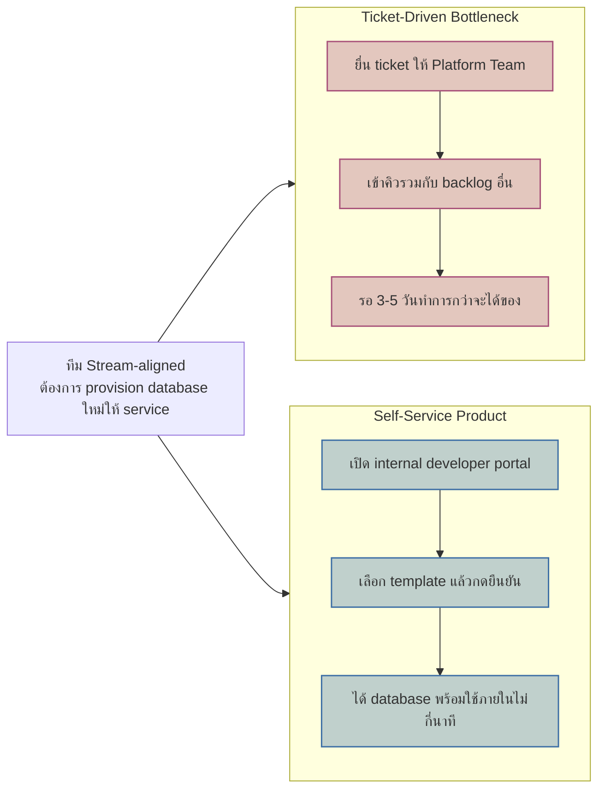

ลองนึกภาพไซต์ก่อสร้างขนาดใหญ่ที่มีช่างไฟ ช่างประปา และช่างโครงสร้างทำงานพร้อมกันหลายทีม ถ้าอยากได้สว่านหรือนั่งร้านสักตัว ช่างต้องเดินไปหาหัวหน้าคลังเครื่องมือ กรอกใบขอเบิก แล้วรอเซ็นอนุมัติ งานก็หยุดชะงักรอของทุกครั้ง แต่ถ้าคลังเครื่องมือนั้นถูกออกแบบใหม่เป็นตู้หยิบเองที่แตะบัตรแล้วหยิบได้ทันที ช่างจะกลับไปทำงานต่อได้ในไม่กี่วินาทีโดยไม่ต้องพึ่งใครเลย

นี่คือความต่างระหว่างทีม Platform ที่ทำงานแบบ "แผนกคลังเครื่องมือที่ต้องขออนุมัติทุกครั้ง" กับทีม Platform ที่ยึดแนวคิด <mark class="hl-term">Platform as a Product</mark> — มองสิ่งที่ทีม Platform สร้างขึ้น ไม่ว่าจะเป็น CI/CD pipeline, infrastructure tooling, internal service template, หรือ shared library ว่าเป็น "สินค้า" ที่มีทีม stream-aligned เป็น "ลูกค้าภายใน" ไม่ใช่แค่โครงสร้างพื้นฐานที่ทีม Platform อยากสร้างอะไรก็สร้างตามใจตัวเองแล้วค่อยประกาศให้ทุกคนมาใช้ บทที่ 01 เกริ่นไว้แล้วว่า Platform team ควรมี stream-aligned team เป็นลูกค้า บทนี้จะลงลึกว่า "มีลูกค้า" แปลว่าทีม Platform ต้องเปลี่ยนวิธีทำงานตรงไหนบ้างจริงๆ

## Roadmap ต้องมาจาก Feedback ของลูกค้า ไม่ใช่ความสำคัญที่ฝ่าย Infra คิดเอง

ทีม Platform ที่ทำงานแบบ infra ล้วนๆ มักตั้ง roadmap จากมุมมองทางเทคนิคของตัวเอง เช่น "ปีนี้จะ migrate ไป Kubernetes เวอร์ชันใหม่" หรือ "จะเปลี่ยน monitoring stack" โดยไม่เคยถามว่าทีม stream-aligned ปวดหัวกับอะไรอยู่บ้าง ทีม Platform ที่ทำงานแบบ product ต้องมีกลไกเก็บ feedback อย่างสม่ำเสมอ เช่น สำรวจความพึงพอใจทุกไตรมาส, office hours ให้ทีมอื่นมาบ่นปัญหา, หรือดูจากคำถามที่เกิดซ้ำๆ ใน support channel แล้วเอามาจัดลำดับความสำคัญของ roadmap แทนที่จะตัดสินใจจากมุมมองทางเทคนิคฝ่ายเดียว <mark class="hl-insight">จุดตัดสำคัญคือ priority ของ roadmap ควรตอบคำถามว่า "อะไรทำให้ลูกค้า (ทีมอื่น) ทำงานได้เร็วขึ้น" ไม่ใช่ "อะไรน่าสนใจทางเทคนิคที่สุด"</mark>

## Self-Service ต้องใช้ได้จริงโดยไม่ต้องรอคิว

ต่อให้ Platform team สร้างเครื่องมือดีแค่ไหน ถ้าทีม stream-aligned ต้องเปิด ticket แล้วรอ Platform team มาทำให้ทุกครั้ง ความสัมพันธ์นั้นก็ยังเป็น X-as-a-Service แบบ "สั่งแล้วรอคิว" ไม่ใช่ self-service จริง (ทบทวนจากบทที่ 02: X-as-a-Service ที่ดีควรมี overhead ต่ำมาก) หัวใจของ platform ที่ดีคือต้อง **discoverable** — ทีมใหม่หาเจอเองได้ผ่าน internal developer portal หรือ documentation โดยไม่ต้องถามใคร และต้อง **self-service** — ใช้งานได้จบในตัวเอง ไม่ต้องรอคนจากทีม Platform มา provision ให้ทีละ request

<mark class="hl-insight">ถ้าใช้ platform ยากกว่าหรือช้ากว่าการที่ทีมหนึ่งจะสร้างทางลัดของตัวเองขึ้นมาเอง ทีมนั้นจะเลี่ยงไปสร้างเองเสมอ</mark> — เกิดเป็น infrastructure กระจัดกระจายทั่วองค์กรที่ Platform team ไม่รู้ด้วยซ้ำว่ามีอยู่ และเมื่อเกิดปัญหาด้าน security หรือ compliance ก็ไม่มีใครดูแลของพวกนั้นอย่างเป็นระบบ



## วัดผลด้วย Developer Experience (DX) Metrics

ความรู้สึกว่า "platform เราดีอยู่แล้ว" ใช้ตัดสินไม่ได้ ต้องมีตัวเลขวัด <mark class="hl-term">Developer Experience (DX) metrics</mark> อย่างน้อยสองตัวที่ตรงประเด็นที่สุดคือ **time-to-first-deploy** — เวลาตั้งแต่วิศวกรคนหนึ่งเริ่มสร้าง service ใหม่ด้วย template ของ platform จนกระทั่ง deploy ขึ้น production ได้สำเร็จครั้งแรก ถ้าใช้เวลาเป็นวันหรือเป็นสัปดาห์ แปลว่า template หรือ documentation มีจุดติดขัด และ **self-service ratio** — สัดส่วนความต้องการด้าน infrastructure ของทีม stream-aligned ที่แก้ได้เองผ่าน platform โดยไม่ต้องยื่น ticket เทียบกับความต้องการทั้งหมด ยิ่งตัวเลขนี้สูง ยิ่งแปลว่า platform ครอบคลุม use case จริงของทีมอื่นได้มากพอ

<mark class="hl-warning">ทีม Platform ที่วัดผลด้วย "จำนวน feature ที่สร้างเสร็จ" อย่างเดียวโดยไม่วัด DX metrics เหล่านี้ มักไม่รู้ตัวเลยว่าตัวเองกำลังค่อยๆ กลายเป็นคอขวด</mark> เพราะ feature ที่สร้างเสร็จอาจใช้งานยาก discoverability แย่ หรือยังต้องผ่าน ticket อยู่ดี ทำให้ตัวเลขความสำเร็จภายในทีม Platform สวนทางกับความรู้สึกของทีมที่ต้องมาใช้งานจริง

```demo
component: ComparisonDiagram
props: {"left":{"title":"Platform ที่กลายเป็นคอขวด (Ticket-Driven)","points":["ทุก request ต้องยื่น ticket แล้วเข้าคิว backlog ของ Platform Team","time-to-first-deploy วัดเป็นวันถึงสัปดาห์","self-service ratio ต่ำ ทีมอื่นต้องพึ่ง Platform Team ตลอด","roadmap ถูกกำหนดจากมุมมองทางเทคนิคของทีม Platform เอง"]},"right":{"title":"Platform ที่เป็น Self-Service Product จริง","points":["ทีมค้นหาและใช้งานเองได้ผ่าน portal/CLI โดยไม่ต้องรอใคร","time-to-first-deploy วัดเป็นนาทีถึงชั่วโมง","self-service ratio สูง ทีมอื่น provision เองได้ส่วนใหญ่","roadmap ถูกจัดลำดับจาก feedback ของทีมที่ใช้งานจริง"]},"note":"ความต่างไม่ได้อยู่ที่เทคโนโลยีเบื้องหลังเหมือนกันแค่ไหน แต่อยู่ที่ทีม stream-aligned เข้าถึงมันได้แบบไหน"}
```

| DX Metric | วัดอะไร | ทำไมสำคัญ |
|---|---|---|
| Time-to-first-deploy | เวลาตั้งแต่ทีมใหม่เริ่มต้นจนกระทั่ง deploy service แรกได้จริงด้วย template ของ platform | สะท้อนว่า onboarding experience ลื่นไหลแค่ไหน ถ้าช้า แปลว่า template/documentation มีปัญหา |
| Self-service ratio | สัดส่วนความต้องการด้าน infra ที่ทีม stream-aligned แก้ได้เองโดยไม่ต้องยื่น ticket | ยิ่งสูง ยิ่งแปลว่า platform ครอบคลุม use case จริง ไม่ใช่แค่ทฤษฎี |
| Ticket backlog age | อายุเฉลี่ยของ ticket ที่ยังค้างอยู่ใน queue ของ Platform Team | ถ้าสูงขึ้นเรื่อยๆ คือสัญญาณเตือนล่วงหน้าว่ากำลังกลายเป็นคอขวด |
| Adoption rate | สัดส่วนทีมที่เลือกใช้ platform เทียบกับสร้างทางเลือกของตัวเอง | วัด product-market fit ภายในองค์กรได้ตรงที่สุด |

## มุมมองตอนสัมภาษณ์งาน

คำถามสัมภาษณ์ระดับ senior/staff: "Platform Team ของคุณสร้างเครื่องมือดีๆ ออกมาเยอะ แต่ทีม stream-aligned ก็ยังคงยื่น ticket ขอ provisioning ทุกครั้งเหมือนเดิม จะวินิจฉัยปัญหานี้ยังไง" คำตอบระดับผิวเผินคือ "เพิ่มคนใน Platform Team เพื่อเคลียร์ ticket ให้เร็วขึ้น" ซึ่งแก้แค่อาการ ไม่ใช่ต้นเหตุ — เพราะต่อให้เคลียร์ ticket เร็วขึ้น ก็ยังเป็นโมเดล "รอคิว" อยู่ดี คำตอบระดับ senior ควรเริ่มจากถามว่าทำไมทีมอื่นไม่ self-service เอง: tooling ที่มีอยู่ discoverable พอหรือไม่ documentation ครอบคลุม use case จริงหรือไม่ self-service ratio ปัจจุบันอยู่ที่เท่าไหร่ แล้ววัด time-to-first-deploy จริงเทียบกับเป้าหมาย ก่อนจะสรุปว่าปัญหาอยู่ที่ตัว tooling เอง หรืออยู่ที่ roadmap ของ Platform Team ไม่เคยฟัง feedback ของทีมที่ใช้งานจริงมาตั้งแต่ต้น

## ADR ตัวอย่าง

> **Title:** เปลี่ยน Platform Team ให้วัดผลด้วย Developer Experience Metrics แทนจำนวน Feature ที่ส่งมอบ
> **Status:** Accepted
> **Context:** Platform Team ส่งมอบ feature ใหม่ต่อเนื่องทุก sprint ตาม roadmap ที่ทีมกำหนดเอง แต่ทีม stream-aligned ยังคงยื่น ticket ขอ provisioning เฉลี่ย 40 รายการต่อเดือน และ time-to-first-deploy ของ service ใหม่เฉลี่ยอยู่ที่ 6 วันทำการ โดยไม่มีใครในองค์กรเคยวัดตัวเลขนี้มาก่อน
> **Decision:** เปลี่ยนตัวชี้วัดหลักของ Platform Team จาก "จำนวน feature ที่ส่งมอบ" เป็น time-to-first-deploy และ self-service ratio พร้อมจัดเก็บ feedback จากทีม stream-aligned ทุกไตรมาสเพื่อกำหนด roadmap แทนการตัดสินใจจากมุมมองทางเทคนิคฝ่ายเดียว
> **Consequences:** roadmap ของ Platform Team จะเปลี่ยนบ่อยขึ้นตาม feedback จริง ทำให้วางแผนระยะยาวยากขึ้นกว่าเดิม แต่ time-to-first-deploy และ self-service ratio จะกลายเป็นตัวเลขที่ตรวจสอบได้ว่า platform กำลังช่วยลด cognitive load ของทีมอื่นจริงหรือไม่ ไม่ใช่แค่ความรู้สึก
