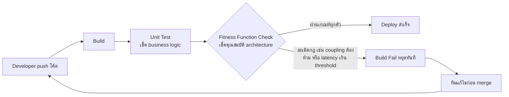

ตึกสูงทุกหลังต้องผ่านการตรวจสอบโครงสร้างก่อนอนุญาตให้เข้าอยู่ วิศวกรคำนวณว่ารับน้ำหนักได้เท่าไหร่ ทนแผ่นดินไหวระดับไหน แล้วก็ออกใบรับรอง — จบ ปัญหาคือหลังจากวันนั้น ตึกยังถูกแก้ไขต่อเนื่องไปอีกหลายสิบปี เจ้าของห้องต่อเติมระเบียง ผู้เช่าชั้นล่างทุบผนังรวมห้อง ฝ่ายบริหารอาคารเปลี่ยนวัสดุพื้นเป็นของหนักกว่าเดิม แต่ละการเปลี่ยนแปลงดูเล็กน้อยตอนที่ทำ ไม่มีใครเรียกวิศวกรมาตรวจซ้ำทุกครั้ง จนวันหนึ่งน้ำหนักสะสมเกินขีดที่โครงสร้างเดิมออกแบบไว้โดยไม่มีใครรู้ตัวเลย

ตึกยุคใหม่บางแห่งแก้ปัญหานี้ด้วยการติดเซ็นเซอร์วัดความสั่นสะเทือนและการเอียงตัวของโครงสร้างแบบต่อเนื่องตลอด 24 ชั่วโมง ถ้าค่าที่วัดได้เริ่มขยับออกนอกช่วงปลอดภัยที่กำหนดไว้ ระบบจะแจ้งเตือนทันทีโดยไม่ต้องรอให้วิศวกรมาเดินตรวจด้วยสายตาปีละครั้ง — ความแตกต่างสำคัญคือจาก "ตรวจครั้งเดียวตอนสร้างเสร็จ" กลายเป็น "ตรวจอัตโนมัติต่อเนื่องทุกครั้งที่มีการเปลี่ยนแปลง"

สถาปัตยกรรมซอฟต์แวร์เจอปัญหาเดียวกันเป๊ะ ตอนออกแบบระบบครั้งแรก ทีมอาจตัดสินใจไว้ชัดเจนว่า "module การเงินห้าม import module รายงานโดยตรง" หรือ "response time ของ API ต้องไม่เกิน 200ms" แต่พอเวลาผ่านไป มี developer ใหม่เข้าทีม มี deadline กระชั้น มีคนลืมกฎเดิม — การตัดสินใจเหล่านั้นเริ่มถูกละเมิดทีละนิดโดยไม่มีใครรู้ตัว จนกว่าจะสายเกินแก้ Neal Ford, Rebecca Parsons และ Patrick Kua เสนอวิธีแก้ในหนังสือ "Building Evolutionary Architectures" คือเขียนการทดสอบอัตโนมัติที่คอยวัดว่าคุณสมบัติสถาปัตยกรรมยังอยู่ในเกณฑ์ที่ยอมรับได้หรือไม่ทุกครั้งที่โค้ดเปลี่ยน เรียกว่า **Fitness Function**

## Fitness Function คืออะไร

พูดง่ายๆ คือ **unit test แต่เอาไว้เช็คคุณภาพของสถาปัตยกรรม แทนที่จะเช็คว่า business logic ถูกต้องไหม** unit test ปกติถามว่า "ฟังก์ชันคำนวณราคาให้ผลลัพธ์ถูกไหม" ส่วน fitness function ถามคำถามระดับสถาปัตยกรรมแทน เช่น "module A ยัง import module B ตรงๆ อยู่ไหม (ทั้งที่ห้ามไว้)" หรือ "ขนาด deployable package ของ service นี้ยังไม่เกิน 200MB ใช่ไหม"

ชื่อ "fitness" มาจากแนวคิด fitness function ในสาย evolutionary computation — ฟังก์ชันที่ใช้วัดว่าคำตอบหนึ่งๆ "เหมาะสม" (fit) กับเป้าหมายแค่ไหน ในบริบทสถาปัตยกรรม มันคือฟังก์ชันที่วัดว่าสถาปัตยกรรมปัจจุบัน "เหมาะสม" กับคุณสมบัติที่ทีมต้องการรักษาไว้ (architecture characteristics) แค่ไหน เช่น performance, security, coupling, modularity

ตัวอย่างที่พบบ่อยในทีมจริง:

- **Dependency check** — ใช้ tool อย่าง ArchUnit (Java), dependency-cruiser (JavaScript/TypeScript) หรือ import-linter (Python) สแกน dependency graph แล้วเช็คว่า layer ชั้นล่างไม่ import layer ชั้นบน หรือ module ที่ควรแยกอิสระกันไม่ import ข้ามกันเอง
- **Performance regression test** — รัน load test อัตโนมัติทุก build แล้วเปรียบเทียบ response time กับ baseline ถ้าช้าลงเกิน threshold ที่กำหนด (เช่น p95 เกิน 300ms) ให้ build fail
- **Deployable size limit** — เช็คว่าขนาด Docker image หรือ bundle size ของ frontend ไม่เกินเพดานที่ตั้งไว้ เพราะขนาดที่บวมขึ้นเรื่อยๆ มักเป็นสัญญาณว่ามีของที่ไม่ควรอยู่หลุดเข้ามา
- **Cyclomatic complexity / coupling metric** — วัดค่าความซับซ้อนหรือ coupling ระหว่าง module แล้ว fail build ถ้าค่าสูงเกินเกณฑ์

## ทำงานยังไงในทางปฏิบัติ

```demo
component: StepThroughDiagram
props: {"steps":[{"label":"1. กำหนด fitness function ที่วัดได้ (เช่น ห้าม module A import module B โดยตรง)","detail":"ทีมต้องแปลงการตัดสินใจสถาปัตยกรรมที่เคยพูดกันด้วยปากให้กลายเป็นกฎที่เครื่องตรวจสอบได้จริง ไม่ใช่แค่เขียนไว้ในเอกสารที่ไม่มีใครอ่านซ้ำ เช่น เขียนกฎด้วย ArchUnit ว่า 'คลาสใน package billing ห้าม depend คลาสใน package reporting' หรือกำหนด threshold ตัวเลขชัดเจนอย่าง 'p95 latency ต้องไม่เกิน 300ms'"},{"label":"2. รันอัตโนมัติทุกครั้งที่ build/deploy","detail":"ผูก fitness function เข้ากับ CI/CD pipeline เหมือน unit test ทั่วไป ไม่ต้องรอให้ใครนึกขึ้นได้ว่าต้องเช็ค เครื่องรันให้เองทุกครั้งที่มี commit ใหม่หรือก่อน deploy จริง เหมือนเซ็นเซอร์ตึกที่วัดค่าต่อเนื่องไม่ใช่รอตรวจปีละครั้ง"},{"label":"3. โค้ดใหม่ละเมิดกฎ → build fail ทันที","detail":"ถ้ามี developer เพิ่ม import ที่ผิดกฎ หรือ endpoint ใหม่ทำให้ response time เกิน threshold fitness function จะจับได้ทันทีในขั้นตอน build ไม่ปล่อยให้โค้ดที่ละเมิดหลุดเข้าไปรวมกับโค้ดหลักก่อน"},{"label":"4. ทีมแก้ก่อน merge แทนที่จะรู้ตัวตอน production พังแล้ว","detail":"ต้นทุนแก้ไขตอนเห็น error ใน CI ก่อน merge นั้นถูกกว่าต้นทุนตอน production ล่มเพราะ coupling ที่ซ่อนอยู่มาหลายเดือนมาก — fitness function เลื่อนจุดที่ตรวจพบปัญหาสถาปัตยกรรมให้เร็วที่สุดเท่าที่จะทำได้ (shift-left)"}]}
```

## Fitness Function อยู่ตรงไหนใน pipeline



สังเกตว่า fitness function ยืนอยู่คู่ขนานกับ unit test ในขั้นตอนเดียวกันของ pipeline — unit test ปกป้อง business logic ให้ถูกต้อง ส่วน fitness function ปกป้องคุณสมบัติสถาปัตยกรรมไม่ให้เสื่อมลงทีละนิดโดยไม่มีใครรู้ตัว

## Static vs Dynamic Fitness Function

fitness function แบ่งได้เป็นสองแบบหลักตามจังหวะที่รัน ทั้งสองแบบเสริมกันได้ ไม่ใช่เลือกอย่างใดอย่างหนึ่ง

| | Static (รันตอน build) | Dynamic (รันตอน runtime/production) |
|---|---|---|
| รันตอนไหน | ทุกครั้งที่ build หรือ pull request | ต่อเนื่องบน production จริง หรือ staged rollout |
| ตรวจอะไรได้ | dependency graph, code structure, package size | response time จริง, error rate จริง, resource usage จริง |
| feedback loop | เร็วมาก รู้ผลใน CI ภายในไม่กี่นาที | ช้ากว่า ต้องรอ traffic จริงมาสะสมข้อมูล |
| ความเสี่ยงถ้าไม่มี | โค้ดผิดโครงสร้างหลุดเข้า main branch | ปัญหา performance/scalability โผล่เฉพาะตอนโหลดสูงจริง |
| ตัวอย่างเครื่องมือ | ArchUnit, dependency-cruiser, import-linter | APM (Datadog, New Relic) ผูกกับ alert threshold, chaos engineering test |

ทีมส่วนใหญ่เริ่มจาก static fitness function ก่อนเพราะติดตั้งง่ายและให้ feedback เร็วที่สุด แล้วค่อยเพิ่ม dynamic fitness function ทีหลังสำหรับคุณสมบัติที่วัดได้จริงเฉพาะตอนระบบรันภายใต้ load จริงเท่านั้น เช่น scalability หรือ resilience

## จุดที่ต้องระวัง

fitness function ไม่ใช่เครื่องมือวิเศษที่ครอบคลุมทุกอย่าง มันวัดได้เฉพาะสิ่งที่นิยามเป็นตัวเลขหรือกฎที่ตรวจสอบอัตโนมัติได้เท่านั้น คุณสมบัติบางอย่าง เช่น "โค้ดนี้อ่านง่ายไหม" หรือ "การตัดสินใจนี้เหมาะกับธุรกิจในอีก 3 ปีข้างหน้าไหม" ยังต้องพึ่งการทบทวนของมนุษย์อยู่ดี fitness function เหมาะกับคุณสมบัติที่ทีม**ตกลงกันไว้แล้ว**ว่าสำคัญและวัดได้ชัดเจน ไม่ใช่เครื่องมือไว้ค้นหาว่าอะไรสำคัญตั้งแต่แรก

อีกจุดที่พลาดบ่อยคือตั้ง threshold เข้มเกินไปตั้งแต่วันแรกจนทีมรู้สึกว่า build fail บ่อยเกินจำเป็นแล้วเริ่มหาทาง bypass หรือปิดการเช็คทิ้งไปเลย — วิธีที่ปลอดภัยกว่าคือเริ่มจากกฎที่สำคัญที่สุดไม่กี่ข้อ ตั้ง threshold ให้สมเหตุสมผลกับสถานะปัจจุบันของระบบ แล้วค่อยๆ เข้มขึ้นเมื่อทีมปรับตัวได้

> คำถามสัมภาษณ์: "จะป้องกันไม่ให้ระบบค่อยๆ เบี่ยงออกจากสถาปัตยกรรมที่ออกแบบไว้ตอนแรกได้ยังไง โดยไม่ต้องพึ่งการรีวิวโค้ดด้วยสายตาอย่างเดียว" — คำตอบที่แสดงว่าเข้าใจแนวคิดนี้คือพูดถึง fitness function: แปลงคุณสมบัติสถาปัตยกรรมที่สำคัญให้เป็นกฎที่วัดได้อัตโนมัติ ผูกเข้ากับ CI/CD ให้รันทุกครั้งที่มีการเปลี่ยนแปลง แทนที่จะหวังพึ่งความจำหรือวินัยของคนอย่างเดียว ซึ่งพังง่ายเมื่อทีมโตขึ้นหรือมีคนใหม่เข้ามาเรื่อยๆ

## ADR ตัวอย่าง

> **Title:** ADR-021: เพิ่ม Fitness Function เช็ค Module Coupling ใน CI Pipeline
> **Status:** Accepted
> **Context:** ทีมพบว่า module การเงิน (billing) เริ่มถูก import ตรงจาก module รายงาน (reporting) หลายจุดโดยไม่มีใครตั้งใจ ทั้งที่ตกลงกันไว้ตั้งแต่ต้นว่าสอง module นี้ต้องคุยกันผ่าน API เท่านั้น สาเหตุคือไม่มีการตรวจสอบอัตโนมัติ อาศัยแค่การรีวิวโค้ดด้วยสายตาซึ่งพลาดได้ง่ายเมื่อทีมโตขึ้น
> **Decision:** เพิ่ม dependency-cruiser เป็น fitness function ใน CI pipeline เพื่อเช็ค dependency graph ทุกครั้งที่มี pull request หากพบ import ข้าม module ที่ต้องห้าม ให้ build fail ทันทีก่อน merge
> **Consequences:** pull request ที่ละเมิดกฎจะถูกบล็อกตั้งแต่ขั้นตอน CI ทำให้ coupling ที่ไม่ได้ตั้งใจไม่หลุดเข้า main branch อีก ทีมต้องเผื่อเวลาแก้ pull request เก่าบางส่วนที่ละเมิดกฎอยู่แล้วให้ผ่านก่อนเปิดใช้กฎแบบเข้มงวด (fail build) เต็มรูปแบบ
