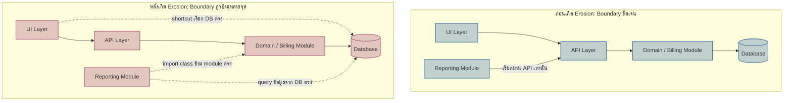

สวนสาธารณะหลายแห่งปูทางเดินเป็นเส้นตรงสวยงามเชื่อมประตูเข้ากับสนามหญ้า แต่ถ้าเดินไปดูดีๆ มักเจอ "ทางลัด" เป็นร่องดินโล้นตัดผ่านสนามหญ้าในมุมที่คนเดินจริงสะดวกกว่าทางที่ปูไว้ ไม่มีใครคนเดียวตัดสินใจ "สร้างทางลัดนี้" — แค่มีคนหนึ่งเดินตัดหญ้าเพราะใกล้กว่านิดเดียว หญ้าตรงนั้นเริ่มบางลง คนถัดมาเห็นร่องจางๆ ก็เดินตามเพราะดูเหมือนเป็นทางที่ "ปกติมีคนเดิน" อยู่แล้ว ทำซ้ำแบบนี้ไปเรื่อยๆ ไม่กี่เดือนก็กลายเป็นทางดินเตียนโล่งที่ไม่มีใครวางแผนไว้ตั้งแต่แรก

สถาปัตยกรรมซอฟต์แวร์เสื่อมสภาพด้วยกลไกเดียวกันเป๊ะ ไม่มีใครนั่งประชุมแล้วตัดสินใจว่า "เรามาทำลาย boundary ระหว่าง module การเงินกับ module รายงานกันเถอะ" แต่มี developer คนหนึ่งที่ deadline กระชั้นเขียน query ดึงข้อมูลจาก database ของ module อื่นตรงๆ แทนที่จะรอ API ที่ยังไม่มี "แค่ครั้งนี้ครั้งเดียว" แล้วอีกสองเดือนถัดมา คนที่แก้ฟีเจอร์ใกล้ๆ กันเห็น pattern นี้อยู่แล้วในโค้ด ก็ทำตามเพราะดูเหมือนเป็นวิธีที่ "ทีมนี้ทำกันอยู่แล้ว" ทำซ้ำไปเรื่อยๆ จนไม่มีใครจำได้อีกแล้วว่า boundary เดิมเคยชัดเจนแค่ไหน ปรากฏการณ์นี้เรียกว่า **Architecture Erosion**

## Architecture Erosion คืออะไร

<mark class="hl-term">Architecture Erosion</mark> คือช่องว่างที่ค่อยๆ ถ่างออกระหว่าง "สถาปัตยกรรมที่ตั้งใจออกแบบไว้" (intended architecture) กับ "สถาปัตยกรรมที่ระบบมีอยู่จริงในโค้ด" (actual/implemented architecture) โดยไม่มีการตัดสินใจครั้งไหนที่ตั้งใจให้เกิดขึ้น ตัวอย่างที่พบบ่อยในทีมจริง:

- **Direct database call ข้าม layer** — โค้ดฝั่ง frontend หรือ service อื่นแอบต่อเข้า database ของ service เจ้าของข้อมูลตรงๆ แทนที่จะผ่าน API layer ที่ออกแบบไว้ให้เป็นทางเข้าออกทางเดียว
- **Cross-module import เพื่อความเร็ว** — module A import class จาก module B ตรงๆ ทั้งที่ทีมตกลงกันไว้ว่าต้องคุยกันผ่าน interface หรือ event เท่านั้น เพราะการรอ interface ใหม่ช้ากว่าการ import ตรงในตอนนั้น
- **Copy-paste logic ข้าม boundary** — แทนที่จะเรียกใช้ shared service ก็ copy logic ไปแก้เองในอีกที่ เพราะไม่อยากแตะโค้ดของทีมอื่น
- **Config หรือ credential ฝังตรง** — ข้ามชั้น abstraction ที่ออกแบบไว้สำหรับจัดการ configuration เพราะเร็วกว่าตอนนั้น

แต่ละจุดเดี่ยวๆ ดูเล็กน้อยและมีเหตุผลรองรับเสมอ ("แค่ครั้งนี้ครั้งเดียว", "deadline ใกล้แล้ว") แต่พอสะสมนานพอ ระบบก็กลายเป็นสิ่งที่เรียกกันในวงการว่า <mark class="hl-term">**"big ball of mud"**</mark> — <mark class="hl-warning">ระบบที่ทุกอย่างเชื่อมกับทุกอย่างจนไม่มีใครกล้าแก้อะไรโดยไม่กลัวพังจุดอื่นที่ไม่เกี่ยวข้องกันเลย</mark>

## ก่อน vs หลัง Erosion

diagram ฝั่งซ้ายคือสิ่งที่ทีมตั้งใจออกแบบไว้ตั้งแต่แรก — ทุกการเข้าถึงข้อมูลผ่านทาง API เดียว ส่วนฝั่งขวาคือสิ่งที่เกิดขึ้นจริงหลังผ่านไปหนึ่งปี <mark class="hl-insight">เส้นประคือทางลัดที่ค่อยๆ ถูกเพิ่มเข้ามาทีละเส้นโดยไม่มีใครตั้งใจทำลาย boundary ทั้งหมดในคราวเดียว</mark> แต่ผลลัพธ์สุดท้ายคือ module ที่เคยแยกอิสระกันตอนนี้พังกันได้จากการเปลี่ยน schema ของอีกฝั่งหนึ่ง

## Intentional Debt vs Unintentional Erosion

จุดสำคัญที่ต้องแยกให้ออกคือ ไม่ใช่ "การเบี่ยงจากแผนเดิม" ทุกครั้งจะแย่เสมอไป Technical debt แบบ**ตั้งใจ**ที่มีการตัดสินใจร่วมกัน บันทึกเหตุผลไว้ (เช่นเขียนเป็น ADR ตามที่เรียนในโมดูล Architecture Documentation) และมีแผนจะจ่ายคืนทีหลัง ต่างจาก erosion แบบ**ไม่ตั้งใจ**ที่ไม่มีใครตัดสินใจอะไรเลย มันแค่ค่อยๆ เกิดขึ้นเงียบๆ จนไม่มีใครรู้ตัวว่าเบี่ยงไปไกลแค่ไหนแล้ว

| | Intentional Technical Debt | Unintentional Erosion |
|---|---|---|
| ใครตัดสินใจ | ทีมตกลงร่วมกัน มีคนรับผิดชอบชัดเจน | ไม่มีใครตัดสินใจ เกิดจากทางลัดสะสมทีละจุด |
| มีบันทึกไหม | บันทึกเป็น ADR พร้อมเหตุผลและแผนจ่ายคืน | ไม่มีบันทึกใดๆ รู้ตัวอีกทีก็สายไปแล้ว |
| มองเห็นได้ไหม | ทีมรู้ตัวว่ากำลังยอมแลกอะไรกับอะไร | ซ่อนอยู่ในโค้ดจนกว่าจะมีคนไปเจอเอง หรือระบบพัง |
| แผนแก้ไข | มีกำหนดเวลาหรือเงื่อนไขที่จะกลับมาแก้ | ไม่มีแผน เพราะไม่มีใครรู้ว่ามันมีอยู่ |
| ตัวอย่าง | "ตอนนี้ยอม hardcode ค่านี้ไปก่อนเพื่อให้ทัน launch จะย้ายเข้า config service ใน Q ถัดไป" (มี ADR รองรับ) | code review ผ่านให้ import ข้าม module ไปเพราะรีบ ไม่มีใครกลับมาแก้อีกเลย |

จุดที่น่าสนใจคือ intentional technical debt ที่ดีสามารถใช้เครื่องมือเดียวกับที่เรียนในหัวข้อก่อนหน้า (Fitness Function) มาช่วยได้ — เขียน fitness function ที่ตั้งใจปล่อยให้ผ่านชั่วคราว (เช่น "ยอมให้ module A import module B ได้ถึงวันที่กำหนด") แทนที่จะปล่อยให้กลายเป็น erosion แบบไม่มีใครสังเกตเห็น

## จะจับ Erosion ให้ทันก่อนสายได้ยังไง

วิธีที่ตรงไปตรงที่สุดคือเอา fitness function (จากบทก่อนหน้า) มาผูกกับ dependency ที่ตกลงกันไว้ ให้ build fail ทันทีถ้ามีการ import ข้าม boundary ที่ห้ามไว้ แทนที่จะหวังให้คนรีวิวโค้ดจับได้ทุกครั้งด้วยสายตา นอกจากนี้การทำ **architecture review เป็นระยะ** (เช่น ทุกไตรมาส) เพื่อวาด dependency diagram จริงจากโค้ดปัจจุบันเทียบกับ diagram ที่ออกแบบไว้ตอนแรก ก็ช่วยให้เห็นช่องว่างที่ค่อยๆ ถ่างออกก่อนที่มันจะกลายเป็น big ball of mud เต็มรูปแบบ

> คำถามสัมภาษณ์: "ทำไมระบบที่เคยออกแบบไว้ดีมากตอนเริ่มโปรเจกต์ ถึงกลายเป็น 'ยุ่งเหยิงจนแตะไม่ได้' หลังผ่านไปสองสามปี ทั้งที่ไม่มีใครตัดสินใจทำลายมันเลย" — คำตอบที่แสดงความเข้าใจคือพูดถึง architecture erosion: ไม่มีเหตุการณ์เดียวที่ทำลาย boundary แต่เป็นการสะสมของทางลัดเล็กๆ ที่แต่ละอันดูสมเหตุสมผลในบริบทตอนนั้น วิธีป้องกันคือทำให้ boundary ที่สำคัญตรวจสอบได้อัตโนมัติ (fitness function) แทนที่จะพึ่งวินัยหรือความจำของทีมอย่างเดียว

## ADR ตัวอย่าง

> **Title:** ADR-022: ยอมรับ Direct DB Read ชั่วคราวจาก Reporting Module ไปยัง Billing Database
> **Status:** Accepted
> **Context:** Reporting module ต้องการข้อมูล billing แบบ real-time สำหรับ dashboard ที่ผู้บริหารต้องใช้ในสัปดาห์หน้า Billing module ยังไม่มี API สำหรับ query แบบ aggregate ที่ reporting ต้องการ และการสร้าง API ใหม่ให้ครบต้องใช้เวลาอย่างน้อย 3 สัปดาห์
> **Decision:** อนุญาตให้ reporting module query database ของ billing โดยตรงแบบ read-only ชั่วคราว โดยบันทึกไว้ใน fitness function ว่าอนุญาตเฉพาะ table ที่ระบุ และตั้งเป้าย้ายไปใช้ API ที่จะสร้างขึ้นภายในสิ้นไตรมาสนี้
> **Consequences:** dashboard เปิดใช้งานได้ทันตามกำหนด แลกกับการที่ reporting module ผูกกับ schema ภายในของ billing ชั่วคราว หาก billing เปลี่ยน schema table เหล่านั้นต้องแจ้ง reporting ล่วงหน้า ทีมต้องติดตาม ticket ที่สร้างไว้เพื่อย้ายออกจาก direct access นี้ก่อนสิ้นไตรมาส ไม่ปล่อยให้กลายเป็น debt ถาวรที่ไม่มีใครกลับมาแก้
