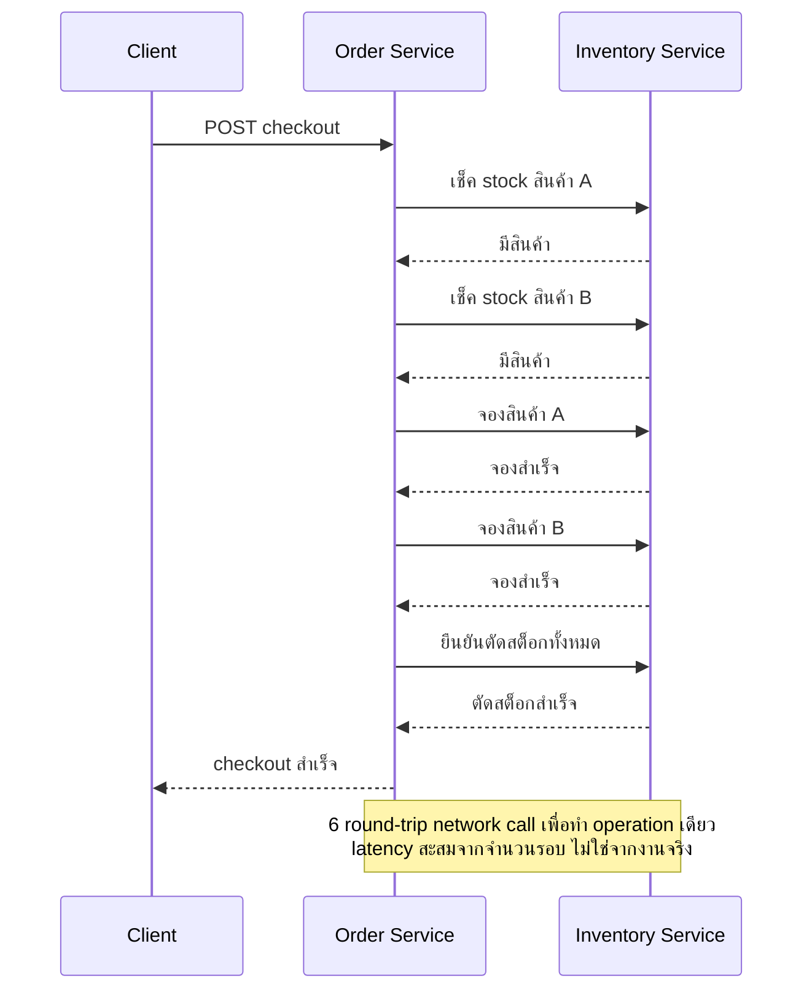

บริษัทหนึ่งตัดสินใจปรับปรุงออฟฟิศแบบ open-plan เดิมให้เป็นห้องแยกตามแผนก สร้างผนังกั้นสวยงาม ติดป้ายชื่อแผนกไว้หน้าประตูแต่ละห้อง ดูเผินๆ เหมือนทุกแผนกแยกอิสระจากกันแล้ว แต่พอใช้งานจริงกลับพบว่าทุกห้องยังต้องเดินผ่านห้องกลางเดียวกันเพื่อไปห้องน้ำ สายไฟทุกห้องต่อรวมเข้า circuit breaker ตัวเดียว ถ้าแผนกหนึ่งเสียบปลั๊กเครื่องปรับอากาศจนไฟตัด ทุกแผนกมืดพร้อมกันหมด — การกั้นผนังไม่ได้ทำให้แผนกต่างๆ เป็นอิสระจากกันจริง แค่เปลี่ยนหน้าตาให้ดูเหมือนแยกเท่านั้น

ทีมพัฒนาซอฟต์แวร์จำนวนมากทำสิ่งเดียวกันตอน "แตก monolith เป็น microservices" — แยกโค้ดออกเป็นหลาย repository ตั้งชื่อ service ให้สวยงาม deploy แยก process กัน ดูเผินๆ เหมือนเป็น microservices แล้ว แต่พอดูลึกเข้าไปกลับพบว่ายังต้อง deploy ทุก service พร้อมกันเสมอ ยังเรียกกันแบบ synchronous เป็นสายยาว ยังแชร์ database ตารางเดียวกันอยู่ดี รูปแบบความผิดพลาดที่เกิดซ้ำๆ แบบนี้ในการออกแบบสถาปัตยกรรมเรียกว่า **Anti-pattern** — วิธีแก้ปัญหาที่ดูเหมือนถูกต้องตอนเริ่มทำ แต่จริงๆ สร้างปัญหาใหม่ที่หนักกว่าเดิมโดยไม่รู้ตัว

## God Service — Monolith ที่สวมชื่อ Microservice

**God Service** คือ service เดียวที่ค่อยๆ ดูดความรับผิดชอบของทุกอย่างเข้าไปรวมกัน จนกลายเป็นศูนย์กลางที่ทุก service อื่นต้องพึ่งพา อาการที่สังเกตได้ชัดคือ service นี้มี endpoint เยอะผิดปกติ ทีมที่ดูแลต้องเข้าใจ business logic แทบทุกส่วนของระบบ และทุกครั้งที่มี incident มักลงเอยที่ service นี้เสมอ

สาเหตุหลักมักมาจากการแตก service ตามความสะดวกขององค์กร (เช่น "ทีม backend เดิมดูแล service นี้ทั้งหมด") แทนที่จะแตกตาม bounded context ทางธุรกิจจริง ผลลัพธ์คือได้ monolith เดิมกลับมาในรูปแบบใหม่ แค่เปลี่ยนจาก "โมดูลเดียวในโค้ดเดียวกัน" เป็น "service เดียวที่เป็นคอขวดของทั้งระบบ" — ปัญหาที่ microservices ตั้งใจแก้ตั้งแต่แรกยังอยู่ครบ แถมตอนนี้ยังมีความซับซ้อนของ network เพิ่มเข้ามาอีกชั้น วิธีแก้คือแตก <mark class="hl-term">God Service</mark> ออกตาม domain boundary ที่ชัดเจน ให้แต่ละ service มีความรับผิดชอบแคบพอที่ทีมเดียวจะดูแลได้เข้าใจทั้งหมด

## Distributed Monolith — แยกแค่บนกระดาษ

**Distributed Monolith** คือรูปแบบที่พบบ่อยที่สุดและอันตรายที่สุด เพราะทีมมักไม่รู้ตัวว่ากำลังตกหลุมนี้อยู่ ระบบถูกแบ่งเป็นหลาย service จริง แต่ service เหล่านั้นผูกกันแน่นจนต้อง deploy พร้อมกันเสมอ เรียกกันแบบ synchronous request-response เป็นทอดๆ และมักแชร์ database เดียวกัน <mark class="hl-warning">สัญญาณเตือนที่ชัดที่สุดคือ "ถ้าจะ deploy service A ต้อง deploy service B พร้อมกันด้วยเสมอ" หรือ "service A ล่ม service B ก็ใช้งานไม่ได้ทันที ทั้งที่ควรเป็นคนละส่วนกัน"</mark>

ผลลัพธ์ที่แย่ที่สุดของ Distributed Monolith คือทีมได้รับ**ความซับซ้อนด้าน operations ของ microservices เต็มๆ** (ต้องดูแล network, service discovery, monitoring หลายจุด, distributed logging) แต่กลับ**ไม่ได้ประโยชน์หลักของ microservices เลย** คือ independent deployability — deploy แต่ละ service อิสระโดยไม่กระทบกัน

```demo
component: ComparisonDiagram
props: {"left":{"title":"อาการของ Distributed Monolith","points":["ต้อง deploy หลาย service พร้อมกันเสมอ แก้ทีละตัวไม่ได้","เรียกกันแบบ synchronous request-response เป็นสายยาว","หลาย service อ่าน-เขียน database ตารางเดียวกันโดยตรง","เปลี่ยน schema ที่ service หนึ่ง service อื่นพังทันที"]},"right":{"title":"Microservices ที่แยกจริง","points":["แต่ละ service deploy อิสระ ไม่ต้องรอกัน","สื่อสารผ่าน API/event ที่มี contract ชัดเจน หรือ async message","แต่ละ service เป็นเจ้าของ database ของตัวเองเท่านั้น","เปลี่ยน schema ภายในได้โดยไม่กระทบ service อื่น ตราบใดที่ API contract เดิมยังอยู่"]},"note":"Distributed Monolith แบกรับความซับซ้อนด้าน operations ของ microservices เต็มๆ (deploy หลายที่, network, monitoring หลายจุด) แต่ไม่ได้ประโยชน์เรื่อง independent deployability เลย"}
```

## Chatty Services — คุยกันเยอะจนช้ากว่าทำเอง

**Chatty Services** เกิดเมื่อ operation เดียวต้องอาศัย network call ไปมาระหว่างสอง service หลายรอบกว่าจะเสร็จ แต่ละ call เดี่ยวๆ อาจเร็วมาก แต่พอบวก latency ของ network round-trip เข้าไปหลายรอบต่อกัน ผลรวมกลับช้ากว่าที่ควรจะเป็นมาก



อาการแบบนี้มักเป็นสัญญาณว่า service boundary ถูกตัดผิดจุด — ข้อมูลที่ควรอยู่ด้วยกันในการตัดสินใจครั้งเดียวถูกแยกไปอยู่คนละ service จนต้องคุยกันซ้ำไปซ้ำมา วิธีแก้มีสองทางหลัก คือออกแบบ API ให้เป็น coarse-grained มากขึ้น (รวมหลาย call เดิมให้เหลือ call เดียวที่ส่งข้อมูลที่จำเป็นไปพร้อมกัน) หรือทบทวน boundary ใหม่ว่าสอง service นี้ควรรวมเป็น service เดียวกันหรือไม่ เพราะข้อมูลที่ต้องคุยกันบ่อยขนาดนี้อาจเป็นสัญญาณว่ามันคือ bounded context เดียวกันตั้งแต่แรก

## Shared Database — ประตูหลังที่ทุกคนแอบใช้

**Shared Database** คือเมื่อหลาย service อ่าน-เขียน database ตารางเดียวกันโดยตรง แทนที่จะผ่าน API ของ service เจ้าของข้อมูล มักเกิดจากความสะดวกตอนเริ่มโปรเจกต์ — ทุก service ใช้ database instance เดิมที่มีอยู่แล้วอยู่แล้ว ทำไมต้องแยก

ปัญหาคือ database ที่แชร์กันทำลาย encapsulation ที่ microservices ควรมี service ใดๆ ก็สามารถถูกทำให้พังได้จากการเปลี่ยน schema ของอีก service หนึ่งที่ตัวเองไม่รู้จักด้วยซ้ำ ไม่มีใครกล้า migrate schema เพราะไม่รู้ว่ามีใครพึ่งพา table นั้นอยู่บ้าง สุดท้ายทุก service ต้องประสานงานกันทุกครั้งที่จะเปลี่ยนอะไรแม้แต่นิดเดียว — นี่คือ coupling ที่เลวร้ายที่สุดแบบหนึ่ง เพราะมองไม่เห็นในโค้ด (ไม่มี import ให้เห็น) แต่มีจริงในระดับ schema

## สรุปทั้ง 4 Anti-pattern

| Anti-pattern | อาการ | สาเหตุหลัก | วิธีแก้ |
|---|---|---|---|
| God Service | service เดียวรู้/ทำทุกอย่าง กลายเป็นคอขวดใหม่ | แตก service ตามความสะดวกขององค์กร ไม่ใช่ตาม bounded context | แตกใหม่ตาม domain boundary ให้แต่ละ service มีความรับผิดชอบแคบและชัดเจน |
| Distributed Monolith | ต้อง deploy พร้อมกันเสมอ coupling แน่นแบบ synchronous | แยกแค่ระดับ deployment แต่ไม่แยก data และ coupling จริง | ให้แต่ละ service เป็นเจ้าของ data ตัวเอง สื่อสารผ่าน API/event ที่มี contract |
| Chatty Services | ต้องเรียกข้ามเครือข่ายหลายรอบเพื่อทำ operation เดียว | แบ่ง boundary ผิดจุด ตัดกลางข้อมูลที่ควรอยู่ด้วยกัน | ออกแบบ API แบบ coarse-grained หรือทบทวน boundary ใหม่ |
| Shared Database | หลาย service อ่าน/เขียน table เดียวกันตรงๆ | ใช้ database instance เดิมที่มีอยู่แล้วเพื่อความสะดวก | แยก database ตาม service เข้าถึงผ่าน API เท่านั้น ใช้ event sync ข้อมูลข้าม service |

จุดร่วมของ anti-pattern ทั้งสี่แบบคือ<mark class="hl-insight">ล้วนเกิดจากการยึด "หน้าตาภายนอก" ของสถาปัตยกรรมที่ต้องการ (แยก service, แยก deploy) โดยไม่ได้แก้ปัญหา coupling ที่แท้จริงข้างใน</mark> เหมือนการกั้นผนังออฟฟิศแต่ไม่ได้แยกสายไฟ — เห็นภาพว่าแยกแล้ว แต่ระบบยังทำงานเป็นก้อนเดียวกันอยู่ดี

anti-pattern ทั้งสี่แบบนี้ไม่ได้เกิดขึ้นในวันเดียว แต่ค่อยๆ สะสมแบบเดียวกับ **architecture erosion** ที่เรียนไปในหัวข้อก่อนหน้า — และป้องกันได้ด้วยเครื่องมือเดียวกับที่เรียนตั้งแต่หัวข้อแรกของโมดูลนี้คือ **fitness function** เช่น เขียน fitness function เช็คว่าแต่ละ service ไม่ query database ของ service อื่นตรงๆ (จับ Shared Database ได้ตั้งแต่ code review) หรือเช็คว่าจำนวน synchronous call ข้าม service ต่อหนึ่ง request ไม่เกินเพดานที่กำหนด (จับ Chatty Services ได้ก่อนจะลาม) — ตรวจจับอัตโนมัติได้เร็วกว่าการรอให้คนสังเกตเห็นว่าระบบกลายเป็น distributed monolith ไปแล้ว

> คำถามสัมภาษณ์: "ทีมหนึ่งบอกว่าเปลี่ยนจาก monolith เป็น microservices แล้ว แต่ทุกครั้งที่ deploy ต้อง deploy พร้อมกันทั้งหมดเสมอ มีปัญหาอะไร และจะเช็คยังไงว่าเป็น microservices จริงหรือ distributed monolith" — คำตอบที่ดีคือชี้จุดสังเกตที่เป็นรูปธรรม: ลองถามว่า deploy service เดียวโดยไม่แตะตัวอื่นได้ไหม, แต่ละ service เป็นเจ้าของ database ตัวเองหรือแชร์กับใคร, และการเปลี่ยน schema ภายในหนึ่ง service ต้องแจ้งทีมอื่นก่อนไหม ถ้าคำตอบคือ "deploy พร้อมกันเสมอ", "แชร์ database", "ต้องแจ้งทีมอื่นทุกครั้ง" แปลว่าเป็น <mark class="hl-term">distributed monolith</mark> ไม่ใช่ microservices ที่แยกอิสระจริง

## ADR ตัวอย่าง

> **Title:** ADR-023: แยก Database ของ Order Service ออกจาก Shared Database เดิม
> **Status:** Accepted
> **Context:** Order Service และ Inventory Service ยังใช้ database instance เดียวกันตั้งแต่ยุค monolith แม้จะแยก service ออกมาเดินคนละ process แล้ว การเปลี่ยน schema table `orders` ทุกครั้งต้องประสานงานกับทีม Inventory ก่อนเสมอ เพราะไม่รู้ว่า query ของ Inventory พึ่งพา column ไหนบ้าง ทำให้ deploy ช้าลงและเกิด incident จาก schema change มาแล้วสองครั้งในไตรมาสนี้
> **Decision:** แยก database ของ Order Service ออกเป็น instance ใหม่ที่เป็นเจ้าของโดย Order Service เพียงผู้เดียว Inventory Service ที่เคย query table `orders` ตรงต้องเปลี่ยนไปเรียกผ่าน API หรือรับข้อมูลผ่าน event แทน
> **Consequences:** Order Service เปลี่ยน schema ภายในได้โดยไม่ต้องประสานงานกับทีมอื่นอีก แลกกับต้นทุนช่วง migration ที่ต้อง sync ข้อมูลเก่าและปรับโค้ด Inventory Service ให้เลิกพึ่งพา schema ภายในของ Order Service โดยตรง ทีมต้องเผื่อเวลา 2 sprint สำหรับ migration และทดสอบคู่ขนานก่อนตัดการเชื่อมต่อแบบเก่า
