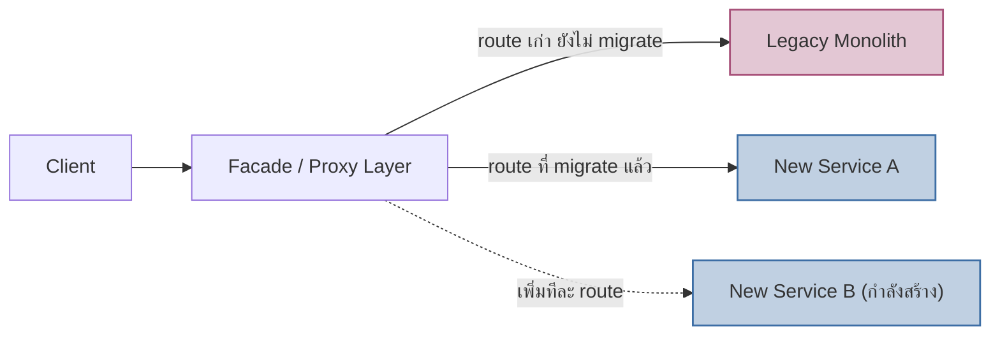

ลองนึกภาพต้นไทรพันธุ์ Strangler Fig ในป่าเขตร้อน — เมล็ดมันตกลงบนกิ่งไม้ต้นอื่น แล้วเริ่มงอกรากลงมาพันรอบลำต้นเจ้าบ้านทีละนิด ไม่ได้โค่นต้นไม้เดิมทันที แต่ค่อยๆ แผ่รากคลุมจนต้นไม้เดิมหายใจไม่ออก สุดท้ายต้นไม้เดิมตายและเน่าไป เหลือแต่ต้นไทรที่ยืนต้นแทนที่ได้อย่างสมบูรณ์ โดยที่ป่าไม่เคยว่างเปล่าจากต้นไม้สักวินาทีเดียวตลอดกระบวนการ

Martin Fowler ยืมภาพนี้มาตั้งชื่อ **Strangler Fig Pattern** — วิธี migrate ระบบ legacy ไปเป็นระบบใหม่ (เช่น monolith เก่าไปเป็น microservices) โดยไม่ต้องหยุดระบบเดิมแล้วเขียนใหม่ทั้งหมด (rewrite แบบ big-bang ซึ่งเสี่ยงสูงมาก) แต่ค่อยๆ สร้างฟีเจอร์ใหม่แทนที่ทีละส่วน จนวันหนึ่งระบบเก่าเหลือแต่ส่วนที่ไม่มีใครใช้แล้วถึงปลดระวางได้

## กลไกหลัก: Facade ที่คอยเบี่ยง Traffic

หัวใจของ pattern นี้คือ **Facade layer** (มักเป็น API Gateway หรือ reverse proxy) ที่คอยดักทุก request ก่อนตัดสินใจว่าจะส่งไปที่ระบบเก่าหรือระบบใหม่ ตอนเริ่มต้น facade ส่งทุกอย่างไปที่ legacy เหมือนเดิม 100% พอทีมสร้างฟีเจอร์ใหม่เสร็จหนึ่งส่วน (เช่น "ระบบค้นหาสินค้า") ก็แค่เปลี่ยน route นั้นให้ชี้ไปที่ service ใหม่ ส่วนที่เหลือยังคงไปที่ legacy เหมือนเดิม ทำซ้ำแบบนี้ทีละ capability จนกว่า legacy จะเหลือ route ที่ไม่มีใครเรียกแล้ว ถึงตอนนั้นค่อยปลดระวางได้อย่างปลอดภัย

## ทำไมไม่ rewrite ทั้งหมดทีเดียว

การเขียนใหม่แบบ big-bang ฟังดูสะอาดกว่าในทางทฤษฎี แต่ในทางปฏิบัติมีความเสี่ยงสูงมาก — ต้องหยุด feature ใหม่ของระบบเก่าระหว่างเขียนใหม่ (opportunity cost สูง), ทีมมักประเมินเวลาต่ำกว่าจริงเสมอ (ระบบเก่ามักมี business logic ที่ไม่มีใครรู้ครบ), และ<mark class="hl-warning">ถ้า rewrite ผิดพลาดคือความเสี่ยงทั้งระบบพร้อมกันในวันเปิดตัว ไม่มีทางย้อนกลับทีละส่วน</mark> <mark class="hl-term">Strangler Fig</mark> <mark class="hl-insight">หลีกเลี่ยงความเสี่ยงเหล่านี้ทั้งหมดด้วยการ migrate ทีละชิ้นที่เล็กพอจะ rollback ได้ถ้าพัง และระบบใช้งานได้ตลอดกระบวนการ</mark>

## เชื่อมกับสิ่งที่เรียนมาแล้ว

Pattern นี้คือคำตอบเชิงปฏิบัติของคำถาม "เลือก Monolith หรือ Microservices" (โมดูล 13) เมื่อคำตอบคือ "ต้องย้ายจาก Monolith เดิมไป Microservices" — Strangler Fig คือ**วิธี**ทำ ไม่ใช่แค่**เหตุผล**ว่าทำไม และยังเชื่อมกับ Architecture Erosion (หัวข้อก่อนหน้าในโมดูลนี้) ตรงที่ legacy monolith ที่ถูก strangle มักเป็นระบบที่ erosion สะสมมานานจนต้องมี exit plan ที่ปลอดภัยกว่าการรื้อทิ้งทันที

| แนวทาง | ความเสี่ยง | ระยะเวลาเห็นผล | หยุด feature ใหม่ไหม |
|---|---|---|---|
| Big-bang Rewrite | สูงมาก พังทีเดียวทั้งระบบ | ช้า เห็นผลตอนจบเท่านั้น | ต้องหยุดช่วง rewrite |
| Strangler Fig | ต่ำ migrate ทีละชิ้น rollback ได้ | เร็ว เห็นผลทีละ capability | ไม่ต้องหยุด ทำคู่ขนานได้ |

## มุมมองตอนสัมภาษณ์งาน

คำถามสัมภาษณ์ที่พบบ่อย: "มี legacy monolith ที่ทุกคนกลัวแตะ จะเริ่ม migrate ยังไง" คำตอบที่ดีไม่ใช่การเสนอ rewrite ใหม่ทั้งหมดทันที แต่คือการเสนอ <mark class="hl-term">facade layer</mark> แล้วเลือก capability ที่มีความเสี่ยงต่ำและเห็นผลชัดเจนที่สุดมา migrate ก่อนเป็นตัวพิสูจน์แนวทาง (proof of concept) ก่อนขยายไปส่วนอื่น

## ADR ตัวอย่าง

> **Title:** ใช้ Strangler Fig Pattern สำหรับ Migrate Checkout Monolith
> **Status:** Accepted
> **Context:** ระบบ checkout เดิมเป็น monolith อายุ 6 ปี ไม่มีใครกล้าแก้เพราะไม่มี test coverage เพียงพอ แต่ธุรกิจต้องการฟีเจอร์ใหม่ที่ monolith เดิมรองรับไม่ไหว
> **Decision:** ตั้ง API Gateway เป็น facade หน้า monolith เดิม แล้วสร้าง service ใหม่ทีละ capability เริ่มจาก Inventory Reservation ก่อน เพราะความเสี่ยงต่ำสุดและวัดผลได้ชัด
> **Consequences:** ทีมส่ง feature ใหม่ได้ต่อเนื่องโดยไม่ต้องหยุดรอ rewrite เสร็จ แต่ต้องดูแล facade layer เพิ่มเติม และมีช่วงเปลี่ยนผ่านที่ระบบ "ครึ่งเก่าครึ่งใหม่" ต้อง monitor ทั้งสองฝั่งพร้อมกัน
