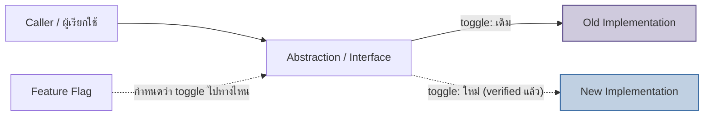
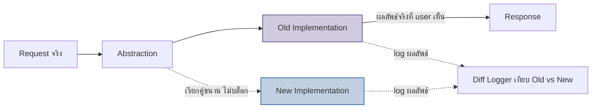

ลองนึกภาพช่างซ่อมเปลี่ยนเครื่องยนต์รถยนต์ขณะที่รถยังวิ่งอยู่บนถนน — เขาไม่ปิดถนนแล้วยกรถเข้าอู่หายไปหลายเดือน (นั่นคือ feature branch ที่แยกจาก main ไปนาน) แต่ค่อยๆ ติดตั้ง "ปลอกเชื่อมต่อ" รอบเครื่องยนต์เดิมก่อน แล้วค่อยเดินสายเครื่องยนต์ใหม่ขนานไปกับของเดิมผ่านปลอกเดียวกัน จนวันที่มั่นใจถึงสลับสวิตช์ให้เครื่องใหม่ทำงานแทน โดยรถไม่เคยหยุดวิ่งสักวินาทีเดียว

นี่คือ <mark class="hl-term">Branch by Abstraction</mark> — เทคนิค migrate โค้ดภายใน component หรือ module เดียว (ต่างจาก Strangler Fig ในหัวข้อก่อนที่ทำงานระดับ service/facade คอยเบี่ยง traffic ว่า capability ไหนไปเก่า ไปใหม่) โดยสร้าง abstraction (interface) คั่นหน้า implementation เดิมก่อน แล้วสร้าง implementation ใหม่ขึ้นมาอยู่หลัง interface เดียวกัน ทั้งหมดนี้เกิดขึ้นบน `main` ตลอดเวลา ไม่มี branch แยกที่ค้างเป็นสัปดาห์เป็นเดือน

## ปัญหาของ Feature Branch ระยะยาว

Feature branch ที่เปิดค้างไว้นานยิ่งอยู่นาน `main` ยิ่งเดินหน้าต่อโดยไม่รู้ตัว พอถึงวันจะ merge กลับ conflict สะสมมหาศาล — โค้ดสองสายที่แก้ไฟล์เดียวกันคนละทิศทางมาหลายสัปดาห์ ต้องมานั่งไล่ merge ทีละจุดซึ่งเสี่ยงพลาดสูง และระหว่างนั้นทีมอื่นก็ทดสอบ integration กับโค้ดใหม่ไม่ได้เลยเพราะมันยังไม่อยู่บน `main` <mark class="hl-warning">ยิ่ง branch มีอายุยืนเท่าไหร่ ต้นทุนตอน merge ยิ่งเพิ่มแบบไม่เป็นเชิงเส้น ไม่ใช่แค่บวกเพิ่มตามเวลา</mark> Branch by Abstraction แก้ปัญหานี้ที่ต้นเหตุ: ไม่มี branch ให้ drift ตั้งแต่แรก เพราะทุกอย่างพัฒนาบน `main` แบบ trunk-based

## กลไก: Interface คั่นหน้า แล้วค่อยสลับสวิตช์



ขั้นตอนทำเป็นลำดับเล็กๆ ที่ merge เข้า `main` ได้ทุกขั้น: (1) สร้าง interface ครอบ implementation เดิม แล้ว merge — พฤติกรรมระบบไม่เปลี่ยนเลย เพราะยังเรียก implementation เดิมผ่าน interface ใหม่; (2) สร้าง implementation ใหม่ทีละส่วนหลัง interface เดียวกัน merge เข้า `main` ได้เรื่อยๆ แม้ยังไม่เสร็จ เพราะ toggle ยังชี้ไปที่ของเดิมอยู่ ผู้ใช้ไม่เห็นความเปลี่ยนแปลง; (3) พอ implementation ใหม่พร้อมและผ่านการตรวจสอบ ค่อยสลับ toggle ให้ interface หันไปเรียกของใหม่แทน; (4) เมื่อมั่นใจว่าของใหม่เสถียรจริง ลบโค้ด implementation เดิมทิ้ง แล้วอาจลบ interface/toggle ออกด้วยถ้าไม่จำเป็นต้องสลับกลับไปกลับมาอีก

## Parallel Run: ทดสอบของใหม่ด้วย Traffic จริง ก่อนให้มันตัดสินใจจริง

Toggle จาก Branch by Abstraction ไม่จำเป็นต้องเป็น all-or-nothing switch เสมอไป — ก่อนสลับจริง ทีมมักใช้เทคนิค <mark class="hl-term">Parallel Run</mark> (บางที่เรียก Dark Launch หรือ Shadow Traffic) คือให้ทั้ง old และ new implementation รันพร้อมกันบน traffic การใช้งานจริงของผู้ใช้จริง แต่**ผลลัพธ์ที่ส่งกลับให้ผู้ใช้มาจาก old implementation เท่านั้น** ส่วนผลลัพธ์ของ new implementation ถูกเก็บ log ไว้เทียบ (diff) กับผลของ old แบบ async เพื่อดูว่าตรงกันไหม



ประโยชน์คือ <mark class="hl-insight">Parallel Run เจอ discrepancy จาก pattern การใช้งานจริงที่ test suite นึกไม่ถึง — edge case ของข้อมูลจริง, concurrency จริง, scale จริง — โดยที่ถ้า new implementation พังหรือให้คำตอบผิด ผู้ใช้จริงไม่ได้รับผลกระทบเลยสักคนเดียว</mark> เพราะมันไม่เคยถูกใช้ตัดสินใจจริง เป็นแค่ผู้สังเกตการณ์เงียบๆ อยู่ข้างสนาม กว่าจะสลับ toggle ให้ new implementation เริ่มตัดสินใจจริงก็ต่อเมื่อ diff rate ต่ำจนมั่นใจแล้วเท่านั้น

## ประกอบกันเป็นกระบวนการเดียว

Branch by Abstraction ให้ "จุดสลับ" (toggle point) ส่วน Parallel Run คือสิ่งที่ทำ**กับ**จุดสลับนั้นก่อนจะกดสลับจริง — รันคู่ขนาน เทียบผล สะสมความมั่นใจ แล้วค่อยตัดสินใจ ทั้งสองเทคนิคนี้ทำงานที่ระดับโค้ดภายใน component เดียว ต่างจาก Strangler Fig ที่ทำงานระดับ service โดย facade เบี่ยง route ทั้งก้อนไปทีละ capability — ในระบบใหญ่จริงมักใช้ร่วมกัน: Strangler Fig ตัดสินใจว่า capability ไหนถึงคิวจะ migrate ก่อน ส่วน Branch by Abstraction + Parallel Run คือวิธีลงมือ migrate โค้ดภายใน capability นั้นอย่างปลอดภัย

```demo
component: StepThroughDiagram
props: {"steps":[{"label":"1. สร้าง Abstraction","detail":"ครอบ old implementation ด้วย interface แล้ว merge เข้า main ทันที พฤติกรรมระบบไม่เปลี่ยน"},{"label":"2. สร้าง New Implementation","detail":"พัฒนาโค้ดใหม่หลัง interface เดียวกัน merge เข้า main เป็นชิ้นเล็กๆ ต่อเนื่อง toggle ยังชี้ไปของเดิม"},{"label":"3. Parallel Run","detail":"เปิดให้ new implementation รับ traffic จริงคู่ขนาน แต่ log ผลไว้เทียบ ไม่ส่งกลับให้ user"},{"label":"4. สลับ Toggle","detail":"เมื่อ diff rate ต่ำจนมั่นใจ สลับให้ new implementation เป็นฝั่งที่ตอบ user จริง"},{"label":"5. ลบของเก่า","detail":"เมื่อของใหม่เสถียรในโปรดักชันแล้ว ลบ old implementation และ toggle ที่ไม่จำเป็นทิ้ง"}]}
```

| เทคนิค | ทำงานระดับไหน | ความเสี่ยงตอนสลับ |
|---|---|---|
| Branch by Abstraction | ภายใน component/module เดียว | ต่ำ merge เป็นชิ้นเล็กบน main ตลอด ไม่มี branch ค้าง |
| Parallel Run | บน traffic จริง ก่อนสลับ toggle | แทบเป็นศูนย์ เพราะ user ไม่เคยเห็นผลจาก new implementation จนกว่าจะมั่นใจ |
| Feature Branch ระยะยาว | แยกจาก main ทั้งสาย | สูง merge conflict สะสม ทดสอบ integration ไม่ได้ระหว่างทาง |

## มุมมองตอนสัมภาษณ์งาน

คำถามสัมภาษณ์ที่พบบ่อย: "จะ rewrite payment calculation logic ที่ธุรกิจสำคัญมากยังไงให้ปลอดภัย โดยไม่หยุดระบบ" คำตอบแบบผิวเผินคือ "เขียน unit test ให้ครบแล้วค่อย deploy ของใหม่" ซึ่งไม่พอ เพราะ test suite ไม่มีทางครอบคลุม edge case ของข้อมูลจริงทั้งหมด คำตอบระดับ senior ต้องพูดถึง Branch by Abstraction เพื่อให้มี toggle point ที่ merge ได้บน `main` ตลอด บวกกับ Parallel Run เพื่อรัน logic ใหม่คู่ขนานกับ traffic จริงและ log diff เทียบผลลัพธ์ก่อนปล่อยให้มันตัดสินใจจริง — แสดงว่าเข้าใจว่าความเสี่ยงของระบบ business-critical อยู่ที่ "ความมั่นใจก่อนสลับ" ไม่ใช่แค่ "เขียนโค้ดให้ถูก"

## ADR ตัวอย่าง

> **Title:** ใช้ Branch by Abstraction และ Parallel Run สำหรับ Rewrite Pricing Engine
> **Status:** Accepted
> **Context:** Pricing engine เดิมเป็นโค้ดที่มี business rule ซับซ้อนสะสมมาหลายปี ทีมต้องการ rewrite ให้อ่านง่ายและรองรับ rule ใหม่ได้เร็วขึ้น แต่ผลการคำนวณราคาผิดแม้แต่กรณีเดียวกระทบรายได้โดยตรง จึงห้ามใช้ feature branch ยาวหรือ big-bang cutover
> **Decision:** สร้าง interface `PricingCalculator` ครอบ implementation เดิม merge เข้า `main` ก่อน จากนั้นพัฒนา implementation ใหม่หลัง interface เดียวกันเป็นชิ้นเล็กต่อเนื่อง เปิด Parallel Run ให้ implementation ใหม่คำนวณคู่ขนานกับ traffic จริงและ log diff เทียบผลเป็นเวลา 2 สัปดาห์ก่อนสลับ toggle
> **Consequences:** ทีม merge งานเข้า `main` ได้ต่อเนื่องไม่มี merge conflict สะสม และพบ edge case ที่ทำให้ผลต่างกัน 0.3% ของ traffic ก่อนสลับจริง แก้ไขได้ทันโดยไม่มีผู้ใช้คนไหนได้รับราคาผิด แต่ต้องแบกรับ cost การรัน implementation สองชุดคู่ขนานและดูแล diff logger ชั่วคราวระหว่าง migrate
