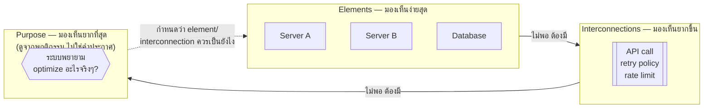

ลองนึกภาพนาฬิกาข้อมือเรือนหนึ่งที่ถูกถอดชิ้นส่วนออกมาวางเรียงบนโต๊ะ — เฟือง 30 กว่าตัว สปริง เข็มชั่วโมง เข็มนาที กระจก ตัวเรือน ทุกชิ้นวางอยู่ตรงหน้าคุณครบถ้วน คุณ "มี" ส่วนประกอบของนาฬิกาทั้งหมดแล้ว แต่สิ่งที่วางอยู่บนโต๊ะนั้น**บอกเวลาไม่ได้เลยแม้แต่วินาทีเดียว** ต้องรอจนกว่าชิ้นส่วนเหล่านั้นถูกประกอบกลับเข้าที่ — เฟืองตัวนี้ขบกับเฟืองตัวนั้นในอัตราทดที่แน่นอน สปริงคลายพลังงานผ่านเฟืองไปหมุนเข็ม — ฟังก์ชัน "บอกเวลา" ถึงจะปรากฏขึ้นมา

นี่คือกับดักที่คนเริ่มต้นออกแบบระบบ (ไม่ว่าจะเป็นระบบซอฟต์แวร์ ระบบองค์กร หรือระบบอะไรก็ตาม) มักตกลงไปโดยไม่รู้ตัว: คิดว่าถ้ารวบรวม "ส่วนประกอบที่ดีที่สุด" มาไว้ด้วยกันครบ ระบบก็จะทำงานได้ดี — ทั้งที่จริงแล้วคุณภาพของระบบไม่ได้ขึ้นกับส่วนประกอบเพียงอย่างเดียว แต่ขึ้นกับ**วิธีที่ส่วนประกอบเหล่านั้นเชื่อมโยงกัน**พอๆ กัน หรือมากกว่าด้วยซ้ำ

## นิยามของ "ระบบ" — สามอย่างที่ขาดไม่ได้

Donella Meadows นักคิดด้าน Systems Thinking ที่มีอิทธิพลที่สุดคนหนึ่ง (ผู้เขียน *Thinking in Systems: A Primer*) นิยาม **system** ว่าประกอบด้วยสามอย่างเสมอ ขาดอย่างใดอย่างหนึ่งไปก็ไม่เรียกว่าระบบ:

- **Elements (ส่วนประกอบ)** — สิ่งที่จับต้องได้/มองเห็นได้ง่ายที่สุด เช่น เฟืองในนาฬิกา, server ในระบบ, คนในทีม
- **Interconnections (การเชื่อมโยง)** — ความสัมพันธ์ที่ยึดส่วนประกอบเข้าด้วยกันและกำหนดว่าส่วนหนึ่งส่งผลต่ออีกส่วนยังไง เช่น เฟืองขบกันด้วยอัตราทดเท่าไหร่, service เรียก API กันด้วย protocol อะไร, กฎการรายงานระหว่างคนในทีม
- **Purpose/Function (จุดประสงค์)** — เหตุผลที่ระบบมีอยู่ สิ่งที่ระบบ "พยายามทำให้เกิดขึ้น" — บอกเวลา, ประมวลผล request ให้เร็วที่สุด, ส่งของถึงลูกค้าตรงเวลา

ข้อสังเกตสำคัญคือสามอย่างนี้ **ไม่ได้สำคัญเท่ากัน** — คนส่วนใหญ่มองเห็น element ง่ายที่สุด มองเห็น interconnection ยากขึ้นมาหน่อย แต่<mark class="hl-insight">purpose มักเป็นสิ่งที่มองไม่เห็นเลยจนกว่าจะสังเกตพฤติกรรมของระบบไปสักพัก</mark> (บางทีก็ต่างจาก purpose ที่ประกาศไว้อย่างเป็นทางการด้วยซ้ำ — ระบบราชการที่บอกว่ามีไว้ "บริการประชาชน" แต่พฤติกรรมจริงตลอดหลายปีกลับสะท้อนว่า purpose ที่แท้จริงคือ "รักษาสถานะเดิมของหน่วยงาน" ต่างหาก)

## ทำไม Interconnection ถึงสำคัญกว่าที่คิด

ลองเทียบสองทีมที่มีวิศวกรเก่งพอๆ กัน 8 คนเท่ากัน (element เหมือนกันทุกประการ) —

ทีม A: ทุกคนต้องขอ code review จากหัวหน้าทีมคนเดียวก่อน merge เสมอ ไม่มีข้อยกเว้น
ทีม B: ทุกคน review กันเองแบบ peer-to-peer ใครก็ได้ที่ว่างและมีบริบทเพียงพอ

Element เหมือนกันเป๊ะ (คนเก่งพอกัน 8 คน) แต่ **interconnection ต่างกัน** — ทีม A จะมี throughput ถูกจำกัดด้วยความจุของหัวหน้าทีมคนเดียว (bottleneck ชัดเจน, ยิ่งทีมโตยิ่งช้าลงเรื่อยๆ) ส่วนทีม B จะกระจายโหลดได้ตามธรรมชาติ แต่เสี่ยงเรื่องมาตรฐาน review ไม่สม่ำเสมอ พฤติกรรมของทั้งสองระบบต่างกันโดยสิ้นเชิง **ทั้งที่ element เหมือนกันทุกอย่าง** — นี่คือเหตุผลที่ Systems Thinking เตือนเสมอว่า <mark class="hl-warning">อย่ามัวไล่หา "คนเก่งที่สุด" มาเติมในระบบอย่างเดียว ต้องดูโครงสร้างความสัมพันธ์ที่ห่อหุ้มคนเหล่านั้นไว้ด้วย</mark>

## Purpose ที่แท้จริง ดูจากพฤติกรรม ไม่ใช่คำประกาศ

หลักการที่ Meadows ย้ำบ่อยที่สุดคือ **"the best way to deduce the system's purpose is to watch how it behaves, not to listen to what it says its purpose is"** — วิธีที่ดีที่สุดในการรู้ purpose จริงของระบบ คือดูว่ามันทำอะไรซ้ำๆ ไม่ใช่ฟังว่ามันประกาศว่าอยากทำอะไร

| สถานการณ์ | Purpose ที่ประกาศไว้ | Purpose ที่พฤติกรรมจริงบ่งชี้ |
|---|---|---|
| ทีมที่ OKR เขียนว่า "คุณภาพโค้ดสูงสุด" แต่ deploy ทุกอย่างวันศุกร์บ่ายเพื่อให้ทันโควตา sprint | Quality-first | Velocity/quota-first |
| Sales team ที่บอกว่า "ลูกค้าคือหัวใจของเรา" แต่ incentive จ่ายตาม deal ที่ปิดได้ ไม่สนใจว่าลูกค้าจะ churn ทีหลัง | Customer-first | Short-term revenue-first |
| Microservices ที่ตั้งใจแยกเพื่อ independent deployability แต่ service ทุกตัวยังต้อง deploy พร้อมกันเสมอเพราะ share database เดียวกัน | Independent deployability | Coordinated monolith (แค่ห่อด้วย network) |

นี่คือทักษะแรกและสำคัญที่สุดของ Systems Thinking — เวลาเจอระบบไหนก็ตาม (ซอฟต์แวร์ ทีม องค์กร) อย่ารีบเชื่อคำประกาศ purpose ที่ติดไว้บนกำแพง ให้สังเกต pattern ของพฤติกรรมย้อนหลังแทน เพราะโครงสร้าง interconnection ที่มีอยู่จริงต่างหากที่กำหนด purpose ที่แท้จริง ไม่ใช่ตัวหนังสือ

## มุมมองที่จะใช้ตลอดทั้ง track นี้

ตลอด track Systems Thinking นี้ เราจะกลับมาที่กรอบ <mark class="hl-term">Element / Interconnection / Purpose</mark> ซ้ำๆ — พอเจอ **stock and flow** ในโมดูลถัดไป จะเห็นว่ามันคือการมอง element ในรูปแบบที่สะสม/ไหลได้ พอเจอ **feedback loop** จะเห็นว่ามันคือการมอง interconnection ที่วนกลับมาหาตัวเอง และพอเจอ **leverage points** ในโมดูลท้ายๆ จะพบว่าจุดที่ "แก้แล้วได้ผลมากที่สุด" มักไม่ใช่การเปลี่ยน element เลย แต่คือการเปลี่ยน purpose ของระบบต่างหาก — ซึ่งเป็นจุดที่คนมองข้ามบ่อยที่สุดเพราะมันมองไม่เห็นด้วยตาเปล่า
