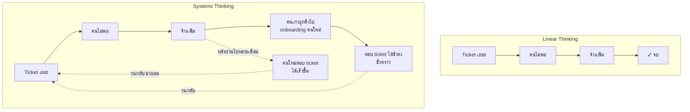

ทีม support เจอ ticket ค้างเยอะขึ้นเรื่อยๆ ทุกสัปดาห์ ผู้จัดการมองปัญหาแบบเส้นตรง: "ticket เยอะเกินไป → คนไม่พอ → จ้างเพิ่ม" จ้างมาอีก 3 คน สองเดือนถัดมา ticket ค้างเยอะขึ้นกว่าเดิม ทำไม?

เพราะการมองแบบเส้นตรง (A ทำให้เกิด B, จบแค่นั้น) มองข้ามสิ่งที่เกิดขึ้นจริง: คนใหม่ 3 คนต้องมีคน onboarding สอนงาน ดึงเวลาคนเก่งในทีมออกจากการตอบ ticket ไปสอนแทน ทำให้ ticket ค้างมากขึ้นในช่วงแรก และกว่าคนใหม่จะตอบ ticket ได้เร็วเท่าคนเก่าก็ใช้เวลาหลายเดือน ระหว่างนั้น ticket ยิ่งพอกพูน — ปัญหาไม่ได้มีสาเหตุเดียวเป็นเส้นตรง แต่มี**วงจรป้อนกลับ**ที่ทำให้<mark class="hl-insight">"ทางแก้" กลายเป็นตัวทำให้ปัญหาแย่ลงชั่วคราวก่อนจะดีขึ้น (ถ้าดีขึ้นจริง)</mark>

## Linear Thinking คิดยังไง

การคิดแบบเส้นตรง (linear thinking) มองโลกเป็นสายโซ่เหตุ-ผลทางเดียว: A → B → C จบ ไม่มีอะไรย้อนกลับมาหา A อีก เป็นวิธีคิดตามธรรมชาติของสมองมนุษย์ เพราะประมวลผลง่าย เร็ว จับต้นชนปลายได้ในไม่กี่วินาที และใช้ได้ดีมากกับปัญหาที่ "จริงๆ แล้วเป็นเส้นตรงจริง" เช่น กดสวิตช์ไฟ → หลอดไฟติด ไม่มีวงจรป้อนกลับซับซ้อนอะไรให้ต้องคิดเพิ่ม

ปัญหาคือ ระบบส่วนใหญ่ที่เราเจอในงานจริง — ทีม องค์กร ระบบซอฟต์แวร์ที่มีคนใช้งานจริง — **ไม่ใช่เส้นตรง** มันมี<mark class="hl-term">วงป้อนกลับ (feedback loop)</mark> ซ่อนอยู่เสมอ แต่สมองเรายังใช้กระบวนการคิดแบบเส้นตรงไปจับปัญหาแบบวงกลม <mark class="hl-warning">ผลลัพธ์คือคำตอบที่ดูสมเหตุสมผลในระยะสั้น แต่กลับสร้างปัญหาใหม่หรือทำปัญหาเดิมแย่ลงในระยะยาว</mark>

## Systems Thinking คิดยังไงต่างออกไป

Systems Thinking ไม่ได้ปฏิเสธความสัมพันธ์เหตุ-ผลแบบที่ linear thinking มองเห็น แต่เพิ่มคำถามสำคัญเข้าไปอีกสามข้อที่ linear thinking มักข้ามไป:

1. **ผลลัพธ์ (B) ย้อนกลับมามีผลต่อสาเหตุ (A) อีกทีหรือเปล่า?** — เช่น "จ้างเพิ่ม" ย้อนกลับมาทำให้ "ticket เยอะ" หนักขึ้นชั่วคราวก่อนจะเบาลง
2. **มีความหน่วง (delay) ระหว่างเหตุกับผลไหม?** — การจ้างคนไม่ได้ผลทันที ต้องรอ 2-3 เดือนกว่าจะเห็นผล การตัดสินใจโดยไม่รู้ตัวว่ามี delay มักทำให้คนใจร้อนแก้ปัญหาซ้ำ (จ้างเพิ่มอีกรอบ) ทั้งที่รอบแรกกำลังจะเริ่มออกฤทธิ์พอดี
3. **มีตัวแปรอื่นที่ไม่ได้อยู่ในสายโซ่เดิมที่ได้รับผลกระทบไปด้วยไหม?** — เช่น มาตรฐานคุณภาพคำตอบที่ลดลงเพราะคนใหม่ยังไม่ชำนาญ อาจทำให้ลูกค้าเปิด ticket ซ้ำมากขึ้น

## เปรียบเทียบสองมุมมองแบบเห็นภาพ

| แง่มุม | Linear Thinking | Systems Thinking |
|---|---|---|
| โครงสร้างเหตุผล | A → B → C (ทางเดียว จบ) | A → B → C → (วนกลับมาที่ A ได้) |
| เวลา | มองผลทันที | มองทั้ง short-term กับ long-term แยกกัน (อาจสวนทางกัน) |
| จุดที่มองหาปัญหา | หาสาเหตุเดียว (root cause เดียว) | หาโครงสร้างความสัมพันธ์ที่ผลิตพฤติกรรมซ้ำๆ ออกมา |
| ทางแก้ทั่วไป | แก้ที่อาการ (symptom) โดยตรง | มองหาว่าทางแก้จะสร้างผลข้างเคียงที่วนกลับมาไหม |
| เหมาะกับ | ระบบง่าย ไม่มี feedback loop จริงๆ (สวิตช์ไฟ, สูตรคำนวณ) | ระบบที่มีคน มีองค์กร มีตลาด ซึ่งเกือบทั้งหมดมี feedback loop |

## ทำไมวิศวกรที่เก่งเรื่อง debugging ถึงมักเก่ง Systems Thinking โดยไม่รู้ตัว

ถ้าคุณเคย debug ปัญหา production ที่ "แก้ตรงนี้ กลับไปพังตรงโน้น" คุณเจอ Systems Thinking มาแล้วโดยไม่รู้ชื่อทางการ — เช่น เพิ่ม cache เพื่อลด load บน database (linear: cache ช่วยลด load จบ) แต่พอ cache hit rate สูงขึ้น ทีมก็เริ่มไว้ใจ cache มากเกินไป ไม่ optimize query เดิมต่อ พอ cache invalidate ผิดจังหวะช่วง traffic พีค database ก็รับ load ดิบเต็มๆ พร้อมกันหมดจนล่ม (thundering herd) — "ทางแก้" (cache) กลับสร้างจุดเปราะบางใหม่ที่ซ่อนอยู่ ซึ่งมองไม่เห็นถ้าคิดแบบเส้นตรงว่า "เพิ่ม cache = จบเรื่อง"

ตลอด track นี้ เครื่องมือหลักที่จะใช้แทนที่การคิดแบบเส้นตรงคือ **feedback loop** (โมดูลถัดจากนี้อีกโมดูล) และ **stock/flow** (โมดูลถัดไปทันที) — สองอย่างนี้คือ "ไวยากรณ์" ที่ทำให้เราวาดภาพความสัมพันธ์แบบวงกลมที่ระบบจริงมีอยู่ ออกมาเป็นแผนภาพที่คุยกับทีมได้ แทนที่จะเก็บไว้เป็นสัญชาตญาณเงียบๆ ในหัวคนเดียว
