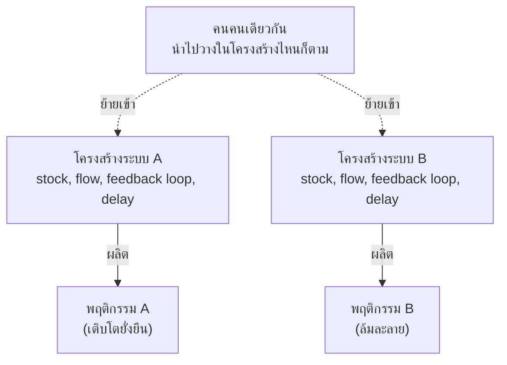

สองบริษัท สินค้าเหมือนกันเป๊ะ ทีมขายเก่งพอกัน งบการตลาดเท่ากัน — บริษัท A ทำกำไรสม่ำเสมอมา 5 ปี บริษัท B ล้มละลายภายในปีที่สอง ถ้าให้ทายว่าอะไรต่างกัน คนส่วนใหญ่จะรีบมองหา "คนที่ผิด" — ผู้บริหารเก่งกว่า พนักงานขยันกว่า แต่ Systems Thinking ชวนถามคำถามที่ต่างออกไปโดยสิ้นเชิง: **โครงสร้าง**ของสองบริษัทนี้ต่างกันตรงไหน?

## หลักการที่เป็นแกนกลางของทั้ง Track นี้

**"Structure produces behavior"** — โครงสร้างของระบบเป็นตัวผลิตพฤติกรรมของระบบออกมา ไม่ใช่ความตั้งใจดีหรือความสามารถส่วนบุคคลของคนในระบบ นี่คือหลักการที่สำคัญที่สุดข้อเดียวในวิชา Systems Thinking ทั้งหมด — ถ้าจำได้แค่ประโยคเดียวจาก track นี้ ให้จำประโยคนี้

ความหมายที่ลึกกว่านั้นคือ: **เอาคนเก่งแค่ไหนก็ตาม ใส่เข้าไปในโครงสร้างที่ผิด ก็ได้พฤติกรรมแบบเดิม** — สลับคนในบริษัท B ไปอยู่บริษัท A พฤติกรรมของคนกลุ่มนั้นจะเปลี่ยนตามโครงสร้างใหม่ที่พวกเขาอยู่ ไม่ใช่ว่าคนกลุ่มนั้น "ไม่เก่งพอ" อยู่แล้วในตัวเอง นี่คือสิ่งที่ต่างจากสัญชาตญาณของคนส่วนใหญ่อย่างสิ้นเชิง เพราะสัญชาตญาณมักโทษ "คน" (blame the person) ก่อนเสมอ ทั้งที่ควรถามหา "โครงสร้าง" (blame the structure) ก่อน

## ตัวอย่างคลาสสิก: สองทีมวิศวกรที่มีคนเก่งเท่ากัน

ย้อนกลับไปที่ตัวอย่างจากหัวข้อก่อนหน้า — ทีม A ที่ทุก merge ต้องผ่านหัวหน้าคนเดียว vs ทีม B ที่ review กันเองแบบกระจาย ทั้งสองทีมมี "คน" (element) เหมือนกัน ต่างกันแค่ "โครงสร้างการไหลของงาน" (structure) แต่พฤติกรรมที่ออกมาต่างกันคนละเรื่อง — นี่ไม่ใช่เรื่องบังเอิญ นี่คือกลไกที่ทำงานตามหลักการเดียวกันเป๊ะ: โครงสร้างกำหนดพฤติกรรม

หลักการนี้อธิบายได้ด้วยว่าทำไม "การแก้ปัญหาด้วยการเปลี่ยนคน" (ไล่ออก จ้างใหม่ ปั้นฮีโร่คนใหม่มากู้สถานการณ์) มักไม่ได้ผลถาวร — ถ้าโครงสร้างเดิมยังอยู่ คนใหม่ที่เข้ามาก็จะค่อยๆ ถูก "ปั้น" ให้แสดงพฤติกรรมแบบเดิมออกมาอีกภายในเวลาไม่นาน เหมือนน้ำที่เทลงแม่พิมพ์ ไม่ว่าจะเทน้ำชนิดไหนลงไป รูปทรงที่ออกมาก็เป็นไปตามแม่พิมพ์เสมอ

## ทำไมเรื่องนี้ถึงปลดปล่อยเราจากการโทษคนได้

มุมมองนี้ไม่ได้แปลว่า "คนไม่สำคัญเลย" — คนสำคัญมาก แต่มันเปลี่ยนคำถามแรกที่ควรถามเวลาระบบมีปัญหา จากเดิมที่ถาม **"ใครทำพลาด"** เป็น **"โครงสร้างอะไรที่ทำให้ความพลาดแบบนี้เกิดขึ้นได้ง่าย หรือถึงขั้นแทบเป็นไปไม่ได้ที่จะไม่พลาด"**

| คำถามแบบเดิม (โทษคน) | คำถามแบบ Systems Thinking (โทษโครงสร้าง) |
|---|---|
| ใครลืม review โค้ดจนบั๊กหลุด production | มี gate อะไรบ้างก่อน merge? ทำไม gate นั้นถึงพลาดได้ |
| ทำไมทีมนี้ delivery ช้าตลอด | dependency ระหว่างทีมเป็นยังไง มี bottleneck ตรงไหนที่ทุกงานต้องผ่าน |
| ทำไม on-call คนนี้ตอบสนองช้า | escalation path ยาวกี่ขั้น กว่าจะถึงคนที่แก้ปัญหาได้จริง |

คำถามฝั่งขวาไม่ได้แปลว่าไม่มีใครต้องรับผิดชอบ แต่มันนำไปสู่ทางแก้ที่**ถาวรกว่า** — เพราะแก้ที่โครงสร้าง ผลจะคงอยู่ไม่ว่าใครจะมาอยู่ในระบบนั้นในอนาคต ต่างจากการแก้ที่ตัวคน ซึ่งปัญหามีโอกาสย้อนกลับมาทันทีที่คนคนนั้นออกจากระบบไป หรือแม้แต่คนเดิมก็ยังพลาดซ้ำถ้าโครงสร้างเดิมยังกดดันให้พลาดอยู่ดี

## เชื่อมไปข้างหน้า

สามหัวข้อในโมดูลนี้ประกอบกันเป็นรากฐานของทั้ง track: **element/interconnection/purpose คือส่วนประกอบของระบบ**, **systems thinking คือการมองหาวงป้อนกลับที่ linear thinking มองไม่เห็น**, และ **structure produces behavior คือเหตุผลว่าทำไมเราต้องสนใจโครงสร้างมากกว่าตัวบุคคล** — สามโมดูลถัดไป (Stocks & Flows, Feedback Loops, Behavior Patterns) จะให้ "คำศัพท์" ที่แม่นยำสำหรับพูดถึงโครงสร้างเหล่านี้ แทนคำว่า "โครงสร้าง" แบบกว้างๆ ที่ยังจับต้องไม่ได้ในตอนนี้
