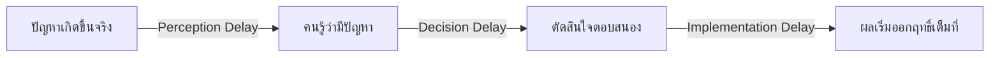

เปิดฝักบัวน้ำอุ่นในโรงแรมเก่าๆ ที่ท่อยาวมาก — บิดวาล์วไปทางร้อน น้ำยังเย็นอยู่พักหนึ่ง คุณบิดเพิ่มอีกเพราะคิดว่ายังไม่พอ อีกไม่กี่วินาทีน้ำร้อนจัดจนต้องรีบบิดกลับ แล้ววนซ้ำแบบนี้ไปมาหลายรอบกว่าจะได้อุณหภูมิที่พอดี — นี่คือประสบการณ์ตรงของทุกคนกับสิ่งที่ Systems Thinking เรียกว่า **delay** และเป็นสาเหตุอันดับต้นๆ ที่ทำให้คนตัดสินใจผิดพลาดซ้ำแล้วซ้ำเล่าในระบบที่ซับซ้อน

## Delay คืออะไร

**Delay** คือช่วงเวลาที่ผ่านไประหว่างตอนที่คุณเปลี่ยน flow (บิดวาล์ว) กับตอนที่ผลของการเปลี่ยนนั้นสะท้อนกลับมาที่ stock ที่คุณสังเกตอยู่ (อุณหภูมิน้ำที่ผิวหนังสัมผัส) ปัญหาไม่ได้อยู่ที่ delay มีอยู่จริง (มันมีอยู่ในระบบเกือบทุกระบบ) แต่อยู่ที่**คนมักไม่รู้ตัวว่ามี delay** จึงตัดสินใจซ้ำเร็วเกินไปก่อนที่ผลของการตัดสินใจครั้งก่อนจะแสดงออกมาครบ

```demo
component: StockFlowDiagram
props: {"stocks":[{"id":"temp","label":"อุณหภูมิที่สัมผัส","x":420,"y":150,"note":"stock ที่สังเกต"}],"flows":[{"id":"in","label":"น้ำร้อนจากวาล์ว","x1":150,"y1":150,"x2":360,"y2":150,"rateLabel":"เดินทางผ่านท่อยาว = delay"}],"clouds":[{"x":100,"y":150}],"infoLinks":[{"x1":420,"y1":118,"x2":170,"y2":118}]}
caption: เส้นประ (information link) คือสิ่งที่คนมองข้าม — ผลของการบิดวาล์วไม่ได้ย้อนกลับมาที่มือทันที ต้องรอน้ำเดินทางผ่านท่อก่อน
```

## Delay สามแบบที่พบบ่อยในระบบซอฟต์แวร์/องค์กร

1. **Perception delay** — เวลาที่ใช้กว่าจะ "รู้" ว่ามีปัญหาเกิดขึ้น เช่น metric dashboard ที่ update ทุก 5 นาที ทำให้รู้ปัญหาช้ากว่าที่ปัญหาเกิดจริง 5 นาทีเต็ม
2. **Decision/response delay** — เวลาที่ใช้กว่าองค์กรจะตัดสินใจตอบสนอง เช่น ต้องรอ approval หลายชั้นก่อนจะเพิ่ม server ได้
3. **Implementation/effect delay** — เวลาที่ใช้กว่าการตัดสินใจจะออกฤทธิ์เต็มที่ เช่น จ้างพนักงานใหม่แล้วต้องรอ onboarding 2-3 เดือนกว่าจะ productive เต็มตัว

ระบบหนึ่งระบบมักมี delay ทั้งสามแบบซ้อนกันอยู่ ยิ่งซ้อนกันมากเท่าไหร่ ยิ่งทำนายผลของการตัดสินใจได้ยากขึ้นเท่านั้น เพราะกว่าจะเห็นผลเต็มที่ อาจมีการตัดสินใจใหม่ทับซ้อนเข้าไปอีกหลายชั้นแล้ว



## ทำไม Delay ถึงเป็นสาเหตุของการ "แก้เกินจำเป็น" (overcorrection)

พอไม่เห็นผลทันทีหลังตัดสินใจ ปฏิกิริยาตามธรรมชาติของคนคือคิดว่า "ยังทำน้อยไป" แล้วตัดสินใจซ้ำแรงขึ้นอีก — พอผลของทั้งสองรอบมาถึงพร้อมกันในที่สุด (เพราะ delay ทำให้มันมาถึงช้า) ผลที่ได้จะ**เกินความต้องการไปไกล** เหมือนฝักบัวที่ร้อนจัดเกินไปในตัวอย่างเปิดเรื่อง

เคสจริงในงานวิศวกรรม: ทีมเห็น latency สูงขึ้นผ่าน dashboard ที่ update ทุก 10 นาที (perception delay) จึงเพิ่ม server ทันที (decision) แต่ autoscaling ใหม่ต้องใช้เวลา 5 นาทีกว่า instance จะพร้อมรับ traffic จริง (implementation delay) ระหว่างที่รอ ทีมเห็น dashboard รอบถัดไปยัง "แดง" อยู่ (เพราะข้อมูลยัง lag) จึงเพิ่ม server อีกรอบ — พอทุกอย่างมาถึงพร้อมกันในที่สุด กลายเป็น over-provision เกินความจำเป็นไปมาก ต้นทุน cloud พุ่งจนต้องมานั่งไล่ปิด instance ทีหลัง

| จุดที่มี Delay | ผลถ้าไม่รู้ตัว |
|---|---|
| Autoscaling policy | Over-provision (scale เกิน) หรือ under-provision (scale ไม่ทันจนล่ม) |
| Hiring pipeline | จ้างพร้อมกันหลายรอบเพราะคิดว่ารอบแรก "ไม่พอ" ทั้งที่แค่ยัง onboard ไม่เสร็จ |
| Feature rollout ที่วัดผลจาก A/B test | สรุปผลเร็วเกินไปก่อน sample size /novelty effect หมดฤทธิ์ ตัดสินใจ rollback หรือ rollout เต็มที่ผิดจังหวะ |
| การขึ้นราคาสินค้า | ลูกค้าตอบสนอง (churn) ช้ากว่าที่คาด ทำให้บริษัทคิดว่าขึ้นราคาได้อีกทั้งที่ผลกระทบเต็มๆ ยังมาไม่ถึง |

## หลักปฏิบัติ: รู้ delay ก่อนตัดสินใจซ้ำ

บทเรียนที่นำไปใช้ได้ทันทีคือ ก่อนจะตัดสินใจปรับ flow ซ้ำรอบสอง ให้ถามตัวเองก่อนเสมอว่า **"การตัดสินใจรอบแรกมีเวลาออกฤทธิ์เต็มที่หรือยัง"** — ถ้ายัง ให้รอก่อน อย่ารีบแก้ซ้ำ เพราะสิ่งที่กำลังเห็นอยู่อาจเป็นแค่ผลบางส่วนของรอบแรกที่ยังไม่ครบ ไม่ใช่สัญญาณว่ารอบแรก "ทำน้อยไป" จริงๆ

โมดูลถัดไป **Feedback Loops** จะรวม stock, flow, และ delay ที่เรียนมาทั้งหมดในโมดูลนี้ เข้าเป็นภาพเดียว — เพราะ feedback loop ที่มี delay ซ้อนอยู่ คือต้นเหตุของพฤติกรรมระบบที่แปลกประหลาดที่สุดหลายแบบที่จะได้เห็นตลอด track นี้ ตั้งแต่ oscillation ไปจนถึง overshoot and collapse
