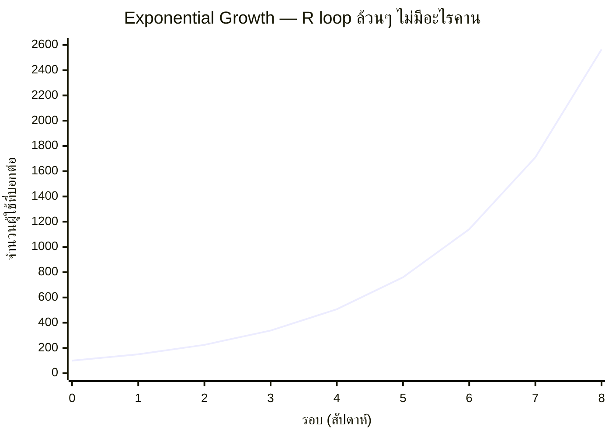

โมดูลก่อนหน้าสอนให้รู้จัก "โครงสร้าง" (R loop, B loop, delay) — โมดูลนี้จะพาไปดูว่าโครงสร้างแต่ละแบบ**ผลิตกราฟพฤติกรรมหน้าตายังไง** เมื่อพล็อตออกมาตามเวลาจริง เพราะสุดท้ายแล้ว สิ่งที่คนในองค์กรมองเห็นและตัดสินใจตามคือกราฟ ไม่ใช่ไดอะแกรมโครงสร้างที่ซ่อนอยู่เบื้องหลัง

## Reinforcing Loop ล้วนๆ ผลิตกราฟทรงนี้เสมอ

จำ tech debt spiral และดอกเบี้ยทบต้นจากโมดูลก่อนได้ไหม — ทั้งสองคือ pure reinforcing loop ไม่มี balancing loop มาคานเลย เมื่อพล็อตค่าตามเวลา จะได้กราฟที่มีรูปร่างเฉพาะตัวเสมอ:

สังเกตรูปร่าง: ช่วงแรกดูเหมือน "ไม่เห็นอะไรพิเศษ" เส้นแทบราบ แต่พอผ่านไปสักพัก เส้นเริ่มชันขึ้นเรื่อยๆ แบบที่ตาเปล่ามองแล้วรู้สึกว่า "จู่ๆ ก็พุ่ง" — นี่ไม่ใช่การพุ่งแบบกะทันหัน มันคือผลลัพธ์ตามธรรมชาติของ R loop ที่ค่าใหม่ = ค่าเดิม × (1 + อัตราคงที่) เสมอ เพียงแต่สมองมนุษย์คาดเดากราฟแบบนี้ได้แย่มาก — เราถูกวิวัฒนาการมาให้คาดเดาแบบเส้นตรง (linear) ไม่ใช่แบบทวีคูณ (exponential)

## กับดักที่มากับกราฟทรงนี้: "ดูเหมือนยังช้าอยู่" ในช่วงต้น

นี่คือสาเหตุที่ทีมมักไม่รีบเตรียมรับมือ exponential growth จนสายเกินไป — สมมติ error rate ของระบบเพิ่มขึ้น 50% ทุกสัปดาห์จาก R loop บางอย่าง (เช่น connection leak ที่ยิ่งมี error ยิ่งมี retry ยิ่งมี load ยิ่งมี error) สัปดาห์แรกๆ ตัวเลขยังเล็กมาก (0.1% → 0.15% → 0.23%) ดูไม่น่ากังวล ทีมมักเลื่อนการแก้ไปก่อน แต่พอถึงสัปดาห์ที่ 8 ตัวเลขอาจกระโดดจาก 2% เป็น 3% เป็น 4.5% ในเวลาไม่กี่วัน เพราะฐานที่ใช้คูณ 1.5 ตอนนี้ใหญ่กว่าตอนต้นมาก — **สัดส่วนการเติบโตเท่าเดิม (50%) แต่ค่าสัมบูรณ์ที่เพิ่มขึ้นในแต่ละรอบใหญ่ขึ้นเรื่อยๆ**

## Rule of 70: ทางลัดประเมิน exponential growth แบบเร็วๆ

ถ้ารู้อัตราการเติบโตต่อรอบเป็นเปอร์เซ็นต์ (r%) จำนวนรอบที่ค่าจะ**เพิ่มเป็นสองเท่า**ประมาณได้คร่าวๆ จาก **70 ÷ r**

| อัตราเติบโตต่อรอบ | จำนวนรอบที่ค่าจะโตเป็น 2 เท่า |
|---|---|
| 2% | ~35 รอบ |
| 5% | ~14 รอบ |
| 10% | ~7 รอบ |
| 25% | ~2.8 รอบ |
| 50% | ~1.4 รอบ |

สูตรนี้ใช้ประเมินได้ทั้งด้านดี (ผู้ใช้โต 10%/เดือน จะเพิ่มเป็นสองเท่าใน ~7 เดือน วางแผน capacity ล่วงหน้าได้) และด้านที่ต้องระวัง (error rate โต 25%/สัปดาห์ จะเพิ่มเป็นสองเท่าใน ~3 สัปดาห์ — เร็วกว่าที่คนส่วนใหญ่คาดเดาด้วยสัญชาตญาณมาก)

## แต่ Exponential Growth ไม่มีวันดำเนินต่อไปตลอดกาล

จุดสำคัญที่ต้องรู้ไว้ก่อนไปหัวข้อถัดไปคือ: **ไม่มี exponential growth ตัวไหนในโลกจริงที่ดำเนินต่อไปตลอดกาล** เพราะมันฝ่าฝืนกฎฟิสิกส์พื้นฐาน — ถ้าผู้ใช้โตแบบทวีคูณไปเรื่อยๆ ในที่สุดจะมีผู้ใช้มากกว่าประชากรโลก ถ้า cache size โตแบบทวีคูณไปเรื่อยๆ ในที่สุดจะกินพื้นที่มากกว่า RAM ที่มีอยู่จริง — เสมอมี**ขีดจำกัดตามธรรมชาติ** (carrying capacity) ที่รอสกัดกั้นอยู่ข้างหน้า คำถามที่สำคัญกว่าคือ **ระบบจะเข้าใกล้ขีดจำกัดนั้นอย่างนุ่มนวล (goal-seeking) หรือพุ่งชนแบบควบคุมไม่ได้ (overshoot and collapse)** — สองหัวข้อถัดไปในโมดูลนี้จะตอบคำถามนั้น
