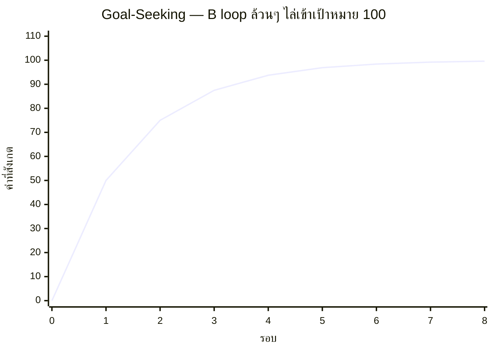

เครื่องปรับอากาศจากหัวข้อ Balancing Loop — ไม่ว่าอุณหภูมิเริ่มต้นจะเป็น 20°C หรือ 35°C สุดท้ายมันจะค่อยๆ ไต่เข้าใกล้ 25°C เสมอ และเมื่อใกล้ถึงเป้าหมายแล้ว ความเร็วในการเปลี่ยนแปลงจะ**ช้าลงเรื่อยๆ** ไม่ใช่หยุดกะทันหัน — นี่คือกราฟพฤติกรรมของ pure balancing loop เรียกว่า **Goal-Seeking Behavior**

## กราฟทรงนี้มาจากไหน

สูตรเบื้องหลังคือ: **ค่าใหม่ = ค่าเดิม + (เป้าหมาย − ค่าเดิม) × strength** — สังเกตว่าตัวคูณ "เป้าหมาย − ค่าเดิม" คือ gap ที่ยิ่งใกล้เป้าหมายยิ่งเล็กลง ทำให้ก้าวกระโดดแต่ละรอบเล็กลงเรื่อยๆ โดยอัตโนมัติ นี่คือความต่างสำคัญจาก exponential growth ที่ก้าวกระโดดใหญ่ขึ้นเรื่อยๆ — goal-seeking behavior คือ "ภาพสะท้อนในกระจก" ของ exponential growth พอดี (โตแบบทวีคูณเข้าหาศูนย์ แทนที่จะออกจากศูนย์)

## ทำไม Goal-Seeking Behavior คือสิ่งที่นักออกแบบระบบอยากได้มากที่สุด

Goal-seeking behavior คือลายเซ็นของระบบที่**คาดเดาได้และควบคุมได้** — <mark class="hl-insight">ไม่ว่าจุดเริ่มต้นจะเลวร้ายแค่ไหน (โหลดพุ่ง, error สูง, backlog บาน) ถ้าระบบมี balancing loop ที่แข็งแรงพอและไม่มี delay มากเกินไป มันจะค่อยๆ ไต่กลับเข้าสู่สภาวะที่ยอมรับได้เองโดยไม่ต้องมีใครเข้าไปแทรกแซงซ้ำๆ</mark>

| ระบบ | เป้าหมายที่ไล่เข้าหา | กลไก B loop |
|---|---|---|
| Autoscaling | CPU utilization เป้าหมาย (เช่น 60%) | เพิ่ม/ลด instance ตาม gap |
| TCP congestion control | throughput ที่เครือข่ายรับไหว | ลด window size เมื่อ packet loss, เพิ่มเมื่อไม่มี loss |
| Retry with backoff | สำเร็จภายในจำนวนครั้งที่กำหนด | หน่วงเวลาระหว่าง retry เพิ่มขึ้นเรื่อยๆ ตาม gap ของความล้มเหลว |
| การจัดสรร sprint capacity | velocity ที่ทีมทำได้จริงต่อ sprint | ปรับ commitment ตาม gap ระหว่างแผนกับผลจริง sprint ก่อน |

## ข้อควรระวัง: Goal-Seeking ที่ "ช้าเกินไป" ก็เป็นปัญหา

ความเร็วในการไล่เข้าเป้าหมาย (strength ของ loop) มีผลมาก — strength ต่ำเกินไป ระบบจะไล่เข้าเป้าหมายช้ามาก ผู้ใช้ทนสภาวะไม่ดีนานเกินจำเป็น (เช่น autoscaling ที่ scale ทีละ 1 instance ตอน traffic พุ่งแรง ทำให้ผู้ใช้เจอ latency สูงนานหลายนาทีก่อนจะกลับสู่ปกติ) แต่<mark class="hl-warning">strength สูงเกินไป (ปรับแรงเกินไปในแต่ละรอบ) จะทำให้กราฟไม่ไล่เข้าเป้าหมายอย่างนุ่มนวลอีกต่อไป แต่จะแกว่งเลยเป้าหมายไปมา</mark> — ซึ่งคือพฤติกรรมของหัวข้อถัดไปพอดี: **Oscillation**
