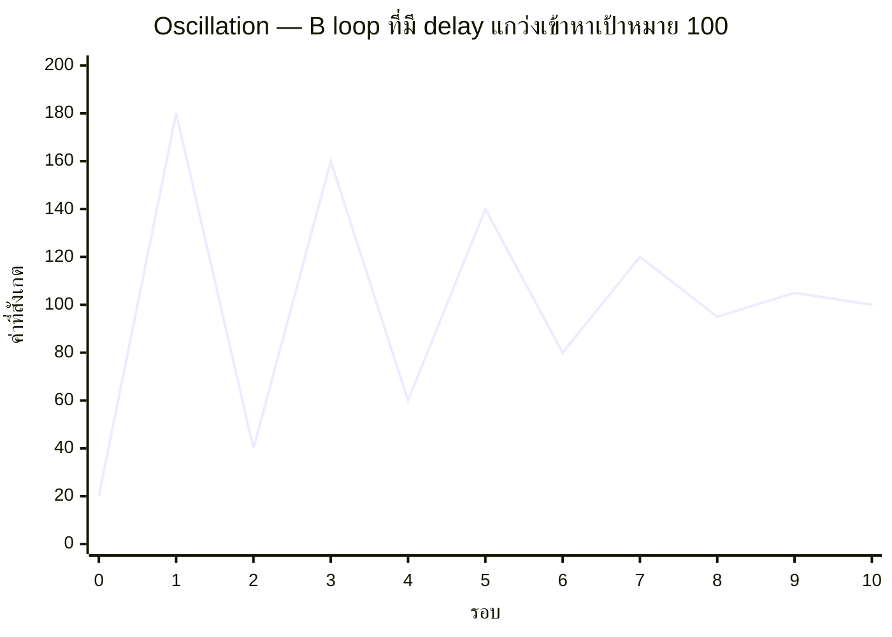

ฝักบัวน้ำอุ่นโรงแรมเก่าที่เจอในหัวข้อ Delay — บิดร้อนไป เย็นไป ร้อนไป เย็นไป กว่าจะนิ่งที่อุณหภูมิพอดี นี่คือกราฟพฤติกรรมที่ได้จากการรวมสองอย่างเข้าด้วยกัน: **Balancing Loop + Delay** เรียกว่า **Oscillation**

## กราฟทรงนี้มาจากไหน

เทียบกับ goal-seeking behavior ในหัวข้อก่อน (ที่ไล่เข้าเป้าหมายอย่างนุ่มนวล) กราฟนี้**แกว่งข้ามเป้าหมายไปมา**ก่อนจะค่อยๆ นิ่งลง (ถ้าโชคดี) — <mark class="hl-insight">ความต่างเดียวระหว่างสองกราฟนี้คือ delay ที่แทรกอยู่ในวง ทำให้ระบบ "แก้" ตามข้อมูลที่ล้าสมัยไปแล้วเสมอ พอแก้เสร็จ สถานการณ์จริงเปลี่ยนไปแล้ว จึงต้องแก้กลับทิศอีกที วนซ้ำแบบนี้ไปเรื่อยๆ</mark>

## Oscillation สามระดับ: หายเอง, คงตัว, หรือยิ่งแกว่งยิ่งแรง

Oscillation ไม่ได้มีแบบเดียว ขึ้นอยู่กับว่า amplitude (ขนาดการแกว่ง) ของแต่ละรอบเป็นยังไงเทียบกับรอบก่อน:

- **Damped oscillation (แกว่งหายเอง)** — amplitude เล็กลงทุกรอบ สุดท้ายนิ่งที่เป้าหมาย นี่คือแบบที่กราฟด้านบนแสดง เป็นแบบที่ยอมรับได้ในระบบจริง
- **Sustained oscillation (แกว่งคงตัว)** — amplitude เท่าเดิมทุกรอบ ไม่มีวันนิ่ง ระบบทำงานได้แต่ไม่เสถียร ผู้ใช้จะรู้สึกถึงความไม่แน่นอนตลอด
- **Growing oscillation (แกว่งยิ่งแรง)** — amplitude ใหญ่ขึ้นทุกรอบ อันตรายที่สุด เพราะสุดท้ายจะแกว่งจนหลุดขอบเขตที่ระบบรับไหว (ไปเจอ overshoot and collapse ในหัวข้อถัดไป)

## ตัวอย่างจริง: Thundering Herd จาก Cache ที่ Expire พร้อมกัน

เคสคลาสสิกในงานวิศวกรรม: cache ทุกตัวถูกตั้งให้หมดอายุพร้อมกันเป๊ะ (TTL เท่ากันหมด, set พร้อมกันตอน deploy) พอ cache expire ทุก request ที่เข้ามาพร้อมกันตอนนั้นพุ่งไปที่ database ตรงๆ (cache miss พร้อมกันหมด) database รับโหลดหนักจนตอบช้า ทีมเห็นแล้วรีบเพิ่ม cache TTL ให้นานขึ้นเพื่อลดความถี่การ expire — แต่พอรอบถัดไปมาถึง (เพราะยังตั้งให้ expire พร้อมกันอยู่ดี) ปัญหาเดิมเกิดซ้ำ แค่ห่างขึ้น ทีมจึงตัดสินใจลด TTL ลงเพื่อให้ "ค่อยๆ ทยอย expire แทน" สลับไปมาหลายรอบกว่าจะรู้ว่า<mark class="hl-term">ทางแก้ที่แท้จริงไม่ใช่การปรับ TTL แต่คือการ**สุ่มกระจาย** เวลา expire ของแต่ละ cache entry ไม่ให้ตรงกันเป๊ะ (jitter)</mark> — แก้ที่โครงสร้างของปัญหา ไม่ใช่ไล่ปรับตัวเลขไปมา

| สัญญาณของ Oscillation | ทางแก้ที่มักได้ผลจริง |
|---|---|
| Autoscaling ที่ scale up/down สลับถี่ๆ (flapping) | เพิ่ม cooldown period, ใช้ hysteresis (threshold ขึ้น/ลงไม่เท่ากัน) |
| Cache ที่ thundering herd ซ้ำเป็นจังหวะ | เพิ่ม jitter ให้ TTL แต่ละ entry ไม่ expire พร้อมกัน |
| Retry storm ที่ทุก client retry พร้อมกันเป๊ะหลัง timeout เท่ากัน | Exponential backoff + jitter แบบสุ่ม ไม่ใช่ค่าคงที่ |
| ทีมที่สลับ priority ระหว่าง "เร่ง feature" กับ "เร่งแก้บั๊ก" ทุกไตรมาส | จัดสรรสัดส่วนคงที่ล่วงหน้า (เช่น 70/30) แทนการแกว่งตามอารมณ์ล่าสุด |

สังเกตแพทเทิร์นร่วม: ทางแก้ที่ได้ผลจริงมักคือการ**ลด delay** หรือ **เพิ่มความสุ่ม/กระจาย** ไม่ใช่การไล่ปรับตัวเลขแรง/เบาไปมา ซึ่งมักยิ่งทำให้ oscillation แย่ลงถ้าทำโดยไม่เข้าใจว่าโครงสร้างจริงคืออะไร

หัวข้อสุดท้ายของโมดูลนี้จะพาไปดูพฤติกรรมที่อันตรายที่สุดในกลุ่มนี้ทั้งหมด — เมื่อ reinforcing loop วิ่งไปชนขีดจำกัดตามธรรมชาติแบบที่ balancing loop ตอบสนองไม่ทัน
