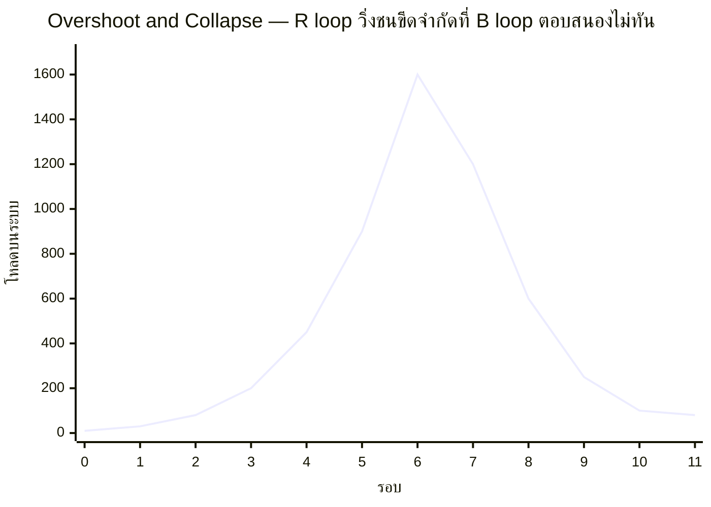

สตาร์ทอัพหนึ่งเติบโตผู้ใช้แบบ exponential (R loop จาก viral growth) ทีมดีใจ ระดมทุนเพิ่ม ขยายทีมตามผู้ใช้ที่พุ่ง แต่ไม่มีใครสังเกตว่า database หลักกำลังใกล้ขีดจำกัดการเชื่อมต่อพร้อมกัน (connection limit) จนวันหนึ่ง traffic ทะลุขีดจำกัดนั้น — ระบบทั้งหมดล่มพร้อมกัน ผู้ใช้ที่หนีไปใช้คู่แข่งระหว่างระบบล่มไม่กลับมาอีก จำนวนผู้ใช้ที่เคยพุ่งแบบทวีคูณ กลับดิ่งลงแรงกว่าตอนขึ้นเสียอีก — นี่คือ **Overshoot and Collapse** พฤติกรรมที่อันตรายที่สุดในบรรดาทั้งสี่แบบที่เรียนมาในโมดูลนี้

## กราฟทรงนี้มาจากไหน

โครงสร้างเบื้องหลังคือ **R loop ที่วิ่งเร็วกว่า B loop ที่ควรจะมาคาน** — ทุกระบบมีขีดจำกัดตามธรรมชาติ (carrying capacity) เสมอ ถ้า balancing loop ที่ควรตรวจจับและชะลอการเติบโตก่อนถึงขีดจำกัดนั้น **ตอบสนองไม่ทัน** (เพราะ delay ในการรับรู้ปัญหา, หรือ loop นั้นไม่มีอยู่เลยตั้งแต่แรก) ระบบจะพุ่งทะลุขีดจำกัดไปก่อนจะรู้ตัว แล้ว "ชน" กำแพงที่มองไม่เห็นล่วงหน้าอย่างรุนแรง

## ทำไม Collapse ถึงมักแรงกว่าตอนขึ้น

จุดที่ทำให้พฤติกรรมนี้อันตรายเป็นพิเศษคือช่วงขาลงมักดิ่งเร็วกว่าช่วงขาขึ้นมาก เพราะตอนระบบยังโตอยู่ มีแค่ R loop เดียวที่ขับเคลื่อน แต่พอชนขีดจำกัดแล้ว มักมี**อีก R loop หนึ่งที่ทำงานสวนทาง**เข้ามาซ้อน เช่นในเคสสตาร์ทอัพ: ระบบล่ม → ผู้ใช้หนีไปคู่แข่ง → ผู้ใช้ที่เหลือเห็นเพื่อนหนีไปก็ยิ่งไม่มั่นใจ ยิ่งหนีตาม (reinforcing loop ฝั่งขาลง) — สองแรงที่สวนทางกันแต่มีธรรมชาติเดียวกัน (reinforcing) ทำให้ขาลงมักชันกว่าขาขึ้นเสมอ

## ตัวอย่างจริงในงานวิศวกรรม

| เคส | R loop ฝั่งขึ้น | ขีดจำกัดที่ไม่ทันเห็น | ผลตอนชน |
|---|---|---|---|
| Database connection pool | traffic โต → เปิด connection ใหม่เรื่อยๆ | max connection ของ database | connection ใหม่ถูกปฏิเสธหมด ทั้งระบบตอบสนองไม่ได้พร้อมกัน |
| Memory leak ที่ไม่รู้ตัว | request เข้ามาเรื่อยๆ สะสม object ที่ไม่ถูกเก็บกวาด | RAM ของเครื่อง | process ถูก OOM-kill กะทันหัน service หายไปทั้งตัว |
| Message queue ที่ consumer ตามไม่ทัน | producer ส่งเร็วขึ้นเรื่อยๆ ตาม business growth | disk space ที่เก็บ queue | broker เต็ม เขียนข้อความใหม่ไม่ได้ ทั้งระบบหยุดชะงัก |
| Viral marketing campaign | คนแชร์เพิ่มเรื่อยๆ | server capacity ที่เตรียมไว้ | ระบบล่มตอน traffic พีคที่สุด (ตอนที่ต้องการมันมากที่สุดพอดี) |

## บทเรียนสำคัญ: หาขีดจำกัดให้เจอ ก่อนที่ระบบจะหาให้คุณ

ข้อสรุปเชิงปฏิบัติจากพฤติกรรมนี้คือ ทุกครั้งที่เห็น R loop กำลังทำงานได้ดี (growth ดี, traffic ดี) คำถามที่ต้องถามคู่กันเสมอคือ **"ขีดจำกัดตามธรรมชาติของระบบนี้อยู่ตรงไหน และเรารู้ระยะห่างจากขีดจำกัดนั้นแบบ real-time หรือเปล่า"** — capacity planning, load testing, และการตั้ง alert ที่เตือนล่วงหน้าก่อนถึงขีดจำกัด (ไม่ใช่แค่ alert ตอนพังไปแล้ว) คือวิธีสร้าง balancing loop ที่ตอบสนองทันเวลา แทนที่จะปล่อยให้ระบบไปค้นพบขีดจำกัดด้วยตัวเองผ่านการพังจริง

โมดูลนี้ปิดท้ายด้วยพฤติกรรมทั้งสี่แบบที่ทุกระบบผลิตออกมาได้จากโครงสร้างพื้นฐานเดียวกัน (R loop, B loop, delay) — โมดูลถัดไป **Systems Archetypes** จะพาไปดูว่าโครงสร้างเหล่านี้มักประกอบกันเป็น "แพทเทิร์นสำเร็จรูป" ที่พบซ้ำๆ ในองค์กรและระบบซอฟต์แวร์ทั่วโลก จนมีชื่อเรียกเฉพาะของตัวเองแต่ละแบบ
