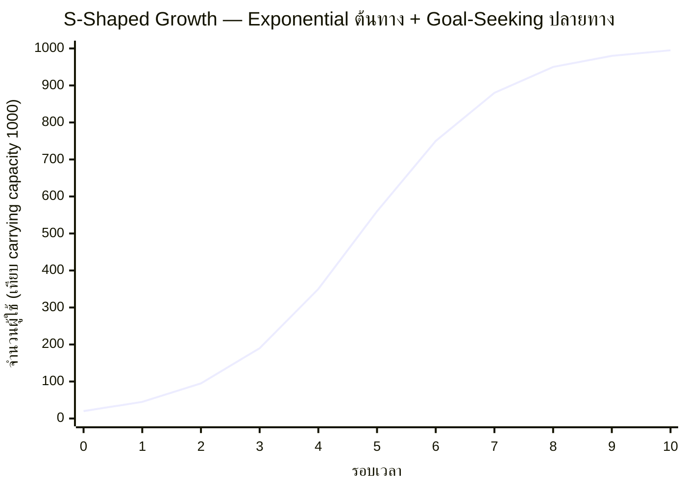

บทเรื่อง Exponential Growth ทิ้งคำถามค้างไว้ท้ายบท: **ไม่มี exponential growth ตัวไหนดำเนินต่อไปตลอดกาล** เพราะมันฝ่าฝืนกฎฟิสิกส์พื้นฐาน แล้วคำถามคือ พอระบบเข้าใกล้ carrying capacity มันจะเข้าใกล้แบบนุ่มนวลหรือพุ่งชนแบบควบคุมไม่ได้ — บทนี้จะตอบครึ่งแรกของคำถามนั้น: เมื่อระบบเข้าใกล้ขีดจำกัดแบบนุ่มนวล กราฟที่ได้จะมีรูปทรงตัว S เสมอ

## S-curve คือ Exponential Growth ที่เจอ Goal-Seeking Behavior เข้าคาน

จำได้ไหมว่าบทก่อนๆ สอนสองรูปแบบพฤติกรรมแยกกัน: Exponential Growth (จาก R loop ล้วนๆ) กับ Goal-Seeking Behavior (จาก B loop ที่ดึงเข้าหาเป้าหมาย) <mark class="hl-term">**S-Shaped Growth (Logistic Growth)**</mark> คือสิ่งที่เกิดขึ้นเมื่อทั้งสองแบบทำงานพร้อมกันในระบบเดียว: ช่วงแรก R loop แรงกว่ามาก กราฟเลยพุ่งแบบ exponential เหมือนเดิม แต่พอเข้าใกล้ carrying capacity B loop เริ่มแรงขึ้นเรื่อยๆ จนมาคานสมดุลกับ R loop พอดี ทำให้กราฟค่อยๆ โค้งแบนเข้าหาเส้นขีดจำกัดอย่างนุ่มนวล



สังเกตรูปทรง: ครึ่งแรกของกราฟ (รอบ 0-5) หน้าตาเหมือน exponential growth เป๊ะๆ ทุกอย่าง — เร่งขึ้นเรื่อยๆ ไม่มีทีท่าจะช้าลง แต่พอผ่านรอบที่ 5 ไป กราฟเริ่ม "หักโค้ง" อย่างเห็นได้ชัด จากชันมากกลายเป็นค่อยๆ แบนลงจนเกือบราบสนิทที่ปลายทาง

## จุดเปลี่ยน (Inflection Point): กึ่งกลางพอดีของ S คือจุดที่ R Loop กับ B Loop มีแรงเท่ากัน

<mark class="hl-term">**Inflection Point**</mark> คือจุดกึ่งกลางของ S-curve — จุดที่กราฟเปลี่ยนจาก "โค้งเร่งขึ้น" (concave up) เป็น "โค้งชะลอลง" (concave down) พอดี ในทางโครงสร้างของระบบ จุดนี้คือช่วงเวลาที่ R loop กับ B loop มีแรงพอๆ กัน — ก่อนจุดนี้ R loop ยังแรงกว่า หลังจุดนี้ B loop เริ่มแรงกว่า

<mark class="hl-insight">จุดนี้สำคัญมากในทางปฏิบัติเพราะ**มันคือจุดที่ความเร็วการเติบโตสูงสุด**พอดี — ก่อนหน้านั้นยังเร่งอยู่ หลังจากนั้นเริ่มชะลอ ทีมที่วางแผน capacity ล่วงหน้าควรเตรียมรับความเร็วสูงสุดไว้ ณ ช่วงรอบ inflection point นี้ ไม่ใช่รอไปเตรียมตอนใกล้ carrying capacity ที่ความเร็วกำลังชะลอลงแล้ว</mark>

```demo
component: StepThroughDiagram
props: {"steps":[{"label":"ช่วงต้น (รอบ 0-3): เหมือน Exponential เป๊ะ","detail":"R loop แรงกว่า B loop มาก กราฟชันขึ้นเรื่อยๆ ไม่มีทีท่าจะช้าลงเลย — ตอนนี้แยกไม่ออกด้วยตาเปล่าว่าจะเป็น exponential ล้วนๆ หรือ S-curve"},{"label":"Inflection Point (รอบ ~5): R loop กับ B loop แรงเท่ากันพอดี","detail":"จุดที่ความเร็วการเติบโตสูงสุด — ก่อนหน้านี้ยังเร่งอยู่ หลังจากนี้เริ่มชะลอ นี่คือช่วงที่ทีม capacity planning ควรเตรียมรับความเร็วสูงสุดไว้"},{"label":"ช่วงชะลอ (รอบ 6-9): B loop เริ่มแรงกว่า R loop","detail":"กราฟเริ่มโค้งแบนลงเรื่อยๆ แม้ยังโตอยู่ก็ตาม — ทีมที่ยังคาดการณ์แบบ exponential ต่อจะเริ่มพลาดตอนนี้"},{"label":"เข้าใกล้ Carrying Capacity (รอบ 10): กราฟเกือบราบสนิท","detail":"B loop คานสมดุลกับ R loop เกือบเต็มที่ — ระบบเข้าใกล้ขีดจำกัดตามธรรมชาติอย่างนุ่มนวล ไม่ใช่พุ่งชนแบบ overshoot and collapse"}]}
```

## ตัวอย่างที่พบ S-curve บ่อยที่สุด

| บริบท | Carrying Capacity คืออะไร |
|---|---|
| Product adoption ในตลาด | จำนวนคนทั้งหมดที่เป็นกลุ่มเป้าหมายจริงๆ ของ product นั้น |
| แบคทีเรียในจานเพาะเชื้อ | อาหารและพื้นที่ที่มีจำกัดในจาน |
| ฟีเจอร์ใหม่ที่ roll out ในองค์กร | จำนวนพนักงานทั้งหมดที่งานเกี่ยวข้องกับฟีเจอร์นั้น |
| Cache hit rate ตอน warm-up | สัดส่วนสูงสุดที่ pattern การเข้าถึงข้อมูลจริงจะทำให้ cache hit ได้ |

## กับดัก: เข้าใจผิดว่ายังอยู่ช่วง Exponential ทั้งที่เข้าสู่ครึ่งหลังของ S-curve แล้ว

<mark class="hl-warning">เพราะครึ่งแรกของ S-curve กับ exponential growth ล้วนๆ มีหน้าตาแทบแยกไม่ออกด้วยตาเปล่า ทีมจำนวนมากยังคงคาดการณ์ (forecast) โดยสมมติว่ากราฟจะพุ่งต่อแบบ exponential ตลอดไป ทั้งที่ระบบกำลังเข้าใกล้ inflection point แล้ว</mark> ผลคือประเมิน capacity เกินจริงไปมาก (over-provision) หรือตั้งเป้ารายได้/ผู้ใช้ที่เป็นไปไม่ได้อีกต่อไปเพราะไม่เผื่อว่า B loop กำลังเริ่มเข้ามาคาน วิธีป้องกันคือตั้งคำถามเสมอว่า "carrying capacity ของระบบนี้คืออะไร" ตั้งแต่ต้น แทนที่จะรอให้กราฟบอกเองตอนที่สายเกินไปแล้ว

หัวข้อถัดไปจะพาไปดู **Oscillation** — พฤติกรรมอีกแบบที่เกิดขึ้นเมื่อ B loop มี delay มากเกินไปจนแทนที่จะเข้าใกล้เป้าหมายอย่างนุ่มนวลแบบ S-curve กลับแกว่งเลยเป้าไปมาซ้ำๆ แทน
