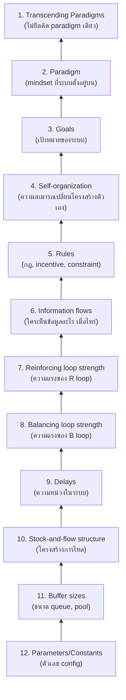

ทีมหนึ่งเจอปัญหา deploy fail บ่อย ใช้เวลาสามเดือนปรับ timeout config, retry count, threshold ต่างๆ นับสิบตัว — ทุกอย่างดีขึ้นนิดหน่อยแต่ปัญหาหลักยังอยู่ อีกทีมหนึ่งเจอปัญหาเดียวกัน แต่เปลี่ยนแค่ **กฎการ merge** ข้อเดียว (บังคับให้ CI ต้องเขียวก่อน merge เท่านั้น ไม่มีข้อยกเว้น) ปัญหาลดลง 80% ภายในเดือนเดียว — สองทีมนี้ใช้ความพยายามต่างกันมาก แต่เข้าไปแทรกแซงคนละ "จุด" ของระบบ และจุดที่ต่างกันนั้นให้ผลต่างกันมหาศาล

## Leverage Point คืออะไร

**Leverage Point** คือ<mark class="hl-term">จุดในระบบที่การเปลี่ยนแปลงเล็กๆ ตรงนั้น ส่งผลใหญ่หลวงต่อพฤติกรรมของทั้งระบบ</mark> — Donella Meadows จัดอันดับ leverage point ไว้ 12 ระดับ จากอ่อนที่สุด (ต้องออกแรงเยอะ ได้ผลน้อย) ไปถึงแรงที่สุด (ออกแรงน้อย ได้ผลมาก) เรียงจากล่างขึ้นบน

ลูกศรชี้จากอ่อนไปแรง — <mark class="hl-insight">ยิ่งอยู่ด้านบน (เลขน้อย) ยิ่งเป็นจุดที่แก้แล้วได้ผลมาก แต่ก็มักยากกว่าและมีแรงต้านมากกว่าด้วย</mark> (คนไม่ชอบให้แตะ "เป้าหมาย" หรือ "paradigm" ขององค์กรง่ายๆ)

## ตัวอย่างเทียบ leverage point แต่ละระดับกับปัญหาเดียวกัน

| ระดับ | ตัวอย่างการแทรกแซงสำหรับปัญหา "deploy fail บ่อย" | ผลที่มักได้ |
|---|---|---|
| 12. Parameters | ปรับ timeout ค่า retry, threshold ต่างๆ | เปลี่ยนแปลงเล็กน้อย ต้องปรับซ้ำหลายรอบ |
| 10. Stock-and-flow | เปลี่ยนวิธี queue การ deploy (deploy ทีละตัว vs. พร้อมกันหมด) | ลด blast radius ต่อครั้ง |
| 6. Information flows | ทำ dashboard แสดงผล deploy แบบ real-time ให้ทุกคนเห็น | ทีมรู้ปัญหาเร็วขึ้น ตอบสนองไวขึ้น |
| 5. Rules | บังคับ CI ต้องเขียวก่อน merge เสมอ ไม่มีข้อยกเว้น | เปลี่ยนพฤติกรรมทั้งทีมทันที ไม่ต้องพึ่งวินัยส่วนบุคคล |
| 3. Goals | เปลี่ยนเป้าหมายทีมจาก "ship เร็วที่สุด" เป็น "ship ที่ deploy สำเร็จ 99%" | เปลี่ยนการตัดสินใจทุกจุดในทีมให้สอดคล้องเป้าหมายใหม่โดยอัตโนมัติ |
| 2. Paradigm | เปลี่ยนมุมมองทีมจาก "deploy คือความเสี่ยงที่ต้องเลี่ยง" เป็น "deploy คือกิจวัตรที่ควรทำบ่อยๆ ให้ชิน" (มุมมองแบบ continuous deployment) | เปลี่ยนวัฒนธรรมทั้งทีม ส่งผลกว้างกว่าแค่ปัญหา deploy fail |

## ทำไมคนถึงติดกับดักไปแก้ที่ parameter เกือบทุกครั้ง

<mark class="hl-warning">Parameter (ระดับ 12) เป็นจุดที่คนเลือกแก้บ่อยที่สุดในโลกจริง ทั้งที่เป็นจุดที่มีแรงยกน้อยที่สุด</mark> เพราะมันมีเหตุผลเชิงปฏิบัติ: **แก้ง่ายที่สุด เห็นผลเร็วที่สุด ไม่ต้องขออนุมัติใคร** ต่างจากการเปลี่ยน rules หรือ goals ที่ต้องอาศัยอำนาจตัดสินใจระดับสูงกว่า มีแรงต้านจากคนที่คุ้นเคยกับของเดิม และเห็นผลช้ากว่า — นี่คือเหตุผลเชิงโครงสร้างที่ทำให้องค์กรจำนวนมากติดอยู่กับการ "ปรับ parameter ไปเรื่อยๆ" โดยไม่เคยแตะจุดที่จะแก้ปัญหาได้จริง

โมดูลนี้จะมีอีกสองหัวข้อ — หัวข้อถัดไปจะเจาะลึกความต่างระหว่าง parameter, structure, และ paradigm ให้ชัดขึ้น ก่อนจะปิดท้ายด้วยเคสจริงที่เปรียบเทียบผลของการแก้ผิดจุด vs ถูกจุดแบบเห็นภาพ
