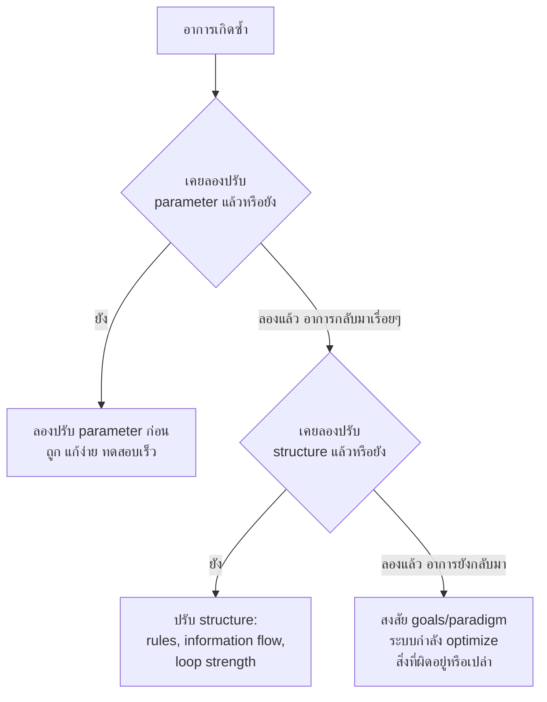

12 ระดับจากหัวข้อก่อนละเอียดเกินไปที่จะจำได้ทุกครั้งตอนต้องตัดสินใจเร็วๆ ในหน้างานจริง — หัวข้อนี้จะยุบให้เหลือ 3 กลุ่มใหญ่ที่ใช้งานได้จริงในชีวิตประจำวัน พร้อมกฎง่ายๆ ข้อเดียวที่บอกว่าเมื่อไหร่ควรขยับไปกลุ่มที่แรงกว่า

## สามกลุ่มที่ใช้งานได้จริง

| กลุ่ม | ครอบคลุมระดับ | ลักษณะ | ตัวอย่าง |
|---|---|---|---|
| **Parameters** | 12-9 | ตัวเลข ค่าคงที่ ความหน่วง — ปรับได้โดยคนเดียว ไม่ต้องขออนุมัติใคร | timeout, retry count, buffer size, cache TTL |
| **Structure** | 8-4 | ความแรงของ loop, การไหลของข้อมูล, กฎ, ความสามารถจัดโครงสร้างตัวเองใหม่ — ต้องอาศัยการตัดสินใจร่วมของทีม | เปลี่ยน incentive, เปลี่ยน dashboard ที่ทุกคนดู, เปลี่ยนกฎ merge, ให้ทีมปรับ process เองได้ |
| **Goals & Paradigm** | 3-1 | สิ่งที่ระบบพยายามทำให้เกิดขึ้น และมุมมองพื้นฐานที่ทุกการตัดสินใจตั้งอยู่บน — ต้องอาศัยอำนาจตัดสินใจระดับสูง | เปลี่ยน north-star metric, เปลี่ยนวัฒนธรรมองค์กร |

## กฎเดียวที่ใช้ตัดสินใจว่าควรขยับขึ้นกลุ่มไหน

<mark class="hl-insight">**"ถ้าแก้ parameter ซ้ำแล้วซ้ำเล่า แต่อาการเดิมยังกลับมาเรื่อยๆ ให้สงสัยว่าปัญหาอยู่ที่ structure ไม่ใช่ parameter — ถ้าแก้ structure แล้วก็ยังไม่หาย ให้สงสัยว่าปัญหาอยู่ที่ goals หรือ paradigm"**</mark>

หลักการนี้สำคัญเพราะมันป้องกันสองความผิดพลาดที่ตรงข้ามกัน — <mark class="hl-warning">**ผิดพลาดแบบแรก** คือรีบกระโดดไปแก้ paradigm/goals ทุกครั้งทั้งที่จริงๆ แค่ปรับ parameter ก็พอ (สิ้นเปลืองพลังงานการเมืองในองค์กรโดยไม่จำเป็น) **ผิดพลาดแบบสอง** คือติดอยู่ที่การปรับ parameter ซ้ำๆ ไม่รู้จบทั้งที่ปัญหาจริงอยู่ที่ structure หรือ goals (เสียเวลาไปเรื่อยๆ โดยไม่เคยแตะจุดที่แก้ได้จริง)</mark> — กฎ "ลองจากอ่อนไปแรง แต่สังเกตว่าเมื่อไหร่ควรขยับ" ช่วยเลี่ยงทั้งสองแบบ

## ตัวอย่าง: ไล่ระดับการแก้ปัญหา "ทีมส่ง PR ที่ทดสอบไม่ครบ" ทีละขั้น

1. **Parameter**: ตั้ง minimum code coverage threshold ที่ CI เช็ค — ถ้าทีมเริ่มเขียน test ห่วยๆ ที่ผ่าน coverage แต่ไม่ได้ทดสอบอะไรจริง (gaming the metric) แปลว่า parameter ไม่พอ
2. **Structure**: เปลี่ยน information flow — ให้ QA เห็น PR ตั้งแต่ draft แทนที่จะเห็นตอน merge แล้ว, เปลี่ยน rule ให้ reviewer ต้องรัน test เองก่อน approve — ถ้ายังมีคนหาทางเลี่ยงได้อยู่ดี แปลว่า structure ยังไม่ใช่จุดตาย
3. **Goals**: ถามว่าทีมกำลัง optimize อะไรจริงๆ — ถ้า sprint velocity ถูกวัดจากจำนวน PR ที่ merge สำเร็จ โดยไม่สนใจคุณภาพเลย ทีมจะหาทางเลี่ยงทุก parameter/structure ที่ตั้งไว้อยู่ดี เพราะเป้าหมายที่แท้จริง (ตามที่ incentive วัด) คือ "merge ให้เร็ว" ไม่ใช่ "merge ให้ถูก" — จุดนี้ต้องแก้ที่นิยามของ "ผลงานที่ดี" ไม่ใช่แก้ที่กฎหรือตัวเลขอีกต่อไป

หัวข้อสุดท้ายของโมดูลนี้จะพาไปดูเคสจริงแบบละเอียดที่เห็นภาพชัดว่าองค์กรหนึ่งไล่ระดับผ่านทั้งสามกลุ่มนี้จริงๆ กว่าจะแก้ปัญหาได้สำเร็จ
