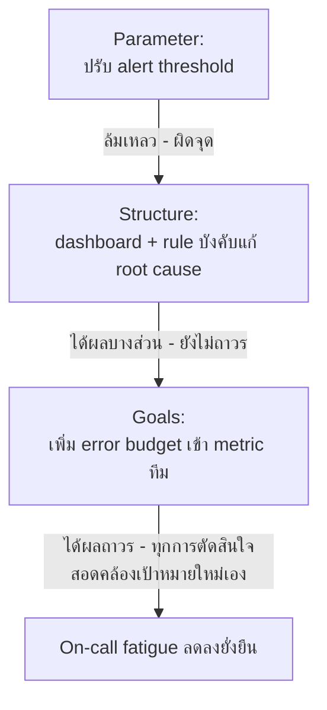

ทีม platform ของบริษัทหนึ่งเจอปัญหา on-call fatigue หนักมาก (เคสเดียวกับที่เจอในโมดูล Feedback Loops) — นี่คือบันทึกจริงว่าทีมนั้นไล่ระดับ leverage point ยังไงกว่าจะแก้ได้สำเร็จ เพื่อให้เห็นภาพว่าหลักการสองหัวข้อก่อนหน้าใช้งานจริงยังไง

## ขั้นที่ 1: แก้ Parameter (ล้มเหลว)

ทีมเริ่มจากปรับ alert threshold ให้สูงขึ้น เพื่อลดจำนวน alert ที่ปลุกคนกลางดึก — ผลคือ alert สำคัญบางตัวถูกกรองออกไปด้วย จนมี incident จริงที่ไม่มีใครรู้ตัวจนสาย **สรุป**: alert ยังคงรบกวนคนพอๆ เดิม (แค่ผิดจุด) ปัญหาหลัก (คนน้อยเกินไปเทียบกับ workload) ไม่ได้ถูกแตะเลย

## ขั้นที่ 2: แก้ Structure (ได้ผลบางส่วน)

ทีมเปลี่ยนไปแก้ information flow — สร้าง dashboard แสดง on-call load แบบ real-time ให้ผู้บริหารเห็น (ไม่ใช่แค่ทีมเห็น) และเปลี่ยน rule ให้ incident ที่เกิดซ้ำเกิน 3 ครั้ง/เดือน ต้องถูกจัดสรร sprint capacity ไปแก้ที่ต้นตอบังคับ — **ผล**: incident ลดลงจริง ทีมเริ่มมีเวลาแก้ปัญหาเชิงโครงสร้างมากขึ้น แต่ on-call ยังหนักกว่าทีมอื่นในบริษัทเห็นได้ชัด คนในทีมเริ่มขอย้ายทีมมากขึ้นเรื่อยๆ

## ขั้นที่ 3: แก้ Goals (ได้ผลถาวร)

ผู้บริหารตรวจสอบแล้วพบว่า <mark class="hl-insight">**เป้าหมายของทีม platform ถูกวัดจาก "จำนวน feature ที่ส่งได้ต่อไตรมาส" เท่านั้น ไม่มี metric เรื่อง reliability/on-call load เข้ามาเกี่ยวข้องในการประเมินผลงานเลย**</mark> — ทีมจึงมีแรงจูงใจให้ทุ่มทุกอย่างไปกับ feature ใหม่ ปล่อยให้ปัญหา reliability สะสม เพราะไม่มีผลต่อการประเมินใดๆ

พอเปลี่ยนเป้าหมายทีมให้รวม **error budget** เข้าไปด้วย (แนวทางแบบ SRE — ถ้า reliability ต่ำกว่าเป้า ต้องหยุดทำ feature ใหม่ชั่วคราวไปแก้ reliability ก่อน) ทุกการตัดสินใจของทีมเปลี่ยนทันที — เริ่มลงทุนใน automation, invest ใน on-call tooling, กระจายความรู้ไม่ให้กระจุกที่คนเดียว ไม่ต้องมีใครสั่งทีละเรื่องอีกต่อไป เพราะเป้าหมายใหม่ทำให้ทุกการตัดสินใจของทีมสอดคล้องไปในทิศทางเดียวกันเองโดยอัตโนมัติ

## บทเรียนที่นำไปใช้ได้

สังเกตว่าทีมนี้**ไม่ได้กระโดดข้ามขั้นไปแก้ goals ตั้งแต่แรก** — พวกเขาลองจาก parameter (ถูกหลักการ "ลองจากอ่อนไปแรง") แต่สิ่งที่ทำให้สำเร็จคือ**การสังเกตให้ไวว่าเมื่อไหร่ควรขยับขึ้นระดับ** แทนที่จะติดอยู่ที่การปรับ parameter/structure ไปเรื่อยๆ ไม่รู้จบ

จุดสำคัญอีกอย่างคือ leverage point ที่แรงที่สุด (goals) ในเคสนี้**ไม่ใช่การแตะโค้ดเลยสักบรรทัดเดียว** — <mark class="hl-warning">มันคือการเปลี่ยนวิธีวัดผลงาน ซึ่งเป็นสิ่งที่วิศวกรส่วนใหญ่ไม่คิดว่าตัวเองมีอำนาจไปแตะ</mark> ทั้งที่ในหลายกรณีมันคือจุดเดียวที่แก้ปัญหาได้ถาวรจริงๆ — บทเรียนนี้คือสะพานเชื่อมไปสู่โมดูลถัดไป **System Traps & Mental Models** ซึ่งจะพาไปดูว่าทำไมองค์กรถึงมักติดอยู่กับ goal ที่ผิด และแก้ไม่ได้ง่ายๆ แม้จะรู้ว่าควรแก้ตรงไหนแล้วก็ตาม
