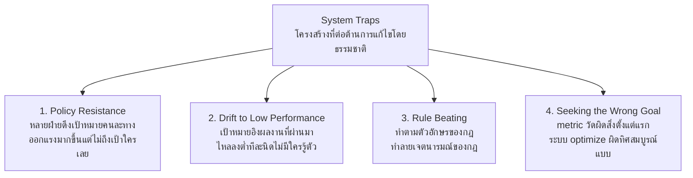

บางปัญหาไม่ได้แก้ยากเพราะซับซ้อน แต่แก้ยากเพราะ**โครงสร้างของระบบต่อต้านทุกความพยายามแก้ไข**โดยธรรมชาติ — Meadows เรียกโครงสร้างกลุ่มนี้ว่า **System Traps** กับดักที่ระบบจำนวนมากติดอยู่ซ้ำๆ ทั่วโลก ไม่ว่าจะเป็นองค์กรแบบไหนก็ตาม หัวข้อนี้จะพาไปดูสี่แบบที่พบบ่อยที่สุด

## 1. Policy Resistance — ทุกฝ่ายดึงกันไปคนละทาง จนไม่มีใครไปถึงเป้าหมายตัวเอง

เกิดขึ้นเมื่อหลายฝ่ายในระบบเดียวกันมี**เป้าหมายที่ขัดแย้งกัน** แต่ละฝ่ายพยายามดึงระบบเข้าหาเป้าหมายของตัวเอง (แต่ละฝ่ายคือ balancing loop ของตัวเอง) <mark class="hl-warning">ผลคือทุกฝ่ายต้องออกแรงมากขึ้นเรื่อยๆ เพียงเพื่อรักษาสถานะเดิมไว้ ไม่มีใครไปถึงเป้าหมายตัวเองจริงๆ สักที</mark>

ตัวอย่าง: ฝ่าย Product อยากเพิ่ม feature ให้เร็วที่สุด (ดึงไปทาง velocity) ฝ่าย Engineering อยากลด technical debt (ดึงไปทาง quality) — ถ้าไม่มีการเจรจาต่อรองเป้าหมายร่วมกันอย่างชัดเจน ทั้งสองฝ่ายจะดึงกันไปมาตลอด โดยที่ velocity ก็ไม่เร็วเท่าที่ Product อยากได้ และ quality ก็ไม่ดีเท่าที่ Engineering อยากได้ — พลังงานทั้งหมดถูกเผาไปกับการดึงกัน ไม่ใช่การไปข้างหน้า

**ทางแก้**: อย่าดึงแรงขึ้นอีก (ยิ่งดึงยิ่งเหนื่อยเปล่า) แต่ให้เจรจาหาเป้าหมายร่วมที่ทั้งสองฝ่ายยอมรับได้ (เช่น error budget ที่เจอในโมดูลก่อน คือทางแก้ policy resistance ระหว่าง feature velocity กับ reliability)

## 2. Drift to Low Performance — เป้าหมายค่อยๆ ลดลงทีละนิดจนไม่มีใครสังเกต

เกิดขึ้นเมื่อทีมตั้งเป้าหมายโดยอิงจาก**ผลงานที่ผ่านมา** (ไม่ใช่มาตรฐานสัมบูรณ์) — ถ้าผลงานแย่ลงนิดหน่อย เป้าหมายรอบถัดไปก็ถูกปรับลงตามไปด้วย "แค่นี้ก็ดีพอแล้วสำหรับตอนนี้" ทำซ้ำไปเรื่อยๆ <mark class="hl-insight">จนมาตรฐานค่อยๆ ไหลลงต่ำเรื่อยๆ โดยไม่มีจุดไหนที่รู้สึกเหมือนการตัดสินใจ "ยอมรับมาตรฐานต่ำ" อย่างชัดเจนเลยสักครั้ง</mark>

ตัวอย่าง: SLA เป้าหมาย uptime 99.9% พลาดไปเป็น 99.7% ทีมปรับเป้าใหม่เป็น 99.7% (เพราะ "realistic กว่า") ไตรมาสถัดมาพลาดอีกเป็น 99.5% ปรับเป้าลงอีก — วนแบบนี้ไปเรื่อยๆ จนมาตรฐานที่เคยตั้งไว้สูงหายไปโดยไม่มีใครตัดสินใจให้มันหายอย่างชัดเจน

**ทางแก้**: ยึดเป้าหมายไว้กับ**มาตรฐานสัมบูรณ์ที่ตายตัว** (absolute standard) ไม่ใช่ผลงานล่าสุดของตัวเอง — หรือให้เป้าหมายขยับได้แค่ทิศทางเดียว (ปรับขึ้นได้ ปรับลงไม่ได้)

## 3. Rule Beating — ทำตามตัวอักษรของกฎ แต่ทำลายเจตนารมณ์ของกฎ

เกิดขึ้นเมื่อกฎถูกออกแบบมาไม่ดีพอ จนคนหาทาง "เอาชนะ" กฎได้โดยไม่ผิดกฎจริงๆ สักข้อ แต่ผลลัพธ์ที่ได้ตรงข้ามกับเจตนารมณ์ของกฎเดิมโดยสิ้นเชิง

ตัวอย่าง: ตั้ง metric "จำนวนบั๊กที่ปิดได้ต่อสัปดาห์" เป็นตัววัดผลงาน ทีมเริ่ม close บั๊กเล็กๆ ที่ไม่สำคัญจำนวนมาก (ง่าย ปิดเร็ว ได้ตัวเลขสูง) แทนที่จะไปแก้บั๊กใหญ่ที่ยากแต่สำคัญกว่ามาก — ทำตามตัวเลขของ metric เป๊ะ แต่ทำลายเจตนารมณ์ที่แท้จริง (แก้ปัญหาที่สำคัญที่สุดก่อน)

**ทางแก้**: metric ที่ดีต้องวัด**ผลลัพธ์ (outcome)** ไม่ใช่**กิจกรรม (activity)** — วัด "customer impact ของบั๊กที่แก้" แทน "จำนวนบั๊กที่ปิด" จะยากต่อการ game มากกว่ามาก

## 4. Seeking the Wrong Goal — วัดสิ่งที่ผิด ได้พฤติกรรมที่ผิดตาม

ต่างจาก Rule Beating ตรงที่นี่ไม่ใช่การหาทางเลี่ยงกฎ แต่คือ**กฎ/metric เองตั้งแต่แรกก็วัดผิดสิ่งอยู่แล้ว** ระบบก็เลย optimize ไปในทิศที่ผิดอย่างสมบูรณ์แบบตามที่ metric สั่ง

ตัวอย่างคลาสสิก: วัดผลงาน call center จาก "จำนวนสายที่รับต่อชั่วโมง" พนักงานรีบวางสายเร็วที่สุดเพื่อรับสายต่อไปให้ได้เยอะ ลูกค้าได้รับบริการแย่ลง ทั้งที่พนักงานทุกคนทำตาม metric ที่บริษัทตั้งไว้อย่างสมบูรณ์แบบ — <mark class="hl-term">metric "ถูกต้องตามที่วัด" แต่ "ผิดตั้งแต่เลือกจะวัดอะไร"</mark>

**ทางแก้**: กลับไปถามคำถามจากโมดูลแรกสุดของ track นี้ — "purpose ที่แท้จริงของระบบคืออะไร ดูจากพฤติกรรม ไม่ใช่คำประกาศ" แล้วเช็คว่า metric ที่ตั้งไว้สะท้อน purpose นั้นจริงหรือเปล่า

หัวข้อถัดไปจะพาไปดู trap อีกแบบที่ลึกกว่านี้ — ปัญหาที่เกิดจากการตัดสินใจว่า **"ระบบ" ที่กำลังวิเคราะห์อยู่มีขอบเขตแค่ไหน** ซึ่งเป็นรากของ trap หลายแบบที่เจอมาแล้วในโมดูลนี้และก่อนหน้า
